- Machine Name: Cap
- OS Type: Linux
- Difficulty: Easy

### About Info

## Port Scanning - Service and version enumeration

```powershell

```

## Enumeration

### Port 80/HTTP

we found Port 80 is open on target let’s brows the website on firefox

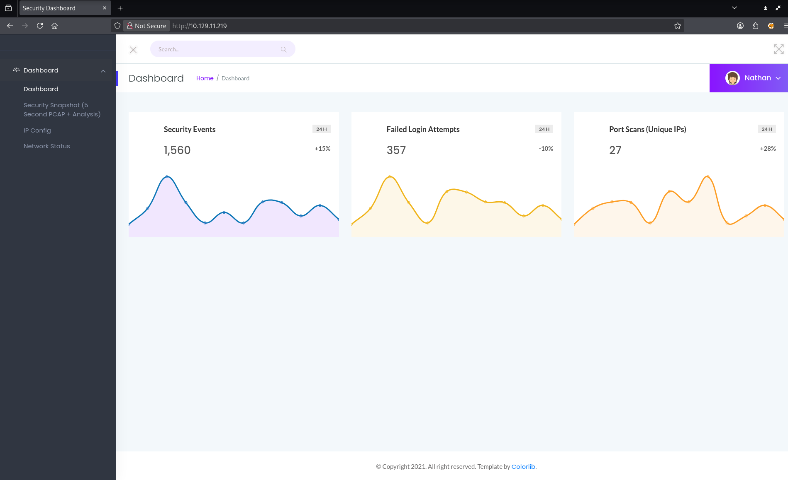

if we click on security snapshot button we can see that we’ve given with the page that has /data/1

and it is showing the captured data

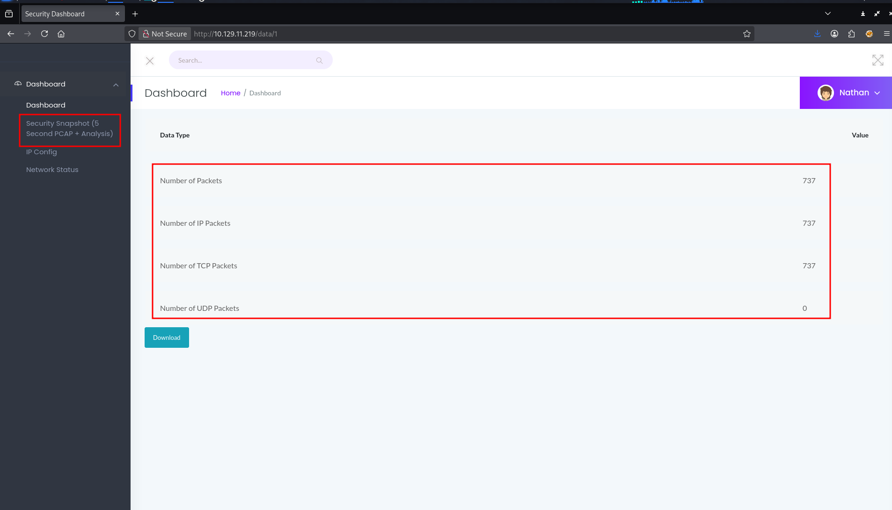

when we click on download the pcap (**packet capture)** file downloads we can view it via wireshark

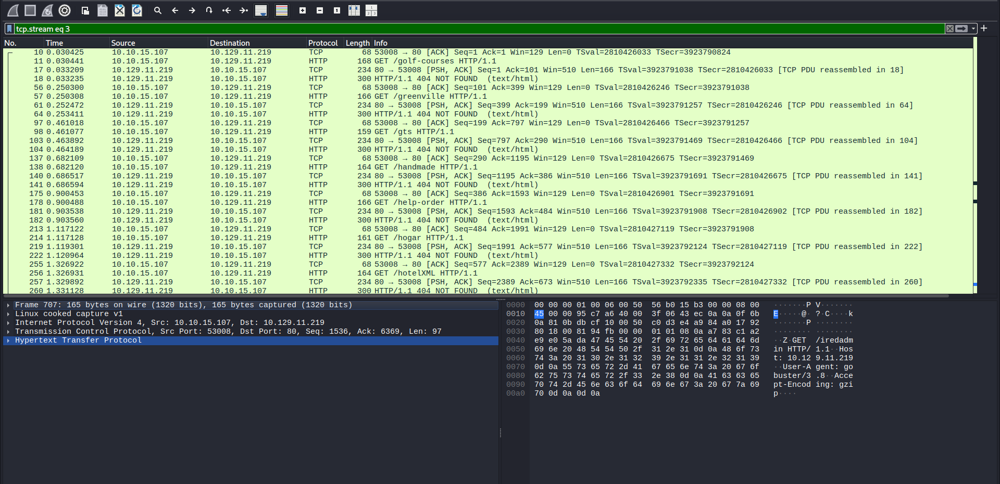

but we can see that the /data/ has refrrence of ID of the pcap files so i’ve tried change the id to 2 and i got another scan!!

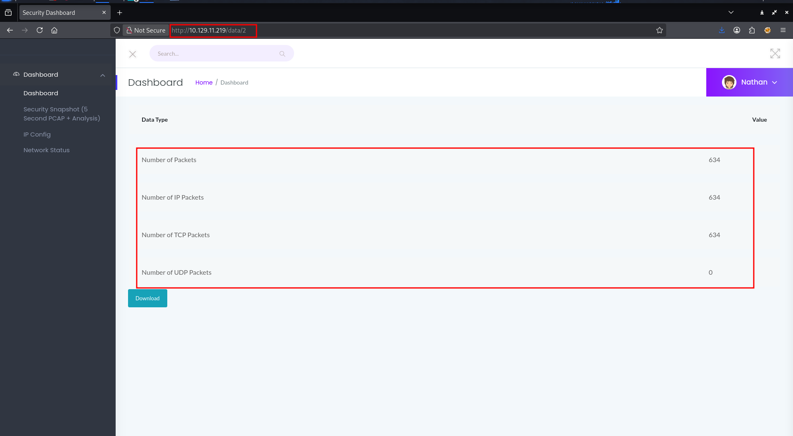

D’you see that?? let’s try to get some other scans, i got 3.pcap but 4.pac redirect us to dashboard means 404!
let’s try id 0; ;)

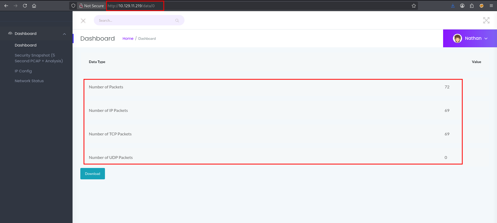

Hmm!! might interesting ;)

let’s open that up in wireshark

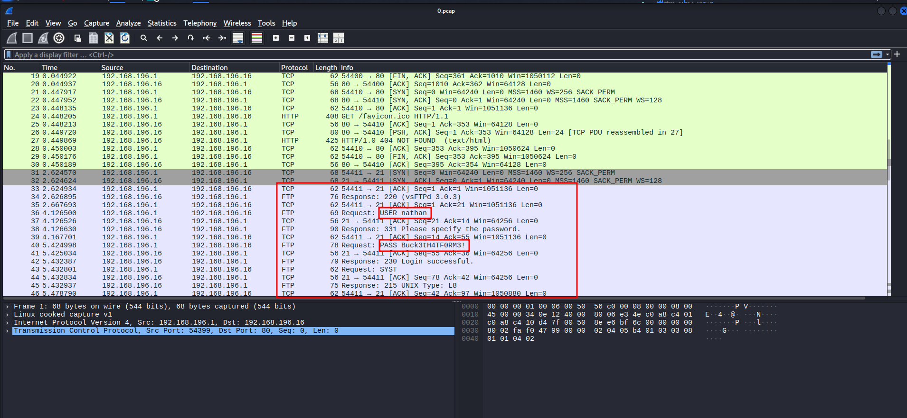

Bingo look who’s here! FTP is always fun with wireshark.

```powershell
nathan:Buck3tH4TF0RM3!
```

use that password to login to SSH

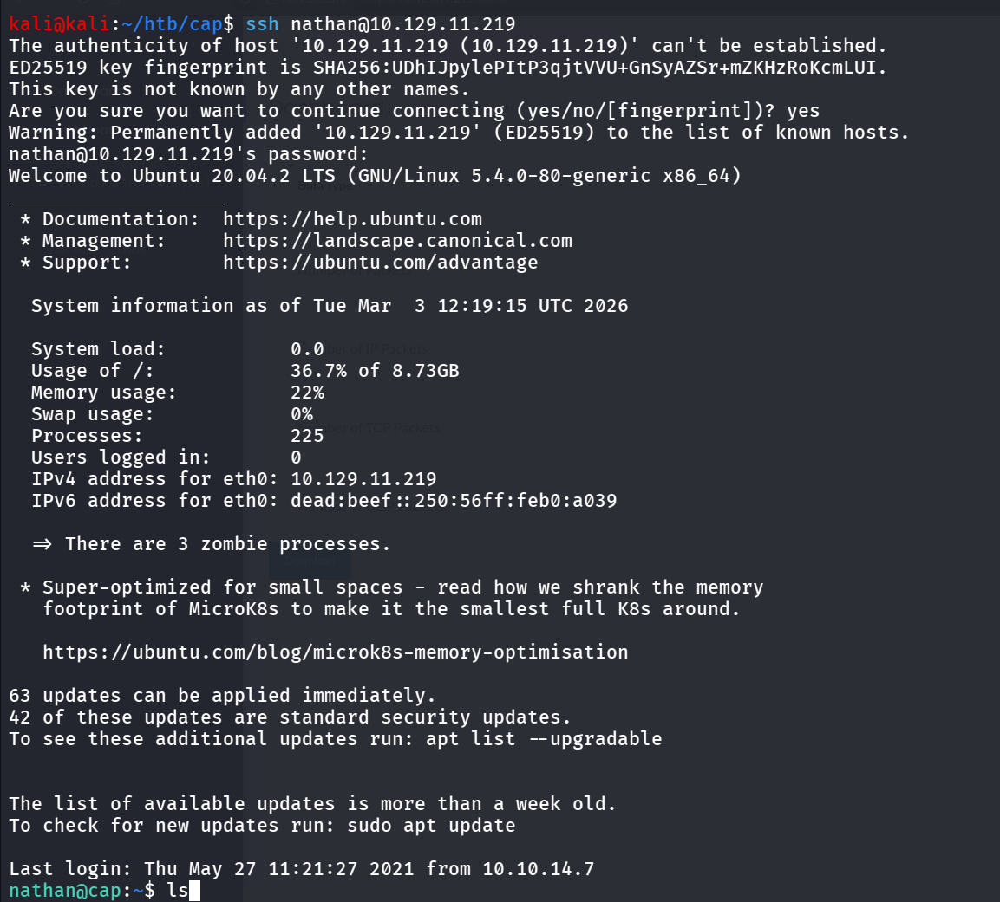

and Bingo!!

### Port 21/FTP

we’ve also obeserved that FTP port is open let’s try to check anonymous login

```powershell
ftp 10.129.11.219
```

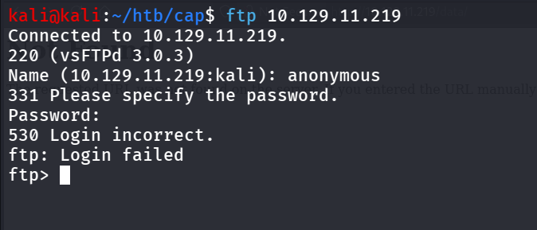

with nathan’s creds i’ve tried to do login in ftp 

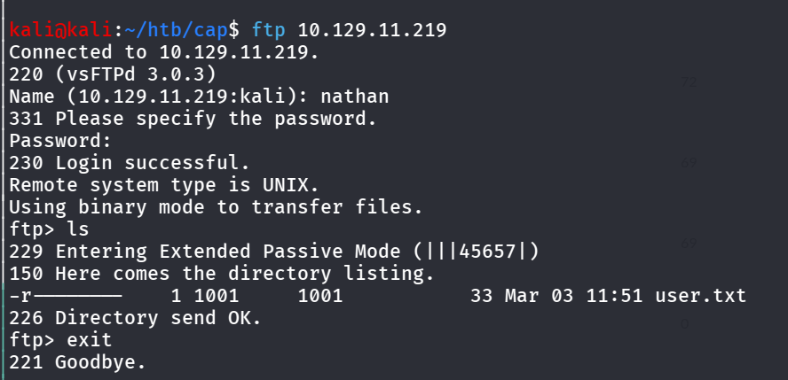

Nothing much interesting it’s nathan’s home dir.

## Privilege Escalation

the name of the machine is cap so we assume that the capabilities is the possible way to privesc, let’s enumerate the capabilities of processes/utilities

```powershell
getcap -r / 2>/dev/null
```

*is used in Linux systems to **recursively list file capabilities** starting from the root directory.*

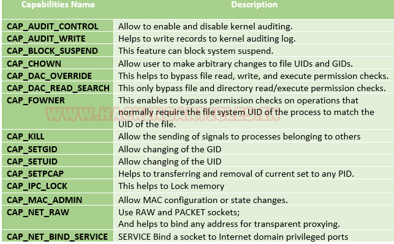

https://www.hackingarticles.in/linux-privilege-escalation-using-capabilities/

we found that the python has cap_setuid, allows us to change the UID while running the program so we can change the UID to 0 (root) and spawn a shell 

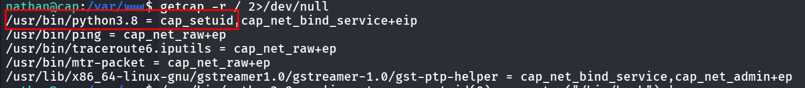

we ran below command to do so

```powershell
/usr/bin/python3.8 -c 'import os;os.setuid(0);os.system("/bin/bash");'
```

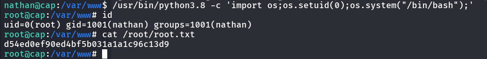