- Machine Name: Keeper
- OS type: Linux
- Difficulty: Easy

### Port Scanning - Service & Version Enumeration

```bash
	PORT   STATE SERVICE REASON         VERSION
22/tcp open  ssh     syn-ack ttl 63 OpenSSH 8.9p1 Ubuntu 3ubuntu0.3 (Ubuntu Linux; protocol 2.0)
| ssh-hostkey: 
|   256 35:39:d4:39:40:4b:1f:61:86:dd:7c:37:bb:4b:98:9e (ECDSA)
| ecdsa-sha2-nistp256 AAAAE2VjZHNhLXNoYTItbmlzdHAyNTYAAAAIbmlzdHAyNTYAAABBBKHZRUyrg9VQfKeHHT6CZwCwu9YkJosNSLvDmPM9EC0iMgHj7URNWV3LjJ00gWvduIq7MfXOxzbfPAqvm2ahzTc=
|   256 1a:e9:72:be:8b:b1:05:d5:ef:fe:dd:80:d8:ef:c0:66 (ED25519)
|_ssh-ed25519 AAAAC3NzaC1lZDI1NTE5AAAAIBe5w35/5klFq1zo5vISwwbYSVy1Zzy+K9ZCt0px+goO
80/tcp open  http    syn-ack ttl 63 nginx 1.18.0 (Ubuntu)
| http-methods: 
|_  Supported Methods: GET HEAD
|_http-title: Site doesn't have a title (text/html).
|_http-server-header: nginx/1.18.0 (Ubuntu)
Service Info: OS: Linux; CPE: cpe:/o:linux:linux_kernel
```

## Enumeration

### Port 80/HTTP

i’ll start my enumeration from port 80, by visiting site in the firefox

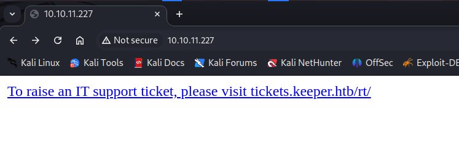

i’ll quickly add the tickets.keeper.htb in /etc/hosts file

and then i’ll visit the the tickets.keeper.htb and i found the login page

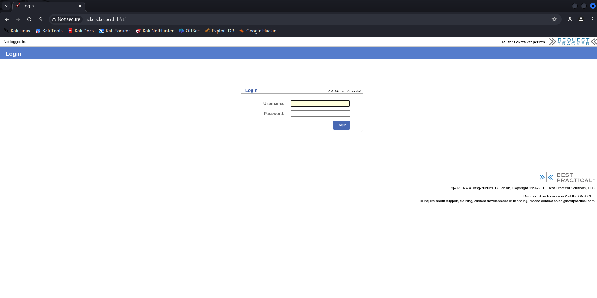

i’ll immediately search for the default credentials 

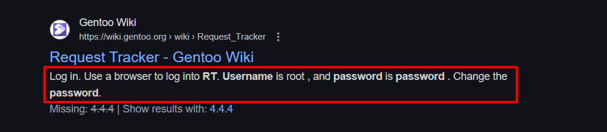

i found the default credentials - **root:password**

let’s login to application

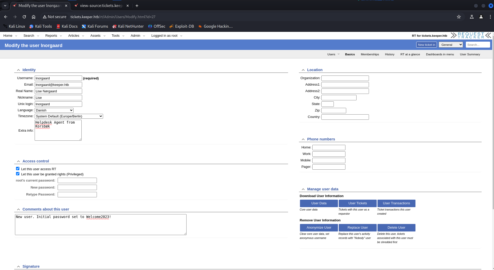

we are in.., enumerating the request tracker applicaiton after login, i found the users section and there was a user named **lnorgaard** when we click on the username we found password on it’s comment section

found the credentials **inorgaard:Welcome2023!**

what now! yes SSH to the machine as inorgaard

```bash
ssh **inorgaard@10.10.11.227**
```

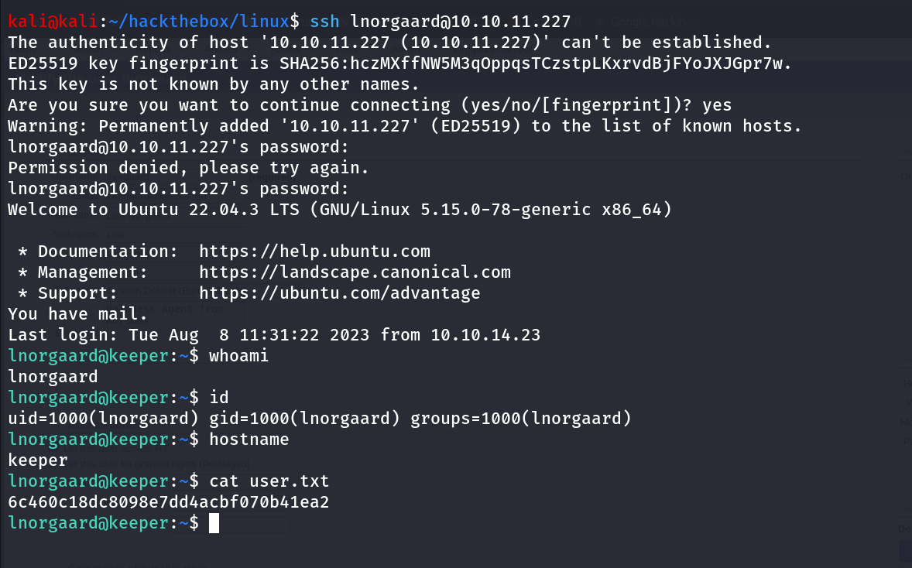

## Post-Enum

### Sudo -l

i’ll always first check for sudo permissions using `sudo -l` 

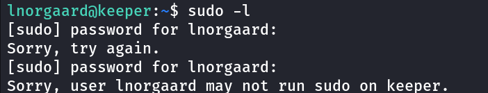

check for the SUID binaries

```bash
find / -type f -perm -4000 2>/dev/nul
```

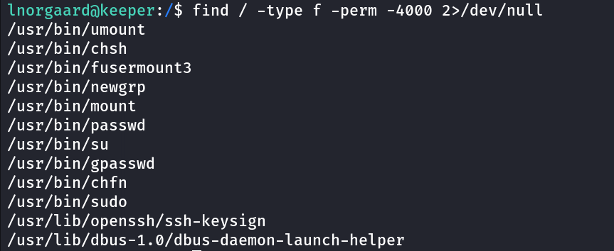

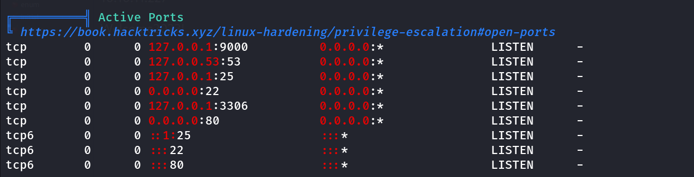

the SMTP is running internally so it is worth to check the mail, /var/mail/lnorgaard 

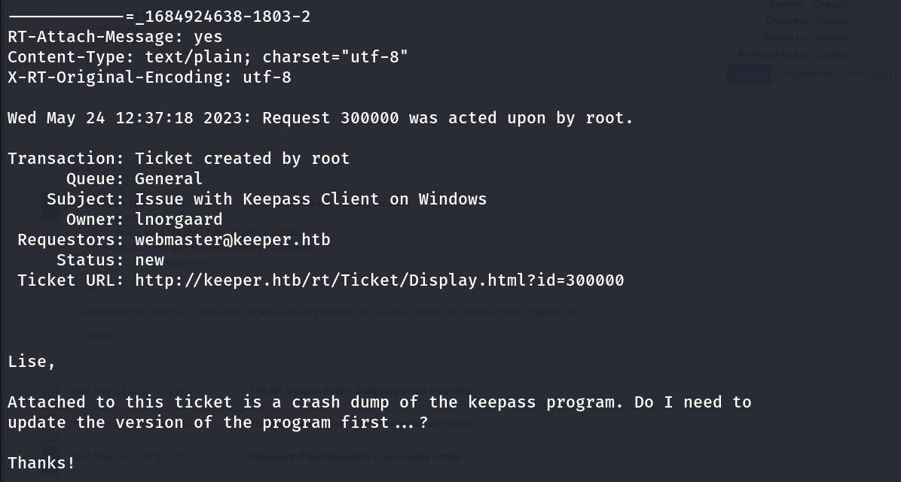

ticket id shows is 300000

visit the request tracker again and go to Search > Tickets > Simple search

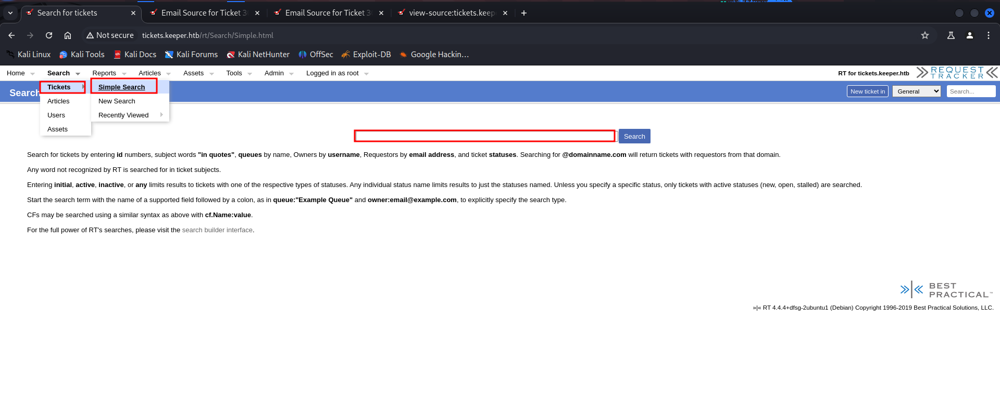

enter the ID and click on search

reading the thread i found the useful information 

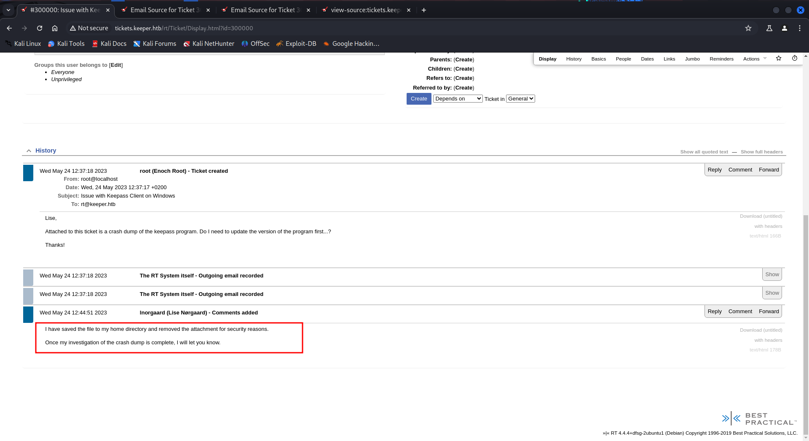

it says that user saved the keepass crashdump in user’s home directory

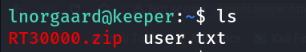

i’ll start the python3 server on target machine using `python3 -m http.server 8000` 

and use wget from kali to transfer RT30000.zip file to kali

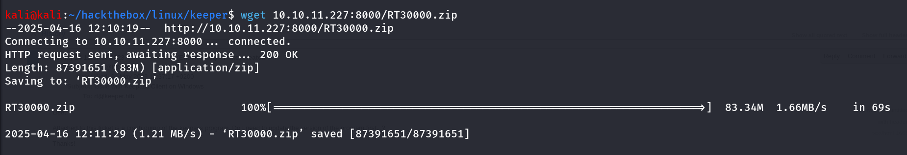

unzip the file 

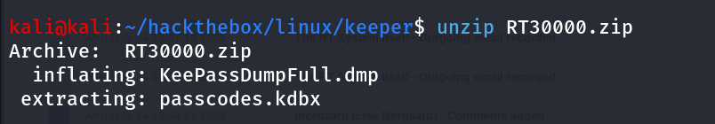

i found the Dump of the keepass and the keepass database, after some searching on google i found that we can extract master password from the dump file

[https://github.com/JorianWoltjer/keepass-dump-extractor](https://github.com/JorianWoltjer/keepass-dump-extractor)

install tool using `cargo install keepass-dump-extractor` 

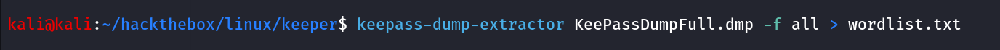

create a hash of the database file that we can use to crack the hash

```bash
keepass2john keepass.kdbx > keepass.hash
```

crack the hash using hashcat after modifying the hash and remove the **keepass** word

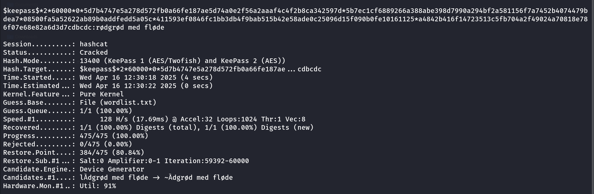

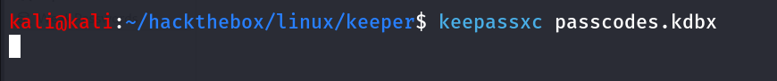

use the master password → `rødgrød med fløde` 

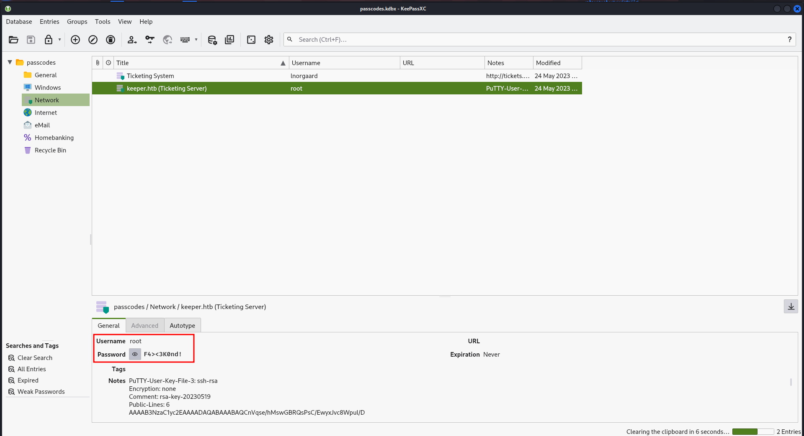

Bingo!! we found root password, but ssh not working

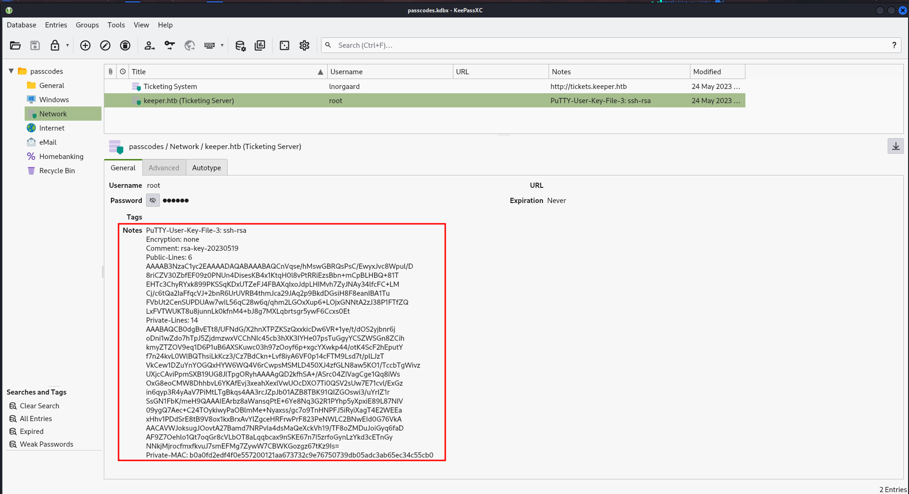

also i found the private key in the notes section, upon searching google i found that we can use this key with putty tool to connect with ssh save the file with .ppk extension run putty with `putty` 

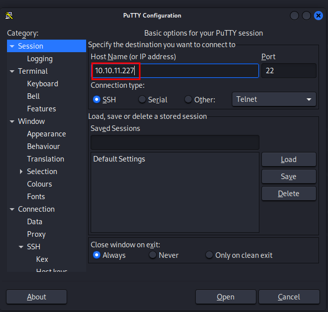

to add the private key for authentication go to **Window > Connection > SSH > Auth > Credentials and browse for the file and upload the key file here**

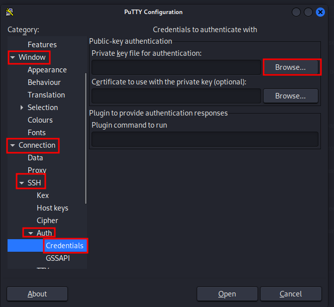

click on **open** 


and got SSH as root!

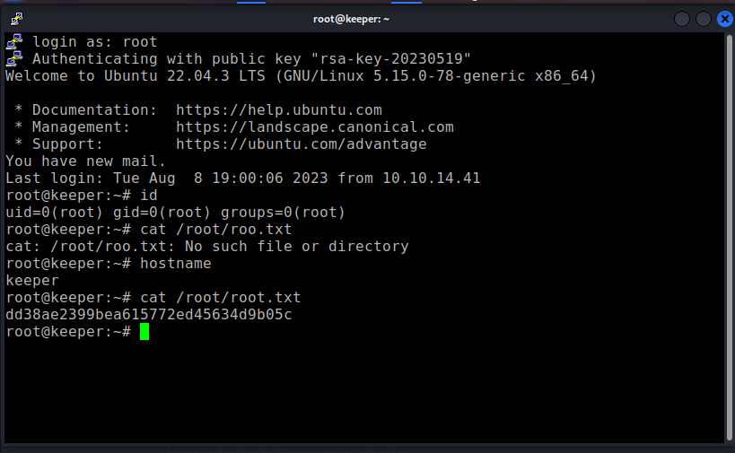